# 线性布局 (Row/Column)
<!--Kit: ArkUI-->
<!--Subsystem: ArkUI-->
<!--Owner: @camlostshi-->
<!--Designer: @lanshouren-->
<!--Tester: @liuli0427-->
<!--Adviser: @Brilliantry_Rui-->


## 概述

线性布局（LinearLayout）是开发中最常用的布局，通过线性容器[Row](../reference/apis-arkui/arkui-ts/ts-container-row.md)和[Column](../reference/apis-arkui/arkui-ts/ts-container-column.md)构建。线性布局是其他布局的基础，其子元素在线性方向上（水平方向和垂直方向）依次排列。线性布局的排列方向由所选容器组件决定，Row容器内子元素按照水平方向排列，Column容器内子元素按照垂直方向排列。根据不同的排列方向，开发者可选择使用Row或Column容器创建线性布局。

>  **说明：**
>
>  在复杂界面中使用多组件嵌套时，若布局组件的嵌套层数过深或嵌套的组件数量过多，将会产生额外开销。建议通过移除冗余节点、利用布局边界减少布局计算、合理采用渲染控制语法及布局组件方法来优化性能。最佳实践请参考[布局优化指导](https://developer.huawei.com/consumer/cn/doc/best-practices/bpta-improve-layout-performance)。


  **图1** Column容器内子元素排列示意图


  **图2** Row容器内子元素排列示意图


## 基本概念

- 布局容器：具有布局能力的容器组件，可以承载其他元素作为其子元素，布局容器会对其子元素进行尺寸计算和布局排列。

- 布局子元素：布局容器内部的元素。

- 主轴：线性布局容器在布局方向上的轴线，子元素默认沿主轴排列。Row容器主轴为水平方向，Column容器主轴为垂直方向（图示可参考弹性布局[基本概念](./arkts-layout-development-flex-layout.md#基本概念)中的主轴）。

- 交叉轴：垂直于主轴方向的轴线。Row容器交叉轴为垂直方向，Column容器交叉轴为水平方向（图示可参考弹性布局[基本概念](./arkts-layout-development-flex-layout.md#基本概念)中的交叉轴）。

- 间距：布局子元素的间距。


## 布局子元素在排列方向上的间距

在布局容器内，可以通过[Row](../reference/apis-arkui/arkui-ts/ts-container-row.md)组件的[space](../reference/apis-arkui/arkui-ts/ts-container-row.md#rowoptions18对象说明)属性或[Column](../reference/apis-arkui/arkui-ts/ts-container-column.md)组件的[space](../reference/apis-arkui/arkui-ts/ts-container-column.md#columnoptions18对象说明)设置排列方向上子元素的间距，使各子元素在排列方向上有等间距效果。


### Column容器内排列方向上的间距

  **图3** Column容器内排列方向的间距图


ArkTS-Dyn示例：

<!-- @[ColumnLayoutExample_start](https://gitcode.com/openharmony/applications_app_samples/blob/master/code/DocsSample/ArkUISample/MultipleLayoutProject/entry/src/main/ets/pages/linearlayout/ColumnLayoutExample.ets) -->

``` TypeScript
Column({ space: 20 }) {
  Text('space: 20').fontSize(15).fontColor(Color.Gray).width('90%')
  Row().width('90%').height(50).backgroundColor(0xF5DEB3)
  Row().width('90%').height(50).backgroundColor(0xD2B48C)
  Row().width('90%').height(50).backgroundColor(0xF5DEB3)
}.width('100%')
```

ArkTS-Sta示例：

<!-- @[ColumnLayoutExample_start](https://gitcode.com/openharmony/applications_app_samples/blob/OpenHarmony_feature_sta_20260331/code/DocsSample/ArkUISample-Sta/MultipleLayoutProject/entry/src/main/ets/pages/linearlayout/ColumnLayoutExample.ets) -->

``` TypeScript
Column({ space: 20 } as ColumnOptions) {
  Text('space: 20').fontSize(15).fontColor(Color.Gray).width('90%')
  Row().width('90%').height(50).backgroundColor(0xF5DEB3)
  Row().width('90%').height(50).backgroundColor(0xD2B48C)
  Row().width('90%').height(50).backgroundColor(0xF5DEB3)
}.width('100%')
```


### Row容器内排列方向上的间距

  **图4** Row容器内排列方向的间距图


ArkTS-Dyn示例：

<!-- @[RowLayoutExample_start](https://gitcode.com/openharmony/applications_app_samples/blob/master/code/DocsSample/ArkUISample/MultipleLayoutProject/entry/src/main/ets/pages/linearlayout/RowLayoutExample.ets) -->

``` TypeScript
Row({ space: 35 }) {
  Text('space: 35').fontSize(15).fontColor(Color.Gray)
  Row().width('10%').height(150).backgroundColor(0xF5DEB3)
  Row().width('10%').height(150).backgroundColor(0xD2B48C)
  Row().width('10%').height(150).backgroundColor(0xF5DEB3)
}.width('90%')
```

ArkTS-Sta示例：

<!-- @[RowLayoutExample_start](https://gitcode.com/openharmony/applications_app_samples/blob/OpenHarmony_feature_sta_20260331/code/DocsSample/ArkUISample-Sta/MultipleLayoutProject/entry/src/main/ets/pages/linearlayout/RowLayoutExample.ets) -->

``` TypeScript
Row({ space: 35 } as RowOptions) {
  Text('space: 35').fontSize(15).fontColor(Color.Gray)
  Row().width('10%').height(150).backgroundColor(0xF5DEB3)
  Row().width('10%').height(150).backgroundColor(0xD2B48C)
  Row().width('10%').height(150).backgroundColor(0xF5DEB3)
}.width('90%')
```


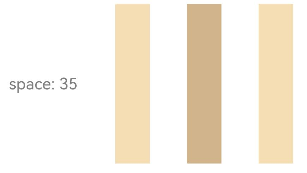

## 布局子元素在主轴上的排列方式

在布局容器内，可以通过[justifyContent](../reference/apis-arkui/arkui-ts/ts-container-column.md#justifycontent8)属性设置子元素在容器主轴上的排列方式。可以从主轴起始位置开始排布，也可以从主轴结束位置开始排布，或者均匀分割主轴的空间。


### Column容器内子元素在垂直方向上的排列

  **图5** Column容器内子元素在垂直方向上的排列图 

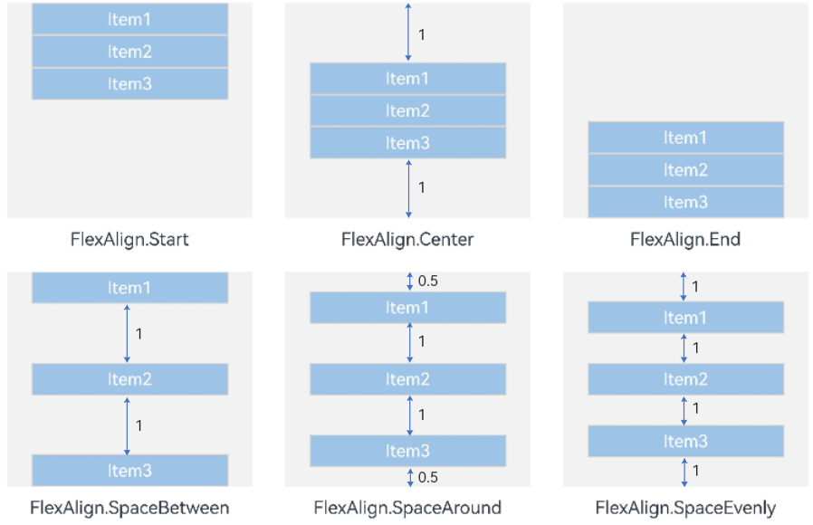

- justifyContent(FlexAlign.Start，默认值)：元素在垂直方向首端对齐，第一个元素与行首对齐，同时后续的元素与前一个对齐。

  ArkTS-Dyn示例：

  <!-- @[ColumnLayoutJustifyContentStart_start](https://gitcode.com/openharmony/applications_app_samples/blob/master/code/DocsSample/ArkUISample/MultipleLayoutProject/entry/src/main/ets/pages/linearlayout/ColumnLayoutJustifyContentStart.ets) -->
  
  ``` TypeScript
  Column({}) {
    Column() {
    }.width('80%').height(50).backgroundColor(0xF5DEB3)
  
    Column() {
    }.width('80%').height(50).backgroundColor(0xD2B48C)
  
    Column() {
    }.width('80%').height(50).backgroundColor(0xF5DEB3)
  }.width('100%').height(300).backgroundColor('rgb(242,242,242)').justifyContent(FlexAlign.Start)
  ```

  ArkTS-Sta示例：

  <!-- @[ColumnLayoutJustifyContentStart_start](https://gitcode.com/openharmony/applications_app_samples/blob/OpenHarmony_feature_sta_20260331/code/DocsSample/ArkUISample-Sta/MultipleLayoutProject/entry/src/main/ets/pages/linearlayout/ColumnLayoutJustifyContentStart.ets) -->
  
  ``` TypeScript
  Column() {
    Column() {
    }.width('80%').height(50).backgroundColor(0xF5DEB3)
  
    Column() {
    }.width('80%').height(50).backgroundColor(0xD2B48C)
  
    Column() {
    }.width('80%').height(50).backgroundColor(0xF5DEB3)
  }.width('100%').height(300).backgroundColor('rgb(242,242,242)').justifyContent(FlexAlign.Start)
  ```


  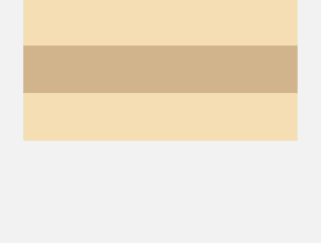

- justifyContent(FlexAlign.Center)：元素在垂直方向中心对齐，第一个元素与行首的距离与最后一个元素与行尾距离相同。

  ArkTS-Dyn示例：

  <!-- @[ColumnLayoutJustifyContentCenter_start](https://gitcode.com/openharmony/applications_app_samples/blob/master/code/DocsSample/ArkUISample/MultipleLayoutProject/entry/src/main/ets/pages/linearlayout/ColumnLayoutJustifyContentCenter.ets) -->
  
  ``` TypeScript
  Column({}) {
    Column() {
    }.width('80%').height(50).backgroundColor(0xF5DEB3)
  
    Column() {
    }.width('80%').height(50).backgroundColor(0xD2B48C)
  
    Column() {
    }.width('80%').height(50).backgroundColor(0xF5DEB3)
  }.width('100%').height(300).backgroundColor('rgb(242,242,242)').justifyContent(FlexAlign.Center)
  ```

  ArkTS-Sta示例：

  <!-- @[ColumnLayoutJustifyContentCenter_start](https://gitcode.com/openharmony/applications_app_samples/blob/OpenHarmony_feature_sta_20260331/code/DocsSample/ArkUISample-Sta/MultipleLayoutProject/entry/src/main/ets/pages/linearlayout/ColumnLayoutJustifyContentCenter.ets) -->
  
  ``` TypeScript
  Column() {
    Column() {
    }.width('80%').height(50).backgroundColor(0xF5DEB3)
  
    Column() {
    }.width('80%').height(50).backgroundColor(0xD2B48C)
  
    Column() {
    }.width('80%').height(50).backgroundColor(0xF5DEB3)
  }.width('100%').height(300).backgroundColor('rgb(242,242,242)').justifyContent(FlexAlign.Center)
  ```


  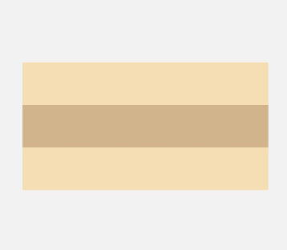

- justifyContent(FlexAlign.End)：元素在垂直方向尾部对齐，最后一个元素与行尾对齐，其他元素与后一个对齐。

  ArkTS-Dyn示例：

  <!-- @[ColumnLayoutJustifyContentEnd_start](https://gitcode.com/openharmony/applications_app_samples/blob/master/code/DocsSample/ArkUISample/MultipleLayoutProject/entry/src/main/ets/pages/linearlayout/ColumnLayoutJustifyContentEnd.ets) -->
  
  ``` TypeScript
  Column({}) {
    Column() {
    }.width('80%').height(50).backgroundColor(0xF5DEB3)
  
    Column() {
    }.width('80%').height(50).backgroundColor(0xD2B48C)
  
    Column() {
    }.width('80%').height(50).backgroundColor(0xF5DEB3)
  }.width('100%').height(300).backgroundColor('rgb(242,242,242)').justifyContent(FlexAlign.End)
  ```

  ArkTS-Sta示例：

  <!-- @[ColumnLayoutJustifyContentEnd_start](https://gitcode.com/openharmony/applications_app_samples/blob/OpenHarmony_feature_sta_20260331/code/DocsSample/ArkUISample-Sta/MultipleLayoutProject/entry/src/main/ets/pages/linearlayout/ColumnLayoutJustifyContentEnd.ets) -->
  
  ``` TypeScript
  Column() {
    Column() {
    }.width('80%').height(50).backgroundColor(0xF5DEB3)
  
    Column() {
    }.width('80%').height(50).backgroundColor(0xD2B48C)
  
    Column() {
    }.width('80%').height(50).backgroundColor(0xF5DEB3)
  }.width('100%').height(300).backgroundColor('rgb(242,242,242)').justifyContent(FlexAlign.End)
  ```


  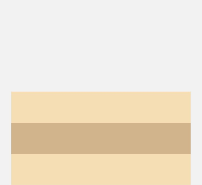

- justifyContent(FlexAlign.SpaceBetween)：垂直方向均匀分配元素，相邻元素之间距离相同。第一个元素与行首对齐，最后一个元素与行尾对齐。

  ArkTS-Dyn示例：

  <!-- @[ColumnLayoutJustifyContentSpaceBetween_start](https://gitcode.com/openharmony/applications_app_samples/blob/master/code/DocsSample/ArkUISample/MultipleLayoutProject/entry/src/main/ets/pages/linearlayout/ColumnLayoutJustifyContentSpaceBetween.ets) -->
  
  ``` TypeScript
  Column({}) {
    Column() {
    }.width('80%').height(50).backgroundColor(0xF5DEB3)
  
    Column() {
    }.width('80%').height(50).backgroundColor(0xD2B48C)
  
    Column() {
    }.width('80%').height(50).backgroundColor(0xF5DEB3)
  }.width('100%').height(300).backgroundColor('rgb(242,242,242)').justifyContent(FlexAlign.SpaceBetween)
  ```

  ArkTS-Sta示例：

  <!-- @[ColumnLayoutJustifyContentSpaceBetween_start](https://gitcode.com/openharmony/applications_app_samples/blob/OpenHarmony_feature_sta_20260331/code/DocsSample/ArkUISample-Sta/MultipleLayoutProject/entry/src/main/ets/pages/linearlayout/ColumnLayoutJustifyContentSpaceBetween.ets) -->
  
  ``` TypeScript
  Column() {
    Column() {
    }.width('80%').height(50).backgroundColor(0xF5DEB3)
  
    Column() {
    }.width('80%').height(50).backgroundColor(0xD2B48C)
  
    Column() {
    }.width('80%').height(50).backgroundColor(0xF5DEB3)
  }.width('100%').height(300).backgroundColor('rgb(242,242,242)').justifyContent(FlexAlign.SpaceBetween)
  ```


  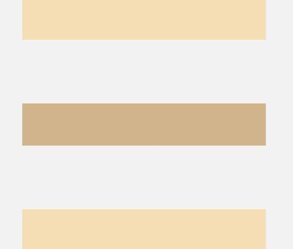

- justifyContent(FlexAlign.SpaceAround)：垂直方向均匀分配元素，相邻元素之间距离相同。第一个元素到行首的距离和最后一个元素到行尾的距离是相邻元素之间距离的一半。

  ArkTS-Dyn示例：

  <!-- @[ColumnLayoutJustifyContentSpaceAround_start](https://gitcode.com/openharmony/applications_app_samples/blob/master/code/DocsSample/ArkUISample/MultipleLayoutProject/entry/src/main/ets/pages/linearlayout/ColumnLayoutJustifyContentSpaceAround.ets) -->
  
  ``` TypeScript
  Column({}) {
    Column() {
    }.width('80%').height(50).backgroundColor(0xF5DEB3)
  
    Column() {
    }.width('80%').height(50).backgroundColor(0xD2B48C)
  
    Column() {
    }.width('80%').height(50).backgroundColor(0xF5DEB3)
  }.width('100%').height(300).backgroundColor('rgb(242,242,242)').justifyContent(FlexAlign.SpaceAround)
  ```

  ArkTS-Sta示例：

  <!-- @[ColumnLayoutJustifyContentSpaceAround_start](https://gitcode.com/openharmony/applications_app_samples/blob/OpenHarmony_feature_sta_20260331/code/DocsSample/ArkUISample-Sta/MultipleLayoutProject/entry/src/main/ets/pages/linearlayout/ColumnLayoutJustifyContentSpaceAround.ets) -->
  
  ``` TypeScript
  Column() {
    Column() {
    }.width('80%').height(50).backgroundColor(0xF5DEB3)
  
    Column() {
    }.width('80%').height(50).backgroundColor(0xD2B48C)
  
    Column() {
    }.width('80%').height(50).backgroundColor(0xF5DEB3)
  }.width('100%').height(300).backgroundColor('rgb(242,242,242)').justifyContent(FlexAlign.SpaceAround)
  ```


  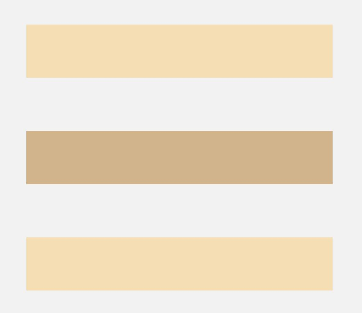

- justifyContent(FlexAlign.SpaceEvenly)：垂直方向均匀分配元素，相邻元素之间的距离、第一个元素与行首的间距、最后一个元素到行尾的间距都完全一样。

  ArkTS-Dyn示例：

  <!-- @[ColumnLayoutJustifyContentSpaceEvenly_start](https://gitcode.com/openharmony/applications_app_samples/blob/master/code/DocsSample/ArkUISample/MultipleLayoutProject/entry/src/main/ets/pages/linearlayout/ColumnLayoutJustifyContentSpaceEvenly.ets) -->
  
  ``` TypeScript
  Column({}) {
    Column() {
    }.width('80%').height(50).backgroundColor(0xF5DEB3)
  
    Column() {
    }.width('80%').height(50).backgroundColor(0xD2B48C)
  
    Column() {
    }.width('80%').height(50).backgroundColor(0xF5DEB3)
  }.width('100%').height(300).backgroundColor('rgb(242,242,242)').justifyContent(FlexAlign.SpaceEvenly)
  ```

  ArkTS-Sta示例：

  <!-- @[ColumnLayoutJustifyContentSpaceEvenly_start](https://gitcode.com/openharmony/applications_app_samples/blob/OpenHarmony_feature_sta_20260331/code/DocsSample/ArkUISample-Sta/MultipleLayoutProject/entry/src/main/ets/pages/linearlayout/ColumnLayoutJustifyContentSpaceEvenly.ets) -->
  
  ``` TypeScript
  Column() {
    Column() {
    }.width('80%').height(50).backgroundColor(0xF5DEB3)
  
    Column() {
    }.width('80%').height(50).backgroundColor(0xD2B48C)
  
    Column() {
    }.width('80%').height(50).backgroundColor(0xF5DEB3)
  }.width('100%').height(300).backgroundColor('rgb(242,242,242)').justifyContent(FlexAlign.SpaceEvenly)
  ```


  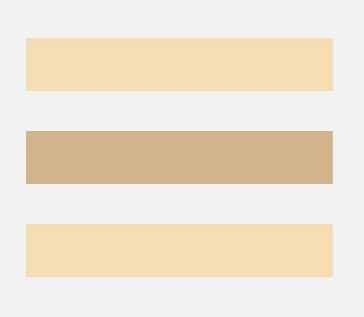


### Row容器内子元素在水平方向上的排列

  **图6** Row容器内子元素在水平方向上的排列图  


- justifyContent(FlexAlign.Start，默认值)：元素在水平方向首端对齐，第一个元素与行首对齐，同时后续的元素与前一个对齐。

  ArkTS-Dyn示例：

  <!-- @[RowLayoutJustifyContentStart_start](https://gitcode.com/openharmony/applications_app_samples/blob/master/code/DocsSample/ArkUISample/MultipleLayoutProject/entry/src/main/ets/pages/linearlayout/RowLayoutJustifyContentStart.ets) -->
  
  ``` TypeScript
  Row({}) {
    Column() {
    }.width('20%').height(30).backgroundColor(0xF5DEB3)
  
    Column() {
    }.width('20%').height(30).backgroundColor(0xD2B48C)
  
    Column() {
    }.width('20%').height(30).backgroundColor(0xF5DEB3)
  }.width('100%').height(200).backgroundColor('rgb(242,242,242)').justifyContent(FlexAlign.Start)
  ```

  ArkTS-Sta示例：

  <!-- @[RowLayoutJustifyContentStart_start](https://gitcode.com/openharmony/applications_app_samples/blob/OpenHarmony_feature_sta_20260331/code/DocsSample/ArkUISample-Sta/MultipleLayoutProject/entry/src/main/ets/pages/linearlayout/RowLayoutJustifyContentStart.ets) -->
  
  ``` TypeScript
  Row() {
    Column() {
    }.width('20%').height(30).backgroundColor(0xF5DEB3)
  
    Column() {
    }.width('20%').height(30).backgroundColor(0xD2B48C)
  
    Column() {
    }.width('20%').height(30).backgroundColor(0xF5DEB3)
  }.width('100%').height(200).backgroundColor('rgb(242,242,242)').justifyContent(FlexAlign.Start)
  ```


  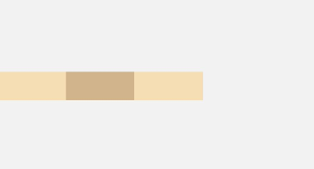

- justifyContent(FlexAlign.Center)：元素在水平方向中心对齐，第一个元素与行首的距离与最后一个元素与行尾距离相同。

  ArkTS-Dyn示例：

  <!-- @[RowLayoutJustifyContentCenter_start](https://gitcode.com/openharmony/applications_app_samples/blob/master/code/DocsSample/ArkUISample/MultipleLayoutProject/entry/src/main/ets/pages/linearlayout/RowLayoutJustifyContentCenter.ets) -->
  
  ``` TypeScript
  Row({}) {
    Column() {
    }.width('20%').height(30).backgroundColor(0xF5DEB3)
  
    Column() {
    }.width('20%').height(30).backgroundColor(0xD2B48C)
  
    Column() {
    }.width('20%').height(30).backgroundColor(0xF5DEB3)
  }.width('100%').height(200).backgroundColor('rgb(242,242,242)').justifyContent(FlexAlign.Center)
  ```

  ArkTS-Sta示例：

  <!-- @[RowLayoutJustifyContentCenter_start](https://gitcode.com/openharmony/applications_app_samples/blob/OpenHarmony_feature_sta_20260331/code/DocsSample/ArkUISample-Sta/MultipleLayoutProject/entry/src/main/ets/pages/linearlayout/RowLayoutJustifyContentCenter.ets) -->
  
  ``` TypeScript
  Row() {
    Column() {
    }.width('20%').height(30).backgroundColor(0xF5DEB3)
  
    Column() {
    }.width('20%').height(30).backgroundColor(0xD2B48C)
  
    Column() {
    }.width('20%').height(30).backgroundColor(0xF5DEB3)
  }.width('100%').height(200).backgroundColor('rgb(242,242,242)').justifyContent(FlexAlign.Center)
  ```


  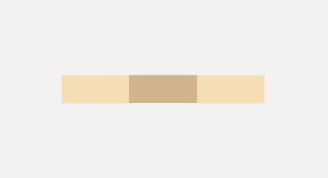

- justifyContent(FlexAlign.End)：元素在水平方向尾部对齐，最后一个元素与行尾对齐，其他元素与后一个对齐。

  ArkTS-Dyn示例：

  <!-- @[RowLayoutJustifyContentEnd_start](https://gitcode.com/openharmony/applications_app_samples/blob/master/code/DocsSample/ArkUISample/MultipleLayoutProject/entry/src/main/ets/pages/linearlayout/RowLayoutJustifyContentEnd.ets) -->
  
  ``` TypeScript
  Row({}) {
    Column() {
    }.width('20%').height(30).backgroundColor(0xF5DEB3)
  
    Column() {
    }.width('20%').height(30).backgroundColor(0xD2B48C)
  
    Column() {
    }.width('20%').height(30).backgroundColor(0xF5DEB3)
  }.width('100%').height(200).backgroundColor('rgb(242,242,242)').justifyContent(FlexAlign.End)
  ```

  ArkTS-Sta示例：

  <!-- @[RowLayoutJustifyContentEnd_start](https://gitcode.com/openharmony/applications_app_samples/blob/OpenHarmony_feature_sta_20260331/code/DocsSample/ArkUISample-Sta/MultipleLayoutProject/entry/src/main/ets/pages/linearlayout/RowLayoutJustifyContentEnd.ets) -->
  
  ``` TypeScript
  Row() {
    Column() {
    }.width('20%').height(30).backgroundColor(0xF5DEB3)
  
    Column() {
    }.width('20%').height(30).backgroundColor(0xD2B48C)
  
    Column() {
    }.width('20%').height(30).backgroundColor(0xF5DEB3)
  }.width('100%').height(200).backgroundColor('rgb(242,242,242)').justifyContent(FlexAlign.End)
  ```


  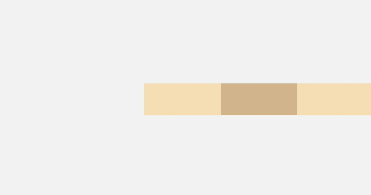

- justifyContent(FlexAlign.SpaceBetween)：水平方向均匀分配元素，相邻元素之间距离相同。第一个元素与行首对齐，最后一个元素与行尾对齐。

  ArkTS-Dyn示例：

  <!-- @[RowLayoutJustifyContentSpaceBetween_start](https://gitcode.com/openharmony/applications_app_samples/blob/master/code/DocsSample/ArkUISample/MultipleLayoutProject/entry/src/main/ets/pages/linearlayout/RowLayoutJustifyContentSpaceBetween.ets) -->
  
  ``` TypeScript
  Row({}) {
    Column() {
    }.width('20%').height(30).backgroundColor(0xF5DEB3)
  
    Column() {
    }.width('20%').height(30).backgroundColor(0xD2B48C)
  
    Column() {
    }.width('20%').height(30).backgroundColor(0xF5DEB3)
  }.width('100%').height(200).backgroundColor('rgb(242,242,242)').justifyContent(FlexAlign.SpaceBetween)
  ```

  ArkTS-Sta示例：

  <!-- @[RowLayoutJustifyContentSpaceBetween_start](https://gitcode.com/openharmony/applications_app_samples/blob/OpenHarmony_feature_sta_20260331/code/DocsSample/ArkUISample-Sta/MultipleLayoutProject/entry/src/main/ets/pages/linearlayout/RowLayoutJustifyContentSpaceBetween.ets) -->
  
  ``` TypeScript
  Row() {
    Column() {
    }.width('20%').height(30).backgroundColor(0xF5DEB3)
  
    Column() {
    }.width('20%').height(30).backgroundColor(0xD2B48C)
  
    Column() {
    }.width('20%').height(30).backgroundColor(0xF5DEB3)
  }.width('100%').height(200).backgroundColor('rgb(242,242,242)').justifyContent(FlexAlign.SpaceBetween)
  ```


  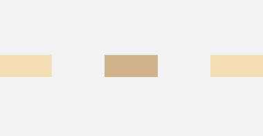

- justifyContent(FlexAlign.SpaceAround)：水平方向均匀分配元素，相邻元素之间距离相同。第一个元素到行首的距离和最后一个元素到行尾的距离是相邻元素之间距离的一半。

  ArkTS-Dyn示例：

  <!-- @[RowLayoutJustifyContentSpaceAround_start](https://gitcode.com/openharmony/applications_app_samples/blob/master/code/DocsSample/ArkUISample/MultipleLayoutProject/entry/src/main/ets/pages/linearlayout/RowLayoutJustifyContentSpaceAround.ets) -->
  
  ``` TypeScript
  Row({}) {
    Column() {
    }.width('20%').height(30).backgroundColor(0xF5DEB3)
  
    Column() {
    }.width('20%').height(30).backgroundColor(0xD2B48C)
  
    Column() {
    }.width('20%').height(30).backgroundColor(0xF5DEB3)
  }.width('100%').height(200).backgroundColor('rgb(242,242,242)').justifyContent(FlexAlign.SpaceAround)
  ```

  ArkTS-Sta示例：

  <!-- @[RowLayoutJustifyContentSpaceAround_start](https://gitcode.com/openharmony/applications_app_samples/blob/OpenHarmony_feature_sta_20260331/code/DocsSample/ArkUISample-Sta/MultipleLayoutProject/entry/src/main/ets/pages/linearlayout/RowLayoutJustifyContentSpaceAround.ets) -->
  
  ``` TypeScript
  Row() {
    Column() {
    }.width('20%').height(30).backgroundColor(0xF5DEB3)
  
    Column() {
    }.width('20%').height(30).backgroundColor(0xD2B48C)
  
    Column() {
    }.width('20%').height(30).backgroundColor(0xF5DEB3)
  }.width('100%').height(200).backgroundColor('rgb(242,242,242)').justifyContent(FlexAlign.SpaceAround)
  ```


  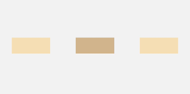

- justifyContent(FlexAlign.SpaceEvenly)：水平方向均匀分配元素，相邻元素之间的距离、第一个元素与行首的间距、最后一个元素到行尾的间距都完全一样。

  ArkTS-Dyn示例：

  <!-- @[RowLayoutJustifyContentSpaceEvenly_start](https://gitcode.com/openharmony/applications_app_samples/blob/master/code/DocsSample/ArkUISample/MultipleLayoutProject/entry/src/main/ets/pages/linearlayout/RowLayoutJustifyContentSpaceEvenly.ets) -->
  
  ``` TypeScript
  Row({}) {
    Column() {
    }.width('20%').height(30).backgroundColor(0xF5DEB3)
  
    Column() {
    }.width('20%').height(30).backgroundColor(0xD2B48C)
  
    Column() {
    }.width('20%').height(30).backgroundColor(0xF5DEB3)
  }.width('100%').height(200).backgroundColor('rgb(242,242,242)').justifyContent(FlexAlign.SpaceEvenly)
  ```

  ArkTS-Sta示例：

  <!-- @[RowLayoutJustifyContentSpaceEvenly_start](https://gitcode.com/openharmony/applications_app_samples/blob/OpenHarmony_feature_sta_20260331/code/DocsSample/ArkUISample-Sta/MultipleLayoutProject/entry/src/main/ets/pages/linearlayout/RowLayoutJustifyContentSpaceEvenly.ets) -->
  
  ``` TypeScript
  Row() {
    Column() {
    }.width('20%').height(30).backgroundColor(0xF5DEB3)
  
    Column() {
    }.width('20%').height(30).backgroundColor(0xD2B48C)
  
    Column() {
    }.width('20%').height(30).backgroundColor(0xF5DEB3)
  }.width('100%').height(200).backgroundColor('rgb(242,242,242)').justifyContent(FlexAlign.SpaceEvenly)
  ```


  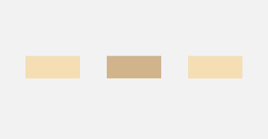

## 布局子元素在交叉轴上的对齐方式

在布局容器内，可以通过[alignItems](../reference/apis-arkui/arkui-ts/ts-container-column.md#alignitems)属性设置子元素在交叉轴（排列方向的垂直方向）上的对齐方式，且在各类尺寸屏幕中表现一致。其中，交叉轴为垂直方向时，取值为[VerticalAlign](../reference/apis-arkui/arkui-ts/ts-appendix-enums.md#verticalalign)类型，水平方向取值为[HorizontalAlign](../reference/apis-arkui/arkui-ts/ts-appendix-enums.md#horizontalalign)类型。

[alignSelf](../reference/apis-arkui/arkui-ts/ts-universal-attributes-flex-layout.md#alignself)属性用于控制单个子元素在容器交叉轴上的对齐方式，其优先级高于alignItems属性，如果设置了alignSelf属性，则在单个子元素上会覆盖alignItems属性。


### Column容器内子元素在水平方向上的排列

  **图7** Column容器内子元素在水平方向上的排列图  


- HorizontalAlign.Start：子元素在水平方向左对齐。

  ArkTS-Dyn示例：

  <!-- @[RowLayoutHorizontalAlignStart_start](https://gitcode.com/openharmony/applications_app_samples/blob/master/code/DocsSample/ArkUISample/MultipleLayoutProject/entry/src/main/ets/pages/linearlayout/RowLayoutHorizontalAlignStart.ets) -->
  
  ``` TypeScript
  Column({}) {
    Column() {
    }.width('80%').height(50).backgroundColor(0xF5DEB3)
  
    Column() {
    }.width('80%').height(50).backgroundColor(0xD2B48C)
  
    Column() {
    }.width('80%').height(50).backgroundColor(0xF5DEB3)
  }.width('100%').alignItems(HorizontalAlign.Start).backgroundColor('rgb(242,242,242)')
  ```

  ArkTS-Sta示例：

  <!-- @[RowLayoutHorizontalAlignStart_start](https://gitcode.com/openharmony/applications_app_samples/blob/OpenHarmony_feature_sta_20260331/code/DocsSample/ArkUISample-Sta/MultipleLayoutProject/entry/src/main/ets/pages/linearlayout/RowLayoutHorizontalAlignStart.ets) -->
  
  ``` TypeScript
  Column() {
    Column() {
    }.width('80%').height(50).backgroundColor(0xF5DEB3)
  
    Column() {
    }.width('80%').height(50).backgroundColor(0xD2B48C)
  
    Column() {
    }.width('80%').height(50).backgroundColor(0xF5DEB3)
  }.width('100%').alignItems(HorizontalAlign.Start).backgroundColor('rgb(242,242,242)')
  ```


  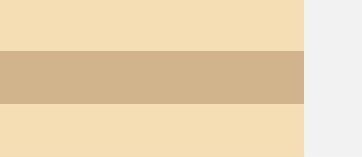

- HorizontalAlign.Center（默认值）：子元素在水平方向居中对齐。

  ArkTS-Dyn示例：

  <!-- @[RowLayoutHorizontalAlignCenter_start](https://gitcode.com/openharmony/applications_app_samples/blob/master/code/DocsSample/ArkUISample/MultipleLayoutProject/entry/src/main/ets/pages/linearlayout/RowLayoutHorizontalAlignCenter.ets) -->
  
  ``` TypeScript
  Column({}) {
    Column() {
    }.width('80%').height(50).backgroundColor(0xF5DEB3)
  
    Column() {
    }.width('80%').height(50).backgroundColor(0xD2B48C)
  
    Column() {
    }.width('80%').height(50).backgroundColor(0xF5DEB3)
  }.width('100%').alignItems(HorizontalAlign.Center).backgroundColor('rgb(242,242,242)')
  ```

  ArkTS-Sta示例：

  <!-- @[RowLayoutHorizontalAlignCenter_start](https://gitcode.com/openharmony/applications_app_samples/blob/OpenHarmony_feature_sta_20260331/code/DocsSample/ArkUISample-Sta/MultipleLayoutProject/entry/src/main/ets/pages/linearlayout/RowLayoutHorizontalAlignCenter.ets) -->
  
  ``` TypeScript
  Column() {
    Column() {
    }.width('80%').height(50).backgroundColor(0xF5DEB3)
  
    Column() {
    }.width('80%').height(50).backgroundColor(0xD2B48C)
  
    Column() {
    }.width('80%').height(50).backgroundColor(0xF5DEB3)
  }.width('100%').alignItems(HorizontalAlign.Center).backgroundColor('rgb(242,242,242)')
  ```


  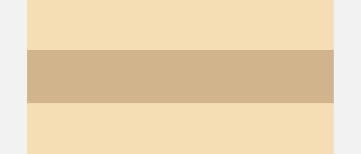

- HorizontalAlign.End：子元素在水平方向右对齐。

  ArkTS-Dyn示例：

  <!-- @[RowLayoutHorizontalAlignEnd_start](https://gitcode.com/openharmony/applications_app_samples/blob/master/code/DocsSample/ArkUISample/MultipleLayoutProject/entry/src/main/ets/pages/linearlayout/RowLayoutHorizontalAlignEnd.ets) -->
  
  ``` TypeScript
  Column({}) {
    Column() {
    }.width('80%').height(50).backgroundColor(0xF5DEB3)
  
    Column() {
    }.width('80%').height(50).backgroundColor(0xD2B48C)
  
    Column() {
    }.width('80%').height(50).backgroundColor(0xF5DEB3)
  }.width('100%').alignItems(HorizontalAlign.End).backgroundColor('rgb(242,242,242)')
  ```

  ArkTS-Sta示例：

  <!-- @[RowLayoutHorizontalAlignEnd_start](https://gitcode.com/openharmony/applications_app_samples/blob/OpenHarmony_feature_sta_20260331/code/DocsSample/ArkUISample-Sta/MultipleLayoutProject/entry/src/main/ets/pages/linearlayout/RowLayoutHorizontalAlignEnd.ets) -->
  
  ``` TypeScript
  Column() {
    Column() {
    }.width('80%').height(50).backgroundColor(0xF5DEB3)
  
    Column() {
    }.width('80%').height(50).backgroundColor(0xD2B48C)
  
    Column() {
    }.width('80%').height(50).backgroundColor(0xF5DEB3)
  }.width('100%').alignItems(HorizontalAlign.End).backgroundColor('rgb(242,242,242)')
  ```


  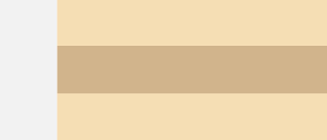


### Row容器内子元素在垂直方向上的排列

  **图8** Row容器内子元素在垂直方向上的排列图  


- VerticalAlign.Top：子元素在垂直方向顶部对齐。

  ArkTS-Dyn示例：

  <!-- @[RowLayoutVerticalAlignTop_start](https://gitcode.com/openharmony/applications_app_samples/blob/master/code/DocsSample/ArkUISample/MultipleLayoutProject/entry/src/main/ets/pages/linearlayout/RowLayoutVerticalAlignTop.ets) -->
  
  ``` TypeScript
  Row({}) {
    Column() {
    }.width('20%').height(30).backgroundColor(0xF5DEB3)
  
    Column() {
    }.width('20%').height(30).backgroundColor(0xD2B48C)
  
    Column() {
    }.width('20%').height(30).backgroundColor(0xF5DEB3)
  }.width('100%').height(200).alignItems(VerticalAlign.Top).backgroundColor('rgb(242,242,242)')
  ```

  ArkTS-Sta示例：

  <!-- @[RowLayoutVerticalAlignTop_start](https://gitcode.com/openharmony/applications_app_samples/blob/OpenHarmony_feature_sta_20260331/code/DocsSample/ArkUISample-Sta/MultipleLayoutProject/entry/src/main/ets/pages/linearlayout/RowLayoutVerticalAlignTop.ets) -->
  
  ``` TypeScript
  Row() {
    Column() {
    }.width('20%').height(30).backgroundColor(0xF5DEB3)
  
    Column() {
    }.width('20%').height(30).backgroundColor(0xD2B48C)
  
    Column() {
    }.width('20%').height(30).backgroundColor(0xF5DEB3)
  }.width('100%').height(200).alignItems(VerticalAlign.Top).backgroundColor('rgb(242,242,242)')
  ```


  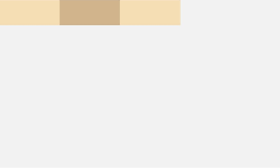

- VerticalAlign.Center（默认值）：子元素在垂直方向居中对齐。

  ArkTS-Dyn示例：

  <!-- @[RowLayoutVerticalAlignCenter_start](https://gitcode.com/openharmony/applications_app_samples/blob/master/code/DocsSample/ArkUISample/MultipleLayoutProject/entry/src/main/ets/pages/linearlayout/RowLayoutVerticalAlignCenter.ets) -->
  
  ``` TypeScript
  Row({}) {
    Column() {
    }.width('20%').height(30).backgroundColor(0xF5DEB3)
  
    Column() {
    }.width('20%').height(30).backgroundColor(0xD2B48C)
  
    Column() {
    }.width('20%').height(30).backgroundColor(0xF5DEB3)
  }.width('100%').height(200).alignItems(VerticalAlign.Center).backgroundColor('rgb(242,242,242)')
  ```

  ArkTS-Sta示例：

  <!-- @[RowLayoutVerticalAlignCenter_start](https://gitcode.com/openharmony/applications_app_samples/blob/OpenHarmony_feature_sta_20260331/code/DocsSample/ArkUISample-Sta/MultipleLayoutProject/entry/src/main/ets/pages/linearlayout/RowLayoutVerticalAlignCenter.ets) -->
  
  ``` TypeScript
  Row() {
    Column() {
    }.width('20%').height(30).backgroundColor(0xF5DEB3)
  
    Column() {
    }.width('20%').height(30).backgroundColor(0xD2B48C)
  
    Column() {
    }.width('20%').height(30).backgroundColor(0xF5DEB3)
  }.width('100%').height(200).alignItems(VerticalAlign.Center).backgroundColor('rgb(242,242,242)')
  ```


  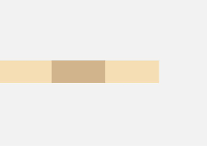

- VerticalAlign.Bottom：子元素在垂直方向底部对齐。

  ArkTS-Dyn示例：

  <!-- @[RowLayoutVerticalAlignBottom_start](https://gitcode.com/openharmony/applications_app_samples/blob/master/code/DocsSample/ArkUISample/MultipleLayoutProject/entry/src/main/ets/pages/linearlayout/RowLayoutVerticalAlignBottom.ets) -->
  
  ``` TypeScript
  Row({}) {
    Column() {
    }.width('20%').height(30).backgroundColor(0xF5DEB3)
  
    Column() {
    }.width('20%').height(30).backgroundColor(0xD2B48C)
  
    Column() {
    }.width('20%').height(30).backgroundColor(0xF5DEB3)
  }.width('100%').height(200).alignItems(VerticalAlign.Bottom).backgroundColor('rgb(242,242,242)')
  ```

  ArkTS-Sta示例：

  <!-- @[RowLayoutVerticalAlignBottom_start](https://gitcode.com/openharmony/applications_app_samples/blob/OpenHarmony_feature_sta_20260331/code/DocsSample/ArkUISample-Sta/MultipleLayoutProject/entry/src/main/ets/pages/linearlayout/RowLayoutVerticalAlignBottom.ets) -->
  
  ``` TypeScript
  Row() {
    Column() {
    }.width('20%').height(30).backgroundColor(0xF5DEB3)
  
    Column() {
    }.width('20%').height(30).backgroundColor(0xD2B48C)
  
    Column() {
    }.width('20%').height(30).backgroundColor(0xF5DEB3)
  }.width('100%').height(200).alignItems(VerticalAlign.Bottom).backgroundColor('rgb(242,242,242)')
  ```


  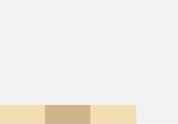

## 自适应拉伸

在线性布局下，常用空白填充组件[Blank](../reference/apis-arkui/arkui-ts/ts-basic-components-blank.md)，在容器主轴方向自动填充空白空间，达到自适应拉伸效果。Row和Column作为容器，只需要添加宽高为百分比，当屏幕宽高发生变化时，会产生自适应效果。


ArkTS-Dyn示例：

<!-- @[BlankExample_start](https://gitcode.com/openharmony/applications_app_samples/blob/master/code/DocsSample/ArkUISample/MultipleLayoutProject/entry/src/main/ets/pages/linearlayout/BlankExample.ets) -->

``` TypeScript
@Entry
@Component
struct BlankExample {
  build() {
    Column() {
      Row() {
        Text('Bluetooth').fontSize(18)
        Blank()
        Toggle({ type: ToggleType.Switch, isOn: true })
      }.backgroundColor(0xFFFFFF).borderRadius(15).padding({ left: 12 }).width('100%')
    }.backgroundColor(0xEFEFEF).padding(20).width('100%')
  }
}
```

ArkTS-Sta示例：

<!-- @[BlankExample_start](https://gitcode.com/openharmony/applications_app_samples/blob/OpenHarmony_feature_sta_20260331/code/DocsSample/ArkUISample-Sta/MultipleLayoutProject/entry/src/main/ets/pages/linearlayout/BlankExample.ets) -->

``` TypeScript
import { Entry, Component, Column, Row, Text, Blank, Toggle, ToggleType } from '@ohos.arkui.component';

@Entry
@Component
struct BlankExample {
  build() {
    Column() {
      Row() {
        Text('Bluetooth').fontSize(18)
        Blank()
        Toggle({ type: ToggleType.Switch, isOn: true })
      }.backgroundColor(0xFFFFFF).borderRadius(15).padding({ left: 12 }).width('100%')
    }.backgroundColor(0xEFEFEF).padding(20).width('100%')
  }
}
```


  **图9** 竖屏（自适应屏幕窄边）

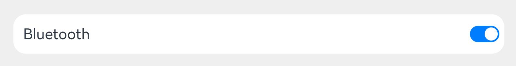

  **图10** 横屏（自适应屏幕宽边） 


## 自适应缩放

自适应缩放是指子元素随容器尺寸的变化而按照预设的比例自动调整尺寸，适应各种不同大小的设备。在线性布局中，可以使用以下两种方法实现自适应缩放。


- 父容器尺寸确定时，使用[layoutWeight](../reference/apis-arkui/arkui-ts/ts-universal-attributes-size.md#layoutweight)属性设置子元素和兄弟元素在主轴上的权重，忽略元素本身尺寸设置，使它们在任意尺寸的设备下自适应占满剩余空间。

  ArkTS-Dyn示例：

  <!-- @[LayoutWeightExample_start](https://gitcode.com/openharmony/applications_app_samples/blob/master/code/DocsSample/ArkUISample/MultipleLayoutProject/entry/src/main/ets/pages/linearlayout/LayoutWeightExample.ets) -->
  
  ``` TypeScript
  @Entry
  @Component
  struct LayoutWeightExample {
    build() {
      Column() {
        Text('1:2:3').width('100%')
        Row() {
          Column() {
            Text('layoutWeight(1)')
              .textAlign(TextAlign.Center)
          }.layoutWeight(1).backgroundColor(0xF5DEB3).height('100%')
  
          Column() {
            Text('layoutWeight(2)')
              .textAlign(TextAlign.Center)
          }.layoutWeight(2).backgroundColor(0xD2B48C).height('100%')
  
          Column() {
            Text('layoutWeight(3)')
              .textAlign(TextAlign.Center)
          }.layoutWeight(3).backgroundColor(0xF5DEB3).height('100%')
  
        }.backgroundColor(0xffd306).height('30%')
  
        Text('2:5:3').width('100%')
        Row() {
          Column() {
            Text('layoutWeight(2)')
              .textAlign(TextAlign.Center)
          }.layoutWeight(2).backgroundColor(0xF5DEB3).height('100%')
  
          Column() {
            Text('layoutWeight(5)')
              .textAlign(TextAlign.Center)
          }.layoutWeight(5).backgroundColor(0xD2B48C).height('100%')
  
          Column() {
            Text('layoutWeight(3)')
              .textAlign(TextAlign.Center)
          }.layoutWeight(3).backgroundColor(0xF5DEB3).height('100%')
        }.backgroundColor(0xffd306).height('30%')
      }
    }
  }
  ```

  ArkTS-Sta示例：

  <!-- @[LayoutWeightExample_start](https://gitcode.com/openharmony/applications_app_samples/blob/OpenHarmony_feature_sta_20260331/code/DocsSample/ArkUISample-Sta/MultipleLayoutProject/entry/src/main/ets/pages/linearlayout/LayoutWeightExample.ets) -->
  
  ``` TypeScript
  import { Entry, Component, Column, Row, Text, TextAlign} from '@ohos.arkui.component';
  
  @Entry
  @Component
  struct LayoutWeightExample {
    build() {
      Column() {
        Text('1:2:3').width('100%')
        Row() {
          Column() {
            Text('layoutWeight(1)')
              .textAlign(TextAlign.Center)
          }.layoutWeight(1).backgroundColor(0xF5DEB3).height('100%')
  
          Column() {
            Text('layoutWeight(2)')
              .textAlign(TextAlign.Center)
          }.layoutWeight(2).backgroundColor(0xD2B48C).height('100%')
  
          Column() {
            Text('layoutWeight(3)')
              .textAlign(TextAlign.Center)
          }.layoutWeight(3).backgroundColor(0xF5DEB3).height('100%')
  
        }.backgroundColor(0xffd306).height('30%')
  
        Text('2:5:3').width('100%')
        Row() {
          Column() {
            Text('layoutWeight(2)')
              .textAlign(TextAlign.Center)
          }.layoutWeight(2).backgroundColor(0xF5DEB3).height('100%')
  
          Column() {
            Text('layoutWeight(5)')
              .textAlign(TextAlign.Center)
          }.layoutWeight(5).backgroundColor(0xD2B48C).height('100%')
  
          Column() {
            Text('layoutWeight(3)')
              .textAlign(TextAlign.Center)
          }.layoutWeight(3).backgroundColor(0xF5DEB3).height('100%')
        }.backgroundColor(0xffd306).height('30%')
      }
    }
  }
  ```


    **图11** 横屏  

  

    **图12** 竖屏  

  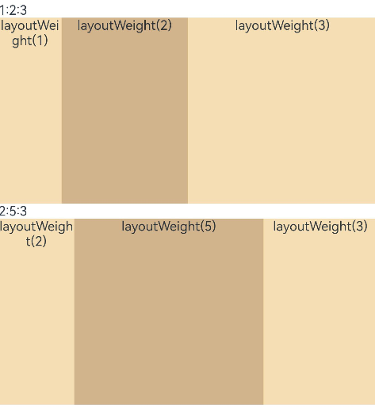

- 父容器尺寸确定时，使用百分比设置子元素和兄弟元素的宽度，使他们在任意尺寸的设备下保持固定的自适应占比。

  ArkTS-Dyn示例：

  <!-- @[WidthExample_start](https://gitcode.com/openharmony/applications_app_samples/blob/master/code/DocsSample/ArkUISample/MultipleLayoutProject/entry/src/main/ets/pages/linearlayout/WidthExample.ets) -->
  
  ``` TypeScript
  @Entry
  @Component
  struct WidthExample {
    build() {
      Column() {
        Row() {
          Column() {
            Text('left width 20%')
              .textAlign(TextAlign.Center)
          }.width('20%').backgroundColor(0xF5DEB3).height('100%')
  
          Column() {
            Text('center width 50%')
              .textAlign(TextAlign.Center)
          }.width('50%').backgroundColor(0xD2B48C).height('100%')
  
          Column() {
            Text('right width 30%')
              .textAlign(TextAlign.Center)
          }.width('30%').backgroundColor(0xF5DEB3).height('100%')
        }.backgroundColor(0xffd306).height('30%')
      }
    }
  }
  ```

  ArkTS-Sta示例：

  <!-- @[WidthExample_start](https://gitcode.com/openharmony/applications_app_samples/blob/OpenHarmony_feature_sta_20260331/code/DocsSample/ArkUISample-Sta/MultipleLayoutProject/entry/src/main/ets/pages/linearlayout/WidthExample.ets) -->
  
  ``` TypeScript
  import { Entry, Component, Column, Row, Text, TextAlign } from '@ohos.arkui.component';
  
  @Entry
  @Component
  struct WidthExample {
    build() {
      Column() {
        Row() {
          Column() {
            Text('left width 20%')
              .textAlign(TextAlign.Center)
          }.width('20%').backgroundColor(0xF5DEB3).height('100%')
  
          Column() {
            Text('center width 50%')
              .textAlign(TextAlign.Center)
          }.width('50%').backgroundColor(0xD2B48C).height('100%')
  
          Column() {
            Text('right width 30%')
              .textAlign(TextAlign.Center)
          }.width('30%').backgroundColor(0xF5DEB3).height('100%')
        }.backgroundColor(0xffd306).height('30%')
      }
    }
  }
  ```


    **图13** 横屏  

  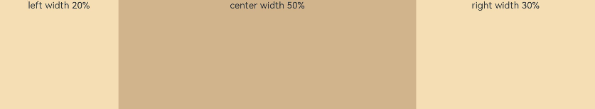

    **图14** 竖屏  

  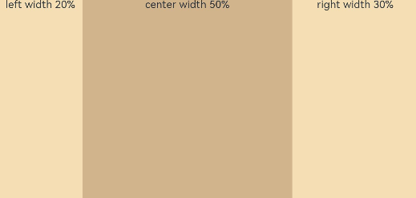


## 自适应延伸

自适应延伸是指在不同尺寸设备下，当页面的内容超出屏幕大小而无法完全显示时，可以通过滚动条进行拖动展示。对于线性布局，这种方法适用于容器中内容无法一屏展示的场景。通常有以下两种实现方式。

- [在List中添加滚动条](arkts-layout-development-create-list.md#添加滚动条)：当List子项过多一屏放不下时，可以将每一项子元素放置在不同的组件中，通过滚动条进行拖动展示。可以通过[scrollBar](../reference/apis-arkui/arkui-ts/ts-container-scroll.md#scrollbar)属性设置滚动条的常驻状态，[edgeEffect](../reference/apis-arkui/arkui-ts/ts-container-scroll.md#edgeeffect)属性设置拖动到内容最末端的回弹效果。

- 使用[Scroll](../reference/apis-arkui/arkui-ts/ts-container-scroll.md)组件：在线性布局中，开发者可以进行垂直方向或者水平方向的布局。当一屏无法完全显示时，可以在Column或Row组件的外层包裹一个可滚动的容器组件Scroll来实现可滑动的线性布局。

  垂直方向布局中使用Scroll组件：

  ArkTS-Dyn示例：

  <!-- @[ScrollVerticalExample_start](https://gitcode.com/openharmony/applications_app_samples/blob/master/code/DocsSample/ArkUISample/MultipleLayoutProject/entry/src/main/ets/pages/linearlayout/ScrollVerticalExample.ets) -->
  
  ``` TypeScript
  @Entry
  @Component
  struct ScrollVerticalExample {
    scroller: Scroller = new Scroller();
    private arr: number[] = [0, 1, 2, 3, 4, 5, 6, 7, 8, 9];
  
    build() {
      Scroll(this.scroller) {
        Column() {
          ForEach(this.arr, (item?:number|undefined) => {
            if(item != undefined){
              Text(item.toString())
                .width('90%')
                .height(150)
                .backgroundColor(0xFFFFFF)
                .borderRadius(15)
                .fontSize(16)
                .textAlign(TextAlign.Center)
                .margin({ top: 10 })
            }
          }, (item:number) => item.toString())
        }.width('100%')
      }
      .backgroundColor(0xDCDCDC)
      .scrollable(ScrollDirection.Vertical) // 滚动方向为垂直方向
      .scrollBar(BarState.On) // 滚动条常驻显示
      .scrollBarColor(Color.Gray) // 滚动条颜色
      .scrollBarWidth(10) // 滚动条宽度
      .edgeEffect(EdgeEffect.Spring) // 滚动到边沿后回弹
    }
  }
  ```

  ArkTS-Sta示例：

  <!-- @[ScrollVerticalExample_start](https://gitcode.com/openharmony/applications_app_samples/blob/OpenHarmony_feature_sta_20260331/code/DocsSample/ArkUISample-Sta/MultipleLayoutProject/entry/src/main/ets/pages/linearlayout/ScrollVerticalExample.ets) -->
  
  ``` TypeScript
  import {
    Entry,
    Component,
    Scroll,
    Column,
    ForEach,
    Text,
    TextAlign,
    ScrollDirection,
    BarState,
    Color,
    EdgeEffect,
    Scroller
  } from '@ohos.arkui.component';
  
  @Entry
  @Component
  struct ScrollVerticalExample {
    scroller: Scroller = new Scroller();
    private arr: Int[] = [0, 1, 2, 3, 4, 5, 6, 7, 8, 9];
  
    build() {
      Scroll(this.scroller) {
        Column() {
          ForEach(this.arr, (item: Int) => {
            if (item != undefined) {
              Text(item.toString())
                .width('90%')
                .height(150)
                .backgroundColor(0xFFFFFF)
                .borderRadius(15)
                .fontSize(16)
                .textAlign(TextAlign.Center)
                .margin({ top: 10 })
            }
          }, (item: Int) => item.toString())
        }.width('100%')
      }
      .backgroundColor(0xDCDCDC)
      .scrollable(ScrollDirection.Vertical) // 滚动方向为垂直方向
      .scrollBar(BarState.On) // 滚动条常驻显示
      .scrollBarColor(Color.Gray) // 滚动条颜色
      .scrollBarWidth(10) // 滚动条宽度
      .edgeEffect(EdgeEffect.Spring) // 滚动到边沿后回弹
    }
  }
  ```


  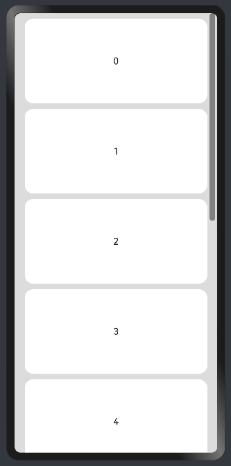

  水平方向布局中使用Scroll组件：


  ArkTS-Dyn示例：

  <!-- @[ScrollHorizontalExample_start](https://gitcode.com/openharmony/applications_app_samples/blob/master/code/DocsSample/ArkUISample/MultipleLayoutProject/entry/src/main/ets/pages/linearlayout/ScrollHorizontalExample.ets) -->
  
  ``` TypeScript
  @Entry
  @Component
  struct ScrollHorizontalExample {
    scroller: Scroller = new Scroller();
    private arr: number[] = [0, 1, 2, 3, 4, 5, 6, 7, 8, 9];
  
    build() {
      Scroll(this.scroller) {
        Row() {
          ForEach(this.arr, (item?:number|undefined) => {
            if(item != undefined){
              Text(item.toString())
                .height('90%')
                .width(150)
                .backgroundColor(0xFFFFFF)
                .borderRadius(15)
                .fontSize(16)
                .textAlign(TextAlign.Center)
                .margin({ left: 10 })
            }
          })
        }.height('100%')
      }
      .backgroundColor(0xDCDCDC)
      .scrollable(ScrollDirection.Horizontal) // 滚动方向为水平方向
      .scrollBar(BarState.On) // 滚动条常驻显示
      .scrollBarColor(Color.Gray) // 滚动条颜色
      .scrollBarWidth(10) // 滚动条宽度
      .edgeEffect(EdgeEffect.Spring) // 滚动到边沿后回弹
    }
  }
  ```

  ArkTS-Sta示例：

  <!-- @[ScrollHorizontalExample_start](https://gitcode.com/openharmony/applications_app_samples/blob/OpenHarmony_feature_sta_20260331/code/DocsSample/ArkUISample-Sta/MultipleLayoutProject/entry/src/main/ets/pages/linearlayout/ScrollHorizontalExample.ets) -->
  
  ``` TypeScript
  import {
    Entry,
    Component,
    Scroll,
    Row,
    ForEach,
    Text,
    TextAlign,
    ScrollDirection,
    BarState,
    Color,
    EdgeEffect,
    Scroller
  } from '@ohos.arkui.component';
  
  @Entry
  @Component
  struct ScrollHorizontalExample {
    scroller: Scroller = new Scroller();
    private arr: Int[] = [0, 1, 2, 3, 4, 5, 6, 7, 8, 9];
  
    build() {
      Scroll(this.scroller) {
        Row() {
          ForEach(this.arr, (item: Int) => {
            if (item != undefined) {
              Text(item.toString())
                .height('90%')
                .width(150)
                .backgroundColor(0xFFFFFF)
                .borderRadius(15)
                .fontSize(16)
                .textAlign(TextAlign.Center)
                .margin({ left: 10 })
            }
          })
        }.height('100%')
      }
      .backgroundColor(0xDCDCDC)
      .scrollable(ScrollDirection.Horizontal) // 滚动方向为水平方向
      .scrollBar(BarState.On) // 滚动条常驻显示
      .scrollBarColor(Color.Gray) // 滚动条颜色
      .scrollBarWidth(10) // 滚动条宽度
      .edgeEffect(EdgeEffect.Spring) // 滚动到边沿后回弹
    }
  }
  ```


  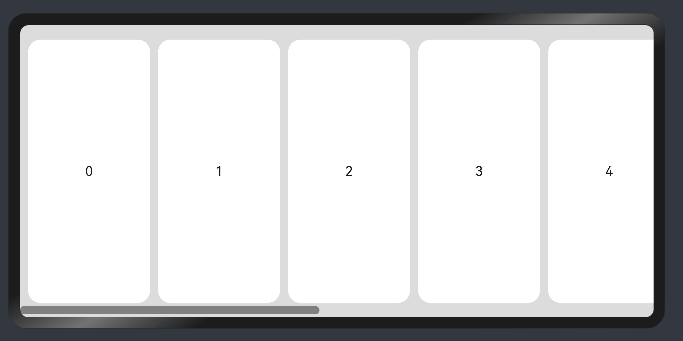
