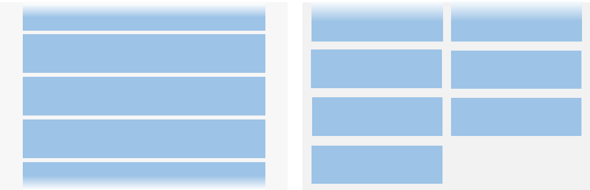

# 列表与网格概述

<!--Kit: ArkUI-->
<!--Subsystem: ArkUI-->
<!--Owner: @yylong; @rongShao-Z; @yangcan18-->
<!--Designer: @yylong-->
<!--Tester: @leiyuqian-->
<!--Adviser: @Brilliantry_Rui-->

许多应用存在滚动展示同类项目集合的需求，例如显示图片、视频、音乐、新闻、商品等。此类场景可以根据项目排列方式分别选择[List](arkts-layout-development-create-list.md)、[Grid](arkts-layout-development-create-grid.md)、[WaterFlow](arkts-layout-development-create-waterflow.md)实现，在圆形屏幕推荐使用[ArcList](arkts-layout-development-create-arclist.md)。

当应用存在滚动展示不同类别项目集合的需求，例如，电商首页同时包含多列网格分类入口、瀑布流商品卡片、线性列表推荐，或社交应用信息流同时包含文本列表、九宫格图片、视频卡片。此类场景可以在可滚动父组件（Scroll、List、WaterFlow）内组合使用多种[懒加载布局](arkts-layout-development-create-lazy-layout.md)来实现。

## 列表

List适合单列和多列宽度相同的场景，如通讯录、音乐列表、购物清单等。

直播评论、即时聊天等应用场景需要在列表底部插入数据时，内容应自动向上滚动，以展示新插入的节点，此功能可通过配置[stackFromEnd](../reference/apis-arkui/arkui-ts/ts-container-list.md#stackfromend19)实现。

## 网格

网格布局由“行”和“列”分割的单元格组成，通过指定“项目”所在单元格实现多种布局，应用场景包括九宫格图片展示、日历、计算器等。

对于部分项目占用多行或多列的场景，可以通过在创建Grid时传入合适的[GridLayoutOptions](../reference/apis-arkui/arkui-ts/ts-container-grid.md#gridlayoutoptions10对象说明)来实现。

## 瀑布流

瀑布流布局是一种多列等宽但高度不等的布局方式，适用于需要错落排列的场景，如图片和视频展示、商品推荐等。

同一个页面内有不同列数分段混合布局的场景，可以通过设置[WaterFlowOptions对象说明](../reference/apis-arkui/arkui-ts/ts-container-waterflow.md#waterflowoptions对象说明)的sections实现。

## 弧形列表

弧形列表是一种专为圆形屏幕设备设计的特殊列表，支持列表项在接近屏幕上下两端自动缩放的效果。

## 懒加载布局

懒加载布局容器是一类嵌套在可滚动父组件（Scroll、List、WaterFlow）内部，负责按需加载子组件的布局容器。这类容器本身不提供滚动能力，由父组件统一处理滚动。它仅创建和布局处于可滚动父组件可视区域内的子组件，并在帧间空闲时隙预加载可视区域上方和下方各半屏的内容，从而减少首帧渲染时间和内存开销。ArkUI提供了三种支持懒加载的布局容器组件：垂直线性布局[LazyColumnLayout](../reference/apis-arkui/arkui-ts/ts-container-lazycolumnlayout.md)、垂直网格布局[LazyVGridLayout](../reference/apis-arkui/arkui-ts/ts-container-lazyvgridlayout.md)、垂直瀑布流布局[LazyVWaterFlowLayout](../reference/apis-arkui/arkui-ts/ts-container-lazyvwaterflowlayout.md)。不同的懒加载布局容器提供不同的布局模式，开发者可以将多种类型的懒加载布局容器组合在同一个父组件中使用，灵活实现混合布局。

## 能力对比

|业务场景| List | Grid | WaterFlow | ArcList |
|---------|---------|---------|---------|---------|
|滚动通用能力|支持|支持|支持|支持|
|项目分组|[ListItemGroup](../reference/apis-arkui/arkui-ts/ts-container-listitemgroup.md)|[GridLayoutOptions](../reference/apis-arkui/arkui-ts/ts-container-grid.md#gridlayoutoptions10对象说明)|[WaterFlowSections](../reference/apis-arkui/arkui-ts/ts-container-waterflow.md#waterflowsections12)|不支持|
|指定项目吸顶|支持通过[sticky](../reference/apis-arkui/arkui-ts/ts-container-list.md#sticky9)属性实现吸顶|不支持|不支持|不支持|
|项目拖拽排序|支持[拖拽排序](../reference/apis-arkui/arkui-ts/ts-universal-attributes-drag-sorting.md)，包括内置动画和拖动到边缘自动滚动|仅所有项目都占1行1列时支持内置动画[supportAnimation](../reference/apis-arkui/arkui-ts/ts-container-grid.md#supportanimation8)，且不支持拖动到边缘自动滚动|不支持|不支持|
|项目横滑|支持通过[swipeAction](../reference/apis-arkui/arkui-ts/ts-container-listitem.md#swipeaction9)属性实现横滑|不支持|不支持|不支持|
|项目间距|支持|支持|支持|支持|
|项目分割线|支持|不支持|不支持|不支持|