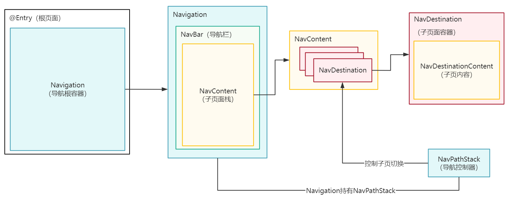
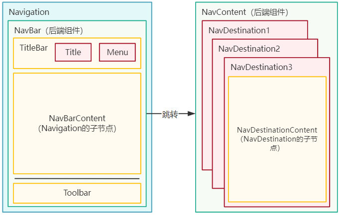
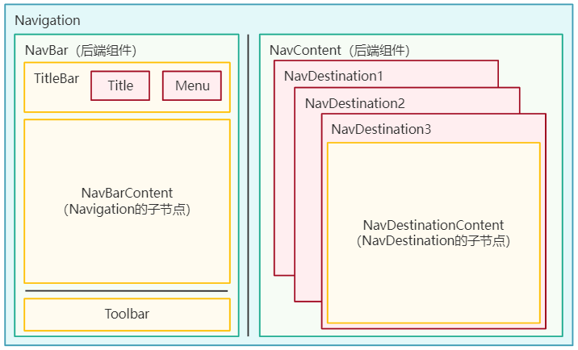
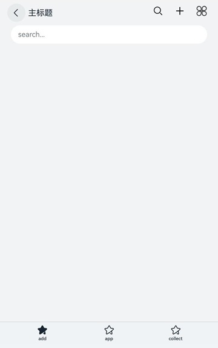
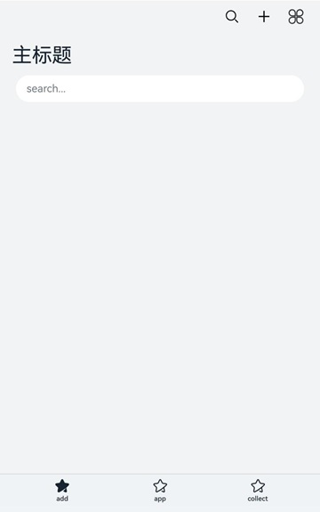

# Navigation基础架构介绍
<!--Kit: ArkUI-->
<!--Subsystem: ArkUI-->
<!--Owner: @mayaolll-->
<!--Designer: @jiangdayuan-->
<!--Tester: @Giacinta-->
<!--Adviser: @Brilliantry_Rui-->

导航组件（[Navigation](../reference/apis-arkui/arkui-ts/ts-basic-components-navigation.md)）主要用于实现[NavDestination](../reference/apis-arkui/arkui-ts/ts-basic-components-navdestination.md)页面间的跳转，支持在不同NavDestination间传递参数，提供灵活的跳转栈操作，从而更便捷地实现对不同页面的访问和复用。

## Navigation整体架构

Navigation组件结构较为复杂，包含几个关键概念：

- [Navigation](../reference/apis-arkui/arkui-ts/ts-basic-components-navigation.md)：导航根视图容器，所有的导航页面都被此容器包裹，提供分栏显示的能力，一般用作全局的根容器。
- [NavDestination](../reference/apis-arkui/arkui-ts/ts-basic-components-navdestination.md)：子页面容器，导航的所有页面路由操作均是针对NavDestination的操作，主要包含：
  - [标题栏](#标题栏)：位于NavDestination顶部，包括返回按钮、标题，系统提供默认风格，同时支持自定义。
  - [菜单栏](#菜单栏)：位于NavDestination顶部，系统提供默认风格，同时支持自定义。
  - 内容区：NavDestination的子组件，内容由开发者自定义。
  - [工具栏](#工具栏)：位于NavDestination底部，系统提供默认风格，同时支持自定义。
- [NavBar](#navbar导航栏)：导航栏，也称为主页面，主要包含：
  - [标题栏](#标题栏)：位于NavBar顶部，包括返回按钮、标题，系统提供默认风格，同时支持自定义。
  - [菜单栏](#菜单栏)：位于NavBar顶部，系统提供默认风格，同时支持自定义。
  - 内容区：位于NavBar中心区域，内容由开发者自定义。
  - [工具栏](#工具栏)：位于NavBar底部，系统提供默认风格，同时支持自定义。
- [NavPathStack](../reference/apis-arkui/arkui-ts/ts-basic-components-navigation.md#navpathstack10)：导航控制器，用于管理NavDestination页面栈，其封装了各种控制页面跳转的接口，支持继承后重写，需与Navigation绑定使用。

**图1** Navigation总体架构图



此外Navigation提供两种布局模式：单栏模式、分栏模式，不同模式下的结构如下。

- 单栏模式：

  当Navigation容器宽度小于600vp时，建议使用单栏模式。此模式下发生路由跳转时，整个页面都会被替换。

  **图2** 单栏布局示意图

  

  

- 分栏模式：

  当Navigation容器宽度大于等于600vp时，建议使用分栏模式。此模式下Navigation分为左右两部分，左侧为导航栏（NavBar），右侧为子页面（NavDestination）。发生路由跳转时，只有右边子页会被替换。

  **图3** 分栏布局示意图

  

  

## Navigation（导航容器）

Navigation是路由导航的根视图容器，通常作为页面（@Entry修饰的自定义组件，定义为Router页面）的根容器（作为全局导航使用），包括单栏（Stack）、分栏（Split）和自适应（Auto）三种显示模式，Auto模式会基于Navigation组件的宽度自动在Stack和Split中切换。

Navigation组件本身可不作为显示容器，只用于承载路由的相关功能，如绑定导航控制器对象、路由切换、分栏显示、自定义转场动画控制等。

Navigation组件主要包含导航栏（NavBar）和子页（NavDestination），子页通过栈结构管理，存在NavPathStack中。导航栏又称Navbar，作为Navigation的子组件，直接挂载到Navigation上，可以通过[hideNavBar](../reference/apis-arkui/arkui-ts/ts-basic-components-navigation.md#hidenavbar9)属性进行隐藏（单栏应用推荐隐藏导航页），导航栏不存在页面栈中。

子页面是一个以NavDestination为根节点的子树，通过[@Builder](./state-management/arkts-builder.md)构造出来，再通过NavPathStack提供的栈操作方法挂载到Navigation上显示，详见[Navigation子页面](./arkts-navigation-navdestination.md)。

## NavDestination（子页面容器）

Navigation子页面的根容器，每个子页面都需要包裹在一个NavDestination中，通过NavPathStack提供的栈操作方法（push、pop等）将子页面挂载到Navigation上显示或删除。

NavDestination作为页面根容器，除了支持普通组件的通用属性外，还支持页面相关的属性，如：[页面的生命周期](../reference/apis-arkui/arkui-ts/ts-basic-components-navdestination.md#事件)，页面[工具栏](../reference/apis-arkui/arkui-ts/ts-basic-components-navdestination.md#toolbarconfiguration13)、[标题栏](../reference/apis-arkui/arkui-ts/ts-basic-components-navdestination.md#title)与[菜单栏](../reference/apis-arkui/arkui-ts/ts-basic-components-navdestination.md#menus12)，[自定义页面转场动画](../reference/apis-arkui/arkui-ts/ts-basic-components-navdestination.md#customtransition15)，页面级窗口属性控制（横竖屏、系统状态栏、系统导航条）等能力。

## NavBar（导航栏）

Navigation中直接加载的孩子节点称为导航栏（NavBar），单栏显示时它是整个导航的首页，分栏显示时它是固定的导航栏。分栏显示时默认显示在左边，也可以通过[navBarPosition](../reference/apis-arkui/arkui-ts/ts-basic-components-navigation.md#navbarposition9)属性控制。

开发者可以通过[hideNavBar](../reference/apis-arkui/arkui-ts/ts-basic-components-navigation.md#hidenavbar9)控制导航栏的显隐，也可以通过[navBarWidth](../reference/apis-arkui/arkui-ts/ts-basic-components-navigation.md#navbarwidth9)属性控制双栏显示下的Navbar宽度，NavBar本身不属于页面栈中的页面，不具备页面的生命周期等，不能通过NavPathStack的方法控制。 开发者可以通过[onNavBarStateChange](../reference/apis-arkui/arkui-ts/ts-basic-components-navigation.md#onnavbarstatechange9)去感知导航栏的显隐，通过[mode](../reference/apis-arkui/arkui-ts/ts-basic-components-navigation.md#mode9)属性控制单双栏切换，也可以通过[onNavigationModeChange](../reference/apis-arkui/arkui-ts/ts-basic-components-navigation.md#onnavigationmodechange11)去感知单双栏的切换。

NavBar的内容区可以通过两种方式指定：

 - 方式一：直接指定Navigation的子节点。

  <!-- @[NavigationDemo](https://gitcode.com/openharmony/applications_app_samples/blob/master/code/DocsSample/ArkUISample/NavigationSample/entry/src/main/ets/pages/navigation/template1/NavigationExample.ets) -->
  
  ``` TypeScript
  @Entry
  @Component
  struct NavigationDemo {
    @Provide('navPathStack') navPathStack: NavPathStack = new NavPathStack();
    private listArray: Array<string> = ['WLAN', 'Bluetooth', 'Personal Hotspot', 'Connect & Share'];
    context = this.getUIContext().getHostContext();
    build() {
      Column() {
        Navigation(this.navPathStack) {
          // 请将$r('app.string.enterKeyWordsToSearch')替换为实际资源文件，在本示例中该资源文件的value值为"输入关键字搜索"
          TextInput({ placeholder: $r('app.string.enterKeyWordsToSearch') })
            .width('90%')
            .height(40)
            .margin({ bottom: 10 })
  
          // 通过List定义导航的一级界面
          List({ space: 12, initialIndex: 0 }) {
            ForEach(this.listArray, (item: string) => {
              ListItem() {
                Row() {
                  Row() {
                    Text(`${item.slice(0, 1)}`)
                      .fontColor(Color.White)
                      .fontSize(14)
                      .fontWeight(FontWeight.Bold)
                  }
                  .width(30)
                  .height(30)
                  .backgroundColor('#a8a8a8')
                  .margin({ right: 20 })
                  .borderRadius(20)
                  .justifyContent(FlexAlign.Center)
  
                  Column() {
                    Text(item)
                      .fontSize(16)
                      .margin({ bottom: 5 })
                  }
                  .alignItems(HorizontalAlign.Start)
  
                  Blank()
  
                  Row()
                    .width(12)
                    .height(12)
                    .margin({ right: 15 })
                    .border({
                      width: { top: 2, right: 2 },
                      color: 0xcccccc
                    })
                    .rotate({ angle: 45 })
                }
                .borderRadius(15)
                .shadow({ radius: 100, color: '#ededed' })
                .width('90%')
                .alignItems(VerticalAlign.Center)
                .padding({ left: 15, top: 15, bottom: 15 })
                .backgroundColor(Color.White)
              }
              .width('100%')
              .onClick(() => {
                // $r('app.string.detailsPageParameters')需要替换为开发者所需的字符串资源文件,资源文件中的value值为“详情页面参数”
                this.navPathStack.pushPathByName(`${item}`,
                  // 将name指定的NaviDestination页面信息入栈,传递的参数为param
                  this.context!.resourceManager.getStringSync($r('app.string.detailsPageParameters').id));
              })
            }, (item: string): string => item)
          }
          .listDirection(Axis.Vertical)
          .edgeEffect(EdgeEffect.Spring)
          .sticky(StickyStyle.Header)
          .chainAnimation(false)
          .width('100%')
        }
        .width('100%')
        .mode(NavigationMode.Auto)
        // $r('app.string.settings')需要替换为开发者所需的字符串资源文件,资源文件中的value值为“设置”
        .title($r('app.string.settings')) // 设置标题文字
      }
      .size({ width: '100%', height: '100%' })
      .backgroundColor(0xf4f4f5)
    }
  }
  ```

 - 方式二：从API version 20开始，使用[主页类型NavDestination](../reference/apis-arkui/arkui-ts/ts-basic-components-navigation.md#navigation20)将某个NavDestination直接指定为导航栏内容，此方法需要配置路由表，配置方式请参考[路由表](./arkts-navigation-cross-package.md#路由表能力对比)。

## NavPathStack（导航控制器）

Navigation的子页面栈存在NavPathStack中，每个Navigation都需要绑定一个NavPathStack对象，NavPathStack用于控制Navigation中所有子页的切换。NavPathStack提供了很多基础的路由切换方法，如：[pushPath](../reference/apis-arkui/arkui-ts/ts-basic-components-navigation.md#pushpath10)、[pop](../reference/apis-arkui/arkui-ts/ts-basic-components-navigation.md#pop10)、[replacePath](../reference/apis-arkui/arkui-ts/ts-basic-components-navigation.md#replacepath11)等，以及路由拦截、转场动画控制、路由栈信息获取等能力。

NavPathStack也支持开发者继承并复写相关路由操作方法。NavPathStack跟Navigation一一对应，在每个子页中可以通过NavDestination的[onReady](../reference/apis-arkui/arkui-ts/ts-basic-components-navdestination.md#onready11)回调获取，也可以全局维护一个单例的NavPathStack，在任意地方获取并执行路由操作（注意：页面切换动画和布局必须在UI线程中才可以生效，依赖Vsync信号）。

## 标题栏

标题栏在界面顶部，用于呈现界面名称和操作入口，Navigation组件通过[title](../reference/apis-arkui/arkui-ts/ts-basic-components-navigation.md#title)属性设置标题内容，通过[titleMode](../reference/apis-arkui/arkui-ts/ts-basic-components-navigation.md#titlemode)属性设置标题栏模式。NavDestination同样支持[title](../reference/apis-arkui/arkui-ts/ts-basic-components-navdestination.md#title)属性用于设置标题内容。

> **说明：**
>
> Navigation未设置[title](../reference/apis-arkui/arkui-ts/ts-basic-components-navigation.md#title)、[titleMode](../reference/apis-arkui/arkui-ts/ts-basic-components-navigation.md#titlemode)、[menus](../reference/apis-arkui/arkui-ts/ts-basic-components-navigation.md#menus)等与标题、菜单栏相关的属性时，即使将[hideBackButton](../reference/apis-arkui/arkui-ts/ts-basic-components-navigation.md#hidebackbutton)设置为false，返回按钮也不会展示。

- Mini模式：

  普通型标题栏，用于一级页面不需要突出标题的场景。

  **图4** Mini模式标题栏

  

  <!-- @[NavigationTitleModeMini](https://gitcode.com/openharmony/applications_app_samples/blob/master/code/DocsSample/ArkUISample/NavigationSample/entry/src/main/ets/pages/navigation/template1/TitleModeMini.ets) -->
  
  ``` TypeScript
  Navigation() {
    // ...
  }
  .titleMode(NavigationTitleMode.Mini)
  ```

- Full模式：

  强调型标题栏，用于一级页面需要突出标题的场景。

  **图5** Full模式标题栏

  

  <!-- @[NavigationTitleModeFUll](https://gitcode.com/openharmony/applications_app_samples/blob/master/code/DocsSample/ArkUISample/NavigationSample/entry/src/main/ets/pages/navigation/template1/TitleModeFull.ets) -->
  
  ``` TypeScript
  Navigation() {
    // ...
  }
  .titleMode(NavigationTitleMode.Full)
  ```

## 菜单栏

菜单栏位于组件的顶部，开发者可以通过[menus](../reference/apis-arkui/arkui-ts/ts-basic-components-navigation.md#menus)属性设置Navigation的菜单栏。menus支持Array&lt;[NavigationMenuItem](../reference/apis-arkui/arkui-ts/ts-basic-components-navigation.md#navigationmenuitem)&gt;和[CustomBuilder](../reference/apis-arkui/arkui-ts/ts-types.md#custombuilder8)两种参数类型。使用Array&lt;[NavigationMenuItem](../reference/apis-arkui/arkui-ts/ts-basic-components-navigation.md#navigationmenuitem)&gt;类型时，竖屏最多支持显示3个图标，横屏最多支持显示5个图标，多余的图标会被放入自动生成的更多图标。NavDestination同样支持[menus](../reference/apis-arkui/arkui-ts/ts-basic-components-navdestination.md#menus12)属性用于设置菜单栏。

**图6** 设置了3个图标的菜单栏


   <!-- @[NavigationMenuThreeImage](https://gitcode.com/openharmony/applications_app_samples/blob/master/code/DocsSample/ArkUISample/NavigationSample/entry/src/main/ets/pages/navigation/template1/MenusThreeImage.ets) -->
   
   ``` TypeScript
   let menuItem: NavigationMenuItem  = {
     'value': 'func',
     'icon': 'ets/pages/navigation/template1/image/ic_public_add.svg',
     'action': () => {}
   };
   // ...
         Navigation(this.navPathStack) {
           // ...
         }
         .menus([menuItem, menuItem, menuItem])
   ```

图片也可以引用resources中的资源。

   <!-- @[NavigationMenuThreeResource](https://gitcode.com/openharmony/applications_app_samples/blob/master/code/DocsSample/ArkUISample/NavigationSample/entry/src/main/ets/pages/navigation/template1/MenusThreeResource.ets) -->
   
   ``` TypeScript
   let menuItem: NavigationMenuItem  = {
     'value': 'func',
     'icon': 'resources/base/media/ic_public_add.svg',
     'action': () => {}
   };
   // ...
         Navigation(this.navPathStack) {
           // ...
         }
         .menus([menuItem, menuItem, menuItem])
   ```

**图7** 设置了4个图标的菜单栏 


竖屏状态下菜单栏，最多支持显示3个按钮，当按钮超过3个时，多余的按钮会被折叠。

   <!-- @[NavigationMenuFour](https://gitcode.com/openharmony/applications_app_samples/blob/master/code/DocsSample/ArkUISample/NavigationSample/entry/src/main/ets/pages/navigation/template1/MenusFour.ets) -->
   
   ``` TypeScript
   let menuItem: NavigationMenuItem  = {
     'value': 'func',
     'icon': 'ets/pages/navigation/template1/image/ic_public_add.svg',
     'action': () => {}
   };
   // ...
         Navigation(this.navPathStack) {
           // ...
         }
         // 竖屏最多支持显示3个图标，多余的图标会被放入自动生成的更多图标
         .menus([menuItem, menuItem, menuItem, menuItem])
   ```

## 工具栏

工具栏位于组件的底部，开发者可以通过[toolbarConfiguration](../reference/apis-arkui/arkui-ts/ts-basic-components-navigation.md#toolbarconfiguration10)属性设置Navigation的工具栏。NavDestination同样支持[toolbarConfiguration](../reference/apis-arkui/arkui-ts/ts-basic-components-navdestination.md#toolbarconfiguration13)属性用于设置工具栏。

  **图8** 工具栏


   <!-- @[ToolBar](https://gitcode.com/openharmony/applications_app_samples/blob/master/code/DocsSample/ArkUISample/NavigationSample/entry/src/main/ets/pages/navigation/template1/ToolBar.ets) -->
   
   ``` TypeScript
   let toolTmp: ToolbarItem = {
     'value': 'func',
     'icon': 'ets/pages/navigation/template1/image/ic_public_highlights.svg',
     'action': () => {}
   };
   let toolBar: ToolbarItem[] = [toolTmp,toolTmp,toolTmp];
   // ...
         Navigation(this.navPathStack) {
           // ...
         }
         .toolbarConfiguration(toolBar)
   ```
