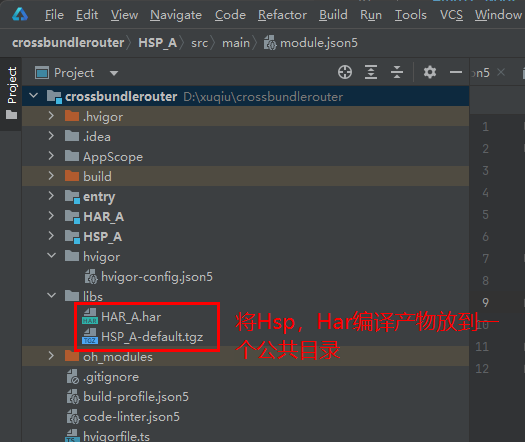

# Navigation跨包路由
<!--Kit: ArkUI-->
<!--Subsystem: ArkUI-->
<!--Owner: @mayaolll-->
<!--Designer: @jiangdayuan-->
<!--Tester: @lxl007-->
<!--Adviser: @Brilliantry_Rui-->

Navigation提供[系统路由表](#系统路由表)和[自定义路由表](#自定义路由表)两种实现方式，通过路由表的配置可以完成本包和跨包的页面跳转。

- 系统路由表相对自定义路由表，使用更简单，只需要添加对应页面跳转配置项，即可实现页面跳转。

- 自定义路由表使用起来更复杂，但是可以根据应用业务进行定制处理。

支持自定义路由表和系统路由表混用。

## 路由表能力对比

不同路由方式适用于不同需求，易用性或可扩展性需根据项目特点权衡选择。

| 路由方式     | 跨包跳转能力             | 可扩展性     | 易用性                               |
| ------------ | ------------------------ | ------------ | ------------------------------------ |
| [系统路由表](#系统路由表)   | 跳转前无需import页面文件，页面按需动态加载。 | 可扩展性一般。 | 易用性更强，系统自动维护路由表。       |
| [自定义路由表](#自定义路由表) | 跳转前需要import页面文件。 | 可扩展性更强。 | 易用性一般，需要开发者自行维护路由表。 |

## 系统路由表

系统路由表是动态路由的一种实现方式。从API version 12开始，Navigation支持使用系统路由表的方式进行动态路由。各业务模块（[HSP](../quick-start/in-app-hsp.md)、[HAR](../quick-start/har-package.md)）中需要独立配置router_map.json文件，在触发路由跳转时，应用只需要通过NavPathStack提供的路由方法，传入需要路由的页面配置名称，此时系统会自动完成路由模块的动态加载、页面组件构建，并完成路由跳转，从而实现了开发层面的模块解耦。系统路由表支持模拟器但不支持预览器。其主要步骤如下：

1. 在跳转目标模块的配置文件[module.json5](../quick-start/module-configuration-file.md)添加路由表配置：

    <!-- @[moduleJson5](https://gitcode.com/openharmony/applications_app_samples/blob/master/code/DocsSample/ArkUISample/NavigationSample/entry/src/main/module.json5) -->
    
    ``` JSON5
    {
      "module": {
        // ...
        "routerMap": "$profile:router_map",
        // ...
      }
    }
    ```

2. 添加完路由配置文件地址后，需要在工程resources/base/profile中创建router_map.json文件。添加如下配置信息：

     ```json
     {
       "routerMap": [
         {
           "name": "PageOne",
           "pageSourceFile": "src/main/ets/pages/PageOne.ets",
           "buildFunction": "PageOneBuilder",
           "data": {
             "description" : "this is PageOne"
           }
         }
       ]
     }
     ```

    配置说明如下：

   | 配置项 | 说明 |
   |---|---|
   | name | 可自定义的跳转页面名称。|
   | pageSourceFile | 跳转目标页在包内的路径，相对src目录的相对路径。|
   | buildFunction | 跳转目标页的入口函数名称，必须以@Builder修饰。 |
   | data | 应用自定义字段。可以通过配置项读取接口getConfigInRouteMap获取。|

3. 在跳转目标页面中，需要配置入口Builder函数，函数名称需要和router_map.json配置文件中的buildFunction保持一致，否则在编译时会报错。

   <!-- @[SystemRoutingTableOne](https://gitcode.com/openharmony/applications_app_samples/blob/master/code/DocsSample/ArkUISample/NavigationSample/entry/src/main/ets/pages/navigation/template1/PageOne.ets) -->
   
   ``` TypeScript
   // 跳转页面入口函数
   @Builder
   export function PageOneBuilder() {
     PageOne();
   }
   
   @Component
   struct PageOne {
     pathStack: NavPathStack = new NavPathStack();
   
     build() {
       NavDestination() {
       }
       .title('PageOne')
       .onReady((context: NavDestinationContext) => {
         this.pathStack = context.pathStack;
       })
     }
   }
   ```

4. 通过pushPathByName等路由接口进行页面跳转。(注意：此时Navigation中可以不用配置navDestination属性。)

   <!-- @[SystemRoutingTable](https://gitcode.com/openharmony/applications_app_samples/blob/master/code/DocsSample/ArkUISample/NavigationSample/entry/src/main/ets/pages/navigation/template1/PageOne.ets) -->
   
   ``` TypeScript
   @Entry
   @Component
   struct SystemRoutingTable {
     pageStack : NavPathStack = new NavPathStack();
   
     build() {
       Navigation(this.pageStack){
       }.onAppear(() => {
         this.pageStack.pushPathByName('PageOne', null, false);
       })
       .hideNavBar(true)
     }
   }
   ```

## 自定义路由表

自定义路由表通过给Navigation的[navDestination](../reference/apis-arkui/arkui-ts/ts-basic-components-navigation.md#navdestination10)属性设置Builder函数实现，其特点是需要import页面。有两种import页面的方式，静态import和动态import，二者的区别在于： 

| import方式 | 模块间耦合度   | 实现复杂度 | 性能                                     |
| ---------- | -------------- | ---------- | ---------------------------------------- |
| 动态import | 模块间解耦。 | 复杂度高。 | 性能好，按需加载，跳转前再加载对应页面。 |
| 静态import | 模块间耦合。 | 复杂度低。 | 性能一般，初始化时一次性加载所有依赖的页面。 |

**动态import（推荐）**

动态import旨在解决多个模块（HAR/HSP）能够复用相同的业务逻辑，实现各业务模块间的解耦，同时支持路由功能的扩展与整合，可以按需import，具体实现方法请参考<!--RP1-->[Navigation动态路由](https://gitcode.com/openharmony/applications_app_samples/tree/master/code/BasicFeature/ApplicationModels/DynamicRouter)<!--RP1End-->示例。

动态import的优势：

- 路由定义除了跳转的URL以外，可以配置丰富的扩展信息，如横竖屏默认模式、是否需要鉴权等等，做路由跳转时统一处理。
- 给每个路由页面设置一个名字，按照名称进行跳转而不是文件路径。
- 页面的加载可以使用动态import（按需加载），防止首个页面加载大量代码导致卡顿。

实现方案：

1. 定义页面跳转配置项。
   - 使用资源文件进行定义，通过资源管理[@ohos.resourceManager](../reference/apis-localization-kit/js-apis-resource-manager.md)在运行时对资源文件解析。
   - 在ets文件中配置路由加载配置项，一般包括路由页面名称（即pushPath等接口中页面的别名），文件所在模块名称（hsp/har的模块名），加载页面在模块内的路径（相对src目录的路径）。
2. 加载目标跳转页面，通过[动态import](../arkts-utils/arkts-dynamic-import.md)将跳转目标页面所在的模块在运行时加载，在模块加载完成后，调用模块中的方法，通过import在模块的方法中加载模块中显示的目标页面，并返回页面加载完成后定义的Builder函数。
3. 触发页面跳转，在Navigation的[navDestination](../reference/apis-arkui/arkui-ts/ts-basic-components-navigation.md#navdestination10)属性执行步骤2中加载的Builder函数，即可跳转到目标页面。

**静态import**

静态import实现方式简单，但通过静态import页面进行路由跳转会导致不同模块之间的依赖耦合，并增加首页加载时间长等问题。建议使用[自定义路由表](#自定义路由表)的动态import或[系统路由表](#系统路由表)。

实现方案：

<!-- @[CustomRoutingTable](https://gitcode.com/openharmony/applications_app_samples/blob/master/code/DocsSample/ArkUISample/NavigationSample/entry/src/main/ets/pages/navigation/template1/CustomRoutingTable.ets) -->

``` TypeScript
import { hilog } from '@kit.PerformanceAnalysisKit';
const DOMAIN = 0x0000;
@Entry
@Component
struct NavigationExample {
  @Provide('navPathStack') navPathStack: NavPathStack = new NavPathStack();
  private arr: number[] = [1, 2];

  @Builder
  pageMap(name: string) {
    if (name === 'NavDestinationTitle1') {
      pageOneTmp();
    } else if (name === 'NavDestinationTitle2') {
      pageTwoTmp();
    }
  }

  build() {
    Column() {
      Navigation(this.navPathStack) {
        TextInput({ placeholder: 'search...' })
          .width('90%')
          .height(40)

        List({ space: 12 }) {
          ForEach(this.arr, (item: number) => {
            ListItem() {
              Text('Page' + item)
                .width('100%')
                .height(72)
                .borderRadius(24)
                .fontSize(16)
                .fontWeight(500)
                .textAlign(TextAlign.Center)
                .onClick(() => {
                  this.navPathStack.pushPath({ name: 'NavDestinationTitle' + item });
                })
            }
          }, (item: number) => item.toString())
        }
        .width('90%')
        .margin({ top: 12 })
      }
      // $r('app.string.mainTitle')需要替换为开发者所需的字符串资源文件，资源文件中的value值为“主标题”
      .title($r('app.string.mainTitle'))
      .navDestination(this.pageMap)
      .mode(NavigationMode.Split)
    }
    .height('100%')
    .width('100%')
  }
}

@Component
export struct pageTwoTmp {
  @Consume('navPathStack') navPathStack: NavPathStack;
  context = this.getUIContext().getHostContext();
  build() {
    NavDestination() {
      Column() {
        Text('NavDestinationContent2')
      }.width('100%').height('100%')
    }.title('NavDestinationTitle2')
    .onBackPressed(() => {
      const popDestinationInfo = this.navPathStack.pop(); // 弹出路由栈的栈顶元素
      // $r('app.string.returnValue')需要替换为开发者所需的字符串资源文件，资源文件中的value值为“返回值”
      hilog.info(DOMAIN, 'testTag', 'pop', this.context!.resourceManager.getStringSync($r('app.string.returnValue').id),
        JSON.stringify(popDestinationInfo));
      return true;
    })
  }
}

@Component
export struct pageOneTmp {
  @Consume('navPathStack') navPathStack: NavPathStack;
  context = this.getUIContext().getHostContext();
  build() {
    NavDestination() {
      Column() {
        Text('NavDestinationContent1')
      }.width('100%').height('100%')
    }.title('NavDestinationTitle1')
    .onBackPressed(() => {
      const popDestinationInfo = this.navPathStack.pop(); // 弹出路由栈的栈顶元素
      // $r('app.string.returnValue')需要替换为开发者所需的字符串资源文件，资源文件中的value值为“返回值”
      hilog.info(DOMAIN, 'testTag', 'pop', this.context!.resourceManager.getStringSync($r('app.string.returnValue').id),
        JSON.stringify(popDestinationInfo));
      return true;
    })
  }
}
```

## 跨包开发示例

如下示例展示了基于系统路由表的跨包跳转，Hap包中有两个页面 HapPageA和HapPageB，Hsp包中有两个页面HspPageA和HspPageB，Har包中也有两个页面HarPageA，HarPageB，实现这六个页面之间的相互跳转。

### 1 路由表配置

参考[系统路由表](#系统路由表)在每个[HAP](../quick-start/hap-package.md)、[HAR](../quick-start/har-package.md)、[HSP](../quick-start/in-app-hsp.md)模块中配置各自的系统路由表，每个模块的`src/main/resources/base/profile/`目录都需要创建一个router_map.json文件。

在router_map.json文件中填写具体的路由表信息（下面仅以Hap模块中的配置为例），示例如下：

``` TypeScript
{
  "routerMap": [
    {
      "name": "HapPageA",
      "pageSourceFile": "src/main/ets/pages/HapPageA.ets",
      "buildFunction": "HapPageABuilder",
      "data": {
        "description": "this is HapPageA"
      }
    },
    {
      "name": "HapPageB",
      "pageSourceFile": "src/main/ets/pages/HapPageB.ets",
      "buildFunction": "HapPageBBuilder",
      "data": {
        "description": "this is HapPageB"
      }
    }
  ]
}
```

在每个模块的[module.json5](../quick-start/module-configuration-file.md)中配置各自的路由表。

<!-- @[moduleJson5](https://gitcode.com/openharmony/applications_app_samples/blob/master/code/DocsSample/ArkUISample/NavigationSample/entry/src/main/module.json5) -->

``` JSON5
{
  "module": {
    // ...
    "routerMap": "$profile:router_map",
    // ...
  }
}
```

### 2 代码编写

以Hap包中的HapPageA为例：

<!-- @[CrossPackagePageA](https://gitcode.com/openharmony/applications_app_samples/blob/master/code/DocsSample/ArkUISample/NavigationSample/entry/src/main/ets/pages/navigation/template4/HapPageA.ets) -->

``` TypeScript
// 仅作为示例写法，其余页面、模块需自行创建
import { ControlPanel } from './Common';

@Component
export struct HapPageA {
  build() {
    NavDestination() {
      Stack({alignContent: Alignment.Center}) {
        ControlPanel()
      }.width('100%').height('100%')
    }.title('HapPageA')
    .onReady((ctx: NavDestinationContext) => {
      let config = ctx.getConfigInRouteMap();
      console.log(`testTag HapPageA config.data: ${JSON.stringify(config?.data)}`);
    })
  }
}

// 页面的buildFunction，用于构造页面
@Builder
export function HapPageABuilder(): void {
  HapPageA();
}
```

其中Common是为了方便演示页面间跳转抽出来的一个控制面板组件，示例如下：

<!-- @[CrossPackageCommon](https://gitcode.com/openharmony/applications_app_samples/blob/master/code/DocsSample/ArkUISample/NavigationSample/entry/src/main/ets/pages/navigation/template4/Common.ets) -->

``` TypeScript
@Component
export struct ControlPanel {
  private stack: NavPathStack | undefined = undefined;

  aboutToAppear(): void {
    let info = this.queryNavigationInfo();
    this.stack = info?.pathStack;
  }

  build() {
    Column({ space: 20 }) {
      Button('push HapPageA').onClick(() => {
        this.stack?.pushPath({ name: 'HapPageA' });
      })
      Button('push HapPageB').onClick(() => {
        this.stack?.pushPath({ name: 'HapPageB' });
      })
      Button('push HarPageA').onClick(() => {
        this.stack?.pushPath({ name: 'HarPageA' });
      })
      Button('push HarPageB').onClick(() => {
        this.stack?.pushPath({ name: 'HarPageB' });
      })
      Button('push HspPageA').onClick(() => {
        this.stack?.pushPath({ name: 'HspPageA' });
      })
      Button('push HspPageB').onClick(() => {
        this.stack?.pushPath({ name: 'HspPageB' });
      })
    }
  }
}
```

### 3 编译构建

因为HAR和HSP是被Hap模块依赖的，所以需要先编译HAR和HSP是，为了方便演示，这里将编译产物放到一个公共目录里面。

  **图1** HSP、HAR编译产物示意图



在HAP的oh-package.json5配置文件中配置对HAR与HSP的依赖。

```json
{
  "name": "entry",
  "version": "1.0.0",
  "description": "Please describe the basic information.",
  "main": "",
  "author": "",
  "license": "",
  "dependencies": {
    "har_a": "file:../libs/HAR_A.har", // 因为演示中使用的是本地依赖包，所以通过file指示一个固定的文件。
    "hsp_a": "file:../libs/HSP_A-default.tgz", // 因为演示中使用的是本地依赖包，所以通过file指示一个固定的文件。
  }
}
```

然后在IDE中直接运行HAP模块，则会将HAP与HSP一起安装到设备中，效果如下：

  **图2** Navigation跨包跳转示例


