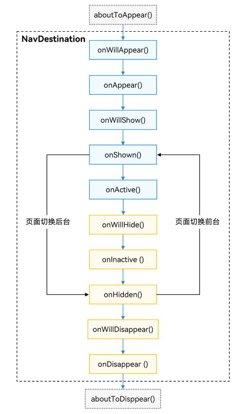

# Navigation子页面
<!--Kit: ArkUI-->
<!--Subsystem: ArkUI-->
<!--Owner: @mayaolll-->
<!--Designer: @jiangdayuan-->
<!--Tester: @Giacinta-->
<!--Adviser: @Brilliantry_Rui-->

[NavDestination](../reference/apis-arkui/arkui-ts/ts-basic-components-navdestination.md)是Navigation子页面的根容器，用于承载子页面的特殊属性和生命周期。NavDestination可以配置独立的标题栏、菜单栏与工具栏等属性，使用方法与Navigation一致。NavDestination还支持通过mode属性设置不同的显示模式，以适应不同页面的需求。

## 页面显示类型

NavDestination提供了两种类型。

- 标准类型：

  NavDestination页面默认为标准类型，此时[mode](../reference/apis-arkui/arkui-ts/ts-basic-components-navdestination.md#mode11)属性为[NavDestinationMode.STANDARD](../reference/apis-arkui/arkui-ts/ts-basic-components-navdestination.md#navdestinationmode枚举说明11)。Navigation中只能显示一个标准类型的NavDestination页面。

- 弹窗类型：
  
  NavDestination设置mode为NavDestinationMode.DIALOG弹窗类型，此时整个NavDestination默认透明显示。弹窗类型的NavDestination显示和消失时不会影响下层标准类型的NavDestination的显示和生命周期，两者可以同时显示。

  <!-- @[PageDisplayType](https://gitcode.com/openharmony/applications_app_samples/blob/master/code/DocsSample/ArkUISample/NavigationSample/entry/src/main/ets/pages/navigation/template1/PageDisplayType.ets) -->
  
  ``` TypeScript
  // Dialog NavDestination
  @Entry
  @Component
  struct PageDisplayType {
    @Provide('NavPathStack') pageStack: NavPathStack = new NavPathStack();
  
    @Builder
    PagesMap(name: string) {
      if (name == 'DialogPage') {
        DialogPage();
      }
    }
  
    build() {
      Navigation(this.pageStack) {
        Button('Push DialogPage')
          .margin(20)
          .width('80%')
          .onClick(() => {
            this.pageStack.pushPathByName('DialogPage', '');
          })
      }
      .mode(NavigationMode.Stack)
      .title('Main')
      .navDestination(this.PagesMap)
    }
  }
  
  @Component
  export struct DialogPage {
    @Consume('NavPathStack') pageStack: NavPathStack;
  
    build() {
      NavDestination() {
        Stack({ alignContent: Alignment.Center }) {
          Column() {
            Text('Dialog NavDestination')
              .fontSize(20)
              .margin({ bottom: 100 })
            Button('Close').onClick(() => {
              this.pageStack.pop();
            }).width('30%')
          }
          .justifyContent(FlexAlign.Center)
          .backgroundColor(Color.White)
          .borderRadius(10)
          .height('30%')
          .width('80%')
        }.height('100%').width('100%')
      }
      .backgroundColor('rgba(0,0,0,0.5)')
      .hideTitleBar(true)
      .mode(NavDestinationMode.DIALOG)
    }
  }
  ```

  

## 页面生命周期

页面生命周期承载在NavDestination组件上，可分为三类：自定义组件生命周期、通用组件生命周期和[NavDestination生命周期](../reference/apis-arkui/arkui-ts/ts-basic-components-navdestination.md#事件)。其中，[aboutToAppear](../reference/apis-arkui/arkui-ts/ts-custom-component-lifecycle.md#abouttoappear)和[aboutToDisappear](../reference/apis-arkui/arkui-ts/ts-custom-component-lifecycle.md#abouttodisappear)是自定义组件的生命周期（NavDestination外层包含的自定义组件），[OnAppear](../reference/apis-arkui/arkui-ts/ts-universal-events-show-hide.md#onappear)和[OnDisappear](../reference/apis-arkui/arkui-ts/ts-universal-events-show-hide.md#ondisappear)是组件的通用生命周期。剩下的生命周期为NavDestination独有。

生命周期时序如下图所示：



- **[aboutToAppear](../reference/apis-arkui/arkui-ts/ts-custom-component-lifecycle.md#abouttoappear)**：在创建自定义组件后，执行其build()函数之前执行（NavDestination创建之前），允许在该方法中改变状态变量，更改将在后续执行build()函数中生效。
- **[onWillAppear](../reference/apis-arkui/arkui-ts/ts-basic-components-navdestination.md#onwillappear12)**：NavDestination创建后，挂载到组件树之前执行，在该方法中更改状态变量会在当前帧显示生效。
- **[OnAppear](../reference/apis-arkui/arkui-ts/ts-universal-events-show-hide.md#onappear)**：通用生命周期事件，NavDestination组件挂载到组件树时执行。
- **[onWillShow](../reference/apis-arkui/arkui-ts/ts-basic-components-navdestination.md#onwillshow12)**：NavDestination组件布局显示之前执行，此时页面不可见（应用切换到前台不会执行）。
- **[onShown](../reference/apis-arkui/arkui-ts/ts-basic-components-navdestination.md#onshown10)**：NavDestination组件布局显示之后执行，此时页面已完成布局。
- **[onActive](../reference/apis-arkui/arkui-ts/ts-basic-components-navdestination.md#onactive17)**：NavDestination处于激活态（处于栈顶可操作，且上层无特殊组件遮挡）执行。
- **[onWillHide](../reference/apis-arkui/arkui-ts/ts-basic-components-navdestination.md#onwillhide12)**：NavDestination组件执行隐藏之前执行（应用切换到后台不会执行）。
- **[onInactive](../reference/apis-arkui/arkui-ts/ts-basic-components-navdestination.md#oninactive17)**：NavDestination组件处于非激活态（处于非栈顶不可操作，或处于栈顶时上层有特殊组件遮挡）执行。
- **[onHidden](../reference/apis-arkui/arkui-ts/ts-basic-components-navdestination.md#onhidden10)**：NavDestination组件执行隐藏后执行（非栈顶页面push进栈，栈顶页面pop出栈或应用切换到后台）。
- **[onWillDisappear](../reference/apis-arkui/arkui-ts/ts-basic-components-navdestination.md#onwilldisappear12)**：NavDestination组件即将销毁之前执行，如果有转场动画，会在动画前执行（栈顶页面pop出栈）。
- **[onDisAppear](../reference/apis-arkui/arkui-ts/ts-universal-events-show-hide.md#ondisappear)**：通用生命周期事件，NavDestination组件从组件树上卸载销毁时执行。
- **[aboutToDisappear](../reference/apis-arkui/arkui-ts/ts-custom-component-lifecycle.md#abouttodisappear)**：自定义组件析构销毁之前执行，不允许在该方法中改变状态变量。

此外还有两个特殊生命周期：

- **onResult**：从其他NavDestination页面通过pop或者侧滑返回时，将执行当前NavDestination页面的onResult回调。
- **onNewParam**：当之前存在于栈中的NavDestination页面通过[launchMode.MOVE_TO_TOP_SINGLETON](../reference/apis-arkui/arkui-ts/ts-basic-components-navigation.md#launchmode12枚举说明)或[launchMode.POP_TO_SINGLETON](../reference/apis-arkui/arkui-ts/ts-basic-components-navigation.md#launchmode12枚举说明)移动到栈顶时，执行该回调。

## 页面监听和查询

在NavDestination子页面内部的自定义组件可以通过全局方法监听或查询到页面的一些状态信息，从而实现组件与页面解耦。

- 页面信息查询：

  自定义组件提供[queryNavDestinationInfo](../reference/apis-arkui/arkui-ts/ts-custom-component-api.md#querynavdestinationinfo)方法，可以在NavDestination内部查询到当前所属页面的信息，返回值为[NavDestinationInfo](../reference/apis-arkui/js-apis-arkui-observer.md#navdestinationinfo)，若查询不到则返回undefined。

  <!-- @[MyComponent](https://gitcode.com/openharmony/applications_app_samples/blob/master/code/DocsSample/ArkUISample/NavigationSample/entry/src/main/ets/pages/observer/template1/Index.ets) -->
  
  ``` TypeScript
  import { uiObserver } from '@kit.ArkUI';
  
  // NavDestination内的自定义组件
  @Component
  struct MyComponent {
    navDesInfo: uiObserver.NavDestinationInfo | undefined;
    context = this.getUIContext().getHostContext();
  
    aboutToAppear() {
      this.navDesInfo = this.queryNavDestinationInfo();
    }
  
    build() {
      // ...
        Column() {
          // $r('app.string.onPageName')资源文件中的value值为“所属页面Name:”
          Text(this.context!.resourceManager.getStringSync($r('app.string.onPageName').id) + `${this.navDesInfo?.name}`)
        }.width('100%').height('100%')
        // ...
    }
  }
  ```

- 页面状态监听：
  
  通过[observer.on('navDestinationUpdate')](../reference/apis-arkui/js-apis-arkui-observer.md#uiobserveronnavdestinationupdate)提供的注册接口可以注册NavDestination生命周期变化的监听。

  也可以通过[observer.on('navDestinationSwitch')](../reference/apis-arkui/js-apis-arkui-observer.md#uiobserveronnavdestinationswitch12)注册页面切换的状态回调。该回调能在页面发生路由切换时拿到对应的页面信息[NavDestinationSwitchInfo](../reference/apis-arkui/js-apis-arkui-observer.md#navdestinationswitchinfo12)，并提供了[UIAbilityContext](../reference//apis-ability-kit/js-apis-inner-application-uiAbilityContext.md)和[UIContext](../reference/apis-arkui/arkts-apis-uicontext-uicontext.md)不同范围的监听。
  