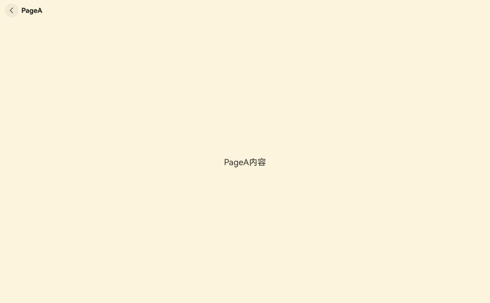
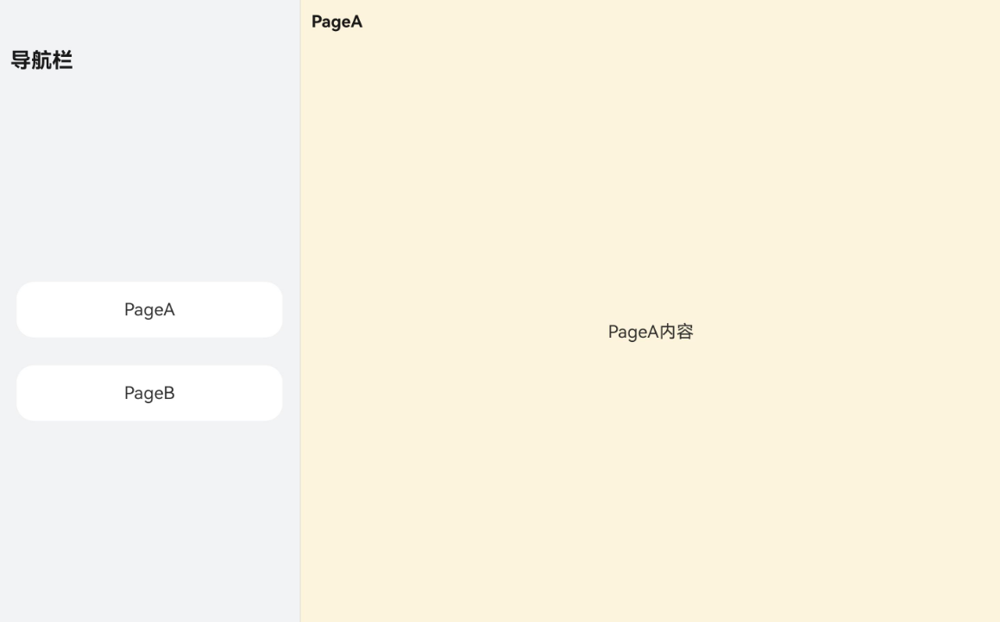
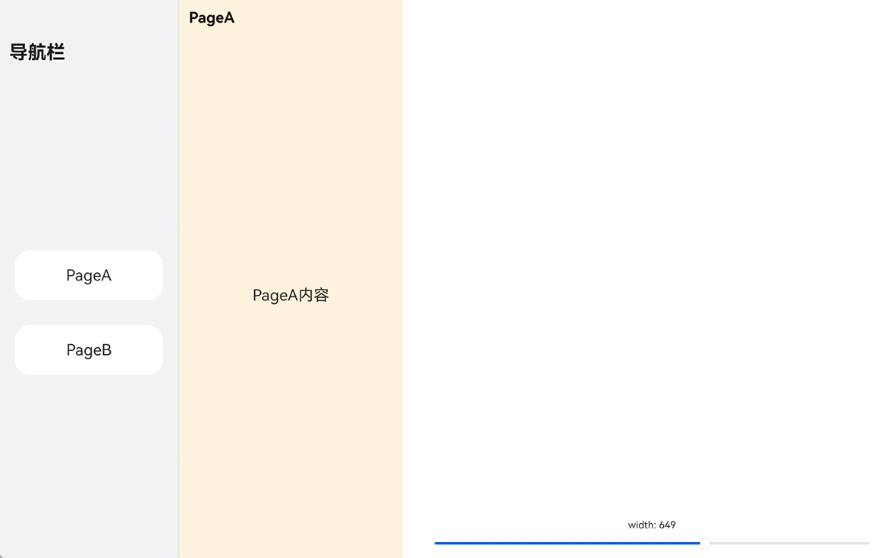
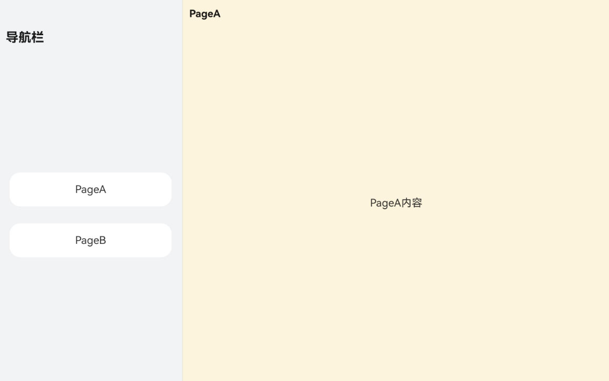
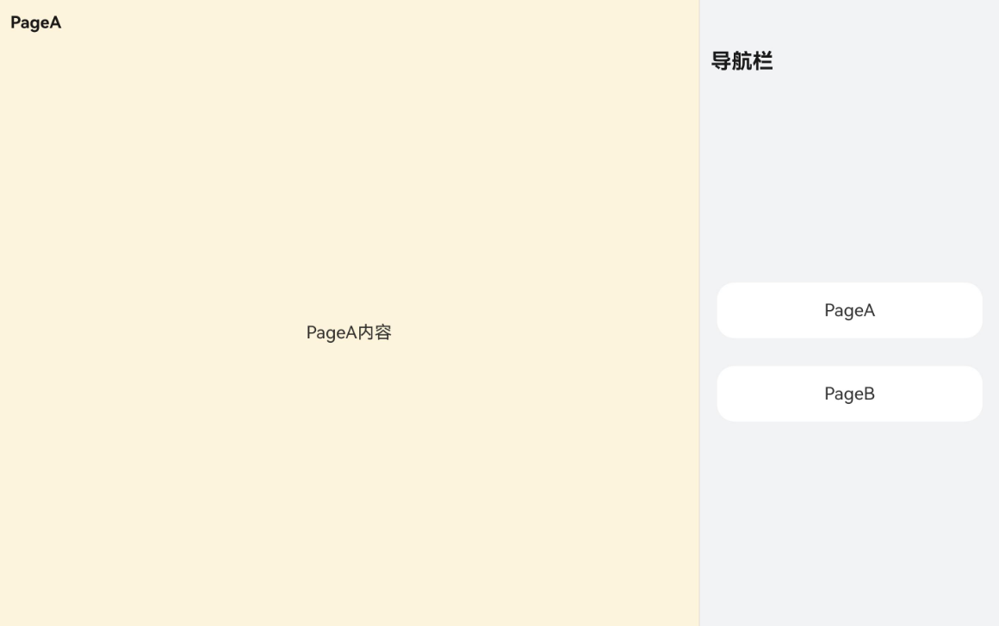
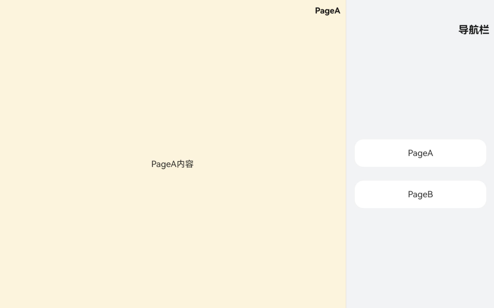
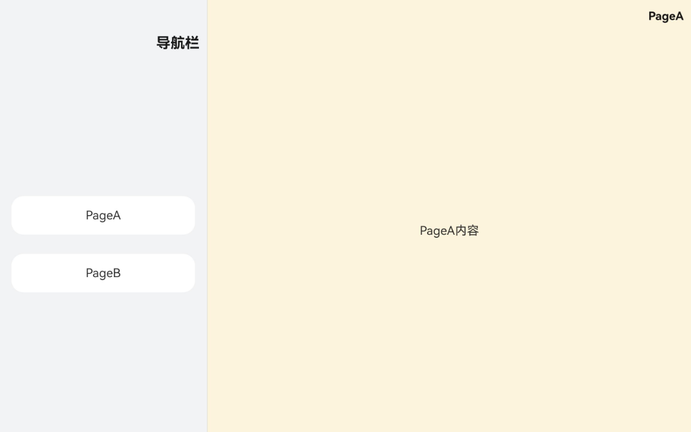
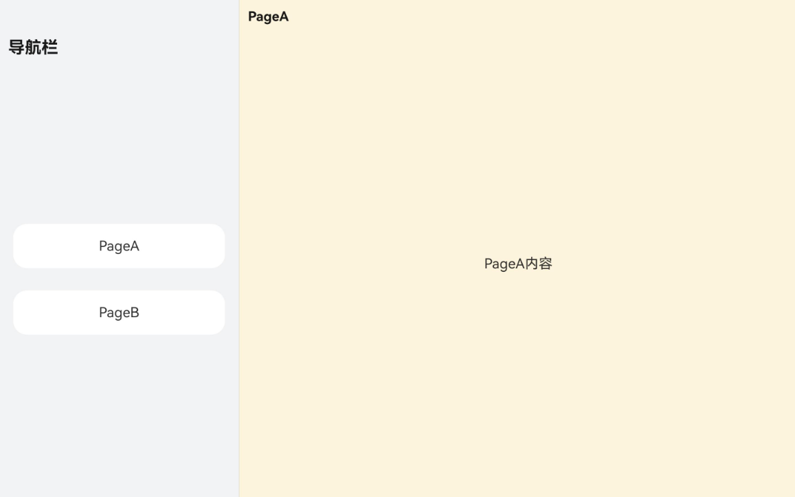
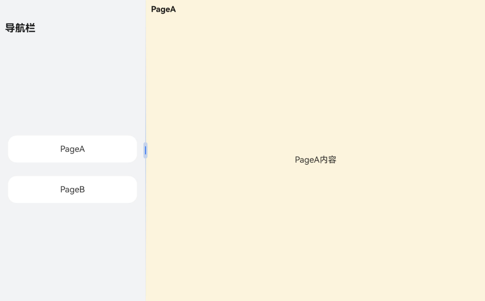
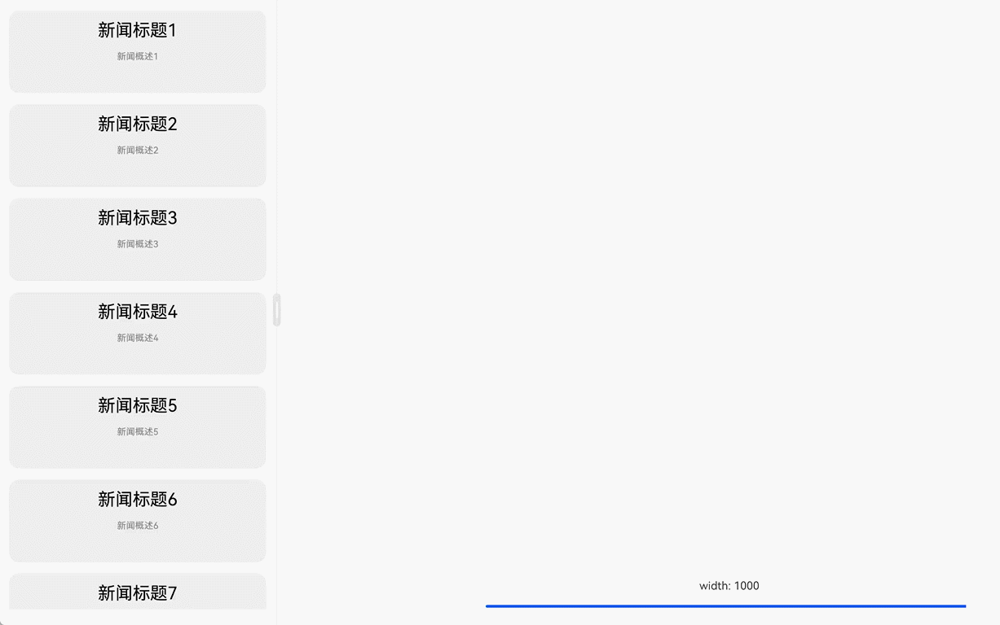

# Navigation分栏开发
<!--Kit: ArkUI-->
<!--Subsystem: ArkUI-->
<!--Owner: @mayaolll-->
<!--Designer: @jiangdayuan-->
<!--Tester: @lxl007-->
<!--Adviser: @Brilliantry_Rui-->

[Navigation](https://developer.huawei.com/consumer/cn/doc/harmonyos-references/ts-basic-components-navigation)作为一个容器组件，提供了两种布局样式：单栏布局、分栏布局。分栏布局一般适用于宽屏设备，在分栏布局下，导航栏（navBar）会固定显示， 子页面（NavDestination）通过导航控制器（NavPathStack）切换显示， 在导航栏和子页面之间有一条分割线， 可以通过分割线拖拽控制左右显示的比例。架构图详见[Navigation基础架构介绍](./arkts-navigation-architecture.md)。

## 分栏相关接口介绍

### mode

[mode](../reference/apis-arkui/arkui-ts/ts-basic-components-navigation.md#mode9)属性用于控制Navigation的显示模式，有三种模式：单栏，分栏，自适应。

  **图1** 单栏（NavigationMode.Stack）效果



  **图2** 分栏（NavigationMode.Split）效果



  **图3** 自适应（NavigationMode.Auto）效果



### navBarPosition

[navBarPosition](../reference/apis-arkui/arkui-ts/ts-basic-components-navigation.md#navbarposition9)用于控制导航栏显示的位置，用navBarPosition控制导航栏显示位置时，同样会被系统语言所以影响。比如，在以汉语、英语为代表的LTR语言体系下，NavBarPosition.Start指代的是导航栏出现在左侧，而在以阿拉伯语为代表的RTL语言体系下，NavBarPosition.Start则指代导航栏出现在右侧。类似的效果也出现在NavBarPosition.End上。

**NavBarPosition.Start**

**图4** 系统语言为LTR时NavBarPosition.Start效果



**图5** 系统语言为RTL时NavBarPosition.Start效果



**NavBarPosition.End**

**图6** 系统语言为LTR时NavBarPosition.End效果



**图7** 系统语言为RTL时NavBarPosition.End效果



### enableDragBar

[enableDragBar](../reference/apis-arkui/arkui-ts/ts-basic-components-navigation.md#enabledragbar14)用于控制是否显示分栏的拖动按钮。

**图8** enableDragBar为false效果



**图9** enableDragBar为true



### navBarWidth

[navBarWidth](../reference/apis-arkui/arkui-ts/ts-basic-components-navigation.md#navbarwidth9)用于控制导航栏的宽度。

### navBarWidthRange

[navBarWidthRange](../reference/apis-arkui/arkui-ts/ts-basic-components-navigation.md#navbarwidthrange10)用于设置导航栏宽度可调整的范围。

### minContentWidth

[minContentWidth](../reference/apis-arkui/arkui-ts/ts-basic-components-navigation.md#mincontentwidth10)用于控制分栏子页的最小宽度；分栏模式导航栏和子页中间会有一个分割线，在可调范围内，用户可以通过拖动分割线来调整导航栏和子页的显示大小。

### hideNavBar

[hideNavBar](../reference/apis-arkui/arkui-ts/ts-basic-components-navigation.md#hidenavbar9)用于控制导航栏的显示状态，默认值为`false`。如果同时将`mode`配置为`NavigationMode.Split`且`hideNavBar`设置为`true`，则实际效果会显示为单栏。

### enableModeChangeAnimation

[enableModeChangeAnimation](../reference/apis-arkui/arkui-ts/ts-basic-components-navigation.md#enablemodechangeanimation15)用于控制是否开启单双栏切换的动画，默认开启。

### splitPlaceholder

[splitPlaceholder](../reference/apis-arkui/arkui-ts/ts-basic-components-navigation.md#splitplaceholder20)用于设置分栏模式下内容区的默认占位页。分栏模式在默认情况下，栈中没有页面时内容区展示空白，可使用此接口设置此区域的UI布局。

需要注意的是，占位页仅作为UI展示页，仅分栏模式空栈的情况下才展示，不受路由栈管理也不可获焦和响应事件。

## 分栏开发示例

以开发一个新闻app的demo来演示如何使用Navigation分栏相关接口。

1. 首先新闻主页内容会放到左侧NavBar中，其中内容是一个新闻列表，用户点击每一条新闻标题时，右边会push一个详情页，用来展示新闻的信息。

2. 其次需要给左侧NavBar设置一个宽度范围，右侧子页区域也设置一个最小宽度。

3. 最后通过滑动slider控制navigation的宽度，当宽度>=600vp时，切换至分栏显示，<600vp时，切换至单栏显示。

配置的路由表：

```json
{
  "routerMap": [
    {
      "name": "NewsDetail",
      "pageSourceFile": "src/main/ets/pages/navigation/splitmode/NewsDetail.ets",
      "buildFunction": "NewsDetailPageBuilder",
      "data": {
        "description": "this is DetailPageA"
      }
    }
  ]
}
```

子页代码：

<!-- @[NewsDetail](https://gitcode.com/openharmony/applications_app_samples/blob/master/code/DocsSample/ArkUISample/NavigationSample/entry/src/main/ets/pages/navigation/splitmode/NewsDetail.ets) -->

``` TypeScript
// 自定义的参数类型，用于在push页面时给子页传递参数
export class NewsItem {
  public title: string;
  public overview: string;
  public content: string;

  constructor(title: string, overview: string, content: string) {
    this.title = title;
    this.overview = overview;
    this.content = content;
  }
}

@Builder
export function NewsDetailPageBuilder() {
  NewsDetail()
}

@Component
struct NewsDetail {
  @State title: string = '';
  @State content: string = '';

  build() {
    NavDestination() {
      Column() {
        Text(this.content)
      }
    }
    .title(this.title)
    .backgroundColor('# fff6e3c8')
    .onReady((ctx: NavDestinationContext) => {
      // 在onReady生命周期拿到传来的页面参数
      let param = ctx.pathInfo.param as NewsItem;
      this.title = param?.title;
      this.content = param?.content;
    })
  }
}
```

主页代码：

<!-- @[SplitNavigation](https://gitcode.com/openharmony/applications_app_samples/blob/master/code/DocsSample/ArkUISample/NavigationSample/entry/src/main/ets/pages/navigation/splitmode/SplitNavigation.ets) -->

``` TypeScript
import { NewsItem } from './NewsDetail'

@Component
struct NewsHome {
  private newsItemArray: Array<NewsItem> = [];
  private stack: NavPathStack | undefined = undefined;

  aboutToAppear(): void {
    // 这里省略了从网络获取新闻信息的过程
    for (let i = 0; i < 50; i++) {
      this.newsItemArray.push(new NewsItem(`新闻标题${i + 1}`, `新闻概述${i + 1}`, `新闻详情${i + 1}`))
    }
    let info = this.queryNavigationInfo();
    this.stack = info?.pathStack;
  }

  build() {
    List() {
      ForEach(this.newsItemArray, (item: NewsItem, index: number) => {
        ListItem() {
          Column() {
            Text(`${item.title}`).margin(15).fontSize(25).fontColor(Color.Black)
            Text(`${item.overview}`).fontSize(13).fontColor(Color.Gray)
          }.margin({bottom: 15}).backgroundColor('# eeeeee').width('100%')
          .borderRadius(15).height(120).onClick(() => {
            // 用户点击某一个新闻标签时，就在右侧子页区域push一个NavDestination页面，用来展示新闻详情
            this.stack?.pushPath({name: 'NewsDetail', param: item})
          })
        }.width('100%')
      }, (item: NewsItem, index: number) => {
        return item.title;
      })
    }.width('100%').height('100%').padding(15)
  }
}

@Entry
@Component
struct Index {
  private stack: NavPathStack = new NavPathStack();
  @State navWidth: number = 100;

  build() {
    RelativeContainer() {
      Navigation(this.stack) {
        NewsHome().width('100%').height('100%')
      }
      .mode(NavigationMode.Split)
      .enableDragBar(true)
      .hideNavBar(false)
      .navBarWidthRange([100, 700]) // 指定NavBar区域的宽度范围
      .minContentWidth(100) // 指定子页区域的最小宽度
      .hideTitleBar(true)
      .hideToolBar(true)
      .height('100%')
      .width(`${this.navWidth}%`)
      .alignRules({
        top: { anchor: '__container__', align: VerticalAlign.Top },
        left: { anchor: '__container__', align: HorizontalAlign.Start }
      })
    }
  }
}
```

**图10** 运行效果


