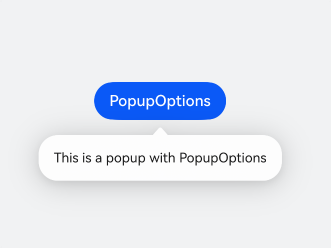
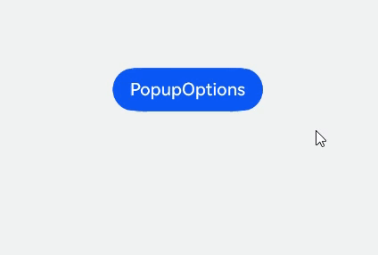
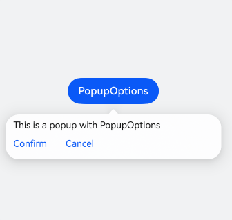
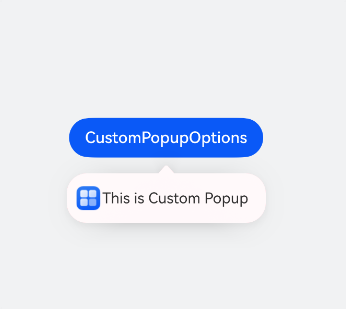
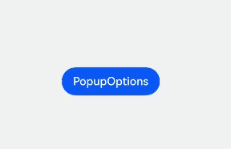
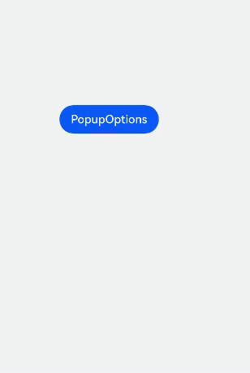
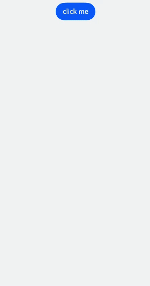

# 气泡提示（Popup）
<!--Kit: ArkUI-->
<!--Subsystem: ArkUI-->
<!--Owner: @liyi0309-->
<!--Designer: @liyi0309-->
<!--Tester: @lxl007-->
<!--Adviser: @Brilliantry_Rui-->
Popup属性可绑定在组件上显示气泡弹窗提示，设置弹窗内容、交互逻辑和显示状态。主要用于屏幕录制、信息弹出提醒等显示状态。

气泡分为两种类型，一种是系统提供的气泡[PopupOptions](../reference/apis-arkui/arkui-ts/ts-universal-attributes-popup.md#popupoptions类型说明)，一种是开发者可以自定义的气泡[CustomPopupOptions](../reference/apis-arkui/arkui-ts/ts-universal-attributes-popup.md#custompopupoptions8类型说明)。其中，PopupOptions通过配置primaryButton和secondaryButton来设置带按钮的气泡；CustomPopupOptions通过配置[builder](../../application-dev/ui/state-management/arkts-builder.md)来设置自定义的气泡。其中系统提供的气泡PopupOptions，字体的最大放大倍数为2。

气泡可以通过配置[mask](../reference/apis-arkui/arkui-ts/ts-universal-attributes-popup.md#popupoptions类型说明)来实现模态和非模态窗口，mask为true或者颜色值的时候，气泡为模态窗口，mask为false时，气泡为非模态窗口。

多个气泡同时弹出时，子窗内显示的气泡比主窗内显示的气泡层级高，所处窗口相同时，后面弹出的气泡层级比先弹出的气泡层级高。

## 文本提示气泡

文本提示气泡常用于展示带有文本的信息提示，适用于无交互的场景。Popup属性需绑定组件，当bindPopup属性的参数show为true时，会弹出气泡提示。

在Button组件上绑定Popup属性，每次点击Button按钮时，handlePopup会切换布尔值。当值为true时，触发bindPopup弹出气泡。

<!-- @[text_popup](https://gitcode.com/openharmony/applications_app_samples/blob/master/code/DocsSample/ArkUISample/DialogProject/entry/src/main/ets/pages/popup/TextPrompts.ets) -->

``` TypeScript
@Entry
@Component
export struct TextPopupExample {
  @State handlePopup: boolean = false;

  build() {
    NavDestination() {
      Column() {
        Button('PopupOptions')
          .id('PopupOptions')
          .margin({ top: 300 })
          .onClick(() => {
            this.handlePopup = !this.handlePopup;
          })
          .bindPopup(this.handlePopup, {
            message: 'This is a popup with PopupOptions',
          })
      }.width('100%').padding({ top: 5 })
    }
    // ...
  }
}
```



## 添加气泡状态变化的事件

通过onStateChange参数为气泡添加状态变化的事件回调，可以判断气泡的当前显示状态。

<!-- @[state_popup](https://gitcode.com/openharmony/applications_app_samples/blob/master/code/DocsSample/ArkUISample/DialogProject/entry/src/main/ets/pages/popup/PopupStateChange.ets) -->

``` TypeScript
@Entry
@Component
export struct StatePopupExample {
  @State handlePopup: boolean = false;

  build() {
    NavDestination() {
        Column() {
          Button('PopupOptions')
            .id('PopupOptions')
            .margin({ top: 300 })
            .onClick(() => {
              this.handlePopup = !this.handlePopup;
            })
            .bindPopup(this.handlePopup, {
              message: 'This is a popup with PopupOptions',
              onStateChange: (e)=> { // 返回当前的气泡状态
                if (!e.isVisible) {
                  this.handlePopup = false;
                }
              }
            })
        }.width('100%').padding({ top: 5 })
    }
    // ...
  }
}
```



## 带按钮的提示气泡

通过primaryButton、secondaryButton属性为气泡最多设置两个Button按钮，通过此按钮进行简单的交互，开发者可以通过配置action参数来设置想要触发的操作。

<!-- @[button_popup](https://gitcode.com/openharmony/applications_app_samples/blob/master/code/DocsSample/ArkUISample/DialogProject/entry/src/main/ets/pages/popup/ButtonPopup.ets) -->

``` TypeScript
import { hilog } from '@kit.PerformanceAnalysisKit';

@Entry
@Component
export struct ButtonPopupExample {
  @State handlePopup: boolean = false;

  build() {
    NavDestination() {
        Column() {
          Button('PopupOptions').margin({ top: 300 })
            .id('PopupOptions')
            .onClick(() => {
              this.handlePopup = !this.handlePopup;
            })
            .bindPopup(this.handlePopup, {
              message: 'This is a popup with PopupOptions',
              primaryButton: {
                value: 'Confirm',
                action: () => {
                  this.handlePopup = !this.handlePopup;
                  hilog.info(0xFF00, 'DialogProject', 'confirm Button click');
                }
              },
              secondaryButton: {
                value: 'Cancel',
                action: () => {
                  this.handlePopup = !this.handlePopup;
                }
              },
              onStateChange: (e) => {
                if (!e.isVisible) {
                  this.handlePopup = false;
                }
              }
            })
        }.width('100%').padding({ top: 5 })
    }
    // ...
  }
}
```



## 气泡的动画

通过定义transition，可以控制气泡的进场和出场动画效果。

<!-- @[animation_popup](https://gitcode.com/openharmony/applications_app_samples/blob/master/code/DocsSample/ArkUISample/DialogProject/entry/src/main/ets/pages/popup/PopupAnimation.ets) -->

``` TypeScript
// xxx.ets
@Entry
@Component
export struct AnimationPopupExample {
  @State handlePopup: boolean = false;
  @State customPopup: boolean = false;

  // popup构造器定义弹框内容
  @Builder
  popupBuilder() {
    Row() {
      Text('Custom Popup with transitionEffect').fontSize(10)
    }.height(50).padding(5)
  }

  build() {
    NavDestination() {
      Flex({ direction: FlexDirection.Column }) {
        // PopupOptions 类型设置弹框内容
        Button('PopupOptions')
          .id('PopupOptions')
          .onClick(() => {
            this.handlePopup = !this.handlePopup;
          })
          .bindPopup(this.handlePopup, {
            message: 'This is a popup with transitionEffect',
            placement: Placement.Top,
            showInSubWindow: false,
            onStateChange: (e) => {
              if (!e.isVisible) {
                this.handlePopup = false;
              }
            },
            // 设置弹窗显示动效为透明度动效与平移动效的组合效果，无退出动效
            transition: TransitionEffect.asymmetric(
              TransitionEffect.OPACITY.animation({ duration: 1000, curve: Curve.Ease }).combine(
                TransitionEffect.translate({ x: 50, y: 50 })),
              TransitionEffect.IDENTITY)
          })
          .position({ x: 100, y: 150 })

        // CustomPopupOptions 类型设置弹框内容
        Button('CustomPopupOptions')
          .id('CustomPopupOptions')
          .onClick(() => {
            this.customPopup = !this.customPopup;
          })
          .bindPopup(this.customPopup, {
            builder: this.popupBuilder,
            placement: Placement.Top,
            showInSubWindow: false,
            onStateChange: (e) => {
              if (!e.isVisible) {
                this.customPopup = false;
              }
            },
            // 设置弹窗显示动效与退出动效为缩放动效
            transition: TransitionEffect.scale({ x: 1, y: 0 }).animation({ duration: 500, curve: Curve.Ease })
          })
          .position({ x: 80, y: 300 })
      }.width('100%').padding({ top: 5 })
    }
    // ...
  }
}
```


## 自定义气泡

开发者可以使用CustomPopupOptions的builder创建自定义气泡，\@Builder中可以放自定义的内容。除此之外，还可以通过popupColor等参数控制气泡样式。

<!-- @[custom_popup](https://gitcode.com/openharmony/applications_app_samples/blob/master/code/DocsSample/ArkUISample/DialogProject/entry/src/main/ets/pages/popup/CustomPopup.ets) -->

``` TypeScript
// $r('app.media.xxx')需要替换为开发者所需的图像资源文件。
@Entry
@Component
export struct CustomPopupExample {
  @State customPopup: boolean = false;

  // popup构造器定义弹框内容
  @Builder
  popupBuilder() {
    Row({ space: 2 }) {
      Image($r('app.media.app_icon')).width(24).height(24).margin({ left: 5 })
      Text('This is Custom Popup').fontSize(15)
    }.width(200).height(50).padding(5)
  }

  build() {
    NavDestination() {
      Column() {
        Button('CustomPopupOptions')
          .id('CustomPopupOptions')
          .margin({ top: 300 })
          .onClick(() => {
            this.customPopup = !this.customPopup;
          })
          .bindPopup(this.customPopup, {
            builder: this.popupBuilder, // 气泡的内容
            placement: Placement.Bottom, // 气泡的弹出位置
            popupColor: Color.Pink, // 气泡的背景色
            backgroundBlurStyle: BlurStyle.NONE,
            onStateChange: (e) => {
              if (!e.isVisible) {
                this.customPopup = false
              }
            }
          })
      }
      .height('100%')
    }
    // ...
  }
}
```

使用者通过配置placement参数将弹出的气泡放到需要提示的位置。弹窗构造器会触发弹出提示信息，来引导使用者完成操作，也让使用者有更好的UI体验。



## 气泡样式

气泡除了可以通过builder实现自定义气泡，还可以通过接口设置气泡的样式和显示效果。

背景颜色：气泡的背景色默认为透明，但是会有一个默认的模糊效果，手机上为COMPONENT\_ULTRA\_THICK。
蒙层样式：气泡默认有蒙层，且蒙层的颜色为透明。
显示大小：气泡大小由内部的builder大小或者message的长度决定的。
显示位置：气泡默认显示在宿主组件的下方，可以通过Placement接口来配置其显示位置以及对齐方向。
以下示例通过设置popupColor（背景颜色）、mask（蒙层样式）、width（气泡宽度）、placement（显示位置）实现气泡的样式。

<!-- @[style_popup](https://gitcode.com/openharmony/applications_app_samples/blob/master/code/DocsSample/ArkUISample/DialogProject/entry/src/main/ets/pages/popup/PopupStyle.ets) -->

``` TypeScript
// xxx.ets

@Entry
@Component
export struct StylePopupExample {
  @State handlePopup: boolean = false;

  build() {
    NavDestination() {
      Column({ space: 100 }) {
        Button('PopupOptions')
          .onClick(() => {
            this.handlePopup = !this.handlePopup;
          })
          .bindPopup(this.handlePopup, {
            width: 200,
            message: 'This is a popup.',
            popupColor: Color.Red, // 设置气泡的背景色
            mask: {
              color: '#33d9d9d9'
            },
            placement: Placement.Top,
            backgroundBlurStyle: BlurStyle.NONE // 去除背景模糊效果需要关闭气泡的模糊背景
          })
      }
      .width('100%')
    }
    // ...
  }
}
```



## 气泡避让软键盘

当软键盘弹出时，气泡默认不会对其避让，可能导致气泡被软键盘覆盖，从API version 15开始，可以设置keyboardAvoidMode为KeyboardAvoidMode.DEFAULT，来使气泡避让键盘。这时如果当前没有位置放下气泡时，气泡会从预设位置平移覆盖宿主组件。

<!-- @[avoidSoftKeyboard_popup](https://gitcode.com/openharmony/applications_app_samples/blob/master/code/DocsSample/ArkUISample/DialogProject/entry/src/main/ets/pages/popup/PopupAvoidSoftKeyboard.ets) -->

``` TypeScript
// xxx.ets
@Entry
@Component
export struct AvoidSoftKeyboardPopupExample {
  @State handlePopup: boolean = false;

  @Builder
  popupBuilder() {
    Column({ space: 2 }) {
      Text('Custom Popup').fontSize(20)
        .borderWidth(2)
      TextInput()
    }.width(200).padding(5)
  }

  build() {
    NavDestination() {
      Column({ space: 100 }) {
        TextInput()
        Button('PopupOptions')
          .id('PopupOptions')
          .onClick(() => {
            this.handlePopup = !this.handlePopup;
          })
          .bindPopup(this.handlePopup!!, {
            width: 200,
            builder: this.popupBuilder(),
            placement: Placement.Bottom,
            mask: false,
            autoCancel: false,
            keyboardAvoidMode: KeyboardAvoidMode.DEFAULT
          })
          .position({ x: 100, y: 300 })
      }
      .width('100%')
    }
    // ...
  }
}
```




## 设置气泡内的多态效果

目前使用@Builder自定义气泡内容时，默认不支持多态样式，可以使用@Component新建一个组件实现按下气泡中的内容时背景变色。

<!-- @[polymorphicEffect_popup](https://gitcode.com/openharmony/applications_app_samples/blob/master/code/DocsSample/ArkUISample/DialogProject/entry/src/main/ets/pages/popup/PopupPolymorphicEffect.ets) -->

``` TypeScript
// $r('app.media.xxx')需要替换为开发者所需的图像资源文件。
@Entry
@Component
export struct PolymorphicEffectPopupExample {
  // 请在resources\base\element\string.json文件中配置name为'xxx' ，value为非空字符串的资源
  @State scan: string =
    this.getUIContext().getHostContext()?.resourceManager.getStringByNameSync('Scan_title') as string;
  @State createGroupChat: string =
    this.getUIContext().getHostContext()?.resourceManager.getStringByNameSync('Create_group_chat') as string;
  @State electronicWorkCard: string =
    this.getUIContext().getHostContext()?.resourceManager.getStringByNameSync('Electronic_work_card') as string;
  private menus: Array<string> = [this.scan, this.createGroupChat, this.electronicWorkCard];

  // popup构造器定义弹框内容
  @Builder
  popupItemBuilder(name: string, action: string) {
    PopupItemChild({ childName: name, childAction: action })
  }

  // popup构造器定义弹框内容
  @Builder
  popupBuilder() {
    Column() {
      ForEach(
        this.menus,
        (item: string, index) => {
          this.popupItemBuilder(item, String(index))
        },
        (item: string, index) => {
          return item
        })
    }
    .padding(8)
  }

  @State customPopup: boolean = false;

  build() {
    NavDestination() {
      Column() {
        Button('click me')
          .id('click me')
          .onClick(() => {
            this.customPopup = !this.customPopup
          })
          .bindPopup(
            this.customPopup,
            {
              builder: this.popupBuilder, // 气泡的内容
              placement: Placement.Bottom, // 气泡的弹出位置
              popupColor: Color.White, // 气泡的背景色
              onStateChange: (event) => {
                if (!event.isVisible) {
                  this.customPopup = false
                }
              }
            })
      }
      .width('100%')
      .justifyContent(FlexAlign.Center)
    }
    // ...
  }
}

@Component
struct PopupItemChild {
  @Prop childName: string = '';
  @Prop childAction: string = '';
  @State selected: string =
    this.getUIContext().getHostContext()?.resourceManager.getStringByNameSync('Selected') as string;

  build() {
    Row({ space: 8 }) {
      Image($r('app.media.startIcon'))
        .width(24)
        .height(24)
      Text(this.childName)
        .fontSize(16)
    }
    .width(130)
    .height(50)
    .padding(8)
    .onClick(() => {
      this.getUIContext().getPromptAction().showToast({ message: this.selected + this.childName })
    })
    .stateStyles({
      normal: {
        .backgroundColor(Color.White)
      },
      pressed: {
        .backgroundColor('#d4f1ff')
      }
    })
  }
}
```



## 气泡支持避让中轴

从API version 18起，气泡支持中轴避让功能。从API version 20开始，在2in1设备上默认启用（仅在窗口处于瀑布模式时产生避让）。开发者可通过[PopupOptions](../reference/apis-arkui/arkui-ts/ts-universal-attributes-popup.md#popupoptions类型说明)中的enableHoverMode属性，控制气泡是否启用中轴避让。

> **说明：** 
> - 如果气泡的点击位置在中轴区域，则气泡不会避让。
> - 2in1设备上需同时满足窗口处于瀑布模式才会产生避让。

<!-- @[supportedAvoidAxis_popup](https://gitcode.com/openharmony/applications_app_samples/blob/master/code/DocsSample/ArkUISample/DialogProject/entry/src/main/ets/pages/popup/PopupSupportedAvoidAxis.ets) -->

``` TypeScript
@Entry
@Component
export struct SupportedAvoidAxisPopupExample {
  // 请在resources\base\element\string.json文件中配置name为'xxx' ，value为非空字符串的资源
  @State upScreen: string =
    this.getUIContext().getHostContext()?.resourceManager.getStringByNameSync('Upper_half_screen') as string;
  @State middleAxle: string =
    this.getUIContext().getHostContext()?.resourceManager.getStringByNameSync('Middle_axle') as string;
  @State lowerScreen: string =
    this.getUIContext().getHostContext()?.resourceManager.getStringByNameSync('Lower_half_screen') as string;
  @State subwindowDisplay: string =
    this.getUIContext().getHostContext()?.resourceManager.getStringByNameSync('Subwindow_display') as string;
  @State subwindow: string =
    this.getUIContext().getHostContext()?.resourceManager.getStringByNameSync('Subwindow') as string;
  @State nonSubwindow: string =
    this.getUIContext().getHostContext()?.resourceManager.getStringByNameSync('Non_Subwindow') as string;
  @State zone: string =
    this.getUIContext().getHostContext()?.resourceManager.getStringByNameSync('zone') as string;
  @State hoverModeStart: string =
    this.getUIContext().getHostContext()?.resourceManager.getStringByNameSync('hoverMode_start') as string;

  @State message: string = 'Hello World';
  @State index: number = 0;
  @State arrayStr: Array<string> = [this.upScreen, this.middleAxle, this.lowerScreen];
  @State enableHoverMode: boolean | undefined = true;
  @State showInSubwindow: boolean = false;
  @State placement: Placement | undefined = undefined;
  @State isShow: boolean = false;

  build() {
    NavDestination() {
      RelativeContainer() {
        Column() {
          Button(this.zone + this.arrayStr[this.index])
            .onClick(() => {
              if (this.index < 2) {
                this.index++
              } else {
                this.index = 0
              }
            })

          Button(this.subwindowDisplay + (this.showInSubwindow ? this.subwindow : this.nonSubwindow))
            .onClick(() => {
              this.showInSubwindow = !this.showInSubwindow
            })

          Button(this.hoverModeStart + this.enableHoverMode)
            .onClick(() => {
              if (this.enableHoverMode === undefined) {
                this.enableHoverMode = true
              } else if (this.enableHoverMode === true) {
                this.enableHoverMode = false
              } else {
                this.enableHoverMode = undefined
              }
            })
        }

        Row() {
          Button('Popup')
            .id('Popup')
            .fontWeight(FontWeight.Bold)
            .bindPopup(this.isShow, {
              message: 'popup',
              enableHoverMode: this.enableHoverMode,
              showInSubWindow: this.showInSubwindow,
            })
            .onClick(() => {
              this.isShow = !this.isShow
            })
        }
        .alignRules({
          center: { anchor: '__container__', align: VerticalAlign.Center },
          middle: { anchor: '__container__', align: HorizontalAlign.Center }
        })
        .margin({
          top: this.index === 2 ? 330 : this.index === 1 ? 50 : 0,
          bottom: this.index === 0 ? 330 : 0
        })
      }
      .height('100%')
      .width('100%')
    }
    // ...
  }
}
```