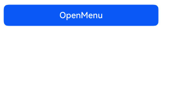

# 不依赖UI组件的全局菜单 (openMenu)
<!--Kit: ArkUI-->
<!--Subsystem: ArkUI-->
<!--Owner: @H-xinwei-->
<!--Designer: @zhanghaibo0-->
<!--Tester: @lxl007-->
<!--Adviser: @Brilliantry_Rui-->

菜单控制 (Menu)在使用时依赖绑定UI组件，否则无法使用。从API version 18开始，可以通过使用全局接口openMenu的方式，在无UI组件的场景下直接或封装使用，例如在事件回调中使用或封装后对外提供能力。

## 弹出菜单

通过openMenu可以弹出菜单。
   
 <!-- @[open_menu](https://gitcode.com/openharmony/applications_app_samples/blob/master/code/DocsSample/ArkUISample/DialogProject/entry/src/main/ets/pages/Menu/globalmenusindependentofuicomponents/GlobalOpenMenu.ets) -->
 
 ``` TypeScript
 this.getUIContext().getPromptAction()
   .openMenu(this.contentNode, { id: targetId }, {
     enableArrow: true
   })
   .then(() => {
     hilog.info(0xFF00, 'globalOpenMenu', 'openMenu success');
   })
   .catch((err: BusinessError) => {
     hilog.error(0xFF00, 'globalOpenMenu', 'openMenu error: ' + err.code + ' ' + err.message);
   });
 ```
 
 

### 创建ComponentContent
   
   通过调用openMenu接口弹出菜单，需要定义ComponentContent，以提供自定义弹出框的内容。详细规格可参考ComponentContent说明。
   
  <!-- @[content_node](https://gitcode.com/openharmony/applications_app_samples/blob/master/code/DocsSample/ArkUISample/DialogProject/entry/src/main/ets/pages/Menu/globalmenusindependentofuicomponents/GlobalOpenMenu.ets) --> 
  
  ``` TypeScript
  private contentNode: ComponentContent<Object> =
    new ComponentContent(this.getUIContext(), wrapBuilder(buildText), this.message, { nestingBuilderSupported: true });
  ```
   
   如果在wrapBuilder中包含其他组件（例如：Popup、Chip组件），则应在创建ComponentContent时设置nestingBuilderSupported属性为true。
   
 <!-- @[build_text](https://gitcode.com/openharmony/applications_app_samples/blob/master/code/DocsSample/ArkUISample/DialogProject/entry/src/main/ets/pages/Menu/globalmenusindependentofuicomponents/GlobalOpenMenu.ets) -->
 
 ``` TypeScript
 @Builder
 export function buildText(params: Params) {
   Popup({
     // 设置图标内容
     icon: {
       // 请将$r('app.media.app_icon')替换为实际资源文件
       image: $r('app.media.app_icon'),
       width: 32,
       height: 32,
       fillColor: Color.White,
       borderRadius: 10
     } as PopupIconOptions,
     // 设置文字内容
     title: {
       text: `This is a Popup title 1`,
       fontSize: 20,
       fontColor: Color.Black,
       fontWeight: FontWeight.Normal
     } as PopupTextOptions,
     // 设置消息内容
     message: {
       text: `This is a Popup message 1`,
       fontSize: 15,
       fontColor: Color.Black
     } as PopupTextOptions,
     // 设置按钮内容
     buttons: [{
       text: 'confirm',
       action: () => {
         hilog.info(0xFF00, 'globalOpenMenu', 'confirm button click');
       },
       fontSize: 15,
       fontColor: Color.Black,
     },
       {
         text: 'cancel',
         action: () => {
           hilog.info(0xFF00, 'globalOpenMenu', 'cancel button click');
         },
         fontSize: 15,
         fontColor: Color.Black
       },] as [PopupButtonOptions?, PopupButtonOptions?]
   })
 }
 
 let contentNode: ComponentContent<Object> =
   new ComponentContent(uiContext, wrapBuilder(buildText), message, { nestingBuilderSupported: true });
 ```
 
 


### 绑定组件信息
   
   通过调用openMenu接口弹出菜单，需要提供绑定组件的信息TargetInfo。若未传入有效的target，菜单将无法弹出。
   
   目前有两种设置target的方式。
   
- target的id属性设置为number类型，此时需要将id设置为对应组件的UniqueID，组件的UniqueID由系统保证唯一性。
   
   <!-- @[frame_node](https://gitcode.com/openharmony/applications_app_samples/blob/master/code/DocsSample/ArkUISample/DialogProject/entry/src/main/ets/pages/Menu/globalmenusindependentofuicomponents/GlobalOpenMenu.ets) -->
   
   ``` TypeScript
   let frameNode: FrameNode | null = this.getUIContext().getFrameNodeByUniqueId(this.getUniqueId());
   let targetId = frameNode?.getChild(0)?.getUniqueId();
   ```
   
- target的id属性设置为string类型，此时需要将id设置为对应组件的通用属性id值。当无法保证id的唯一性时，如多团队开发或者复用自定义组件，可以通过设置componentId属性明确指定此id的范围来精确指定target，此时componentId属性可以设置为对应组件的父组件或者所在自定义组件的UniqueID。
   
   <!-- @[openMenuWithTargetIdString](https://gitcode.com/openharmony/applications_app_samples/blob/master/code/DocsSample/ArkUISample/DialogProject/entry/src/main/ets/pages/Menu/globalmenusindependentofuicomponents/OpenMenuWithTargetIdString.ets) -->
   
   ``` TypeScript
   build() {
     NavDestination() {
       Column() {
         Row() {
           Button('button1')
             .id(this.targetIdString)
         }
   
         Row() {
           Button('button2')
             .id(this.targetIdString)
         }
   
         Button('openMenu')
           .onClick(() => {
             let frameNode: FrameNode | null = this.uiContext.getFrameNodeByUniqueId(this.getUniqueId());
             let componentId = frameNode?.getChild(1)?.getChild(0)?.getChild(1)?.getUniqueId();
             if (componentId == undefined) {
               this.componentId = 0;
             } else {
               this.componentId = componentId;
             }
             this.promptAction.openMenu(this.contentNode, { id: this.targetIdString, componentId: this.componentId }, {
               enableArrow: true
             })
               .then(() => {
                 hilog.info(0x0000, 'openMenuWithTargetIdString', 'openMenu success');
               })
               .catch((err: BusinessError) => {
                 hilog.error(0x0000, 'openMenuWithTargetIdString', 'openMenu error: ' + err.code + ' ' + err.message);
               });
           })
       }
     }
   }
   ```
   

### 设置弹出菜单样式
   
   通过调用openMenu接口弹出菜单，可以设置MenuOptions中的属性调整菜单样式。title属性不生效。preview参数仅支持设置MenuPreviewMode类型。
   
  <!-- @[menu_options](https://gitcode.com/openharmony/applications_app_samples/blob/master/code/DocsSample/ArkUISample/DialogProject/entry/src/main/ets/pages/Menu/globalmenusindependentofuicomponents/GlobalOpenMenu.ets) -->
  
  ``` TypeScript
  private options: MenuOptions = { enableArrow: true, placement: Placement.Bottom };
  ```

## 更新菜单样式

从API version 18开始，通过updateMenu可以更新菜单的样式。支持全量更新和增量更新其菜单样式，不支持更新MenuOptions中的showInSubWindow、preview、previewAnimationOptions、transition、onAppear、aboutToAppear、onDisappear、aboutToDisappear、onWillAppear、onDidAppear、onWillDisappear和onDidDisappear属性。
   
<!-- @[update_menu](https://gitcode.com/openharmony/applications_app_samples/blob/master/code/DocsSample/ArkUISample/DialogProject/entry/src/main/ets/pages/Menu/globalmenusindependentofuicomponents/GlobalOpenMenu.ets) -->

``` TypeScript
this.getUIContext().getPromptAction()
  .updateMenu(this.contentNode, {
    enableArrow: false
  }, true)
  .then(() => {
    hilog.info(0xFF00, 'globalOpenMenu', 'updateMenu success');
  })
  .catch((err: BusinessError) => {
    hilog.error(0xFF00, 'globalOpenMenu', 'updateMenu error: ' + err.code + ' ' + err.message);
  });
```
   
   

## 关闭菜单

从API version 18开始，通过调用closeMenu可以关闭菜单。
   
<!-- @[close_menu](https://gitcode.com/openharmony/applications_app_samples/blob/master/code/DocsSample/ArkUISample/DialogProject/entry/src/main/ets/pages/Menu/globalmenusindependentofuicomponents/GlobalOpenMenu.ets) --> 

``` TypeScript
this.getUIContext().getPromptAction()
  .closeMenu(this.contentNode)
  .then(() => {
    hilog.info(0xFF00, 'globalOpenMenu', 'closeMenu success');
  })
  .catch((err: BusinessError) => {
    hilog.error(0xFF00, 'globalOpenMenu', 'closeMenu error: ' + err.code + ' ' + err.message);
  });
```
   


> **说明：**
>
> 由于updateMenu和closeMenu依赖content来更新或者关闭指定的菜单，开发者需自行维护传入的content。

## 在HAR包中使用全局菜单

可以通过HAR包封装一个Menu，从而对外提供菜单的弹出、更新和关闭能力。

具体调用方式参考在HAR包中使用全局气泡提示。
