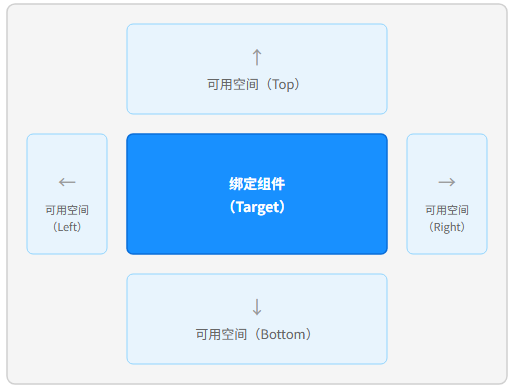

# 弹窗组件常见问题
<!--Kit: ArkUI-->
<!--Subsystem: ArkUI-->
<!--Owner: @liyi0309-->
<!--Designer: @liyi0309-->
<!--Tester: @lxl007-->
<!--Adviser: @Brilliantry_Rui-->

本文档介绍弹窗组件的常见问题并提供参考。

## bindPopup设置placement属性不生效

**问题现象**

通过[Popup控制](../reference/apis-arkui/arkui-ts/ts-universal-attributes-popup.md)设置[placement](../reference/apis-arkui/arkui-ts/ts-universal-attributes-popup.md#popupoptions类型说明)属性后，气泡未显示在预期的位置。

**可能原因**

Popup气泡的默认显示区域是绑定组件以外的窗口区域，框架内部会根据可用空间自动调整气泡位置，而非严格按照开发者设置的placement位置显示。

Popup气泡优先在开发者设置的placement位置显示，当空间不足时会按以下策略自动避让。

1. Popup气泡的默认显示区域是绑定组件以外的窗口区域，如下示意图所示：

   

2. 如果设置的位置可用空间不够完整显示气泡，ArkUI框架会判断该位置的镜像位置是否可以显示。例如Placement.Bottom的镜像位置是Placement.Top，Placement.Left的镜像位置是Placement.Right。

3. 如果镜像位置的空间仍然不足，会切换到另一轴方向的位置显示，即跨轴避让（cross-axis fallback）。例如垂直方向（Top/Bottom）都不够时，会尝试水平方向（Left/Right），反之亦然。

4. 如果四周空间均不足以完整显示气泡，则默认气泡会遮挡绑定组件进行显示。如果开发者不期望遮挡绑定组件，可通过设置[avoidTarget](../reference/apis-arkui/arkui-ts/ts-universal-attributes-popup.md#popupoptions类型说明)属性为AvoidanceMode.AVOID_AROUND_TARGET来解决，此时气泡在剩余空间不足的情况下会进行压缩以避免遮挡绑定组件。

**参考链接**

- [Popup控制](../reference/apis-arkui/arkui-ts/ts-universal-attributes-popup.md)
