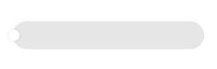
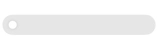
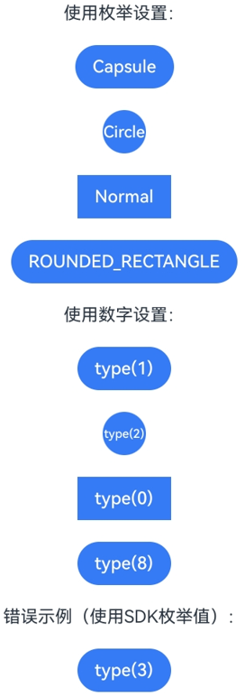

# 按钮与选择组件常见问题
<!--Kit: ArkUI-->
<!--Subsystem: ArkUI-->
<!--Owner: @liyi0309-->
<!--Designer: @liyi0309-->
<!--Tester: @lxl007-->
<!--Adviser: @Brilliantry_Rui-->

本文档介绍按钮与选择组件的常见问题并提供参考。

## Slider组件滑块与滑轨是如何对齐的

Slider的滑块与滑轨显示样式[SliderStyle](../reference/apis-arkui/arkui-ts/ts-basic-components-slider.md#sliderstyle枚举说明)有三种，其中SliderStyle.OutSet与SliderStyle.InSet存在滑块。Slider的滑动条进度为最小值时，滑块对齐方式如下：

SliderStyle.OutSet模式下，滑块的中心与滑轨的端点对齐，示例图如下：



SliderStyle.InSet模式下，滑块与滑轨的中心对齐，即距离端点滑轨高度的一半的位置，示例图如下：



**示例**

```ts
@Entry
@Component
struct Index {
  build() {
    Column() {
      Slider({
        style: SliderStyle.OutSet
      })
        .blockSize({
          width: 20,
          height: 20
        })
        .trackThickness(50)
      Slider({
        style: SliderStyle.InSet
      })
        .blockSize({
          width: 20,
          height: 20
        })
        .trackThickness(50)
    }
    .height('100%')
    .width('100%')
  }
}
```

## 使用AttributeModifier设置Button的LabelStyle时，默认字体粗细与直接设置不一致

**问题现象**

在Button组件中设置LabelStyle时，采用不同设置方式会出现Label文本默认字体粗细显示不一致的现象。

**可能原因**

设置LabelStyle有两种方式，其中：
- 直接设置[LabelStyle](../reference/apis-arkui/arkui-ts/ts-basic-components-button.md#labelstyle10对象说明)。此时font属性中的weight默认值为FontWeight.Medium，对应数值500。
- 通过[AttributeModifier](../reference/apis-arkui/arkui-ts/ts-universal-attributes-attribute-modifier.md#attributemodifier)接口设置。此时font属性中的weight默认值为400，与LabelStyle对象说明中的默认值存在差异。

**解决措施**

为避免不同设置方式导致的显示差异，建议在通过AttributeModifier接口设置LabelStyle时，显式指定weight的值，以确保文本样式符合预期，具体示例如下。

ArkTS-Dyn示例：

<!-- @[button_modifier_faq](https://gitcode.com/openharmony/applications_app_samples/blob/master/code/DocsSample/ArkUISample/ButtonAttribute/entry/src/main/ets/pages/ButtonModifierFAQ.ets) -->

```ts

// pages/ButtonModifierFAQ.ets
class MyButtonModifier1 implements AttributeModifier<ButtonAttribute> {
  applyNormalAttribute(instance: ButtonAttribute): void {
    instance.labelStyle({});
  }
}

class MyButtonModifier2 implements AttributeModifier<ButtonAttribute> {
  applyNormalAttribute(instance: ButtonAttribute): void {
    instance.labelStyle({
      font: {
        weight: FontWeight.Medium
      }
    });
  }
}

@Entry
@Component
struct Index {
  @State modifier1: MyButtonModifier1 = new MyButtonModifier1();
  @State modifier2: MyButtonModifier2 = new MyButtonModifier2();

  build() {
    Column() {
      Text('normal')
      // Button直接设置labelStyle，font属性中的weight默认值为500
      Button('DemoButtonTest')
        .width(100)
        .labelStyle({})
      Divider()
      // 通过AttributeModifier接口设置labelStyle，font属性中的weight默认值为400
      Text('modifier1')
      Button('DemoButtonTest')
        .width(100)
        .attributeModifier(this.modifier1)

      Text('modifier2')
      Button('DemoButtonTest')
        .width(100)
        .attributeModifier(this.modifier2)
    }.height('100%')
  }
}
```

ArkTS-Sta示例：

<!-- @[button_modifier_faq](https://gitcode.com/openharmony/applications_app_samples/blob/OpenHarmony_feature_sta_20260331/code/DocsSample/ArkUISample-Sta/ButtonAttribute/entry/src/main/ets/pages/ButtonModifierFAQ.ets) -->

``` TypeScript

// pages/ButtonModifierFAQ.ets
import {
  Entry,
  Component,
  Column,
  Text,
  Button,
  Divider,
  AttributeModifier,
  ButtonAttribute,
  FontWeight
} from '@kit.ArkUI';
import { State } from '@ohos.arkui.stateManagement';

class MyButtonModifier1 implements AttributeModifier<ButtonAttribute> {
  applyNormalAttribute(instance: ButtonAttribute): void {
    instance.labelStyle({});
  }
}

class MyButtonModifier2 implements AttributeModifier<ButtonAttribute> {
  applyNormalAttribute(instance: ButtonAttribute): void {
    instance.labelStyle({
      font: {
        weight: FontWeight.Medium
      }
    });
  }
}

@Entry
@Component
struct Index {
  @State modifier1: MyButtonModifier1 = new MyButtonModifier1();
  @State modifier2: MyButtonModifier2 = new MyButtonModifier2();

  build(): void {
    Column() {
      Text('normal')
      // Button直接设置labelStyle，font属性中的weight默认值为500
      Button('DemoButtonTest')
        .width(100)
        .labelStyle({})
      Divider()
      // 通过AttributeModifier接口设置labelStyle，font属性中的weight默认值为400
      Text('modifier1')
      Button('DemoButtonTest')
        .width(100)
        .attributeModifier(this.modifier1)

      Text('modifier2')
      Button('DemoButtonTest')
        .width(100)
        .attributeModifier(this.modifier2)
    }.height('100%')
  }
}
```


## Button组件设置type时，ButtonType枚举值与数字值不一致

**问题现象**

Button组件的type属性支持使用[ButtonType](../../application-dev/reference/apis-arkui/arkui-ts/ts-basic-components-button.md#buttontype枚举说明)枚举或数字进行设置，但SDK中枚举的数值与实际type可用的数值不一致。例如ButtonType.ROUNDED_RECTANGLE枚举数值为3，但是使用`type(ButtonType.ROUNDED_RECTANGLE)`与`type(3)`的效果不同。

**可能原因**

[ButtonType](../../application-dev/reference/apis-arkui/arkui-ts/ts-basic-components-button.md#buttontype枚举说明)枚举数值的定义仅表示枚举项的索引，与type属性实际接收数值不同。映射如下：

| ButtonType枚举 | 枚举值 | type实际数值 |
| --- | --- | --- |
| Normal | 2 | 0 |
| Capsule | 0 | 1 |
| Circle | 1 | 2 |
| ROUNDED_RECTANGLE | 3 | 8 |

因此，`type(8)`的效果等同于`type(ButtonType.ROUNDED_RECTANGLE)`，而`type(3)`不对应任何有效类型，API version 18之前会使用默认值ButtonType.Capsule，API version 18及之后会使用默认值ButtonType.ROUNDED_RECTANGLE。

**解决措施**

建议使用[ButtonType](../../application-dev/reference/apis-arkui/arkui-ts/ts-basic-components-button.md#buttontype枚举说明)枚举进行设置，避免直接使用数字值可能带来的混淆。如果确需使用数字值，请参照上表中的"type实际数值"列进行设置。

**示例**

ArkTS-Dyn示例：

<!-- @[button_type_faq](https://gitcode.com/openharmony/applications_app_samples/blob/master/code/DocsSample/ArkUISample/ButtonAttribute/entry/src/main/ets/pages/ButtonTypeFAQ.ets) -->

``` TypeScript
// pages/ButtonTypeFAQ.ets
@Entry
@Component
struct ButtonTypeDemo {
  build() {
    Column({ space: 20 }) {
      // 使用枚举设置（推荐）
      Text('使用枚举设置：')
      Button('Capsule')
        .type(ButtonType.Capsule)
      Button('Circle')
        .type(ButtonType.Circle)
      Button('Normal')
        .type(ButtonType.Normal)
      Button('ROUNDED_RECTANGLE')
        .type(ButtonType.ROUNDED_RECTANGLE)

      // 使用数字设置（需使用type实际数值）
      Text('使用数字设置：')
      Button('type(1)')
        .type(1) // 等同于 ButtonType.Capsule
      Button('type(2)')
        .type(2) // 等同于 ButtonType.Circle
      Button('type(0)')
        .type(0) // 等同于 ButtonType.Normal
      Button('type(8)')
        .type(8) // 等同于 ButtonType.ROUNDED_RECTANGLE

      // 错误示例：使用SDK枚举值作为type数字
      Text('错误示例（使用SDK枚举值）：')
      Button('type(3)')
        .type(3) // 不对应任何类型，使用默认样式
    }
    .width('100%')
    .height('100%')
    .backgroundColor(Color.White)
    .justifyContent(FlexAlign.Center)
  }
}
```

ArkTS-Sta示例：

<!-- @[button_type_faq](https://gitcode.com/openharmony/applications_app_samples/blob/OpenHarmony_feature_sta_20260331/code/DocsSample/ArkUISample-Sta/ButtonAttribute/entry/src/main/ets/pages/ButtonTypeFAQ.ets) -->

``` TypeScript
// pages/ButtonTypeFAQ.ets
import {
  Entry,
  Component,
  Column,
  ColumnOptions,
  Text,
  Button,
  ButtonType,
  Color,
  FlexAlign
} from '@kit.ArkUI';

@Entry
@Component
struct ButtonTypeDemo {
  build(): void {
    Column({ space: 20 } as ColumnOptions) {
      // 使用枚举设置（推荐）
      Text('使用枚举设置：')
      Button('Capsule')
        .type(ButtonType.Capsule)
      Button('Circle')
        .type(ButtonType.Circle)
      Button('Normal')
        .type(ButtonType.Normal)
      Button('ROUNDED_RECTANGLE')
        .type(ButtonType.ROUNDED_RECTANGLE)

      // 使用数字设置（需使用type实际数值）
      Text('使用数字设置：')
      Button('type(1)')
        .type(1 as ButtonType) // 等同于 ButtonType.Capsule
      Button('type(2)')
        .type(2 as ButtonType) // 等同于 ButtonType.Circle
      Button('type(0)')
        .type(0 as ButtonType) // 等同于 ButtonType.Normal
      // Button('type(8)')
      //   .type(8 as ButtonType) // 等同于 ButtonType.ROUNDED_RECTANGLE

      // 错误示例：使用SDK枚举值作为type数字
      Text('错误示例（使用SDK枚举值）：')
      Button('type(3)')
        .type(3 as ButtonType) // 不对应任何类型，使用默认样式
    }
    .width('100%')
    .height('100%')
    .backgroundColor(Color.White)
    .justifyContent(FlexAlign.Center)
  }
}
```

