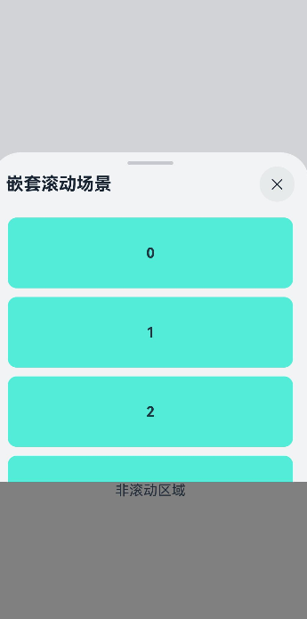
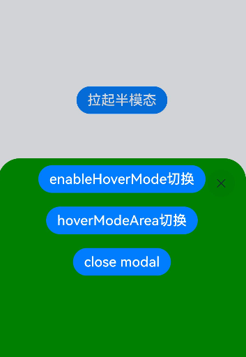

# 绑定半模态页面（bindSheet）
<!--Kit: ArkUI-->
<!--Subsystem: ArkUI-->
<!--Owner: @CCFFWW-->
<!--Designer: @yangfan229-->
<!--Tester: @lxl007-->
<!--Adviser: @HelloCrease-->

[半模态页面（bindSheet）](../reference/apis-arkui/arkui-ts/ts-universal-attributes-sheet-transition.md#bindsheet)默认是模态形式的非全屏弹窗式交互页面，允许部分底层父视图可见，帮助用户在与半模态交互时保留其父视图环境。

半模态页面适用于展示简单的任务或信息面板，例如，个人信息、文本简介、分享面板、创建日程、添加内容等。若需展示可能影响父视图的半模态页面，半模态支持配置为非模态交互形式。

半模态在不同宽度的设备上存在不同的形态能力，开发者对不同宽度的设备上有不同的形态诉求请参考([preferType](../reference/apis-arkui/arkui-ts/ts-universal-attributes-sheet-transition.md#sheetoptions))属性。可以使用bindSheet构建半模态转场效果，详见[模态转场](arkts-modal-transition.md#使用bindsheet构建半模态转场效果)。对于复杂或者冗长的用户流程，建议考虑其他的转场方式替代半模态。如[全模态转场](arkts-contentcover-page.md)和[Navigation转场](arkts-navigation-navigation.md)。

## 使用约束

 - 半模态内嵌[UIExtension](../reference/apis-arkui/js-apis-arkui-uiExtension.md)时，不支持再在UIExtension内拉起半模态/弹窗。

 - 若无二次确认或者自定义关闭行为的场景，不建议使用[shouldDismiss/onWillDismiss](../reference/apis-arkui/arkui-ts/ts-universal-attributes-sheet-transition.md#sheetoptions)接口。

## 生命周期

半模态页面提供了生命周期函数，用于通知用户该弹窗的生命周期状态。生命周期的触发顺序依次为：onWillAppear -> onAppear -> onWillDisappear -> onDisappear。

| 名称            |类型| 说明                       |
| ----------------- | ------ | ---------------------------- |
| onWillAppear    | () => void | 半模态页面显示（动画开始前）回调函数。 |
| onAppear    | () => void  | 半模态页面显示（动画结束后）回调函数。  |
| onWillDisappear | () => void | 半模态页面回退（动画开始前）回调函数。 |
| onDisappear |() => void  | 半模态页面回退（动画结束后）回调函数。     |

## 使用嵌套滚动交互

在半模态面板内容区域滑动时的操作优先级：

1. 内容处于最顶部（内容不可滚动时以此状态处理）

   上滑时，优先向上扩展面板档位，如无档位可扩展，则滚动内容

   下滑时，优先向下收缩面板档位，如无档位可收缩，则关闭面板
2. 内容处于中间位置（可上下滚动）

   上/下滑时，优先滚动内容，直至页面内容到达底部/顶部

3. 内容处于底部位置（内容可滚动时）

   上滑时，呈现内容区域回弹效果，不切换档位

   下滑时，滚动内容直到到达顶部

半模态上述交互默认的嵌套模式为：{Forward：PARENT\_FIRST，Backward：SELF\_FIRST}

如果开发者希望在面板内容的builder中定义滚动容器，如List、Scroll，并结合半模态的上述交互能力，那么需要在垂直方向上为滚动容器设置嵌套滚动属性。

```ts
.nestedScroll({
    // 可滚动组件往末尾端滚动时的嵌套滚动选项，手势向上
    scrollForward: NestedScrollMode.PARENT_FIRST,
    // 可滚动组件往起始端滚动时的嵌套滚动选项，手势向下
    scrollBackward: NestedScrollMode.SELF_FIRST,
})
```

完整示例代码如下：

```ts
@Entry
@Component
struct SheetDemo {
  @State isShowSheet: boolean = false;
  private items: number[] = [0, 1, 2, 3, 4, 5, 6, 7, 8, 9];

  @Builder
  SheetBuilder() {
    Column() {
      // 第一步：自定义滚动容器
      List({ space: '10vp' }) {
        ForEach(this.items, (item: number) => {
          ListItem() {
            Text(String(item)).fontSize(16).fontWeight(FontWeight.Bold)
          }.width('90%').height('80vp').backgroundColor('#ff53ecd9').borderRadius(10)
        })
      }
      .alignListItem(ListItemAlign.Center)
      .margin({ top: '10vp' })
      .width('100%')
      .height('900px')
      // 第二步：设置滚动组件的嵌套滚动属性
      .nestedScroll({
        scrollForward: NestedScrollMode.PARENT_FIRST,
        scrollBackward: NestedScrollMode.SELF_FIRST,
      })

      Text("非滚动区域")
        .width('100%')
        .backgroundColor(Color.Gray)
        .layoutWeight(1)
        .textAlign(TextAlign.Center)
        .align(Alignment.Top)
    }.width('100%').height('100%')
  }

  build() {
    Column() {
      Button('Open Sheet').width('90%').height('80vp')
        .onClick(() => {
          this.isShowSheet = !this.isShowSheet;
        })
        .bindSheet($$this.isShowSheet, this.SheetBuilder(), {
          detents: [SheetSize.MEDIUM, SheetSize.LARGE, 600],
          preferType: SheetType.BOTTOM,
          title: { title: '嵌套滚动场景' },
        })
    }.width('100%').height('100%')
    .justifyContent(FlexAlign.Center)
  }
}
```



## 二次确认能力

推荐使用onWillDismiss接口，此接口支持在回调中处理二次确认，或自定义关闭行为。

> **说明：** 
>
> 声明onWillDismiss接口后，半模态页面的所有关闭操作，包括侧滑、点击关闭按钮、点击蒙层和下拉关闭，都需通过调用dismiss方法来实现。若未实现此逻辑，半模态页面将无法响应上述关闭操作。

```ts
// 第一步：声明onWillDismiss回调
onWillDismiss: ((DismissSheetAction: DismissSheetAction) => {
// 第二步：确认二次回调交互能力，此处用AlertDialog提示 "是否需要关闭半模态"
  this.getUIContext().showAlertDialog(
    {
      message: '是否选择关闭半模态',
      autoCancel: true,
      alignment: DialogAlignment.Bottom,
      gridCount: 4,
      offset: { dx: 0, dy: -20 },
      primaryButton: {
        value: 'cancel',
        action: () => {
          console.info('Callback when the cancel button is clicked');
        }
      },
      secondaryButton: {
        enabled: true,
        defaultFocus: true,
        style: DialogButtonStyle.HIGHLIGHT,
        value: 'ok',
        // 第三步：确认关闭半模态逻辑所在，此处为AlertDialog的Button回调
        action: () => {
          // 第四步：上述第三步逻辑触发的时候，调用dismiss()关闭半模态
          DismissSheetAction.dismiss();
          console.info('Callback when the ok button is clicked');
        }
      },
      cancel: () => {
        console.info('AlertDialog Closed callbacks');
      }
    }
  )
})
```

## 屏蔽部分关闭行为

由于声明了onWillDismiss接口，半模态的关闭行为都需要dismiss处理。可以通过if等逻辑自定义处理关闭逻辑。
下述示例显示半模态页面只在下滑的时候关闭。

```ts
onWillDismiss: ((DismissSheetAction: DismissSheetAction) => {
  if (DismissSheetAction.reason === DismissReason.SLIDE_DOWN) {
    DismissSheetAction.dismiss(); //注册dismiss行为
  }
}),
```

同理可以结合`onWillSpringBackWhenDismiss`接口实现更好的下滑体验。
类比`onWillDismiss`，在声明了`onWillSpringBackWhenDismiss`后，半模态下滑时的回弹操作需要使用 `SpringBackAction.springBack()`处理，无此逻辑则不会回弹。

具体代码如下，在半模态下滑的时候无需回弹。

```ts
onWillDismiss: ((DismissSheetAction: DismissSheetAction) => {
  if (DismissSheetAction.reason === DismissReason.SLIDE_DOWN) {
    DismissSheetAction.dismiss(); //注册dismiss行为
  }
}),

onWillSpringBackWhenDismiss: ((SpringBackAction: SpringBackAction) => {
 //没有注册springBack，下拉半模态页面无回弹行为
}),
```

## 半模态支持避让中轴

半模态从API version 14开始支持中轴避让，当前在2in1设备默认开启（仅窗口处于瀑布模式时产生避让）中轴避让能力，且在2in1设备默认避让区域为上半屏。开发者可以通过[SheetOptions](../reference/apis-arkui/arkui-ts/ts-universal-attributes-sheet-transition.md#sheetoptions)的enableHoverMode主动设置是否避让中轴，及[SheetOptions](../reference/apis-arkui/arkui-ts/ts-universal-attributes-sheet-transition.md#sheetoptions)的hoverModeArea设置避让中轴后显示区域。

- 半模态中轴避让不支持控件子窗能力，[SheetOptions](../reference/apis-arkui/arkui-ts/ts-universal-attributes-sheet-transition.md#sheetoptions)中的showInSubWindow为true的场景。
- 2in1设备上需同时满足窗口处于瀑布模式才会产生避让。

完整示例代码如下：

```ts
@Entry
@Component
struct SheetTransitionExample {
  @State isShow: boolean = false;
  @State enableHoverMode: boolean = true;
  @State hoverModeArea: HoverModeAreaType = HoverModeAreaType.TOP_SCREEN;

  @Builder
  myBuilder() {
    Column() {
      Button("enableHoverMode切换")
        .margin(10)
        .fontSize(20)
        .onClick(() => {
          this.enableHoverMode = !this.enableHoverMode;
        })

      Button("hoverModeArea切换")
        .margin(10)
        .fontSize(20)
        .onClick(() => {
          this.hoverModeArea = this.hoverModeArea === HoverModeAreaType.TOP_SCREEN ?
          HoverModeAreaType.BOTTOM_SCREEN : HoverModeAreaType.TOP_SCREEN;
        })

      Button("close modal")
        .margin(10)
        .fontSize(20)
        .onClick(() => {
          this.isShow = false;
        })
    }
    .width('100%')
    .height('100%')
  }

  build() {
    Column() {
      Button("拉起半模态")
        .onClick(() => {
          this.isShow = true;
        })
        .fontSize(20)
        .margin(10)
        .bindSheet($$this.isShow, this.myBuilder(), {
          height: 300,
          backgroundColor: Color.Green,
          preferType: SheetType.CENTER,
          enableHoverMode: this.enableHoverMode,
          hoverModeArea: this.hoverModeArea
        })
    }
    .justifyContent(FlexAlign.Center)
    .width('100%')
    .height('100%')
  }
}
```


