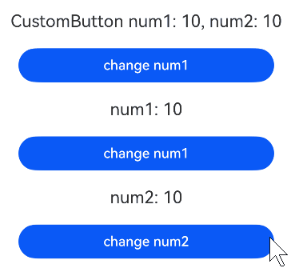

# 在ArkTS-Sta中使用ArkTS-Dyn的自定义构建函数（@Builder）
<!--Kit: ArkUI-->
<!--Subsystem: ArkUI-->
<!--Owner: @lixingchi1; @katabanga-->
<!--Designer: @lixingchi1; @katabanga-->
<!--Tester: @TerryTsao-->
<!--Adviser: @zhang_yixin13-->

## 概述

从API version 23开始，支持在ArkTS-Sta中使用ArkTS-Dyn自定义构建函数([\@Builder](./state-management/arkts-builder.md))。适用于ArkTS-Sta互操作中使用@Builder自定义构建函数的场景。


## 使用限制

- 遵守ArkTS-Dyn自定义构建函数[限制条件](./state-management/arkts-builder.md#限制条件)；

- ArkTS-Dyn自定义构建函数的参数最多不超过10个，否则会编译报错。


## 使用场景

\@Builder的参数传递包括[按回调传递](./state-management/arkts-builder.md#按回调传递参数)、[按引用传递](./state-management/arkts-builder.md#按引用传递参数)与[按值传递](./state-management/arkts-builder.md#按值传递参数)，详见[参数传递规则](./state-management/arkts-builder.md#参数传递规则)。


### 按回调传递参数

开发者可以通过[`UIUtils.makeBinding<T>`](../reference/apis-arkui/js-apis-stateManagement-static.md#makebindingt)函数、[`Binding<T>`](../reference/apis-arkui/js-apis-stateManagement-static.md#bindingt)类和[`MutableBinding<T>`](../reference/apis-arkui/js-apis-stateManagement-static.md#mutablebindingt)类实现[@Builder函数中状态变量的刷新](./state-management/arkts-builder.md#builder支持状态变量刷新)。

在ArkTS-Sta调用ArkTS-Dyn自定义构建函数的场景下，ArkTS-Dyn侧@Builder需要接收动态`Binding`或动态`MutableBinding`类型。由于ArkTS-Sta侧通过`UIUtils.makeBinding()`创建的是静态`Binding`或静态`MutableBinding`，与ArkTS-Dyn的参数类型不兼容。因此在传递给@Builder之前，需要使用`transfer.transferDynamic()`将其转换为动态`Binding`或动态`MutableBinding`类型。

> **说明：**
>
> `transfer.transferDynamic()`的返回类型为`Any`。完成转换后，编译器无法基于返回值继续校验目标侧@Builder参数类型，也无法在当前侧对`Binding<T>`、`MutableBinding<T>`及其泛型参数是否匹配进行静态检查。
>
> 因此，开发者需要自行保证传入的转换key值（如`'ArkUI.Binding'`、`'ArkUI.MutableBinding'`）与ArkTS-Dyn侧@Builder声明的参数类型一致。若类型不匹配，通常无法在编译阶段发现，而会在运行时表现为异常或行为不符合预期。

完整示例结构如下所示：

```text
project/
├── entry/                             # ArkTS-Sta主模块
│   └── src/
│       └── main/
│           └── ets/
│               └── pages/
│                   └── Index.ets      # 调用ArkTS-Dyn@Builder并按回调传递参数
│
└── dynamic_library/                   # ArkTS-Dyn子模块
    └── src/
        └── main/
            └── ets/
                └── components/
                    └── MainPage.ets   # 定义@Builder
```

示例如下：

- 创建ArkTS-Dyn子模块`dynamic_library`，在`dynamic_library/src/main/ets/components`目录创建并导出@Builder自定义构建函数。

```TypeScript
// dynamic_library/src/main/ets/components/MainPage.ets
import { MutableBinding, Binding } from '@kit.ArkUI';

@Builder
export function CustomButton(num1: MutableBinding<number>, num2: Binding<number>) {
  Column() {
    Text(`CustomButton num1: ${num1.value}, num2: ${num2.value}`)
      .fontSize(20)
      .margin(10)
    Button('change num1')
      .onClick(() => {
        num1.value++;
      })
      .width(300)
      .margin(10)
  }
}
```

```TypeScript
// dynamic_library/Index.ets
export { CustomButton } from './src/main/ets/components/MainPage';
```

- 在ArkTS-Sta主模块`entry`中引入ArkTS-Dyn自定义构建函数，并使用`transfer.transferDynamic()`转换为动态类型。且在`oh-package.json5`文件中配置子模块依赖。

```TypeScript
'use static'

// entry/src/main/ets/pages/Index.ets
import { Entry, Component, Column, Button, Text, State, UIUtils } from '@kit.ArkUI';
import { CustomButton } from 'dynamic_library';
import { transfer } from '@kit.ArkTS';

@Entry
@Component
struct Parent {
  @State num1: number = 10;
  @State num2: number = 10;

  build() {
    Column() {
      CustomButton(
        transfer.transferDynamic(
          // 将静态MutableBinding转换为动态MutableBinding，供ArkTS-Dyn @Builder接收。
          UIUtils.makeBinding<number>(
            () => this.num1,
            (val: number) => {
              this.num1 = val;
            }
          ),
          'ArkUI.MutableBinding'
        ),
        transfer.transferDynamic(
          // 将静态Binding转换为动态Binding，供ArkTS-Dyn @Builder接收。
          UIUtils.makeBinding<number>(() => this.num2),
          'ArkUI.Binding'
        )
      )
      Text(`num1: ${this.num1}`)
        .fontSize(20)
        .margin(10)
      Button('change num1')
        .onClick(() => {
          this.num1++;
        })
        .width(300)
        .margin(10)
      Text(`num2: ${this.num2}`)
        .fontSize(20)
        .margin(10)
      Button('change num2')
        .onClick(() => {
          this.num2++;
        })
        .width(300)
        .margin(10)
    }
    .width('100%')
  }
}
```

```json
// entry/oh-package.json5

"dependencies": {
  "dynamic_library": "file:../dynamic_library"
}
```

示例效果图：



### 按引用传递参数

仅接收一个参数且该参数为对象字面量时为按引用传递参数，其余情况均为按值传递参数。该对象字面量包含状态变量时，其变化会触发\@Builder函数内的UI刷新。

由于ArkTS-Dyn不支持跨语言创建对象字面量，因此ArkTS-Sta创建对象字面量时，需要使用ArkTS-Sta侧的对象。

如下示例展示了ArkTS-Sta引用ArkTS-Dyn自定义构建函数按引用传递参数的场景。

完整示例结构如下所示：

```text
project/
├── entry/                             # ArkTS-Sta主模块
│   └── src/
│       └── main/
│           └── ets/
│               └── pages/
│                   └── StaBuilderRef.ets    # 调用@Builder并按引用传递
│
└── static_module/                     # ArkTS-Sta子模块
│   └── src/
│       └── main/
│           └── ets/
│               └── components/
│                   └── MainPage.ets    # Person类定义
│
└── dynamic_module/                     # ArkTS-Dyn子模块
    └── src/
        └── main/
            └── ets/
                └── components/
                    └── MainPage.ets    # 定义@Builder
```

示例如下：

- 创建ArkTS-Sta子模块`static_module`，在`static_module/src/main/ets/components`目录创建并导出`Person`类。如何创建子模块参考共享包（[HAR](../quick-start/har-package.md)）说明。

<!-- @[StaDynBuilderRefStaticMainPage](https://gitcode.com/openharmony/applications_app_samples/blob/OpenHarmony_feature_sta_20260331/code/DocsSample/ArkUISample-Sta/StaInteropDynBuilder/static_module/src/main/ets/components/MainPage.ets) -->

```TypeScript
// static_module/src/main/ets/components/MainPage.ets
export class Person { // ArkTS-Sta侧的对象字面量类型
  name: string = '';
  age: number = 0;
}
```

<!-- @[StaDynBuilderRefStaticIndex](https://gitcode.com/openharmony/applications_app_samples/blob/OpenHarmony_feature_sta_20260331/code/DocsSample/ArkUISample-Sta/StaInteropDynBuilder/static_module/Index.ets) -->

```TypeScript
// static_module/Index.ets
export { Person } from './src/main/ets/components/MainPage'; // 导出ArkTS-Sta Person类
```

- 创建ArkTS-Dyn子模块`dynamic_module`，在`dynamic_module/src/main/ets/components`目录创建并导出自定义构建函数。且在`oh-package.json5`文件中配置子模块依赖。如何导入和使用子模块参考共享包（[HAR](../quick-start/har-package.md)）说明。

<!-- @[StaDynBuilderRefMainPage](https://gitcode.com/openharmony/applications_app_samples/blob/OpenHarmony_feature_sta_20260331/code/DocsSample/ArkUISample-Sta/StaInteropDynBuilder/dynamic_module/src/main/ets/components/MainPage.ets) -->

```TypeScript
// dynamic_module/src/main/ets/components/MainPage.ets
import { Person } from 'static_module';

@Builder
export function personInfo(person: Person) { // 按引用传递参数
  Column(){
    Text(`Name: ${person.name}`)
      .fontSize(20)
      .margin(10)
    Text(`Age: ${person.age}`)
      .fontSize(20)
      .margin(10)
  }
}
```

<!-- @[StaDynBuilderRefDynIndex](https://gitcode.com/openharmony/applications_app_samples/blob/OpenHarmony_feature_sta_20260331/code/DocsSample/ArkUISample-Sta/StaInteropDynBuilder/dynamic_module/Index.ets) -->

```TypeScript
// dynamic_module/Index.ets
export { personInfo } from './src/main/ets/components/MainPage';
```

```json
// dynamic_module/oh-package.json5

"dependencies": {
  "static_module": "file:../static_module"
}
```

- 在ArkTS-Sta主模块`entry`中引入ArkTS-Dyn自定义构建函数。且在`oh-package.json5`文件中配置子模块依赖。

<!-- @[StaDynBuilderRef](https://gitcode.com/openharmony/applications_app_samples/blob/OpenHarmony_feature_sta_20260331/code/DocsSample/ArkUISample-Sta/StaInteropDynBuilder/entry/src/main/ets/pages/StaBuilderRef.ets) -->

```TypeScript
// entry/src/main/ets/pages/StaBuilderRef.ets
import { Entry, Component, Column, Button } from '@ohos.arkui.component';
import { State } from '@ohos.arkui.stateManagement';

import { personInfo } from 'dynamic_module';

@Entry
@Component
struct Parent {
  @State name: string = 'Kevin';
  @State age: number = 20;

  build() {
    Column() {
      // 传入对象字面量，状态变量的改变引起@Builder的UI刷新
      personInfo({ name: this.name, age: this.age })
      Button('changeName')
        .onClick(() => {
          // 修改状态变量name，触发@Builder内部UI刷新
          this.name += 'a';
        })
        .width(300)
        .margin(10)
      Button('changeAge')
        .onClick(() => {
          // 修改状态变量age，触发@Builder内部UI刷新
          this.age += 1;
        })
        .width(300)
        .margin(10)
    }
    .width('100%')
  }
}
```

```json
// entry/oh-package.json5

"dependencies": {
  "dynamic_module": "file:../dynamic_module"
}
```

示例效果图：


### 按值传递参数

调用@Builder函数默认按值传递，当传入状态变量时，其变化不会触发@Builder内部UI刷新。

完整示例结构如下图所示：

```text
project/
├── entry/                            # ArkTS-Sta主模块
│   └── src/
│       └── main/
│           └── ets/
│               └── pages/
│                   └── StaBuilderValue.ets     # 调用@Builder并按值传递参数
│
└── dynamic_module/                   # ArkTS-Dyn子模块
    └── src/
        └── main/
            └── ets/
                └── components/
                    └── MainPage.ets   # 定义@Builder并导出
```

示例如下：

- 创建ArkTS-Dyn子模块`dynamic_module`，在`dynamic_module/src/main/ets/components`目录创建并导出@Builder自定义构建函数。

<!-- @[StaDynBuilderValueMainPage](https://gitcode.com/openharmony/applications_app_samples/blob/OpenHarmony_feature_sta_20260331/code/DocsSample/ArkUISample-Sta/StaInteropDynBuilder/dynamic_module/src/main/ets/components/MainPage.ets) -->

```TypeScript
// dynamic_module/src/main/ets/components/MainPage.ets

@Builder
export function showTextBuilder(input: string) { // 按值传递参数，不会触发UI刷新
  Text(input)
    .fontSize(20)
}
```

<!-- @[StaDynBuilderValueDynIndex](https://gitcode.com/openharmony/applications_app_samples/blob/OpenHarmony_feature_sta_20260331/code/DocsSample/ArkUISample-Sta/StaInteropDynBuilder/dynamic_module/Index.ets) -->

```TypeScript
// dynamic_module/Index.ets
export { showTextBuilder } from './src/main/ets/components/MainPage'; // 导出@Builder函数
```

- 在主模块`entry`的`oh-package.json5`文件中配置子模块依赖。如何导入和使用子模块参考共享包（HAR）说明。

```json
// entry/oh-package.json5

"dependencies": {
  "dynamic_module": "file:../dynamic_module"
}
```

- 在ArkTS-Sta主模块中引入ArkTS-Dyn自定义构建函数。

<!-- @[StaDynBuilderValue](https://gitcode.com/openharmony/applications_app_samples/blob/OpenHarmony_feature_sta_20260331/code/DocsSample/ArkUISample-Sta/StaInteropDynBuilder/entry/src/main/ets/pages/StaBuilderValue.ets) -->

```TypeScript
// entry/src/main/ets/pages/StaBuilderValue.ets
import { Entry, Component, Column } from '@ohos.arkui.component';

import { showTextBuilder } from 'dynamic_module'; // 引入@Builder函数

@Entry
@Component
struct MainPage {
  build() {
    Column() {
      // 直接使用ArkTS-Dyn自定义构建函数
      showTextBuilder('Hello World!')
    }
    .width('100%')
    .height('100%')
  }
}
```

示例效果图：


## 常见问题

### 声明文件编译报错

在ArkTS-Sta中调用ArkTS-Dyn的@Builder并按回调传递参数时，`transfer.transferDynamic()`的返回类型为`Any`。由于ArkTS-Sta主模块会将ArkTS-Dyn子模块生成的ArkTS-Sta声明文件一并参与编译，且静态编译器会严格校验参数类型，若声明文件中仍保留`MutableBinding<number>`、`Binding<number>`等具体类型，可能引发编译报错。

以上文[按回调传递参数](#按回调传递参数)示例为例，定义@Builder的ArkTS-Dyn源文件为`dynamic_library/src/main/ets/components/MainPage.ets`，对应生成的ArkTS-Sta声明文件位于`dynamic_library/build/default/intermediates/declgen/default/declgenV2/src/main/ets/components/MainPage.d.ets`。如遇编译报错，可将声明文件中的参数类型手动修改为`Any`后增量编译。示例如下。

```TypeScript
// ...
// ArkTS-Dyn源码中定义：
// export function CustomButton(num1: MutableBinding<number>, num2: Binding<number>)

// 生成的ArkTS-Sta声明文件中修改为：
@Builder
export declare function CustomButton(num1: Any, num2: Any): void;
```

与在ArkTS-Dyn中使用ArkTS-Sta @Builder的场景相反，该方向会经过静态编译器的严格类型校验，因此更容易暴露此类声明文件类型不匹配问题；反向场景中，动态编译器类型校验较宽松，通常不会出现同类报错。
