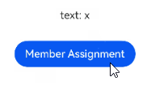
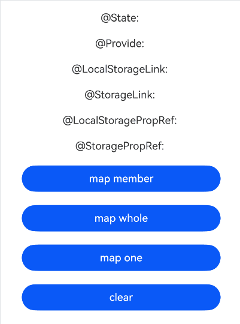

# 在ArkTS-Sta中使用ArkTS-Dyn的@Observed和@ObjectLink（嵌套类对象属性变化）

## 概述

ArkUI的组件间数据交互能力是支持父子组件、兄弟组件、跨层级组件之间传递、同步数据的机制。从API version 23开始，支持在ArkTS-Sta的UI组件中渲染和响应ArkTS-Dyn的动态数据和[@Observed](../ui/state-management/arkts-observed-and-objectlink.md)装饰的数据的变化。


## 使用限制

- 遵循ArkTS-Dyn @Observed和@ObjectLink的[使用限制](../ui/state-management/arkts-observed-and-objectlink.md#限制条件)；

- 遵循ArkTS-Dyn @Track的[使用限制](../ui/state-management/arkts-track.md#限制条件)；

- 遵循ArkTS-Sta @Observed和@ObjectLink的[使用限制](../ui/state-management-static/arkts-static-observed-and-objectlink.md#限制条件)；

- 遵循ArkTS-Sta @Track的[使用限制](../ui/state-management-static/arkts-static-track.md#限制条件)；

- 不能在非UI线程中直接修改ArkTS-Sta组件中使用的ArkTS-Dyn @Observed装饰的数据成员的值，否则会运行异常；

- 遵循[ArkTS-Sta互操作](../quick-start/arkts-interop-overview.md)规范，如不支持ArkTS-Dyn对象继承ArkTS-Sta对象。


## 使用场景

基于以下示例结构，说明在ArkTS-Sta组件中使用动态数据和@Observed装饰数据的场景。

```text
project/
├── entry/                          # ArkTS-Sta主模块
│   └── src/
│       └── main/
│           └── ets/
│               └── pages/
│                   └── Index.ets    # 使用动态@Observed装饰的数据
│
└── dynamic_module/                  # ArkTS-Dyn子模块
    └── src/
        └── main/
            └── ets/
                └── components/
                    └── MainPage.ets  # 导出动态@Observed装饰的数据

```

示例如下：

- 创建ArkTS-Dyn子模块`dynamic_module`，在`src/main/ets/components`目录创建并导出动态@Observed装饰的数据。如何创建子模块参考共享包（[HAR](../quick-start/har-package.md)）说明。

```TypeScript
// dynamic_module/src/main/ets/components/MainPage.ets

@Observed
export class MyClassA { // 定义动态@Observed装饰的类并导出
  @Track name: string = 'text: x';
  message: string = 'text: x';
}
```

### 在ArkTS-Sta中使用ArkTS-Dyn的@Observed装饰的类
ArkTS-Dyn中@Observed装饰的数据被ArkTS-Sta的状态管理V1相关装饰器使用时支持整体监听和一层监听，状态管理V1相关装饰器包括@State，@Link，@PropRef，@Provide，@Consume，@LocalStorageLink，@StroageLink，@LocalStoragePropRef，@StoragePropRef，@ObjectLink。下面以@State装饰器为示例，展示在ArkTS-Sta中使用ArkTS-Dyn的@Observed装饰的类的用法。
- 在ArkTS-Dyn子模块`dynamic_module`的`Index.ets`文件中导出动态@Observed装饰的数据。

```TypeScript
// dynamic_module/Index.ets

export { MyClassA } from './src/main/ets/components/MainPage'; // 导出动态@Observed装饰的类
```

- 在主模块`entry`的`oh-package.json5`文件的`dependencies`字段中添加子模块依赖。如何导入和使用子模块参考共享包（[HAR](../quick-start/har-package.md)）说明。

```json
// entry/oh-package.json5

"dependencies": {
  "dynamic_module": "file:../dynamic_module"
}
```

- 在ArkTS-Sta主模块中使用import语句导入ArkTS-Dyn组件。

```TypeScript
'use static'

// entry/src/main/ets/pages/Index.ets
import { Entry, Component, Row, Column, Scroll, Button, ClickEvent, Text } from '@ohos.arkui.component';
import { State} from '@ohos.arkui.stateManagement';

// 引用ArkTS-Dyn中@Observed装饰的数据
import { MyClassA } from 'dynamic_module';

@Entry
@Component
export struct Index { // ArkTS-Sta组件
  @State state: MyClassA = new MyClassA();

  build() {
    Row() {
      Column() {
        // 在ArkTS-Sta中使用动态@Observed装饰的数据
        Text(this.state.name)
          .height('10%')
        // 单独为动态@Observed装饰的类中的某一个成员赋值
        Button('Member Assignment')
          .onClick((event: ClickEvent)=> {
            this.state.name = 'state: x';
          })
          .margin(10)
        // 创建新对象整体为动态@Observed装饰的类中的成员赋值
        Button('Overall Assignment')
          .onClick((event: ClickEvent)=> {
            let data = new MyClassA();
            data.name = 'state: Hello';
            this.state = data;
          })
          .margin(10)
      }
      .width('100%')
    }
  }
}
  ```


### ArkTS-Sta中@ObjectLink装饰的变量仅支持一层监听
ArkTS-Dyn中@Observed装饰的数据被ArkTS-Sta中@ObjectLink装饰的变量使用时支持一层监听，以下示例展示了@ObjectLink装饰的变量的用法。
```TypeScript
'use static'

// entry/src/main/ets/pages/Index.ets
import { Entry, Component, Row, Column, Button, ClickEvent, Text } from '@ohos.arkui.component';
import { State, ObjectLink} from '@ohos.arkui.stateManagement';

// 引用ArkTS-Dyn中@Observed装饰的数据
import { MyClassA } from 'dynamic_module';

@Component
export struct Index { // ArkTS-Sta组件
  @ObjectLink objectLink: MyClassA;

  build() {
    Column() {
      // 在ArkTS-Sta中使用动态@Observed装饰的数据
      Text(this.objectLink.name)
        .height('10%')
      // 单独为动态@Observed装饰的类中的某一个成员赋值
      Button('Member Assignment')
        .onClick((event: ClickEvent)=> {
          this.objectLink.name = 'objectLink: x';
        })
    }
  }
}

@Entry
@Component
export struct objectLinkSample {
  @State state: MyClassA = new MyClassA();

  build() {
    Column() {
      Index({ objectLink: this.state })
    }
  }
}
```



### 在ArkTS-Sta中使用ArkTS-Dyn的Map类型

> **说明：**
>
> 从API version 23开始，在ArkTS-Sta中支持使用ArkTS-Dyn中\@Observed装饰的类中Map类型的成员变量。

在下面示例中，memberMap类型为Map\<number, string\>，点击Button改变memberMap的值，视图会随之刷新。
```TypeScript
// dynamic_module/src/main/ets/components/MainPage.ets
@Observed
export class Info {
  memberMap: Map<number, string> = new Map<number, string>([[0, 'a'], [1, 'b'], [3, 'c']]);
}
```

```TypeScript
// dynamic_module/Index.ets

export { Info } from './src/main/ets/components/MainPage.ets';
```

```json
// entry/oh-package.json5

"dependencies": {
  "dynamic_module": "file:../dynamic_module",
}
```

```TypeScript
'use static'
// entry/src/main/ets/pages/Index.ets
import { Entry, Component, Row, Column, Scroll, Button, ClickEvent, Text, ColumnOptions, RowOptions, Color, Margin, Divider, ForEach } from '@ohos.arkui.component';
import { State, Link, PropRef, Provide, Consume, LocalStorageLink, StorageLink, LocalStoragePropRef, StoragePropRef, Observed, Track } from '@ohos.arkui.stateManagement';
  
// 引用ArkTS-Dyn中@Observed装饰的数据
import { Info } from 'dynamic_module';

@Entry
@Component
struct MapSample {
  // 接收ArkTS-Dyn中@Observed装饰的数据
  @State stateInfo: Info = new Info();
  @Provide provideInfo: Info = new Info();
  @LocalStorageLink('a') localStorageLinkInfo: Info = new Info();
  @StorageLink('b') storageLinkInfo: Info = new Info();
  @LocalStoragePropRef('c') localStoragePropRefInfo: Info = new Info();
  @StoragePropRef('d') storagePropRefInfo: Info = new Info();

  build() {
    Row({ space: 5 } as RowOptions) {
      Column() {
        // UI中观察ArkTS-Dyn中@Observed装饰的数据的变化
        Text('@State: ' + `${Array.from(this.stateInfo.memberMap.entries())}`)
          .margin(10)
        Text('@Provide: ' + `${Array.from(this.provideInfo.memberMap.entries())}`)
          .margin(10)
        Text('@LocalStorageLink: ' + `${Array.from(this.localStorageLinkInfo.memberMap.entries())}`)
          .margin(10)
        Text('@StorageLink: ' + `${Array.from(this.storageLinkInfo.memberMap.entries())}`)
          .margin(10)
        Text('@LocalStoragePropRef: ' + `${Array.from(this.localStoragePropRefInfo.memberMap.entries())}`)
          .margin(10)
        Text('@StoragePropRef: ' + `${Array.from(this.storagePropRefInfo.memberMap.entries())}`)
          .margin(10)
        // 单独为动态@Observed装饰的类中的所有成员赋值
        Button('map member')
          .onClick(() => {
            this.stateInfo.memberMap = new Map<number, string>([[1, 'a'], [2, 'b'], [3, 'c']]);
            this.provideInfo.memberMap = new Map<number, string>([[1, 'a'], [2, 'b'], [3,'c']]);
            this.localStorageLinkInfo.memberMap = new Map<number, string>([[1, 'a'], [2, 'b'], [3, 'c']]);
            this.storageLinkInfo.memberMap = new Map<number, string>([[1, 'a'], [2, 'b'], [3, 'c']]);
            this.localStoragePropRefInfo.memberMap = new Map<number, string>([[1, 'a'], [2, 'b'], [3, 'c']]);
            this.storagePropRefInfo.memberMap = new Map<number, string>([[1, 'a'], [2, 'b'], [3, 'c']]);
          })
          .margin(10)
          .width('80%')
        // 创建新的对象整体为动态@Observed装饰的类中的成员赋值
        Button('map whole')
          .onClick(() => {
            let data = new Info();
            data.memberMap = new Map<number, string>([[0, 'c'], [1, 'a'], [3, 'b']]);
            this.stateInfo = data;
            this.provideInfo = data;
            this.localStorageLinkInfo = data;
            this.storageLinkInfo = data;
            this.localStoragePropRefInfo = data;
            this.storagePropRefInfo = data;
          })
          .margin(10)
          .width('80%')
        // 单独为动态@Observed装饰的类中的某一个成员赋值
        Button('map one')
          .onClick(() => {
            this.stateInfo.memberMap = new Map<number, string>([[1, 'a']]);
            this.provideInfo.memberMap = new Map<number, string>([[1, 'a']]);
            this.localStorageLinkInfo.memberMap = new Map<number, string>([[1, 'a']]);
            this.storageLinkInfo.memberMap = new Map<number, string>([[1, 'a']]);
            this.localStoragePropRefInfo.memberMap = new Map<number, string>([[1, 'a']]);
            this.storagePropRefInfo.memberMap = new Map<number, string>([[1, 'a']]);
          })
          .margin(10)
          .width('80%')
        Button('clear')
          .onClick(() => {
            this.stateInfo.memberMap = new Map<number, string>();
            this.provideInfo.memberMap = new Map<number, string>();
            this.localStorageLinkInfo.memberMap = new Map<number, string>();
            this.storageLinkInfo.memberMap = new Map<number, string>();
            this.localStoragePropRefInfo.memberMap = new Map<number, string>();
            this.storagePropRefInfo.memberMap = new Map<number, string>();
          })
          .margin(10)
          .width('80%')
      }
      .width('100%')
    }
    .height('100%')
  }
}
```



### 在ArkTS-Sta中使用ArkTS-Dyn的Set类型

> **说明：**
>
> 从API version 23开始，在ArkTS-Sta中支持使用ArkTS-Dyn中\@Observed装饰的类中Set类型的成员变量。

在下面示例中，memberSet类型为Set\<number\>，点击Button改变memberSet的值，视图会随之刷新。
```TypeScript
// dynamic_module/src/main/ets/components/MainPage.ets
@Observed
export class Info {
  memberSet: Set<number> = new Set<number>([0, 1, 2, 3, 4]);
}
```

```TypeScript
// dynamic_module/Index.ets

export { Info } from './src/main/ets/components/MainPage.ets';
```

```json
// entry/oh-package.json5

"dependencies": {
  "dynamic_module": "file:../dynamic_module",
}
```

```TypeScript
'use static'
// entry/src/main/ets/pages/Index.ets
import { Entry, Component, Row, Column, Scroll, Button, ClickEvent, Text, ColumnOptions, RowOptions, Color, Margin, Divider, ForEach } from '@ohos.arkui.component';
import { State, Link, PropRef, Provide, Consume, LocalStorageLink, StorageLink, LocalStoragePropRef, StoragePropRef, Observed, Track } from '@ohos.arkui.stateManagement';

// 引用ArkTS-Dyn中@Observed装饰的数据
import { Info } from 'dynamic_module';

@Entry
@Component
struct SetSample {
  @State stateInfo: Info = new Info();
  @Provide provideInfo: Info = new Info();
  @LocalStorageLink('a') localStorageLinkInfo: Info = new Info();
  @StorageLink('b') storageLinkInfo: Info = new Info();
  @LocalStoragePropRef('c') localStoragePropRefInfo: Info = new Info();
  @StoragePropRef('d') storagePropRefInfo: Info = new Info();

  build() {
    Row({ space: 5 } as RowOptions) {
      Column() {
        // UI中观察ArkTS-Dyn中@Observed装饰的数据的变化
        Text('@State: ' + `${Array.from(this.stateInfo.memberSet.entries())}`)
          .margin(10)
        Text('@Provide: ' + `${Array.from(this.provideInfo.memberSet.entries())}`)
          .margin(10)
        Text('@LocalStorageLink: ' + `${Array.from(this.localStorageLinkInfo.memberSet.entries())}`)
          .margin(10)
        Text('@StorageLink: ' + `${Array.from(this.storageLinkInfo.memberSet.entries())}`)
          .margin(10)
        Text('@LocalStoragePropRef: ' + `${Array.from(this.localStoragePropRefInfo.memberSet.entries())}`)
          .margin(10)
        Text('@StoragePropRef: ' + `${Array.from(this.storagePropRefInfo.memberSet.entries())}`)
          .margin(10)
        // 单独为动态@Observed装饰的类中的所有成员赋值
        Button('set member')
          .onClick(() => {    
            this.stateInfo.memberSet = new Set<number>([4, 3, 2, 1, 0]);
            this.provideInfo.memberSet = new Set<number>([4, 3, 2, 1, 0]);
            this.localStorageLinkInfo.memberSet = new Set<number>([4, 3, 2, 1, 0]);
            this.storageLinkInfo.memberSet = new Set<number>([4, 3, 2, 1, 0]);
            this.localStoragePropRefInfo.memberSet = new Set<number>([4, 3, 2, 1, 0]);
            this.storagePropRefInfo.memberSet = new Set<number>([4, 3, 2, 1, 0]);
          })
          .margin(10)
          .width('80%')
        // new新的对象整体为动态@Observed装饰的类中的成员赋值
        Button('set whole')
          .onClick(() => {
            let data = new Info();
            data.memberSet = new Set<number>([1, 2, 3, 5, 4]);
            this.stateInfo = data;
            this.provideInfo = data;
            this.localStorageLinkInfo = data;
            this.storageLinkInfo = data;
            this.localStoragePropRefInfo = data;
            this.storagePropRefInfo = data;
          })
          .margin(10)
          .width('80%')
        // 单独为动态@Observed装饰的类中的某一个成员赋值
        Button('set one')
          .onClick(() => {
            this.stateInfo.memberSet = new Set<number>([1]);
            this.provideInfo.memberSet = new Set<number>([1]);
            this.localStorageLinkInfo.memberSet = new Set<number>([1]);
            this.storageLinkInfo.memberSet = new Set<number>([1]);
            this.localStoragePropRefInfo.memberSet = new Set<number>([1]);
            this.storagePropRefInfo.memberSet = new Set<number>([1]);
          })
          .margin(10)
          .width('80%')
        Button('clear')
          .onClick(() => {
            this.stateInfo.memberSet = new Set<number>();
            this.provideInfo.memberSet = new Set<number>();
            this.localStorageLinkInfo.memberSet = new Set<number>();
            this.storageLinkInfo.memberSet = new Set<number>();
            this.localStoragePropRefInfo.memberSet = new Set<number>();
            this.storagePropRefInfo.memberSet = new Set<number>();
          })
          .margin(10)
          .width('80%')
      }
      .width('100%')
    }
    .height('100%')
  }
}
```

