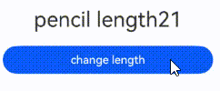
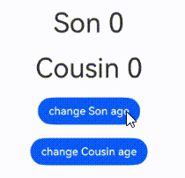

# 在ArkTS-Sta中使用ArkTS-Dyn的@ObservedV2和@Trace（类属性变化观测）
<!--Kit: ArkUI-->
<!--Subsystem: ArkUI-->
<!--Owner: @lixingchi1; @katabanga-->
<!--Designer: @lixingchi1; @katabanga-->
<!--Tester: @TerryTsao-->
<!--Adviser: @zhang_yixin13-->


## 概述

从API version 23开始，支持从ArkTS-Sta的自定义组件中调用或修改ArkTS-Dyn的[ObservedV2与@Trace](../ui/state-management/arkts-new-observedV2-and-trace.md)修饰类，数据变更实现UI刷新，在ArkTS-Sta互操作场景下，通过调用[enableCompatibleObservedV2ForStatic](../reference/apis-arkui/arkui-ts/ts-interop-compatible-ObservedV2.md#enablecompatibleobservedv2forstatict)方法即可。


## 使用限制

- 遵循ArkTS-Dyn @ObservedV2与@Trace的[使用限制](../ui/state-management/arkts-new-observedV2-and-trace.md#使用限制)；

- 遵循ArkTS-Sta @ObservedV2与@Trace的[使用限制](../ui/state-management-static/arkts-static-new-observedV2-and-trace.md#使用限制)；

- 不能在非UI线程中直接修改ArkTS-Sta组件中使用的ArkTS-Dyn @ObservedV2装饰的数据成员的值，否则会运行异常；

- 遵循ArkTS-Sta互操作规范，如不支持ArkTS-Dyn对象继承ArkTS-Sta对象。


## 使用场景

基于以下示例结构，说明在ArkTS-Sta自定义组件中调用ArkTS-Dyn @ObservedV2修饰的类的场景。

```text
project/
├── entry/                            # ArkTS-Sta主模块
│   └── src/
│       └── main/
│           └── ets/
│               └── pages/
│                   ├── StaDynObservedV2.ets         # 基础用法
│                   ├── StaDynObservedV2Nested.ets   # 嵌套类场景
│                   └── StaDynObservedV2Inherit.ets  # 继承类场景
│
└── dynamic_module/                   # ArkTS-Dyn子模块
    └── src/
        └── main/
            └── ets/
                └── components/
                    └── MainPage.ets    # 导出ArkTS-Dyn @ObservedV2修饰的类
```

示例如下：

- 创建ArkTS-Dyn子模块`dynamic_module`，在`dynamic_module/src/main/ets/components`目录创建并导出自定义组件。如何创建子模块参考共享包（[HAR](../quick-start/har-package.md)）说明。

<!-- @[StaDynObservedV2MainPageClass](https://gitcode.com/openharmony/applications_app_samples/blob/OpenHarmony_feature_sta_20260331/code/DocsSample/ArkUISample-Sta/StaInteropDynObservedV2/dynamic_module/src/main/ets/components/MainPage.ets) -->

```TypeScript
// dynamic_module/src/main/ets/components/MainPage.ets

@ObservedV2
export class ObservedV2ForStatic {
  @Trace name: string = '';
  @Trace model:  ObservedV2ForStatic2 = new ObservedV2ForStatic2('Tom', 12);

  constructor(name: string, model: ObservedV2ForStatic2) {
    this.name = name;
    this.model = model;
  }
}

@ObservedV2
export class ObservedV2ForStatic2 { // 供ArkTS-Sta主模块使用的类
  // 定义@Trace修饰的属性
  @Trace name: string = '';
  @Trace age: number = 0;

  constructor(name: string, age: number) {
    this.name = name;
    this.age = age;
  }
}
```

<!-- @[StaDynObservedV2DynIndexClass](https://gitcode.com/openharmony/applications_app_samples/blob/OpenHarmony_feature_sta_20260331/code/DocsSample/ArkUISample-Sta/StaInteropDynObservedV2/dynamic_module/Index.ets) -->

```TypeScript
// dynamic_module/Index.ets

export { ObservedV2ForStatic2 } from './src/main/ets/components/MainPage'; // 导出供ArkTS-Sta主模块使用的类
```

- 在主模块`entry`的`oh-package.json5`文件中配置子模块依赖。如何导入和使用子模块参考共享包（[HAR](../quick-start/har-package.md)）说明。

```json
// entry/oh-package.json5

"dependencies": {
    'dynamic_module': 'file:../dynamic_module'
}
```

- 在ArkTS-Sta主模块`entry`中引入ArkTS-Dyn组件。

<!-- @[StaDynObservedV2](https://gitcode.com/openharmony/applications_app_samples/blob/OpenHarmony_feature_sta_20260331/code/DocsSample/ArkUISample-Sta/StaInteropDynObservedV2/entry/src/main/ets/pages/StaDynObservedV2.ets) -->

```TypeScript
// entry/src/main/ets/pages/StaDynObservedV2.ets

import { Entry, Row, Text, Column, Component, Button, ComponentV2, enableCompatibleObservedV2ForStatic } from '@ohos.arkui.component';
import { State, ObservedV2, Trace } from '@ohos.arkui.stateManagement';

import { ObservedV2ForStatic2 } from 'dynamic_module'; // 引入ArkTS-Dyn @ObservedV2修饰的类

@Entry
@ComponentV2
struct Index { // ArkTS-Sta自定义组件
  // 创建ArkTS-Dyn @ObservedV2修饰类的实例
  person: ObservedV2ForStatic2 = new ObservedV2ForStatic2('Jack', 25);

  aboutToAppear() {
    // 启用ArkTS-Dyn @ObservedV2与ArkTS-Sta组件的互操作开关，以支持@Trace属性变化观测
    enableCompatibleObservedV2ForStatic(this.person);
  }

  build() {
    Column() {
      // 显示name属性
      Text(`age: ${this.person.age}`)
      Button('add age')
        .onClick(() => {
          // 修改@Trace修饰的age属性，UI会刷新
          this.person.age = this.person.age + 1;
        })
    }
  }
}
```

### 嵌套类场景

在ArkTS-Sta调用ArkTS-Dyn嵌套类场景中，Pencil类是Student类中最里层的类。Pencil类被\@ObservedV2装饰，属性length被\@Trace装饰，因此length的变化能够被观测到。

- 创建ArkTS-Dyn子模块`dynamic_module`，并导出ArkTS-Dyn自定义组件。如何创建子模块参考共享包（[HAR](../quick-start/har-package.md)）说明。
- 在`dynamic_module/src/main/ets/components`目录创建并导出自定义继承类。

<!-- @[StaDynObservedV2MainPageNested](https://gitcode.com/openharmony/applications_app_samples/blob/OpenHarmony_feature_sta_20260331/code/DocsSample/ArkUISample-Sta/StaInteropDynObservedV2/dynamic_module/src/main/ets/components/MainPage.ets) -->

```TypeScript
// dynamic_module/src/main/ets/components/MainPage.ets
@ObservedV2
export class Pencil {
  @Trace length: number = 21; // 当length变化时，会刷新关联的组件
}
@ObservedV2
export class Bag {
  width: number = 50;
  height: number = 60;
  @Trace pencil: Pencil = new Pencil();
}
@ObservedV2
export class Student {
  age: number = 5;
  school: string = 'some';
  @Trace bag: Bag = new Bag();
}
```

<!-- @[StaDynObservedV2DynIndexNested](https://gitcode.com/openharmony/applications_app_samples/blob/OpenHarmony_feature_sta_20260331/code/DocsSample/ArkUISample-Sta/StaInteropDynObservedV2/dynamic_module/Index.ets) -->

```TypeScript
// dynamic_module/Index.ets

export { Student } from './src/main/ets/components/MainPage'; // 导出供ArkTS-Sta主模块使用的类
```

- 创建ArkTS-Dyn子模块`dynamic_module`，并导出ArkTS-Dyn自定义组件。如何创建子模块参考共享包（[HAR](../quick-start/har-package.md)）说明。

```json
// entry/oh-package.json5

"dependencies": {
    'dynamic_module': 'file:../dynamic_module',
}
```

- ArkTS-Sta中调用ArkTS-Dyn中定义的嵌套类。

<!-- @[StaDynObservedV2Nested](https://gitcode.com/openharmony/applications_app_samples/blob/OpenHarmony_feature_sta_20260331/code/DocsSample/ArkUISample-Sta/StaInteropDynObservedV2/entry/src/main/ets/pages/StaDynObservedV2Nested.ets) -->

```TypeScript
// entry/src/main/ets/pages/StaDynObservedV2Nested.ets

import { Entry, Row, Text, Column, Component, Button, ComponentV2, enableCompatibleObservedV2ForStatic } from '@ohos.arkui.component';
import { State, ObservedV2, Trace } from '@ohos.arkui.stateManagement';
import hilog from '@ohos.hilog';
import { Student } from 'dynamic_module';

@Entry
@ComponentV2
struct Index {// ArkTS-Sta自定义组件
  // 创建ArkTS-Dyn @ObservedV2修饰类的实例
  student: Student = new Student();
  aboutToAppear() {
    // 启用ArkTS-Dyn @ObservedV2与ArkTS-Sta组件的互操作开关，以支持@Trace属性变化观测
    enableCompatibleObservedV2ForStatic(this.student);
  }

  build() {
    Column() {
      // 显示length属性
      Text('pencil length'+ this.student.bag.pencil.length)
      .fontSize(30)
      .margin(10)
      Button('change length')
        .onClick(() => {
          // 修改@Trace修饰的length属性，UI会刷新
          this.student.bag.pencil.length += 100;
        })
        .width(300)
        .margin(10)
    }
  }
}
```



### 继承类场景

在类的继承场景中，ArkTS-Sta通过调用ArkTS-Dyn @Trace实现功能。无论是基类还是继承类，只有被@Trace装饰的属性才会触发UI更新。

- 创建ArkTS-Dyn子模块`dynamic_module`，并导出ArkTS-Dyn自定义组件。如何创建子模块参考共享包（[HAR](../quick-start/har-package.md)）说明。
- 在dynamic_module/src/main/ets/components目录创建并导出自定义继承类。

<!-- @[StaDynObservedV2MainPageInherit](https://gitcode.com/openharmony/applications_app_samples/blob/OpenHarmony_feature_sta_20260331/code/DocsSample/ArkUISample-Sta/StaInteropDynObservedV2/dynamic_module/src/main/ets/components/MainPage.ets) -->

```TypeScript
// dynamic_module/src/main/ets/components/MainPage.ets
@ObservedV2
export class GrandFather {
  // 定义@Trace修饰的属性
  @Trace age: number = 0;

  constructor(age: number) {
    this.age = age;
  }
}
@ObservedV2
export class Father extends GrandFather{
  @Trace name: string = 'father';

  constructor(father: number) {
    super(father);
  }
}
@ObservedV2
export class Uncle extends GrandFather {
  @Trace name: string = 'uncle';

  constructor(uncle: number) {
    super(uncle);
  }
}
@ObservedV2
export class Son extends Father {
  @Trace name: string = 'son';

  constructor(son: number) {
    super(son);
  }
}
@ObservedV2
export class Cousin extends Uncle {
  @Trace name: string = 'cousin';

  constructor(cousin: number) {
    super(cousin);
  }
}
```

<!-- @[StaDynObservedV2DynIndexInherit](https://gitcode.com/openharmony/applications_app_samples/blob/OpenHarmony_feature_sta_20260331/code/DocsSample/ArkUISample-Sta/StaInteropDynObservedV2/dynamic_module/Index.ets) -->

```TypeScript
// dynamic_module/Index.ets

export { Son, Cousin } from './src/main/ets/components/MainPage'; // 导出供ArkTS-Sta主模块使用的类
```

- 创建ArkTS-Dyn子模块`dynamic_module`，并导出ArkTS-Dyn自定义组件。如何创建子模块参考共享包（[HAR](../quick-start/har-package.md)）说明。

```json
// entry/oh-package.json5

"dependencies": {
    'dynamic_module': 'file:../dynamic_module',
}
```

- 在ArkTS-Sta主模块`entry`中引入ArkTS-Dyn组件。

<!-- @[StaDynObservedV2Inherit](https://gitcode.com/openharmony/applications_app_samples/blob/OpenHarmony_feature_sta_20260331/code/DocsSample/ArkUISample-Sta/StaInteropDynObservedV2/entry/src/main/ets/pages/StaDynObservedV2Inherit.ets) -->

```TypeScript
// entry/src/main/ets/pages/StaDynObservedV2Inherit.ets

import { Entry, Row, Text, Column, Component, Button, ComponentV2, enableCompatibleObservedV2ForStatic } from '@ohos.arkui.component';
import { State, ObservedV2, Trace } from '@ohos.arkui.stateManagement';
import hilog from '@ohos.hilog';
import { Son, Cousin } from 'dynamic_module';// 引入ArkTS-Dyn @ObservedV2修饰的类

@Entry
@ComponentV2
struct Index { // ArkTS-Sta自定义组件
  // 创建ArkTS-Dyn @ObservedV2修饰类的实例
  son: Son = new Son(0);
  cousin: Cousin = new Cousin(0);
  renderTimes: number = 0;

  isRender(id: number): number {
    console.info(`id: ${id} renderTimes: ${this.renderTimes}`);
    this.renderTimes++;
    return 40;
  }
  aboutToAppear() {
    // 启用ArkTS-Dyn @ObservedV2与ArkTS-Sta组件的互操作开关，以支持@Trace属性变化观测
    enableCompatibleObservedV2ForStatic(this.son);
    enableCompatibleObservedV2ForStatic(this.cousin);
  }

  build() {
    Column() {
      // 显示Son.age属性
      Text(`Son ${this.son.age}`)
        .fontSize(this.isRender(1))
        .margin(10)
      // 显示Cousin.age属性
      Text(`Cousin ${this.cousin.age}`)
        .fontSize(this.isRender(2))
        .margin(10)
      Button('change Son age')
        .onClick(() => {
          // 修改@Trace修饰的age属性，UI会刷新
          this.son.age++;
        })
        .width(300)
        .margin(10)
      Button('change Cousin age')
        .onClick(() => {
          // 修改@Trace修饰的age属性，UI会刷新
          this.cousin.age++;
        })
        .width(300)
        .margin(10)
    }
  }
}
```


