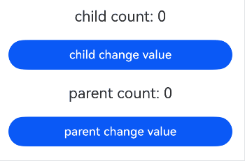
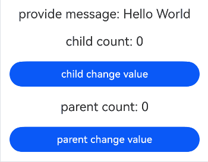

# 在ArkTS-Sta中使用ArkTS-Dyn管理组件拥有的状态
<!--Kit: ArkUI-->
<!--Subsystem: ArkUI-->
<!--Owner: @lixingchi1; @katabanga-->
<!--Designer: @lixingchi1; @katabanga-->
<!--Tester: @TerryTsao-->
<!--Adviser: @zhang_yixin13-->

## 概述

从API version 23开始，ArkTS-Sta使用ArkTS-Dyn管理组件拥有的状态，涉及状态管理V1交互的场景主要包括：

1. ArkTS-Dyn子组件通过ArkTS-Sta父组件初始化状态数据并进行状态绑定。

2. ArkTS-Dyn子组件通过[@Consume](../ui/state-management/arkts-provide-and-consume.md)和ArkTS-Sta祖先节点进行交互。


## 使用限制

- 遵循ArkTS-Dyn @State的[使用限制](../ui/state-management/arkts-state.md#限制条件)；

- 遵循ArkTS-Dyn @Prop的[使用限制](../ui/state-management/arkts-prop.md#限制条件)；

- 遵循ArkTS-Dyn @Link的[使用限制](../ui/state-management/arkts-link.md#限制条件)；

- 遵循ArkTS-Dyn @Provide和@Consume的[使用限制](../ui/state-management/arkts-provide-and-consume.md#限制条件)；

- 遵循ArkTS-Sta @State的[使用限制](../ui/state-management-static/arkts-static-state.md#限制条件)；

- 遵循ArkTS-Sta @PropRef的[使用限制](../ui/state-management-static/arkts-static-propref.md#限制条件)；

- 遵循ArkTS-Sta @Link的[使用限制](../ui/state-management-static/arkts-static-link.md#限制条件)；

- 遵循ArkTS-Sta @Provide和@Consume的[使用限制](../ui/state-management-static/arkts-static-provide-and-consume.md#限制条件)。


## 使用场景

基于以下示例结构，说明ArkTS-Sta使用ArkTS-Dyn管理组件拥有的状态的场景。

```text
project/
├── entry/                           # ArkTS-Sta主模块
│   └── src/
│       └── main/
│           └── ets/
│               └── pages/
│                   ├── StaDynStateV1State.ets     # @State交互
│                   ├── StaDynStateV1Prop.ets      # @Prop交互
│                   ├── StaDynStateV1Link.ets      # @Link交互
│                   └── StaDynStateV1Provide.ets   # @Provide/@Consume交互
│
└── dynamic_module/                   # ArkTS-Dyn子模块
    └── src/
        └── main/
            └── ets/
                └── components/
                    └── MainPage.ets   # ArkTS-Dyn自定义组件
```

示例如下：

- 创建ArkTS-Dyn子模块`dynamic_module`，并导出ArkTS-Dyn自定义组件。如何创建子模块参考共享包（[HAR](../quick-start/har-package.md)）说明。

<!-- @[StaDynStateV1DynIndex](https://gitcode.com/openharmony/applications_app_samples/blob/OpenHarmony_feature_sta_20260331/code/DocsSample/ArkUISample-Sta/StaInteropDynStatemanagementV1/dynamic_module/Index.ets) -->

```TypeScript
// dynamic_module/Index.ets
export { StateChild, PropChild, LinkChild, ProvideChild, GrandSon } from './src/main/ets/components/MainPage';
```

- 在主模块`entry`的`oh-package.json5`文件中配置子模块依赖。如何导入和使用子模块参考共享包（[HAR](../quick-start/har-package.md)）说明。

```json
// entry/oh-package.json5

"dependencies": {
  "dynamic_module": "file:../dynamic_module"
}
```


### 与ArkTS-Dyn的\@State交互

状态管理V1互操作支持在ArkTS-Sta上下文中初始化ArkTS-Dyn自定义组件的[\@State](../ui/state-management/arkts-state.md)成员属性，相关初始化规则与非互操作场景下保持一致。

示例如下：

- 创建ArkTS-Dyn子模块`dynamic_module`，在`dynamic_module/src/main/ets/components`目录创建并导出自定义组件`StateChild`。其中，ArkTS-Dyn自定义组件包含\@State装饰的属性。

<!-- @[StaDynStateV1StateMainPage](https://gitcode.com/openharmony/applications_app_samples/blob/OpenHarmony_feature_sta_20260331/code/DocsSample/ArkUISample-Sta/StaInteropDynStatemanagementV1/dynamic_module/src/main/ets/components/MainPage.ets) -->

```TypeScript
// dynamic_module/src/main/ets/components/MainPage.ets

@Component
export struct StateChild { // 定义包含@State成员属性的子组件
  @State count: number = 0;

  build() {
    Column() {
      // 显示子组件count状态
      Text(`child count: ${this.count}`)
        .fontSize(20)
        .margin(10)
      Button('child change value')
        .onClick(() => {
          // 子组件@State状态的变化不会同步给ArkTS-Sta父组件，不会刷新父组件的UI，但子组件UI会刷新
          this.count += 1;
        })
        .width(300)
        .margin(10)
    }
    .width('100%')
  }
}
```

- 在ArkTS-Sta模块中配置相关模块依赖后，导入包含\@State的ArkTS-Dyn自定义组件`StateChild`。

<!-- @[StaDynStateV1State](https://gitcode.com/openharmony/applications_app_samples/blob/OpenHarmony_feature_sta_20260331/code/DocsSample/ArkUISample-Sta/StaInteropDynStatemanagementV1/entry/src/main/ets/pages/StaDynStateV1State.ets) -->

```TypeScript
// entry/src/main/ets/pages/StaDynStateV1State.ets
import { Entry, Component, Column, Text, Button, ClickEvent } from '@ohos.arkui.component';
import { State } from '@ohos.arkui.stateManagement';

import { StateChild } from 'dynamic_module'; // 导入包含@State成员属性的子组件

@Entry
@Component
struct Index { // 使用包含@State成员属性的子组件
  @State count: number = 0;

  build() {
    Column() {
      // 支持初始化子组件的@State成员属性
      StateChild({ count: this.count })
      // 显示父组件count状态
      Text(`parent count: ${this.count}`)
        .fontSize(20)
        .margin(10)
      Button('parent change value')
        .onClick((value: ClickEvent) => {
          // 父组件状态变化不会同步给ArkTS-Dyn子组件，不会刷新子组件的UI，但父组件UI会刷新
          this.count += 2;
        })
        .width(300)
        .margin(10)
    }
    .width('100%')
  }
}
```

示例效果图：



### 与ArkTS-Dyn的\@Prop交互

状态管理V1互操作支持在ArkTS-Sta上下文中初始化ArkTS-Dyn自定义组件的[\@Prop](../ui/state-management/arkts-prop.md)成员属性，并建立单向同步机制。

ArkTS-Dyn自定义组件中的\@Prop成员属性支持从ArkTS-Sta父组件中进行初始化，由于ArkTS-Sta静态类型对象深拷贝的限制，初始化规则和非互操作场景下存在差异和限制。

- ArkTS-Sta传递的数据类型为基础类型时，例如string、number、boolean，相关使用和传递规则和非互操作场景下保持一致。

- ArkTS-Sta传递的数据类型为静态对象类型时，例如Array，Map，Class，Interface，enum，由于不支持对象类型深拷贝，从而不支持初始化\@Prop变量，否则运行时会产生异常。建议开发者使用[\@Link](../ui/state-management/arkts-link.md)或者[\@ObjectLink](../ui/state-management/arkts-observed-and-objectlink.md)替代。

- ArkTS-Sta传递的数据类型为语言互操作导入的动态对象类型，但内部使用了静态类型对象，由于深拷贝限制，不支持初始化\@Prop变量，运行时会产生异常，建议开发者使用\@Link或者\@ObjecLink替代。

- 当ArkTS-Sta传递的数据类型为语言互操作导入的纯动态对象类型时，由于动态类型对象支持深拷贝，其使用和传递规则与非互操作场景保持一致。

示例如下：

- 创建ArkTS-Dyn子模块`dynamic_module`，在`dynamic_module/src/main/ets/components`目录创建并导出自定义组件`PropChild`。其中，ArkTS-Dyn自定义组件包含\@Prop装饰的属性。

<!-- @[StaDynStateV1PropMainPage](https://gitcode.com/openharmony/applications_app_samples/blob/OpenHarmony_feature_sta_20260331/code/DocsSample/ArkUISample-Sta/StaInteropDynStatemanagementV1/dynamic_module/src/main/ets/components/MainPage.ets) -->

```TypeScript
// dynamic_module/src/main/ets/components/MainPage.ets

@Component
export struct PropChild { // 定义包含@Prop成员属性的子组件
  @Prop count: number = 0;

  build() {
    Column() {
      // 显示子组件count状态
      Text(`child count: ${this.count}`)
        .fontSize(20)
        .margin(10)
      Button('child change value')
        .onClick(() => {
          // 子组件@Prop状态的变化不会同步给ArkTS-Sta父组件，不会刷新父组件的UI，但子组件UI会刷新
          this.count += 1;
        })
        .width(300)
        .margin(10)
    }
    .width('100%')
  }
}
```

- 在ArkTS-Sta模块中配置相关模块依赖后，导入包含\@Prop的ArkTS-Dyn自定义组件`PropChild`。

<!-- @[StaDynStateV1Prop](https://gitcode.com/openharmony/applications_app_samples/blob/OpenHarmony_feature_sta_20260331/code/DocsSample/ArkUISample-Sta/StaInteropDynStatemanagementV1/entry/src/main/ets/pages/StaDynStateV1Prop.ets) -->

```TypeScript
// entry/src/main/ets/pages/StaDynStateV1Prop.ets
import { Entry, Component, Column, Text, Button, ClickEvent } from '@ohos.arkui.component';
import { State } from '@ohos.arkui.stateManagement';

import { PropChild } from 'dynamic_module'; // 导入包含@Prop成员属性的子组件

@Entry
@Component
struct Index { // 使用包含@Prop成员属性的子组件
  @State count: number = 0;

  build() {
    Column() {
      // 支持初始化子组件的@Prop成员属性
      PropChild({ count: this.count })
      // 显示父组件count状态
      Text(`parent count: ${this.count}`)
        .fontSize(20)
        .margin(10)
      Button('parent change value')
        .onClick((value: ClickEvent) => {
          // 父组件状态变化会同步给ArkTS-Dyn子组件，父组件和子组件的UI都会刷新
          this.count += 2;
        })
        .width(300)
        .margin(10)
    }
    .width('100%')
  }
}
```

示例效果图：


### 与ArkTS-Dyn的\@Link交互

状态管理V1互操作支持在ArkTS-Sta上下文中初始化ArkTS-Dyn自定义组件的[\@Link](../ui/state-management/arkts-link.md)成员属性并建立双向同步机制，相关使用规则与非互操作场景下保持一致。

示例如下：

- 创建ArkTS-Dyn子模块`dynamic_module`，在`dynamic_module/src/main/ets/components`目录创建并导出自定义组件`LinkChild`。其中，ArkTS-Dyn自定义组件包含\@Link装饰的属性。

<!-- @[StaDynStateV1LinkMainPage](https://gitcode.com/openharmony/applications_app_samples/blob/OpenHarmony_feature_sta_20260331/code/DocsSample/ArkUISample-Sta/StaInteropDynStatemanagementV1/dynamic_module/src/main/ets/components/MainPage.ets) -->

```TypeScript
// dynamic_module/src/main/ets/components/MainPage.ets

@Component
export struct LinkChild { // 包含@Link成员属性的子组件
  @Link count: number;

  build() {
    Column() {
      // 显示子组件count状态
      Text(`child count: ${this.count}`)
        .fontSize(20)
        .margin(10)
      Button('child change value')
        .onClick(() => {
          // 子组件@Link状态的变化会同步给ArkTS-Sta父组件，父组件和子组件的UI都会刷新
          this.count += 1;
        })
        .width(300)
        .margin(10)
    }
    .width('100%')
  }
}
```

- 在ArkTS-Sta模块中配置相关模块依赖后，导入包含\@Link的ArkTS-Dyn自定义组件`LinkChild`。

<!-- @[StaDynStateV1Link](https://gitcode.com/openharmony/applications_app_samples/blob/OpenHarmony_feature_sta_20260331/code/DocsSample/ArkUISample-Sta/StaInteropDynStatemanagementV1/entry/src/main/ets/pages/StaDynStateV1Link.ets) -->

```TypeScript
// entry/src/main/ets/pages/StaDynStateV1Link.ets
import { Entry, Component, Column, Text, Button, ClickEvent } from '@ohos.arkui.component';
import { State } from '@ohos.arkui.stateManagement';

import { LinkChild } from 'dynamic_module'; // 导入包含@Link成员属性的子组件

@Entry
@Component
struct Index { // 使用包含@Link成员属性的子组件
  @State count: number = 0;

  build() {
    Column() {
      // 支持初始化子组件的@Link成员属性
      LinkChild({ count: this.count })
      // 显示父组件count状态
      Text(`parent count: ${this.count}`)
        .fontSize(20)
        .margin(10)
      Button('parent change value')
        .onClick((value: ClickEvent) => {
          // 父组件状态的变化会同步给ArkTS-Dyn子组件，父组件和子组件的UI都会刷新
          this.count += 2;
        })
        .width(300)
        .margin(10)
    }
    .width('100%')
  }
}
```

示例效果图：


### 与ArkTS-Dyn的\@Provide/\@Consume交互

状态管理V1互操作支持在ArkTS-Sta上下文中初始化ArkTS-Dyn自定义组件的[\@Provide](../ui/state-management/arkts-provide-and-consume.md)成员属性，相关初始化规则与非互操作场景下保持一致。

同时，ArkTS-Dyn自定义组件还支持通过[\@Consume](../ui/state-management/arkts-provide-and-consume.md)和ArkTS-Sta祖先组件建立双向数据同步，相关使用规则与非互操场场景下保持一致。

示例如下：

- 创建ArkTS-Dyn子模块`dynamic_module`，在`dynamic_module/src/main/ets/components`目录创建并导出自定义组件`ProvideChild`。其中，ArkTS-Dyn自定义组件包含\@Provide装饰的属性。

<!-- @[StaDynStateV1ProvideMainPage](https://gitcode.com/openharmony/applications_app_samples/blob/OpenHarmony_feature_sta_20260331/code/DocsSample/ArkUISample-Sta/StaInteropDynStatemanagementV1/dynamic_module/src/main/ets/components/MainPage.ets) -->

```TypeScript
// dynamic_module/src/main/ets/components/MainPage.ets

@Component
export struct ProvideChild { // 包含@Provide成员属性的子组件
  @Provide message: string = '';

  build() {
    Column() {
      // 显示子组件@Provide状态变量message
      Text(`provide message: ${this.message}`)
        .fontSize(20)
        .margin(10)
      // ArkTS-Dyn自定义组件
      GrandSon()
    }
    .width('100%')
  }
}

@Component
export struct GrandSon { // 包含@Consume成员属性的子孙组件
  // 通过名称count与ArkTS-Sta祖先组件的@Provide状态变量建立联系
  @Consume count: number;

  build() {
    Column() {
      // 显示子孙组件count状态
      Text(`child count: ${this.count}`)
        .fontSize(20)
        .margin(10)
      Button('child change value')
        .onClick(() => {
          // 子孙组件的状态变化会同步给ArkTS-Sta祖先组件，祖先组件和子孙组件的UI都会刷新
          this.count += 1;
        })
        .width(300)
        .margin(10)
    }
    .width('100%')
  }
}
```

- 在ArkTS-Sta模块中配置相关模块依赖后，导入包含\@Provide的ArkTS-Dyn自定义组件`ProvideChild`。

<!-- @[StaDynStateV1Provide](https://gitcode.com/openharmony/applications_app_samples/blob/OpenHarmony_feature_sta_20260331/code/DocsSample/ArkUISample-Sta/StaInteropDynStatemanagementV1/entry/src/main/ets/pages/StaDynStateV1Provide.ets) -->

```TypeScript
// entry/src/main/ets/pages/StaDynStateV1Provide.ets
import { Entry, Component, Column, Text, Button, ClickEvent } from '@ohos.arkui.component';
import { State, Provide } from '@ohos.arkui.stateManagement';

import { ProvideChild } from 'dynamic_module'; // 导入包含@Provide成员属性的子组件

@Entry
@Component
struct Index { // 使用包含@Provide成员属性的子组件
  @State message: string = 'Hello World';
  // 通过名称count与ArkTS-Dyn子孙组件的@Consume状态变量建立联系
  @Provide count: number = 0;

  build() {
    Column() {
      // 支持初始化子组件的@Provide成员属性
      ProvideChild({ message: this.message })
      // 显示祖先组件count状态
      Text(`parent count: ${this.count}`)
        .fontSize(20)
        .margin(10)
      Button('parent change value')
        .onClick((value: ClickEvent) => {
          // 祖先组件状态的变化会同步给ArkTS-Dyn子孙组件，祖先组件和包含对应@Consume的子孙组件的UI都会刷新
          this.count += 2;
        })
        .width(300)
        .margin(10)
    }
    .width('100%')
  }
}
```

示例效果图：

