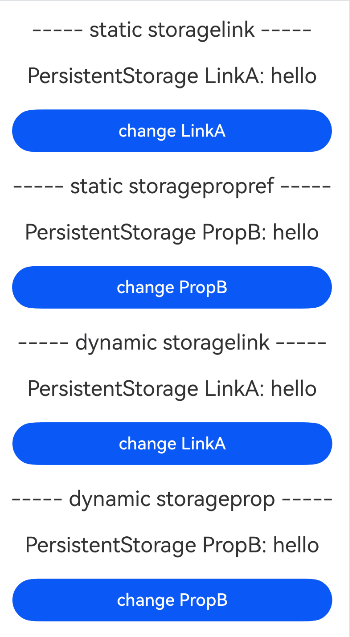
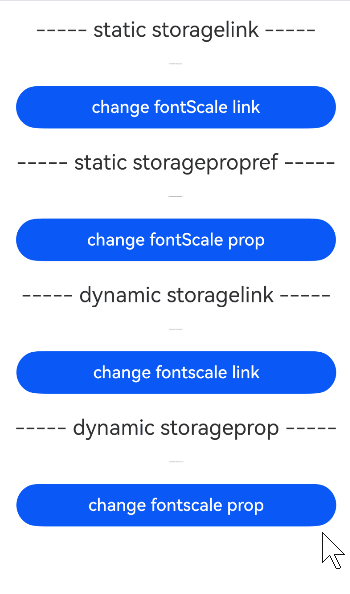

# 在ArkTS-Sta中使用ArkTS-Dyn管理应用拥有的状态
<!--Kit: ArkUI-->
<!--Subsystem: ArkUI-->
<!--Owner: @lixingchi1; @katabanga-->
<!--Designer: @lixingchi1; @katabanga-->
<!--Tester: @TerryTsao-->
<!--Adviser: @zhang_yixin13-->

## 概述

从API version 23开始，ArkTS-Sta使用ArkTS-Dyn管理应用拥有的状态，适用于使用[AppStorage](../ui/state-management/arkts-appstorage.md)，[LocalStorage](../ui/state-management/arkts-localstorage.md)，[PersistentStorage](../ui/state-management/arkts-persiststorage.md)，[Environment](../ui/state-management/arkts-environment.md)的场景。


## 使用限制

- 遵循ArkTS-Dyn AppStorage的[使用限制](./state-management/arkts-appstorage.md#限制条件)；

- 遵循ArkTS-Dyn LocalStorage的[使用限制](./state-management/arkts-localstorage.md#限制条件)；

- 遵循ArkTS-Dyn PersistentStorage的[使用限制](./state-management/arkts-persiststorage.md#限制条件)；

- 遵循ArkTS-Dyn Environment的[使用限制](./state-management/arkts-environment.md#限制条件)；

- 遵循ArkTS-Sta AppStorage的[使用限制](./state-management-static/arkts-static-appstorage.md#限制条件)；

- 遵循ArkTS-Sta LocalStorage的[使用限制](./state-management-static/arkts-static-localstorage.md#限制条件)；

- 遵循ArkTS-Sta PersistentStorage的[使用限制](./state-management-static/arkts-static-persiststorage.md#限制条件)；

- 遵循ArkTS-Sta Environment的[使用限制](./state-management-static/arkts-static-environment.md#限制条件)。

- 不支持[Environment.keys](../reference/apis-arkui/arkui-ts/ts-state-management-Static.md#keys-3)接口的互操作，ArkTS-Sta与ArkTS-Dyn的`Environment.keys()`返回值不互通。


## 使用场景

基于以下示例结构，说明ArkTS-Sta使用ArkTS-Dyn管理应用拥有的状态的场景。

```text
project/
├── entry/                          # ArkTS-Sta主模块
│   └── src/
│       └── main/
│           └── ets/
│               └── pages/
│                   ├── StaDynStorageLsp.ets       # @LocalStorageProp交互
│                   ├── StaDynStorageLsl.ets       # @LocalStorageLink交互
│                   ├── StaDynStorageSp.ets        # @StorageProp交互
│                   ├── StaDynStorageSl.ets        # @StorageLink交互
│                   ├── StaDynStorageApp.ets       # AppStorage接口交互
│                   ├── StaDynStoragePersist.ets   # PersistentStorage交互
│                   └── StaDynStorageEnv.ets       # Environment交互
│
└── dynamic_module/                  # ArkTS-Dyn子模块
    └── src/
        └── main/
            └── ets/
                └── components/
                    └── MainPage.ets  # 定义ArkTS-Dyn自定义组件并导出
```

示例如下：

- 创建ArkTS-Dyn子模块`dynamic_module`，并导出ArkTS-Dyn自定义组件。如何创建子模块参考共享包（[HAR](../quick-start/har-package.md)）说明。

<!-- @[StaDynStorageDynIndex](https://gitcode.com/openharmony/applications_app_samples/blob/OpenHarmony_feature_sta_20260331/code/DocsSample/ArkUISample-Sta/StaInteropDynStorages/dynamic_module/Index.ets) -->

```TypeScript
// dynamic_module/Index.ets

export { LocalStoragePropPage, LocalStorageLinkPage, StoragePropPage, StorageLinkPage, AppStoragePage, PersistentStoragePage, EnvironmentPage } from './src/main/ets/components/MainPage';
```

- 在主模块`entry`的`oh-package.json5`文件中配置子模块依赖。如何导入和使用子模块参考共享包（[HAR](../quick-start/har-package.md)）说明。

```json
// entry/oh-package.json5

"dependencies": {
  "dynamic_module": "file:../dynamic_module"
}
```

### 与ArkTS-Dyn的\@LocalStorageProp交互

状态管理V1互操作支持ArkTS-Dyn自定义组件通过[\@LocalStorageProp](../ui/state-management/arkts-localstorage.md)与ArkTS-Sta的LocalStorage数据进行单向数据同步。

针对ArkTS-Dyn自定义组件通过\@LocalStorageProp使用ArkTS-Sta数据的场景，由于ArkTS-Sta静态类型对象深拷贝限制，相关规则与非互操作场景存在差异和限制。

- 存储在ArkTS-Sta LocalStorage中的数据，其类型为基础类型时，例如string、number、boolean，相关使用和传递规则和非互操作场景下保持一致；

- 存储在ArkTS-Sta LocalStorage中的数据，其类型为静态对象类型时，例如Array，Map，Class，Interface，enum，由于不支持对象类型深拷贝，不支持通过\@LocalStorageProp获取数据，否则将产生运行时异常，建议开发者使用[\@LocalStorageLink](../ui/state-management/arkts-localstorage.md)替代；

- 存储在ArkTS-Sta LocalStorage中的数据，其类型为语言互操作导入的动态对象类型，但内部使用了静态类型对象，由于深拷贝限制，不支持通过\@LocalStorageProp获取数据，否则将产生运行时异常，建议开发者使用\@LocalStorageLink替代；

- 存储在ArkTS-Sta LocalStorage中的数据，其类型为语言互操作导入的纯动态对象类型时，由于动态类型对象支持深拷贝，使用规则与非互操作场景一致；

- 由于动静态LocalStorage数据对象存在差异，不支持通过ArkTS-Dyn自定义组件构造参数来传递ArkTS-Sta的LocalStorage实例。

示例如下：

- 创建ArkTS-Dyn子模块`dynamic_module`，在ArkTS-Dyn中创建并导出自定义组件。

<!-- @[StaDynStorageLspMainPage](https://gitcode.com/openharmony/applications_app_samples/blob/OpenHarmony_feature_sta_20260331/code/DocsSample/ArkUISample-Sta/StaInteropDynStorages/dynamic_module/src/main/ets/components/MainPage.ets) -->

```TypeScript
// dynamic_module/src/main/ets/components/MainPage.ets

@Component
export struct LocalStoragePropPage {
  @LocalStorageProp('PropA') storageProp: number = 1;

  build() {
    Column() {
      Button(`click times: ${this.storageProp}`)
        .onClick(() => {
          // 状态变化不会同步给ArkTS-Sta的LocalStorage
          this.storageProp += 1;
        })
        .width(300)
        .margin(10)
    }
    .width('100%')
  }
}
```

- 在ArkTS-Sta模块中配置相关模块依赖后，导入ArkTS-Dyn的自定义组件。

<!-- @[StaDynStorageLsp](https://gitcode.com/openharmony/applications_app_samples/blob/OpenHarmony_feature_sta_20260331/code/DocsSample/ArkUISample-Sta/StaInteropDynStorages/entry/src/main/ets/pages/StaDynStorageLsp.ets) -->

```TypeScript
// entry/src/main/ets/pages/StaDynStorageLsp.ets
import { Entry, Component, Column, Button, ClickEvent } from '@ohos.arkui.component';
import { LocalStorageLink } from '@ohos.arkui.stateManagement';

import { LocalStoragePropPage } from 'dynamic_module'; // 导入ArkTS-Dyn自定义组件

@Entry
@Component
struct Index {
  // 初始化ArkTS-Sta中的LocalStorage数据
  @LocalStorageLink('PropA') storageLink: number = 1;

  build() {
    Column() {
      LocalStoragePropPage()
      Button('update value')
        .onClick((value: ClickEvent) => {
          // 更新LocalStorage中的数据，并同步更新ArkTS-Dyn组件
          this.storageLink += 1;
        })
        .width(300)
        .margin(10)
    }
    .width('100%')
  }
}
```

示例效果图：


### 与ArkTS-Dyn的\@LocalStorageLink交互

状态管理V1互操作支持ArkTS-Dyn自定义组件通过[\@LocalStorageLink](../ui/state-management/arkts-localstorage.md)与ArkTS-Sta的LocalStorage数据进行双向数据同步，使用规则与非互操作场景一致。

示例如下：

- 创建ArkTS-Dyn子模块`dynamic_module`，在ArkTS-Dyn中创建并导出自定义组件。

<!-- @[StaDynStorageLslMainPage](https://gitcode.com/openharmony/applications_app_samples/blob/OpenHarmony_feature_sta_20260331/code/DocsSample/ArkUISample-Sta/StaInteropDynStorages/dynamic_module/src/main/ets/components/MainPage.ets) -->

```TypeScript
// dynamic_module/src/main/ets/components/MainPage.ets

@Component
export struct LocalStorageLinkPage {
  @LocalStorageLink('PropA') storageLink: number = 1;

  build() {
    Column() {
      Button(`click times: ${this.storageLink}`)
        .onClick(() => {
          // 状态变化会同步给ArkTS-Sta的LocalStorage，并同步更新ArkTS-Sta组件
          this.storageLink += 1;
        })
        .width(300)
        .margin(10)
    }
    .width('100%')
  }
}
```

- 在ArkTS-Sta模块中配置相关模块依赖后，导入ArkTS-Dyn的自定义组件。

<!-- @[StaDynStorageLsl](https://gitcode.com/openharmony/applications_app_samples/blob/OpenHarmony_feature_sta_20260331/code/DocsSample/ArkUISample-Sta/StaInteropDynStorages/entry/src/main/ets/pages/StaDynStorageLsl.ets) -->

```TypeScript
// entry/src/main/ets/pages/StaDynStorageLsl.ets
import { Entry, Component, Column, Button, ClickEvent } from '@ohos.arkui.component';
import { LocalStorageLink } from '@ohos.arkui.stateManagement';

import { LocalStorageLinkPage } from 'dynamic_module'; // 导入ArkTS-Dyn自定义组件

@Entry
@Component
struct Index {
  // 初始化ArkTS-Sta中的LocalStorage数据
  @LocalStorageLink('PropA') storageLink: number = 1;

  build() {
    Column() {
      LocalStorageLinkPage()
      Button('update value')
        .onClick((value: ClickEvent) => {
          // 更新LocalStorage中的数据，并同步更新ArkTS-Dyn组件
          this.storageLink += 1;
        })
        .width(300)
        .margin(10)
    }
    .width('100%')
  }
}
```

示例效果图：


### 与ArkTS-Dyn的\@StorageProp交互

状态管理V1互操作支持ArkTS-Dyn自定义组件通过[\@StorageProp](../ui/state-management/arkts-appstorage.md)和ArkTS-Sta的AppStorage数据进行单向数据同步。

针对ArkTS-Dyn自定义组件通过\@StorageProp访问ArkTS-Sta数据的场景，由于ArkTS-Sta静态类型对象深拷贝限制，相关规则和非互操作场景下存在差异和限制。

- 存储在ArkTS-Sta中的AppStorage中的数据，其类型为基础类型时，例如string、number、boolean，相关使用和传递规则与非互操作场景下保持一致。

- 存储在ArkTS-Sta中的AppStorage中的数据，其类型为静态对象类型时，例如Array，Map，Class，Interface，enum，由于不支持对象类型深拷贝，不支持通过\@StorageProp获取数据，否则将产生运行时异常，建议开发者使用[\@StorageLink](../ui/state-management/arkts-appstorage.md)替代。

- 存储在ArkTS-Sta中的AppStorage中的数据，其类型为语言互操作导入的动态对象类型，但内部使用了静态类型对象，同样由于深拷贝限制，不支持通过\@StorageProp获取数据，否则将产生运行时异常，建议开发者使用\@StorageLink替代。

- 存储在ArkTS-Sta中的AppStorage中的数据，其类型为语言互操作导入的纯动态对象类型时，由于动态类型对象支持深拷贝，相关使用规则与非互操作场景下一致。

示例如下：

- 创建ArkTS-Dyn子模块`dynamic_module`，在ArkTS-Dyn中创建并导出自定义组件。

<!-- @[StaDynStorageSpMainPage](https://gitcode.com/openharmony/applications_app_samples/blob/OpenHarmony_feature_sta_20260331/code/DocsSample/ArkUISample-Sta/StaInteropDynStorages/dynamic_module/src/main/ets/components/MainPage.ets) -->

```TypeScript
// dynamic_module/src/main/ets/components/MainPage.ets

@Component
export struct StoragePropPage {
  @StorageProp('PropA') storageProp: number = 1;

  build() {
    Column() {
      Button(`click times: ${this.storageProp}`)
        .onClick(() => {
          // 状态变化不会同步给ArkTS-Sta的AppStorage
          this.storageProp += 1;
        })
        .width(300)
        .margin(10)
    }
    .width('100%')
  }
}
```

- 在ArkTS-Sta模块中配置相关模块依赖后，导入ArkTS-Dyn的自定义组件。

<!-- @[StaDynStorageSp](https://gitcode.com/openharmony/applications_app_samples/blob/OpenHarmony_feature_sta_20260331/code/DocsSample/ArkUISample-Sta/StaInteropDynStorages/entry/src/main/ets/pages/StaDynStorageSp.ets) -->

```TypeScript
// entry/src/main/ets/pages/StaDynStorageSp.ets
import { Entry, Component, Column, Button, ClickEvent } from '@ohos.arkui.component';
import { StorageLink } from '@ohos.arkui.stateManagement';

import { StoragePropPage } from 'dynamic_module'; // 导入ArkTS-Dyn自定义组件

@Entry
@Component
struct Index {
  // 初始化ArkTS-Sta中的AppStorage数据
  @StorageLink('PropA') storageLink: number = 1;

  build() {
    Column() {
      StoragePropPage()
      Button('update value')
        .onClick((value: ClickEvent) => {
          // 更新AppStorage中的数据，并同步更新ArkTS-Dyn组件
          this.storageLink += 1;
        })
        .width(300)
        .margin(10)
    }
    .width('100%')
  }
}
```

示例效果图：


### 与ArkTS-Dyn的\@StorageLink进行交互

状态管理V1互操作支持ArkTS-Dyn自定义组件通过[\@StorageLink](../ui/state-management/arkts-appstorage.md)和ArkTS-Sta的AppStorage数据进行双向数据同步，使用规则与非互操作场景一致。

示例如下：

- 创建ArkTS-Dyn子模块`dynamic_module`，在ArkTS-Dyn中创建并导出自定义组件。

<!-- @[StaDynStorageSlMainPage](https://gitcode.com/openharmony/applications_app_samples/blob/OpenHarmony_feature_sta_20260331/code/DocsSample/ArkUISample-Sta/StaInteropDynStorages/dynamic_module/src/main/ets/components/MainPage.ets) -->

```TypeScript
// dynamic_module/src/main/ets/components/MainPage.ets

@Component
export struct StorageLinkPage {
  @StorageLink('PropA') storageLink: number = 1;

  build() {
    Column() {
      Button(`click times: ${this.storageLink}`)
        .onClick(() => {
          // 状态变化会同步给ArkTS-Sta的AppStorage，并同步更新ArkTS-Sta组件
          this.storageLink += 1;
        })
        .width(300)
        .margin(10)
    }
    .width('100%')
  }
}
```

- 在ArkTS-Sta模块中配置相关模块依赖后，导入ArkTS-Dyn的自定义组件。

<!-- @[StaDynStorageSl](https://gitcode.com/openharmony/applications_app_samples/blob/OpenHarmony_feature_sta_20260331/code/DocsSample/ArkUISample-Sta/StaInteropDynStorages/entry/src/main/ets/pages/StaDynStorageSl.ets) -->

```TypeScript
// entry/src/main/ets/pages/StaDynStorageSl.ets
import { Entry, Component, Column, Button, ClickEvent } from '@ohos.arkui.component';
import { StorageLink } from '@ohos.arkui.stateManagement';

import { StorageLinkPage } from 'dynamic_module'; // 导入ArkTS-Dyn自定义组件

@Entry
@Component
struct Index {
  // 初始化1.2中的AppStorage数据
  @StorageLink('PropA') storageLink: number = 1;

  build() {
    Column() {
      StorageLinkPage()
      Button('update value')
        .onClick((value: ClickEvent) => {
          // 更新AppStorage中的数据，并同步更新ArkTS-Dyn组件
          this.storageLink += 1;
        })
        .width(300)
        .margin(10)
    }
    .width('100%')
  }
}
```

示例效果图：


### 通过AppStorage接口进行交互

状态管理V1互操作支持通过ArkTS-Dyn的[AppStorage接口](../reference/apis-arkui/arkui-ts/ts-state-management.md#appstorage)操作ArkTS-Sta的AppStorage数据。

在通过ArkTS-Dyn的AppStorage接口操作ArkTS-Sta的AppStorage数据时，除prop和setAndProp接口外的其他接口使用规则与非互操作场景一致。

针对prop和setAndProp接口，由于静态类型数据深拷贝的限制，存在规格差异和约束。

- 当存储在ArkTS-Sta中的AppStorage中的数据，其类型为基础类型时，例如string、number、boolean，prop和setAndProp接口规则与非互操作场景一致。

- 当存储在ArkTS-Sta中的AppStorage中的数据，其类型为静态对象类型时，例如Array，Map，Class，Interface，enum，由于不支持对象类型深拷贝，不支持通过prop和setAndProp接口获取数据，否则将产生运行时异常。建议开发者使用ref和setAndRef接口替代。

- 当存储在ArkTS-Sta中的AppStorage中的数据，其类型为语言互操作导入的动态对象类型，但内部使用了静态类型对象时，由于深拷贝限制，不支持通过prop和setAndProp接口获取数据，否则将产生运行时异常。建议开发者使用ref和setAndRef接口替代。

- 当存储在ArkTS-Sta中的AppStorage中的数据，其类型为语言互操作导入的纯动态对象类型时，由于动态类型对象支持深拷贝，prop和setAndProp接口规则与非互操作场景一致。

- 由于动静态类型数据序列化差异，ArkTS-Dyn的[PersistentStorage](../ui/state-management/arkts-persiststorage.md)接口不支持对ArkTS-Sta的AppStorage数据进行持久化存储，否则将产生运行时异常。建议使用ArkTS-Sta的[PersistentStorage](../ui/state-management-static/arkts-static-persiststorage.md)接口进行操作。

示例如下：

- 创建ArkTS-Dyn子模块`dynamic_module`，在ArkTS-Dyn中创建并导出自定义组件。

<!-- @[StaDynStorageAppMainPage](https://gitcode.com/openharmony/applications_app_samples/blob/OpenHarmony_feature_sta_20260331/code/DocsSample/ArkUISample-Sta/StaInteropDynStorages/dynamic_module/src/main/ets/components/MainPage.ets) -->

```TypeScript
// dynamic_module/src/main/ets/components/MainPage.ets

let gPropA: number = 0;

@Component
export struct AppStoragePage {
  build() {
    Column() {
      Button('change AppStorage')
        .onClick(() => {
          // 通过接口修改ArkTS-Sta的AppStorage并同步更新ArkTS-Sta组件
          AppStorage.setOrCreate('PropA', ++gPropA);
        })
        .width(300)
        .margin(10)
    }
    .width('100%')
  }
}
```

- 在ArkTS-Sta模块中配置相关模块依赖后，导入ArkTS-Dyn自定义组件。

<!-- @[StaDynStorageApp](https://gitcode.com/openharmony/applications_app_samples/blob/OpenHarmony_feature_sta_20260331/code/DocsSample/ArkUISample-Sta/StaInteropDynStorages/entry/src/main/ets/pages/StaDynStorageApp.ets) -->

```TypeScript
// entry/src/main/ets/pages/StaDynStorageApp.ets
import { Entry, Component, Column, Text } from '@ohos.arkui.component';
import { StorageLink } from '@ohos.arkui.stateManagement';
import { AppStoragePage } from 'dynamic_module';

@Entry
@Component
struct Index {
  // 初始化ArkTS-Sta中的AppStorage数据
  @StorageLink('PropA') storageLink: number = 0;

  build() {
    Column() {
      AppStoragePage()
      // 显示AppStorage中的数据
      Text(`current value: ${this.storageLink}`)
        .fontSize(20)
        .margin(10)
    }
    .width('100%')
  }
}
```

示例效果图：


### ArkTS-Dyn使用ArkTS-Sta PersistentStorage中的数据

使用ArkTS-Dyn自定义组件中的\@StorageLink与ArkTS-Sta的PersistentStorage数据双向绑定；使用ArkTS-Dyn自定义组件中的\@StorageProp与ArkTS-Sta的PersistentStorage数据单向绑定。

示例如下：

- 创建ArkTS-Dyn子模块`dynamic_module`，在`dynamic_module/src/main/ets/components`目录创建并导出自定义组件。

<!-- @[StaDynStoragePersistMainPage](https://gitcode.com/openharmony/applications_app_samples/blob/OpenHarmony_feature_sta_20260331/code/DocsSample/ArkUISample-Sta/StaInteropDynStorages/dynamic_module/src/main/ets/components/MainPage.ets) -->

```TypeScript
// dynamic_module/src/main/ets/components/MainPage.ets

@Component
export struct PersistentStoragePage {
  // ArkTS-Dyn绑定ArkTS-Sta PersistentStorage数据
  @StorageLink('LinkA') persistLink: string = 'dynamicB';
  @StorageProp('LinkA') persistProp: string = 'dynamicB';

  build() {
    Row() {
      Column() {
        Text('----- dynamic storagelink -----')
          .fontSize(20)
          .margin(10)
         // 退出应用后重新进入，修改保留
        Text(`PersistentStorage LinkA: ${this.persistLink}`)
          .fontSize(20)
          .margin(10)
        Button('change LinkA')
          .onClick((e: ClickEvent) => {
            // 点击后同步更新ArkTS-Dyn和ArkTS-Sta中的Text组件
            this.persistLink += 'b';
          })
          .width(300)
          .margin(10)
        Text('----- dynamic storageprop -----')
          .fontSize(20)
          .margin(10)
        // 退出应用后重新进入，同步为LinkA的值
        Text(`PersistentStorage PropB: ${this.persistProp}`)
          .fontSize(20)
          .margin(10)
        Button('change PropB')
          .onClick((e: ClickEvent) => {
            // 点击后仅更新当前Text组件
            this.persistProp += 'b';
          })
          .width(300)
          .margin(10)
      }
    }
  }
}
```

- 在ArkTS-Sta主模块中引入ArkTS-Dyn组件。

<!-- @[StaDynStoragePersist](https://gitcode.com/openharmony/applications_app_samples/blob/OpenHarmony_feature_sta_20260331/code/DocsSample/ArkUISample-Sta/StaInteropDynStorages/entry/src/main/ets/pages/StaDynStoragePersist.ets) -->

```TypeScript
// entry/src/main/ets/pages/StaDynStoragePersist.ets
import { Entry, Text, Column, Component, Button, ClickEvent } from '@ohos.arkui.component';
import { PersistentStorage, StorageLink, StoragePropRef } from '@ohos.arkui.stateManagement';

import { PersistentStoragePage } from 'dynamic_module'; // 导入ArkTS-Dyn自定义组件

@Entry
@Component
struct Index {
  // ArkTS-Sta使用PersistentStorage，初始化key 'LinkA'
  persistFlag: boolean = PersistentStorage.persistProp('LinkA', 'hello');

  @StorageLink('LinkA') persistLink: string = 'staticB';
  @StoragePropRef('LinkA') persistProp: string = 'staticB';

  build() {
    Column() {
      Text('----- static storagelink -----')
        .fontSize(20)
        .margin(10)
      // 退出应用后重新进入，修改保留
      Text(`PersistentStorage LinkA: ${this.persistLink}`)
        .fontSize(20)
        .margin(10)
      Button('change LinkA')
        .onClick((e: ClickEvent) => {
          // 点击后同步更新ArkTS-Dyn和ArkTS-Sta中的Text组件
          this.persistLink += 'a';
        })
        .width(300)
        .margin(10)
      Text('----- static storagepropref -----')
        .fontSize(20)
        .margin(10)
      // 退出应用后重新进入，同步为LinkA的值
      Text(`PersistentStorage PropB: ${this.persistProp}`)
        .fontSize(20)
        .margin(10)
      Button('change PropB')
        .onClick((e: ClickEvent) => {
          // 点击后仅更新当前Text组件
          this.persistProp += 'a';
        })
        .width(300)
        .margin(10)
      PersistentStoragePage()
    }
    .width('100%')
  }
}
```

示例效果图：




### ArkTS-Dyn使用ArkTS-Sta Environment中的数据

使用ArkTS-Dyn自定义组件中的\@StorageLink与ArkTS-Sta的Environment数据双向绑定；使用ArkTS-Dyn自定义组件中的\@StorageProp与ArkTS-Sta的Environment数据单向绑定。

示例如下：

- 创建ArkTS-Dyn子模块`dynamic_module`，在`dynamic_module/src/main/ets/components`目录创建并导出自定义组件。

<!-- @[StaDynStorageEnvMainPage](https://gitcode.com/openharmony/applications_app_samples/blob/OpenHarmony_feature_sta_20260331/code/DocsSample/ArkUISample-Sta/StaInteropDynStorages/dynamic_module/src/main/ets/components/MainPage.ets) -->

```TypeScript
// dynamic_module/src/main/ets/components/MainPage.ets

@Component
export struct EnvironmentPage {
  // ArkTS-Dyn绑定ArkTS-Sta Environment数据
  @StorageLink('fontScale') fontScaleLink: number = 4.0;
  @StorageProp('fontScale') fontScaleProp: number = 4.0;

  build() {
    Row() {
      Column() {
        Text('----- dynamic storagelink -----')
          .fontSize(20)
          .margin(10)
        Text(`Environment fontscale link: ${this.fontScaleLink}`)
          .fontSize(this.fontScaleLink)
          .margin(10)
        Button('change fontscale link')
          .onClick((e: ClickEvent) => {
            // 点击后同步更新ArkTS-Dyn和ArkTS-Sta中的Text组件，fontSize加2
            this.fontScaleLink += 2.0;
          })
          .width(300)
          .margin(10)
        Text('----- dynamic storageprop -----')
          .fontSize(20)
          .margin(10)
        Text(`Environment fontscale prop: ${this.fontScaleProp}`)
          .fontSize(this.fontScaleProp)
          .margin(10)
        Button('change fontscale prop')
          .onClick((e: ClickEvent) => {
            // 点击后仅更新当前Text组件，fontSize加2
            this.fontScaleProp += 2.0;
          })
          .width(300)
          .margin(10)
      }
    }
  }
}
```

- 在ArkTS-Sta主模块中引入ArkTS-Dyn组件。

<!-- @[StaDynStorageEnv](https://gitcode.com/openharmony/applications_app_samples/blob/OpenHarmony_feature_sta_20260331/code/DocsSample/ArkUISample-Sta/StaInteropDynStorages/entry/src/main/ets/pages/StaDynStorageEnv.ets) -->

```TypeScript
// entry/src/main/ets/pages/StaDynStorageEnv.ets
import { Entry, Text, Column, Component, Button, ClickEvent } from '@ohos.arkui.component';
import { Environment, StorageLink, StoragePropRef } from '@ohos.arkui.stateManagement';

import { EnvironmentPage } from 'dynamic_module'; // 导入ArkTS-Dyn自定义组件

@Entry
@Component
struct Index {
  // ArkTS-Sta使用Environment，获取fontScale
  fontScaleFlag: boolean = Environment.envProp<number>('fontScale', 2.0);
  @StorageLink('fontScale') fontScaleLink: number = 3.0;
  @StoragePropRef('fontScale') fontScaleProp: number = 3.0;

  build() {
    Column() {
      Text('----- static storagelink -----')
        .fontSize(20)
        .margin(10)
      Text(`Environment fontscale link: ${this.fontScaleLink}`)
        .fontSize(this.fontScaleLink)
        .margin(10)
      Button('change fontScale link')
        .onClick((e: ClickEvent) => {
          // 点击后同步更新ArkTS-Dyn和ArkTS-Sta中的Text组件
          this.fontScaleLink += 1.0;
        })
        .width(300)
        .margin(10)
      Text('----- static storagepropref -----')
        .fontSize(20)
        .margin(10)
      Text(`Environment fontscale prop: ${this.fontScaleProp}`)
        .fontSize(this.fontScaleProp)
        .margin(10)
      Button('change fontScale prop')
        .onClick((e: ClickEvent) => {
          // 点击后仅更新当前Text组件
          this.fontScaleProp += 1.0;
        })
        .width(300)
        .margin(10)
      EnvironmentPage()
    }
    .width('100%')
  }
}
```

示例效果图：


