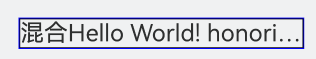
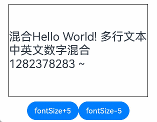
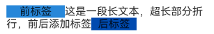
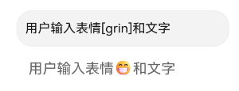
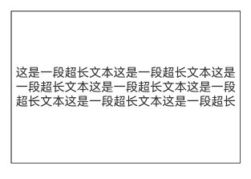
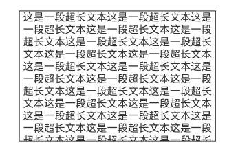
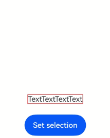

# 使用文本常见问题
<!--Kit: ArkUI-->
<!--Subsystem: ArkUI-->
<!--Owner: @xiangyuan6-->
<!--Designer: @pssea-->
<!--Tester: @jiaoaozihao-->
<!--Adviser: @Brilliantry_Rui-->

本文档介绍使用文本的常见问题并提供参考。

## 文本显示（Text/Span）常见问题

以下内容介绍了使用[Text](../reference/apis-arkui/arkui-ts/ts-basic-components-text.md)和[Span](../reference/apis-arkui/arkui-ts/ts-basic-components-span.md)组件进行文本显示时可能遇到的常见问题，包括文本截断、添加标签、显示表情等场景的处理方法。

### Text组件尾部省略号后为什么还有一段空白，没有占满组件宽度

**问题现象**

在Text组件上未设置宽度，当内容过长时，省略号与组件边缘之间会留有较大空白，且内容更新时省略号的位置会发生变化。


**原因分析**

当Text组件未设置宽度且内容超长时，组件宽度将采用父组件传递的布局约束的最大宽度。不同内容、不同的断词模式导致排版塑型结果不同，因此省略开始位置也会不同。

**解决措施**

设置[wordBreak](../reference/apis-arkui/arkui-ts/ts-basic-components-text.md#wordbreak11)属性为`WordBreak.BREAK_ALL`，任意2个字符间断行使文本内容尽量占满组件区域。

示例代码如下：
  <!-- @[Word_Break](https://gitcode.com/openharmony/applications_app_samples/blob/master/code/DocsSample/ArkUISample/TextComponent/entry/src/main/ets/pages/text/WordBreakd.ets) -->
  
  ``` TypeScript
  import { common } from '@kit.AbilityKit';
  @Entry
  @Component
  export struct WordBreakd {
    private context = this.getUIContext().getHostContext() as common.UIAbilityContext;
    private manager = this.context.resourceManager;
  
    // 'Text_WordBreak'资源文件中的value值为'混合Hello World! honorificabilitudinitatibus'
    @State message: string = this.manager.getStringByNameSync('Text_WordBreak');
    build() {
      NavDestination() {
      Column() {
        Text(this.message)
          .id('HelloWorld')
          .fontSize('25fp')
          .maxLines(1)
          .textOverflow({ overflow: TextOverflow.Ellipsis})
          .onClick(() => {
            this.message = 'Welcome try try try 1235628327434348';
          })
          .border({ width: 1})
          .wordBreak(WordBreak.BREAK_ALL) // 修改断词模式
      }
      .width(300)
      .border({ width: 1, color: Color.Blue})
      .margin({left: 30, top: 50})
      }
      // ...
    }
  }
  ```



### Text组件如何实现行末展开样式

**解决措施**

自行测算截断字符，并在行末添加`...展开`或者`...图标`作为组件内容。实现方式请参考[属性字符串转Paragraph数组](../reference/apis-arkui/arkts-apis-uicontext-measureutils.md#getparagraphs20)<!--RP1--><!--RP1End-->。

### Text组件如何实现内容超长时自动显示省略样式吗？

**问题现象**

在固定尺寸的组件区域内，不同字号的内容显示的最大行数会有所不同。期望实现内容超长时自动显示省略样式，则无需设置固定的`maxLines`值。

**解决措施**

设置[heightAdaptivePolicy](../reference/apis-arkui/arkui-ts/ts-basic-components-text.md#heightadaptivepolicy10)为TextHeightAdaptivePolicy.LAYOUT_CONSTRAINT_FIRST，该模式会删除超过布局约束的行，从而实现类似设置maxLines的效果。

示例代码如下：
  <!-- @[Height_AdaptivePolicy](https://gitcode.com/openharmony/applications_app_samples/blob/master/code/DocsSample/ArkUISample/TextComponent/entry/src/main/ets/pages/text/HeightAdaptivePolicy.ets) --> 
  
  ``` TypeScript
  import { common } from '@kit.AbilityKit';
  
  @Entry
  @Component
  export struct HeightAdaptivePolicy {
    private context = this.getUIContext().getHostContext() as common.UIAbilityContext;
    private manager = this.context.resourceManager;
  
    // 'Text_Adaptive_Layout'资源文件中的value值为'混合Hello World! 多行文本 中英文数字混合 1282378283 ~'
    @State message: string = this.manager.getStringByNameSync('Text_Adaptive_Layout');
    @State fontSize: number = 25;
    build() {
      NavDestination() {
        Column({ space: 10 }) {
          Text(this.message)
            .id('HelloWorld')
            .fontSize(this.fontSize)
            .textOverflow({ overflow: TextOverflow.Ellipsis })
            .border({ width: 1 })
            .heightAdaptivePolicy(TextHeightAdaptivePolicy.LAYOUT_CONSTRAINT_FIRST) // 调整自适应布局策略
            .width(300)
            .height(200)
          Row() {
            Button('fontSize+5')
              .onClick(() => {
                this.fontSize += 5;
              })
            Button('fontSize-5')
              .onClick(() => {
                this.fontSize -= 5;
              })
          }
        }
        .margin({ left: 30, top: 50 })
      }
      // ...
    }
  }
  ```



### 在文本前后添加自定义标签

**问题现象**

如何在文本的前后各添加一个标签，例如“专题”或“Top1”，且这些标签的[背景样式](../reference/apis-arkui/arkui-ts/ts-universal-attributes-background.md)、[尺寸设置](../reference/apis-arkui/arkui-ts/ts-universal-attributes-size.md)需要能够自定义。

**解决措施一**

如果标签和中间的长文本需在同一行显示，开发者可能会考虑使用[Span](../reference/apis-arkui/arkui-ts/ts-basic-components-span.md)实现，但是Span不支持设置尺寸。此时，可以在[弹性布局 (Flex)](./arkts-layout-development-flex-layout.md)或者[Row](../reference/apis-arkui/arkui-ts/ts-container-row.md)中放置标签和长文本，并为长文本设置[textOverflow](../reference/apis-arkui/arkui-ts/ts-basic-components-text.md#textoverflow)属性，以确保文本超长时能够自适应截断，显示在一行之内。

实现步骤：

1.将标签和长文本放在同一个沿水平方向布局的容器Row中。

2.中间长文本设置textOverflow属性为TextOverflow.Ellipsis，空间不足时截断文本，显示省略号。

实现案例请参考[实现热搜榜](./arkts-common-components-text-display.md#实现热搜榜)，该示例中，文字“1”、“爆”就是“我是热搜词条”的两个标签。这种实现方式写法简便，适合单行文本添加标签的场景。

**解决措施二**

如果需在多行文本前后添加标签并且不截断文本，上述方案会导致三个Text中的文本不能对齐，因为多行文本会在Row的宽度内折行。此时，可以在[层叠布局 (Stack)](./arkts-layout-development-stack-layout.md)中放置标签和长文本，给中间多行文本设置首行文本缩进距离[textIndent](../reference/apis-arkui/arkui-ts/ts-basic-components-text.md#textindent10)。多行文本后面的标签则需要通过[offset](../reference/apis-arkui/arkui-ts/ts-universal-attributes-location.md#offset)属性调整位置。这种实现方式，可以让三个Text组件中的文字水平对齐。实现步骤如下：

实现步骤：

1.将标签和长文本放在Stack中。

2.在组件显示之前的回调[aboutToAppear](../reference/apis-arkui/arkui-ts/ts-custom-component-lifecycle.md#abouttoappear)中，使用[measureTextSize](../reference/apis-arkui/arkts-apis-uicontext-measureutils.md#measuretextsize12)计算前标签的宽度，作为中间多行文本的首行缩进距离。

3.在组件显示之前的回调aboutToAppear中，通过[getparagraphs](../reference/apis-arkui/arkts-apis-uicontext-measureutils.md#getparagraphs20)计算中间多行文本最后一行的宽度、除最后一行文本之外的高度，作为后标签的偏移量offset。

4.设置后标签相对于Stack左上角的偏移量。

示例：

  <!-- @[Length_Metric](https://gitcode.com/openharmony/applications_app_samples/blob/master/code/DocsSample/ArkUISample/TextComponent/entry/src/main/ets/pages/text/LengthMetric.ets) --> 
  
  ``` TypeScript
  import { LengthMetrics } from '@kit.ArkUI';
  import { common } from '@kit.AbilityKit';
  
  @Entry
  @Component
  export struct LengthMetric {
    private context = this.getUIContext().getHostContext() as common.UIAbilityContext;
    private manager = this.context.resourceManager;
  
    // 'Text_Add_Tags_Front_and_Post'资源文件中的value值为'这是一段长文本，超长部分折行，前后添加标签'
    @State message: string = this.manager.getStringByNameSync('Text_Add_Tags_Front_and_Post');
    // 'Text_Add_Tags_Front'前标签'
    @State frontTag: string = this.manager.getStringByNameSync('Text_Add_Tags_Front');
    // 'Text_Add_Tags_Post'资源文件中的value值为'后标签'
    @State backTag: string = this.manager.getStringByNameSync('Text_Add_Tags_Post');
    @State frontPaddingVp: number = 20;
    @State backPaddingVp: number = 10;
    @State fontTagWidthVp: Length = 0;
    @State backTagWidthVp: Length = 0;
    @State backOffsetVpX: Length = 0;
    @State backOffsetVpY: Length = 0;
    @State messageLines: number = 0;
    @State stackWidthVp: number = 300;
  
    // 显示之前，测算前后标签的位置，中间文本的缩进距离
    aboutToAppear(): void {
      // 计算前标签的宽度fontTagWidthVp，作为message的首行缩进距离
      let frontTagSize: SizeOptions = this.getUIContext().getMeasureUtils().measureTextSize({
        textContent: this.frontTag,
      });
      this.fontTagWidthVp = this.getUIContext().px2vp(Number(frontTagSize.width)) + this.frontPaddingVp * 2
  
      // 计算frontTag+message占据的行数
      let linesFrontTagPlusMessage = 0;
      let mutableStr = new MutableStyledString(this.message,
        [{
          start: 0,
          length: 1,
          styledKey: StyledStringKey.PARAGRAPH_STYLE,
          styledValue: new ParagraphStyle({ textIndent: LengthMetrics.vp(this.fontTagWidthVp) })
        }]
      )
      let paragraphArr = this.getUIContext()
        .getMeasureUtils()
        .getParagraphs(mutableStr, { constraintWidth: LengthMetrics.vp(this.stackWidthVp) });
      for (let i = 0; i < paragraphArr.length; ++i) {
        linesFrontTagPlusMessage += paragraphArr[i].getLineCount();
      }
  
      // 后标签offsetX的偏移量backOffsetVpX=frontTag+message最后一行的宽度
      this.backOffsetVpX =
        this.getUIContext().px2vp((paragraphArr[paragraphArr.length-1].getLineWidth(linesFrontTagPlusMessage - 1)))
      // 后标签offsetY的偏移量backOffsetVpY=frontTag+message总高度-最后一行的高度
      let heightFrontTagPlusMessageVp = 0;
      for (let i = 0; i < paragraphArr.length; ++i) {
        heightFrontTagPlusMessageVp += this.getUIContext().px2vp(paragraphArr[i].getHeight());
      }
      let lastLineHeight =
        this.getUIContext().px2vp(paragraphArr[paragraphArr.length-1].getLineHeight(linesFrontTagPlusMessage - 1))
      this.backOffsetVpY = heightFrontTagPlusMessageVp - lastLineHeight
    }
  
    build() {
      NavDestination() {
        Column({ space: 20 }) {
          Blank()
            .height(200)
          Stack() {
            Text(this.frontTag)
              .padding({ left: this.frontPaddingVp, right: this.frontPaddingVp })
              .backgroundColor('rgb(39, 135, 217)')
            Text(this.message)
              .textIndent(this.fontTagWidthVp)
              .padding(0)
            Text(this.backTag)
              .padding({ left: this.backPaddingVp, right: this.backPaddingVp })
              .backgroundColor('rgb(0, 74, 175)')
              .offset({
                x: this.backOffsetVpX,
                y: this.backOffsetVpY
              })
          }
          .alignContent(Alignment.TopStart) // 顶部起始端对齐
          .width(this.stackWidthVp)
        }
        .height('100%')
        .width('90%')
        .padding('5%')
      }
      // ...
    }
  }
  ```



### Text组件如何实现表情与文字一起显示

**问题现象**

emoji表情有时以表情符号的形式表示，如何将表情符号转换为emoji表情，并在Text组件中与文字一同显示？

**解决措施**

使用正则表达式解析表情符号，再将表情符号与图片资源建立映射，通过[Span](../reference/apis-arkui/arkui-ts/ts-basic-components-span.md)和[ImageSpan](../reference/apis-arkui/arkui-ts/ts-basic-components-imagespan.md)同时展示表情和文字。

  <!-- @[Displayed_Together](https://gitcode.com/openharmony/applications_app_samples/blob/master/code/DocsSample/ArkUISample/TextComponent/entry/src/main/ets/pages/text/DisplayedTogether.ets) -->
  
  ``` TypeScript
  // $r('app.media.xxx')需要替换为开发者所需的图像资源文件
  import { common } from '@kit.AbilityKit';
  @Entry
  @Component
  export struct DisplayedTogether {
    private context = this.getUIContext().getHostContext() as common.UIAbilityContext;
    private manager = this.context.resourceManager;
  
    // 'Text_Full_Text'资源文件中的value值为
    // '你好我是Text[grin]，你好我[rolling_on_the_floor_laughing]是Text，[slightly_smiling_face]你好我是Text[grin]'
    @State fulltext: string = this.manager.getStringByNameSync('Text_Full_Text');
  
    static classifyTextAndEmojis(input: string): Map<string, string[]> {
      const emojiRegex = /\[([a-zA-Z_]+)\]/g; // 根据实际情况编写正则表达式
      const resultMap = new Map<string, string[]>(); // 用map记录普通文本和表情
      resultMap.set('text', []);
      resultMap.set('emojis', []);
  
      let lastIndex = 0;
      let match: RegExpExecArray | null = null;
  
      while ((match = emojiRegex.exec(input)) !== null) {
        // 添加普通文本
        if (match.index > lastIndex) {
          resultMap.get('text')?.push(input.substring(lastIndex, match.index));
        }
        // 添加匹配到的表情
        resultMap.get('emojis')?.push(match[1]);
        lastIndex = match.index + match[0].length;
      }
      // 添加最后一段文本
      if (lastIndex < input.length) {
        resultMap.get('text')?.push(input.substring(lastIndex));
      }
      return resultMap;
    }
  
    static getEmojiImg(emojis: string[]): Resource[] { // 根据正则匹配结果返回自定义表情资源
      let emojisImg: Resource[] = []
      for (let i = 0; i < emojis.length; i++) {
        switch (emojis[i]) {
          case 'rolling_on_the_floor_laughing':
            emojisImg.push($r('app.media.rolling_on_the_floor_laughing'))
          case 'slightly_smiling_face':
            emojisImg.push($r('app.media.slightly_smiling_face'))
          case 'grin':
            emojisImg.push($r('app.media.grin'))
          default:
        }
      }
      return emojisImg
    }
  
    build() {
      NavDestination() {
        Column() {
          // 'app.string.Text_emoji'资源文件中的value值为'用户输入带表情的文本，例如：你好[grin]'
          TextInput({
            placeholder: $r('app.string.Text_emoji')
          })
            .width('80%')
            .padding(10)
            .border({ width: 1, color: '#EEEEEE' })
            .onChange((value: string) => {
              // 输入变化时，更新 fulltext
              this.fulltext = value;
            });
  
          Text() {
            ForEach(DisplayedTogether.classifyTextAndEmojis(this.fulltext).get('text'),
              (item: string, index: number) => { // 展示文本和自定义表情资源
                Span(item)
                  .fontSize(18)
                  .fontColor('#666666')
                  .fontWeight(FontWeight.Regular)
  
                ImageSpan(DisplayedTogether.getEmojiImg(
                  DisplayedTogether.classifyTextAndEmojis(this.fulltext).get('emojis'))[index])
                  .verticalAlign(ImageSpanAlignment.BOTTOM)
                  .height(24)
              })
          }
          .width('80%')
          .padding(15)
        }
        .width('100%')
        .height('100%')
        .justifyContent(FlexAlign.Center)
        .alignItems(HorizontalAlign.Center)
        .padding(20)
      }
      // ...
    }
  }
  ```



### 文本超长时如何展示

**问题现象**

Text组件中内容过多，超出父组件容器[Column](../reference/apis-arkui/arkui-ts/ts-container-column.md)的高度，会导致文本溢出容器边界，如何让文本显示在父组件容器的区域内？

**解决措施一**

Text文本是自动折行的，当没有限制Text高度[height](../reference/apis-arkui/arkui-ts/ts-universal-attributes-size.md#height)时，Text高度在文本的行数增加时自动调整。可以通过设置[maxLines](../reference/apis-arkui/arkui-ts/ts-basic-components-text.md#maxlines)属性限制文本的最大行数，如果有多余的文本默认会被截断。也可以通过[textOverflow](../reference/apis-arkui/arkui-ts/ts-basic-components-text.md#textoverflow)属性来指定截断方式。

以下示例展示了限制Text组件不超过三行的场景。

  <!-- @[Text_Long](https://gitcode.com/openharmony/applications_app_samples/blob/master/code/DocsSample/ArkUISample/TextComponent/entry/src/main/ets/pages/text/TextLong.ets) -->
  
  ``` TypeScript
  @Entry
  @Component
  export struct TextLong {
    private context = this.getUIContext().getHostContext() as common.UIAbilityContext;
    private manager = this.context.resourceManager;
  
    // 'Text_Long_String'资源文件中的value值为'这是一段超长文本'
    @State message: string = this.manager.getStringByNameSync('Text_Long_String').repeat(50);
  
    build() {
      NavDestination() {
        Column() {
          Text(this.message)
            .height('auto')
            .maxLines(3)
        }
        .height(200)
        .width('80%')
        .margin('10%')
        .borderWidth(1)
        .justifyContent(FlexAlign.Center)
      }
      // ...
    }
  }
  ```



**解决措施二**

上述方法会导致部分文本被裁剪掉，如果需要保留全部文本，可以把Text组件放在滚动容器[Scroll](../reference/apis-arkui/arkui-ts/ts-container-scroll.md)内，再通过手势滑动来浏览全部文本，具体示例如下：

  <!-- @[Text_Long_Tow](https://gitcode.com/openharmony/applications_app_samples/blob/master/code/DocsSample/ArkUISample/TextComponent/entry/src/main/ets/pages/text/TextLongTow.ets) -->
  
  ``` TypeScript
  @Entry
  @Component
  export struct TextLongTow {
    private context = this.getUIContext().getHostContext() as common.UIAbilityContext;
    private manager = this.context.resourceManager;
  
    // 'Text_Long_String'资源文件中的value值为'这是一段超长文本'
    @State message: string = this.manager.getStringByNameSync('Text_Long_String').repeat(50);
  
    build() {
      NavDestination() {
        Column() {
          Scroll() {
            Text(this.message)
          }
          .scrollBar(BarState.Off)
        }
        .height(200)
        .width('80%')
        .margin('10%')
        .borderWidth(1)
        .justifyContent(FlexAlign.Center)
      }
      // ...
    }
  }
  ```



### selection如何触发弹出自定义菜单并设置菜单字体大小

**问题现象**

在[bindSelectionMenu](../reference/apis-arkui/arkui-ts/ts-basic-components-text.md#bindselectionmenu11)自定义选择菜单中，可通过TextResponseType设置文本选择菜单的响应类型。通过[selection](../reference/apis-arkui/arkui-ts/ts-basic-components-text.md#selection11)如何触发弹出自定义菜单并设置菜单字体大小。

**解决措施**

若希望由selection触发自定义菜单，可将TextResponseType设置为DEFAULT。同时，在[Menu](../reference/apis-arkui/arkui-ts/ts-basic-components-menu.md)组件上通过配置font属性，即可自定义菜单的字体大小，灵活适配界面设计需求。

```ts
// xxx.ets
@Entry
@Component
struct TextExample8 {
  controller: TextController = new TextController();
  options: TextOptions = { controller: this.controller };
  @State selectStart: number = 0;
  @State selectEnd: number = 0;

  build() {
    Column() {
      Column() {
        Text("TextTextTextText")
          .fontSize(14)
          .selection(this.selectStart, this.selectEnd)
          .copyOption(CopyOptions.InApp)
          .bindSelectionMenu(TextSpanType.TEXT, this.CustomMenu, TextResponseType.DEFAULT, {
            onDisappear: () => {
              this.selectStart = -1;
              this.selectEnd = -1;
            },
          })
          .textAlign(TextAlign.Center)
          .borderWidth(1)
          .borderColor(Color.Red)
        Button("Set selection")
          .onClick(() => {
            this.selectStart = 0;
            this.selectEnd = 10;
          })
          .fontSize(14)
          .margin({ top: 20 })
      }
      .width('100%')
      .padding({ top: 300 })
    }
    .height('100%')
  }

  @Builder
  CustomMenu() {
    Column() {
      Menu() {
        MenuItem({ content: "Item Content" })
        MenuItem({ content: "Item Content" })
        MenuItem({ content: "Item Content" })
      }
      .font({ size: 14 })
      .radius($r('sys.float.ohos_id_corner_radius_card'))
      .clip(true)
      .backgroundColor('#F0F0F0')
    }
  }
}
```



### 如何屏蔽文本的长按手势

**问题现象**

配置[CopyOptions](../reference/apis-arkui/arkui-ts/ts-appendix-enums.md#copyoptions9)将文本设置为可选择，此时长按文本会选择文字内容并弹出系统菜单，如何使长按手势不生效。

**解决措施**

想要使长按手势对文本不生效，可以设置触发时间小于系统菜单触发时间（500ms）的自定义长按手势。

```ts
// xxx.ets
@Entry
@Component
struct TextExample8 {
  build() {
    Column() {
      Text("TextTextTextText")
        .copyOption(CopyOptions.InApp)
        .gesture(LongPressGesture({ repeat: false, duration: 400 })
          .onAction(() => {
          }))
        .margin({
          top: 100,
          bottom: 100,
          left: 100,
          right: 100
        })
    }
    .height('100%')
  }
}
```

<!--RP4--><!--RP4End-->