# 自定义声明式节点 (BuilderNode)

<!--Kit: ArkUI-->
<!--Subsystem: ArkUI-->
<!--Owner: @xiang-shouxing-->
<!--Designer: @xiang-shouxing-->
<!--Tester: @sally__-->
<!--Adviser: @Brilliantry_Rui-->

## 概述

自定义声明式节点 ([BuilderNode](../reference/apis-arkui/js-apis-arkui-builderNode.md))提供能够挂载系统组件的能力，支持采用无状态的UI方式，通过[全局自定义构建函数](../ui/state-management/arkts-builder.md#全局自定义构建函数)@Builder定制组件树。组件树的根[FrameNode](../reference/apis-arkui/js-apis-arkui-frameNode.md)节点可通过[getFrameNode](../reference/apis-arkui/js-apis-arkui-builderNode.md#getframenode)获取，该节点既可直接由[NodeController](../reference/apis-arkui/js-apis-arkui-nodeController.md)返回并挂载于[NodeContainer](../reference/apis-arkui/arkui-ts/ts-basic-components-nodecontainer.md)节点下，亦可在FrameNode树与[RenderNode](../reference/apis-arkui/js-apis-arkui-renderNode.md)树中嵌入声明式组件，实现混合显示。同时，BuilderNode具备纹理导出功能，导出的纹理可在[XComponent](../reference/apis-arkui/arkui-ts/ts-basic-components-xcomponent.md)中实现同层渲染。

由BuilderNode构建的ArkTS组件树，支持与自定义节点（如FrameNode、RenderNode）关联使用，确保了系统组件与自定义节点的混合显示效果。对于需与自定义节点对接的第三方框架，BuilderNode提供了嵌入系统组件的方法。

此外，BuilderNode还提供了组件预创建的能力，能够自定义系统组件的创建开始的时间，在后续业务中实现动态挂载与显示。此功能尤其适用于初始化耗时较长的声明式组件，如[Web](../reference/apis-arkweb/arkts-basic-components-web.md)、[XComponent](../reference/apis-arkui/arkui-ts/ts-basic-components-xcomponent.md)等，通过预创建，可以有效减少初始化时间，优化组件加载效率。


## 基本概念

- 系统组件：组件是UI的必要元素，形成了在界面中的样子，由ArkUI直接提供的称为[系统组件](arkts-ui-development-overview.md)。

- 实体节点：由后端创建的Native节点。

BuilderNode仅可作为叶子节点进行使用。如有更新需要，建议通过BuilderNode中的[update](../reference/apis-arkui/js-apis-arkui-builderNode.md#update)方式触发更新，不建议通过BuilderNode中获取的RenderNode对节点进行修改操作。

> **说明：**
> 
> - BuilderNode只支持一个由[wrapBuilder](../ui/state-management/arkts-wrapBuilder.md)包装的[全局自定义构建函数](../ui/state-management/arkts-builder.md#全局自定义构建函数)@Builder。
> 
> - 一个新建的BuilderNode在[build](../reference/apis-arkui/js-apis-arkui-builderNode.md#build)之后才能通过[getFrameNode](../reference/apis-arkui/js-apis-arkui-builderNode.md#getframenode)获取到一个指向根节点的FrameNode对象，否则返回null。
> 
> - 如果传入的Builder的根节点为语法节点（if/else/foreach/...），需要额外生成一个FrameNode，在节点树中的显示为“BuilderProxyNode”。
> 
> - 如果BuilderNode通过getFrameNode将节点挂载在另一个FrameNode上，或者将其作为子节点挂载在NodeContainer节点上。则节点中使用父组件的布局约束进行布局。
> 
> - 如果BuilderNode的FrameNode通过[getRenderNode](../reference/apis-arkui/js-apis-arkui-frameNode.md#getrendernode)形式将自己的节点挂载在RenderNode节点上，由于其FrameNode未上树，其大小默认为0，需要通过构造函数中的[selfIdealSize](../reference/apis-arkui/js-apis-arkui-builderNode.md#renderoptions)显式指定布局约束大小，才能正常显示。
> 
> - BuilderNode的预加载并不会减少组件的创建时间。Web组件创建的时候需要在内核中加载资源，预创建不能减少Web组件的创建的时间，但是可以让内核进行预加载，减少正式使用时候内核的加载耗时。

## 创建BuilderNode对象

BuilderNode对象为一个模板类，需要在创建的时候指定类型。该类型需要与后续build方法中传入的[WrappedBuilder](../ui/state-management/arkts-wrapBuilder.md)的类型保持一致，否则会存在编译告警导致编译失败。

## 创建组件树

通过BuilderNode的build可以实现组件树的创建。依照传入的WrappedBuilder对象创建组件树，并持有组件树的根节点。

> **说明：**
>
> 无状态的UI方法全局@Builder最多拥有一个根节点。
>
> build方法中对应的@Builder支持一个参数作为入参。
>
> build中对于@Builder嵌套@Builder进行使用的场景，需要保证嵌套的参数与build的中提供的入参一致。
> 
> 对于@Builder嵌套@Builder进行使用的场景，如果入参类型不一致，则要求增加[BuilderOptions](../reference/apis-arkui/js-apis-arkui-builderNode.md#buildoptions12)字段作为[build](../reference/apis-arkui/js-apis-arkui-builderNode.md#build12)的入参。
> 
> 需要操作BuilderNode中的对象时，需要保证其引用不被回收。当BuilderNode对象被虚拟机回收之后，它的FrameNode、RenderNode对象也会与后端节点解引用。即从BuilderNode中获取的FrameNode对象不对应任何一个节点。

创建离线节点以及组件树，结合FrameNode进行使用。

BuilderNode的根节点直接作为[NodeController](../reference/apis-arkui/js-apis-arkui-nodeController.md)的[makeNode](../reference/apis-arkui/js-apis-arkui-nodeController.md#makenode)返回值。

  <!-- @[Main_FrameNode](https://gitcode.com/openharmony/applications_app_samples/blob/master/code/DocsSample/ArkUISample/BuilderNode/entry/src/main/ets/pages/FrameNode.ets) --> 
  
  ``` TypeScript
  import { BuilderNode, FrameNode, NodeController, UIContext } from '@kit.ArkUI';
  
  class Params {
    public text: string = '';
  
    constructor(text: string) {
      this.text = text;
    }
  }
  
  @Builder
  function buildText(params: Params) {
    Column() {
      Text(params.text)
        .fontSize(50)
        .fontWeight(FontWeight.Bold)
        .margin({ bottom: 36 })
    }
  }
  
  class TextNodeController extends NodeController {
    private textNode: BuilderNode<[Params]> | null = null;
    private message: string = 'DEFAULT';
  
    constructor(message: string) {
      super();
      this.message = message;
    }
  
    makeNode(context: UIContext): FrameNode | null {
      this.textNode = new BuilderNode(context);
      this.textNode.build(wrapBuilder<[Params]>(buildText), new Params(this.message))
      return this.textNode.getFrameNode();
    }
  }
  
  @Entry
  @Component
  struct FrameNodePage {
    @State message: string = 'hello';
  
    build() {
      Row() {
        Column() {
          NodeContainer(new TextNodeController(this.message))
            .width('100%')
            .height(100)
            .backgroundColor('#FFF0F0F0')
        }
        .width('100%')
        .height('100%')
      }
      .height('100%')
    }
  }
  ```

将BuilderNode与RenderNode进行结合使用。

BuilderNode的RenderNode挂载其它RenderNode下时，需要明确定义[selfIdeaSize](../reference/apis-arkui/js-apis-arkui-builderNode.md#renderoptions)的大小作为BuilderNode的布局约束。不推荐通过该方式挂载节点。

  <!-- @[Main_RenderNode](https://gitcode.com/openharmony/applications_app_samples/blob/master/code/DocsSample/ArkUISample/BuilderNode/entry/src/main/ets/pages/RenderNode.ets) -->
  
  ``` TypeScript
  import { NodeController, BuilderNode, FrameNode, UIContext, RenderNode } from '@kit.ArkUI';
  
  class Params {
    public text: string = '';
  
    constructor(text: string) {
      this.text = text;
    }
  }
  
  @Builder
  function buildText(params: Params) {
    Column() {
      Text(params.text)
        .fontSize(50)
        .fontWeight(FontWeight.Bold)
        .margin({ bottom: 36 })
    }
  }
  
  class TextNodeController extends NodeController {
    private rootNode: FrameNode | null = null;
    private textNode: BuilderNode<[Params]> | null = null;
    private message: string = 'DEFAULT';
  
    constructor(message: string) {
      super();
      this.message = message;
    }
  
    makeNode(context: UIContext): FrameNode | null {
      this.rootNode = new FrameNode(context);
      let renderNode = new RenderNode();
      renderNode.clipToFrame = false;
      this.textNode = new BuilderNode(context, { selfIdealSize: { width: 150, height: 150 } });
      this.textNode.build(wrapBuilder<[Params]>(buildText), new Params(this.message));
      const textRenderNode = this.textNode?.getFrameNode()?.getRenderNode();
  
      const rootRenderNode = this.rootNode.getRenderNode();
      if (rootRenderNode !== null) {
        rootRenderNode.appendChild(renderNode);
        renderNode.appendChild(textRenderNode);
      }
  
      return this.rootNode;
    }
  }
  
  @Entry
  @Component
  struct RenderNodePage {
    @State message: string = 'hello world';
  
    build() {
      Row() {
        Column() {
          NodeContainer(new TextNodeController(this.message))
            .width('100%')
            .height(100)
            .backgroundColor('#FFF0F0F0')
        }
        .width('100%')
        .height('100%')
      }
      .height('100%')
    }
  }
  ```

## 更新组件树

通过BuilderNode对象的build创建组件树。依照传入的WrappedBuilder对象创建组件树，并持有组件树的根节点。

自定义组件的更新遵循[状态管理](../ui/state-management/arkts-state-management-overview.md)的更新机制。WrappedBuilder中直接使用的自定义组件其父组件为BuilderNode对象。因此，更新子组件即WrappedBuilder中定义的自定义组件，需要遵循状态管理的定义将相关的状态变量定义为[\@Prop](../ui/state-management/arkts-prop.md)或者[\@ObjectLink](../ui/state-management/arkts-observed-and-objectlink.md)。装饰器的选择请参照状态管理的装饰器规格结合应用开发需求进行选择。


使用update更新BuilderNode中的节点。

使用[updateConfiguration](../reference/apis-arkui/js-apis-arkui-builderNode.md#updateconfiguration12)触发BuilderNode中节点的全量更新。

更新BuilderNode中的节点。

  <!-- @[Main_WrappedBuilder](https://gitcode.com/openharmony/applications_app_samples/blob/master/code/DocsSample/ArkUISample/BuilderNode/entry/src/main/ets/pages/WrappedBuilder.ets) -->
  
  ``` TypeScript
  import { NodeController, BuilderNode, FrameNode, UIContext } from '@kit.ArkUI';
  
  class Params {
    public text: string = '';
    constructor(text: string) {
      this.text = text;
    }
  }
  
  // 自定义组件
  @Component
  struct TextBuilder {
    // 作为自定义组件中需要更新的属性，数据类型为基础属性，定义为@Prop
    @Prop message: string = 'TextBuilder';
  
    build() {
      Row() {
        Column() {
          Text(this.message)
            .fontSize(50)
            .fontWeight(FontWeight.Bold)
            .margin({ bottom: 36 })
            .backgroundColor(Color.Gray)
        }
      }
    }
  }
  
  @Builder
  function buildText(params: Params) {
    Column() {
      Text(params.text)
        .fontSize(50)
        .fontWeight(FontWeight.Bold)
        .margin({ bottom: 36 })
      TextBuilder({ message: params.text }) // 自定义组件
    }
  }
  
  class TextNodeController extends NodeController {
    private textNode: BuilderNode<[Params]> | null = null;
    private message: string = '';
  
    constructor(message: string) {
      super();
      this.message = message;
    }
  
    makeNode(context: UIContext): FrameNode | null {
      this.textNode = new BuilderNode(context);
      this.textNode.build(wrapBuilder<[Params]>(buildText), new Params(this.message));
      return this.textNode.getFrameNode();
    }
  
    update(message: string) {
      if (this.textNode !== null) {
        // 调用update进行更新。
        this.textNode.update(new Params(message));
      }
    }
  }
  
  @Entry
  @Component
  struct WrappedBuilderPage {
    @State message: string = 'hello';
    private textNodeController: TextNodeController = new TextNodeController(this.message);
    private count = 0;
  
    build() {
      Row() {
        Column() {
          NodeContainer(this.textNodeController)
            .width('100%')
            .height(200)
            .backgroundColor('#FFF0F0F0')
          Button('Update')
            .onClick(() => {
              this.count += 1;
              const message = 'Update' + this.count.toString();
              this.textNodeController.update(message);
            })
        }
        .width('100%')
        .height('100%')
      }
      .height('100%')
    }
  }
  ```
  
  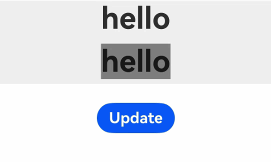

## 解除实体节点引用关系

由于BuilderNode对应的是后端的实体节点，正常的内存释放依赖前端对象的回收。如果期望直接释放后端的节点对象，则可以通过调用[dispose](../reference/apis-arkui/js-apis-arkui-builderNode.md#dispose12)与实体节点解除引用关系，此时持有的前端BuilderNode对象不再影响实体节点的生命周期。

> **说明：**
>
> 当BuilderNode对象调用dispose之后，不仅BuilderNode对象与后端实体节点解除引用关系，BuilderNode中的FrameNode与RenderNode也会同步和实体节点解除引用关系。
>
> 若前端对象BuilderNode无法释放，容易导致内存泄漏。建议在不再需要对该BuilderNode对象进行操作时，开发者应主动调用dispose释放后端节点，以减少引用关系的复杂性，降低内存泄漏的风险。

## 注入触摸事件

BuilderNode中提供了[postTouchEvent](../reference/apis-arkui/js-apis-arkui-builderNode.md#posttouchevent)，可以通过该接口向BuilderNode中绑定的组件注入[触摸事件](../reference/apis-arkui/arkui-ts/ts-universal-events-touch.md)，实现事件的模拟转发。

通过postTouchEvent向BuilderNode对应的节点树中注入触摸事件。

向BuilderNode中的Column组件转发另一个Column接收的事件，即点击下方的Column组件，上方的Column组件也会收到同样的触摸事件。当Button中的事件被成功识别的时候，返回值为true。

  <!-- @[Main_PostTouchEvent](https://gitcode.com/openharmony/applications_app_samples/blob/master/code/DocsSample/ArkUISample/BuilderNode/entry/src/main/ets/pages/PostTouchEvent.ets) -->
  
  ``` TypeScript
  import { NodeController, BuilderNode, FrameNode, UIContext } from '@kit.ArkUI';
  import { hilog } from '@kit.PerformanceAnalysisKit';
  
  class Params {
    public text: string = 'this is a text';
  }
  
  @Builder
  function buttonBuilder(params: Params) {
    Column() {
      Button(`button ` + params.text)
        .borderWidth(2)
        .backgroundColor(Color.Orange)
        .width('100%')
        .height('100%')
        .gesture(
          TapGesture()
            .onAction((event: GestureEvent) => {
              hilog.info(0xF811,'testTag','%{public}s','TapGesture');
            })
        )
    }
    .width(500)
    .height(300)
    .backgroundColor(Color.Gray)
  }
  
  class MyNodeController extends NodeController {
    private rootNode: BuilderNode<[Params]> | null = null;
    private wrapBuilder: WrappedBuilder<[Params]> = wrapBuilder(buttonBuilder);
  
    makeNode(uiContext: UIContext): FrameNode | null {
      this.rootNode = new BuilderNode(uiContext);
      this.rootNode.build(this.wrapBuilder, { text: 'this is a string' })
      return this.rootNode.getFrameNode();
    }
  
    postTouchEvent(touchEvent: TouchEvent): void {
      if (this.rootNode == null) {
        return;
      }
      let result = this.rootNode.postTouchEvent(touchEvent);
      hilog.info(0xF811,'testTag','%{public}s','result' + result);
    }
  }
  
  @Entry
  @Component
  struct postTouchEventPage {
    private nodeController: MyNodeController = new MyNodeController();
    @State bgColor: Color = Color.Pink;
  
    build() {
      Column() {
        NodeContainer(this.nodeController)
          .height(300)
          .width(500)
        Column()
          .id('onTouch')
          .width(500)
          .height(300)
          .backgroundColor(this.bgColor)
          .onTouch((event) => {
            if (event != undefined) {
              this.nodeController.postTouchEvent(event);
              this.bgColor = Color.Blue;
            }
          })
      }
    }
  }
  ```

## BuilderNode内的BuilderProxyNode导致树结构发生变化

若传入的Builder的根节点为语法节点（if/else/foreach/…）或自定义组件，将额外生成一个FrameNode，在节点树中显示为“BuilderProxyNode”，这会导致树结构变化，影响某些测试的传递过程。

在以下示例中，Column和Row绑定了触摸事件，同时Column设置了[hitTestBehavior](../reference/apis-arkui/arkui-ts/ts-universal-attributes-hit-test-behavior.md#hittestbehavior)属性为[HitTestMode.Transparent](../reference/apis-arkui/arkui-ts/ts-appendix-enums.md#hittestmode9)。然而，由于生成了BuilderProxyNode，且BuilderProxyNode无法设置属性，因此在触摸Column时，Column的触摸测试无法传递到Row上。

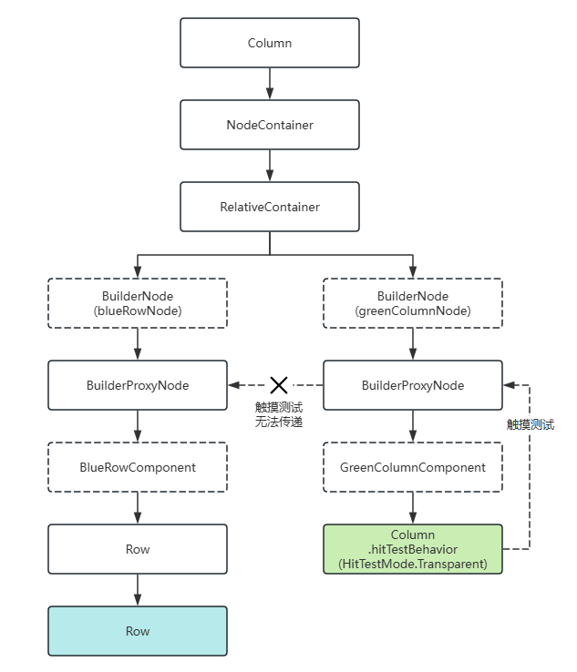

  <!-- @[Main_BuilderProxyNode01](https://gitcode.com/openharmony/applications_app_samples/blob/master/code/DocsSample/ArkUISample/BuilderNode/entry/src/main/ets/pages/BuilderProxyNode01.ets) -->
  
  ``` TypeScript
  import { BuilderNode, typeNode, NodeController, UIContext } from '@kit.ArkUI';
  import { hilog } from '@kit.PerformanceAnalysisKit';
  
  @Component
  struct BlueRowComponent {
    build() {
      Row() {
        Row() {
        }
        .width('100%')
        .height('200vp')
        .backgroundColor(0xFF2787D9)
        .onTouch((event: TouchEvent) => {
          // 触摸绿色Column，蓝色Row的触摸事件不触发。
          hilog.info(0xF811,'testTag','%{public}s','blue touched: ' + event.type);
        })
      }
    }
  }
  
  @Component
  struct GreenColumnComponent {
    build() {
      Column() {
      }
      .id('BuilderProxyNode01')
      .width('100%')
      .height('100vp')
      .backgroundColor(0xFF17A98D)
      .hitTestBehavior(HitTestMode.Transparent)
      .onTouch((event: TouchEvent) => {
        hilog.info(0xF811,'testTag','%{public}s','green touched: ' + event.type);
      })
    }
  }
  
  @Builder
  function buildBlueRow() {
    // Builder直接挂载自定义组件，生成BuilderProxyNode。
    BlueRowComponent()
  }
  
  @Builder
  function buildGreenColumn() {
    // Builder直接挂载自定义组件，生成BuilderProxyNode。
    GreenColumnComponent()
  }
  
  class MyNodeController extends NodeController {
    makeNode(uiContext: UIContext): FrameNode | null {
      const relativeContainer = typeNode.createNode(uiContext, 'RelativeContainer');
  
      const blueRowNode = new BuilderNode(uiContext);
      blueRowNode.build(wrapBuilder(buildBlueRow));
  
      const greenColumnNode = new BuilderNode(uiContext);
      greenColumnNode.build(wrapBuilder(buildGreenColumn));
  
      // greenColumnNode覆盖在blueRowNode上。
      relativeContainer.appendChild(blueRowNode.getFrameNode());
      relativeContainer.appendChild(greenColumnNode.getFrameNode());
  
      return relativeContainer;
    }
  }
  
  @Entry
  @Component
  struct BuilderProxyNode01 {
    build() {
      Column() {
        NodeContainer(new MyNodeController())
      }
    }
  }
  ```

在上述场景中，若要实现触摸测试的传递，可以使用一个容器组件包裹语法节点或自定义组件，以避免生成BuilderProxyNode，并将容器组件的hitTestBehavior设置为HitTestMode.Transparent，从而向兄弟节点传递触摸测试。

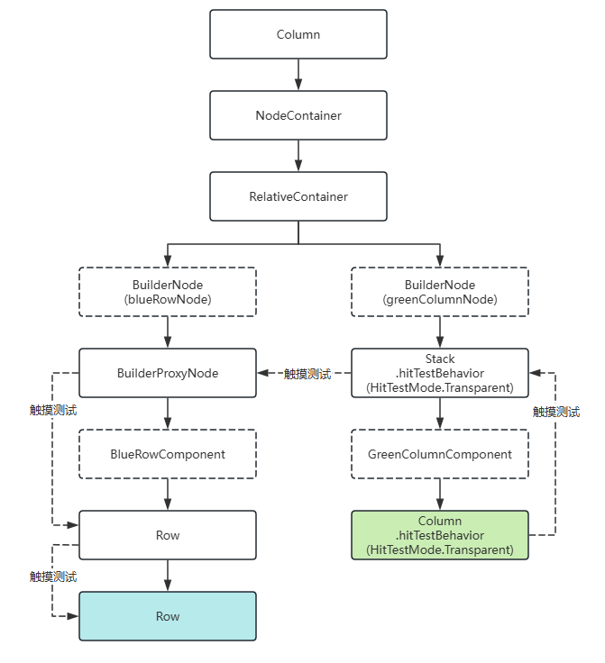

  <!-- @[Main_BuilderProxyNode02](https://gitcode.com/openharmony/applications_app_samples/blob/master/code/DocsSample/ArkUISample/BuilderNode/entry/src/main/ets/pages/BuilderProxyNode02.ets) -->
  
  ``` TypeScript
  import { BuilderNode, typeNode, NodeController, UIContext } from '@kit.ArkUI';
  import { hilog } from '@kit.PerformanceAnalysisKit';
  
  @Component
  struct BlueRowComponent {
    build() {
      Row() {
        Row() {
        }
        .width('100%')
        .height('200vp')
        .backgroundColor(0xFF2787D9)
        .onTouch((event: TouchEvent) => {
          // 触摸绿色Column，蓝色Row的触摸事件触发。
          hilog.info(0xF811,'testTag','%{public}s','blue touched: ' + event.type);
        })
      }
    }
  }
  
  @Component
  struct GreenColumnComponent {
    build() {
      Column() {
      }
      .width('100%')
      .height('100vp')
      .backgroundColor(0xFF17A98D)
      .hitTestBehavior(HitTestMode.Transparent)
      .onTouch((event: TouchEvent) => {
        hilog.info(0xF811,'testTag','%{public}s','green touched: ' + event.type);
      })
    }
  }
  
  @Builder
  function buildBlueRow() {
    // Builder直接挂载自定义组件，生成BuilderProxyNode。
    BlueRowComponent()
  }
  
  @Builder
  function buildGreenColumn() {
    // Builder根节点为容器组件，不会生成BuilderProxyNode，可以设置属性。
    Stack() {
      GreenColumnComponent()
    }
    .hitTestBehavior(HitTestMode.Transparent)
  }
  
  class MyNodeController extends NodeController {
    makeNode(uiContext: UIContext): FrameNode | null {
      const relativeContainer = typeNode.createNode(uiContext, 'RelativeContainer');
  
      const blueRowNode = new BuilderNode(uiContext);
      blueRowNode.build(wrapBuilder(buildBlueRow));
  
      const greenColumnNode = new BuilderNode(uiContext);
      greenColumnNode.build(wrapBuilder(buildGreenColumn));
  
      // greenColumnNode覆盖在blueRowNode上。
      relativeContainer.appendChild(blueRowNode.getFrameNode());
      relativeContainer.appendChild(greenColumnNode.getFrameNode());
  
      return relativeContainer;
    }
  }
  
  @Entry
  @Component
  struct Index {
    build() {
      Column() {
        NodeContainer(new MyNodeController())
          .id('BuilderProxyNode02')
      }
    }
  }
  ```

此外，对于自定义组件，可以直接设置属性，此时将额外生成节点__Common__，自定义组件的属性将挂载于__Common__上，同样能够实现上述效果。

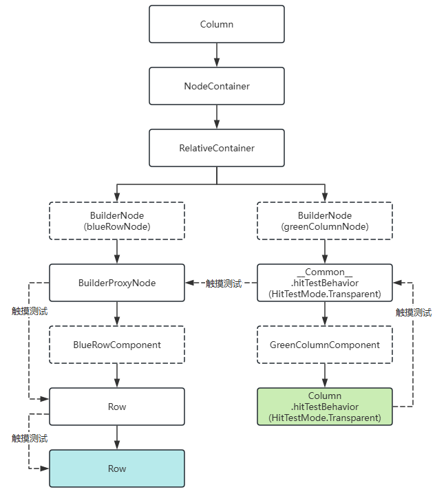

  <!-- @[Main_BuilderProxyNode03](https://gitcode.com/openharmony/applications_app_samples/blob/master/code/DocsSample/ArkUISample/BuilderNode/entry/src/main/ets/pages/BuilderProxyNode03.ets) -->
  
  ``` TypeScript
  import { BuilderNode, typeNode, NodeController, UIContext } from '@kit.ArkUI';
  import { hilog } from '@kit.PerformanceAnalysisKit';
  
  @Component
  struct BlueRowComponent {
    build() {
      Row() {
        Row() {
        }
        .width('100%')
        .height('200vp')
        .backgroundColor(0xFF2787D9)
        .onTouch((event: TouchEvent) => {
          // 触摸绿色Column，蓝色Row的触摸事件触发。
          hilog.info(0xF811,'testTag','%{public}s','blue touched: ' + event.type);
        })
      }
    }
  }
  
  @Component
  struct GreenColumnComponent {
    build() {
      Column() {
      }
      .width('100%')
      .height('100vp')
      .backgroundColor(0xFF17A98D)
      .hitTestBehavior(HitTestMode.Transparent)
      .onTouch((event: TouchEvent) => {
        hilog.info(0xF811,'testTag','%{public}s','green touched: ' + event.type);
      })
    }
  }
  
  @Builder
  function buildBlueRow() {
    // Builder直接挂载自定义组件，生成BuilderProxyNode。
    BlueRowComponent()
  }
  
  @Builder
  function buildGreenColumn() {
    // 给自定义组件设置属性生成__Common__节点，Builder根节点为__Common__节点，不会生成BuilderProxyNode。
    GreenColumnComponent()
      .hitTestBehavior(HitTestMode.Transparent)
  }
  
  class MyNodeController extends NodeController {
    makeNode(uiContext: UIContext): FrameNode | null {
      const relativeContainer = typeNode.createNode(uiContext, 'RelativeContainer');
  
      const blueRowNode = new BuilderNode(uiContext);
      blueRowNode.build(wrapBuilder(buildBlueRow));
  
      const greenColumnNode = new BuilderNode(uiContext);
      greenColumnNode.build(wrapBuilder(buildGreenColumn));
  
      // greenColumnNode覆盖在blueRowNode上。
      relativeContainer.appendChild(blueRowNode.getFrameNode());
      relativeContainer.appendChild(greenColumnNode.getFrameNode());
  
      return relativeContainer;
    }
  }
  
  @Entry
  @Component
  struct Index {
    build() {
      Column() {
        NodeContainer(new MyNodeController())
      }
    }
  }
  ```

## BuilderNode调用reuse和recycle接口实现节点复用能力

调用[reuse](../reference/apis-arkui/js-apis-arkui-builderNode.md#reuse12)接口和[recycle](../reference/apis-arkui/js-apis-arkui-builderNode.md#recycle12)接口，将复用和回收事件传递至BuilderNode中的自定义组件，以实现BuilderNode节点内部的自定义组件的复用。

以下面的Demo为例，被复用的自定义组件ReusableChildComponent可以传递复用和回收事件到其下的自定义组件ChildComponent3，但无法传递给自定义组件ChildComponent2，因为被BuilderNode所隔断。因此需要主动调用BuilderNode的reuse和recycle接口，将复用和回收事件传递给自定义组件ChildComponent2，以达成复用效果。

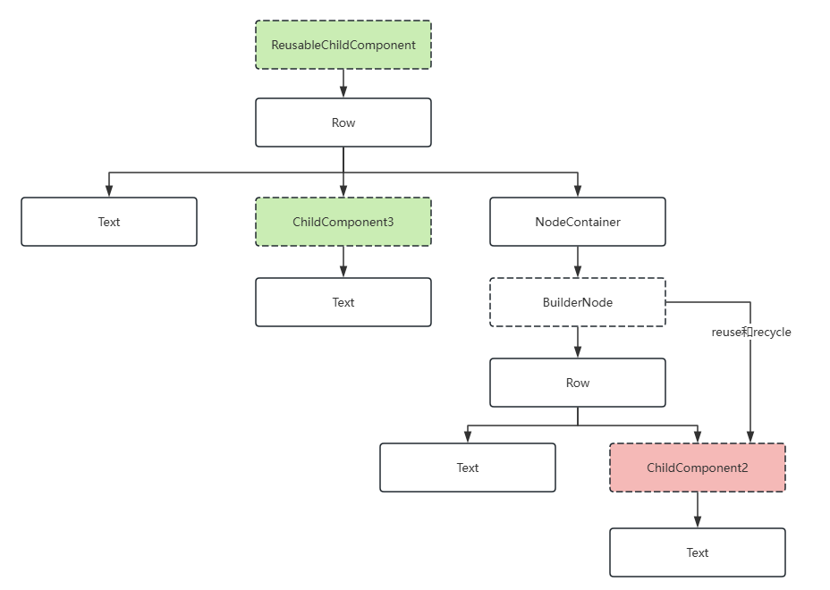


  <!-- @[Main_ReusablePage01](https://gitcode.com/openharmony/applications_app_samples/blob/master/code/DocsSample/ArkUISample/BuilderNode/entry/src/main/ets/pages/ReusablePage01.ets) -->
  
  ``` TypeScript
  import { FrameNode, NodeController, BuilderNode, UIContext } from '@kit.ArkUI';
  import { hilog } from '@kit.PerformanceAnalysisKit';
  
  const TEST_TAG: string = 'Reuse+Recycle';
  
  class MyDataSource {
    private dataArray: string[] = [];
    private listener: DataChangeListener | null = null;
  
    public totalCount(): number {
      return this.dataArray.length;
    }
  
    public getData(index: number) {
      return this.dataArray[index];
    }
  
    public pushData(data: string) {
      this.dataArray.push(data);
    }
  
    public reloadListener(): void {
      this.listener?.onDataReloaded();
    }
  
    public registerDataChangeListener(listener: DataChangeListener): void {
      this.listener = listener;
    }
  
    public unregisterDataChangeListener(): void {
      this.listener = null;
    }
  }
  
  class Params {
    public item: string = '';
  
    constructor(item: string) {
      this.item = item;
    }
  }
  
  @Builder
  function buildNode(param: Params = new Params('hello')) {
    Row() {
      Text(`C${param.item} -- `)
      ChildComponent2({ item: param.item }) //该自定义组件在BuilderNode中无法被正确复用。
    }
  }
  
  class MyNodeController extends NodeController {
    public builderNode: BuilderNode<[Params]> | null = null;
    public item: string = '';
  
    makeNode(uiContext: UIContext): FrameNode | null {
      if (this.builderNode == null) {
        this.builderNode = new BuilderNode(uiContext, { selfIdealSize: { width: 300, height: 200 } });
        this.builderNode.build(wrapBuilder<[Params]>(buildNode), new Params(this.item));
      }
      return this.builderNode.getFrameNode();
    }
  }
  
  // 被回收复用的自定义组件，其状态变量会更新，而子自定义组件ChildComponent3中的状态变量也会更新，但BuilderNode会阻断这一传递过程。
  @Reusable
  @Component
  struct ReusableChildComponent {
    @Prop item: string = '';
    @Prop switch: string = '';
    private controller: MyNodeController = new MyNodeController();
  
    aboutToAppear() {
      this.controller.item = this.item;
    }
  
    aboutToRecycle(): void {
      hilog.info(0xF811,'testTag','%{public}s',`${TEST_TAG} ReusableChildComponent aboutToRecycle ${this.item}`);
  
      // 当开关为open，通过BuilderNode的reuse接口和recycle接口传递给其下的自定义组件，例如ChildComponent2，完成复用。
      if (this.switch === 'open') {
        this.controller?.builderNode?.recycle();
      }
    }
  
    aboutToReuse(params: object): void {
      hilog.info(0xF811,'testTag','%{public}s',`${TEST_TAG} ReusableChildComponent aboutToReuse ${JSON.stringify(params)}`);
  
      // 当开关为open，通过BuilderNode的reuse接口和recycle接口传递给其下的自定义组件，例如ChildComponent2，完成复用。
      if (this.switch === 'open') {
        this.controller?.builderNode?.reuse(params);
      }
    }
  
    build() {
      Row() {
        Text(`A${this.item}--`)
        ChildComponent3({ item: this.item })
        NodeContainer(this.controller);
      }
    }
  }
  
  @Component
  struct ChildComponent2 {
    @Prop item: string = 'false';
  
    aboutToReuse(params: Record<string, object>) {
      hilog.info(0xF811,'testTag','%{public}s',`${TEST_TAG} ChildComponent2 aboutToReuse ${JSON.stringify(params)}`);
    }
  
    aboutToRecycle(): void {
      hilog.info(0xF811,'testTag','%{public}s',`${TEST_TAG} ChildComponent2 aboutToRecycle ${this.item}`);
    }
  
    build() {
      Row() {
        Text(`D${this.item}`)
          .fontSize(20)
          .backgroundColor(Color.Yellow)
          .margin({ left: 10 })
      }.margin({ left: 10, right: 10 })
    }
  }
  
  @Component
  struct ChildComponent3 {
    @Prop item: string = 'false';
  
    aboutToReuse(params: Record<string, object>) {
      hilog.info(0xF811,'testTag','%{public}s',`${TEST_TAG} ChildComponent3 aboutToReuse ${JSON.stringify(params)}`);
    }
  
    aboutToRecycle(): void {
      hilog.info(0xF811,'testTag','%{public}s',`${TEST_TAG} ChildComponent3 aboutToRecycle ${this.item}`);
    }
  
    build() {
      Row() {
        Text(`B${this.item}`)
          .fontSize(20)
          .backgroundColor(Color.Yellow)
          .margin({ left: 10 })
      }.margin({ left: 10, right: 10 })
    }
  }
  
  
  @Entry
  @Component
  struct Index {
    @State data: MyDataSource = new MyDataSource();
  
    aboutToAppear() {
      for (let i = 0; i < 100; i++) {
        this.data.pushData(i.toString());
      }
    }
  
    build() {
      Column() {
        List({ space: 3 }) {
          LazyForEach(this.data, (item: string) => {
            ListItem() {
              ReusableChildComponent({
                item: item,
                switch: 'open' // 将open改为close可观察到，BuilderNode不通过reuse和recycle接口传递复用时，BuilderNode内部的自定义组件的行为表现。
              })
            }
          }, (item: string) => item)
        }
        .id('List')
        .width('100%')
        .height('100%')
      }
    }
  }
  ```


## BuilderNode在子自定义组件中使用@Reusable装饰器

BuilderNode节点的复用机制与使用[@Reusable](./state-management/arkts-reusable.md)装饰器的自定义组件的复用机制会相互冲突。因此，当BuilderNode的子节点为自定义组件时，不支持该自定义组件使用@Reusable装饰器标记，否则将导致应用程序触发JSCrash。若需要使用@Reusable装饰器，应使用一个普通自定义组件包裹该自定义组件。

在下面的示例中，ReusableChildComponent作为BuilderNode的子自定义组件，无法标记为@Reusable。通过ChildComponent2对其包裹，ReusableChildComponent可以使用@Reusable装饰器标记。

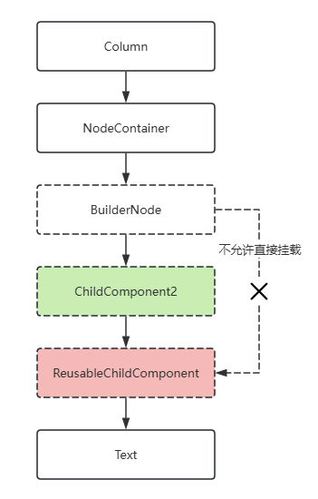

  <!-- @[Main_ReusablePage02](https://gitcode.com/openharmony/applications_app_samples/blob/master/code/DocsSample/ArkUISample/BuilderNode/entry/src/main/ets/pages/ReusablePage02.ets) -->
  
  ``` TypeScript
  import { FrameNode, NodeController, BuilderNode, UIContext } from '@kit.ArkUI';
  import { hilog } from '@kit.PerformanceAnalysisKit';
  
  const TEST_TAG: string = 'Reusable';
  
  class Params {
    public item: string = '';
  
    constructor(item: string) {
      this.item = item;
    }
  }
  
  @Builder
  function buildNode(param: Params = new Params('Hello')) {
    ChildComponent2({ item: param.item })
  }
  
  class MyNodeController extends NodeController {
    public builderNode: BuilderNode<[Params]> | null = null;
    public item: string = '';
  
    constructor(item: string) {
      super();
      this.item = item;
    }
  
    makeNode(uiContext: UIContext): FrameNode | null {
      if (this.builderNode == null) {
        this.builderNode = new BuilderNode(uiContext, { selfIdealSize: { width: 300, height: 200 } });
        this.builderNode.build(wrapBuilder<[Params]>(buildNode), new Params(this.item));
      }
      return this.builderNode.getFrameNode();
    }
  }
  
  // 标记了@Reusable的自定义组件，无法直接被BuilderNode挂载为子节点。
  @Reusable
  @Component
  struct ReusableChildComponent {
    @Prop item: string = '';
  
    aboutToReuse(params: object): void {
      hilog.info(0xF811,'testTag','%{public}s',`${TEST_TAG} ReusableChildComponent aboutToReuse ${JSON.stringify(params)}`);
    }
  
    aboutToRecycle(): void {
      hilog.info(0xF811,'testTag','%{public}s',`${TEST_TAG} ReusableChildComponent aboutToRecycle ${this.item}`);
    }
  
    build() {
      Text(`A--${this.item}`)
        .id('ReusablePage02')
    }
  }
  
  // 未标记@Reusable的自定义组件。
  @Component
  struct ChildComponent2 {
    @Prop item: string = '';
  
    aboutToReuse(params: Record<string, object>) {
      hilog.info(0xF811,'testTag','%{public}s',`${TEST_TAG} ChildComponent2 aboutToReuse ${JSON.stringify(params)}`);
    }
  
    aboutToRecycle(): void {
      hilog.info(0xF811,'testTag','%{public}s',`${TEST_TAG} ChildComponent2 aboutToRecycle ${this.item}`);
    }
  
    build() {
      ReusableChildComponent({ item: this.item })
    }
  }
  
  
  @Entry
  @Component
  struct Index {
    @State controller: MyNodeController = new MyNodeController('Child');
  
    build() {
      Column() {
        NodeContainer(this.controller)
      }
      .width('100%')
      .height('100%')
    }
  }
  ```

## 通过系统环境变化更新节点

使用[updateConfiguration](../reference/apis-arkui/js-apis-arkui-builderNode.md#updateconfiguration12)来监听[系统环境变化](../reference/apis-ability-kit/js-apis-app-ability-configuration.md)事件，以触发节点的全量更新。

> **说明：**
>
> updateConfiguration接口用于通知对象进行更新，更新所使用的系统环境取决于应用当前系统环境的变化。

  <!-- @[Main_EnvironmentCallbackPage](https://gitcode.com/openharmony/applications_app_samples/blob/master/code/DocsSample/ArkUISample/BuilderNode/entry/src/main/ets/pages/EnvironmentCallbackPage.ets) -->
  
  ``` TypeScript
  import { NodeController, BuilderNode, FrameNode, UIContext } from '@kit.ArkUI';
  import { AbilityConstant, Configuration, EnvironmentCallback } from '@kit.AbilityKit';
  import { hilog } from '@kit.PerformanceAnalysisKit';
  
  class Params {
    public text: string = '';
  
    constructor(text: string) {
      this.text = text;
    }
  }
  
  // 自定义组件。
  @Component
  struct TextBuilder {
    // 作为自定义组件中需要更新的属性，数据类型为基础属性，定义为@Prop。
    @Prop message: string = 'TextBuilder';
  
    build() {
      Row() {
        Column() {
          Text(this.message)
            .fontSize(50)
            .fontWeight(FontWeight.Bold)
            .margin({ bottom: 36 })
            .fontColor($r(`app.color.text_color`))
            .backgroundColor($r(`app.color.start_window_background`))
        }
      }
    }
  }
  
  @Builder
  function buildText(params: Params) {
    Column() {
      Text(params.text)
        .fontSize(50)
        .fontWeight(FontWeight.Bold)
        .margin({ bottom: 36 })
        .fontColor($r(`app.color.text_color`))
      TextBuilder({ message: params.text }) // 自定义组件。
    }.backgroundColor($r(`app.color.start_window_background`))
  }
  
  class TextNodeController extends NodeController {
    private textNode: BuilderNode<[Params]> | null = null;
    private message: string = '';
  
    constructor(message: string) {
      super();
      this.message = message;
    }
  
    makeNode(context: UIContext): FrameNode | null {
      return this.textNode?.getFrameNode() ? this.textNode?.getFrameNode() : null;
    }
  
    createNode(context: UIContext) {
      this.textNode = new BuilderNode(context);
      this.textNode.build(wrapBuilder<[Params]>(buildText), new Params(this.message));
      builderNodeMap.push(this.textNode);
    }
  
    deleteNode() {
      let node = builderNodeMap.pop();
      node?.dispose();
    }
  
    update(message: string) {
      if (this.textNode !== null) {
        // 调用update进行更新。
        this.textNode.update(new Params(message));
      }
    }
  }
  
  // 记录创建的自定义节点对象。
  const builderNodeMap: BuilderNode<[Params]>[] = [];
  
  function updateColorMode() {
    builderNodeMap.forEach((value, index) => {
      // 通知BuilderNode环境变量改变。
      value.updateConfiguration();
    })
  }
  
  @Entry
  @Component
  struct Index {
    @State message: string = 'hello';
    private textNodeController: TextNodeController = new TextNodeController(this.message);
    private count = 0;
  
    aboutToAppear(): void {
      let environmentCallback: EnvironmentCallback = {
        onMemoryLevel: (level: AbilityConstant.MemoryLevel): void => {
          hilog.info(0xF811,'testTag','%{public}s','onMemoryLevel');
        },
        onConfigurationUpdated: (config: Configuration): void => {
          hilog.info(0xF811,'testTag','%{public}s','onConfigurationUpdated ' + JSON.stringify(config));
          updateColorMode();
        }
      }
      // 注册监听回调。
      this.getUIContext().getHostContext()?.getApplicationContext().on('environment', environmentCallback);
      //创建自定义节点并添加至map。
      this.textNodeController.createNode(this.getUIContext());
    }
  
    aboutToDisappear(): void {
      //移除map中的引用，并将自定义节点释放。
      this.textNodeController.deleteNode();
    }
  
    build() {
      Row() {
        Column() {
          NodeContainer(this.textNodeController)
            .width('100%')
            .height(200)
            .backgroundColor('#FFF0F0F0')
          Button('Update')
            .onClick(() => {
              this.count += 1;
              const message = 'Update ' + this.count.toString();
              this.textNodeController.update(message);
            })
        }
        .width('100%')
        .height('100%')
      }
      .height('100%')
    }
  }
  ```

## 跨页面复用注意事项

在使用[路由](../reference/apis-arkui/arkts-apis-uicontext-router.md)接口[router.replaceUrl](../reference/apis-arkui/arkts-apis-uicontext-router.md#replaceurl)、[router.back](../reference/apis-arkui/arkts-apis-uicontext-router.md#back)、[router.clear](../reference/apis-arkui/arkts-apis-uicontext-router.md#clear)、[router.replaceNamedRoute](../reference/apis-arkui/arkts-apis-uicontext-router.md#replacenamedroute)操作页面时，若某个被缓存的BuilderNode位于即将销毁的页面内，那么在新页面中复用该BuilderNode时，可能会存在数据无法更新或新创建节点无法显示的问题。以[router.replaceNamedRoute](../reference/apis-arkui/arkts-apis-uicontext-router.md#replacenamedroute)为例，在以下示例代码中，当点击“router replace”按钮后，页面将切换至PageTwo，同时标志位isShowText会被设定为false。

  <!-- @[Main_RouterPage3](https://gitcode.com/openharmony/applications_app_samples/blob/master/code/DocsSample/ArkUISample/BuilderNode/entry/src/main/ets/pages/RouterPage3.ets) -->
  
  ``` TypeScript
  // ets/pages/RouterPage3.ets
  import { NodeController, BuilderNode, FrameNode, UIContext } from '@kit.ArkUI';
  import 'ets/pages/RouterPage2';
  
  @Builder
  function buildText() {
    // @Builder中使用语法节点生成BuilderProxyNode。
    if (true) {
      MyComponent()
    }
  }
  
  @Component
  struct MyComponent {
    @StorageLink('isShowText') isShowText: boolean = true;
  
    build() {
      if (this.isShowText) {
        Column() {
          Text('BuilderNode Reuse')
            .fontSize(36)
            .fontWeight(FontWeight.Bold)
            .padding(16)
        }
      }
    }
  }
  
  class TextNodeController extends NodeController {
    private rootNode: FrameNode | null = null;
    private textNode: BuilderNode<[]> | null = null;
  
    makeNode(context: UIContext): FrameNode | null {
      this.rootNode = new FrameNode(context);
  
      if (AppStorage.has('textNode')) {
        // 复用AppStorage中的BuilderNode。
        this.textNode = AppStorage.get<BuilderNode<[]>>('textNode') as BuilderNode<[]>;
        const parent = this.textNode.getFrameNode()?.getParent();
        if (parent) {
          parent.removeChild(this.textNode.getFrameNode());
        }
      } else {
        this.textNode = new BuilderNode(context);
        this.textNode.build(wrapBuilder<[]>(buildText));
        // 将创建的BuilderNode存入AppStorage。
        AppStorage.setOrCreate<BuilderNode<[]>>('textNode', this.textNode);
      }
      this.rootNode.appendChild(this.textNode.getFrameNode());
  
      return this.rootNode;
    }
  }
  
  @Entry({ routeName: 'myIndex' })
  @Component
  struct Index {
    aboutToAppear(): void {
      AppStorage.setOrCreate<boolean>('isShowText', true);
    }
  
    build() {
      Row() {
        Column() {
          NodeContainer(new TextNodeController())
            .width('100%')
            .backgroundColor('#FFF0F0F0')
          Button('Router pageTwo')
            .onClick(() => {
              // 改变AppStorage中的状态变量触发Text节点的重新创建。
              AppStorage.setOrCreate<boolean>('isShowText', false);
              // 将BuilderNode从AppStorage中移除。
              AppStorage.delete('textNode');
  
              this.getUIContext().getRouter().replaceNamedRoute({ name: 'pageTwo' });
            })
            .margin({ top: 16 })
        }
        .width('100%')
        .height('100%')
        .padding(16)
      }
      .height('100%')
    }
  }
  ```

PageTwo的实现如下：

  <!-- @[Main_RouterPage2](https://gitcode.com/openharmony/applications_app_samples/blob/master/code/DocsSample/ArkUISample/BuilderNode/entry/src/main/ets/pages/RouterPage2.ets) -->
  
  ``` TypeScript
  // ets/pages/RouterPage2.ets
  // 该页面中存在一个按钮，可跳转回主页面，回到主页面后，原有的文字消失。
  import 'ets/pages/RouterPage1';
  
  @Entry({ routeName: 'pageTwo' })
  @Component
  struct PageTwo {
    build() {
      Column() {
        Button('Router replace to index')
          .onClick(() => {
            this.getUIContext().getRouter().replaceNamedRoute({ name: 'myIndex' });
          })
      }
      .height('100%')
      .width('100%')
      .alignItems(HorizontalAlign.Center)
      .padding(16)
    }
  }
  ```


在API version 16之前，解决该问题的方法是在页面销毁时，将页面上的BuilderNode从缓存中移除。以上述例子为例，可以在页面跳转前，通过点击事件将BuilderNode从AppStorage中移除，以此达到预期效果。

API version 16及之后版本，BuilderNode在新页面被复用时，会自动刷新自身内容，无需在页面销毁时将BuilderNode从缓存中移除。

  <!-- @[Main_RouterPage3](https://gitcode.com/openharmony/applications_app_samples/blob/master/code/DocsSample/ArkUISample/BuilderNode/entry/src/main/ets/pages/RouterPage3.ets) -->
  
  ``` TypeScript
  // ets/pages/RouterPage3.ets
  import { NodeController, BuilderNode, FrameNode, UIContext } from '@kit.ArkUI';
  import 'ets/pages/RouterPage2';
  
  @Builder
  function buildText() {
    // @Builder中使用语法节点生成BuilderProxyNode。
    if (true) {
      MyComponent()
    }
  }
  
  @Component
  struct MyComponent {
    @StorageLink('isShowText') isShowText: boolean = true;
  
    build() {
      if (this.isShowText) {
        Column() {
          Text('BuilderNode Reuse')
            .fontSize(36)
            .fontWeight(FontWeight.Bold)
            .padding(16)
        }
      }
    }
  }
  
  class TextNodeController extends NodeController {
    private rootNode: FrameNode | null = null;
    private textNode: BuilderNode<[]> | null = null;
  
    makeNode(context: UIContext): FrameNode | null {
      this.rootNode = new FrameNode(context);
  
      if (AppStorage.has('textNode')) {
        // 复用AppStorage中的BuilderNode。
        this.textNode = AppStorage.get<BuilderNode<[]>>('textNode') as BuilderNode<[]>;
        const parent = this.textNode.getFrameNode()?.getParent();
        if (parent) {
          parent.removeChild(this.textNode.getFrameNode());
        }
      } else {
        this.textNode = new BuilderNode(context);
        this.textNode.build(wrapBuilder<[]>(buildText));
        // 将创建的BuilderNode存入AppStorage。
        AppStorage.setOrCreate<BuilderNode<[]>>('textNode', this.textNode);
      }
      this.rootNode.appendChild(this.textNode.getFrameNode());
  
      return this.rootNode;
    }
  }
  
  @Entry({ routeName: 'myIndex' })
  @Component
  struct Index {
    aboutToAppear(): void {
      AppStorage.setOrCreate<boolean>('isShowText', true);
    }
  
    build() {
      Row() {
        Column() {
          NodeContainer(new TextNodeController())
            .width('100%')
            .backgroundColor('#FFF0F0F0')
          Button('Router pageTwo')
            .onClick(() => {
              // 改变AppStorage中的状态变量触发Text节点的重新创建。
              AppStorage.setOrCreate<boolean>('isShowText', false);
              // 将BuilderNode从AppStorage中移除。
              AppStorage.delete('textNode');
  
              this.getUIContext().getRouter().replaceNamedRoute({ name: 'pageTwo' });
            })
            .margin({ top: 16 })
        }
        .width('100%')
        .height('100%')
        .padding(16)
      }
      .height('100%')
    }
  }
  ```


## BuilderNode中使用LocalStorage

从API version 12开始，自定义组件支持接收[LocalStorage](../ui/state-management/arkts-localstorage.md)实例。可以通过[传递LocalStorage实例](../ui/state-management/arkts-localstorage.md#自定义组件接收localstorage实例)来使用LocalStorage相关的装饰器[@LocalStorageProp](../ui/state-management/arkts-localstorage.md#localstorageprop)、[@LocalStorageLink](../ui/state-management/arkts-localstorage.md#localstoragelink)。

  <!-- @[Main_LocalStoragePage](https://gitcode.com/openharmony/applications_app_samples/blob/master/code/DocsSample/ArkUISample/BuilderNode/entry/src/main/ets/pages/LocalStoragePage.ets) -->
  
  ``` TypeScript
  import { BuilderNode, NodeController, UIContext } from '@kit.ArkUI';
  
  let localStorage1: LocalStorage = new LocalStorage();
  localStorage1.setOrCreate('propA', 'propA');
  
  let localStorage2: LocalStorage = new LocalStorage();
  localStorage2.setOrCreate('propB', 'propB');
  
  @Entry(localStorage1)
  @Component
  struct Index {
    @LocalStorageLink('propA') propA: string = 'Hello World';
    @State count: number = 0;
    private controller: NodeController = new MyNodeController(this.count, localStorage2);
  
    build() {
      Row() {
        Column() {
          Text(this.propA)
            .fontSize(50)
            .fontWeight(FontWeight.Bold)
          // 使用LocalStorage 实例localStorage2
          Child({ count: this.count }, localStorage2)
          NodeContainer(this.controller)
        }
        .id('LocalStoragePage')
        .width('100%')
      }
      .height('100%')
    }
  }
  
  interface Params {
    count: number;
    localStorage: LocalStorage;
  }
  
  @Builder
  function createChild(params: Params) {
    //构造过程中传递localStorage
    Child({ count: params.count }, params.localStorage)
  }
  
  class MyNodeController extends NodeController {
    private count?: number;
    private localStorage ?: LocalStorage;
  
    constructor(count: number, localStorage: LocalStorage) {
      super();
      this.count = count;
      this.localStorage = localStorage;
    }
  
    makeNode(uiContext: UIContext): FrameNode | null {
      let builderNode = new BuilderNode<[Params]>(uiContext);
      //构造过程中传递localStorage
      builderNode.build(wrapBuilder(createChild), { count: this.count, localStorage: this.localStorage });
      return builderNode.getFrameNode();
    }
  }
  
  @Component
  struct Child {
    @Prop count: number;
    @LocalStorageLink('propB') propB: string = 'Hello World';
  
    build() {
      Text(this.propB)
        .fontSize(50)
        .fontWeight(FontWeight.Bold)
    }
  }
  ```

## 查询当前BuilderNode是否解除引用

前端节点均绑定有相应的后端实体节点，当节点调用dispose接口解除绑定后，再次调用接口可能会出现crash、返回默认值的情况。

从API version 20开始，使用[isDisposed](../reference/apis-arkui/js-apis-arkui-builderNode.md#isdisposed20)接口查询当前BuilderNode对象是否已解除与后端实体节点的引用关系，从而可以在操作节点前检查其有效性，避免潜在风险。

  <!-- @[Main_IsDisposedPage](https://gitcode.com/openharmony/applications_app_samples/blob/master/code/DocsSample/ArkUISample/BuilderNode/entry/src/main/ets/pages/IsDisposedPage.ets) -->
  
  ``` TypeScript
  import { NodeController, FrameNode, BuilderNode } from '@kit.ArkUI';
  
  @Builder
  function buildText() {
    Text('Test')
      .fontSize(20)
      .fontWeight(FontWeight.Bold)
  }
  
  class MyNodeController extends NodeController {
    private rootNode: FrameNode | null = null;
    private builderNode: BuilderNode<[]> | null = null;
  
    makeNode(uiContext: UIContext): FrameNode | null {
      this.rootNode = new FrameNode(uiContext);
      this.rootNode.commonAttribute.width(100)
        .height(100)
        .backgroundColor(Color.Pink);
      this.builderNode = new BuilderNode<[]>(uiContext);
      this.builderNode.build(wrapBuilder<[]>(buildText));
  
      // 挂载BuilderNode。
      this.rootNode.appendChild(this.builderNode.getFrameNode());
      return this.rootNode;
    }
  
    disposeBuilderNode() {
      // 解除BuilderNode与后端实体节点的引用关系。
      this.builderNode?.dispose();
    }
  
    isDisposed(): string {
      if (this.builderNode !== null) {
        // 查询BuilderNode是否解除引用。
        if (this.builderNode.isDisposed()) {
          return 'builderNode isDisposed is true';
        } else {
          return 'builderNode isDisposed is false';
        }
      }
      return 'builderNode is null';
    }
  }
  
  @Entry
  @Component
  struct Index {
    @State text: string = '';
    private myNodeController: MyNodeController = new MyNodeController();
  
    build() {
      Column({ space: 4 }) {
        NodeContainer(this.myNodeController)
        Button('BuilderNode dispose')
          .onClick(() => {
            this.myNodeController.disposeBuilderNode();
            this.text = '';
          })
          .width(200)
          .height(50)
        Button('BuilderNode isDisposed')
          .onClick(() => {
            this.text = this.myNodeController.isDisposed();
          })
          .width(200)
          .height(50)
        Text(this.text)
          .fontSize(25)
      }
      .width('100%')
      .height('100%')
    }
  }
  ```

## 设置BuilderNode继承冻结能力

ArkUI支持[自定义组件冻结](./state-management/arkts-custom-components-freeze.md)，该功能冻结非激活状态组件的刷新能力。当组件处于非激活状态时，即便其绑定状态变量发生变化，也不会触发组件UI的重新渲染，从而减少复杂UI场景的刷新负载。

从API version 20开始，BuilderNode节点可以通过[inheritFreezeOptions](../reference/apis-arkui/js-apis-arkui-builderNode.md#inheritfreezeoptions20)接口继承父自定义组件（即从该BuilderNode节点向上查找的第一个自定义组件）的冻结策略。当BuilderNode节点继承父自定义组件的冻结策略时，若父自定义组件的冻结策略设置为开启组件冻结（即[freezeWhenInactive](../reference/apis-arkui/arkui-ts/ts-custom-component-parameter.md#componentoptions)选项设为true），则BuilderNode节点在不活跃时将会冻结，当切换至活跃状态时解冻，并使用缓存的数据更新节点。

BuilderNode节点只有通过以下方式上下树时，才会根据该节点是否继承父自定义组件的冻结策略，来更新自己的冻结策略：

| 类 | 接口 |
| -------- | -------- |
| [FrameNode](../reference/apis-arkui/js-apis-arkui-frameNode.md) | [appendChild](../reference/apis-arkui/js-apis-arkui-frameNode.md#appendchild12)、[insertChildAfter](../reference/apis-arkui/js-apis-arkui-frameNode.md#insertchildafter12)、[removeChild](../reference/apis-arkui/js-apis-arkui-frameNode.md#removechild12)、[clearChildren](../reference/apis-arkui/js-apis-arkui-frameNode.md#clearchildren12)、[addComponentContent](../reference/apis-arkui/js-apis-arkui-frameNode.md#addcomponentcontent12) |
| [NodeContent](../reference/apis-arkui/js-apis-arkui-NodeContent.md) | [addFrameNode](../reference/apis-arkui/js-apis-arkui-NodeContent.md#addframenode12)、[removeFrameNode](../reference/apis-arkui/js-apis-arkui-NodeContent.md#removeframenode12) |
| [NodeController](../reference/apis-arkui/js-apis-arkui-nodeController.md) | [makeNode](../reference/apis-arkui/js-apis-arkui-nodeController.md#makenode) |
| [RenderNode](../reference/apis-arkui/js-apis-arkui-renderNode.md) | [appendChild](../reference/apis-arkui/js-apis-arkui-renderNode.md#appendchild)、[insertChildAfter](../reference/apis-arkui/js-apis-arkui-renderNode.md#insertchildafter)、[removeChild](../reference/apis-arkui/js-apis-arkui-renderNode.md#removechild)、[clearChildren](../reference/apis-arkui/js-apis-arkui-renderNode.md#clearchildren) |
| [NodeAdaper](../reference/apis-arkui/js-apis-arkui-frameNode.md#nodeadapter12) | 节点通过[懒加载](../reference/apis-arkui/arkui-ts/ts-rendering-control-lazyforeach.md)方式上下树时 |

> **说明：**
>
> 当BuilderNode节点设置为继承父自定义组件的冻结策略时，BuilderNode节点的冻结策略将与其上层最近的自定义组件或BuilderNode节点的冻结策略保持一致。
>
> 当BuilderNode节点被冻结时，调用[update](../reference/apis-arkui/js-apis-arkui-builderNode.md#update)接口不会触发节点的更新，等其被解冻时再更新节点。

### BuilderNode常用冻结场景（状态管理V1）

从API version 20开始，在状态管理V1中，当BuilderNode节点开启冻结（即[inheritFreezeOptions](../reference/apis-arkui/js-apis-arkui-builderNode.md#inheritfreezeoptions20)设置为true）并继承父自定义组件的冻结策略时，如果父自定义组件的冻结策略设置为开启组件冻结（即freezeWhenInactive选项设为true），则BuilderNode节点在不活跃时将会冻结。当切换至活跃状态时，节点将解冻并使用缓存的数据进行更新，示例如下。

  <!-- @[Main_InheritFreezeOptionsPage](https://gitcode.com/openharmony/applications_app_samples/blob/master/code/DocsSample/ArkUISample/BuilderNode/entry/src/main/ets/pages/InheritFreezeOptionsPage.ets) -->
  
  ``` TypeScript
  import { BuilderNode, FrameNode, NodeController } from '@kit.ArkUI';
  import { hilog } from '@kit.PerformanceAnalysisKit';
  
  const PAGE_ONE_INDEX = 1;
  const PAGE_TWO_INDEX = 2;
  
  class Params {
    public count: number = 0;
  
    constructor(count: number) {
      this.count = count;
    }
  }
  
  @Builder
  function buildText(params: Params) {
  
    Column() {
      TextBuilder({ message: params.count })
    }
  }
  
  class TextNodeController extends NodeController {
    private rootNode: FrameNode | null = null;
    private textNode: BuilderNode<[Params]> | null = null;
    private count: number = 0;
  
    makeNode(context: UIContext): FrameNode | null {
      this.rootNode = new FrameNode(context);
      this.textNode = new BuilderNode(context, { selfIdealSize: { width: 150, height: 150 } });
      this.textNode.build(wrapBuilder<[Params]>(buildText), new Params(this.count));
      this.textNode.inheritFreezeOptions(true); // 设置BuilderNode的冻结继承状态为true
      if (this.rootNode !== null) {
        this.rootNode.appendChild(this.textNode.getFrameNode()); // 将BuilderNode上树
      }
      return this.rootNode;
    }
  
    update(): void {
      if (this.textNode !== null) {
        this.count += 1;
        this.textNode.update(new Params(this.count)); // 更新BuilderNode中的数据，可以触发Log
      }
  
    }
  }
  
  const textNodeController: TextNodeController = new TextNodeController();
  
  @Entry
  @Component
  struct MyNavigationTestStack {
    @Provide('pageInfo') pageInfo: NavPathStack = new NavPathStack();
    @State message: number = 0;
    @State logNumber: number = 0;
  
    @Builder
    PageMap(name: string) {
      if (name === 'pageOne') {
        pageOneStack({ message: this.message, logNumber: this.logNumber })
      } else if (name === 'pageTwo') {
        pageTwoStack({ message: this.message, logNumber: this.logNumber })
      }
    }
  
    build() {
      Column() {
        Button('update builderNode') // 点击更新BuildrNode
          .onClick(() => {
            textNodeController.update();
          })
        Navigation(this.pageInfo) {
          Column() {
            Button('Next Page', { stateEffect: true, type: ButtonType.Capsule })
              .width('80%')
              .height(40)
              .margin(20)
              .onClick(() => {
                this.pageInfo.pushPath({ name: 'pageOne' }); // 将name指定的NavDestination页面信息入栈
              })
          }
        }.title('NavIndex')
        .navDestination(this.PageMap)
        .mode(NavigationMode.Stack)
      }
    }
  }
  
  @Component
  struct pageOneStack {
    @Consume('pageInfo') pageInfo: NavPathStack;
    @State index: number = PAGE_ONE_INDEX;
    @Link message: number;
    @Link logNumber: number;
  
    build() {
      NavDestination() {
        Column() {
          NavigationContentMsgStack({ message: this.message, index: this.index, logNumber: this.logNumber })
          Button('Next Page', { stateEffect: true, type: ButtonType.Capsule })
            .width('80%')
            .height(40)
            .margin(20)
            .onClick(() => {
              this.pageInfo.pushPathByName('pageTwo', null);
            })
          Button('Back Page', { stateEffect: true, type: ButtonType.Capsule })
            .width('80%')
            .height(40)
            .margin(20)
            .onClick(() => {
              this.pageInfo.pop();
            })
        }.width('100%').height('100%')
      }.title('pageOne')
      .onBackPressed(() => {
        this.pageInfo.pop();
        return true;
      })
    }
  }
  
  @Component
  struct pageTwoStack {
    @Consume('pageInfo') pageInfo: NavPathStack;
    @State index: number = PAGE_TWO_INDEX;
    @Link message: number;
    @Link logNumber: number;
  
    build() {
      NavDestination() {
        Column() {
          NavigationContentMsgStack({ message: this.message, index: this.index, logNumber: this.logNumber })
          Text('BuilderNode处于冻结')
            .fontWeight(FontWeight.Bold)
            .margin({ top: 48, bottom: 48 })
          Button('Back Page', { stateEffect: true, type: ButtonType.Capsule })
            .width('80%')
            .height(40)
            .margin(20)
            .onClick(() => {
              this.pageInfo.pop();
            })
        }.width('100%').height('100%')
      }.title('pageTwo')
      .onBackPressed(() => {
        this.pageInfo.pop();
        return true;
      })
    }
  }
  
  @Component({ freezeWhenInactive: true })
    // 设置冻结策略为不活跃冻结
  struct NavigationContentMsgStack {
    @Link message: number;
    @Link index: number;
    @Link logNumber: number;
  
    build() {
      Column() {
        if (this.index === 1) {
          NodeContainer(textNodeController)
        }
      }
    }
  }
  
  @Component({ freezeWhenInactive: true })
    // 设置冻结策略为不活跃冻结
  struct TextBuilder {
    @Prop @Watch('info') message: number = 0;
  
    info(): void {
      hilog.info(0xF811, 'testTag', '%{public}s',
        `freeze-test TextBuilder message callback ${this.message}`); // 根据message内容变化来打印日志来判断是否冻结
    }
  
    build() {
      Row() {
        Column() {
          Text(`文本更新次数： ${this.message}`)
            .fontWeight(FontWeight.Bold)
            .margin({ top: 48, bottom: 48 })
        }
      }
    }
  }
  ```

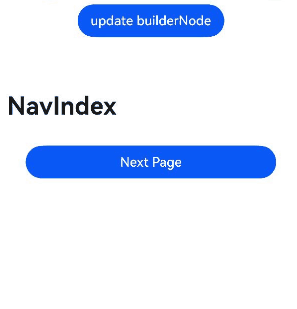

### BuilderNode常用冻结场景（状态管理V2）

从API version 22开始，在状态管理V2中，BuilderNode冻结开启方式和在状态管理V1中的开启方式一致，当BuilderNode节点开启冻结（即[inheritFreezeOptions](../reference/apis-arkui/js-apis-arkui-builderNode.md#inheritfreezeoptions20)设置为true）并继承父自定义组件的冻结策略时，如果父自定义组件的冻结策略设置为开启组件冻结（即freezeWhenInactive选项设为true），则BuilderNode节点在不活跃时将会冻结。当切换至活跃状态时，节点将解冻并使用缓存的数据进行更新。以下示例展示了几种状态管理V2常用的BuilderNode冻结场景。

**页面路由**

当BuilderNode节点开启冻结（即[inheritFreezeOptions](../reference/apis-arkui/js-apis-arkui-builderNode.md#inheritfreezeoptions20)设置为true）并且继承父自定义组件的冻结策略设置为开启组件冻结（即freezeWhenInactive选项设为true）时，页面1调用router.pushUrl接口跳转到页面2时，页面1为隐藏不可见状态，此时如果更新页面1中的状态变量，不会触发页面1刷新。图示如下：


页面1示例代码如下：

```ts
import { BuilderNode, FrameNode, NodeController } from '@kit.ArkUI';

@ObservedV2
export class Book {
  @Trace name: string = "100";
  constructor(name: string) {
    this.name = name;
  }
}

@Builder
function buildText(book: Book) {
  Column() {
    BuildNodeChild()
  }
}

class TextNodeController extends NodeController {
  private rootNode: FrameNode | null = null;
  private textNode: BuilderNode<[Book]> | null = null;
  index: number = 0;
  name: string = "100";

  makeNode(context: UIContext): FrameNode | null {
    this.rootNode = new FrameNode(context);
    this.textNode = new BuilderNode(context, { selfIdealSize: { width: 150, height: 150 } });
    this.textNode.build(wrapBuilder<[Book]>(buildText), new  Book (this.name));
    this.textNode.inheritFreezeOptions(true); // 设置BuilderNode的冻结继承状态为true。
    if (this.rootNode !== null) {
      this.rootNode.appendChild(this.textNode.getFrameNode()); // 将BuilderNode上树。
    }
    return this.rootNode;
  }
}

const textNodeController: TextNodeController = new TextNodeController();

@Entry
@ComponentV2({ freezeWhenInactive: true })
export struct Index3 {
  build() {
    Column() {
      NodeContainer(textNodeController)
    }
  }
}

@ComponentV2({ freezeWhenInactive: true })
struct BuildNodeChild {
  @Local bookTest: Book = new Book("A Midsummer Night’s Dream");

  @Monitor("bookTest.name")
  onMessageChange(monitor: IMonitor) {
    console.info(`The book name change from ${monitor.value()?.before} to ${monitor.value()?.now}`);
  }

  build() {
    Column() {
      Text(`Book name is  ${this.bookTest.name}`).fontSize(30)
      Button('change').width('60%').height(40).fontSize(30)
        .onClick(() => {
          this.bookTest.name = "The Old Man and the Sea";
        })
        .margin(5)
      Button('next').width('60%').height(40).fontSize(30)
        .onClick(() => {
          this.getUIContext().getRouter().pushUrl({ url: 'pages/routing' });
          setTimeout(() => {
            this.bookTest = new Book("Jane Austen's Pride and Prejudice");
          }, 1000)
        })
    }
  }
}
```

页面2-Routing2（即页面1的下一页）示例代码如下：

```ts
@Entry
@ComponentV2
struct Page2 {
  build() {
    Column() {
      Text(`This is the page2`).fontSize(25)
      Button('Back')
        .onClick(() => {
          this.getUIContext().getRouter().back();
        })
    }
  }
}
```


在上面的示例中：

在页面1中点击`change`按钮，bookTest变量的name属性改变，@Monitor中注册的方法onMessageChange会被调用。

在页面1中点击`next`按钮，跳转到页面2，然后延迟1s更新状态变量bookTest。在更新bookTest的时候，已经跳转到页面2，页面1处于inactive状态，@Local装饰的状态变量bookTest将不响应更新，其@Monitor不会调用，关联的节点不会刷新。

**TabContent**

当BuilderNode节点开启冻结（即[inheritFreezeOptions](../reference/apis-arkui/js-apis-arkui-builderNode.md#inheritfreezeoptions20)设置为true）并且继承父自定义组件的冻结策略设置为开启组件冻结（即freezeWhenInactive选项设为true）时，BuilderNode的子组件在不活跃时将会冻结，当切换至活跃状态时解冻。

在首次渲染的时候，Tabs只会创建当前正在显示的TabContent，当切换全部的TabContent后，TabContent才会被全部创建。

图示如下：


```ts
import { BuilderNode, FrameNode, NodeController } from '@kit.ArkUI';

class Params {
  message: number = 0;

  constructor( message: number) {
    this.message = message;
  }
}

@Builder
function buildText(params: Params) {
  Column() {
    buildNodeChild({ message: params.message});
  }
}

class TextNodeController extends NodeController {
  private rootNode: FrameNode | null = null;
  private textNode: BuilderNode<[Params]> | null = null;
  private message: number = 0;

  makeNode(context: UIContext): FrameNode | null {
    this.rootNode = new FrameNode(context);
    this.textNode = new BuilderNode(context, { selfIdealSize: { width: 150, height: 150 } });
    this.textNode.build(wrapBuilder<[Params]>(buildText), new Params(this.message));
    this.textNode.inheritFreezeOptions(true); // 设置BuilderNode的冻结继承状态为True。
    if (this.rootNode !== null) {
      this.rootNode.appendChild(this.textNode.getFrameNode()); // 将BuilderNode上树。
    }
    return this.rootNode;
  }

  update(): void {
    if (this.textNode !== null) {
      this.message += 1;
      this.textNode.update(new Params(this.message)); // 更新BuilderNode中的数据，可以触发Log。
    }
  }
}

const textNodeController: TextNodeController = new TextNodeController();

@Entry
@ComponentV2
struct TabContentTest {
  @Local message: number = 0;
  @Local index:number = 0;

  build() {
    Row() {
      Column() {
        Button('change message').onClick(() => {
          textNodeController.update();
        })
          .fontSize(25)
          .height(40)

        Tabs() {
          TabContent() {
            Column() {
              FreezeBuildNode({ message: this.message })
              Text('Tabs遍历后BuilderNode处于冻结')
                .fontWeight(FontWeight.Bold)
                .margin({ top: 48, bottom: 48 })
                .fontSize(30)
            }
          }.tabBar(`tab`+`${this.index}`)
          TabContent() {
            Column() {
              FreezeBuildNode({ message: this.message })
            }
          }.tabBar(`tab`+`${this.index+1}`)
        }
      }
      .width('100%')
    }
    .height('100%')
  }
}

@ComponentV2({ freezeWhenInactive: true })
struct FreezeBuildNode {
  @Param message: number = 0;
  @Param index: number = 0;
  @Monitor('message') onMessageUpdated(mon: IMonitor) {
    console.info(`FreezeBuildNode message callback func ${this.message}`);
  }
  build() {
    if (this.index === 0) {
      NodeContainer(textNodeController);
    }
  }
}

@ComponentV2({ freezeWhenInactive: true }) // BuilderNode下面的子组件开启冻结。
struct buildNodeChild {
  @Param message: number = 0;
  @Param index: number = 0;

  @Monitor('message') onMessageUpdated(mon: IMonitor) {
    console.info(`FreezeBuildNode buildNodeChild message callback func ${this.message}`);
  }

  build() {
    Text('message' + `${this.message}`)
      .fontSize(40)
      .fontWeight(FontWeight.Bold)
  }
}
```

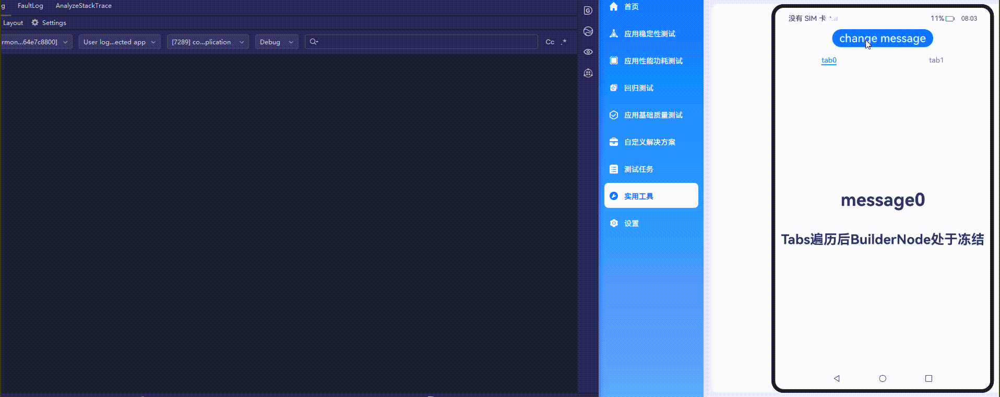

在上面的示例中：

1.点击`change message`更改message的值，当前正在显示的BuilderNode下面的子组件buildNodeChild的message属性会被更新，buildNodeChild组件中@Monitor注册的方法onMessageUpdated被触发。

2.点击`tab1`切换到另一个TabContent，该TabContent的状态由inactive变为active，对应的@Monitor注册的方法onMessageUpdated被触发。

3.点击`tab0`切换回第一个TabContent，再切换到其他TabContent后点击`change message`更改message的值，此时tab0冻结，tab0的@Monitor注册的方法onMessageUpdated不会被触发。

**Navigation**

Navigation组件的BuilderNode冻结功能（通过配置[inheritFreezeOptions](../reference/apis-arkui/js-apis-arkui-builderNode.md#inheritfreezeoptions20)为true）是组件冻结机制在导航场景下的延伸，核心作用是优化包含BuilderNode的Navigation组件在页面切换或状态更新时的性能，避免非活跃状态下的冗余计算和渲染。当BuilderNode所在的Navigation页面处于非活跃状态（如被切换到后台、隐藏在Tab页/侧边栏后等），系统会将其标记为 “冻结”。冻结状态下，该BuilderNode的子组件会暂停状态更新、事件响应和渲染刷新（如@State、@Prop等状态变化不会触发重新渲染，生命周期回调暂时失效）。通过配置[inheritFreezeOptions](../reference/apis-arkui/js-apis-arkui-builderNode.md#inheritfreezeoptions20)为true，BuilderNode会继承父组件（如Navigation）的冻结状态，确保其下的整个子组件树同步进入冻结状态，避免局部未冻结导致的性能浪费。

```ts
import { BuilderNode, FrameNode, NodeController } from '@kit.ArkUI';

class Params {
  count: number = 0;

  constructor(count: number) {
    this.count = count;
  }
}

@Builder
function buildText(params: Params) {

  Column() {
    TextBuilder({ message: params.count });
  }
}

class TextNodeController extends NodeController {
  private rootNode: FrameNode | null = null;
  private textNode: BuilderNode<[Params]> | null = null;
  private count: number = 0;

  makeNode(context: UIContext): FrameNode | null {
    this.rootNode = new FrameNode(context);
    this.textNode = new BuilderNode(context, { selfIdealSize: { width: 150, height: 150 } });
    this.textNode.build(wrapBuilder<[Params]>(buildText), new Params(this.count));
    this.textNode.inheritFreezeOptions(true); // 设置BuilderNode的冻结继承状态为True。
    if (this.rootNode !== null) {
      this.rootNode.appendChild(this.textNode.getFrameNode()); // 将BuilderNode上树。
    }
    return this.rootNode;
  }

  update(): void {
    if (this.textNode !== null) {
      this.count += 1;
      this.textNode.update(new Params(this.count)); // 更新BuilderNode中的数据，可以触发Log。
    }
  }
}

const textNodeController: TextNodeController = new TextNodeController();

@Entry
@ComponentV2
struct MyNavigationTestStack {
  @Provider('pageInfo') pageInfo: NavPathStack = new NavPathStack();
  @Local message: number = 0;
  @Local logNumber: number = 0;

  @Builder
  PageMap(name: string) {
    if (name === 'pageOne') {
      PageOneStack({ message: this.message, logNumber: this.logNumber })
    } else if (name === 'pageTwo') {
      PageTwoStack({ message: this.message, logNumber: this.logNumber })
    }
  }

  build() {
    Column() {
      Button('update builderNode') // 点击更新BuildrNode。
        .onClick(() => {
          textNodeController.update();
        })
      Navigation(this.pageInfo) {
        Column() {
          Button('Next Page', { stateEffect: true, type: ButtonType.Capsule })
            .width('80%')
            .height(40)
            .margin(20)
            .onClick(() => {
              this.pageInfo.pushPath({ name: 'pageOne' }); // 将name指定的NavDestination页面信息入栈。
            })
        }
      }.title('NavIndex')
      .navDestination(this.PageMap)
      .mode(NavigationMode.Stack)
    }
  }
}

@ComponentV2
struct PageOneStack {
  @Consumer('pageInfo') pageInfo: NavPathStack=new NavPathStack();
  @Local index: number = 1;
  @Param @Require  message: number;
  @Param @Require logNumber: number;

  build() {
    NavDestination() {
      Column() {
        NavigationContentMsgStack({ message: this.message, index: this.index, logNumber: this.logNumber })
        Button('Next Page', { stateEffect: true, type: ButtonType.Capsule })
          .width('80%')
          .height(40)
          .margin(20)
          .onClick(() => {
            this.pageInfo.pushPathByName('pageTwo', null);
          })
        Button('Back Page', { stateEffect: true, type: ButtonType.Capsule })
          .width('80%')
          .height(40)
          .margin(20)
          .onClick(() => {
            this.pageInfo.pop();
          })
      }.width('100%').height('100%')
    }.title('pageOne')
    .onBackPressed(() => {
      this.pageInfo.pop();
      return true;
    })
  }
}

@ComponentV2
struct PageTwoStack {
  @Consumer('pageInfo') pageInfo: NavPathStack=new NavPathStack();
  @Local index: number = 2;
  @Param @Require message: number;
  @Param @Require logNumber: number;

  build() {
    NavDestination() {
      Column() {
        NavigationContentMsgStack({ message: this.message, index: this.index, logNumber: this.logNumber })
        Text('BuilderNode处于冻结')
          .fontWeight(FontWeight.Bold)
          .margin({ top: 48, bottom: 48 })
        Button('Back Page', { stateEffect: true, type: ButtonType.Capsule })
          .width('80%')
          .height(40)
          .margin(20)
          .onClick(() => {
            this.pageInfo.pop();
          })
      }.width('100%').height('100%')
    }.title('pageTwo')
    .onBackPressed(() => {
      this.pageInfo.pop();
      return true;
    })
  }
}

@ComponentV2({ freezeWhenInactive: true }) // 设置冻结策略为不活跃冻结。
struct NavigationContentMsgStack {
  @Param @Require message: number;
  @Param @Require index: number;
  @Param @Require logNumber: number;

  build() {
    Column() {
      if (this.index === 1) {
        NodeContainer(textNodeController);
      }
    }
  }
}

@ComponentV2({ freezeWhenInactive: true }) // 设置冻结策略为不活跃冻结。
struct TextBuilder {
  @Param  message: number = 0;

  @Monitor('message')
  info() {
    console.info(` freeze-test TextBuilder message callback ${this.message}`); // 根据message内容变化来打印日志来判断是否冻结。
  }
  build() {
    Row() {
      Column() {
        Text(`文本更新次数： ${this.message}`)
          .fontWeight(FontWeight.Bold)
          .margin({ top: 48, bottom: 48 })
      }
    }
  }
}
```

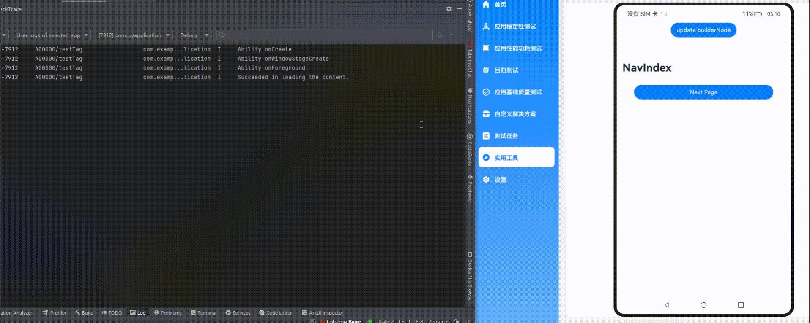

在上面的示例中：

1.进入Pageone页面，点击`update builderNode`按钮更改message的值，当前正在显示的BuilderNode下面的子组件TextBuilder组件中@Monitor注册的方法info被触发。

2.点击`Next Page`切换到PageTwo页面，点击`update builderNode`按钮，因为页面属于冻结状态，@Monitor注册的方法info不会被触发。

3.点击`Back Page`回到PageOne页面，因为在PageTwo页面时，message的值发生了变化，@Monitor注册的方法info被触发。

**Repeat**

Repeat组件（用于循环生成子组件）的BuilderNode冻结功能（通过设置BuilderNode的[inheritFreezeOptions](../reference/apis-arkui/js-apis-arkui-builderNode.md#inheritfreezeoptions20)为true启用），是组件冻结机制在循环列表场景下的具体应用，核心目的是优化列表中重复生成的子组件在非活跃状态下的性能，减少不必要的资源消耗。当BuilderNode生成的子组件处于非活跃状态（如列表项被滚动出屏幕、父组件进入冻结状态、或整个列表不可见时），系统会将该BuilderNode及其子组件树标记为“冻结”。冻结状态下，该BuilderNode对应的列表项会暂停状态更新（如@Local、@Param等状态变化不会触发重新渲染）、事件响应（如点击、滑动等事件暂时失效）和生命周期回调，避免后台无效计算。通过[inheritFreezeOptions](../reference/apis-arkui/js-apis-arkui-builderNode.md#inheritfreezeoptions20)设置为true，BuilderNode会继承Repeat父组件的冻结状态，确保循环生成的每个子组件都能同步遵循冻结规则，避免局部未冻结导致的性能浪费。

```ts
import { BuilderNode, FrameNode, NodeController, UIContext } from '@kit.ArkUI';

// 定义一个Params类，用于传递参数。
@ObservedV2
class Params {
  // 单例模式，确保只有一个Params实例。
  static singleton_: Params;

  // 获取Params实例的方法。
  static instance() {
    if (!Params.singleton_) {
      Params.singleton_ = new Params('');
    }
    return Params.singleton_;
  }

  // 使用@Trace装饰器装饰message、bgColor属性，以便跟踪其变化。
  @Trace message: string = '';
  @Trace bgColor: Color = Color.Pink;
  index: number = 0;

  constructor( message: string) {
    this. message = message;
  }
}

@Builder
function buildText(params: Params) {
  Column() {
    BuildNodeChild({ message: params.message });
  }
}

class TextNodeController extends NodeController {
  private textNode: BuilderNode<[Params]> | null = null;
  private message: string = '';
  // 构造函数接收一个message参数。
  constructor(message: string){
    super();
    this.message = message;
  }
  // 创建并返回一个FrameNode。
  makeNode(context: UIContext): FrameNode | null {
    this.textNode = new BuilderNode(context);
    this.textNode.build(wrapBuilder<[Params]>(buildText), new Params(this.message));
    this.textNode.inheritFreezeOptions(true); // BuilderNode开启冻结。
    return this.textNode.getFrameNode();
  }
}

@Entry
@ComponentV2
export struct RepeatVirtualScrollFreeze {
  @Local simpleList: Array<string> = [];
  storage: Params = Params.instance();

  aboutToAppear(): void {
    for (let i = 0; i < 7; i++) {
      this.simpleList.push(`item${i}`);
    }
  }

  build() {
    Column() {
      Button('Reduce length to 5').width('60%').height(40).fontSize(25)
        .onClick(() => {
          this.simpleList = this.simpleList.slice(0, 5);
        })
        .margin(5)
      Button('Change bgColor').width('60%').height(40).fontSize(25)
        .onClick(() => {
          this.storage.bgColor = this.storage.bgColor == Color.Pink ? Color.Yellow : Color.Pink;
        })

      List() {
        Repeat(this.simpleList)
          .each((obj: RepeatItem<string>) => {
          })
          .virtualScroll({ totalCount: this.simpleList.length })
          .templateId(() => 'a')
          .template('a', (ri) => {
            FreezeBuildNode({
              message: ri.item,
              bgColor: this.storage.bgColor
            })
          }, { cachedCount: 2 })
      }
      .cachedCount(0)
      .margin({top: 12, left: 180 })
    }
    .height('80%')
    .justifyContent(FlexAlign.Center)
    .margin({ top: 5 })
  }
}

// 开启组件冻结。
@ComponentV2({ freezeWhenInactive: true })
struct FreezeBuildNode {
  storage: Params = Params.instance();
  @Param @Require message: string ;
  @Param @Require bgColor: Color;
  @Monitor('storage.bgColor')
  onBgColorChange(monitor: IMonitor) {
    // bgColor改变时，缓存池中组件不刷新，不会打印日志。
    console.info(`repeat---bgColor change from ${monitor.value()?.before} to ${monitor.value()?.now}`);
  }
  build() {
    NodeContainer(new TextNodeController(this.message))
  }
}

@ComponentV2({ freezeWhenInactive: true })
struct BuildNodeChild {
  // 使用Params实例作为storage属性。
  storage: Params = Params.instance();
  @Param message: string = '';

  // 使用@Monitor装饰器监听storage.message的变化。
  @Monitor('storage.bgColor')
  onMessageChange(monitor: IMonitor) {
    console.info(`FreezeBuildNode buildNodeChild message callback func ${this.message}`);
  }

  build() {
    Text(`[a]: ${this.message}`)
      .fontSize(25)
      .backgroundColor(this.storage.bgColor)
      .margin(2)
  }
}

```

  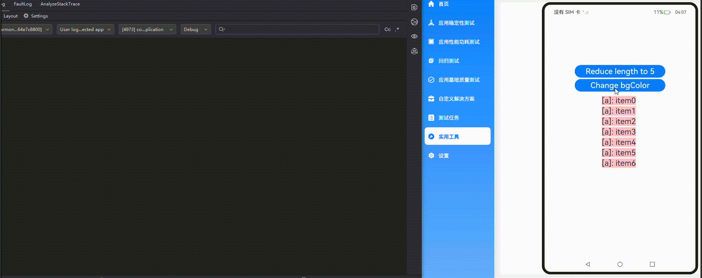

在上面的示例中：

点击`Reduce length to 5`后，被移除的两个组件会进入Repeat缓存池，然后点击`Change bgColor`更改bgColor的值触发节点刷新。

开启组件冻结（freezeWhenInactive: true）和BuilderNode节点开启冻结（即[inheritFreezeOptions](../reference/apis-arkui/js-apis-arkui-builderNode.md#inheritfreezeoptions20): true），只有剩余节点中@Monitor装饰的方法onMessageChange被触发，如示例中屏上的5个节点会刷新并打印BuilderNode子组件monitor的5条日志，缓存池中的节点则不会。

**Repeat和TabContent混用**

BuilderNode节点开启冻结功能（即通过设置[inheritFreezeOptions](../reference/apis-arkui/js-apis-arkui-builderNode.md#inheritfreezeoptions20)为true）后，支持与Repeat、TabContent等不同组件混合使用，示例如下：

```ts
import { BuilderNode, FrameNode, NodeController, UIContext } from '@kit.ArkUI';

// 定义一个Params类，用于传递参数。
@ObservedV2
class Params {
  // 单例模式，确保只有一个Params实例。
  static singleton_: Params;

  // 获取Params实例的方法。
  static instance() {
    if (!Params.singleton_) {
      Params.singleton_ = new Params(0);
    }
    return Params.singleton_;
  }

  // 使用@Trace装饰器装饰message属性，以便跟踪其变化。
  @Trace message: string = "Hello";
  index: number = 0;

  constructor(index: number) {
    this.index = index;
  }
}

// 定义一个buildNodeChild组件。
@ComponentV2({ freezeWhenInactive: true }) // BuilderNode下面的子组件开启冻结。
struct buildNodeChild {
  // 使用Params实例作为storage属性。
  storage: Params = Params.instance();
  @Param index: number = 0;

  // 使用@Monitor装饰器监听storage.message的变化。
  @Monitor("storage.message")
  onMessageChange(monitor: IMonitor) {
    console.info(`FreezeBuildNode buildNodeChild message callback func ${this.storage.message}, index:${this.index}`);
  }

  build() {
    Text(`buildNode Child message: ` +`\n` + `${this.storage.message}`).fontSize(30)
  }
}

// 定义一个buildText函数。
@Builder
function buildText(params: Params) {
  Column() {
    buildNodeChild({ index: params.index })
  }
}

class TextNodeController extends NodeController {
  private textNode: BuilderNode<[Params]> | null = null;
  private index: number = 0;

  // 构造函数接收一个index参数。
  constructor(index: number) {
    super();
    this.index = index;
  }

  // 创建并返回一个FrameNode。
  makeNode(context: UIContext): FrameNode | null {
    this.textNode = new BuilderNode(context);
    this.textNode.build(wrapBuilder<[Params]>(buildText), new Params(this.index));
    this.textNode.inheritFreezeOptions(true); // BuilderNode开启冻结。
    return this.textNode.getFrameNode();
  }
}

// 定义一个Index组件。
@Entry
@ComponentV2
export struct RepeatTab {
  // 使用Params实例作为storage属性。
  storage: Params = Params.instance();
  private data: number[] = [0, 1];

  build() {
    Row() {
      Column() {
        Button("change").width('80%').height(40).fontSize(30)
          .onClick(() => {
            this.storage.message += 'a';
          })

        Tabs() {
          // 使用Repeat重复渲染TabContent组件。
          Repeat<number>(this.data)
            .each((obj: RepeatItem<number>) => {
              TabContent() {
                FreezeBuildNode({ index: obj.item })
                  .margin({ top:20,bottom:5,left:5,right:5 })
              }.tabBar(`tab${obj.item}`)
            })
            .key((item: number) => item.toString())
        }
      }
    }
    .width('100%')
    .height('100%')
  }
}

// 定义一个FreezeBuildNode组件。
@ComponentV2({ freezeWhenInactive: true })
struct FreezeBuildNode {
  // 使用Params实例作为storage属性。
  storage: Params = Params.instance();
  @Param index: number = 0;

  // 使用@Monitor装饰器监听storage.message的变化。
  @Monitor("storage.message")
  onMessageChange(monitor: IMonitor) {
    console.info(`FreezeBuildNode message callback func ${this.storage.message}, index: ${this.index}`);
  }

  build() {
    NodeContainer(new TextNodeController(this.index))
      .width('100%')
      .height('100%')
  }
}
```

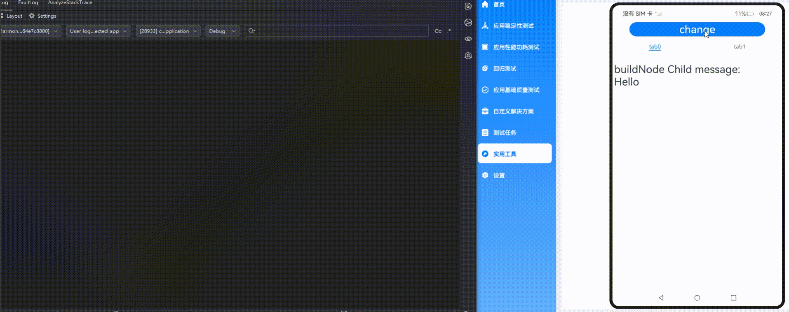

在上面的示例中：

1.点击`change`更改message的值，当前正在显示的BuilderNode下面的子组件buildNodeChild组件中@Monitor注册的方法onMessageUpdated被触发。

2.点击`tab1`切换到另外的TabContent，该TabContent的状态由inactive变为active，对应的BuilderNode下面的子组件buildNodeChild组件中@Monitor注册的方法onMessageUpdated被触发。

3.再次点击`change`更改message的值，仅当前显示的TabContent子组件中@Monitor注册的方法onMessageUpdated被触发。其他inactive的TabContent组件不会触发@Monitor。

## 设置BuilderNode支持内部@Consume接收外部的@Provide数据

从API version 20开始，通过配置BuildOptions参数，BuilderNode内部自定义组件的[@Consume](./state-management/arkts-provide-and-consume.md)支持接收所在页面的[@Provide](./state-management/arkts-provide-and-consume.md)数据。

参见[示例代码](../reference/apis-arkui/js-apis-arkui-builderNode.md#示例5buildernode支持内部consume接收外部的provide数据)。

## 设置BuilderNode支持内部@Consumer接收外部的@Provider数据

从API version 22开始，通过配置BuildOptions参数，BuilderNode内部自定义组件的[@Consumer](./state-management/arkts-new-provider-and-consumer.md)支持接收所在页面的[@Provider](./state-management/arkts-new-provider-and-consumer.md)数据。
    
参见[示例代码](../reference/apis-arkui/js-apis-arkui-builderNode.md#示例6buildernode支持内部consumer接收外部的provider数据)。

## BuilderNode结合ArkWeb组件实现预渲染页面

预渲染适用于Web页面启动与跳转等场景。通过结合BuilderNode，可以将ArkWeb组件提前进行离线预渲染，组件不会即时挂载至页面，而是在需要时通过NodeController动态挂载与显示。此举能够提高页面切换的流畅度及用户体验。

> **说明**
>
> 访问在线网页时需添加网络权限：ohos.permission.INTERNET，具体申请方式请参考[声明权限](../security/AccessToken/declare-permissions.md)。

1. 创建载体Ability，并创建Web组件。

    <!-- @[Web_createNWeb](https://gitcode.com/openharmony/applications_app_samples/blob/master/code/DocsSample/ArkUISample/BuilderNode/entry/src/main/ets/entryability/EntryAbility.ets) -->
    
    ``` TypeScript
    import { AbilityConstant, ConfigurationConstant, UIAbility,   Want } from '@kit.AbilityKit';
    import { createNWeb } from '../Common/CommonIndex';
    import { hilog } from '@kit.PerformanceAnalysisKit';
    import { window } from '@kit.ArkUI';
    
    const DOMAIN = 0x0000;
    
    export default class EntryAbility extends UIAbility {
    // ···
    
      onWindowStageCreate(windowStage: window.WindowStage): void {
        // Main window is created, set main page for this ability
        hilog.info(DOMAIN, 'testTag', '%{public}s', 'Ability onWindowStageCreate');
    
        windowStage.loadContent('pages/Index', (err) => {
          createNWeb('', windowStage.getMainWindowSync().getUIContext());
          if (err.code) {
            hilog.error(DOMAIN, 'testTag', 'Failed to load the content. Cause: %{public}s', JSON.stringify(err));
            return;
          }
          hilog.info(DOMAIN, 'testTag', 'Succeeded in loading the content.');
        });
      }
    // ···
    }
    ```

2. 创建NodeContainer和对应的NodeController，渲染后台Web组件。

    <!-- @[Common_CommonIndex](https://gitcode.com/openharmony/applications_app_samples/blob/master/code/DocsSample/ArkUISample/BuilderNode/entry/src/main/ets/Common/CommonIndex.ets) -->

    ``` TypeScript
    import { UIContext } from '@kit.ArkUI';
    import { webview } from '@kit.ArkWeb';
    import { NodeController, BuilderNode, Size, FrameNode } from '@kit.ArkUI';
    import { hilog } from '@kit.PerformanceAnalysisKit';

    // @Builder中为动态组件的具体组件内容。
    // Data为入参封装类。
    class Data{
      public url: string = '';
      public controller: WebviewController = new webview.WebviewController();
    }
    // 通过布尔变量shouldInactive控制网页在后台完成预渲染后停止渲染。
    let shouldInactive: boolean = true;
    @Builder
    function webBuilder(data:Data) {
      Column() {
        Web({ src: data.url, controller: data.controller })
          .onPageBegin(() => {
            // 调用onActive，开启渲染。
            data.controller.onActive();
          })
          .onFirstMeaningfulPaint(() =>{
            if (!shouldInactive) {
              return;
            }
            // 在预渲染完成时触发，停止渲染。
            data.controller.onInactive();
            shouldInactive = false;
          })
          .width('100%')
          .height('100%')
      }
    }
    let wrap = wrapBuilder<Data[]>(webBuilder);
    // 用于控制和反馈对应的NodeContainer上的节点的行为，需要与NodeContainer一起使用。
    export class MyNodeController2 extends NodeController {
      private rootnode: BuilderNode<Data[]> | null = null;
      // 必须要重写的方法，用于构建节点数、返回节点挂载在对应NodeContaine中。
      // 在对应NodeContainer创建的时候调用、或者通过rebuild方法调用刷新。
      makeNode(uiContext: UIContext): FrameNode | null {
        hilog.info(0xF811,'testTag','%{public}s',' uicontext is undefined :' + (uiContext === undefined));
        if (this.rootnode != null) {
          // 返回FrameNode节点。
          return this.rootnode.getFrameNode();
        }
        // 返回null控制动态组件脱离绑定节点。
        return null;
      }
      // 当布局大小发生变化时进行回调。
      aboutToResize(size: Size) {
        hilog.info(0xF811,'testTag','%{public}s','aboutToResize   width   : ' + size.width  +  ' height : ' + size.height );
      }
      // 当controller对应的NodeContainer在Appear的时候进行回调。
      aboutToAppear() {
        hilog.info(0xF811,'testTag','%{public}s','aboutToAppear');
        // 切换到前台后，不需要停止渲染。
        shouldInactive = false;
      }
      // 当controller对应的NodeContainer在Disappear的时候进行回调。
      aboutToDisappear() {
        hilog.info(0xF811,'testTag','%{public}s','aboutToDisappear');
      }
      // 此函数为自定义函数，可作为初始化函数使用。
      // 通过UIContext初始化BuilderNode，再通过BuilderNode中的build接口初始化@Builder中的内容。
      initWeb(url:string, uiContext:UIContext, control:WebviewController) {
        if(this.rootnode != null){
          return;
        }
        // 创建节点，需要uiContext。
        this.rootnode = new BuilderNode(uiContext);
        // 创建动态Web组件。
        this.rootnode.build(wrap, { url:url, controller:control });
      }
    }
    // 创建Map保存所需要的NodeController。
    let nodeMap:Map<string, MyNodeController2 | undefined> = new Map();
    // 创建Map保存所需要的WebViewController。
    let controllerMap:Map<string, WebviewController | undefined> = new Map();
    // 初始化需要UIContext 需在Ability获取。
    export const createNWeb = (url: string, uiContext: UIContext) => {
      // 创建NodeController。
      let baseNode = new MyNodeController2();
      let controller = new webview.WebviewController() ;
      // 初始化自定义Web组件。
      baseNode.initWeb(url, uiContext, controller);
      controllerMap.set(url, controller);
      nodeMap.set(url, baseNode);
    }
    // 自定义获取NodeController接口。
    export const getNWeb = (url : string) : MyNodeController2 | undefined => {
      return nodeMap.get(url);
    }
    ```

3. 通过NodeContainer使用已经预渲染的页面。

    <!-- @[Main_ArkWebPage](https://gitcode.com/openharmony/applications_app_samples/blob/master/code/DocsSample/ArkUISample/BuilderNode/entry/src/main/ets/pages/ArkWebPage.ets) -->

    ``` TypeScript
    // 使用NodeController的Page页。
    // pages/ArkWebPage.ets
    import { createNWeb, getNWeb } from '../Common/CommonIndex';

    @Entry
    @Component
    struct Index {
      build() {
        Row() {
          Column() {
            // NodeContainer用于与NodeController节点绑定，rebuild会触发makeNode。
            // Page页通过NodeContainer接口绑定NodeController，实现动态组件页面显示。
            NodeContainer(getNWeb(''))
              .height('90%')
              .width('100%')
              .id('ArkWebPage')
          }
          .width('100%')
        }
        .height('100%')
      }
    }
    ```
