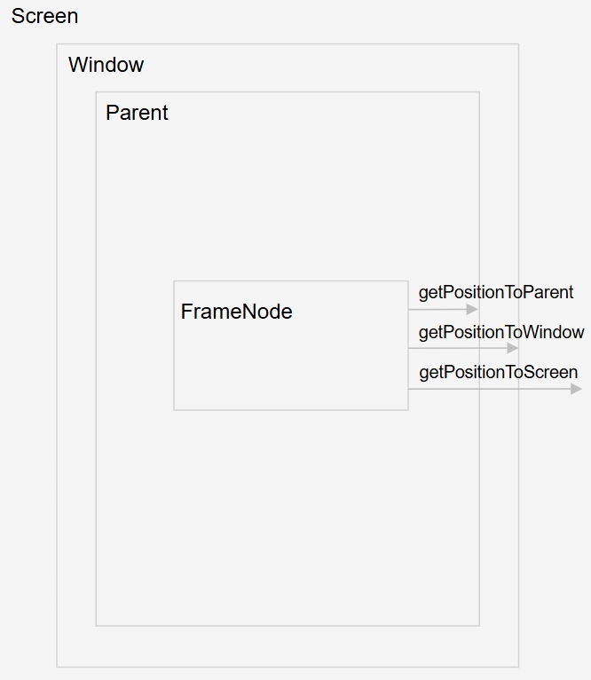
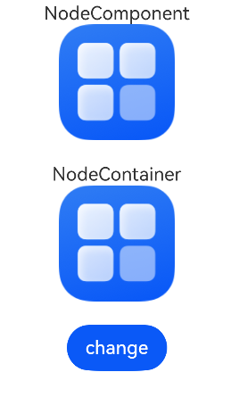

# 自定义组件节点 (FrameNode)
<!--Kit: ArkUI-->
<!--Subsystem: ArkUI-->
<!--Owner: @xiang-shouxing-->
<!--Designer: @xiang-shouxing-->
<!--Tester: @sally__-->
<!--Adviser: @Brilliantry_Rui-->

## 概述

对于拥有自定义前端的第三方框架（如JSON、XML、DOM树等），需将特定的DSL转换为ArkUI的声明式描述。如下图描述了JSON定义的前端框架和ArkUI声明式描述的对应关系。


上述转换过程需要依赖额外的数据驱动，绑定至[Builder](../ui/state-management/arkts-builder.md)中，较为复杂且性能欠佳。这类框架通常依赖于ArkUI的布局、事件处理、基础的节点操作和自定义能力。大部分组件通过自定义实现，但需结合使用部分系统组件以实现混合显示，如下图示例既使用了FrameNode的自定义方法进行绘制，又使用了系统组件Column及其子组件Text，通过BuilderNode的方式将其挂载到根节点的FrameNode上混合显示。


[FrameNode](../reference/apis-arkui/js-apis-arkui-frameNode.md)的设计初衷正是为了解决上述转换问题。FrameNode表示组件树中的实体节点，与自定义占位容器组件[NodeContainer](../reference/apis-arkui/arkui-ts/ts-basic-components-nodecontainer.md)相配合，实现在占位容器内构建一棵自定义的节点树。该节点树支持动态操作，如节点的增加、修改和删除。基础的FrameNode具备设置通用属性和事件回调的功能，同时提供完整的自定义能力，涵盖自定义测量、布局和绘制等方面。

除此之外，ArkUI还提供了获取和遍历系统组件对应代理FrameNode对象的能力（下文简称代理节点）。代理节点能够用于遍历整个UI的树形结构，支持获取系统组件节点的详细信息，以及额外注册组件的事件监听回调。

## 创建和删除节点

FrameNode提供了节点创建和删除的能力。可以通过FrameNode的构造函数创建自定义FrameNode节点，通过构造函数创建的节点对应一个实体的节点。同时，可以通过FrameNode中的[dispose](../reference/apis-arkui/js-apis-arkui-frameNode.md#dispose12)接口来实现与实体节点的绑定关系的解除。

> **说明：**
>
> - 在创建FrameNode对象的时候需要传入必选参数UIContext，若未传入UIContext对象或者传入不合法，则节点创建抛出异常。
>
> - 自定义占位组件将节点进行显示的时候需要保证UI上下文一致，否则会出现显示异常。
>
> - 若不持有FrameNode对象，则该对象会在GC的时候被回收。

## 判断节点是否可修改

[isModifiable](../reference/apis-arkui/js-apis-arkui-frameNode.md#ismodifiable12)用于查询当前节点类型是否为系统组件的代理节点。当FrameNode节点作为系统组件的代理节点的时候，该节点不可修改。即无法修改代理节点的自身属性以及其子节点的结构。

## 获取对应的RenderNode节点

FrameNode提供了[getRenderNode](../reference/apis-arkui/js-apis-arkui-frameNode.md#getrendernode)接口，用于获取FrameNode中的RenderNode。可以通过对获取到的RenderNode对象进行操作，动态修改FrameNode上绘制相关的属性，具体可修改的属性参考[RenderNode](../reference/apis-arkui/js-apis-arkui-renderNode.md)的接口。

> **说明：**
>
> - 无法获取系统组件代理FrameNode的RenderNode对象。
> 
> - BuilderNode中调用[getFrameNode](../reference/apis-arkui/js-apis-arkui-builderNode.md#getframenode)获取得到的FrameNode节点对象中，可以通过getRenderNode获取对应的根节点的RenderNode对象。

## 操作节点树

FrameNode提供了节点的增、删、查、改的能力，能够修改非代理节点的子树结构。可以对所有FrameNode的节点的父子节点做出查询操作，并返回查询结果。

> **说明：**
>
> 对节点进行增、删、改操作的时候，会对非法操作抛出异常信息。
>
> 通过查询获得的系统组件的代理节点，仅具备查询节点信息的作用，不具备修改节点属性的功能。代理节点不持有组件的实体节点，即不影响对应的节点的生命周期。
>
> 查询节点仅查询获得UI相关的节点，不返回语法节点。
>
> 使用自定义组件的场景下，可能查询获得自定义组件的新增节点，节点类型为“\_\_Common\_\_”。

<!-- @[frameNodeTree_start](https://gitcode.com/openharmony/applications_app_samples/blob/master/code/DocsSample/ArkUISample/FrameNode/entry/src/main/ets/pages/framenode/FrameNodeTree.ets) --> 

``` TypeScript
import { BuilderNode, FrameNode, NodeController, UIContext } from '@kit.ArkUI';
import { BusinessError } from '@kit.BasicServicesKit';
import { hilog } from '@kit.PerformanceAnalysisKit';

const TEST_TAG: string = 'FrameNode'

class Params {
  public text: string = 'this is a text'
}

@Builder
function buttonBuilder(params: Params) {
  Column({ space: 10 }) {
    Button(params.text)
      .fontSize(12)
      .borderRadius(8)
      .borderWidth(2)
      .backgroundColor(Color.Orange)

    Button(params.text)
      .fontSize(12)
      .borderRadius(8)
      .borderWidth(2)
      .backgroundColor(Color.Pink)
  }
}

class MyNodeController extends NodeController {
  public buttonNode: BuilderNode<[Params]> | null = null;
  public frameNode: FrameNode | null = null;
  public childList: Array<FrameNode> = new Array<FrameNode>();
  public rootNode: FrameNode | null = null;
  private uiContext: UIContext | null = null;
  private wrapBuilder: WrappedBuilder<[Params]> = wrapBuilder(buttonBuilder);

  makeNode(uiContext: UIContext): FrameNode | null {
    this.uiContext = uiContext;
    if (this.rootNode === null) {
      this.rootNode = new FrameNode(uiContext);
      this.rootNode.commonAttribute
        .width('50%')
        .height(100)
        .borderWidth(1)
        .backgroundColor(Color.Gray)
    }

    if (this.frameNode === null) {
      this.frameNode = new FrameNode(uiContext);
      this.frameNode.commonAttribute
        .width('100%')
        .height(50)
        .borderWidth(1)
        .position({ x: 200, y: 0 })
        .backgroundColor(Color.Pink);
      this.rootNode.appendChild(this.frameNode);
    }
    if (this.buttonNode === null) {
      this.buttonNode = new BuilderNode<[Params]>(uiContext);
      this.buttonNode.build(this.wrapBuilder, { text: 'This is a Button' })
      this.rootNode.appendChild(this.buttonNode.getFrameNode())
    }
    return this.rootNode;
  }

  operationFrameNodeWithFrameNode(frameNode: FrameNode | undefined | null) {
    if (frameNode) {
      hilog.info(0x0000, `${TEST_TAG} get ArkTSNode success.`, 'success')
      hilog.info(0x0000, `${TEST_TAG} check rootNode whether is modifiable ${frameNode.isModifiable()}`,
        'isModifiable');
    }
    if (this.uiContext) {
      let frameNode1 = new FrameNode(this.uiContext);
      let frameNode2 = new FrameNode(this.uiContext);
      frameNode1.commonAttribute.size({ width: 50, height: 50 })
        .backgroundColor(Color.Black)
        .position({ x: 50, y: 60 })
      frameNode2.commonAttribute.size({ width: 50, height: 50 })
        .backgroundColor(Color.Orange)
        .position({ x: 120, y: 60 })
      try {
        frameNode?.appendChild(frameNode1);
        hilog.info(0x0000, `${TEST_TAG} appendChild success`, 'success');
      } catch (err) {
        hilog.error(0x0000, `${TEST_TAG} appendChild fail :${(err as BusinessError).code}:
        ${(err as BusinessError).message}`, 'appendChild error');
      }
      try {
        frameNode?.insertChildAfter(frameNode2, null);
        hilog.info(0x0000, `${TEST_TAG} insertChildAfter success `, 'success');
      } catch (err) {
        hilog.error(0x0000, `${TEST_TAG} insertChildAfter fail :${(err as BusinessError).code}:
        ${(err as BusinessError).message}`, 'insertChildAfter error');
      }
      setTimeout(() => {
        try {
          frameNode?.removeChild(frameNode?.getChild(0))
          hilog.info(0x0000, `${TEST_TAG} removeChild success`, 'success');
        } catch (err) {
          hilog.error(0x0000, `${TEST_TAG} removeChild fail :${(err as BusinessError).code} :
          ${(err as BusinessError).message}`, 'removeChild error');
        }
      }, 2000)
      setTimeout(() => {
        try {
          frameNode?.clearChildren();
          hilog.info(0x0000, `${TEST_TAG} clearChildren success `, 'success');
        } catch (err) {
          hilog.error(0x0000, `${TEST_TAG} clearChildren fail: (err as BusinessError).code:
          ${(err as BusinessError).message}`, 'clearChildren error');
        }
      }, 4000)
    }
  }

  testInterfaceAboutSearch(frameNode: FrameNode | undefined | null): string {
    let result: string = '';
    if (frameNode) {
      result = result + `current node is ${frameNode.getNodeType()} \n`;
      result = result + `parent node is ${frameNode.getParent()?.getNodeType()} \n`;
      result = result + `child count is ${frameNode.getChildrenCount()} \n`;
      result = result + `first child node is ${frameNode.getFirstChild()?.getNodeType()} \n`;
      result = result + `second child node is ${frameNode.getChild(1)?.getNodeType()} \n`;
      result = result + `previousSibling node is ${frameNode.getPreviousSibling()?.getNodeType()} \n`;
      result = result + `nextSibling node is ${frameNode.getNextSibling()?.getNodeType()} \n`;
    }
    return result;
  }

  checkAppendChild(parent: FrameNode | undefined | null, child: FrameNode | undefined | null) {
    try {
      if (parent && child) {
        parent.appendChild(child);
        hilog.info(0x0000, `${TEST_TAG} appendChild success`, 'success');
      }
    } catch (err) {
      console.error(TEST_TAG + ' appendChild fail : ' + (err as BusinessError).code + ' : ' +
      (err as BusinessError).message);
    }
  }
}

@Entry
@Component
struct Index {
  @State index: number = 0;
  @State result: string = ''
  private myNodeController: MyNodeController = new MyNodeController();

  build() {
    Flex({ direction: FlexDirection.Column, alignItems: ItemAlign.Center, justifyContent: FlexAlign.SpaceBetween }) {
      List({ space: 20, initialIndex: 0 }) {
        ListItem() {
          Column({ space: 5 }) {
            /* 请将$r('app.string.Verify_The_Child_Node_Function_Of_FrameNode')替换为实际资源文件，
               在本示例中该资源文件的value值为"验证FrameNode子节点的增、删、改功能" */
            Text($r('app.string.Verify_The_Child_Node_Function_Of_FrameNode'))
            // 请将$r('app.string.Operate_On_Custom_FrameNode')替换为实际资源文件，在本示例中该资源文件的value值为"对自定义FrameNode进行操作"
            Button($r('app.string.Operate_On_Custom_FrameNode'))
              .fontSize(16)
              .width(400)
              .onClick(() => {
                // 对FrameNode节点进行增、删、改操作，正常实现。
                this.myNodeController.operationFrameNodeWithFrameNode(this.myNodeController?.frameNode);
              })
            /* 请将$r('app.string.Operate_On_Proxy_Nodes_In_BuilderNode')替换为实际资源文件，
               在本示例中该资源文件的value值为"对BuilderNode中的代理节点进行操作" */
            Button($r('app.string.Operate_On_Proxy_Nodes_In_BuilderNode'))
              .fontSize(16)
              .width(400)
              .onClick(() => {
                // 对BuilderNode代理节点进行增、删、改操作，捕获异常信息。
                this.myNodeController.operationFrameNodeWithFrameNode
                (this.myNodeController?.buttonNode?.getFrameNode());
              })
            /* 请将$r('app.string.Operate_On_Proxy_Nodes_In_System_Components')替换为实际资源文件，
               在本示例中该资源文件的value值为"对系统组件中的代理节点进行操作" */
            Button($r('app.string.Operate_On_Proxy_Nodes_In_System_Components'))
              .fontSize(16)
              .width(400)
              .onClick(() => {
                // 对代理节点进行增、删、改操作，捕获异常信息。
                this.myNodeController.operationFrameNodeWithFrameNode(this.myNodeController?.rootNode?.getParent());
              })
          }
        }

        ListItem() {
          Column({ space: 5 }) {
            /* 请将$r('app.string.Verify_Special_Scenarios_Of_FrameNode_Adding_Child_Nodes')替换为实际资源文件，
               在本示例中该资源文件的value值为"验证FrameNode添加子节点的特殊场景" */
            Text($r('app.string.Verify_Special_Scenarios_Of_FrameNode_Adding_Child_Nodes'))
            // 请将$r('app.string.Add_Proxy_Nodes_Of_BuilderNode')替换为实际资源文件，在本示例中该资源文件的value值为"新增BuilderNode的代理节点"
            Button($r('app.string.Add_Proxy_Nodes_Of_BuilderNode'))
              .fontSize(16)
              .width(400)
              .onClick(() => {
                let buttonNode = new BuilderNode<[Params]>(this.getUIContext());
                buttonNode.build(wrapBuilder<[Params]>(buttonBuilder), { text: 'BUTTON' })
                this.myNodeController.checkAppendChild(this.myNodeController?.frameNode, buttonNode?.getFrameNode());
              })
            // 请将$r('app.string.Add_Proxy_Nodes_Of_System_Components')替换为实际资源文件，在本示例中该资源文件的value值为"新增系统组件代理节点"
            Button($r('app.string.Add_Proxy_Nodes_Of_System_Components'))
              .fontSize(16)
              .width(400)
              .onClick(() => {
                this.myNodeController.checkAppendChild(this.myNodeController?.frameNode,
                  this.myNodeController?.rootNode?.getParent());
              })
            // 请将$r('app.string.Add_Custom_Nodes_With_Existing_Parent_Nodes')替换为实际资源文件，在本示例中该资源文件的value值为"新增已有父节点的自定义节点"
            Button($r('app.string.Add_Custom_Nodes_With_Existing_Parent_Nodes'))
              .fontSize(16)
              .width(400)
              .onClick(() => {
                this.myNodeController.checkAppendChild(this.myNodeController?.frameNode,
                  this.myNodeController?.rootNode);
              })
          }
        }

        ListItem() {
          Column({ space: 5 }) {
            // 请将$r('app.string.Verify_Query_Function_Of_FrameNode')替换为实际资源文件，在本示例中该资源文件的value值为"验证FrameNode节点的查询功能"
            Text($r('app.string.Verify_Query_Function_Of_FrameNode'))
            // 请将$r('app.string.Operate_On_Custom_FrameNode_Again')替换为实际资源文件，在本示例中该资源文件的value值为"对自定义FrameNode进行操作"
            Button($r('app.string.Operate_On_Custom_FrameNode_Again'))
              .fontSize(16)
              .width(400)
              .onClick(() => {
                // 对FrameNode节点进行进行查询。当前节点为NodeContainer的子节点。
                this.result = this.myNodeController.testInterfaceAboutSearch(this.myNodeController?.rootNode);
                setTimeout(() => {
                  // 对FrameNode节点进行进行查询。rootNode下的第一个子节点。
                  this.result = this.myNodeController.testInterfaceAboutSearch(this.myNodeController?.frameNode);
                }, 2000)
              })
            /* 请将$r('app.string.Operate_On_Proxy_Nodes_In_BuilderNode_Again')替换为实际资源文件，
               在本示例中该资源文件的value值为"对BuilderNode中的代理节点进行操作" */
            Button($r('app.string.Operate_On_Proxy_Nodes_In_BuilderNode_Again'))
              .fontSize(16)
              .width(400)
              .onClick(() => {
                // 对BuilderNode代理节点进行进行查询。当前节点为BuilderNode中的Column节点。
                this.result =
                  this.myNodeController.testInterfaceAboutSearch(this.myNodeController?.buttonNode?.getFrameNode());
              })
            /* 请将$r('app.string.Operate_On_Proxy_Nodes_In_System_Components_Again')替换为实际资源文件，
               在本示例中该资源文件的value值为"对系统组件中的代理节点进行操作" */
            Button($r('app.string.Operate_On_Proxy_Nodes_In_System_Components_Again'))
              .fontSize(16)
              .width(400)
              .onClick(() => {
                // 对代理节点进行查询。当前节点为NodeContainer。
                this.result =
                  this.myNodeController.testInterfaceAboutSearch(this.myNodeController?.rootNode?.getParent());
              })
          }
        }
      }.height('50%')

      Text(`Result：\n${this.result}`)
        .fontSize(16)
        .width(400)
        .height(200)
        .padding(30)
        .borderWidth(1)
      Column() {
        Text('This is a NodeContainer.')
          .textAlign(TextAlign.Center)
          .borderRadius(10)
          .backgroundColor(0xFFFFFF)
          .width('100%')
          .fontSize(16)
        NodeContainer(this.myNodeController)
          .borderWidth(1)
          .width(400)
          .height(150)
      }
    }
    .padding({
      left: 35,
      right: 35,
      top: 35,
      bottom: 35
    })
    .width('100%')
    .height('100%')
  }
}
```
## 使用moveTo移动命令式节点

使用[moveTo](../reference/apis-arkui/js-apis-arkui-frameNode.md#moveto18)接口可以将FrameNode节点移动到新的父节点下，从而按需改变节点树结构。

> **说明：**
>
> 当前FrameNode如果不可修改，抛出异常信息。
>
> 目标父节点为[typeNode](../reference/apis-arkui/js-apis-arkui-frameNode.md#typenode12)时会校验子组件类型或个数，不满足抛出异常信息，限制情况请查看[typeNode](../reference/apis-arkui/js-apis-arkui-frameNode.md#typenode12)描述。
>
> 当前不支持对无组件类型的命令式节点进行移动。
>
> 当前仅支持以下类型的[TypedFrameNode](../reference/apis-arkui/js-apis-arkui-frameNode.md#typedframenode12)进行移动操作：[Stack](../reference/apis-arkui/js-apis-arkui-frameNode.md#stack12)、[XComponent](../reference/apis-arkui/js-apis-arkui-frameNode.md#xcomponent12)。对于其他类型的节点，移动操作不会生效。
>
> 当前仅支持根节点为以下类型组件的[BuilderNode](../reference/apis-arkui/js-apis-arkui-builderNode.md#buildernode-1)进行移动操作：[Stack](../reference/apis-arkui/arkui-ts/ts-container-stack.md)、[XComponent](../reference/apis-arkui/arkui-ts/ts-basic-components-xcomponent.md)、[EmbeddedComponent](../reference/apis-arkui/arkui-ts/ts-container-embedded-component.md)。对于其他类型的组件，移动操作不会生效。

<!-- @[frameNodeMoveTo_start](https://gitcode.com/openharmony/applications_app_samples/blob/master/code/DocsSample/ArkUISample/FrameNode/entry/src/main/ets/pages/framenode/FrameNodeMoveTo.ets) --> 

``` TypeScript
import { FrameNode, NodeController, UIContext, typeNode } from '@kit.ArkUI';

class MyNodeController extends NodeController {
  public uiContext: UIContext | null = null;
  public rootNode: FrameNode | null = null;
  public rowNode: FrameNode | null = null;
  public stackNode1: FrameNode | null = null;
  public stackNode2: FrameNode | null = null;
  public stackNode3: FrameNode | null = null;

  makeNode(uiContext: UIContext): FrameNode | null {
    this.uiContext = uiContext;
    this.rootNode = new FrameNode(uiContext);

    const row = typeNode.createNode(this.uiContext, 'Row');
    row.initialize({ space: 10 });
    this.rowNode = row;
    this.rootNode.appendChild(this.rowNode);

    const stack1 = typeNode.createNode(this.uiContext, 'Stack');
    stack1.commonAttribute.width(50).height(50).backgroundColor(Color.Pink);
    this.stackNode1 = stack1;
    this.rowNode?.appendChild(this.stackNode1);
    const stack2 = typeNode.createNode(this.uiContext, 'Stack');
    stack2.commonAttribute.width(50).height(50).backgroundColor(Color.Yellow);
    this.stackNode2 = stack2;
    this.rowNode?.appendChild(this.stackNode2);
    const stack3 = typeNode.createNode(this.uiContext, 'Stack');
    stack3.commonAttribute.width(50).height(50).backgroundColor(Color.Green);
    this.stackNode3 = stack3;
    this.rowNode?.appendChild(this.stackNode3);

    return this.rootNode;
  }
}

@Entry
@Component
struct Index {
  private myNodeController1: MyNodeController = new MyNodeController()
  private myNodeController2: MyNodeController = new MyNodeController()

  build() {
    Column({ space: 20 }) {
      NodeContainer(this.myNodeController1)
      NodeContainer(this.myNodeController2)
      Button('move')
        .onClick(() => {
          this.myNodeController1.stackNode1?.moveTo(this.myNodeController2.rowNode, 2);
        })
    }
    .height('100%')
    .width('100%')
  }
}
``` 


## 设置节点通用属性和事件回调

FrameNode提供了[commonAttribute](../reference/apis-arkui/js-apis-arkui-frameNode.md#commonattribute12)和[commonEvent](../reference/apis-arkui/js-apis-arkui-frameNode.md#commonevent12)两个对象用于设置节点的[通用属性](../reference/apis-arkui/arkui-ts/ts-component-general-attributes.md)和[设置事件回调](../reference/apis-arkui/arkui-ts/ts-uicommonevent.md)。

> **说明：**
> 
> - 由于代理节点的属性不可修改，因此通过代理节点的commonAttribute修改节点的基础属性不生效。
> 
> - 设置的基础事件与系统组件定义的事件平行，参与事件竞争。设置的基础事件不覆盖系统组件事件。同时设置两个事件回调的时候，优先回调系统组件事件。

<!-- @[frameNodeCommon_start](https://gitcode.com/openharmony/applications_app_samples/blob/master/code/DocsSample/ArkUISample/FrameNode/entry/src/main/ets/pages/framenode/FrameNodeCommon.ets) --> 

``` TypeScript
import { BuilderNode, FrameNode, NodeController, UIContext } from '@kit.ArkUI';
import { hilog } from '@kit.PerformanceAnalysisKit';

class Params {
  public text: string = 'this is a text';
}

@Builder
function buttonBuilder(params: Params) {
  Button(params.text)
    .fontSize(12)
    .borderRadius(8)
    .borderWidth(2)
    .backgroundColor(Color.Orange)
    .onClick((event: ClickEvent) => {
      hilog.info(0x0000, `Button ${JSON.stringify(event)}`, 'isClicked');
    })
}

class MyNodeController extends NodeController {
  public buttonNode: BuilderNode<[Params]> | null = null;
  public frameNode: FrameNode | null = null;
  public rootNode: FrameNode | null = null;
  private wrapBuilder: WrappedBuilder<[Params]> = wrapBuilder(buttonBuilder);

  makeNode(uiContext: UIContext): FrameNode | null {
    if (this.rootNode === null) {
      this.rootNode = new FrameNode(uiContext);
      // 对rootNode进行属性修改，该节点为自定义的FrameNode节点，修改生效
      this.rootNode.commonAttribute
        .width('100%')
        .height(100)
        .borderWidth(1)
        .backgroundColor(Color.Gray)
    }

    if (this.frameNode === null) {
      this.frameNode = new FrameNode(uiContext);
      // 对frameNode进行属性修改，该节点为自定义的FrameNode节点，修改生效
      this.frameNode.commonAttribute
        .width('50%')
        .height(50)
        .borderWidth(1)
        .backgroundColor(Color.Pink);
      this.rootNode.appendChild(this.frameNode);
    }
    if (this.buttonNode === null) {
      this.buttonNode = new BuilderNode<[Params]>(uiContext);
      this.buttonNode.build(this.wrapBuilder, { text: 'This is a Button' });
      // 对BuilderNode中获取的FrameNode进行属性修改，该节点非自定义的FrameNode节点，修改不生效
      this.buttonNode?.getFrameNode()?.commonAttribute.position({ x: 100, y: 100 });
      this.rootNode.appendChild(this.buttonNode.getFrameNode());
    }
    return this.rootNode;
  }

  modifyNode(frameNode: FrameNode | null | undefined, sizeValue: SizeOptions, positionValue: Position) {
    if (frameNode) {
      frameNode.commonAttribute.size(sizeValue).position(positionValue);
    }
  }

  addClickEvent(frameNode: FrameNode | null | undefined) {
    if (frameNode) {
      frameNode.commonEvent.setOnClick((event: ClickEvent) => {
        console.info(`FrameNode ${JSON.stringify(event)}`);
      })
    }
  }
}

@Entry
@Component
struct Index {
  private myNodeController: MyNodeController = new MyNodeController();

  build() {
    Flex({ direction: FlexDirection.Column, alignItems: ItemAlign.Center, justifyContent: FlexAlign.SpaceBetween }) {
      Column({ space: 10 }) {
        // 请将$r('app.string.Modify_Node_Common_Properties_Width_And_Height')替换为实际资源文件，在本示例中该资源文件的value值为"修改节点通用属性-宽高"
        Text($r('app.string.Modify_Node_Common_Properties_Width_And_Height'))
        Button('modify ArkTS-FrameNode')
          .onClick(() => {
            // 获取到的是当前页面中的开发者创建的FrameNode对象，该节点可修改。即节点大小与位置。
            hilog.info(0x0000, `Check the weather the node can be modified ${this.myNodeController?.frameNode
            ?.isModifiable()}`, 'isClicked');
            this.myNodeController.modifyNode(this.myNodeController?.frameNode, { width: 150, height: 100 }, {
              x: 100,
              y: 0
            });
          })
        Button('modify FrameNode get by BuilderNode')
          .onClick(() => {
            // 获取到的是当前页面中的BuilderNode的根节点，该节点不可修改。即节点大小与位置未发生改变。
            hilog.info(0x0000, `Check the weather the node can be modified
            ${this.myNodeController?.buttonNode?.getFrameNode()
            ?.isModifiable()}`, 'isClicked');
            this.myNodeController.modifyNode(this.myNodeController?.buttonNode?.getFrameNode(), {
              width: 100,
              height: 100
            }, { x: 50, y: 50 });
          })
        Button('modify proxyFrameNode get by search')
          .onClick(() => {
            // rootNode调用getParent()获取到的是当前页面中的NodeContainer节点，该节点不可修改。即节点大小与位置未发生改变。
            hilog.info(0x0000,
              `Check the weather the node can be modified ${this.myNodeController?.rootNode?.getParent()
              ?.isModifiable()}`, 'isClicked');
            this.myNodeController.modifyNode(this.myNodeController?.rootNode?.getParent(), {
              width: 500,
              height: 500
            }, {
              x: 0,
              y: 0
            });
          })
      }
      .padding({
        left: 35,
        right: 35,
        top: 35,
        bottom: 35
      })

      Column({ space: 10 }) {
        // 请将$r('app.string.Modify_Node_Click_Event')替换为实际资源文件，在本示例中该资源文件的value值为"修改节点点击事件"
        Text($r('app.string.Modify_Node_Click_Event'))
        Button('add click event to ArkTS-FrameNode')
          .onClick(() => {
            // 获取到的是当前页面中的开发者创建的FrameNode对象，该节点可增加点击事件。
            // 增加的点击事件参与事件竞争，即点击事件会在该节点被消费且不不再向父组件冒泡。
            hilog.info(0x0000,
              `Check the weather the node can be modified ${this.myNodeController?.rootNode?.getParent()
              ?.isModifiable()}`, 'isClicked');
            this.myNodeController.addClickEvent(this.myNodeController?.frameNode);
          })
        Button('add click event to FrameNode get by BuilderNode')
          .onClick(() => {
            // 获取到的是当前页面中的BuilderNode的根节点，该类节点可增加点击事件。
            // 点击的时候优先回调通过系统组件接口设置的click事件回调，然后回调通过commonEvent增加的click监听。
            hilog.info(0x0000, `Check the weather the node can be modified
            ${this.myNodeController?.buttonNode?.getFrameNode()
            ?.isModifiable()}`, 'isClicked');
            this.myNodeController.addClickEvent(this.myNodeController?.buttonNode?.getFrameNode());
          })
        Button('add click event to proxyFrameNode get by search')
          .onClick(() => {
            // rootNode调用getParent()获取到的是当前页面中的NodeContainer节点，该类节点可增加点击事件。
            hilog.info(0x0000,
              `Check the weather the node can be modified ${this.myNodeController?.rootNode?.getParent()
              ?.isModifiable()}`, 'isClicked');
            this.myNodeController.addClickEvent(this.myNodeController?.rootNode?.getParent());
          })
      }
      .padding({
        left: 35,
        right: 35,
        top: 35,
        bottom: 35
      })

      NodeContainer(this.myNodeController)
        .borderWidth(1)
        .width('100%')
        .height(100)
        .onClick((event: ClickEvent) => {
          hilog.info(0x0000, `NodeContainer ${JSON.stringify(event)}`, 'isClicked');
        })
    }
    .padding({
      left: 35,
      right: 35,
      top: 35,
      bottom: 35
    })
    .width('100%')
    .height('100%')
  }
}
```
## 自定义测量布局与绘制

通过重写[onDraw](../reference/apis-arkui/js-apis-arkui-frameNode.md#ondraw12)方法，可以自定义FrameNode的绘制内容。[invalidate](../reference/apis-arkui/js-apis-arkui-frameNode.md#invalidate12)接口可以主动触发节点的重新绘制。

通过重写[onMeasure](../reference/apis-arkui/js-apis-arkui-frameNode.md#onmeasure12)可以自定义FrameNode的测量方式，使用[measure](../reference/apis-arkui/js-apis-arkui-frameNode.md#measure12)可以主动传递布局约束触发重新测量。

通过重写[onLayout](../reference/apis-arkui/js-apis-arkui-frameNode.md#onlayout12)方法可以自定义FrameNode的布局方式，使用[layout](../reference/apis-arkui/js-apis-arkui-frameNode.md#layout12)方法可以主动传递位置信息并触发重新布局。

[setNeedsLayout](../reference/apis-arkui/js-apis-arkui-frameNode.md#setneedslayout12)可以将当前节点标记，在下一帧触发重新布局。

> **说明：**
> 
> - 对节点进行dispose解引用后，由于FrameNode对象不再对应一个实体节点，invalidate无法触发原有绑定节点的刷新。
> 
> - 通过onDraw方法进行的自定义绘制，绘制内容大小无法超出组件大小。

<!-- @[frameNodeDraw_start](https://gitcode.com/openharmony/applications_app_samples/blob/master/code/DocsSample/ArkUISample/FrameNode/entry/src/main/ets/pages/framenode/FrameNodeDraw.ets) --> 

``` TypeScript

import { DrawContext, FrameNode, NodeController, Position, Size, UIContext, LayoutConstraint } from '@kit.ArkUI';
import { drawing } from '@kit.ArkGraphics2D';
import { hilog } from '@kit.PerformanceAnalysisKit';

function getChildLayoutConstraint(constraint: LayoutConstraint, child: FrameNode): LayoutConstraint {
  // 获取子节点用户设置的宽高
  const size = child.getUserConfigSize();

  // 计算子节点宽度
  const width = Math.max(
    Math.min(constraint.maxSize.width, size.width.value),
    constraint.minSize.width
  );

  // 计算子节点高度
  const height = Math.max(
    Math.min(constraint.maxSize.height, size.height.value),
    constraint.minSize.height
  );
  const finalSize: Size = { width, height };
  const res: LayoutConstraint = {
    maxSize: finalSize,
    minSize: finalSize,
    percentReference: finalSize
  };

  return res;
}

class MyFrameNode extends FrameNode {
  public width: number = 100;
  public offsetY: number = 0;
  private space: number = 1;
  private uiContext: UIContext;

  constructor(uiContext: UIContext) {
    super(uiContext);
    this.uiContext = uiContext;
  }

  // 重写布局测量方法
  onMeasure(constraint: LayoutConstraint): void {
    let sizeRes: Size = { width: this.uiContext.vp2px(100), height: this.uiContext.vp2px(100) };
    
    // 遍历所有子节点，计算总尺寸
    for (let i = 0; i < this.getChildrenCount(); i++) {
      let child = this.getChild(i);
      if (child) {
        let childConstraint = getChildLayoutConstraint(constraint, child);
        child.measure(childConstraint); // 触发子节点的测量
        let size = child.getMeasuredSize();
        sizeRes.height += size.height + this.space;
        sizeRes.width = Math.max(sizeRes.width, size.width);
      }
    }
    this.setMeasuredSize(sizeRes);
  }

  // 重写布局排列方法
  onLayout(position: Position): void {
    for (let i = 0; i < this.getChildrenCount(); i++) {
      let child = this.getChild(i);
      if (child) {
        child.layout({
          x: this.uiContext.vp2px(100),
          y: this.uiContext.vp2px(this.offsetY)
        });
        let layoutPosition = child.getLayoutPosition();
        hilog.info(0x0000, 'testTag', `child position: ${JSON.stringify(layoutPosition)}`);
      }
    }
    this.setLayoutPosition(position);
  }

  // 重写自定义绘制方法
  onDraw(context: DrawContext) {
    const canvas = context.canvas;
    const pen = new drawing.Pen();
    pen.setStrokeWidth(15);
    pen.setColor({
      alpha: 255,
      red: 255,
      green: 0,
      blue: 0
    });
    canvas.attachPen(pen);
    canvas.drawRect({
      left: 50,
      right: this.width + 50,
      top: 50,
      bottom: this.width + 50,
    });
    canvas.detachPen();
  }

  addWidth() {
    this.width = (this.width + 10) % 50 + 100;
  }
}

class MyNodeController extends NodeController {
  public rootNode: MyFrameNode | null = null;

  makeNode(context: UIContext): FrameNode | null {
    this.rootNode = new MyFrameNode(context);
    this.rootNode?.commonAttribute?.size({ width: 100, height: 100 }).backgroundColor(Color.Green);
    let frameNode: FrameNode = new FrameNode(context);
    this.rootNode.appendChild(frameNode);
    frameNode.commonAttribute.width(10).height(10).backgroundColor(Color.Pink);
    return this.rootNode;
  }
}

@Entry
@Component
struct Index {
  private nodeController: MyNodeController = new MyNodeController();

  build() {
    Row() {
      Column() {
        NodeContainer(this.nodeController)
          .width('100%')
          .height(200)
          .backgroundColor('#FFF0F0F0')

        // 触发节点重绘
        Button('Invalidate')
          .margin(10)
          .onClick(() => {
            this.nodeController?.rootNode?.addWidth();
            this.nodeController?.rootNode?.invalidate();
          })
        
        // 触发布局更新
        Button('UpdateLayout')
          .onClick(() => {
            let node = this.nodeController.rootNode;
            node!.offsetY = (node!.offsetY + 10) % 110;
            this.nodeController?.rootNode?.setNeedsLayout();
          })
      }
      .width('100%')
      .height('100%')
    }
    .height('100%')
  }
}
```
## 查找节点及获取基础信息

FrameNode提供了查询接口用于返回实体节点的基础信息。具体返回的信息内容参考FrameNode中提供的接口。

查找获得FrameNode的方式包括三种：

1. 使用[getFrameNodeById](../reference/apis-arkui/arkts-apis-uicontext-uicontext.md#getframenodebyid12)获取。

2. 使用[getFrameNodeByUniqueId](../reference/apis-arkui/arkts-apis-uicontext-uicontext.md#getframenodebyuniqueid12)获取。

3. 通过[无感监听](../reference/apis-arkui/js-apis-arkui-observer.md)获取。

> **说明：**
>
> 1、当前接口提供的可查询的信息包括：
>
> - 节点大小：[getMeasuredSize](../reference/apis-arkui/js-apis-arkui-frameNode.md#getmeasuredsize12)，[getUserConfigSize](../reference/apis-arkui/js-apis-arkui-frameNode.md#getuserconfigsize12)
> 
> - 布局信息：[getPositionToWindow](../reference/apis-arkui/js-apis-arkui-frameNode.md#getpositiontowindow12)，[getPositionToParent](../reference/apis-arkui/js-apis-arkui-frameNode.md#getpositiontoparent12)，[getLayoutPosition](../reference/apis-arkui/js-apis-arkui-frameNode.md#getlayoutposition12)，[getUserConfigBorderWidth](../reference/apis-arkui/js-apis-arkui-frameNode.md#getuserconfigborderwidth12)，[getUserConfigPadding](../reference/apis-arkui/js-apis-arkui-frameNode.md#getuserconfigpadding12)，[getUserConfigMargin](../reference/apis-arkui/js-apis-arkui-frameNode.md#getuserconfigmargin12)
> 
> - 节点信息：[getId](../reference/apis-arkui/js-apis-arkui-frameNode.md#getid12)，[getUniqueId](../reference/apis-arkui/js-apis-arkui-frameNode.md#getuniqueid12)，[getNodeType](../reference/apis-arkui/js-apis-arkui-frameNode.md#getnodetype12)，[getOpacity](../reference/apis-arkui/js-apis-arkui-frameNode.md#getopacity12)，[isVisible](../reference/apis-arkui/js-apis-arkui-frameNode.md#isvisible12)，[isClipToFrame](../reference/apis-arkui/js-apis-arkui-frameNode.md#iscliptoframe12)，[isAttached](../reference/apis-arkui/js-apis-arkui-frameNode.md#isattached12)，[getInspectorInfo](../reference/apis-arkui/js-apis-arkui-frameNode.md#getinspectorinfo12)，[getCustomProperty](../reference/apis-arkui/js-apis-arkui-frameNode.md#getcustomproperty12)
>
> 2、无法获取UINode类型节点，例如：JsView节点、[Span](../../application-dev/reference/apis-arkui/arkui-ts/ts-basic-components-span.md)、[ContainerSpan](../../application-dev/reference/apis-arkui/arkui-ts/ts-basic-components-containerspan.md)、[ContentSlot](../../application-dev/reference/apis-arkui/arkui-ts/ts-components-contentSlot.md)、[ForEach](../../application-dev/reference/apis-arkui/arkui-ts/ts-rendering-control-foreach.md)、[LazyForEach](../../application-dev/reference/apis-arkui/arkui-ts/ts-rendering-control-lazyforeach.md)、if/else组件等。

## 获取节点位置偏移信息

FrameNode提供了查询节点相对窗口、父组件以及屏幕位置偏移的信息接口（[getPositionToWindow](../reference/apis-arkui/js-apis-arkui-frameNode.md#getpositiontowindow12)，[getPositionToParent](../reference/apis-arkui/js-apis-arkui-frameNode.md#getpositiontoparent12)，[getPositionToScreen](../reference/apis-arkui/js-apis-arkui-frameNode.md#getpositiontoscreen12)，[getGlobalPositionOnDisplay](../reference/apis-arkui/js-apis-arkui-frameNode.md#getglobalpositionondisplay20)，[getPositionToWindowWithTransform](../reference/apis-arkui/js-apis-arkui-frameNode.md#getpositiontowindowwithtransform12)，[getPositionToParentWithTransform](../reference/apis-arkui/js-apis-arkui-frameNode.md#getpositiontoparentwithtransform12)，[getPositionToScreenWithTransform](../reference/apis-arkui/js-apis-arkui-frameNode.md#getpositiontoscreenwithtransform12)，[getLayoutPosition](../reference/apis-arkui/js-apis-arkui-frameNode.md#getlayoutposition12)，[getUserConfigBorderWidth](../reference/apis-arkui/js-apis-arkui-frameNode.md#getuserconfigborderwidth12)，[getUserConfigPadding](../reference/apis-arkui/js-apis-arkui-frameNode.md#getuserconfigpadding12)，[getUserConfigMargin](../reference/apis-arkui/js-apis-arkui-frameNode.md#getuserconfigmargin12)）。

[getPositionToWindow](../reference/apis-arkui/js-apis-arkui-frameNode.md#getpositiontowindow12)，[getPositionToParent](../reference/apis-arkui/js-apis-arkui-frameNode.md#getpositiontoparent12)，[getPositionToScreen](../reference/apis-arkui/js-apis-arkui-frameNode.md#getpositiontoscreen12)三个接口获取到的位置信息关系如下图所示：



<!-- @[frameNodePosition_start](https://gitcode.com/openharmony/applications_app_samples/blob/master/code/DocsSample/ArkUISample/FrameNode/entry/src/main/ets/pages/framenode/FrameNodePosition.ets) --> 

``` TypeScript
import { NodeController, FrameNode, UIContext } from '@kit.ArkUI';
import { hilog } from '@kit.PerformanceAnalysisKit';

const TEST_TAG: string = 'FrameNode'

class MyNodeController extends NodeController {
  public frameNode: FrameNode | null = null;
  private rootNode: FrameNode | null = null;

  makeNode(uiContext: UIContext): FrameNode | null {
    this.rootNode = new FrameNode(uiContext);
    this.frameNode = new FrameNode(uiContext);
    this.rootNode.appendChild(this.frameNode);
    return this.rootNode;
  }

  getPositionToWindow() {
    let positionToWindow = this.rootNode?.getPositionToWindow(); // 获取FrameNode相对于窗口的位置偏移
    hilog.info(0x0000, `${TEST_TAG} ${JSON.stringify(positionToWindow)}`, 'positionToWindow');
  }

  getPositionToParent() {
    let positionToParent = this.rootNode?.getPositionToParent(); // 获取FrameNode相对于父组件的位置偏移
    hilog.info(0x0000, `${TEST_TAG} ${JSON.stringify(positionToParent)}`, 'positionToParent');
  }

  getPositionToScreen() {
    let positionToScreen = this.rootNode?.getPositionToScreen(); // 获取FrameNode相对于屏幕的位置偏移
    hilog.info(0x0000, `${TEST_TAG} ${JSON.stringify(positionToScreen)}`, 'positionToScreen');
  }

  getGlobalPositionOnDisplay() {
    let positionOnGlobalDisplay = this.rootNode?.getGlobalPositionOnDisplay(); // 获取FrameNode相对于全局屏幕的位置偏移
    hilog.info(0x0000, `${TEST_TAG} ${JSON.stringify(positionOnGlobalDisplay)}`, 'positionOnGlobalDisplay');
  }

  getPositionToWindowWithTransform() {
    let positionToWindowWithTransform =
      this.rootNode?.getPositionToWindowWithTransform(); // 获取FrameNode相对于窗口带有绘制属性的位置偏移
    hilog.info(0x0000, `${TEST_TAG} ${JSON.stringify(positionToWindowWithTransform)}`, 'positionToWindowWithTransform');
  }

  getPositionToParentWithTransform() {
    let positionToParentWithTransform =
      this.rootNode?.getPositionToParentWithTransform(); // 获取FrameNode相对于父组件带有绘制属性的位置偏移
    hilog.info(0x0000, `${TEST_TAG} ${JSON.stringify(positionToParentWithTransform)}`, 'positionToParentWithTransform');
  }

  getPositionToScreenWithTransform() {
    let positionToScreenWithTransform =
      this.rootNode?.getPositionToScreenWithTransform(); // 获取FrameNode相对于屏幕带有绘制属性的位置偏移
    hilog.info(0x0000, `${TEST_TAG} ${JSON.stringify(positionToScreenWithTransform)}`, 'positionToScreenWithTransform');
  }
}

@Entry
@Component
struct Index {
  private myNodeController: MyNodeController = new MyNodeController();

  build() {
    Flex({ direction: FlexDirection.Column, alignItems: ItemAlign.Center, justifyContent: FlexAlign.SpaceBetween }) {
      Button('getPositionToWindow')
        .width(300)
        .onClick(() => {
          this.myNodeController.getPositionToWindow();
        })
      Button('getPositionToParent')
        .width(300)
        .onClick(() => {
          this.myNodeController.getPositionToParent();
        })
      Button('getPositionToScreen')
        .width(300)
        .onClick(() => {
          this.myNodeController.getPositionToScreen();
        })
      Button('getGlobalPositionOnDisplay')
        .width(300)
        .onClick(() => {
          this.myNodeController.getGlobalPositionOnDisplay();
        })
      Button('getPositionToParentWithTransform')
        .width(300)
        .onClick(() => {
          this.myNodeController.getPositionToParentWithTransform();
        })
      Button('getPositionToWindowWithTransform')
        .width(300)
        .onClick(() => {
          this.myNodeController.getPositionToWindowWithTransform();
        })
      Button('getPositionToScreenWithTransform')
        .width(300)
        .onClick(() => {
          this.myNodeController.getPositionToScreenWithTransform();
        })
      Column() {
        Text('This is a NodeContainer.')
          .textAlign(TextAlign.Center)
          .borderRadius(10)
          .backgroundColor(0xFFFFFF)
          .width('100%')
          .fontSize(16)
        NodeContainer(this.myNodeController)
          .borderWidth(1)
          .width(300)
          .height(100)
      }
    }
    .padding({
      left: 35,
      right: 35,
      top: 35,
      bottom: 35
    })
    .width('100%')
    .height('100%')
  }
}
```
## 通过typeNode创建具体类型的FrameNode节点

通过TypeNode创建具体类型的FrameNode节点，可以根据属性获取接口来检索用户设置的属性信息。

<!-- @[frameNodeTypeNode_start](https://gitcode.com/openharmony/applications_app_samples/blob/master/code/DocsSample/ArkUISample/FrameNode/entry/src/main/ets/pages/framenode/FrameNodeTypeNode.ets) --> 

``` TypeScript
import { NodeController, FrameNode, UIContext, BuilderNode, typeNode } from '@kit.ArkUI';
import { hilog } from '@kit.PerformanceAnalysisKit';

class Params {
  text: string = '';

  constructor(text: string) {
    this.text = text;
  }
}

@Builder
function buildText(params: Params) {
  Column() {
    Text(params.text)
      .id('buildText')
      .border({ width: 1 })
      .padding(1)
      .fontSize(25)
      .fontWeight(FontWeight.Bold)
      .margin({ top: 10 })
      .visibility(Visibility.Visible)
      .opacity(0.7)
      .customProperty('key1', 'value1')
      .width(300)
  }
}

const TEST_TAG: string = 'FrameNode'

class MyNodeController extends NodeController {
  public frameNode: typeNode.Column | null = null;
  public uiContext: UIContext | undefined = undefined;
  private rootNode: FrameNode | null = null;
  private textNode: BuilderNode<[Params]> | null = null;
  public textTypeNode: typeNode.Text | null = null;
  private message: string = 'DEFAULT';

  makeNode(uiContext: UIContext): FrameNode | null {
    this.rootNode = new FrameNode(uiContext);
    this.uiContext = uiContext;
    this.frameNode = typeNode.createNode(uiContext, 'Column');
    this.frameNode.attribute
      .width('100%')
      .height('100%')
    this.rootNode.appendChild(this.frameNode);
    this.textNode = new BuilderNode(uiContext);
    this.textNode.build(wrapBuilder<[Params]>(buildText), new Params(this.message));
    this.frameNode.appendChild(this.textNode.getFrameNode());
    this.textTypeNode = typeNode.createNode(uiContext, 'Text');
    this.textTypeNode.initialize('textTypeNode')
      .fontSize(25)
      .visibility(Visibility.Visible)
      .id('textTypeNode')
    this.frameNode.appendChild(this.textTypeNode);
    return this.rootNode;
  }

  removeChild(frameNode: FrameNode) {
    let parent = frameNode.getParent();
    if (parent) {
      parent.removeChild(frameNode);

    }
  }

  getUserConfigBorderWidth(frameNode: FrameNode) {
    let userConfigBorderWidth = frameNode?.getUserConfigBorderWidth(); // 获取用户设置的边框宽度
    hilog.info(0x0000, `${TEST_TAG} ${JSON.stringify(userConfigBorderWidth)}`, 'userConfigBorderWidth');
  }

  getUserConfigPadding(frameNode: FrameNode) {
    let userConfigPadding = frameNode?.getUserConfigPadding(); // 获取用户设置的内边距
    hilog.info(0x0000, `${TEST_TAG} ${JSON.stringify(userConfigPadding)}`, 'userConfigPadding');
  }

  getUserConfigMargin(frameNode: FrameNode) {
    let userConfigMargin = frameNode?.getUserConfigMargin(); // 获取用户设置的外边距
    hilog.info(0x0000, `${TEST_TAG} ${JSON.stringify(userConfigMargin)}`, 'userConfigMargin');
  }

  getUserConfigSize(frameNode: FrameNode) {
    let userConfigSize = frameNode?.getUserConfigSize(); // 获取用户设置的宽高
    hilog.info(0x0000, `${TEST_TAG} ${JSON.stringify(userConfigSize)}`, 'userConfigSize');
  }

  getId(frameNode: FrameNode) {
    let id = frameNode?.getId(); // 获取用户设置的节点ID
    hilog.info(0x0000, `${TEST_TAG} ${id}`, 'getId');
  }

  getUniqueId(frameNode: FrameNode) {
    let uniqueId = frameNode?.getUniqueId(); // 获取系统分配的唯一标识的节点UniqueID
    hilog.info(0x0000, `${TEST_TAG} ${uniqueId}`, 'uniqueId');
  }

  getNodeType(frameNode: FrameNode) {
    let nodeType = frameNode?.getNodeType(); // 获取节点的类型
    hilog.info(0x0000, `${TEST_TAG} ${nodeType}`, 'nodeType');
  }

  getOpacity(frameNode: FrameNode) {
    let opacity = frameNode?.getOpacity(); // 获取节点的不透明度
    hilog.info(0x0000, `${TEST_TAG} ${JSON.stringify(opacity)}`, 'opacity');
  }

  isVisible(frameNode: FrameNode) {
    let visible = frameNode?.isVisible(); // 获取节点是否可见
    hilog.info(0x0000, `${TEST_TAG} ${JSON.stringify(visible)}`, 'visible');
  }

  isClipToFrame(frameNode: FrameNode) {
    let clipToFrame = frameNode?.isClipToFrame(); // 获取节点是否是剪裁到组件区域
    hilog.info(0x0000, `${TEST_TAG} ${JSON.stringify(clipToFrame)}`, 'clipToFrame');
  }

  isAttached(frameNode: FrameNode) {
    let attached = frameNode?.isAttached(); // 获取节点是否被挂载到主节点树上
    hilog.info(0x0000, `${TEST_TAG} ${JSON.stringify(attached)}`, 'attached');
  }

  getInspectorInfo(frameNode: FrameNode) {
    let inspectorInfo = frameNode?.getInspectorInfo(); // 获取节点的结构信息
    hilog.info(0x0000, `${TEST_TAG} ${JSON.stringify(inspectorInfo)}`, 'inspectorInfo');
  }
}

@Entry
@Component
struct Index {
  private myNodeController: MyNodeController = new MyNodeController();
  @State index: number = 0;

  build() {
    Flex({ direction: FlexDirection.Column, alignItems: ItemAlign.Center, justifyContent: FlexAlign.SpaceBetween }) {
      Column() {
        Text('This is a NodeContainer.')
          .textAlign(TextAlign.Center)
          .borderRadius(10)
          .backgroundColor(0xFFFFFF)
          .width('100%')
          .fontSize(16)
        NodeContainer(this.myNodeController)
          .borderWidth(1)
          .width(300)
          .height(100)
      }

      Button('getUserConfigBorderWidth')
        .width(300)
        .onClick(() => {
          const uiContext: UIContext = this.getUIContext();
          if (uiContext) {
            const node: FrameNode | null = uiContext.getFrameNodeById('buildText') || null;
            if (node) {
              this.myNodeController.getUserConfigBorderWidth(node);
            }
          }
        })
      Button('getUserConfigPadding')
        .width(300)
        .onClick(() => {
          const uiContext: UIContext = this.getUIContext();
          if (uiContext) {
            const node: FrameNode | null = uiContext.getFrameNodeById('buildText') || null;
            if (node) {
              this.myNodeController.getUserConfigPadding(node);
            }
          }
        })
      Button('getUserConfigMargin')
        .width(300)
        .onClick(() => {
          const uiContext: UIContext = this.getUIContext();
          if (uiContext) {
            const node: FrameNode | null = uiContext.getFrameNodeById('buildText') || null;
            if (node) {
              this.myNodeController.getUserConfigMargin(node);
            }
          }
        })
      Button('getUserConfigSize')
        .width(300)
        .onClick(() => {
          const uiContext: UIContext = this.getUIContext();
          if (uiContext) {
            const node: FrameNode | null = uiContext.getFrameNodeById('buildText') || null;
            if (node) {
              this.myNodeController.getUserConfigSize(node);
            }
          }
        })
      Button('getId')
        .width(300)
        .onClick(() => {
          const uiContext: UIContext = this.getUIContext();
          if (uiContext) {
            const node: FrameNode | null = uiContext.getFrameNodeById('buildText') || null;
            if (node) {
              this.myNodeController.getId(node);
            }
          }
        })
      Button('getUniqueId')
        .width(300)
        .onClick(() => {
          const uiContext: UIContext = this.getUIContext();
          if (uiContext) {
            const node: FrameNode | null = uiContext.getFrameNodeById('buildText') || null;
            if (node) {
              this.myNodeController.getUniqueId(node);
            }
          }
        })
      Button('getNodeType')
        .width(300)
        .onClick(() => {
          const uiContext: UIContext = this.getUIContext();
          if (uiContext) {
            const node: FrameNode | null = uiContext.getFrameNodeById('buildText') || null;
            if (node) {
              this.myNodeController.getNodeType(node);
            }
          }
        })
      Button('getOpacity')
        .width(300)
        .onClick(() => {
          const uiContext: UIContext = this.getUIContext();
          if (uiContext) {
            const node: FrameNode | null = uiContext.getFrameNodeById('buildText') || null;
            if (node) {
              this.myNodeController.getOpacity(node);
            }
          }
        })
      Button('isVisible')
        .width(300)
        .onClick(() => {
          const uiContext: UIContext = this.getUIContext();
          if (uiContext) {
            const node: FrameNode | null = uiContext.getFrameNodeById('buildText') || null;
            if (node) {
              this.myNodeController.isVisible(node);
            }
          }
        })
      Button('isClipToFrame')
        .width(300)
        .onClick(() => {
          const uiContext: UIContext = this.getUIContext();
          if (uiContext) {
            const node: FrameNode | null = uiContext.getFrameNodeById('buildText') || null;
            if (node) {
              this.myNodeController.isClipToFrame(node);
            }
          }
        })
      Button('isAttached')
        .width(300)
        .onClick(() => {
          const uiContext: UIContext = this.getUIContext();
          if (uiContext) {
            const node: FrameNode | null = uiContext.getFrameNodeById('buildText') || null;
            if (node) {
              this.myNodeController.isAttached(node);
            }
          }
        })
      Button('remove Text')
        .width(300)
        .onClick(() => {
          const uiContext: UIContext = this.getUIContext();
          if (uiContext) {
            const node: FrameNode | null = uiContext.getFrameNodeById('textTypeNode') || null;
            if (node) {
              this.myNodeController.removeChild(node);
              this.myNodeController.isAttached(node);
            }
          }
        })
      Button('getInspectorInfo')
        .width(300)
        .onClick(() => {
          const uiContext: UIContext = this.getUIContext();
          if (uiContext) {
            const node: FrameNode | null = uiContext.getFrameNodeById('buildText') || null;
            if (node) {
              this.myNodeController.getInspectorInfo(node);
            }
          }
        })
      Button('getCustomProperty')
        .width(300)
        .onClick(() => {
          const uiContext: UIContext = this.getUIContext();
          if (uiContext) {
            const node: FrameNode | null = uiContext.getFrameNodeById('buildText') || null;
            if (node) {
              const property = node.getCustomProperty('key1');
              hilog.info(0x0000, TEST_TAG, JSON.stringify(property));
            }
          }
        })
    }
    .padding({
      left: 35,
      right: 35,
      top: 35,
      bottom: 35
    })
    .width('100%')
    .height('100%')
  }
}
```
## 解除当前FrameNode对象对实体FrameNode节点的引用关系

使用[dispose](../reference/apis-arkui/js-apis-arkui-frameNode.md#dispose12)接口可以立即解除当前FrameNode对象对实体FrameNode节点的引用关系。

> **说明：**
>
> 在调用dispose方法后，FrameNode对象不再对应任何实际的FrameNode节点。此时，若尝试调用以下查询接口：getMeasuredSize、getLayoutPosition、getUserConfigBorderWidth、getUserConfigPadding、getUserConfigMargin、getUserConfigSize，将导致应用程序触发[jscrash](../ui/arkts-stability-guide.md#jscrash)。
>
> 通过[getUniqueId](../reference/apis-arkui/js-apis-arkui-frameNode.md#getuniqueid12)可以判断当前FrameNode是否对应一个实体FrameNode节点。当UniqueId大于0时表示该对象对应一个实体FrameNode节点。

<!-- @[frameNodeDisposed_start](https://gitcode.com/openharmony/applications_app_samples/blob/master/code/DocsSample/ArkUISample/FrameNode/entry/src/main/ets/pages/framenode/FrameNodeDisposed.ets) --> 

``` TypeScript
import { NodeController, FrameNode, BuilderNode } from '@kit.ArkUI';
import { hilog } from '@kit.PerformanceAnalysisKit';

const TEST_TAG: string = 'FrameNode';

@Component
struct TestComponent {
  build() {
    Column() {
      Text('This is a BuilderNode.')
        .fontSize(16)
        .fontWeight(FontWeight.Bold)
    }
    .width('100%')
    .backgroundColor(Color.Gray)
  }

  aboutToAppear() {
    console.error(TEST_TAG + ' aboutToAppear');
  }

  aboutToDisappear() {
    console.error(TEST_TAG + ' aboutToDisappear');
  }
}

@Builder
function buildComponent() {
  TestComponent()
}

class MyNodeController extends NodeController {
  private rootNode: FrameNode | null = null;
  private builderNode: BuilderNode<[]> | null = null;

  // 创建并初始化自定义节点树
  makeNode(uiContext: UIContext): FrameNode | null {
    this.rootNode = new FrameNode(uiContext);
    this.builderNode = new BuilderNode(uiContext, { selfIdealSize: { width: 200, height: 100 } });
    this.builderNode.build(new WrappedBuilder(buildComponent));

    const rootRenderNode = this.rootNode.getRenderNode();
    if (rootRenderNode !== null) {
      rootRenderNode.size = { width: 200, height: 200 };
      rootRenderNode.backgroundColor = 0xff00ff00;
      rootRenderNode.appendChild(this.builderNode!.getFrameNode()!.getRenderNode());
    }

    return this.rootNode;
  }

  // 打印节点的唯一ID
  printUniqueId(): void {
    if (this.rootNode !== null && this.builderNode !== null) {
      hilog.info(0x0000, `${TEST_TAG} rootNode's uniqueId: ${this.rootNode.getUniqueId()}`, 'isClicked');
      const frameNode = this.builderNode.getFrameNode();
      if (frameNode) {
        hilog.info(0x0000, `${TEST_TAG} the uniqueId of builderNode's framenode: ${frameNode.getUniqueId()}`,
          'isClicked');
      } else {
        hilog.info(0x0000, `${TEST_TAG} builderNode's framenode is undefined`, 'isClicked');
      }
    }
  }

  // 销毁所有自定义节点
  disposeFrameNode(): void {
    if (this.rootNode !== null && this.builderNode !== null) {
      hilog.info(0x0000, `${TEST_TAG} disposeFrameNode`, 'isCLicked');
      this.rootNode.removeChild(this.builderNode.getFrameNode());
      this.builderNode.dispose();

      this.rootNode.dispose();
    }
  }

  removeBuilderNode(): void {
    const rootRenderNode = this.rootNode!.getRenderNode();
    if (rootRenderNode !== null && this.builderNode !== null && this.builderNode.getFrameNode() !== null) {
      // 从根渲染节点中移除BuilderNode的渲染节点
      rootRenderNode.removeChild(this.builderNode!.getFrameNode()!.getRenderNode());
    }
  }
}

@Entry
@Component
struct Index {
  private myNodeController: MyNodeController = new MyNodeController();

  build() {
    Column({ space: 4 }) {
      NodeContainer(this.myNodeController)
      Button('FrameNode dispose')
        .onClick(() => {
          this.myNodeController.printUniqueId();
          this.myNodeController.disposeFrameNode(); // 执行节点销毁
          this.myNodeController.printUniqueId();
        })
        .width('100%')
    }
  }
}
```
## 查询当前FrameNode是否解除引用

前端节点均绑定有相应的后端实体节点，当节点调用dispose接口解除绑定后，再次调用接口可能会出现crash、返回默认值的情况。

从API version 20开始，使用[isDisposed](../reference/apis-arkui/js-apis-arkui-frameNode.md#isdisposed20)接口查询当前FrameNode对象是否已解除与后端实体节点的引用关系，从而可以在操作节点前检查其有效性，避免潜在风险。

<!-- @[frameNodeDisposed_start](https://gitcode.com/openharmony/applications_app_samples/blob/master/code/DocsSample/ArkUISample/FrameNode/entry/src/main/ets/pages/framenode/FrameNodeIsDisposed.ets) --> 

``` TypeScript
import { NodeController, FrameNode } from '@kit.ArkUI';

class MyNodeController extends NodeController {
  private rootNode: FrameNode | null = null;

  makeNode(uiContext: UIContext): FrameNode | null {
    this.rootNode = new FrameNode(uiContext);
    this.rootNode.commonAttribute.width(100)
      .height(100)
      .backgroundColor(Color.Pink);

    return this.rootNode;
  }

  disposeFrameNode() {
    // 解除当前FrameNode对象对实体FrameNode节点的引用关系
    this.rootNode?.dispose();
  }

  isDisposed(): string {
    if (this.rootNode !== null) {
      // 查询FrameNode是否解除引用
      if (this.rootNode.isDisposed()) {
        return 'frameNode isDisposed is true';
      } else {
        return 'frameNode isDisposed is false';
      }
    }
    return 'frameNode is null';
  }
}

@Entry
@Component
struct Index {
  @State text: string = ''
  private myNodeController: MyNodeController = new MyNodeController();

  build() {
    Column({ space: 4 }) {
      NodeContainer(this.myNodeController)
      Button('FrameNode dispose')
        .onClick(() => {
          this.myNodeController.disposeFrameNode();
          this.text = '';
        })
        .width(200)
        .height(50)
      Button('FrameNode isDisposed')
        .onClick(() => {
          this.text = this.myNodeController.isDisposed();
        })
        .width(200)
        .height(50)
      Text(this.text)
        .fontSize(25)
    }
    .width('100%')
    .height('100%')
  }
}
```
## FrameNode的数据懒加载能力

提供[NodeAdapter](../reference/apis-arkui/js-apis-arkui-frameNode.md#nodeadapter12)对象替代ArkTS侧的LazyForEach功能，提供自定义节点的数据懒加载功能，实现按需迭代数据。

> **说明：**
>
> 入参不能为负数，入参为负数时不做处理。

<!-- @[frameNodeLazyForEach_start](https://gitcode.com/openharmony/applications_app_samples/blob/master/code/DocsSample/ArkUISample/FrameNode/entry/src/main/ets/pages/framenode/FrameNodeLazyForEach.ets) --> 

``` TypeScript
import { FrameNode, NodeController, NodeAdapter, typeNode } from '@kit.ArkUI';
import { hilog } from '@kit.PerformanceAnalysisKit';

const TEST_TAG: string = 'FrameNode';

class MyNodeAdapter extends NodeAdapter {
  uiContext: UIContext;
  cachePool: FrameNode[] = new Array();
  changed: boolean = false;
  reloadTimes: number = 0;
  data: Array<string> = new Array();
  hostNode?: FrameNode;

  constructor(uiContext: UIContext, count: number) {
    super();
    this.uiContext = uiContext;
    this.totalNodeCount = count;
    this.loadData();
  }

  // 重新加载列表数据
  reloadData(count: number): void {
    this.reloadTimes++;
    NodeAdapter.attachNodeAdapter(this, this.hostNode);
    this.totalNodeCount = count;
    this.loadData();
    this.reloadAllItems();
  }

  // 刷新数据
  refreshData(): void {
    let items = this.getAllAvailableItems()
    hilog.info(0x0000, `TEST_TAG ' get All items:' + ${items.length}`, 'isCLicked');
    this.totalNodeCount -= 1;
    this.reloadAllItems();
  }

  // 解除适配器与宿主节点的绑定
  detachData(): void {
    NodeAdapter.detachNodeAdapter(this.hostNode);
    this.reloadTimes = 0;
  }

  // 根据当前节点总数和重载次数生成列表项的文本数据
  loadData(): void {
    for (let i = 0; i < this.totalNodeCount; i++) {
      this.data[i] = 'Adapter ListItem ' + i + ' r:' + this.reloadTimes;
    }
  }

  // 修改指定范围的列表数据
  changeData(from: number, count: number): void {
    this.changed = !this.changed;
    for (let i = 0; i < count; i++) {
      let index = i + from;
      this.data[index] = 'Adapter ListItem ' + (this.changed ? 'changed:' : '') + index + ' r:' + this.reloadTimes;
    }
    this.reloadItem(from, count);
  }

  // 插入数据到指定位置
  insertData(from: number, count: number): void {
    for (let i = 0; i < count; i++) {
      let index = i + from;
      this.data.splice(index, 0, 'Adapter ListItem ' + from + '-' + i);
    }
    this.insertItem(from, count); // 通知列表插入对应节点
    this.totalNodeCount += count;
    hilog.info(0x0000, `TEST_TAG after insert count ${this.totalNodeCount}`, 'insertData');
  }

  // 从指定位置删除数据
  removeData(from: number, count: number): void {
    let arr = this.data.splice(from, count);
    this.removeItem(from, count);
    this.totalNodeCount -= arr.length;
    hilog.info(0x0000, `TEST_TAG after remove count: ${this.totalNodeCount}`, 'removeData');
  }

  moveData(from: number, to: number): void {
    let tmp = this.data.splice(from, 1);
    this.data.splice(to, 0, tmp[0]);
    this.moveItem(from, to); // 通知列表移动节点位置
  }

  onAttachToNode(target: FrameNode): void {
    hilog.info(0x0000, `TEST_TAG onAttachToNode id: ${target.getUniqueId()}`, 'onAttachToNode');
    this.hostNode = target;
  }

  // 适配器从宿主节点解绑时触发
  onDetachFromNode(): void {
    hilog.info(0x0000, 'TEST_TAG onDetachFromNode', 'onDetachFromNode');
  }

  // 获取指定索引的子节点ID
  onGetChildId(index: number): number {
    hilog.info(0x0000, `TEST_TAG onGetChildId: ${index}`, 'onGetChildId');
    return index;
  }

  onCreateChild(index: number): FrameNode {
    hilog.info(0x0000, `TEST_TAG + ' onCreateChild:' + ${index}`, 'onCreateChild');
    // 缓存池有可用节点时，优先复用
    if (this.cachePool.length > 0) {
      let cacheNode = this.cachePool.pop();
      if (cacheNode !== undefined) {
        hilog.info(0x0000, `TEST_TAG onCreateChild reused id: ${cacheNode.getUniqueId()}`, 'getUniqueId');
        let text = cacheNode?.getFirstChild();
        let textNode = text as typeNode.Text;
        textNode?.initialize(this.data[index]).fontSize(20);
        return cacheNode;
      }
    }
    // 无缓存时创建新节点
    hilog.info(0x0000, 'TEST_TAG onCreateChild createNew', 'createNew');
    let itemNode = typeNode.createNode(this.uiContext, 'ListItem');
    let textNode = typeNode.createNode(this.uiContext, 'Text');
    textNode.initialize(this.data[index]).fontSize(20);
    itemNode.appendChild(textNode);
    return itemNode;
  }

  onDisposeChild(id: number, node: FrameNode): void {
    hilog.info(0x0000, `TEST_TAG onDisposeChild: ${id}`, 'onDisposeChild');
    if (this.cachePool.length < 10) {
      if (!this.cachePool.includes(node)) {
        hilog.info(0x0000, `TEST_TAG caching node id: ${node.getUniqueId()}`, 'getUniqueId');
        this.cachePool.push(node);
      }
    } else {
      node.dispose();
    }
  }

  onUpdateChild(id: number, node: FrameNode): void {
    let index = id;
    let text = node.getFirstChild();
    let textNode = text as typeNode.Text;
    textNode?.initialize(this.data[index]).fontSize(20);
  }
}

class MyNodeAdapterController extends NodeController {
  private rootNode: FrameNode | null = null;
  public nodeAdapter: MyNodeAdapter | null = null;

  makeNode(uiContext: UIContext): FrameNode | null {
    this.rootNode = new FrameNode(uiContext);
    // 创建List节点并配置样式
    let listNode = typeNode.createNode(uiContext, 'List');
    listNode.initialize({ space: 3 }).borderWidth(2).borderColor(Color.Black);
    this.rootNode.appendChild(listNode);
    // 初始化适配器并关联到List节点
    this.nodeAdapter = new MyNodeAdapter(uiContext, 100);
    NodeAdapter.attachNodeAdapter(this.nodeAdapter, listNode);
    return this.rootNode;
  }
}

@Entry
@Component
struct Index {
  adapterController: MyNodeAdapterController = new MyNodeAdapterController();
  aboutToDisappear(): void {
    this.adapterController.nodeAdapter?.dispose();
  }
  build() {
    Column() {
      Text('ListNode Adapter');
      NodeContainer(this.adapterController)
        .width(300).height(300)
        .borderWidth(1).borderColor(Color.Black)
      Row() {
        Button('Reload')
          .onClick(() => {
            this.adapterController.nodeAdapter?.reloadData(50);
          })
        Button('Change')
          .onClick(() => {
            this.adapterController.nodeAdapter?.changeData(5, 10)
          })
        Button('Insert')
          .onClick(() => {
            this.adapterController.nodeAdapter?.insertData(10, 10);
          })
      }

      Row() {
        Button('Remove')
          .onClick(() => {
            this.adapterController.nodeAdapter?.removeData(10, 10);
          })
        Button('Move')
          .onClick(() => {
            this.adapterController.nodeAdapter?.moveData(2, 5);
          })
        Button('Refresh')
          .onClick(() => {
            this.adapterController.nodeAdapter?.refreshData();
          })
        Button('Detach')
          .onClick(() => {
            this.adapterController.nodeAdapter?.detachData();
          })
      }
    }.borderWidth(1)
    .width('100%')
  }
}
```
## 查询LazyForEach中的FrameNode节点信息

如果FrameNode子节点中包含[LazyForEach](../reference/apis-arkui/arkui-ts/ts-rendering-control-lazyforeach.md)节点，[getChild](../reference/apis-arkui/js-apis-arkui-frameNode.md#getchild15)接口支持指定子节点展开模式[ExpandMode](../reference/apis-arkui/js-apis-arkui-frameNode.md#expandmode15)，以不同展开模式获取子节点。

当前支持如下子节点展开模式：

- ExpandMode.NOT_EXPAND：表示不展开当前FrameNode的子节点。如果FrameNode子节点中包含LazyForEach节点，获取在主节点树上的子节点时，不展开当前FrameNode的子节点。子节点序列号按在主节点树上的子节点计算。
- ExpandMode.EXPAND：表示展开当前FrameNode的子节点。如果FrameNode子节点中包含LazyForEach节点，获取任何子节点时，展开当前FrameNode的子节点。子节点序列号按所有子节点计算。
- ExpandMode.LAZY_EXPAND：表示按需展开当前FrameNode的子节点。如果FrameNode子节点中包含LazyForEach节点，获取在主节点树上的子节点时，不展开当前FrameNode的子节点；获取不在主节点树上的子节点时，展开当前FrameNode的子节点。子节点序列号按所有子节点计算。

可以使用[getFirstChildIndexWithoutExpand](../reference/apis-arkui/js-apis-arkui-frameNode.md#getfirstchildindexwithoutexpand15)和[getLastChildIndexWithoutExpand](../reference/apis-arkui/js-apis-arkui-frameNode.md#getlastchildindexwithoutexpand15)获取当前节点第一个和最后一个在主节点树上的子节点的序列号，其中子节点序列号按所有子节点计算。

<!-- @[frameNodeLazyForEachSelect_start](https://gitcode.com/openharmony/applications_app_samples/blob/master/code/DocsSample/ArkUISample/FrameNode/entry/src/main/ets/pages/framenode/FrameNodeLazyForEachSelect.ets) --> 

``` TypeScript
import { NodeController, FrameNode, UIContext, BuilderNode, ExpandMode, LengthUnit } from '@kit.ArkUI';
import { hilog } from '@kit.PerformanceAnalysisKit';

const TEST_TAG: string = 'FrameNode ';

// BasicDataSource实现了IDataSource接口，用于管理listener监听，以及通知LazyForEach数据更新
class BasicDataSource implements IDataSource {
  private listeners: DataChangeListener[] = [];
  private originDataArray: string[] = [];

  public totalCount(): number {
    return 0;
  }

  public getData(index: number): string {
    return this.originDataArray[index];
  }

  // 该方法为框架侧调用，为LazyForEach组件向其数据源处添加listener监听
  registerDataChangeListener(listener: DataChangeListener): void {
    if (this.listeners.indexOf(listener) < 0) {
      hilog.info(0x0000, 'add listener', 'registerDataChangeListener');
      this.listeners.push(listener);
    }
  }

  // 该方法为框架侧调用，为对应的LazyForEach组件在数据源处去除listener监听
  unregisterDataChangeListener(listener: DataChangeListener): void {
    const pos = this.listeners.indexOf(listener);
    if (pos >= 0) {
      hilog.info(0x0000, 'remove listener', 'unregisterDataChangeListener');
      this.listeners.splice(pos, 1);
    }
  }

  // 通知LazyForEach组件需要重载所有子组件
  notifyDataReload(): void {
    this.listeners.forEach(listener => {
      listener.onDataReloaded();
    })
  }

  // 通知LazyForEach组件需要在index对应索引处添加子组件
  notifyDataAdd(index: number): void {
    this.listeners.forEach(listener => {
      listener.onDataAdd(index);
      // 写法2：listener.onDatasetChange([{type: DataOperationType.ADD, index: index}]);
    })
  }

  // 通知LazyForEach组件在index对应索引处数据有变化，需要重建该子组件
  notifyDataChange(index: number): void {
    this.listeners.forEach(listener => {
      listener.onDataChange(index);
      // 写法2：listener.onDatasetChange([{type: DataOperationType.CHANGE, index: index}]);
    })
  }

  // 通知LazyForEach组件需要在index对应索引处删除该子组件
  notifyDataDelete(index: number): void {
    this.listeners.forEach(listener => {
      listener.onDataDelete(index);
      // 写法2：listener.onDatasetChange([{type: DataOperationType.DELETE, index: index}]);
    })
  }

  // 通知LazyForEach组件将from索引和to索引处的子组件进行交换
  notifyDataMove(from: number, to: number): void {
    this.listeners.forEach(listener => {
      listener.onDataMove(from, to);
      // 写法2：listener.onDatasetChange(
      //         [{type: DataOperationType.EXCHANGE, index: {start: from, end: to}}]);
    })
  }

  notifyDatasetChange(operations: DataOperation[]): void {
    this.listeners.forEach(listener => {
      listener.onDatasetChange(operations);
    })
  }
}

class MyDataSource extends BasicDataSource {
  private dataArray: string[] = [];

  public totalCount(): number {
    return this.dataArray.length;
  }

  public getData(index: number): string {
    return this.dataArray[index];
  }

  public addData(index: number, data: string): void {
    this.dataArray.splice(index, 0, data);
    this.notifyDataAdd(index);
  }

  public pushData(data: string): void {
    this.dataArray.push(data);
    this.notifyDataAdd(this.dataArray.length - 1);
  }
}

class Params {
  public data: MyDataSource | null = null;
  public scroller: Scroller | null = null;

  constructor(data: MyDataSource, scroller: Scroller) {
    this.data = data;
    this.scroller = scroller;
  }
}

@Builder
function buildData(params: Params) {
  List({ scroller: params.scroller }) {
    LazyForEach(params.data, (item: string) => {
      ListItem() {
        Column() {
          Text(item)
            .fontSize(20)
            .onAppear(() => {
              hilog.info(0x0000, `TEST_TAG node appear: ${item}`, 'item');
            })
            .backgroundColor(Color.Pink)
            .margin({
              top: 30,
              bottom: 30,
              left: 10,
              right: 10
            })
        }
      }
      .id(item)
    }, (item: string) => item)
  }
  .cachedCount(5)
  .listDirection(Axis.Horizontal)
}

class MyNodeController extends NodeController {
  private rootNode: FrameNode | null = null;
  private uiContext: UIContext | null = null;
  private data: MyDataSource = new MyDataSource();
  private scroller: Scroller = new Scroller();

  makeNode(uiContext: UIContext): FrameNode | null {
    this.uiContext = uiContext;
    for (let i = 0; i <= 20; i++) {
      this.data.pushData(`N${i}`);
    }
    const params: Params = new Params(this.data, this.scroller);
    const dataNode: BuilderNode<[Params]> = new BuilderNode(uiContext);
    dataNode.build(wrapBuilder<[Params]>(buildData), params);
    this.rootNode = dataNode.getFrameNode();
    const scrollToIndexOptions: ScrollToIndexOptions = {
      extraOffset: {
        value: 20, unit: LengthUnit.VP
      }
    };
    this.scroller.scrollToIndex(6, true, ScrollAlign.START, scrollToIndexOptions);
    return this.rootNode;
  }

  getFirstChildIndexWithoutExpand() {
    hilog.info(0x0000,
      `${TEST_TAG} getFirstChildIndexWithoutExpand: ${this.rootNode!.getFirstChildIndexWithoutExpand()}`,
      'getFirstChildIndexWithoutExpand');
  }

  getLastChildIndexWithoutExpand() {
    hilog.info(0x0000,
      `${TEST_TAG} getLastChildIndexWithoutExpand: ${this.rootNode!.getLastChildIndexWithoutExpand()}`,
      'getLastChildIndexWithoutExpand');
  }

  getChildWithNotExpand() {
    const childNode = this.rootNode!.getChild(3, ExpandMode.NOT_EXPAND);
    hilog.info(0x0000, `${TEST_TAG} getChild(3, ExpandMode.NOT_EXPAND): ${childNode!.getId()}`, 'getId');
    if (childNode!.getId() === 'N9') {
      hilog.info(0x0000, `${TEST_TAG} getChild(3, ExpandMode.NOT_EXPAND) result: success.`, 'success');
    } else {
      hilog.info(0x0000, `${TEST_TAG} getChild(3, ExpandMode.NOT_EXPAND)  result: fail.`, 'fail');
    }
  }

  getChildWithExpand() {
    const childNode = this.rootNode!.getChild(3, ExpandMode.EXPAND);
    hilog.info(0x0000, `${TEST_TAG} getChild(3, ExpandMode.EXPAND): childNode!.getId()`, 'getId');
    if (childNode!.getId() === 'N3') {
      hilog.info(0x0000, `${TEST_TAG} getChild(3, ExpandMode.EXPAND)  result: success.`, 'success');
    } else {
      hilog.info(0x0000, `${TEST_TAG} getChild(3, ExpandMode.EXPAND)  result: fail.`, 'fail');
    }
  }

  getChildWithLazyExpand() {
    const childNode = this.rootNode!.getChild(3, ExpandMode.LAZY_EXPAND);
    hilog.info(0x0000, `${TEST_TAG} getChild(3, ExpandMode.LAZY_EXPAND): childNode!.getId()`, 'getId');
    if (childNode!.getId() === 'N3') {
      hilog.info(0x0000, `${TEST_TAG} getChild(3, ExpandMode.LAZY_EXPAND) result: success.`, 'success');
    } else {
      hilog.info(0x0000, `${TEST_TAG} getChild(3, ExpandMode.LAZY_EXPAND)  result: fail.`, 'fail');
    }
  }
}

@Entry
@Component
struct Index {
  private myNodeController: MyNodeController = new MyNodeController();
  private scroller: Scroller = new Scroller();

  build() {
    Scroll(this.scroller) {
      Column({ space: 8 }) {
        Column() {
          Text('This is a NodeContainer.')
            .textAlign(TextAlign.Center)
            .borderRadius(10)
            .backgroundColor(0xFFFFFF)
            .width('100%')
            .fontSize(16)
          NodeContainer(this.myNodeController)
            .borderWidth(1)
            .width(300)
            .height(100)
        }

        Button('getFirstChildIndexWithoutExpand')
          .width(300)
          .onClick(() => {
            this.myNodeController.getFirstChildIndexWithoutExpand();
          })
        Button('getLastChildIndexWithoutExpand')
          .width(300)
          .onClick(() => {
            this.myNodeController.getLastChildIndexWithoutExpand();
          })
        Button('getChildWithNotExpand')
          .width(300)
          .onClick(() => {
            this.myNodeController.getChildWithNotExpand();
          })
        Button('getChildWithExpand')
          .width(300)
          .onClick(() => {
            this.myNodeController.getChildWithExpand();
          })
        Button('getChildWithLazyExpand')
          .width(300)
          .onClick(() => {
            this.myNodeController.getChildWithLazyExpand();
          })
      }
      .width('100%')
    }
    .scrollable(ScrollDirection.Vertical) // 滚动方向纵向
  }
}
```
## 调整自定义绘制Canvas的变换矩阵

从API version 12开始，通过重写FrameNode的[onDraw](../reference/apis-arkui/js-apis-arkui-frameNode.md#ondraw12)方法，可以重写默认绘制方法。

通过[concatMatrix](../../application-dev/reference/apis-arkgraphics2d/arkts-apis-graphics-drawing-Canvas.md#concatmatrix12)可以调整自定义绘制画布的变换矩阵。

> **说明：**
> 
> - [getTotalMatrix](../../application-dev/reference/apis-arkgraphics2d/arkts-apis-graphics-drawing-Canvas.md#gettotalmatrix12)获取的是用来记录绘制指令的临时canvas的变换矩阵。
> 
> - 如果开发者希望对画布进行预期的变换，应使用[concatMatrix](../../application-dev/reference/apis-arkgraphics2d/arkts-apis-graphics-drawing-Canvas.md#concatmatrix12)而不是[setMatrix](../../application-dev/reference/apis-arkgraphics2d/arkts-apis-graphics-drawing-Canvas.md#setmatrix12)，因为setMatrix会覆盖原本真实canvas上存在的变换矩阵。

**ArkTS接口调用示例：**

<!-- @[frameNodeCanvas_start](https://gitcode.com/openharmony/applications_app_samples/blob/master/code/DocsSample/ArkUISample/FrameNode/entry/src/main/ets/pages/framenode/FrameNodeCanvas.ets) --> 

``` TypeScript

import { NodeController, UIContext, DrawContext, FrameNode } from '@kit.ArkUI';
import { drawing } from '@kit.ArkGraphics2D';

function drawImage(canvas: DrawingCanvas) {
  let matrix = new drawing.Matrix();
  matrix.setTranslation(100, 100);
  canvas.concatMatrix(matrix);
  const pen = new drawing.Pen();
  pen.setStrokeWidth(5);
  pen.setColor({
    alpha: 255,
    red: 0,
    green: 0,
    blue: 255
  });
  canvas.attachPen(pen);
  const brush = new drawing.Brush();
  brush.setColor({
    alpha: 255,
    red: 0,
    green: 0,
    blue: 255
  });
  canvas.attachBrush(brush);
  canvas.drawRect({
    left: 10,
    top: 10,
    right: 110,
    bottom: 60
  });
  canvas.detachPen();
}

function drawImage1(canvas: DrawingCanvas) {
  let matrix = new drawing.Matrix();
  matrix.setTranslation(100, 100);

  // 1. getTotalMatrix获取的是用来记录绘制指令的临时canvas的变换矩阵
  // 2. 如果开发者希望这个画布进行一个预期的变换，应该使用concatMatrix而不是setMatrix，因为setMatrix会覆盖原本真实canvas上存在的变换矩阵
  canvas.getTotalMatrix();
  canvas.setMatrix(matrix);
  const pen = new drawing.Pen();
  pen.setStrokeWidth(5);
  pen.setColor({
    alpha: 255,
    red: 0,
    green: 0,
    blue: 255
  });
  canvas.attachPen(pen);
  const brush = new drawing.Brush();
  brush.setColor({
    alpha: 255,
    red: 0,
    green: 0,
    blue: 255
  });
  canvas.attachBrush(brush);
  canvas.drawRect({
    left: 10,
    top: 10,
    right: 110,
    bottom: 60
  });
  canvas.detachPen();
}

class MyFrameNode extends FrameNode {
  onDraw(context: DrawContext): void {
    drawImage(context.canvas);
  }
}

class MyFrameNode1 extends FrameNode {
  onDraw(context: DrawContext): void {
    drawImage1(context.canvas);
  }
}

class MyNodeController extends NodeController {
  makeNode(uiContext: UIContext): FrameNode | null {
    const rootNode: FrameNode = new FrameNode(uiContext);
    rootNode.commonAttribute.width(300).height(300);
    const theFrameNode: MyFrameNode = new MyFrameNode(uiContext)
    theFrameNode.commonAttribute.width(100)
      .height(50)
      .position({ x: 10, y: 20 })
      .backgroundColor(0xFF2787D9);
    rootNode.appendChild(theFrameNode);
    return rootNode;
  }
}

class MyNodeController1 extends NodeController {
  makeNode(uiContext: UIContext): FrameNode | null {
    const rootNode: FrameNode = new FrameNode(uiContext);
    rootNode.commonAttribute.width(300).height(300);
    const theFrameNode: MyFrameNode1 = new MyFrameNode1(uiContext);
    theFrameNode.commonAttribute.width(100)
      .height(50)
      .position({ x: 10, y: 20 })
      .backgroundColor(0xFF2787D9);
    rootNode.appendChild(theFrameNode);
    return rootNode;
  }
}

@Entry
@Component
struct Index {
  myNodeController: MyNodeController = new MyNodeController();
  myNodeController1: MyNodeController = new MyNodeController1();

  build() {
    Row() {
      Column() {
        NodeContainer(this.myNodeController);
      }
      .height('100%')
      .width('45%')

      Column() {
        NodeContainer(this.myNodeController1);
      }
      .height('100%')
      .width('45%')
    }.height('100%')
    .width('100%')

  }
}
```


## 更新当前帧节点

从API version 21开始，通过使用frameNode的[invalidateAttributes](../reference/apis-arkui/js-apis-arkui-frameNode.md#invalidateattributes21)方法，可以在当前帧触发节点更新，避免组件切换过程中出现闪烁。

```ts
 //index.ets
import { FrameNode, NodeController, typeNode, NodeContent } from '@kit.ArkUI';

// 继承NodeController实现自定义NodeAdapter控制器
class MyNodeAdapterController extends NodeController {
  rootNode: FrameNode | null = null;
  imageUrl: string = "";

  constructor(imageUrl: string) {
    super();
    this.imageUrl = imageUrl;
  }

  makeNode(uiContext: UIContext): FrameNode | null {
    let imageNode = typeNode.createNode(uiContext, "Image");
    imageNode.initialize($r(this.imageUrl))
    imageNode.commonAttribute.margin({ left: 100 })
    imageNode.attribute.syncLoad(true).width(100).height(100);
    // 强制当前帧内即时节点更新，避免出现切换闪烁
    imageNode.invalidateAttributes();
    return imageNode;
  }
}

// 自定义挂载事件的自定义组件，挂载前加载样例图片
@Component
struct NodeComponent3 {
  private rootSlot: NodeContent = new NodeContent();

  aboutToAppear(): void {
    const uiContext = this.getUIContext();
    let imageNode = typeNode.createNode(uiContext, "Image");
    imageNode.initialize($r('app.media.startIcon'))
    imageNode.attribute.syncLoad(true).width(100).height(100);
    imageNode.invalidateAttributes();
    this.rootSlot.addFrameNode(imageNode);
  }

  build() {
    ContentSlot(this.rootSlot)
  }
}

// 自定义挂载事件的自定义组件，挂载前加载样例图片
@Component
struct NodeComponent4 {
  private rootSlot: NodeContent = new NodeContent();

  aboutToAppear(): void {
    const uiContext = this.getUIContext();
    let imageNode = typeNode.createNode(uiContext, "Image");
    imageNode.initialize($r('app.media.startIcon'))
    imageNode.attribute.syncLoad(true).width(100).height(100);
    imageNode.invalidateAttributes();
    this.rootSlot.addFrameNode(imageNode);
  }

  build() {
    ContentSlot(this.rootSlot)
  }
}

@Entry
@Component
struct ListNodeTest {
  @State flag: boolean = true;
  adapterController: MyNodeAdapterController = new MyNodeAdapterController('app.media.startIcon');

  build() {
    Column() {
      Text("NodeComponent")
      if (this.flag) {
        NodeComponent3()
      } else {
        NodeComponent4()
      }
      Text("NodeContainer").margin({ top: 20 })
      if (this.flag) {
        NodeContainer(this.adapterController)
          .width(300).height(100)
      } else {
        NodeContainer(this.adapterController)
          .width(300).height(100)
      }
      // 点击后图片正常切换不闪烁
      Button('change').onClick(() => {
        this.flag = !this.flag;
      }).margin({ top: 20 })
    }
    .width("100%")
  }
}
 ```
 

 ## 判断节点是否处于渲染状态

从API version 23开始，通过使用FrameNode的[isInRenderState](../reference/apis-arkui/js-apis-arkui-frameNode.md#isinrenderstate23)方法，判断FrameNode节点是否处于渲染状态。

```ts
 //index.ets
import { hilog } from '@kit.PerformanceAnalysisKit';

@Entry
@Component
struct Index {
  @State message: string = 'is on render tree';
  @State @Watch('change') isShow: boolean = true;
  data: Array<string> = ['hello1', 'hello2', 'hello3', 'hello4', 'hello5', 'hello6', 'hello7', 'hello8'];

  // 监听状态变化后打印是否处于渲染状态
  change() {
    let buttonNode = this.getUIContext().getFrameNodeById("testButton");
    if (buttonNode == null) {
      return;
    }
    let isOnRenderTree = buttonNode!.isInRenderState();
    if (isOnRenderTree) {
      hilog.info(1,'frameNode', 'is on render tree');
    } else {
      hilog.info(1,'frameNode', 'is not no render tree');
    }
  }

  build() {
    Column() {
      Button('change button visibility').onClick(() => {
        // 修改button的visibility状态
        this.isShow = !this.isShow;
      })
        .margin({ top: 20 })
      Button('test button')
        .visibility(this.isShow ? Visibility.Visible : Visibility.Hidden)
        .margin(20).id('testButton')

      List() {
        ForEach(this.data, (item: string, index: number) => {
          ListItem() {
            Text(item).id(item)
          }.alignSelf(ItemAlign.Center).width('100%')
        })
      }
      .width('30%')
      .alignSelf(ItemAlign.Center)
      .height("10%")
      .onReachEnd(() => {
        let textNode8 = this.getUIContext().getFrameNodeById("hello8");
        if (textNode8 != null) {
          let isOnRenderTree = textNode8!.isInRenderState();
          hilog.info(1,'frameNode', 'is hello8 on RenderTree: %{public}s', isOnRenderTree);
        }
        let textNode1 = this.getUIContext().getFrameNodeById("hello1");
        if (textNode1 != null) {
          let isOnRenderTree = textNode1!.isInRenderState();
          isOnRenderTree ? this.message = 'is on render tree' : 'is not no render tree'
          hilog.info(1,'frameNode', 'is hello1 on RenderTree: %{public}s', isOnRenderTree);
        }
      })
    }
    .height('100%')
    .width('100%')
  }
}
 ```
 
