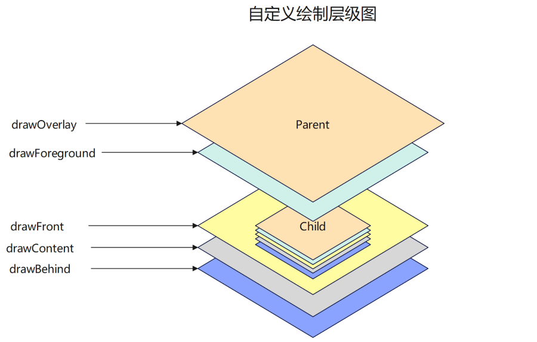
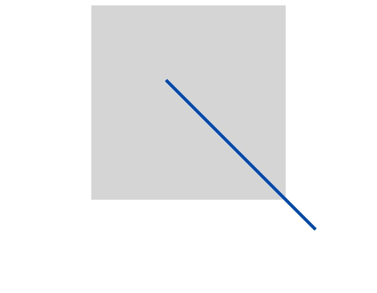
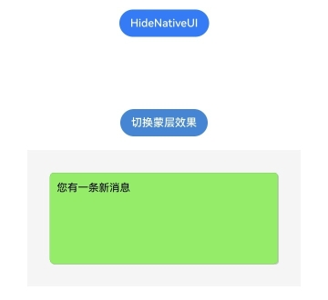
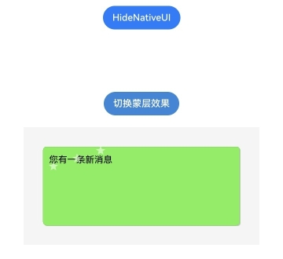

# 自定义绘制
<!--Kit: ArkUI-->
<!--Subsystem: ArkUI-->
<!--Owner: @wangyang2022-->
<!--Designer: @wangyang2022-->
<!--Tester: @sally__-->
<!--Adviser: @Brilliantry_Rui-->

## 概述

当某些组件本身的绘制内容不满足需求时，可使用组件自定义绘制功能，在原有组件基础上部分绘制、或者全部自行绘制，以达到预期效果。例如：独特的按钮形状、文字和图像混合的图标等。NDK提供了自定义绘制节点的能力，通过自定义绘制事件，开发者可以实现基于NDK侧[ArkUI_NodeType](../reference/apis-arkui/capi-native-node-h.md#arkui_nodetype)中ARKUI_NODE_CUSTOM类型节点的自绘制能力。

> **说明：**
>
> * ArkTS的自定义绘制能力和示例请参考[自定义绘制修改器 (DrawModifier)](./arkts-user-defined-extension-drawModifier.md)。

## 自定义绘制层级

自定义绘制提供了五个绘制层级，从低到高依次为：内容背景层（drawBehind）、内容层（drawContent）、内容前景层（drawFront）、前景层（drawForeground）和浮层（drawOverlay）。开发者可以根据需求选择合适的层级进行绘制。自定义绘制层级图如下所示。



开发者可以通过注册相应的事件类型来实现不同层级的自定义绘制，不同层级对应的枚举如下，NDK接口支持的事件类型范围请参考[ArkUI_NodeCustomEventType](../reference/apis-arkui/capi-native-node-node-attributes-custom-attributes-h.md#arkui_nodecustomeventtype)枚举值。

| 事件类型 | 说明 |
| --- | --- |
| ARKUI_NODE_CUSTOM_EVENT_ON_DRAW_BEHIND | 自定义内容背景层绘制类型，从API version 20开始支持。 |
| ARKUI_NODE_CUSTOM_EVENT_ON_DRAW | 自定义内容层绘制类型。|
| ARKUI_NODE_CUSTOM_EVENT_ON_DRAW_FRONT | 自定义内容前景层绘制类型，从API version 20开始支持。 |
| ARKUI_NODE_CUSTOM_EVENT_ON_FOREGROUND_DRAW | 自定义前景层绘制类型。|
| ARKUI_NODE_CUSTOM_EVENT_ON_OVERLAY_DRAW | 自定义浮层绘制类型。 |


### 内容层自定义绘制示例

本示例通过注册内容层绘制事件`ARKUI_NODE_CUSTOM_EVENT_ON_DRAW`在节点内容层绘制一条从左上区域到右下区域的对角线段，效果图如下。

以下场景基于[接入ArkTS页面](ndk-access-the-arkts-page.md)章节，创建前置工程。内容绘制的完整示例请参考<!--RP1-->[NativeDrawPageSample](https://gitcode.com/openharmony/applications_app_samples/tree/master/code/DocsSample/ArkUISample/NativeType/NativeDrawPageSample)<!--RP1End-->。



1. 通过[ArkUI_NativeNodeAPI_1](../reference/apis-arkui/capi-arkui-nativemodule-arkui-nativenodeapi-1.md)的[createNode](../reference/apis-arkui/capi-arkui-nativemodule-arkui-nativenodeapi-1.md#createnode)接口，传入[ArkUI_NodeType](../reference/apis-arkui/capi-native-node-h.md#arkui_nodetype)中的ARKUI_NODE_CUSTOM枚举值创建自定义节点。

   <!-- @[create_customNode_start](https://gitcode.com/openharmony/applications_app_samples/blob/master/code/DocsSample/ArkUISample/NativeType/NativeDrawPageSample/entry/src/main/cpp/Drawing.h) -->
   
   ``` C
   auto customNode = nodeAPI->createNode(ARKUI_NODE_CUSTOM);
   ```

2. 事件注册时将自定义节点、事件类型、事件ID和UserData作为参数传入。

   <!-- @[userdata_start](https://gitcode.com/openharmony/applications_app_samples/blob/master/code/DocsSample/ArkUISample/NativeType/NativeDrawPageSample/entry/src/main/cpp/Drawing.h) -->
   
   ``` C
   // UserData
   struct A {
       int32_t a = 6;
       bool flag = true;
       ArkUI_NodeHandle node;
   };
   A *a = new A;
   a->node = customNode;
   // ...
   nodeAPI->registerNodeCustomEvent(customNode, ARKUI_NODE_CUSTOM_EVENT_ON_FOREGROUND_DRAW, 1, a);
   // 事件回调函数的编写
   nodeAPI->registerNodeCustomEventReceiver([](ArkUI_NodeCustomEvent *event) {
       // 事件回调函数逻辑
       // ...
   });
   ```
    
3. 在回调函数中，通过[OH_ArkUI_NodeCustomEvent_GetEventType](../reference/apis-arkui/capi-native-node-h.md#oh_arkui_nodecustomevent_geteventtype)获取自定义事件的事件类型，通过[OH_ArkUI_NodeCustomEvent_GetEventTargetId](../reference/apis-arkui/capi-native-node-h.md#oh_arkui_nodecustomevent_geteventtargetid)获取事件ID，通过[OH_ArkUI_NodeCustomEvent_GetUserData](../reference/apis-arkui/capi-native-node-h.md#oh_arkui_nodecustomevent_getuserdata)获取UserData，再根据事件类型和事件ID判断当前触发的是哪个绘制事件，从而执行对应的逻辑。

   <!-- @[nodeCustomEvent_start](https://gitcode.com/openharmony/applications_app_samples/blob/master/code/DocsSample/ArkUISample/NativeType/NativeDrawPageSample/entry/src/main/cpp/Drawing.h) -->
   
   ``` C
   auto type = OH_ArkUI_NodeCustomEvent_GetEventType(event);
   auto targetId = OH_ArkUI_NodeCustomEvent_GetEventTargetId(event);
   auto userData = reinterpret_cast<A *>(OH_ArkUI_NodeCustomEvent_GetUserData(event));
   ```
    
4. [OH_ArkUI_NodeCustomEvent_GetDrawContextInDraw](../reference/apis-arkui/capi-native-node-h.md#oh_arkui_nodecustomevent_getdrawcontextindraw)通过自定义组件事件获取绘制上下文，并将其传入[OH_ArkUI_DrawContext_GetCanvas](../reference/apis-arkui/capi-native-type-h.md#oh_arkui_drawcontext_getcanvas)以获取Canvas画布指针，该指针随后将转换为[OH_Drawing_Canvas](../reference/apis-arkgraphics2d/capi-drawing-oh-drawing-canvas.md)指针进行绘制。

   <!-- @[drawCanvas_Start](https://gitcode.com/openharmony/applications_app_samples/blob/master/code/DocsSample/ArkUISample/NativeType/NativeDrawPageSample/entry/src/main/cpp/Drawing.h) -->
   
   ``` C
   // 获取自定义事件绘制的上下文。
   auto *drawContext = OH_ArkUI_NodeCustomEvent_GetDrawContextInDraw(event);
   // 获取Canvas指针。
   auto *canvas1 = OH_ArkUI_DrawContext_GetCanvas(drawContext);
   // 转换为OH_Drawing_Canvas指针进行绘制。
   OH_Drawing_Canvas *canvas = reinterpret_cast<OH_Drawing_Canvas *>(canvas1);
   // 绘制逻辑。
   int32_t width = SIZE_1000;  // SIZE_1000 = 1000
   int32_t height = SIZE_1000; // SIZE_1000 = 1000
   auto path = OH_Drawing_PathCreate();
   OH_Drawing_PathMoveTo(path, width / SIZE_4, height / SIZE_4);                   // SIZE_4 = 4
   OH_Drawing_PathLineTo(path, width * SIZE_3 / SIZE_4, height * SIZE_3 / SIZE_4); // SIZE_3 = 3,SIZE_4 = 4
   OH_Drawing_PathClose(path);
   auto pen = OH_Drawing_PenCreate();
   OH_Drawing_PenSetWidth(pen, SIZE_10); // SIZE_10 = 10
   OH_Drawing_PenSetColor(pen, OH_Drawing_ColorSetArgb(0xFF, 0x00, 0x4A, 0x4F));
   OH_Drawing_CanvasAttachPen(canvas, pen);
   OH_Drawing_CanvasDrawPath(canvas, path);
   ```

### 多层级绘制示例

以下示例创建了一个自定义绘制组件，实现自定义矩形绘制、自定义绘制内容前景层和内容背景层，并支持使用[自定义布局容器](ndk-build-custom-components.md#自定义布局容器)进行布局排布。完整示例请参考<!--RP2-->[NativeNodeUtilsSample](https://gitcode.com/openharmony/applications_app_samples/tree/master/code/DocsSample/ArkUISample/NativeType/NativeNodeUtilsSample)<!--RP2End-->。


图中深蓝矩形为`drawFront`内容前景层，浅蓝色矩形为`drawContent`内容层，白色矩形为`drawBehind`内容背景层。三层的叠加关系用于验证多层级绘制顺序是否符合预期。

1. 按照[自定义布局容器](ndk-build-custom-components.md#自定义布局容器)章节准备前置工程。

2. 创建自定义绘制组件封装对象。

   <!-- @[arkUICustomNode_start](https://gitcode.com/openharmony/applications_app_samples/blob/master/code/DocsSample/ArkUISample/NativeType/NativeNodeUtilsSample/entry/src/main/cpp/ArkUICustomNode.h) --> 
   
   ``` C
   #ifndef MYAPPLICATION_ARKUICUSTOMNODE_H
   #define MYAPPLICATION_ARKUICUSTOMNODE_H
   
   #include <native_drawing/drawing_brush.h>
   #include <native_drawing/drawing_canvas.h>
   #include <native_drawing/drawing_path.h>
   
   #include "ArkUINode.h"
   
   namespace NativeModule {
   class ArkUICustomNode : public ArkUINode {
   public:
       // 使用自定义组件类型ARKUI_NODE_CUSTOM创建组件。
       ArkUICustomNode()
           : ArkUINode((NativeModuleInstance::GetInstance()->GetNativeNodeAPI())->createNode(ARKUI_NODE_CUSTOM))
       {
           // 注册自定义事件监听器。
           nativeModule_->addNodeCustomEventReceiver(handle_, OnStaticCustomEvent);
           // 声明自定义事件并转递自身作为自定义数据。
           nativeModule_->registerNodeCustomEvent(handle_, ARKUI_NODE_CUSTOM_EVENT_ON_DRAW_FRONT, 0, this);
           nativeModule_->registerNodeCustomEvent(handle_, ARKUI_NODE_CUSTOM_EVENT_ON_DRAW, 0, this);
           nativeModule_->registerNodeCustomEvent(handle_, ARKUI_NODE_CUSTOM_EVENT_ON_DRAW_BEHIND, 0, this);
           // 绘制完成事件通知。
           OH_ArkUI_RegisterDrawCallbackOnNodeHandle(handle_, nullptr, [](void* userData) {});
       }
   
       ~ArkUICustomNode() override
       {
           // 反注册自定义事件监听器。
           nativeModule_->removeNodeCustomEventReceiver(handle_, OnStaticCustomEvent);
           // 取消声明自定义事件。
           nativeModule_->unregisterNodeCustomEvent(handle_, ARKUI_NODE_CUSTOM_EVENT_ON_DRAW_FRONT);
           nativeModule_->unregisterNodeCustomEvent(handle_, ARKUI_NODE_CUSTOM_EVENT_ON_DRAW);
           nativeModule_->unregisterNodeCustomEvent(handle_, ARKUI_NODE_CUSTOM_EVENT_ON_DRAW_BEHIND);
           OH_ArkUI_UnregisterDrawCallbackOnNodeHandle(handle_);
       }
   
   private:
       int32_t NUM_2 = 2;
       int32_t NUM_3 = 3;
       int32_t NUM_4 = 4;
       int32_t NUM_5 = 5;
       static void OnStaticCustomEvent(ArkUI_NodeCustomEvent *event)
       {
           // 获取组件实例对象，调用相关实例方法。
           // ...
           auto customNode = reinterpret_cast<ArkUICustomNode *>(OH_ArkUI_NodeCustomEvent_GetUserData(event));
           auto type = OH_ArkUI_NodeCustomEvent_GetEventType(event);
           switch (type) {
               // 绘制层级由低到高。
               case ARKUI_NODE_CUSTOM_EVENT_ON_DRAW_BEHIND:
                   customNode->OnDrawBehind(event);
                   break;
               case ARKUI_NODE_CUSTOM_EVENT_ON_DRAW:
                   customNode->OnDraw(event);
                   break;
               case ARKUI_NODE_CUSTOM_EVENT_ON_DRAW_FRONT:
                   customNode->OnDrawFront(event);
                   break;
               // ...
               default:
                   break;
           }
       }
   
       // 自定义绘制逻辑。
       void OnDrawBehind(ArkUI_NodeCustomEvent *event)
       {
           auto drawContext = OH_ArkUI_NodeCustomEvent_GetDrawContextInDraw(event);
           // 获取图形绘制对象。
           auto drawCanvas = reinterpret_cast<OH_Drawing_Canvas *>(OH_ArkUI_DrawContext_GetCanvas(drawContext));
           // 获取组件大小。
           auto size = OH_ArkUI_DrawContext_GetSize(drawContext);
           // 绘制自定义内容。
           auto path = OH_Drawing_PathCreate();
           OH_Drawing_PathMoveTo(path, size.width / NUM_5, size.height / NUM_5);
           OH_Drawing_PathLineTo(path, size.width * NUM_4 / NUM_5, size.height / NUM_5);
           OH_Drawing_PathLineTo(path, size.width * NUM_4 / NUM_5, size.height * NUM_4 / NUM_5);
           OH_Drawing_PathLineTo(path, size.width / NUM_5, size.height * NUM_4 / NUM_5);
           OH_Drawing_PathLineTo(path, size.width / NUM_5, size.height / NUM_5);
           OH_Drawing_PathClose(path);
           auto brush = OH_Drawing_BrushCreate();
           OH_Drawing_BrushSetColor(brush, 0xFFF0FAFF); // 蓝白色
           OH_Drawing_CanvasAttachBrush(drawCanvas, brush);
           OH_Drawing_CanvasDrawPath(drawCanvas, path);
           // 释放资源
           OH_Drawing_BrushDestroy(brush);
           OH_Drawing_PathDestroy(path);
       }
   
       void OnDraw(ArkUI_NodeCustomEvent *event)
       {
           auto drawContext = OH_ArkUI_NodeCustomEvent_GetDrawContextInDraw(event);
           // 获取图形绘制对象。
           auto drawCanvas = reinterpret_cast<OH_Drawing_Canvas *>(OH_ArkUI_DrawContext_GetCanvas(drawContext));
           // 获取组件大小。
           auto size = OH_ArkUI_DrawContext_GetSize(drawContext);
           // 绘制自定义内容。
           auto path = OH_Drawing_PathCreate();
           OH_Drawing_PathMoveTo(path, size.width / NUM_4, size.height / NUM_4);
           OH_Drawing_PathLineTo(path, size.width * NUM_3 / NUM_4, size.height / NUM_4);
           OH_Drawing_PathLineTo(path, size.width * NUM_3 / NUM_4, size.height * NUM_3 / NUM_4);
           OH_Drawing_PathLineTo(path, size.width / NUM_4, size.height * NUM_3 / NUM_4);
           OH_Drawing_PathLineTo(path, size.width / NUM_4, size.height / NUM_4);
           OH_Drawing_PathClose(path);
           auto brush = OH_Drawing_BrushCreate();
           OH_Drawing_BrushSetColor(brush, 0xff2787D9); // 浅蓝色
           OH_Drawing_CanvasAttachBrush(drawCanvas, brush);
           OH_Drawing_CanvasDrawPath(drawCanvas, path);
           // 释放资源
           OH_Drawing_BrushDestroy(brush);
           OH_Drawing_PathDestroy(path);
       }
   
       void OnDrawFront(ArkUI_NodeCustomEvent *event)
       {
           auto drawContext = OH_ArkUI_NodeCustomEvent_GetDrawContextInDraw(event);
           // 获取图形绘制对象。
           auto drawCanvas = reinterpret_cast<OH_Drawing_Canvas *>(OH_ArkUI_DrawContext_GetCanvas(drawContext));
           // 获取组件大小。
           auto size = OH_ArkUI_DrawContext_GetSize(drawContext);
           // 绘制自定义内容。
           auto path = OH_Drawing_PathCreate();
           OH_Drawing_PathMoveTo(path, size.width / NUM_3, size.height / NUM_3);
           OH_Drawing_PathLineTo(path, size.width * NUM_2 / NUM_3, size.height / NUM_3);
           OH_Drawing_PathLineTo(path, size.width * NUM_2 / NUM_3, size.height * NUM_2 / NUM_3);
           OH_Drawing_PathLineTo(path, size.width / NUM_3, size.height * NUM_2 / NUM_3);
           OH_Drawing_PathLineTo(path, size.width / NUM_3, size.height / NUM_3);
           OH_Drawing_PathClose(path);
           auto brush = OH_Drawing_BrushCreate();
           OH_Drawing_BrushSetColor(brush, 0xFF004AAF); // 深蓝色
           OH_Drawing_CanvasAttachBrush(drawCanvas, brush);
           OH_Drawing_CanvasDrawPath(drawCanvas, path);
           // 释放资源
           OH_Drawing_BrushDestroy(brush);
           OH_Drawing_PathDestroy(path);
       }
       // ...
   };
   
   } // namespace NativeModule
   
   #endif // MYAPPLICATION_ARKUICUSTOMNODE_H
   ```

3. 使用自定义绘制组件和自定义容器创建示例界面。

    <!-- @[arkUICustomNodeCpp_start](https://gitcode.com/openharmony/applications_app_samples/blob/master/code/DocsSample/ArkUISample/NativeType/NativeNodeUtilsSample/entry/src/main/cpp/NativeEntry.cpp) -->
    
    ``` C++
    #include <arkui/native_node_napi.h>
    #include <arkui/native_type.h>
    #include <js_native_api.h>
    
    #include "NativeEntry.h"
    #include "ArkUICustomContainerNode.h"
    #include "ArkUICustomNode.h"
    #include "ArkUIMessageMaskNode.h"
    
    // 全局环境变量声明
    static napi_env g_env = nullptr;
    // ...
    namespace NativeModule {
    // ...
    #define SIZE_150 150
    // ...
    napi_value CreateNativeRoot(napi_env env, napi_callback_info info)
    {
        size_t argc = 1;
        napi_value args[1] = {nullptr};
    
        napi_get_cb_info(env, info, &argc, args, nullptr, nullptr);
    
        // 获取NodeContent。
        ArkUI_NodeContentHandle contentHandle;
        OH_ArkUI_GetNodeContentFromNapiValue(env, args[0], &contentHandle);
        NativeEntry::GetInstance()->SetContentHandle(contentHandle);
    
        // 创建自定义容器和自定义绘制组件。
        auto node = std::make_shared<ArkUICustomContainerNode>();
        node->SetBackgroundColor(0xFFD5D5D5); // 浅灰色。
        auto customNode = std::make_shared<ArkUICustomNode>();
        customNode->SetBackgroundColor(0xFF707070); // 深灰色。
        customNode->SetWidth(SIZE_150);
        customNode->SetHeight(SIZE_150);
        node->AddChild(customNode);
    
        // 保持Native侧对象到管理类中，维护生命周期。
        NativeEntry::GetInstance()->SetRootNode(node);
        g_env = env;
        return nullptr;
    }
    
    napi_value DestroyNativeRoot(napi_env env, napi_callback_info info)
    {
        // 从管理类中释放Native侧对象。
        NativeEntry::GetInstance()->DisposeRootNode();
        return nullptr;
    }
    } // namespace NativeModule
    ```

## 通过前景绘制实现消息蒙层

以下示例创建了一个消息提示组件，通过内容层绘制消息气泡与文本，并在前景层叠加星标装饰，实现消息高亮提示效果，常用于消息提醒和引导标记等场景。完整示例请参考<!--RP2-->[NativeNodeUtilsSample](https://gitcode.com/openharmony/applications_app_samples/tree/master/code/DocsSample/ArkUISample/NativeType/NativeNodeUtilsSample)<!--RP2End-->。

未添加消息蒙层，没有前景层叠加星标装饰效果：



添加消息蒙层，添加后有前景层叠加星标装饰效果：



1. 按照[多层级绘制示例](#多层级绘制示例)章节准备前置工程。

2. 创建消息蒙层组件封装对象。

   <!-- @[messageMaskNode_start](https://gitcode.com/openharmony/applications_app_samples/blob/master/code/DocsSample/ArkUISample/NativeType/NativeNodeUtilsSample/entry/src/main/cpp/ArkUIMessageMaskNode.h) -->
   
   ``` C
   #ifndef MYAPPLICATION_ARKUIMESSAGEMASKNODE_H
   #define MYAPPLICATION_ARKUIMESSAGEMASKNODE_H
   
   #include <cmath>
   #include <native_drawing/drawing_brush.h>
   #include <native_drawing/drawing_canvas.h>
   #include <native_drawing/drawing_color_filter.h>
   #include <native_drawing/drawing_font.h>
   #include <native_drawing/drawing_font_collection.h>
   #include <native_drawing/drawing_path.h>
   #include <native_drawing/drawing_pen.h>
   #include <native_drawing/drawing_point.h>
   #include <native_drawing/drawing_rect.h>
   #include <native_drawing/drawing_round_rect.h>
   #include <native_drawing/drawing_text_typography.h>
   
   #include <string>
   
   #include "ArkUINode.h"
   
   namespace NativeModule {
   class ArkUIMessageMaskNode : public ArkUINode {
   public:
       // 使用自定义组件类型ARKUI_NODE_CUSTOM创建组件
       ArkUIMessageMaskNode()
           : ArkUINode(
                 (NativeModuleInstance::GetInstance()->GetNativeNodeAPI())->createNode(ARKUI_NODE_CUSTOM))
       {
           // 注册自定义事件监听器
           nativeModule_->addNodeCustomEventReceiver(handle_, OnStaticCustomEvent);
           // 声明自定义事件并转递自身作为自定义数据
           nativeModule_->registerNodeCustomEvent(handle_, ARKUI_NODE_CUSTOM_EVENT_ON_DRAW_FRONT, 0, this);
           nativeModule_->registerNodeCustomEvent(handle_, ARKUI_NODE_CUSTOM_EVENT_ON_DRAW, 0, this);
           nativeModule_->registerNodeCustomEvent(handle_, ARKUI_NODE_CUSTOM_EVENT_ON_DRAW_BEHIND, 0, this);
       }
   
       ~ArkUIMessageMaskNode() override
       {
           // 反注册自定义事件监听器
           nativeModule_->removeNodeCustomEventReceiver(handle_, OnStaticCustomEvent);
           // 取消声明自定义事件
           nativeModule_->unregisterNodeCustomEvent(handle_, ARKUI_NODE_CUSTOM_EVENT_ON_DRAW_FRONT);
           nativeModule_->unregisterNodeCustomEvent(handle_, ARKUI_NODE_CUSTOM_EVENT_ON_DRAW);
           nativeModule_->unregisterNodeCustomEvent(handle_, ARKUI_NODE_CUSTOM_EVENT_ON_DRAW_BEHIND);
       }
   
       // 设置消息文本
       void SetMessage(const std::string& message)
       {
           message_ = message;
           nativeModule_->markDirty(handle_, NODE_NEED_RENDER);
       }
   
       // 设置是否显示蒙层
       void SetMaskVisible(bool visible)
       {
           maskVisible_ = visible;
           nativeModule_->markDirty(handle_, NODE_NEED_RENDER);
       }
   
   private:
       static constexpr int starDecorationCount = 3;
       static constexpr int starPointCount = 5;
       static constexpr float starStartAngleDegrees = -90.0f;
       static constexpr float starAngleStepDegrees = 72.0f;
       static constexpr float starInnerAngleOffsetDegrees = 36.0f;
       static constexpr float starInnerRadiusRatio = 0.4f;
       static constexpr float degreeToRadian = 3.14159265f / 180.0f;
       static constexpr float messageTextFontSize = 23.0f;
   
       static void OnStaticCustomEvent(ArkUI_NodeCustomEvent* event)
       {
           auto customNode = reinterpret_cast<ArkUIMessageMaskNode*>(OH_ArkUI_NodeCustomEvent_GetUserData(event));
           auto type = OH_ArkUI_NodeCustomEvent_GetEventType(event);
           switch (type) {
               case ARKUI_NODE_CUSTOM_EVENT_ON_DRAW_BEHIND:
                   customNode->OnDrawBehind(event);
                   break;
               case ARKUI_NODE_CUSTOM_EVENT_ON_DRAW:
                   customNode->OnDraw(event);
                   break;
               case ARKUI_NODE_CUSTOM_EVENT_ON_DRAW_FRONT:
                   customNode->OnDrawFront(event);
                   break;
               default:
                   break;
           }
       }
   
       // 自定义内容背景层：绘制聊天界面背景
       void OnDrawBehind(ArkUI_NodeCustomEvent* event)
       {
           auto drawContext = OH_ArkUI_NodeCustomEvent_GetDrawContextInDraw(event);
           auto canvas = reinterpret_cast<OH_Drawing_Canvas*>(OH_ArkUI_DrawContext_GetCanvas(drawContext));
           auto size = OH_ArkUI_DrawContext_GetSize(drawContext);
   
           // 绘制浅灰色背景
           auto bgRect = OH_Drawing_RectCreate(0, 0, size.width, size.height);
           auto brush = OH_Drawing_BrushCreate();
           OH_Drawing_BrushSetColor(brush, 0xFFF5F5F5);
           OH_Drawing_CanvasAttachBrush(canvas, brush);
           OH_Drawing_CanvasDrawRect(canvas, bgRect);
           OH_Drawing_CanvasDetachBrush(canvas);
           OH_Drawing_BrushDestroy(brush);
           OH_Drawing_RectDestroy(bgRect);
       }
   
       // 自定义内容层
       void OnDraw(ArkUI_NodeCustomEvent* event)
       {
           auto drawContext = OH_ArkUI_NodeCustomEvent_GetDrawContextInDraw(event);
           auto canvas = reinterpret_cast<OH_Drawing_Canvas*>(OH_ArkUI_DrawContext_GetCanvas(drawContext));
           auto size = OH_ArkUI_DrawContext_GetSize(drawContext);
   
           float padding = 50.0f;
           float bubbleWidth = size.width - 2 * padding;
           float bubbleHeight = size.height - 2 * padding;
           float cornerRadius = 8.0f;
           float textX = padding + 15.0f;
           float textY = padding + 20.0f;
           float textMaxWidth = bubbleWidth - 30.0f;
   
           // 绘制气泡阴影
           auto shadowRect = OH_Drawing_RectCreate(
               padding + 2, padding + 2, padding + bubbleWidth + 2, padding + bubbleHeight + 2);
           auto* shadowRoundRect = OH_Drawing_RoundRectCreate(shadowRect, cornerRadius, cornerRadius);
           auto shadowBrush = OH_Drawing_BrushCreate();
           OH_Drawing_BrushSetColor(shadowBrush, 0x30000000);
           OH_Drawing_CanvasAttachBrush(canvas, shadowBrush);
           OH_Drawing_CanvasDrawRoundRect(canvas, shadowRoundRect);
           OH_Drawing_CanvasDetachBrush(canvas);
           OH_Drawing_BrushDestroy(shadowBrush);
           OH_Drawing_RoundRectDestroy(shadowRoundRect);
           OH_Drawing_RectDestroy(shadowRect);
   
           // 绘制绿色气泡背景
           auto bubbleRect = OH_Drawing_RectCreate(padding, padding, padding + bubbleWidth, padding + bubbleHeight);
           auto* bubbleRoundRect = OH_Drawing_RoundRectCreate(bubbleRect, cornerRadius, cornerRadius);
           auto bubbleBrush = OH_Drawing_BrushCreate();
           OH_Drawing_BrushSetColor(bubbleBrush, 0xFF95EC69);
           OH_Drawing_CanvasAttachBrush(canvas, bubbleBrush);
           OH_Drawing_CanvasDrawRoundRect(canvas, bubbleRoundRect);
           OH_Drawing_CanvasDetachBrush(canvas);
           OH_Drawing_BrushDestroy(bubbleBrush);
   
           // 绘制气泡边框
           auto pen = OH_Drawing_PenCreate();
           OH_Drawing_PenSetWidth(pen, 1.0f);
           OH_Drawing_PenSetColor(pen, 0xFF7FD65A);
           OH_Drawing_CanvasAttachPen(canvas, pen);
           OH_Drawing_CanvasDrawRoundRect(canvas, bubbleRoundRect);
           OH_Drawing_CanvasDetachPen(canvas);
           OH_Drawing_PenDestroy(pen);
           OH_Drawing_RoundRectDestroy(bubbleRoundRect);
           OH_Drawing_RectDestroy(bubbleRect);
   
           // 绘制消息文本
           DrawMessageText(canvas, textX, textY, textMaxWidth);
       }
   
       // 自定义内容前景层：绘制装饰性蒙层
       void OnDrawFront(ArkUI_NodeCustomEvent* event)
       {
           if (!maskVisible_) {
               return;
           }
   
           auto drawContext = OH_ArkUI_NodeCustomEvent_GetDrawContextInDraw(event);
           auto canvas = reinterpret_cast<OH_Drawing_Canvas*>(OH_ArkUI_DrawContext_GetCanvas(drawContext));
   
           float padding = 50.0f;
   
           auto starBrush = OH_Drawing_BrushCreate();
           OH_Drawing_BrushSetColor(starBrush, 0x88FFFFFF);
           OH_Drawing_CanvasAttachBrush(canvas, starBrush);
   
           const float starRadius = 13.0f;
           const float textLeftX = padding + 26.0f;
           const float textRightX = padding + 146.0f;
           const float starBottomY = padding + 50.0f;
           const float starTopY = padding + 10.0f;
           for (int i = 0; i < starDecorationCount; ++i) {
               float t = static_cast<float>(i) / static_cast<float>(starDecorationCount - 1);
               float starX = textLeftX + (textRightX - textLeftX) * t;
               float starY = starBottomY + (starTopY - starBottomY) * t;
               DrawStar(canvas, starX, starY, starRadius);
           }
   
           OH_Drawing_CanvasDetachBrush(canvas);
           OH_Drawing_BrushDestroy(starBrush);
       }
   
       // 绘制五角星
       void DrawStar(OH_Drawing_Canvas* canvas, float cx, float cy, float radius)
       {
           auto path = OH_Drawing_PathCreate();
           for (int i = 0; i < starPointCount; ++i) {
               float angle = starStartAngleDegrees + i * starAngleStepDegrees;
               float rad = angle * degreeToRadian;
               float x = cx + radius * std::cos(rad);
               float y = cy + radius * std::sin(rad);
               if (i == 0) {
                   OH_Drawing_PathMoveTo(path, x, y);
               } else {
                   OH_Drawing_PathLineTo(path, x, y);
               }
   
               // 内角点
               float innerAngle = angle + starInnerAngleOffsetDegrees;
               float innerRad = innerAngle * degreeToRadian;
               float innerX = cx + radius * starInnerRadiusRatio * std::cos(innerRad);
               float innerY = cy + radius * starInnerRadiusRatio * std::sin(innerRad);
               OH_Drawing_PathLineTo(path, innerX, innerY);
           }
   
           OH_Drawing_PathClose(path);
           OH_Drawing_CanvasDrawPath(canvas, path);
           OH_Drawing_PathDestroy(path);
       }
   
       // 绘制消息文本
       void DrawMessageText(OH_Drawing_Canvas* canvas, float x, float y, float maxWidth)
       {
           // 创建字体集合
           auto* fontCollection = OH_Drawing_CreateFontCollection();
   
           // 创建排版样式
           auto* typographyStyle = OH_Drawing_CreateTypographyStyle();
           OH_Drawing_SetTypographyTextAlign(typographyStyle, TEXT_ALIGN_LEFT);
   
           // 创建排版处理器
           auto* typographyHandler = OH_Drawing_CreateTypographyHandler(typographyStyle, fontCollection);
   
           // 创建文本样式
           auto* textStyle = OH_Drawing_CreateTextStyle();
           OH_Drawing_SetTextStyleColor(textStyle, 0xFF000000); // 纯黑
           OH_Drawing_SetTextStyleFontSize(textStyle, messageTextFontSize);
           OH_Drawing_SetTextStyleFontWeight(textStyle, FONT_WEIGHT_400);
           auto textBrush = OH_Drawing_BrushCreate();
           OH_Drawing_BrushSetColor(textBrush, 0xFF000000);
           OH_Drawing_SetTextStyleForegroundBrush(textStyle, textBrush);
   
           // 添加文本
           OH_Drawing_TypographyHandlerPushTextStyle(typographyHandler, textStyle);
           OH_Drawing_TypographyHandlerAddText(typographyHandler, message_.c_str());
           OH_Drawing_TypographyHandlerPopTextStyle(typographyHandler);
   
           // 创建排版对象并绘制
           auto* typography = OH_Drawing_CreateTypography(typographyHandler);
           OH_Drawing_TypographyLayout(typography, maxWidth);
           OH_Drawing_TypographyPaint(typography, canvas, x, y);
   
           // 释放资源
           OH_Drawing_DestroyTextStyle(textStyle);
           OH_Drawing_DestroyTypography(typography);
           OH_Drawing_DestroyTypographyHandler(typographyHandler);
           OH_Drawing_DestroyTypographyStyle(typographyStyle);
           OH_Drawing_DestroyFontCollection(fontCollection);
           OH_Drawing_BrushDestroy(textBrush);
       }
   
       std::string message_ = "";
       bool maskVisible_ = false;
   };
   } // namespace NativeModule
   
   #endif // MYAPPLICATION_ARKUIMESSAGEMASKNODE_H
   ```
   
3. 使用消息蒙层组件创建示例界面。

    <!-- @[messageMaskCpp_start](https://gitcode.com/openharmony/applications_app_samples/blob/master/code/DocsSample/ArkUISample/NativeType/NativeNodeUtilsSample/entry/src/main/cpp/NativeEntry.cpp) -->
    
    ``` C++
    #include <arkui/native_node_napi.h>
    #include <arkui/native_type.h>
    #include <js_native_api.h>
    
    #include "NativeEntry.h"
    #include "ArkUICustomContainerNode.h"
    #include "ArkUICustomNode.h"
    #include "ArkUIMessageMaskNode.h"
    
    // 全局环境变量声明
    static napi_env g_env = nullptr;
    // ...
    namespace NativeModule {
    // ...
    napi_value CreateNativeMessageRoot(napi_env env, napi_callback_info info)
    {
        constexpr int32_t messageMaskWidth = 400;
        constexpr int32_t messageMaskHeight = 200;
    
        size_t argc = 1;
        napi_value args[1] = {nullptr};
    
        napi_get_cb_info(env, info, &argc, args, nullptr, nullptr);
    
        // 避免重复创建导致的重复挂载
        NativeEntry::GetInstance()->DisposeRootNode();
    
        // 获取NodeContent
        ArkUI_NodeContentHandle contentHandle;
        OH_ArkUI_GetNodeContentFromNapiValue(env, args[0], &contentHandle);
        NativeEntry::GetInstance()->SetContentHandle(contentHandle);
    
        auto nodeAPI = NativeModuleInstance::GetInstance()->GetNativeNodeAPI();
        auto rootColumn = std::make_shared<ArkUIColumnNode>();
        auto rootColumnHandle = rootColumn->GetHandle();
        
        // 设置根容器样式
        ArkUI_NumberValue paddingValue[] = {{.f32 = 20.0f}};
        ArkUI_AttributeItem paddingItem = {paddingValue, 1};
        nodeAPI->setAttribute(rootColumnHandle, NODE_PADDING, &paddingItem);
    
        ArkUI_NumberValue bgColorValue[] = {{.u32 = 0xFFFFFFFF}};
        ArkUI_AttributeItem bgColorItem = {bgColorValue, 1};
        nodeAPI->setAttribute(rootColumnHandle, NODE_BACKGROUND_COLOR, &bgColorItem);
        
        // 创建消息气泡组件
        auto maskNode = std::make_shared<ArkUIMessageMaskNode>();
        maskNode->SetWidth(messageMaskWidth);
        maskNode->SetHeight(messageMaskHeight);
        maskNode->SetMessage("您有一条新消息");
        maskNode->SetMaskVisible(false);  // 初始不显示蒙层
        
        // 创建按钮用于切换蒙层效果
        auto buttonNode = std::make_shared<ArkUINode>(nodeAPI->createNode(ARKUI_NODE_BUTTON));
        auto buttonHandle = buttonNode->GetHandle();
        
        // 设置按钮文本
        ArkUI_AttributeItem labelItem;
        const char* buttonLabel = "切换蒙层效果";
        labelItem.string = buttonLabel;
        nodeAPI->setAttribute(buttonHandle, NODE_BUTTON_LABEL, &labelItem);
        
        // 设置按钮样式
        ArkUI_NumberValue marginValue[] = {{.f32 = 20.0f}};
        ArkUI_AttributeItem marginItem = {marginValue, 1};
        nodeAPI->setAttribute(buttonHandle, NODE_MARGIN, &marginItem);
        
        ArkUI_NumberValue btnBgColorValue[] = {{.u32 = 0xFF2787D9}};
        ArkUI_AttributeItem btnBgColorItem = {btnBgColorValue, 1};
        nodeAPI->setAttribute(buttonHandle, NODE_BACKGROUND_COLOR, &btnBgColorItem);
    
        // 设置按钮点击事件
        auto onClick = [](ArkUI_NodeEvent *event) {
            auto maskNode = (ArkUIMessageMaskNode *)OH_ArkUI_NodeEvent_GetUserData(event);
            static bool highlighted = false;
            highlighted = !highlighted;
            maskNode->SetMaskVisible(highlighted);
        };
        buttonNode->RegisterOnClick(onClick, maskNode.get());
        
        // 将组件添加到根容器
        rootColumn->AddChild(buttonNode);
        rootColumn->AddChild(maskNode);
    
        // 保持Native侧对象到管理类中，维护生命周期
        NativeEntry::GetInstance()->SetRootNode(rootColumn);
        return nullptr;
    }
    
    napi_value DestroyNativeRoot(napi_env env, napi_callback_info info)
    {
        // 从管理类中释放Native侧对象。
        NativeEntry::GetInstance()->DisposeRootNode();
        return nullptr;
    }
    } // namespace NativeModule
    ```
