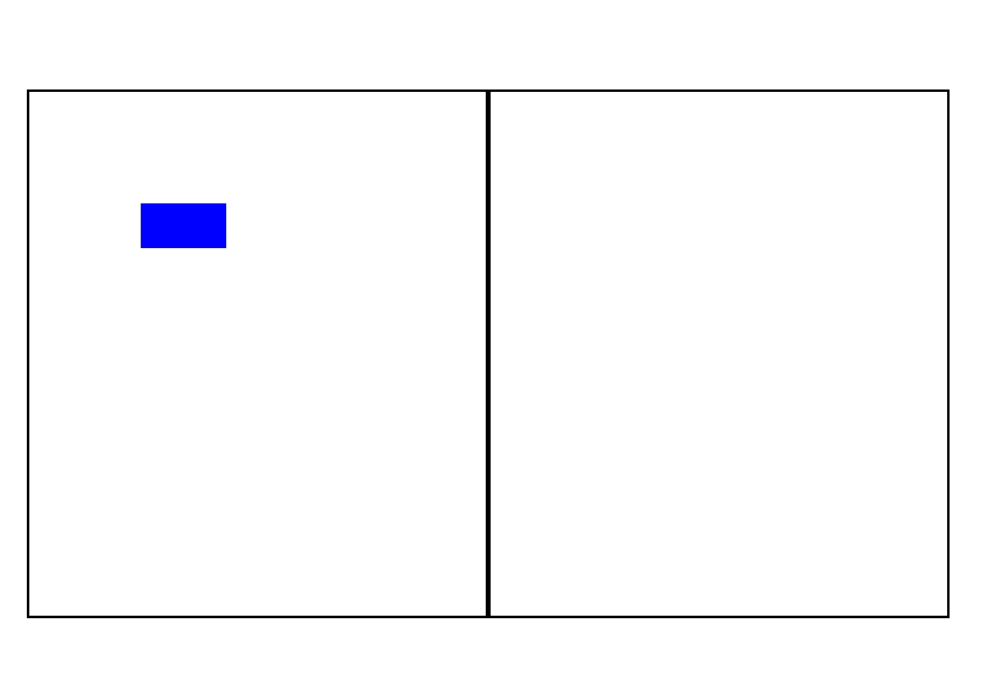

# 自定义绘制修改器 (DrawModifier)
<!--Kit: ArkUI-->
<!--Subsystem: ArkUI-->
<!--Owner: @xiang-shouxing-->
<!--Designer: @xiang-shouxing-->
<!--Tester: @sally__-->
<!--Adviser: @Brilliantry_Rui-->

## 概述

当某些组件本身的绘制内容不满足需求时，可使用组件自定义绘制功能，在原有组件基础上部分绘制、或者全部自行绘制，以达到预期效果。例如：独特的按钮形状、文字和图像混合的图标等。组件自定义绘制提供了自定义绘制修改器DrawModifier，来实现更自由的组件绘制。

## 使用DrawModifier接口

```ts
declare class DrawModifier {

  drawBehind?(drawContext: DrawContext): void;

  drawContent?(drawContext: DrawContext): void;

  drawFront?(drawContext: DrawContext): void;

  drawForeground?(drawContext: DrawContext): void;

  invalidate(): void;
}
```

DrawModifier可设置前景(drawForeground)、内容前景(drawFront)、内容(drawContent)和内容背景(drawBehind)的绘制方法，开发者需要重载这些方法，并通过[Canvas](arkts-drawing-customization-on-canvas.md)的接口进行自定义绘制。自定义绘制层级图如下所示。


DrawModifier还提供主动触发重绘的方法invalidate，该接口开发者无需也无法重载，调用会触发所绑定组件的重绘。

> **说明：**
>
> 每个DrawModifier实例只能设置到一个组件上，禁止进行重复设置。
>
> drawContent方法会替换组件原本的内容绘制函数。
>
> drawForeground方法从API version 20开始支持。
>
> NDK的自定义绘制能力和示例请参考[自定义绘制](./arkts-user-defined-draw.md)。

## 通过drawFront、drawContent、drawBehind进行自定义绘制

通过drawFront、drawContent、drawBehind接口，在内容前景、内容和内容背景三个层级上对Text组件进行了自定义绘制，从而按需改变组件的绘制效果。

<!-- @[drawFront_drawContent_drawBehind_start](https://gitcode.com/openharmony/applications_app_samples/blob/master/code/DocsSample/ArkUISample/DrawModifier/entry/src/main/ets/pages/DrawFrontDrawContentDrawBehind.ets) -->

``` TypeScript
import { drawing } from '@kit.ArkGraphics2D';
import { AnimatorResult } from '@kit.ArkUI';
import { hilog } from '@kit.PerformanceAnalysisKit';

const LOG_PRINT_DOMAIN:  number = 0xFF00;
const PREFIX: string = '[Sample]'

class MyFullDrawModifier extends DrawModifier {
  public scaleX: number = 1;
  public scaleY: number = 1;
  public uiContext: UIContext;

  constructor(uiContext: UIContext) {
    super();
    this.uiContext = uiContext;
  }

  // 重载drawBehind方法，实现自定义绘制内容背景。
  drawBehind(context: DrawContext): void {
    const brush = new drawing.Brush();
    brush.setColor({
      alpha: 255,
      red: 161,
      green: 10,
      blue: 33
    });
    context.canvas.attachBrush(brush);
    const halfWidth = context.size.width / 2;
    const halfHeight = context.size.height / 2;
    context.canvas.drawRect({
      left: this.uiContext.vp2px(halfWidth - 50 * this.scaleX),
      top: this.uiContext.vp2px(halfHeight - 50 * this.scaleY),
      right: this.uiContext.vp2px(halfWidth + 50 * this.scaleX),
      bottom: this.uiContext.vp2px(halfHeight + 50 * this.scaleY)
    });
  }

  // 重载drawContent方法，实现自定义绘制内容。
  drawContent(context: DrawContext): void {
    const brush = new drawing.Brush();
    brush.setColor({
      alpha: 255,
      red: 23,
      green: 169,
      blue: 141
    });
    context.canvas.attachBrush(brush);
    const halfWidth = context.size.width / 2;
    const halfHeight = context.size.height / 2;
    context.canvas.drawRect({
      left: this.uiContext.vp2px(halfWidth - 30 * this.scaleX),
      top: this.uiContext.vp2px(halfHeight - 30 * this.scaleY),
      right: this.uiContext.vp2px(halfWidth + 30 * this.scaleX),
      bottom: this.uiContext.vp2px(halfHeight + 30 * this.scaleY)
    });
  }

  // 重载drawFront方法，实现自定义绘制内容前景。
  drawFront(context: DrawContext): void {
    const brush = new drawing.Brush();
    brush.setColor({
      alpha: 255,
      red: 39,
      green: 135,
      blue: 217
    });
    context.canvas.attachBrush(brush);
    const halfWidth = context.size.width / 2;
    const halfHeight = context.size.height / 2;
    const radiusScale = (this.scaleX + this.scaleY) / 2;
    context.canvas.drawCircle(this.uiContext.vp2px(halfWidth), this.uiContext.vp2px(halfHeight),
      this.uiContext.vp2px(20 * radiusScale));
  }
}

class MyFrontDrawModifier extends DrawModifier {
  public scaleX: number = 1;
  public scaleY: number = 1;
  public uiContext: UIContext;

  constructor(uiContext: UIContext) {
    super();
    this.uiContext = uiContext;
  }

  // 重载drawFront方法，实现自定义绘制内容前景。
  drawFront(context: DrawContext): void {
    const brush = new drawing.Brush();
    brush.setColor({
      alpha: 255,
      red: 39,
      green: 135,
      blue: 217
    });
    context.canvas.attachBrush(brush);
    const halfWidth = context.size.width / 2;
    const halfHeight = context.size.height / 2;
    const radiusScale = (this.scaleX + this.scaleY) / 2;
    context.canvas.drawCircle(this.uiContext.vp2px(halfWidth), this.uiContext.vp2px(halfHeight),
      this.uiContext.vp2px(20 * radiusScale));
  }
}

@Entry
@Component
struct DrawModifierExample {
  // 将自定义绘制前景的类实例化，传入UIContext实例。
  private fullModifier: MyFullDrawModifier = new MyFullDrawModifier(this.getUIContext());
  private frontModifier: MyFrontDrawModifier = new MyFrontDrawModifier(this.getUIContext());
  private drawAnimator: AnimatorResult | undefined = undefined;
  @State modifier: DrawModifier = new MyFrontDrawModifier(this.getUIContext());
  private count = 0;

  create() {
    // 设置绘制动画
    let self = this;
    this.drawAnimator = this.getUIContext().createAnimator({
      duration: 1000,
      easing: 'ease',
      delay: 0,
      fill: 'forwards',
      direction: 'normal',
      iterations: 1,
      begin: 0,
      end: 2
    });
    this.drawAnimator.onFrame = (value: number) => {
      hilog.info(LOG_PRINT_DOMAIN, PREFIX, 'frame value = %{public}', value);
      const tempModifier = self.modifier as MyFullDrawModifier | MyFrontDrawModifier;
      tempModifier.scaleX = Math.abs(value - 1);
      tempModifier.scaleY = Math.abs(value - 1);
      self.modifier.invalidate();
    };
  }

  build() {
    Column() {
      Row() {
        // $r('app.string.Modifier')需要替换为开发者所需的资源文件
        Text($r('app.string.Modifier'))
          .width(100)
          .height(100)
          .margin(10)
          .backgroundColor(Color.Gray)
          .onClick(() => {
            // 修改当前绘制大小
            const tempModifier = this.modifier as MyFullDrawModifier | MyFrontDrawModifier;
            tempModifier.scaleX -= 0.1;
            tempModifier.scaleY -= 0.1;
          })
          // 调用此接口并传入自定义绘制的类实例，即可实现自定义绘制。
          .drawModifier(this.modifier)
      }

      Row() {
        Button('create')
          .width(100)
          .height(100)
          .margin(10)
          .backgroundColor(0xFF2787D9)
          .onClick(() => {
            // 创建动画
            this.create();
          })
        Button('play')
          .id('play')
          .width(100)
          .height(100)
          .margin(10)
          .backgroundColor(0xFF2787D9)
          .onClick(() => {
            // 播放动画
            if (this.drawAnimator) {
              this.drawAnimator.play();
            }
          })
        Button('changeModifier')
          .width(100)
          .height(100)
          .margin(10)
          .backgroundColor(0xFF2787D9)
          .onClick(() => {
            // 切换modifier
            this.count += 1;
            if (this.count % 2 === 1) {
              hilog.info(LOG_PRINT_DOMAIN, PREFIX, 'change to full modifier');
              this.modifier = this.fullModifier;
            } else {
              hilog.info(LOG_PRINT_DOMAIN, PREFIX, 'change to front modifier');
              this.modifier = this.frontModifier;
            }
          })
      }
    }
    .width('100%')
    .height('100%')
  }
}
```


## 通过drawForeground进行自定义绘制

通过drawForeground接口，在组件前景层级上对Column组件进行了自定义绘制，从而改变组件前景的绘制效果。

<!-- @[drawForeground_start](https://gitcode.com/openharmony/applications_app_samples/blob/master/code/DocsSample/ArkUISample/DrawModifier/entry/src/main/ets/pages/DrawForeground.ets) -->

``` TypeScript
import { drawing } from '@kit.ArkGraphics2D';

class MyForegroundDrawModifier extends DrawModifier {
  public scaleX: number = 3;
  public scaleY: number = 3;
  public uiContext: UIContext;

  constructor(uiContext: UIContext) {
    super();
    this.uiContext = uiContext;
  }

  // 重载drawForeground方法，实现自定义绘制前景。
  drawForeground(context: DrawContext): void {
    const brush = new drawing.Brush();
    brush.setColor({
      alpha: 255,
      red: 0,
      green: 50,
      blue: 100
    });
    context.canvas.attachBrush(brush);
    const halfWidth = context.size.width / 2;
    const halfHeight = context.size.height / 2;
    context.canvas.drawRect({
      left: this.uiContext.vp2px(halfWidth - 30 * this.scaleX),
      top: this.uiContext.vp2px(halfHeight - 30 * this.scaleY),
      right: this.uiContext.vp2px(halfWidth + 30 * this.scaleX),
      bottom: this.uiContext.vp2px(halfHeight + 30 * this.scaleY)
    });
  }
}

@Entry
@Component
struct DrawModifierExample {
  // 将自定义绘制前景的类实例化，传入UIContext实例。
  private foregroundModifier: MyForegroundDrawModifier = new MyForegroundDrawModifier(this.getUIContext());

  build() {
    Column() {
      // $r('app.string.TestNode')需要替换为开发者所需的资源文件。
      Text($r('app.string.TestNode'))
        .fontSize(36)
        .width('100%')
        .height('100%')
        .textAlign(TextAlign.Center)
    }
    .margin(50)
    .width(280)
    .height(300)
    .backgroundColor(0x87CEEB)
    // 调用此接口并传入自定义绘制前景的类实例，即可实现自定义绘制前景。
    .drawModifier(this.foregroundModifier)
  }
}
```


## 调整自定义绘制Canvas的变换矩阵

从API version 12开始，通过重写DrawModifier中的[drawContent](../reference/apis-arkui/arkui-ts/ts-universal-attributes-draw-modifier.md#drawcontent)方法，可以替换组件原本的内容绘制函数。

通过[concatMatrix](../../application-dev/reference/apis-arkgraphics2d/arkts-apis-graphics-drawing-Canvas.md#concatmatrix12)可以调整自定义绘制画布的变换矩阵。

> **说明：**
> 
> - [getTotalMatrix](../../application-dev/reference/apis-arkgraphics2d/arkts-apis-graphics-drawing-Canvas.md#gettotalmatrix12)获取的是用来记录绘制指令的临时canvas的变换矩阵。
> 
> - 如果开发者希望这个画布进行一个预期的变换，应该使用[concatMatrix](../../application-dev/reference/apis-arkgraphics2d/arkts-apis-graphics-drawing-Canvas.md#concatmatrix12)而不是[setMatrix](../../application-dev/reference/apis-arkgraphics2d/arkts-apis-graphics-drawing-Canvas.md#setmatrix12)，因为setMatrix会覆盖原本真实canvas上存在的变换矩阵。

**ArkTS接口调用示例：**

<!-- @[Canvas_start](https://gitcode.com/openharmony/applications_app_samples/blob/master/code/DocsSample/ArkUISample/DrawModifier/entry/src/main/ets/pages/Canvas.ets) -->

``` TypeScript
import { DrawContext } from '@kit.ArkUI';
import { drawing } from '@kit.ArkGraphics2D';

function drawImage(canvas: DrawingCanvas) {
  let matrix = new drawing.Matrix();
  matrix.setTranslation(100, 100);
  canvas.concatMatrix(matrix);
  const pen = new drawing.Pen();
  pen.setStrokeWidth(5);
  pen.setColor({
    alpha: 255,
    red: 0,
    green: 0,
    blue: 255
  });
  canvas.attachPen(pen);
  const brush = new drawing.Brush();
  brush.setColor({
    alpha: 255,
    red: 0,
    green: 0,
    blue: 255
  });
  canvas.attachBrush(brush);
  canvas.drawRect({
    left: 10,
    top: 10,
    right: 110,
    bottom: 60
  });
  canvas.detachPen();
}

function drawImage1(canvas: DrawingCanvas) {
  let matrix = new drawing.Matrix();
  matrix.setTranslation(100, 100);

  // 1. getTotalMatrix获取的是用来记录绘制指令的临时canvas的变换矩阵
  // 2. 如果开发者希望这个画布进行一个预期的变换，应该使用concatMatrix而不是setMatrix，因为setMatrix会覆盖原本真实canvas上存在的变换矩阵
  canvas.getTotalMatrix();
  canvas.setMatrix(matrix);
  const pen = new drawing.Pen();
  pen.setStrokeWidth(5);
  pen.setColor({
    alpha: 255,
    red: 0,
    green: 0,
    blue: 255
  });
  canvas.attachPen(pen);
  const brush = new drawing.Brush();
  brush.setColor({
    alpha: 255,
    red: 0,
    green: 0,
    blue: 255
  });
  canvas.attachBrush(brush);
  canvas.drawRect({
    left: 10,
    top: 10,
    right: 110,
    bottom: 60
  });
  canvas.detachPen();
}

class MyDrawModifier1 extends DrawModifier {
  drawContent(drawContext: DrawContext): void {
    drawImage1(drawContext.canvas)
  }
}

class MyDrawModifier extends DrawModifier {
  drawContent(drawContext: DrawContext): void {
    drawImage(drawContext.canvas)
  }
}

@Entry
@Component
struct Index {
  myDrawModifier: MyDrawModifier = new MyDrawModifier();
  myDrawModifier1: MyDrawModifier = new MyDrawModifier1();

  build() {
    Row() {
      Column() {
        Stack().width(300).height(300).drawModifier(this.myDrawModifier).position({x:10,y:10})
      }
      .borderWidth(1)
      .height(200)
      .width('45%')

      Column() {
        Stack().width(300).height(300).drawModifier(this.myDrawModifier1).position({x:10,y:10})
      }
      .borderWidth(1)
      .height(200)
      .width('45%')
    }.height('100%')
    .width('100%').position({x:10,y:10})

  }
}
```

