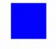
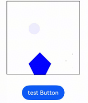

# ArkTS1.1使用ArkTS1.2对象

## 概述

从API version 20开始，[RenderNode](../reference/apis-arkui/js-apis-arkui-renderNode.md)，[FrameNode](../reference/apis-arkui/js-apis-arkui-frameNode.md)，[UIContext](../reference/apis-arkui/js-apis-arkui-UIContext.md)，[Resource](../reference/apis-arkui/arkui-ts/ts-types.md)，[ShapeClip](../reference/apis-arkui/js-apis-arkui-graphics.md#shapeclip12)，[LengthMetrics](../reference/apis-arkui/js-apis-arkui-graphics.md#lengthmetrics12)，[ColorMetrics](../reference/apis-arkui/js-apis-arkui-graphics.md#colormetrics12)，[ShapeMask](../reference/apis-arkui/js-apis-arkui-graphics.md#shapemask12) 对象互操作适用于[ArkTS1.2互操作](../quick-start/arkts-interop-overview.md)中使用。

**限制条件**

- 遵循语言[交互基本原则](../quick-start/arkts-interop-overview.md#交互基本原则)的规范。

## 项目架构

```text
project/
├── entry/          # ArkTS1.1主模块
│   └── src/
│       └── main/
│           └── ets/
│               └── pages/
│                   └── Index.ets
│
└── library/         # ArkTS1.2子模块
    └── src/
       ├── main/
       │     └── ets/
       │        └── components/
       │          └── MainPage.ets
       └── Index.ets
```

- 创建ArkTS1.2子模块`library`，在`library/src/main/ets/components`目录创提创建ArkTS1.2对象并转换为ArkTS1.1对象返回。

  ```TypeScript
  // library/src/main/ets/components/MainPage.ets

  import transfer from '@ohos.transfer';

  export function xxxObjectTrans():Object {
    // todo 创建ArkTS1.1对象
    let staticObject:XXXObject = new XXXObject();
     //通过互操作接口转换为对应的ArkTS1.2对象 转换的参数类型
    let xxxObjectDynamic = transfer.transferDynamic(xxxObject, 'ArkUI.XXXobject');
     // 返回 ArkTS1.1对象
     return xxxObjectDynamic!;
  }
  ```
- 导出MainPage.ets中定义的方法。

  ```TypeScript
  // library/Index.ets

  export { xxxObjectTrans } from './src/main/ets/components/MainPage';
  ```


- 在主模块`entry`的`oh-package.json5`文件中配置子模块依赖。

  ```json
  // entry/oh-package.json5

  "dependencies": {
    "library": "file:../library"
  }
  ```

- 在ArkTS1.1主模块中引入ArkTS1.2模块创建的对象对象。

  ```TypeScript
  'use static'
  // entry/src/main/ets/pages/Index.ets

  import { Entry, Text, Column, Component, NodeContainer, Resource, Button } from '@ohos.arkui.component';
  import { State } from '@ohos.arkui.stateManagement';
  import transfer from '@ohos.transfer';
  import { xxxObjectTrans } from 'library';

  function xxxObjectTransTest(): XXXobject{
    // 创建ArkTS1.1对象
    let xxxObject = xxxObjectTrans();
    //通过互操作接口转换为对应的ArkTS1.2对象 转换的参数类型
    let xxxObjectDynamic = xxxObject as XXXobject;
    return xxxObjectDynamic;
  }
  ```
## 对象类型

### ArkTS1.1中使用ArkTS1.2FrameNode对象类型

通过在ArkTS1.2中引用ArkTS1.1创建的FrameNode对象显示Text文本。


- 创建ArkTS1.1子模块`library`，在`library/src/main/ets/components`目录创提创建ArkTS1.1FrameNode的方法。

  ```TypeScript
  // library/src/main/ets/components/MainPage.ets
  
  import { typeNode, FrameNode, UIContext } from '@kit.ArkUI';
  
  export function createFrameNode(context:Object): Object {
    let uiContext:UIContext = context as UIContext;
    let textNode = typeNode.createNode(uiContext, 'Text');
    textNode.initialize('hello word');
    return textNode;
  }
  ```

- 在ArkTS1.2主模块中引入ArkTS1.1 FrameNode对象。

  ```TypeScript
  // entry/src/main/ets/pages/Index.ets

  'use static'

  import { Entry, Text, Column, Component, NodeContainer} from '@ohos.arkui.component';
  import { State } from '@ohos.arkui.stateManagement';
  import {NodeController ,FrameNode, typeNode } from '@ohos.arkui.node';
  import transfer from '@ohos.transfer';
  import {UIContext} from '@ohos.arkui.UIContext';
  import { createFrameNode } from 'library';

  export function FrameNodeTrans(uiContext:UIContext):FrameNode {
    // 通过互操作转换ArkTS1.2UIContext对象为ArkTS1.1UIContext对象
    let uiContextDynamic = transfer.transferDynamic(uiContext, 'ArkUI.UIContext');
    // 调用ArkTS1.1的方法创建FrameNode对象
    let frameNode = createFrameNode(uiContextDynamic! as Object);
    // 通过互操作转换ArkTS1.1FrameNode对象为ArkTS1.2FrameNode对象
    let frameNodeStatic = transfer.transferStatic(frameNode, 'ArkUI.FrameNode')! as FrameNode;
    return frameNodeStatic;
  }
  class TestNodeController extends NodeController {
    makeNode(uiContext:UIContext):FrameNode|null {
        let rootNode = new FrameNode(uiContext);
        rootNode.commonAttribute.width(100);
        rootNode.commonAttribute.height(100);
        rootNode.appendChild(FrameNodeTrans(uiContext));
        return rootNode;
    }
  }
  
  @Entry
  @Component
  struct MyStateSample {
    nodeController: TestNodeController = new TestNodeController();
    build() {
      Column(undefined) {
         NodeContainer(this.nodeController).width(100).height(100).border({width:1}).margin(10)
      }
    }
  }
  ```
  

### ArkTS1.2中使用ArkTS1.1RenderNode对象类型


- 创建ArkTS1.1子模块`library`，在`library/src/main/ets/components`目录创提创建ArkTS1.1RenderNode的方法。

  ```TypeScript
  // library/src/main/ets/components/MainPage.ets

  import { RenderNode } from '@kit.ArkUI';

  export function renderNodeTest():Object {
    let shapeMaskTestNode =new RenderNode();
    shapeMaskTestNode.position = { x: 0, y: 0 };
    shapeMaskTestNode.size = { width: 80, height: 80 }
    shapeMaskTestNode.backgroundColor = 0xff0000ff;
    return shapeMaskTestNode;
  }
  ```

- 在ArkTS1.2主模块中引入ArkTS1.1 WrappedBuilder对象。

  ```TypeScript
  'use static'
  // entry/src/main/ets/pages/Index.ets

  import { Entry, Text, Column, Component, NodeContainer, Resource, Button } from '@ohos.arkui.component';
  import { State } from '@ohos.arkui.stateManagement';
  import transfer from '@ohos.transfer';
  import { UIContext } from '@ohos.arkui.UIContext';
  import { FrameNode, RenderNode, NodeController } from '@ohos.arkui.node';
  import { renderNodeTest } from 'library';

  function renderNodeTrans(): RenderNode{
    let renderNode = renderNodeTest();
    let renderNodeStatic = transfer.transferStatic(renderNode, 'ArkUI.RenderNode')! as RenderNode;
    return renderNodeStatic;
  }

  class TestNodeController extends NodeController {
    makeNode(uiContext: UIContext): FrameNode | null {
      let rootNode = new FrameNode(uiContext);
      const rootRenderNode = rootNode?.getRenderNode();
      if (rootRenderNode !== null) {
        rootRenderNode?.appendChild(renderNodeTrans());
      }
      return rootNode;
    }
  }

  @Entry
  @Component
  struct MyStateSample {
    nodeController: TestNodeController = new TestNodeController();

    build() {
      Column(undefined) {
        NodeContainer(this.nodeController)
      }
    }
  }
  ```
   

### ArkTS1.2中使用ArkTS1.1LengthMetrics、ColorMetrics、ShapeMask、ShapeClip对象类型

- 创建ArkTS1.1子模块`library`，在`library/src/main/ets/components`目录创提创建ArkTS1.1 LengthMetrics、ColorMetrics、shapeMask、shapeClip的方法。

  ```TypeScript
  // library/src/main/ets/components/MainPage.ets
  import { ShapeClip, ColorMetrics, ShapeMask, LengthMetrics, RenderNode } from  '@kit.ArkUI';

  export function shapeMaskTest(): Object {
    const mask = new ShapeMask();
    const roundRect: RoundRect = {
      rect: {
        left: 0,
        top: 0,
        right: 100,
        bottom: 100
      },
      corners: {
        topLeft: { x: 50, y: 50 },
        topRight: { x: 50, y: 50 },
        bottomLeft: { x: 50, y: 50 },
        bottomRight: { x: 50, y: 50 }
      }
    }
    mask.setRoundRectShape(roundRect);
    mask.fillColor = 0X50FF0000;
    return mask;
  }
  export function shapeClipTest(): Object {
    let shapeClip = new ShapeClip();
    shapeClip.setCommandPath({ commands: "M100 0 L0 100 L50 200 L150 200 L200 100 Z" });
    return shapeClip;
  }
  
  export function resourceTest(): Object {
    return $r('app.float.node_container_size');
  }
  
  export function colorMetricsTest(): Object {
    return ColorMetrics.numeric(10);
  }
  
  export function lengthMetricsTest(): Object {
    return LengthMetrics.px(30);
  }
  
  export function renderNodeTest():Object {
    let shapeMaskTestNode =new RenderNode();
    shapeMaskTestNode.position = { x: 0, y: 0 };
    shapeMaskTestNode.size = { width: 80, height: 80 }
    shapeMaskTestNode.backgroundColor = 0xff0000ff;
    return shapeMaskTestNode;
  }
  ```

- 在ArkTS1.2主模块中引入ArkTS1.1导出的方法创建对象并转换为ArkTS1.2对象。

  ```TypeScript
  'use static'

  // entry/src/main/ets/pages/Index.ets

  import { Entry, Text, Column, Component, NodeContainer, Resource, Button } from '@ohos.arkui.component';
  import { State } from '@ohos.arkui.stateManagement';
  import transfer from '@ohos.transfer';
  import { UIContext } from '@ohos.arkui.UIContext';
  import {NodeController, FrameNode, LengthUnit, ShapeClip, ColorMetrics, ShapeMask, RenderNode, LengthMetrics, RoundRect } from '@ohos.arkui.node';
  import { lengthMetricsTest, colorMetricsTest, shapeMaskTest, shapeClipTest, resourceTest, renderNodeTest } from 'library';

  const shapeMaskTestNode: RenderNode = renderNodeTrans();
  const shapeClipTestNode: RenderNode = new RenderNode()
  // 初始化RenderNode
  shapeClipTestNode.position = { x: 0, y: 80 };
  shapeClipTestNode.size = { width: 80, height: 80 }
  shapeClipTestNode.backgroundColor = 0xff0000ff;

  // ShapeMask ShapeClip 对象转换
  export function shapeTrans(rootNode: FrameNode) {
    // 调用ArkTS1.1方法获取ShapeMask对象
    let shapeMask = shapeMaskTest();
    // 调用ArkTS1.1方法获取ShapeClip对象
    let shapeClip = shapeClipTest();
    let shapeClipStatic = transfer.transferStatic(shapeClip, 'ArkUI.ShapeClip')! as ShapeClip;
    let shapeMaskStatic = transfer.transferStatic(shapeMask, 'ArkUI.ShapeMask')! as ShapeMask;
    const rootRenderNode = rootNode?.getRenderNode();
    if (rootRenderNode !== null) {
      shapeMaskTestNode.shapeMask = shapeMaskStatic;
      shapeClipTestNode.shapeClip = shapeClipStatic;
      rootRenderNode?.appendChild(shapeMaskTestNode);
      rootRenderNode?.appendChild(shapeClipTestNode);
    }
  }
  // Resource对象互操作
  export function resourceTrans():Resource {
    let resourceDynamic = resourceTest();
    return  transfer.transferStatic(resourceDynamic, 'Global.Resource')! as Resource;
  }
  // ColorMetrics对象互操作
  function colorMetricsTrans():ColorMetrics {
    let colorMetrics = colorMetricsTest();
    let colorMetricsStatic = transfer.transferStatic(colorMetrics, 'ArkUI.ColorMetrics')! as ColorMetrics;
    return colorMetricsStatic;
  }
  // RenderNode对象互操作
  function renderNodeTrans():RenderNode {
    let renderNode = renderNodeTest();
    let renderNodeStatic = transfer.transferStatic(renderNode, 'ArkUI.RenderNode')! as RenderNode;
    return renderNodeStatic;
  }
  // lengthMetrics对象互操作
  function lengthMetricsTrans(): LengthMetrics {
    let lengthMetrics = lengthMetricsTest();
    let lengthMetricsStatic = transfer.transferStatic(lengthMetrics, 'ArkUI.LengthMetrics')! as LengthMetrics;
    return lengthMetricsStatic;
  }
  
  class TestNodeController extends NodeController {
    makeNode(uiContext: UIContext): FrameNode | null {
      let rootNode = new FrameNode(uiContext);
      shapeTrans(rootNode);
      return rootNode;
    }
  }

  @Entry
  @Component
  struct MyStateSample {
    nodeController: TestNodeController = new TestNodeController();

    build() {
      Column(undefined) {
        NodeContainer(this.nodeController)
          .size({width:resourceTrans(), height:resourceTrans()})
          .border({width:1})
        Button("test Button").focusBox({
          margin: LengthMetrics.px(20),
          strokeColor: colorMetricsTrans(),
          strokeWidth: lengthMetricsTrans()
        }).margin(30)
      }
    }
  }
  ```
  

  ### ArkTS1.2中使用ArkTS1.1Resource对象类型

  通过在ArkTS1.2中引用ArkTS1.1创建的Resource对象显示图片。

- 创建ArkTS1.1子模块`library`，在`library/src/main/ets/components`目录创提创建ArkTS1.1Resource的方法。

  ```TypeScript
  // library/src/main/ets/components/MainPage.ets

  export function rawFileTest() {
    return $rawfile('startIcon.png');
  }

  export function resourceTest(): Object {
    return $r('app.float.image_size');
  }
  ```

- 在ArkTS1.2主模块中引入ArkTS1.1 Resource对象。

  ```TypeScript
  'use static'
  // entry/src/main/ets/pages/Index.ets
  
  import { Entry, Column, Component, Resource, Image } from '@ohos.arkui.component';
  import transfer from '@ohos.transfer';
  import { resourceTest, rawFileTest } from 'library';

  // Resource $r对象互操作
  export function resourceTrans(): Resource {
     let resourceDynamic = resourceTest();
     return transfer.transferStatic(resourceDynamic, 'Global.Resource')! as Resource;

  }
  // Resource RawFile对象互操作
  export function rawFileTrans(): Resource {
    let resourceDynamic = rawFileTest();
    return transfer.transferStatic(resourceDynamic, 'Global.Resource')! as Resource;
  }
  
  @Entry
  @Component
  struct MyStateSample {
    build() {
      Column(undefined) {
        Image(rawFileTrans())
          .size({width:resourceTrans(), height:resourceTrans()})
      }
    }
  }
  ```
  

  ### 在ArkTS1.1中使用ArkTS1.2获取的UIContext对象
- 创建ArkTS1.1子模块`library`，在`library/src/main/ets/components`目录创提创建ArkTS1.1 使用UIContext的方法。

  ```TypeScript
  // library/src/main/ets/components/MainPage.ets

  import { UIContext } from '@kit.ArkUI';

  const vpTest:number = 200;
  export function uiContextTest(uiContext:Object): number {
    let uiContextDynamic = uiContext as UIContext;
    return uiContextDynamic.px2vp(vpTest);
  }
  ```
  
- 在ArkTS1.2主模块中获取UIContext并传递给ArkTS1.1。

  ```TypeScript
  'use static'
  // entry/src/main/ets/pages/Index.ets

  import { Entry, Column, Component, Resource, Image } from '@ohos.arkui.component';
  import transfer from '@ohos.transfer';
  import { uiContextTest } from 'library';
  import { UIContext } from '@ohos.arkui.UIContext';
  
  // uiContext互操作
  export function uiContextTrans(uiContext:UIContext): number {
    let uiContextDynamic = transfer.transferDynamic(uiContext, 'ArkUI.UIContext');
    return uiContextTest(uiContextDynamic);
  }

  @Entry
  @Component
  struct MyStateSample {
    build() {
      Column(undefined) {
        Column()
          .backgroundColor('#ff0000ff')
          .size({width:uiContextTrans(this.getUIContext()), height:uiContextTrans(this.getUIContext())})
      }
    }
  }
  ```
  