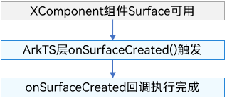
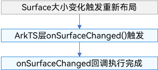
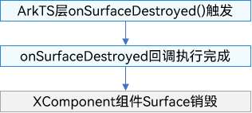
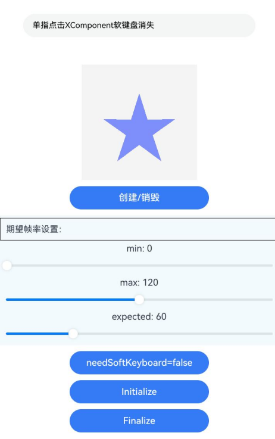

# 自定义渲染 (XComponent)
<!--Kit: ArkUI-->
<!--Subsystem: ArkUI-->
<!--Owner: @zjsxstar-->
<!--Designer: @dutie123-->
<!--Tester: @liuli0427-->
<!--Adviser: @Brilliantry_Rui-->

## 概述

XComponent组件作为一种渲染组件，可用于EGL/OpenGLES和媒体数据写入，通过使用XComponent持有的“[NativeWindow](../graphics/native-window-guidelines.md)”渲染画面，满足开发需要实现高级自定义渲染的需求，例如相机预览流的显示和游戏画面的渲染。开发者可通过指定XComponent组件的type字段来实现不同的渲染方式，分别为[XComponentType](../reference/apis-arkui/arkui-ts/ts-appendix-enums.md#xcomponenttype10).SURFACE和XComponentType.TEXTURE。对于SURFACE类型，开发者将定制的绘制内容单独展示到屏幕上。对于TEXTURE类型，开发者将定制的绘制内容和XComponent组件的内容合成后展示到屏幕上。

可以将XComponent类比为一个“画布”，在其上支持使用各种渲染技术（如OpenGL、Vulkan等）绘制复杂的图形，而XComponent组件则负责管理这个画布的位置、大小和各种交互事件。

目前XComponent主要用于两类场景：

| 场景类型     | 使用场景                         |
| ------------ | -------------------------------- |
| 高性能渲染   | 游戏画面、3D图形、复杂动画等。   |
| 媒体数据处理 | 相机预览、视频播放、图像处理等。 |

## 约束与限制

当开发者传输的绘制内容包含透明元素时，Surface区域的显示效果会与下方内容进行合成展示。例如，若传输的内容完全透明，且XComponent的背景色被设置为黑色，同时Surface保持默认的大小与位置，则最终显示的将是一片黑色区域。

## XComponent渲染上屏原理

XComponent持有一个Surface，开发者能通过调用[NativeWindow](../graphics/native-window-guidelines.md)等接口，申请并提交Buffer至图形队列，以此方式将自绘制内容传送至该Surface，其主体流程如下：

应用`RequestBuffer`获取空闲帧 → 应用生产帧数据 → 应用调用`FlushBuffer`提交到BufferQueue → 系统渲染侧通过`AcquireBuffer`获取帧 → 渲染到屏幕 → 系统渲染侧通过调用`ReleaseBuffer`释放。

经过上述流程，应用自绘制的内容就可以显示在XComponent持有的Surface区域，而XComponent则负责将此Surface整合进UI界面，其中展示的内容正是开发者发送的自绘制内容。Surface的默认位置与大小与XComponent组件一致，开发者可利用[setXComponentSurfaceRect](../reference/apis-arkui/arkui-ts/ts-basic-components-xcomponent.md#setxcomponentsurfacerect12)接口自定义调整Surface的位置和大小。XComponent组件负责创建Surface，并通过回调将Surface的相关信息告知应用。应用可以通过一系列接口设定Surface的属性。该组件本身不对所绘制的内容进行感知，亦不提供渲染绘制的接口。

> **说明：**
>
> 主体流程中提到需要应用进行的`RequestBuffer`和`FlushBuffer`操作，在具体场景下一般已经被相关API（如相机模块、播放器模块、OpenGL相关接口等）封装，应用的实际开发者只需按要求调用这些API即可，不需要直接操作BufferQueue。

## 创建XComponent和管理Surface生命周期

为满足开发者的各种需求，XComponent组件提供了多种创建方式以及多种Surface生命周期的管理方式，下面将进行介绍。

### 创建XComponent

目前ArkUI提供了三种UI组件的创建方式，分别是使用[ArkTS声明式UI描述](./state-management/arkts-declarative-ui-description.md)创建、使用[ArkTS自定义组件节点](./arkts-user-defined-arktsNode-frameNode.md)创建以及使用[NDK接口](./ndk-build-ui-overview.md)创建。

通用UI界面开发场景下，建议使用ArkTS声明式UI描述创建XComponent组件。对于需要使用ArkTS自定义组件节点创建以及NDK接口创建的具体场景请参考这两种创建方式的相关介绍。

### 管理XComponent持有Surface的生命周期

在[XComponent渲染上屏原理](#xcomponent渲染上屏原理)中提到，XComponent能够显示应用自绘制的内容依赖的是其持有的Surface，因此了解如何获取XComponent持有的Surface的生命周期也十分重要。

XComponent推荐使用两种方式获取XComponent持有Surface的生命周期，分别为在ArkTS侧使用[XComponentController](../reference/apis-arkui/arkui-ts/ts-basic-components-xcomponent.md#xcomponentcontroller)管理Surface生命周期，以及在Native侧使用[OH_ArkUI_SurfaceHolder](../reference/apis-arkui/capi-oh-nativexcomponent-native-xcomponent-oh-arkui-surfaceholder.md)管理Surface生命周期。

对于需要在ArkTS侧使用已封装接口进行功能开发（如相机预览、视频播放等）或对跨语言性能损耗不敏感的跨语言开发，建议直接在ArkTS侧使用XComponentController管理Surface生命周期。其生命周期的触发时机如下：

- onSurfaceCreated回调

  触发时刻：XComponent创建完成且创建好Surface后触发。

  ArkTS侧onSurfaceCreated的时序如下图：

  

- onSurfaceChanged回调

  触发时刻：Surface大小变化触发重新布局之后触发。

  ArkTS侧onSurfaceChanged的时序如下图：

  

- onSurfaceDestroyed回调

  触发时刻：XComponent组件被销毁时触发，与一般ArkUI的组件销毁时机一致。

  ArkTS侧onSurfaceDestroyed的时序图：

  

对于复杂的交互逻辑需跨语言开发，追求极致渲染性能或业务需求自主控制Surface的创建和销毁的，建议在Native侧使用OH_ArkUI_SurfaceHolder管理Surface生命周期。其生命周期触发时机如下：

- OnSurfaceCreated回调    

  触发时刻：当XComponent创建完成且创建好Surface后，满足以下任一条件时触发。
  1. 组件上树且autoInitialize = true。
  2. 调用OH_ArkUI_XComponent_Initialize。

  Native侧OnSurfaceCreated的时序如下图：

  
- OnSurfaceChanged回调
  
  触发时刻：OnSurfaceCreated回调成功触发且Surface大小变化触发重新布局之后触发。

  Native侧OnSurfaceChanged的时序如下图：

  

- OnSurfaceDestroyed回调

  触发时刻：组件下树且autoInitialize=true 或者调用 OH_ArkUI_XComponent_Finalize后触发。

  Native侧OnSurfaceDestroyed的时序图：

  

### XComponent的开发范式

将[创建XComponent](#创建xcomponent)和[管理XComponent持有Surface的生命周期](#管理xcomponent持有surface的生命周期)进行排列组合，除使用NDK接口创建的XComponent无法在ArkTS侧使用XComponentController来管理Surface生命周期外，目前共有以下五种XComponent开发范式：

- 通过ArkTS声明式UI描述来创建组件并结合XComponentController实现对Surface生命周期的管理。

  <!-- @[xcomponent_index](https://gitcode.com/openharmony/applications_app_samples/blob/master/code/BasicFeature/Native/ArkTSXComponent/entry/src/main/ets/pages/Index.ets) -->

  ``` TypeScript
  import nativeRender from 'libnativerender.so';
  
  // 重写XComponentController，设置生命周期回调
  class MyXComponentController extends XComponentController{
    onSurfaceCreated(surfaceId: string): void {
      console.info(`onSurfaceCreated surfaceId: ${surfaceId}`);
      nativeRender.SetSurfaceId(BigInt(surfaceId));
    }
    onSurfaceChanged(surfaceId: string, rect: SurfaceRect): void {
      console.info(`onSurfaceChanged surfaceId: ${surfaceId}, rect: ${JSON.stringify(rect)}}`);
      // 在onSurfaceChanged中调用ChangeSurface绘制内容
      nativeRender.ChangeSurface(BigInt(surfaceId), rect.surfaceWidth, rect.surfaceHeight);
    }
    onSurfaceDestroyed(surfaceId: string): void {
      console.info(`onSurfaceDestroyed surfaceId: ${surfaceId}`);
      nativeRender.DestroySurface(BigInt(surfaceId));
    }
  }
  
  @Entry
  @Component
  struct Index {
    @State currentStatus: string = 'index';
    xComponentController: XComponentController = new MyXComponentController();
    build() {
      Column() {
        // ···
        //在xxx.ets中定义XComponent
        Column({ space: 10 }) {
          XComponent({
            type: XComponentType.SURFACE,
            controller: this.xComponentController
          })
          Text(this.currentStatus)
            .fontSize('24fp')
            .fontWeight(500)
        }
        .onClick(() => {
          let surfaceId = this.xComponentController.getXComponentSurfaceId();
          nativeRender.ChangeColor(BigInt(surfaceId));
          let hasChangeColor: boolean = false;
          if (nativeRender.GetXComponentStatus(BigInt(surfaceId))) {
            hasChangeColor = nativeRender.GetXComponentStatus(BigInt(surfaceId)).hasChangeColor;
          }
          if (hasChangeColor) {
            this.currentStatus = "change color";
          }
        })
        // ···
      }
      .width('100%')
      .height('100%')
    }
  }
  ```
  
- 通过ArkTS声明式UI描述来创建组件并结合OH_ArkUI_SurfaceHolders实现对Surface生命周期的管理。

  <!-- @[surface_holder_declarative_ets](https://gitcode.com/openharmony/applications_app_samples/blob/master/code/BasicFeature/Native/NativeXComponent/entry/src/main/ets/pages/SurfaceHolderDeclarative.ets) -->

  ``` typescript
  import native from 'libnativerender.so';
  
  // ...
  
  @Component
  export struct SurfaceHolderDeclarative {
    @State currentStatus: string = 'init';
    private xcNode: FrameNode | null = null;
    build() {
      NavDestination() {
        // ...
        Column({ space: 10 }) {
          // 创建XComponent组件
          XComponent({
            type: XComponentType.SURFACE,
          })
            .id('XComponentSurfaceHolder')
            .onAttach(() => {
              this.xcNode = this.getUIContext().getAttachedFrameNodeById('XComponentSurfaceHolder');
              if (!this.xcNode) {
                return;
              }
              native.bindNode('XComponentSurfaceHolder', this.xcNode); // 跨语言调用至Native侧获取SurfaceHolder并绑定Surface生命周期回调
            })
            .onDetach(() => {
              native.unbindNode('XComponentSurfaceHolder');
              this.xcNode = null;
            })
        }
        // ...
      }
    }
  }
  ```

  <!-- @[surface_holder_declarative_c_bind](https://gitcode.com/openharmony/applications_app_samples/blob/master/code/BasicFeature/Native/NativeXComponent/entry/src/main/cpp/manager/plugin_manager.cpp) -->
  ``` c++
  napi_value PluginManager::BindNode(napi_env env, napi_callback_info info)
  {
      size_t argc = 2;
      napi_value args[2] = {nullptr};
      napi_get_cb_info(env, info, &argc, args, nullptr, nullptr);
      std::string nodeId = value2String(env, args[0]);
      ArkUI_NodeHandle handle;
      OH_ArkUI_GetNodeHandleFromNapiValue(env, args[1], &handle);             // 获取nodeHandle
      OH_ArkUI_SurfaceHolder *holder = OH_ArkUI_SurfaceHolder_Create(handle); // 获取SurfaceHolder
      nodeHandleMap_[nodeId] = handle;
      surfaceHolderMap_[handle] = holder;
      auto callback = OH_ArkUI_SurfaceCallback_Create(); // 创建SurfaceCallback
      callbackMap_[holder] = callback;
      auto render = new EGLRender();
      OH_ArkUI_SurfaceHolder_SetUserData(holder, render);                                // 将render保存在holder中
      OH_ArkUI_SurfaceCallback_SetSurfaceCreatedEvent(callback, OnSurfaceCreatedNative); // 注册OnSurfaceCreated回调
      OH_ArkUI_SurfaceCallback_SetSurfaceChangedEvent(callback, OnSurfaceChangedNative); // 注册OnSurfaceChanged回调
      OH_ArkUI_SurfaceCallback_SetSurfaceDestroyedEvent(callback, OnSurfaceDestroyedNative); // 注册OnSurfaceDestroyed回调
      OH_ArkUI_SurfaceHolder_AddSurfaceCallback(holder, callback);                // 注册SurfaceCallback回调
      // ...
      return nullptr;
  }
  ```
  
- 通过ArkTS自定义组件节点来创建组件并结合XComponentController实现对Surface生命周期的管理。
  ``` typescript
  // 重写XComponentController，设置生命周期回调
  class MyXComponentController extends XComponentController {
    onSurfaceCreated(surfaceId: string): void {
      console.info(`onSurfaceCreated surfaceId: ${surfaceId}`);
    }
  
    onSurfaceChanged(surfaceId: string, rect: SurfaceRect): void {
      console.info(`onSurfaceChanged surfaceId: ${surfaceId}, rect: ${JSON.stringify(rect)}}`);
    }
  
    onSurfaceDestroyed(surfaceId: string): void {
      console.info(`onSurfaceDestroyed surfaceId: ${surfaceId}`);
    }
  }
  
  class MyNodeController extends NodeController {
    public xComponent: typeNode.XComponent | undefined = undefined;
    public xComponentId: string = 'xcp' + (new Date().getTime());
    public node: FrameNode | undefined = undefined;
    public column: typeNode.Column | undefined = undefined;
    private xcController: MyXComponentController = new MyXComponentController();
  
    makeNode(uiContext: UIContext): FrameNode | null {
      this.node = new FrameNode(uiContext);
      this.column = typeNode.createNode(uiContext, 'Column')
      this.column.initialize()
        .width('100%')
        .height('100%')
      try {
        this.node.appendChild(this.column);
      } catch (error) {
        console.error('Fail to append child: ', error);
      }
      // 创建XComponent组件节点，并绑定XComponentController
      this.xComponent =
        typeNode.createNode(uiContext, 'XComponent', { type: XComponentType.SURFACE, controller: this.xcController });
      this.xComponent.attribute
      try {
        this.column.appendChild(this.xComponent);
      } catch (error) {
        console.error('Fail to append child: ', error);
      }
      return this.node;
    }
  }
  ```
  
- 通过ArkTS自定义组件节点来创建组件并结合OH_ArkUI_SurfaceHolder实现对Surface生命周期的管理。
  <!-- @[surface_holder_type_node_ets](https://gitcode.com/openharmony/applications_app_samples/blob/master/code/BasicFeature/Native/NativeXComponent/entry/src/main/ets/pages/SurfaceHolderTypeNode.ets) -->
  ``` typescript
  import native from 'libnativerender.so';
  import { FrameNode, NodeController, typeNode, UIContext } from '@kit.ArkUI';
  
  class MyNodeController extends NodeController {
    // ...
  
    makeNode(uiContext: UIContext): FrameNode | null {
      // ...
      // 创建XComponent组件节点
      this.xComponent = typeNode.createNode(uiContext, 'XComponent', { type: XComponentType.SURFACE });
      this.xComponent.attribute
        .id(this.xComponentId)
        .focusable(true)
        .focusOnTouch(true)
      native.bindNode(this.xComponentId, this.xComponent) // 跨语言调用至Native侧绑定Surface生命周期回调
      // ...
    }
  
    // ...
  }
  
  // ...
  
  @Component
  export struct SurfaceHolderTypeNode {
    // ...
    myNodeController: MyNodeController = new MyNodeController();
  
    build() {
      NavDestination() {
        Column() {
          // ...
          Column() {
            if (this.isShow) {
              NodeContainer(this.myNodeController)
                .width(200)
                .height(200)
                .focusable(true)
                .focusOnTouch(true)
                .defaultFocus(true)
            }
          }.height(200)
          // ...
        }
        .width('100%')
      }
    }
  }
  ```
  
  <!-- @[surface_holder_declarative_c_bind](https://gitcode.com/openharmony/applications_app_samples/blob/master/code/BasicFeature/Native/NativeXComponent/entry/src/main/cpp/manager/plugin_manager.cpp) -->
  ``` c++
  napi_value PluginManager::BindNode(napi_env env, napi_callback_info info)
  {
      size_t argc = 2;
      napi_value args[2] = {nullptr};
      napi_get_cb_info(env, info, &argc, args, nullptr, nullptr);
      std::string nodeId = value2String(env, args[0]);
      ArkUI_NodeHandle handle;
      OH_ArkUI_GetNodeHandleFromNapiValue(env, args[1], &handle);             // 获取nodeHandle
      OH_ArkUI_SurfaceHolder *holder = OH_ArkUI_SurfaceHolder_Create(handle); // 获取SurfaceHolder
      nodeHandleMap_[nodeId] = handle;
      surfaceHolderMap_[handle] = holder;
      auto callback = OH_ArkUI_SurfaceCallback_Create(); // 创建SurfaceCallback
      callbackMap_[holder] = callback;
      auto render = new EGLRender();
      OH_ArkUI_SurfaceHolder_SetUserData(holder, render);                                // 将render保存在holder中
      OH_ArkUI_SurfaceCallback_SetSurfaceCreatedEvent(callback, OnSurfaceCreatedNative); // 注册OnSurfaceCreated回调
      OH_ArkUI_SurfaceCallback_SetSurfaceChangedEvent(callback, OnSurfaceChangedNative); // 注册OnSurfaceChanged回调
      OH_ArkUI_SurfaceCallback_SetSurfaceDestroyedEvent(callback, OnSurfaceDestroyedNative); // 注册OnSurfaceDestroyed回调
      OH_ArkUI_SurfaceHolder_AddSurfaceCallback(holder, callback);                // 注册SurfaceCallback回调
      return nullptr;
  }
  ```
  
- 通过NDK接口来创建组件并使用OH_ArkUI_SurfaceHolder实现对Surface生命周期的管理。
  <!-- @[surface_holder_ndk_ets](https://gitcode.com/openharmony/applications_app_samples/blob/master/code/BasicFeature/Native/NativeXComponent/entry/src/main/ets/pages/SurfaceHolderNDK.ets) -->
  ``` typescript
  @Component
  export struct SurfaceHolderNDK {
    @State currentStatus: string = 'init';
    private nodeContent: NodeContent = new NodeContent();
  
    aboutToAppear(): void {
      nativeNode.createNativeNode(this.nodeContent, 'SurfaceHolderNDK');
      this.currentStatus = 'index'
    }
  
    build() {
      NavDestination() {
        Column() {
          // ...
          Column({ space: 10 }) {
            ContentSlot(this.nodeContent);
            // ...
          }
          // ...
        }
        .width('100%')
        .height('100%')
      }
    }
  }
  ```
  
  <!-- @[surface_holder_ndk_createNode](https://gitcode.com/openharmony/applications_app_samples/blob/master/code/BasicFeature/Native/NativeXComponent/entry/src/main/cpp/manager/plugin_manager.cpp) -->
  ``` c++
  napi_value PluginManager::createNativeNode(napi_env env, napi_callback_info info)
  {
      // ...
      ArkUI_NodeContentHandle nodeContentHandle_ = nullptr;
      OH_ArkUI_GetNodeContentFromNapiValue(env, args[0], &nodeContentHandle_);
      nodeAPI = reinterpret_cast<ArkUI_NativeNodeAPI_1 *>(
          OH_ArkUI_QueryModuleInterfaceByName(ARKUI_NATIVE_NODE, "ArkUI_NativeNodeAPI_1"));
      std::string tag = value2String(env, args[1]);
      // ...
      if (nodeAPI != nullptr && nodeAPI->createNode != nullptr && nodeAPI->addChild != nullptr) {
          OH_LOG_Print(LOG_APP, LOG_ERROR, LOG_PRINT_DOMAIN, "PluginManager", "CreateNativeNode tag=%{public}s",
                       tag.c_str());
          auto nodeContentEvent = [](ArkUI_NodeContentEvent *event) {
            ArkUI_NodeContentHandle handle = OH_ArkUI_NodeContentEvent_GetNodeContentHandle(event);
            std::string *userData = reinterpret_cast<std::string *>(OH_ArkUI_NodeContent_GetUserData(handle));
            if (!userData) {
                return;
            }
            if (OH_ArkUI_NodeContentEvent_GetEventType(event) != NODE_CONTENT_EVENT_ON_ATTACH_TO_WINDOW) {
                return;
            }
            ArkUI_NodeHandle testNode;
            if (userData->find("SurfaceHolder") == std::string::npos) {
                // ...
            } else {
                // 创建XComponent组件并使用SurfaceHolder管理Surface生命周期
                testNode = CreateNodeHandleUsingSurfaceHolder(*userData);
            }
            delete userData;
            userData = nullptr;
            OH_ArkUI_NodeContent_AddNode(handle, testNode);
        };
          OH_ArkUI_NodeContent_RegisterCallback(nodeContentHandle_, nodeContentEvent);
      }
      return nullptr;
  }
  ```

  <!-- @[surface_holder_ndk_create_xc_node](https://gitcode.com/openharmony/applications_app_samples/blob/master/code/BasicFeature/Native/NativeXComponent/entry/src/main/cpp/manager/plugin_manager.cpp) -->
  ``` c++
  ArkUI_NodeHandle CreateNodeHandleUsingSurfaceHolder(const std::string &tag)
  {
      ArkUI_NodeHandle column = nodeAPI->createNode(ARKUI_NODE_COLUMN); // 创建Column节点
      // ...
      xc = nodeAPI->createNode(ARKUI_NODE_XCOMPONENT); // 创建XComponent节点
      // ...
      OH_ArkUI_SurfaceHolder *holder = OH_ArkUI_SurfaceHolder_Create(xc); // 获取 SurfaceHolder
      PluginManager::surfaceHolderMap_[xc] = holder;
      PluginManager::nodeHandleMap_[tag] = xc;
      auto callback = OH_ArkUI_SurfaceCallback_Create(); // 创建 SurfaceCallback
      PluginManager::callbackMap_[holder] = callback;
      auto render = new EGLRender();
      OH_ArkUI_SurfaceHolder_SetUserData(holder, render);                                // 将render保存在holder中
      OH_ArkUI_SurfaceCallback_SetSurfaceCreatedEvent(callback, OnSurfaceCreatedNative); // 注册OnSurfaceCreated回调
      OH_ArkUI_SurfaceCallback_SetSurfaceChangedEvent(callback, OnSurfaceChangedNative); // 注册OnSurfaceChanged回调
      OH_ArkUI_SurfaceCallback_SetSurfaceDestroyedEvent(callback, OnSurfaceDestroyedNative); // 注册OnSurfaceDestroyed回调
      OH_ArkUI_SurfaceHolder_AddSurfaceCallback(holder, callback); // 添加SurfaceCallback回调
      if (!nodeAPI->addNodeEventReceiver(xc, onEvent)) {           // 添加事件监听，返回成功码 0
          OH_LOG_Print(LOG_APP, LOG_ERROR, LOG_PRINT_DOMAIN, "onBind", "addNodeEventReceiver error");
      }
      if (!nodeAPI->registerNodeEvent(xc, NODE_TOUCH_EVENT, 0, nullptr)) { // 用C接口注册touch事件，返回成功码 0
          OH_LOG_Print(LOG_APP, LOG_ERROR, LOG_PRINT_DOMAIN, "onBind", "registerTouchEvent error");
      }
      nodeAPI->addChild(column, xc); // 将XComponent挂载到Column下
      return column;
  }
  ```
## OH_NativeXComponent向OH_ArkUI_SurfaceHolder的迁移

从API version 8开始，开发者可以通过基于[OH_NativeXComponent](../reference/apis-arkui/capi-oh-nativexcomponent-native-xcomponent-oh-nativexcomponent.md)实例相关的接口进行XComponent组件Surface的生命周期监听、获取NativeWindow实例以及监听基础事件，实现渲染绘制和响应交互功能。但使用OH_NativeXComponent相关的接口存在以下问题：

- OH_NativeXComponent实例生命周期与XComponent组件强相关，开发者如果在XComponent组件销毁后仍然操作该对象将可能出现稳定性问题，造成应用的崩溃。
- OH_NativeXComponent提供的交互事件接口不够丰富，只提供基础的触摸、鼠标、键盘交互接口，开发者若想识别长按、拖拽等高级手势需要自己写识别逻辑。

基于上述问题，建议使用OH_ArkUI_SurfaceHolder相关接口代替OH_NativeXComponent相关接口，以下以使用ArkTS声明式UI描述创建组件为例，介绍如何将使用OH_NativeXComponent管理Surface生命周期切换为使用OH_ArkUI_SurfaceHolder管理Surface生命周期。

### 组件创建

组件创建过程中的主要差异在于使用OH_NativeXComponent需要传入id和libraryname属性以支持在Native侧获取对应的OH_NativeXComponent实例；而使用OH_ArkUI_SurfaceHolder管理Surface生命周期的XComponent不再需要在XComponent的构造参数中传入id和libraryname属性，而是直接将组件对应的FrameNode节点传递至Native侧进行生命周期绑定和其他设置。

**OH_NativeXComponent：**
<!-- @[native_xcomponent_declarative_create_ets](https://gitcode.com/openharmony/applications_app_samples/blob/master/code/BasicFeature/Native/NativeXComponent/entry/src/main/ets/pages/NativeXComponentDeclarative.ets) -->
``` typescript
XComponent({
  id: 'xcomponentId',
  type: XComponentType.SURFACE,
  libraryname: 'nativerender' // 利用id和libraryname属性在Native侧获取NativeXcomponent并绑定Surface生命周期
})
  .onLoad((xComponentContext) => {
    this.xComponentContext = xComponentContext as XComponentContext;
    this.currentStatus = 'index';
  })
  .onDestroy(() => {
    console.info('onDestroy');
  })
  .id('xcomponent')
```

**OH_ArkUI_SurfaceHolder：**
<!-- @[surface_holder_declarative_create_ets](https://gitcode.com/openharmony/applications_app_samples/blob/master/code/BasicFeature/Native/NativeXComponent/entry/src/main/ets/pages/NativeXComponentDeclarative.ets) -->
``` typescript
XComponent({
  type: XComponentType.SURFACE,
})
  .id('XComponentSurfaceHolder')
  .onAttach(() => {
    this.xcNode = this.getUIContext().getAttachedFrameNodeById('XComponentSurfaceHolder');
    if (!this.xcNode) {
      return;
    }
    native.bindNode('XComponentSurfaceHolder', this.xcNode); // 跨语言调用至Native侧获取SurfaceHolder并绑定Surface生命周期回调
  })
  .onDetach(() => {
    native.unbindNode('XComponentSurfaceHolder');
    this.xcNode = null;
  })
```

### 绑定Surface生命周期

绑定Surface生命周期中的主要差异在于注册生命周期回调的接口不同，具体回调内执行的逻辑基本保持不变。

**OH_NativeXComponent：**
<!-- @[native_xcomponent_declarative_get_native_xcomponent](https://gitcode.com/openharmony/applications_app_samples/blob/master/code/BasicFeature/Native/NativeXComponent/entry/src/main/cpp/manager/plugin_manager.cpp) -->
``` c++
void PluginManager::Export(napi_env env, napi_value exports)
{
    if ((env == nullptr) || (exports == nullptr)) {
        OH_LOG_Print(LOG_APP, LOG_ERROR, LOG_PRINT_DOMAIN, "PluginManager", "Export: env or exports is null");
        return;
    }

    napi_value exportInstance = nullptr;
    // 利用OH_NATIVE_XCOMPONENT_OBJ字段获取NativeXComponent实例
    if (napi_get_named_property(env, exports, OH_NATIVE_XCOMPONENT_OBJ, &exportInstance) != napi_ok) {
        OH_LOG_Print(LOG_APP, LOG_ERROR, LOG_PRINT_DOMAIN, "PluginManager", "Export: napi_get_named_property fail");
        return;
    }

    OH_NativeXComponent *nativeXComponent = nullptr;
    if (napi_unwrap(env, exportInstance, reinterpret_cast<void **>(&nativeXComponent)) != napi_ok) {
        OH_LOG_Print(LOG_APP, LOG_ERROR, LOG_PRINT_DOMAIN, "PluginManager", "Export: napi_unwrap fail");
        return;
    }

    char idStr[OH_XCOMPONENT_ID_LEN_MAX + 1] = {'\0'};
    uint64_t idSize = OH_XCOMPONENT_ID_LEN_MAX + 1;
    // 从NativeXComponent实例中获取id属性用来和ArkTS侧的XComponent组件一一对应
    if (OH_NativeXComponent_GetXComponentId(nativeXComponent, idStr, &idSize) != OH_NATIVEXCOMPONENT_RESULT_SUCCESS) {
        OH_LOG_Print(LOG_APP, LOG_ERROR, LOG_PRINT_DOMAIN, "PluginManager",
                     "Export: OH_NativeXComponent_GetXComponentId fail");
        return;
    }

    std::string id(idStr);
    auto context = PluginManager::GetInstance();
    if ((context != nullptr) && (nativeXComponent != nullptr)) {
        context->SetNativeXComponent(id, nativeXComponent);
        auto render = context->GetRender(id);
        if (render != nullptr) {
            // 注册Surface生命周期
            render->RegisterCallback(nativeXComponent);
            render->Export(env, exports);
        }
    }
}
```

<!-- @[native_xcomponent_declarative_surface_callback](https://gitcode.com/openharmony/applications_app_samples/blob/master/code/BasicFeature/Native/NativeXComponent/entry/src/main/cpp/render/plugin_render.cpp) -->
``` c++
void PluginRender::RegisterCallback(OH_NativeXComponent* nativeXComponent)
{
    renderCallback_.OnSurfaceCreated = OnSurfaceCreatedCB;
    renderCallback_.OnSurfaceChanged = OnSurfaceChangedCB;
    renderCallback_.OnSurfaceDestroyed = OnSurfaceDestroyedCB;
    // ...
    OH_NativeXComponent_RegisterCallback(nativeXComponent, &renderCallback_);
    // ...
}
```

**OH_ArkUI_SurfaceHolder：**
<!-- @[surface_holder_declarative_surface_callback](https://gitcode.com/openharmony/applications_app_samples/blob/master/code/BasicFeature/Native/NativeXComponent/entry/src/main/cpp/manager/plugin_manager.cpp) -->
``` c++
napi_value PluginManager::BindNode(napi_env env, napi_callback_info info)
{
    size_t argc = 2;
    napi_value args[2] = {nullptr};
    napi_get_cb_info(env, info, &argc, args, nullptr, nullptr);
    std::string nodeId = value2String(env, args[0]);
    ArkUI_NodeHandle handle;
    OH_ArkUI_GetNodeHandleFromNapiValue(env, args[1], &handle);             // 获取nodeHandle
    OH_ArkUI_SurfaceHolder *holder = OH_ArkUI_SurfaceHolder_Create(handle); // 获取SurfaceHolder
    nodeHandleMap_[nodeId] = handle;
    surfaceHolderMap_[handle] = holder;
    auto callback = OH_ArkUI_SurfaceCallback_Create(); // 创建SurfaceCallback
    callbackMap_[holder] = callback;
    auto render = new EGLRender();
    OH_ArkUI_SurfaceHolder_SetUserData(holder, render);                                // 将render保存在holder中
    OH_ArkUI_SurfaceCallback_SetSurfaceCreatedEvent(callback, OnSurfaceCreatedNative); // 注册OnSurfaceCreated回调
    OH_ArkUI_SurfaceCallback_SetSurfaceChangedEvent(callback, OnSurfaceChangedNative); // 注册OnSurfaceChanged回调
    OH_ArkUI_SurfaceCallback_SetSurfaceDestroyedEvent(callback, OnSurfaceDestroyedNative); // 注册OnSurfaceDestroyed回调
    OH_ArkUI_SurfaceHolder_AddSurfaceCallback(holder, callback);                // 注册SurfaceCallback回调
    // ...
    return nullptr;
}
```

### 获取NativeWindow方式

获取NativeWindow方式的差异如下：

**OH_NativeXComponent：**

在OnSurfaceCreated等生命周期回调返回的参数(即下面的void *window)中获取。

<!-- @[native_xcomponent_get_native_window](https://gitcode.com/openharmony/applications_app_samples/blob/master/code/BasicFeature/Native/NativeXComponent/entry/src/main/cpp/manager/plugin_manager.cpp) -->
``` c++
void OnSurfaceCreatedCB(OH_NativeXComponent *component, void *window)
{
    // ...
}
void OnSurfaceChangedCB(OH_NativeXComponent *component, void *window)
{
    // ...
}
void OnSurfaceDestroyedCB(OH_NativeXComponent *component, void *window)
{
    // ...
}
void DispatchTouchEventCB(OH_NativeXComponent *component, void *window)
{
    // ...
}
```

**OH_ArkUI_SurfaceHolder：**

调用OH_ArkUI_XComponent_GetNativeWindow接口从OH_ArkUI_SurfaceHolder中获取。

<!-- @[surface_holder_declarative_get_native_window](https://gitcode.com/openharmony/applications_app_samples/blob/master/code/BasicFeature/Native/NativeXComponent/entry/src/main/cpp/manager/plugin_manager.cpp) -->
``` c++
void OnSurfaceCreatedNative(OH_ArkUI_SurfaceHolder *holder)
{
    auto window = OH_ArkUI_XComponent_GetNativeWindow(holder); // 获取native window
    // ...
}
```

### 监听交互事件

使用OH_NativeXComponent方式进行交互事件的监听，只能使用OH_NativeXComponent上相关的接口监听触摸、鼠标、按键等基础事件。而使用OH_ArkUI_SurfaceHolder则可以通过OH_ArkUI_NodeHandle相关的接口除监听基础事件外还能监听长按、拖拽等高级手势。

**OH_NativeXComponent：**

<!-- @[native_xcomponent_declarative_register_event](https://gitcode.com/openharmony/applications_app_samples/blob/master/code/BasicFeature/Native/NativeXComponent/entry/src/main/cpp/render/plugin_render.cpp) -->
``` c++
renderCallback_.DispatchTouchEvent = DispatchTouchEventCB;
OH_NativeXComponent_RegisterCallback(nativeXComponent, &renderCallback_); // 注册触摸事件

mouseCallback_.DispatchMouseEvent = DispatchMouseEventCB;
mouseCallback_.DispatchHoverEvent = DispatchHoverEventCB;
OH_NativeXComponent_RegisterMouseEventCallback(nativeXComponent, &mouseCallback_); // 注册鼠标事件

OH_NativeXComponent_RegisterFocusEventCallback(nativeXComponent, OnFocusEventCB); // 注册获焦事件
OH_NativeXComponent_RegisterKeyEventCallback(nativeXComponent, OnKeyEventCB); // 注册按键事件
OH_NativeXComponent_RegisterBlurEventCallback(nativeXComponent, OnBlurEventCB); // 注册失焦事件
```

**OH_ArkUI_SurfaceHolder：**

以下只以注册touch事件为例，鼠标、按键以及更多的手势请参考[监听组件事件](./ndk-listen-to-component-events.md)。

<!-- @[surface_holder_declarative_register_event](https://gitcode.com/openharmony/applications_app_samples/blob/master/code/BasicFeature/Native/NativeXComponent/entry/src/main/cpp/manager/plugin_manager.cpp) -->
``` c++
if (!nodeAPI->addNodeEventReceiver(handle, onEvent)) { // 添加事件监听，返回成功码 0
    OH_LOG_Print(LOG_APP, LOG_ERROR, LOG_PRINT_DOMAIN, "onBind", "addNodeEventReceiver error");
}
if (!nodeAPI->registerNodeEvent(handle, NODE_TOUCH_EVENT, 0, nullptr)) { // 用C接口注册touch事件，返回成功码 0
    OH_LOG_Print(LOG_APP, LOG_ERROR, LOG_PRINT_DOMAIN, "onBind", "registerTouchEvent error");
}
```

## 开发示例

### 在Native侧使用NativeWindow进行渲染绘制

以下展示完整使用NativeWindow和EGL接口进行自绘制的示例，主要开发场景如下：

- 在ArkTS侧创建的XComponent组件可以将其对应的FrameNode节点传递到Native侧以获取ArkUI_NodeHandle，或者在Native侧直接创建XComponent组件对应的ArkUI_NodeHandle，然后调用OH_ArkUI_SurfaceHolder_Create接口创建OH_ArkUI_SurfaceHolder实例。
- 基于OH_ArkUI_SurfaceHolder实例注册相应的生命周期回调，获取NativeWindow实例。
- 利用NativeWindow和EGL接口开发自定义绘制内容以及申请和提交Buffer到图形队列。
- XComponent组件相关的无障碍、可变帧率等能力根据ArkUI_NodeHandle通过相关接口来实现。
- XComponent组件上的基础事件（如点击、触摸）和手势事件（如滑动、缩放）可通过ArkUI_NodeHandle对象使用ArkUI NDK接口来监听，具体可参考[监听组件事件](./ndk-listen-to-component-events.md)。

**接口说明**

| 接口名                                                       | 描述                                                         |
| ------------------------------------------------------------ | ------------------------------------------------------------ |
| OH_ArkUI_QueryModuleInterfaceByName(ArkUI_NativeAPIVariantKind type, const char* structName) | 获取指定类型的Native模块接口集合。                                         |
| OH_ArkUI_XComponent_GetNativeWindow(OH_ArkUI_SurfaceHolder* surfaceHolder) | 获取与OH_ArkUI_SurfaceHolder实例关联的nativeWindow。                                         |
| OH_ArkUI_SurfaceHolder_RemoveSurfaceCallback(OH_ArkUI_SurfaceHolder* surfaceHolder, OH_ArkUI_SurfaceCallback* callback) | 从OH_ArkUI_SurfaceHolder实例中移除先前添加的Surface生命周期回调。                                         |
| OH_ArkUI_SurfaceCallback_Dispose(OH_ArkUI_SurfaceCallback* callback) | 释放OH_ArkUI_SurfaceCallback对象。                                         |
| OH_ArkUI_SurfaceHolder_Dispose(OH_ArkUI_SurfaceHolder* surfaceHolder) | 释放OH_ArkUI_SurfaceHolder对象。                                         |
| OH_ArkUI_NodeEvent_GetEventType(ArkUI_NodeEvent* event) | 从组件事件获取事件类型。                                         |
| OH_ArkUI_NodeEvent_GetNodeHandle(ArkUI_NodeEvent* event) | 获取触发组件事件的组件对象。                                         |
| OH_ArkUI_GetNodeHandleFromNapiValue(napi_env env, napi_value frameNode, ArkUI_NodeHandle* handle) | 获取ArkTS侧创建的FrameNode节点对象映射到Native侧的ArkUI_NodeHandle。                                         |
| OH_ArkUI_SurfaceHolder_Create(ArkUI_NodeHandle node) | 从XComponent节点创建一个OH_ArkUI_SurfaceHolder对象。                                       |
| OH_ArkUI_SurfaceCallback_Create() | 创建一个OH_ArkUI_SurfaceCallback对象。                                         |
| OH_ArkUI_SurfaceCallback_SetSurfaceCreatedEvent(OH_ArkUI_SurfaceCallback* callback, void (\*onSurfaceCreated)(OH_ArkUI_SurfaceHolder* surfaceHolder)) | 往OH_ArkUI_SurfaceCallback对象中注册onSurfaceCreated回调。                                         |
| OH_ArkUI_SurfaceCallback_SetSurfaceChangedEvent(OH_ArkUI_SurfaceCallback* callback, void (\*onSurfaceChanged)(OH_ArkUI_SurfaceHolder* surfaceHolder, uint64_t width, uint64_t height)) | 往OH_ArkUI_SurfaceCallback对象中注册onSurfaceChanged回调。                                         |
| OH_ArkUI_SurfaceCallback_SetSurfaceDestroyedEvent(OH_ArkUI_SurfaceCallback* callback, void (\*onSurfaceDestroyed)(OH_ArkUI_SurfaceHolder* surfaceHolder)) | 往OH_ArkUI_SurfaceCallback对象中注册onSurfaceDestroyed回调。                                         |
| OH_ArkUI_SurfaceCallback_SetSurfaceShowEvent(OH_ArkUI_SurfaceCallback* callback, void (\*onSurfaceShow)(OH_ArkUI_SurfaceHolder* surfaceHolder)) | 往OH_ArkUI_SurfaceCallback对象中注册onSurfaceShow回调。                                         |
| OH_ArkUI_SurfaceCallback_SetSurfaceHideEvent(OH_ArkUI_SurfaceCallback* callback, void (\*onSurfaceHide)(OH_ArkUI_SurfaceHolder* surfaceHolder)) | 往OH_ArkUI_SurfaceCallback对象中注册onSurfaceHide回调。                                         |
| OH_ArkUI_XComponent_RegisterOnFrameCallback(ArkUI_NodeHandle node, void (*callback)(ArkUI_NodeHandle node, uint64_t timestamp, uint64_t targetTimestamp)) | 为XComponent节点注册onFrame回调。                                         |
| OH_ArkUI_SurfaceHolder_AddSurfaceCallback(OH_ArkUI_SurfaceHolder* surfaceHolder, OH_ArkUI_SurfaceCallback* callback) | 往OH_ArkUI_SurfaceHolder实例注册OH_ArkUI_SurfaceCallback对象。                                         |
| OH_ArkUI_AccessibilityProvider_Create(ArkUI_NodeHandle node) | 从XComponent节点创建一个ArkUI_AccessibilityProvider对象。                                         |
| OH_ArkUI_XComponent_UnregisterOnFrameCallback(ArkUI_NodeHandle node) | 取消注册XComponent节点的onFrame回调。                                         |
| OH_ArkUI_AccessibilityProvider_Dispose(ArkUI_AccessibilityProvider* provider) | 释放ArkUI_AccessibilityProvider对象。                                        |
| OH_ArkUI_XComponent_SetExpectedFrameRateRange(ArkUI_NodeHandle node, OH_NativeXComponent_ExpectedRateRange range) | 为XComponent节点设置预期的帧率范围。                                         |
| OH_ArkUI_XComponent_SetNeedSoftKeyboard(ArkUI_NodeHandle node, bool needSoftKeyboard) | 设置XComponent节点在获得焦点时是否需要显示软键盘。                                         |

**开发步骤**

以下步骤通过在ArkTS侧创建SURFACE类型的XComponent为例（Native侧如何创建XComponent组件对应的ArkUI_NodeHandle可参考[ArkUI_NativeNodeAPI_1](../reference/apis-arkui/capi-arkui-nativemodule-arkui-nativenodeapi-1.md)），描述了如何使用`XComponent组件`调用OH_ArkUI_SurfaceHolder相关接口管理Surface生命周期，并在Native侧创建`EGL/GLES`环境，实现在主页面绘制图形，以及可以改变图形的颜色。

1. 在界面中定义XComponent。

    <!-- @[page_three](https://gitcode.com/openharmony/applications_app_samples/blob/master/code/DocsSample/ArkUISample/NativeXComponentSample/entry/src/main/ets/pages/PageThree.ets) -->
    
    ``` TypeScript
    import native from 'libnativerender.so';
    import { common } from '@kit.AbilityKit';
    // ...
    @Component
    export struct PageThree {
      @State isShow: boolean = true;
      @State minRate: number = 0;
      @State maxRate: number = 120;
      @State expected: number = 60;
      needSoftKeyboard: boolean = false;
      @State needSoftKeyboardState: string = 'needSoftKeyboard=' + this.needSoftKeyboard;
      private context = this.getUIContext().getHostContext() as common.UIAbilityContext;
      // 请将$r('app.string.pagethree_text1')替换为实际资源文件，在本示例中该资源文件的value值为"单指点击XComponent软键盘消失"
      @State text: ResourceStr = $r('app.string.pagethree_text1');
      controller: TextInputController = new TextInputController();
      myNodeController: MyNodeController = new MyNodeController();
    
      build() {
        NavDestination() {
        Column() {
          TextInput({ text: this.text, placeholder: 'please input ...', controller: this.controller })
            .id('textInput')
            .placeholderColor(Color.Grey)
            .placeholderFont({ size: 14, weight: 400 })
            .caretColor(Color.Blue)
            .width(400)
            .height(40)
            .margin(10)
            .fontSize(14)
            .fontColor(Color.Black)
            .onChange((value: string) => {
              this.text = value
            })
          Column() {
            if (this.isShow) {
              NodeContainer(this.myNodeController)
                .width(200)
                .height(200)
                .focusable(true)
                .focusOnTouch(true)
                .defaultFocus(true)
            }
          }.height(200)
    
          // 请将$r('app.string.pagethree_text2')替换为实际资源文件，在本示例中该资源文件的value值为"创建/销毁"
          Button($r('app.string.pagethree_text2')).onClick(() => {
            this.isShow = !this.isShow;
          }).width('50%')
            .margin({
              top: 10,
              bottom: 10,
              left: 12,
              right: 12
            })
    
          Column() {
            // 请将$r('app.string.pagethree_text3')替换为实际资源文件，在本示例中该资源文件的value值为"期望帧率设置："
            Text($r('app.string.pagethree_text3'))
              .textAlign(TextAlign.Start)
              .fontSize(15)
              .border({ width: 1 })
              .padding(10)
              .width('100%')
              .margin(5)
            Text('min: ' + this.minRate)
            Slider({
              value: this.minRate,
              min: 0,
              max: 240,
              step: 1
            }).onChange((value: number, mode: SliderChangeMode) => {
              this.minRate = value;
              native.setFrameRate(this.myNodeController.xComponentId, this.minRate, this.maxRate, this.expected)
            }).width('100%')
              .id('minSlider')
            Text('max: ' + this.maxRate)
            Slider({
              value: this.maxRate,
              min: 0,
              max: 240,
              step: 1
            }).onChange((value: number, mode: SliderChangeMode) => {
              this.maxRate = value;
              native.setFrameRate(this.myNodeController.xComponentId, this.minRate, this.maxRate, this.expected)
            }).width('100%')
              .id('maxSlider')
            Text('expected: ' + this.expected)
            Slider({
              value: this.expected,
              min: 0,
              max: 240,
              step: 1
            }).onChange((value: number, mode: SliderChangeMode) => {
              this.expected = value;
              native.setFrameRate(this.myNodeController.xComponentId, this.minRate, this.maxRate, this.expected)
            }).width('100%')
              .id('expectedSlider')
          }.backgroundColor('#F0FAFF')
    
          Button(this.needSoftKeyboardState)
            .onClick(() => {
              this.needSoftKeyboard = !this.needSoftKeyboard;
              this.needSoftKeyboardState = 'needSoftKeyboard=' + this.needSoftKeyboard;
              native.setNeedSoftKeyboard(this.myNodeController.xComponentId, this.needSoftKeyboard);
              // 请将$r('app.string.pagethree_text4')替换为实际资源文件，在本示例中该资源文件的value值为"单指点击XComponent软键盘不消失"
              // 请将$r('app.string.pagethree_text1')替换为实际资源文件，在本示例中该资源文件的value值为"单指点击XComponent软键盘消失"
              this.text = this.needSoftKeyboard ? $r('app.string.pagethree_text4') : $r('app.string.pagethree_text1')
            })
            .width('50%')
            .margin({
              top: 10,
              bottom: 10,
              left: 12,
              right: 12
            })
          // ...
        }
        .width('100%')
      }
      }
    }
    ```

2. Node-API模块注册，具体使用请参考[Node-API开发规范](../napi/napi-guidelines.md)。

    <!-- @[napi_init_part](https://gitcode.com/openharmony/applications_app_samples/blob/master/code/DocsSample/ArkUISample/NativeXComponentSample/entry/src/main/cpp/napi_init.cpp) -->

    ``` C++
    #include <hilog/log.h>

    #include "common/common.h"
    #include "manager/plugin_manager.h"

    namespace NativeXComponentSample {
    // 在napi_init.cpp文件中，Init方法注册接口函数，从而将封装的C++方法传递出来，供ArkTS侧调用
    EXTERN_C_START
    static napi_value Init(napi_env env, napi_value exports)
    {
        OH_LOG_Print(LOG_APP, LOG_INFO, LOG_PRINT_DOMAIN, "Init", "Init begins");
        if ((env == nullptr) || (exports == nullptr)) {
            OH_LOG_Print(LOG_APP, LOG_ERROR, LOG_PRINT_DOMAIN, "Init", "env or exports is null");
            return nullptr;
        }
        // 向ArkTS侧暴露接口
        napi_property_descriptor desc[] = {
            // ···
            {"bindNode", nullptr, PluginManager::BindNode, nullptr, nullptr, nullptr, napi_default, nullptr},
            {"unbindNode", nullptr, PluginManager::UnbindNode, nullptr, nullptr, nullptr, napi_default, nullptr},
            {"setFrameRate", nullptr, PluginManager::SetFrameRate, nullptr, nullptr, nullptr, napi_default, nullptr},
            {"setNeedSoftKeyboard", nullptr, PluginManager::SetNeedSoftKeyboard, nullptr, nullptr, nullptr, napi_default,
            nullptr},
            // ···
        };
        if (napi_define_properties(env, exports, sizeof(desc) / sizeof(desc[0]), desc) != napi_ok) {
            OH_LOG_Print(LOG_APP, LOG_ERROR, LOG_PRINT_DOMAIN, "Init", "napi_define_properties failed");
            return nullptr;
        }
        PluginManager::GetInstance()->Export(env, exports);
        return exports;
    }
    EXTERN_C_END

    // 编写接口的描述信息，根据实际需要可以修改对应参数
    static napi_module nativerenderModule = { .nm_version = 1,
        .nm_flags = 0,
        .nm_filename = nullptr,
        // 入口函数
        .nm_register_func = Init, // 指定加载对应模块时的回调函数
        // 模块名称
        .nm_modname = "nativerender", // 指定模块名称，对于XComponent相关开发，这个名称必须和ArkTS侧XComponent中libraryname的值保持一致
        .nm_priv = ((void*)0),
        .reserved = { 0 } };

    // __attribute__((constructor))修饰的方法由系统自动调用，使用Node-API接口napi_module_register()传入模块描述信息进行模块注册
    extern "C" __attribute__((constructor)) void RegisterModule(void)
    {
        napi_module_register(&nativerenderModule);
    }
    } // namespace NativeXComponentSample
    ```

3. 注册XComponent生命周期、事件、无障碍和可变帧率回调，使用CAPI实现往XComponent注册回调函数。

    (1) 定义BindNode、UnbindNode、SetFrameRate、SetNeedSoftKeyboard方法，暴露到ArkTS侧的bindNode、unbindNode、setFrameRate、setNeedSoftKeyboard方法会执行该方法。

    <!-- @[plugin_manager_h_part](https://gitcode.com/openharmony/applications_app_samples/blob/master/code/DocsSample/ArkUISample/NativeXComponentSample/entry/src/main/cpp/manager/plugin_manager.h) -->

    ``` C
    // plugin_manager.h
    namespace NativeXComponentSample {
    // ···
    class PluginManager {
    public:
        // ···
        static napi_value BindNode(napi_env env, napi_callback_info info);
        static napi_value UnbindNode(napi_env env, napi_callback_info info);
        static napi_value SetFrameRate(napi_env env, napi_callback_info info);
        static napi_value SetNeedSoftKeyboard(napi_env env, napi_callback_info info);
        // ···

    public:
        // ···
        static std::unordered_map<std::string, ArkUI_NodeHandle> nodeHandleMap_;
        static std::unordered_map<void *, OH_ArkUI_SurfaceCallback *> callbackMap_;
        static std::unordered_map<void *, OH_ArkUI_SurfaceHolder *> surfaceHolderMap_;
        static ArkUI_AccessibilityProvider *provider_;
    };
    } // namespace NativeXComponentSample
    ```

    <!-- @[plugin_manager_cpp](https://gitcode.com/openharmony/applications_app_samples/blob/master/code/DocsSample/ArkUISample/NativeXComponentSample/entry/src/main/cpp/manager/plugin_manager.cpp) -->
    
    ``` C++
    // plugin_manager.cpp
    std::unordered_map<std::string, ArkUI_NodeHandle> PluginManager::nodeHandleMap_;
    std::unordered_map<void *, OH_ArkUI_SurfaceCallback *> PluginManager::callbackMap_;
    std::unordered_map<void *, OH_ArkUI_SurfaceHolder *> PluginManager::surfaceHolderMap_;
    ArkUI_AccessibilityProvider *PluginManager::provider_ = nullptr;
    ArkUI_NativeNodeAPI_1 *nodeAPI = reinterpret_cast<ArkUI_NativeNodeAPI_1 *>(
        OH_ArkUI_QueryModuleInterfaceByName(ARKUI_NATIVE_NODE, "ArkUI_NativeNodeAPI_1"));
    // ···
    static std::string value2String(napi_env env, napi_value value)
    {
        size_t stringSize = 0;
        napi_get_value_string_utf8(env, value, nullptr, 0, &stringSize);
        std::string valueString;
        valueString.resize(stringSize);
        napi_get_value_string_utf8(env, value, &valueString[0], stringSize+1, &stringSize);
        return valueString;
    }
    // ···
    napi_value PluginManager::BindNode(napi_env env, napi_callback_info info)
    {
        size_t argc = 2;
        napi_value args[2] = {nullptr};
        napi_get_cb_info(env, info, &argc, args, nullptr, nullptr);
        std::string nodeId = value2String(env, args[0]);
        ArkUI_NodeHandle handle;
        OH_ArkUI_GetNodeHandleFromNapiValue(env, args[1], &handle);             // 获取nodeHandle
        OH_ArkUI_SurfaceHolder *holder = OH_ArkUI_SurfaceHolder_Create(handle); // 获取SurfaceHolder
        nodeHandleMap_[nodeId] = handle;
        surfaceHolderMap_[handle] = holder;
        auto callback = OH_ArkUI_SurfaceCallback_Create(); // 创建SurfaceCallback
        callbackMap_[holder] = callback;
        auto render = new EGLRender();
        OH_ArkUI_SurfaceHolder_SetUserData(holder, render); // 将render保存在holder中
        OH_ArkUI_SurfaceCallback_SetSurfaceCreatedEvent(callback, OnSurfaceCreatedNative);     // 注册OnSurfaceCreated回调
        OH_ArkUI_SurfaceCallback_SetSurfaceChangedEvent(callback, OnSurfaceChangedNative);     // 注册OnSurfaceChanged回调
        OH_ArkUI_SurfaceCallback_SetSurfaceDestroyedEvent(callback, OnSurfaceDestroyedNative); // 注册OnSurfaceDestroyed回调
        OH_ArkUI_SurfaceCallback_SetSurfaceShowEvent(callback, OnSurfaceShowNative);           // 注册OnSurfaceShow回调
        OH_ArkUI_SurfaceCallback_SetSurfaceHideEvent(callback, OnSurfaceHideNative);           // 注册OnSurfaceHide回调
        OH_ArkUI_XComponent_RegisterOnFrameCallback(handle, OnFrameCallbackNative);            // 注册OnFrameCallback回调
        OH_ArkUI_SurfaceHolder_AddSurfaceCallback(holder, callback);                     // 注册SurfaceCallback回调
        if (!nodeAPI->addNodeEventReceiver(handle, onEvent)) { // 添加事件监听，返回成功码 0
            OH_LOG_Print(LOG_APP, LOG_ERROR, LOG_PRINT_DOMAIN, "onBind", "addNodeEventReceiver error");
        }
        if (!nodeAPI->registerNodeEvent(handle, NODE_TOUCH_EVENT, 0, nullptr)) { // 用C接口注册touch事件，返回成功码 0
            OH_LOG_Print(LOG_APP, LOG_ERROR, LOG_PRINT_DOMAIN, "onBind", "registerTouchEvent error");
        }
        provider_ = OH_ArkUI_AccessibilityProvider_Create(handle); // 创建一个ArkUI_AccessibilityProvider类型的对象
        /**
         * 获取ArkUI_AccessibilityProvider后，如果注册无障碍回调函数请参考：
         * https://gitcode.com/openharmony/docs/blob/master/zh-cn/application-dev/ui/ndk-accessibility-xcomponent.md
         * **/
        return nullptr;
    }
    
    napi_value PluginManager::UnbindNode(napi_env env, napi_callback_info info)
    {
        size_t argc = 1;
        napi_value args[1] = {nullptr};
        napi_get_cb_info(env, info, &argc, args, nullptr, nullptr);
        std::string nodeId = value2String(env, args[0]);
        ArkUI_NodeHandle node;
        if (nodeHandleMap_.find(nodeId) == nodeHandleMap_.end()) {
            OH_LOG_Print(LOG_APP, LOG_ERROR, LOG_PRINT_DOMAIN, "SetNeedSoftKeyboard", "nodeId not exit error");
            return nullptr;
        }
        node = nodeHandleMap_[nodeId];
        OH_ArkUI_XComponent_UnregisterOnFrameCallback(node); // 解注册帧回调
        OH_ArkUI_AccessibilityProvider_Dispose(provider_);   // 销毁ArkUI_AccessibilityProvider
        auto holder = surfaceHolderMap_[node];
        if (PluginManager::callbackMap_.count(holder)) {
            auto callback = PluginManager::callbackMap_[holder];
            OH_ArkUI_SurfaceHolder_RemoveSurfaceCallback(holder, callback); // 移除SurfaceCallback
            OH_ArkUI_SurfaceCallback_Dispose(callback);                     // 销毁surfaceCallback
            PluginManager::callbackMap_.erase(holder);
        }
        auto render = reinterpret_cast<EGLRender*>(OH_ArkUI_SurfaceHolder_GetUserData(holder));
        delete render; // 销毁EGLRender对象
        OH_ArkUI_SurfaceHolder_Dispose(holder); // 销毁surfaceHolder
        nodeAPI->disposeNode(node);             // 销毁nodeHandle
        nodeHandleMap_.erase(nodeId);
        return nullptr;
    }
    
    napi_value PluginManager::SetFrameRate(napi_env env, napi_callback_info info)
    {
        size_t argc = 4;
        napi_value args[4] = {nullptr};
        napi_get_cb_info(env, info, &argc, args, nullptr, nullptr);
        std::string nodeId = value2String(env, args[0]);
        auto node = nodeHandleMap_[nodeId];
    
        int32_t min = 0;
        napi_get_value_int32(env, args[FIRST_ARG], &min);
    
        int32_t max = 0;
        napi_get_value_int32(env, args[SECOND_ARG], &max);
    
        int32_t expected = 0;
        napi_get_value_int32(env, args[THIRD_ARG], &expected);
        OH_NativeXComponent_ExpectedRateRange range = {.min = min, .max = max, .expected = expected};
        OH_ArkUI_XComponent_SetExpectedFrameRateRange(node, range); // 设置期望帧率
        return nullptr;
    }
    
    napi_value PluginManager::SetNeedSoftKeyboard(napi_env env, napi_callback_info info)
    {
        size_t argc = 2;
        napi_value args[2] = {nullptr};
        napi_get_cb_info(env, info, &argc, args, nullptr, nullptr);
        std::string nodeId = value2String(env, args[0]);
        ArkUI_NodeHandle node;
        if (nodeHandleMap_.find(nodeId) == nodeHandleMap_.end()) {
            OH_LOG_Print(LOG_APP, LOG_ERROR, LOG_PRINT_DOMAIN, "SetNeedSoftKeyboard", "nodeId not exit error");
            return nullptr;
        }
        node = nodeHandleMap_[nodeId];
    
        bool needSoftKeyboard = false;
        napi_get_value_bool(env, args[1], &needSoftKeyboard);
        OH_ArkUI_XComponent_SetNeedSoftKeyboard(node, needSoftKeyboard); // 设置是否需要软键盘
        return nullptr;
    }
    ```

    (2) 定义Surface创建成功，发生改变，销毁和事件，可变帧率回调接口。

    <!-- @[surface_holder](https://gitcode.com/openharmony/applications_app_samples/blob/master/code/DocsSample/ArkUISample/NativeXComponentSample/entry/src/main/cpp/manager/plugin_manager.cpp) -->
    
    ``` C++
    void OnSurfaceCreatedNative(OH_ArkUI_SurfaceHolder *holder)
    {
        auto window = OH_ArkUI_XComponent_GetNativeWindow(holder); // 获取native window
        auto render = reinterpret_cast<EGLRender*>(OH_ArkUI_SurfaceHolder_GetUserData(holder));
        render->SetUpEGLContext(window); // 初始化egl环境
    }
    
    void OnSurfaceChangedNative(OH_ArkUI_SurfaceHolder *holder, uint64_t width, uint64_t height)
    {
        EGLRender* render = reinterpret_cast<EGLRender*>(OH_ArkUI_SurfaceHolder_GetUserData(holder));
        render->SetEGLWindowSize(width, height); // 设置绘制区域大小
        render->DrawStar(true);                  // 绘制五角星
    }
    
    void OnSurfaceDestroyedNative(OH_ArkUI_SurfaceHolder *holder)
    {
        OH_LOG_Print(LOG_APP, LOG_ERROR, 0xff00, "onBind", "on destroyed");
        EGLRender* render = reinterpret_cast<EGLRender*>(OH_ArkUI_SurfaceHolder_GetUserData(holder));
        render->DestroySurface();  // 销毁eglSurface相关资源
    }
    
    void OnSurfaceShowNative(OH_ArkUI_SurfaceHolder *holder)
    {
        OH_LOG_Print(LOG_APP, LOG_ERROR, LOG_PRINT_DOMAIN, "onBind", "on surface show");
    }
    
    void OnSurfaceHideNative(OH_ArkUI_SurfaceHolder *holder)
    {
        OH_LOG_Print(LOG_APP, LOG_ERROR, LOG_PRINT_DOMAIN, "onBind", "on surface hide");
    }
    
    void OnFrameCallbackNative(ArkUI_NodeHandle node, uint64_t timestamp, uint64_t targetTimestamp)
    {
        if (!PluginManager::surfaceHolderMap_.count(node)) {
            return;
        }
        static uint64_t count = 0;
        count++;
        // 在头文件plugin_manager.h中定义，FRAME_COUNT的值为50
        if (count % FRAME_COUNT == 0) {
            OH_LOG_Print(LOG_APP, LOG_ERROR, LOG_PRINT_DOMAIN, "onBind", "OnFrameCallback count = %{public}ld", count);
        }
    }
    
    void onEvent(ArkUI_NodeEvent *event)
    {
        auto eventType = OH_ArkUI_NodeEvent_GetEventType(event); // 获取组件事件类型
        OH_LOG_Print(LOG_APP, LOG_ERROR, LOG_PRINT_DOMAIN, "onBind", "on event");
        if (eventType == NODE_TOUCH_EVENT) {
            ArkUI_NodeHandle handle = OH_ArkUI_NodeEvent_GetNodeHandle(event); // 获取触发该事件的组件对象
            auto holder = PluginManager::surfaceHolderMap_[handle];
            EGLRender* render = reinterpret_cast<EGLRender*>(OH_ArkUI_SurfaceHolder_GetUserData(holder));
            render->DrawStar(false); // 绘制五角星
            OH_LOG_Print(LOG_APP, LOG_ERROR, LOG_PRINT_DOMAIN, "onBind", "on touch");
        }
    }
    ```

4. 初始化环境，包括初始化可用的EGLDisplay、确定可用的Surface配置、创建渲染区域Surface、创建并关联上下文等。

    <!-- @[egl_const_h](https://gitcode.com/openharmony/applications_app_samples/blob/master/code/DocsSample/ArkUISample/NativeXComponentSample/entry/src/main/cpp/render/EGLConst.h) -->

    ``` C
    // EGLConst.h
    #include <EGL/egl.h>
    #include <EGL/eglext.h>
    #include <GLES3/gl3.h>
    
    const unsigned int LOG_PRINT_DOMAIN = 0xFF00;
    
    /**
     * Program 错误
     */
    const GLuint PROGRAM_ERROR = 0;
    
    /**
     * 位置错误。
     */
    const GLint POSITION_ERROR = -1;
    
    /**
     * 默认x坐标。
     */
    const int DEFAULT_X_POSITION = 0;
    
    /**
     * 默认y坐标。
     */
    const int DEFAULT_Y_POSITION = 0;
    
    /**
     * Gl 红色默认值。
     */
    const GLfloat GL_RED_DEFAULT = 0.0;
    
    /**
     * Gl 绿色默认值。
     */
    const GLfloat GL_GREEN_DEFAULT = 0.0;
    
    /**
     * Gl 蓝色默认值。
     */
    const GLfloat GL_BLUE_DEFAULT = 0.0;
    
    /**
     * Gl 透明度。
     */
    const GLfloat GL_ALPHA_DEFAULT = 1.0;
    
    /**
     * Pointer 数量。
     */
    const GLint POINTER_SIZE = 2;
    
    /**
     * Triangle fan 尺寸。
     */
    const GLsizei TRIANGLE_FAN_SIZE = 4;
    
    /**
     * 50%。
     */
    const float FIFTY_PERCENT = 0.5;
    
    /**
     * 位置句柄名字。
     */
    const char POSITION_NAME[] = "a_position";
    
    // ···
    
    /**
     * 背景色 #f4f4f4.
     */
    const GLfloat BACKGROUND_COLOR[] = {244.0f / 255, 244.0f / 255, 244.0f / 255, 1.0f};
    
    // ···
    
    /**
     * Draw 颜色 #7E8FFB.
     */
    const GLfloat DRAW_COLOR[] = {126.0f / 255, 143.0f / 255, 251.0f / 255, 1.0f};
    
    /**
     * Change 颜色 #92D6CC.
     */
    const GLfloat CHANGE_COLOR[] = {146.0f / 255, 214.0f / 255, 204.0f / 255, 1.0f};
    
    /**
     * 背景区域。
     */
    const GLfloat BACKGROUND_RECTANGLE_VERTICES[] = {-1.0f, 1.0f, 1.0f, 1.0f, 1.0f, -1.0f, -1.0f, -1.0f};
    
    const EGLint ATTRIB_LIST[] = {
        // 键，值。
        EGL_SURFACE_TYPE, EGL_WINDOW_BIT, EGL_RED_SIZE, 8, EGL_GREEN_SIZE, 8, EGL_BLUE_SIZE, 8, EGL_ALPHA_SIZE, 8,
        EGL_RENDERABLE_TYPE, EGL_OPENGL_ES2_BIT,
        // 结束。
        EGL_NONE};
    
    const EGLint CONTEXT_ATTRIBS[] = {EGL_CONTEXT_CLIENT_VERSION, 2, EGL_NONE};
    
    /**
     * 顶点着色器
     */
    const char VERTEX_SHADER[] = "#version 300 es\n"
                                "layout(location = 0) in vec4 a_position;\n"
                                "layout(location = 1) in vec4 a_color;   \n"
                                "out vec4 v_color;                       \n"
                                "void main()                             \n"
                                "{                                       \n"
                                "   gl_Position = a_position;            \n"
                                "   v_color = a_color;                   \n"
                                "}                                       \n";
    
    /**
     * 片元着色器。
     */
    const char FRAGMENT_SHADER[] = "#version 300 es\n"
                                "precision mediump float;                  \n"
                                "in vec4 v_color;                          \n"
                                "out vec4 fragColor;                       \n"
                                "void main()                               \n"
                                "{                                         \n"
                                "   fragColor = v_color;                   \n"
                                "}                                         \n";
    ```

    <!-- @[egl_render_h](https://gitcode.com/openharmony/applications_app_samples/blob/master/code/DocsSample/ArkUISample/NativeXComponentSample/entry/src/main/cpp/render/EGLRender.h) -->

    ``` C
    // EGLRender.h
    #include "EGLConst.h"
    #include <EGL/egl.h>
    #include <EGL/eglext.h>
    #include <EGL/eglplatform.h>
    #include <GLES3/gl3.h>
    #include <string>
    
    class EGLRender {
    public:
        bool SetUpEGLContext(void *window);
        void SetEGLWindowSize(int width, int height);
        void DrawStar(bool drawColor);
        void DestroySurface();
        // ···
    
        std::string xcomponentId;
        EGLNativeWindowType eglWindow_;
    
        EGLDisplay eglDisplay_ = EGL_NO_DISPLAY;
        EGLConfig eglConfig_ = EGL_NO_CONFIG_KHR;
        EGLSurface eglSurface_ = EGL_NO_SURFACE;
        EGLContext eglContext_ = EGL_NO_CONTEXT;
        GLuint program_;
        int width_ = 0;
        int height_ = 0;
    
    private:
        GLint PrepareDraw();
        bool ExecuteDraw(GLint position, const GLfloat *color, const GLfloat shapeVertices[]);
    };
    ```

    <!-- @[egl_render](https://gitcode.com/openharmony/applications_app_samples/blob/master/code/DocsSample/ArkUISample/NativeXComponentSample/entry/src/main/cpp/render/EGLRender.cpp) -->
    
    ``` C++
    // EGLRender.cpp
    #include "EGLRender.h"
    #include "EGLConst.h"
    #include <EGL/egl.h>
    #include <EGL/eglext.h>
    #include <GLES3/gl3.h>
    #include <cmath>
    #include <cstdio>
    #include <algorithm>
    #include <hilog/log.h>
    #include <iostream>
    
    namespace {
    void Rotate2d(GLfloat centerX, GLfloat centerY, GLfloat *rotateX, GLfloat *rotateY, GLfloat theta)
    {
        GLfloat tempX = cos(theta) * (*rotateX - centerX) - sin(theta) * (*rotateY - centerY);
        GLfloat tempY = sin(theta) * (*rotateX - centerX) + cos(theta) * (*rotateY - centerY);
        *rotateX = tempX + centerX;
        *rotateY = tempY + centerY;
    }
    
    GLuint LoadShader(GLenum type, const char *shaderSrc)
    {
        if ((type <= 0) || (shaderSrc == nullptr)) {
            OH_LOG_Print(LOG_APP, LOG_ERROR, LOG_PRINT_DOMAIN, "EGLRender", "glCreateShader type or shaderSrc error");
            return PROGRAM_ERROR;
        }
    
        GLuint shader = glCreateShader(type);
        if (shader == 0) {
            OH_LOG_Print(LOG_APP, LOG_ERROR, LOG_PRINT_DOMAIN, "EGLRender", "glCreateShader unable to load shader");
            return PROGRAM_ERROR;
        }
    
        // The gl function has no return value.
        glShaderSource(shader, 1, &shaderSrc, nullptr);
        glCompileShader(shader);
    
        GLint compiled;
        glGetShaderiv(shader, GL_COMPILE_STATUS, &compiled);
        if (compiled != 0) {
            return shader;
        }
    
        GLint infoLen = 0;
        glGetShaderiv(shader, GL_INFO_LOG_LENGTH, &infoLen);
        if (infoLen <= 1) {
            glDeleteShader(shader);
            return PROGRAM_ERROR;
        }
    
        char *infoLog = (char *)malloc(sizeof(char) * (infoLen + 1));
        if (infoLog != nullptr) {
            memset(infoLog, 0, infoLen + 1);
            glGetShaderInfoLog(shader, infoLen, nullptr, infoLog);
            OH_LOG_Print(LOG_APP, LOG_ERROR, LOG_PRINT_DOMAIN, "EGLRender", "glCompileShader error = %s", infoLog);
            free(infoLog);
            infoLog = nullptr;
        }
        glDeleteShader(shader);
        return PROGRAM_ERROR;
    }
    
    // 创建program
    GLuint CreateProgram(const char *vertexShader, const char *fragShader)
    {
        if ((vertexShader == nullptr) || (fragShader == nullptr)) {
            OH_LOG_Print(LOG_APP, LOG_ERROR, LOG_PRINT_DOMAIN, "EGLRender",
                         "createProgram: vertexShader or fragShader is null");
            return PROGRAM_ERROR;
        }
    
        GLuint vertex = LoadShader(GL_VERTEX_SHADER, vertexShader);
        if (vertex == PROGRAM_ERROR) {
            OH_LOG_Print(LOG_APP, LOG_ERROR, LOG_PRINT_DOMAIN, "EGLRender", "createProgram vertex error");
            return PROGRAM_ERROR;
        }
    
        GLuint fragment = LoadShader(GL_FRAGMENT_SHADER, fragShader);
        if (fragment == PROGRAM_ERROR) {
            OH_LOG_Print(LOG_APP, LOG_ERROR, LOG_PRINT_DOMAIN, "EGLRender", "createProgram fragment error");
            return PROGRAM_ERROR;
        }
    
        GLuint program = glCreateProgram();
        if (program == PROGRAM_ERROR) {
            OH_LOG_Print(LOG_APP, LOG_ERROR, LOG_PRINT_DOMAIN, "EGLRender", "createProgram program error");
            glDeleteShader(vertex);
            glDeleteShader(fragment);
            return PROGRAM_ERROR;
        }
    
        //  该gl函数没有返回值。
        glAttachShader(program, vertex);
        glAttachShader(program, fragment);
        glLinkProgram(program);
    
        GLint linked;
        glGetProgramiv(program, GL_LINK_STATUS, &linked);
        if (linked != 0) {
            glDeleteShader(vertex);
            glDeleteShader(fragment);
            return program;
        }
    
        OH_LOG_Print(LOG_APP, LOG_ERROR, LOG_PRINT_DOMAIN, "EGLRender", "createProgram linked error");
        GLint infoLen = 0;
        glGetProgramiv(program, GL_INFO_LOG_LENGTH, &infoLen);
        if (infoLen > 1) {
            char *infoLog = (char *)malloc(sizeof(char) * (infoLen + 1));
            memset(infoLog, 0, infoLen + 1);
            glGetProgramInfoLog(program, infoLen, nullptr, infoLog);
            OH_LOG_Print(LOG_APP, LOG_ERROR, LOG_PRINT_DOMAIN, "EGLRender", "glLinkProgram error = %s", infoLog);
            free(infoLog);
            infoLog = nullptr;
        }
        glDeleteShader(vertex);
        glDeleteShader(fragment);
        glDeleteProgram(program);
        return PROGRAM_ERROR;
    }
    } // namespace
    
    bool EGLRender::SetUpEGLContext(void *window)
    {
        OH_LOG_Print(LOG_APP, LOG_INFO, LOG_PRINT_DOMAIN, "EGLRender", "EglContextInit execute");
        eglWindow_ = (EGLNativeWindowType)(window);
        // 初始化display。
        eglDisplay_ = eglGetDisplay(EGL_DEFAULT_DISPLAY);
        if (eglDisplay_ == EGL_NO_DISPLAY) {
            OH_LOG_Print(LOG_APP, LOG_ERROR, LOG_PRINT_DOMAIN, "EGLRender", "eglGetDisplay: unable to get EGL display");
            return false;
        }
        EGLint majorVersion;
        EGLint minorVersion;
        if (!eglInitialize(eglDisplay_, &majorVersion, &minorVersion)) {
            OH_LOG_Print(LOG_APP, LOG_ERROR, LOG_PRINT_DOMAIN, "EGLRender",
                         "eglInitialize: unable to get initialize EGL display");
            return false;
        };
        // 选择配置。
        const EGLint maxConfigSize = 1;
        EGLint numConfigs;
        if (!eglChooseConfig(eglDisplay_, ATTRIB_LIST, &eglConfig_, maxConfigSize, &numConfigs)) {
            OH_LOG_Print(LOG_APP, LOG_ERROR, LOG_PRINT_DOMAIN, "EGLRender", "eglChooseConfig: unable to choose configs");
            return false;
        };
        // 创建环境。
        // 创建 Surface。
        eglSurface_ = eglCreateWindowSurface(eglDisplay_, eglConfig_, eglWindow_, NULL);
        if (eglSurface_ == nullptr) {
            OH_LOG_Print(LOG_APP, LOG_ERROR, LOG_PRINT_DOMAIN, "EGLRender",
                         "eglCreateWindowSurface: unable to create surface");
            return false;
        }
        if (eglSurface_ == nullptr) {
            OH_LOG_Print(LOG_APP, LOG_ERROR, LOG_PRINT_DOMAIN, "EGLRender",
                         "eglCreateWindowSurface: unable to create surface");
            return false;
        }
        // 创建上下文。
        eglContext_ = eglCreateContext(eglDisplay_, eglConfig_, EGL_NO_CONTEXT, CONTEXT_ATTRIBS);
        if (!eglMakeCurrent(eglDisplay_, eglSurface_, eglSurface_, eglContext_)) {
            OH_LOG_Print(LOG_APP, LOG_ERROR, LOG_PRINT_DOMAIN, "EGLRender", "eglMakeCurrent failed");
            return false;
        }
        // 创建program。
        program_ = CreateProgram(VERTEX_SHADER, FRAGMENT_SHADER);
        if (program_ == PROGRAM_ERROR) {
            OH_LOG_Print(LOG_APP, LOG_ERROR, LOG_PRINT_DOMAIN, "EGLRender", "CreateProgram: unable to create program");
            return false;
        }
        return true;
    }
    
    GLint EGLRender::PrepareDraw()
    {
        if ((eglDisplay_ == nullptr) || (eglSurface_ == nullptr) || (eglContext_ == nullptr) ||
            (!eglMakeCurrent(eglDisplay_, eglSurface_, eglSurface_, eglContext_))) {
            OH_LOG_Print(LOG_APP, LOG_ERROR, LOG_PRINT_DOMAIN, "EGLRender", "PrepareDraw: param error");
            return POSITION_ERROR;
        }
    
        // 该gl函数没有返回值。
        glViewport(DEFAULT_X_POSITION, DEFAULT_Y_POSITION, width_, height_);
        glClearColor(GL_RED_DEFAULT, GL_GREEN_DEFAULT, GL_BLUE_DEFAULT, GL_ALPHA_DEFAULT);
        glClear(GL_COLOR_BUFFER_BIT);
        glUseProgram(program_);
    
        return glGetAttribLocation(program_, POSITION_NAME);
    }
    
    // 绘制五角星
    void EGLRender::DrawStar(bool drawColor)
    {
        OH_LOG_Print(LOG_APP, LOG_INFO, LOG_PRINT_DOMAIN, "EGLRender", "Draw");
        GLint position = PrepareDraw();
        if (position == POSITION_ERROR) {
            OH_LOG_Print(LOG_APP, LOG_ERROR, LOG_PRINT_DOMAIN, "EGLRender", "Draw get position failed");
            return;
        }
    
        // 绘制背景
        if (!ExecuteDraw(position, BACKGROUND_COLOR, BACKGROUND_RECTANGLE_VERTICES)) {
            OH_LOG_Print(LOG_APP, LOG_ERROR, LOG_PRINT_DOMAIN, "EGLRender", "Draw execute draw background failed");
            return;
        }
    
        // 将其划分为五个四边形，并计算其中一个四边形的顶点
        GLfloat rotateX = 0;
        GLfloat rotateY = FIFTY_PERCENT * height_;
        GLfloat centerX = 0;
        // 将角度 54° 和 18° 转换为弧度
        GLfloat centerY = -rotateY * (M_PI / 180 * 54) * (M_PI / 180 * 18);
        // 将角度 18° 转换为弧度
        GLfloat leftX = -rotateY * (M_PI / 180 * 18);
        GLfloat leftY = 0;
        // 将角度 18° 转换为弧度
        GLfloat rightX = rotateY * (M_PI / 180 * 18);
        GLfloat rightY = 0;
    
        // 确定绘制四边形的顶点，使用绘制区域的百分比表示
        const GLfloat shapeVertices[] = {centerX / width_, centerY / height_, leftX / width_,  leftY / height_,
                                         rotateX / width_, rotateY / height_, rightX / width_, rightY / height_};
        auto color = drawColor ? DRAW_COLOR : CHANGE_COLOR;
        if (!ExecuteDraw(position, color, shapeVertices)) {
            OH_LOG_Print(LOG_APP, LOG_ERROR, LOG_PRINT_DOMAIN, "EGLRender", "Draw execute draw shape failed");
            return;
        }
    
        // 将角度 72° 转换为弧度
        GLfloat rad = M_PI / 180 * 72;
        // 旋转四次。
        // 在头文件EGLConst.h中定义，NUM_0的值为0，NUM_4的值为4
        for (int i = NUM_0; i < NUM_4; ++i) {
            // 旋转得其他四个四边形的顶点
            Rotate2d(centerX, centerY, &rotateX, &rotateY, rad);
            Rotate2d(centerX, centerY, &leftX, &leftY, rad);
            Rotate2d(centerX, centerY, &rightX, &rightY, rad);
    
            // 确定绘制四边形的顶点，使用绘制区域的百分比表示
            const GLfloat shapeVertices[] = {centerX / width_, centerY / height_, leftX / width_,  leftY / height_,
                                             rotateX / width_, rotateY / height_, rightX / width_, rightY / height_};
    
            // 绘制图形
            if (!ExecuteDraw(position, color, shapeVertices)) {
                OH_LOG_Print(LOG_APP, LOG_ERROR, LOG_PRINT_DOMAIN, "EGLRender", "Draw execute draw shape failed");
                return;
            }
        }
        // 将绘制命令提交给GPU，GPU执行完成后将渲染结果显示到屏幕
        glFlush();
        glFinish();
        if (!eglSwapBuffers(eglDisplay_, eglSurface_)) {
            OH_LOG_Print(LOG_APP, LOG_ERROR, LOG_PRINT_DOMAIN, "EGLRender", "Draw FinishDraw failed");
            return;
        }
    }
    
    // ···
    
    bool EGLRender::ExecuteDraw(GLint position, const GLfloat *color, const GLfloat shapeVertices[])
    {
        if ((position > 0) || (color == nullptr)) {
            OH_LOG_Print(LOG_APP, LOG_ERROR, LOG_PRINT_DOMAIN, "EGLRender", "ExecuteDraw: param error");
            return false;
        }
    
        // 该gl函数没有返回值。
        glVertexAttribPointer(position, POINTER_SIZE, GL_FLOAT, GL_FALSE, 0, shapeVertices);
        glEnableVertexAttribArray(position);
        glVertexAttrib4fv(1, color);
        glDrawArrays(GL_TRIANGLE_FAN, 0, TRIANGLE_FAN_SIZE);
        glDisableVertexAttribArray(position);
    
        return true;
    }
    
    void EGLRender::SetEGLWindowSize(int width, int height)
    {
        width_ = width;
        height_ = height;
    }
    
    // 释放相关资源
    void EGLRender::DestroySurface()
    {
        if ((eglDisplay_ == nullptr) || (eglSurface_ == nullptr) || (!eglDestroySurface(eglDisplay_, eglSurface_))) {
            OH_LOG_Print(LOG_APP, LOG_ERROR, 0xff00, "EGLRender", "Release eglDestroySurface failed");
        }
    
        if ((eglDisplay_ == nullptr) || (eglContext_ == nullptr) || (!eglDestroyContext(eglDisplay_, eglContext_))) {
            OH_LOG_Print(LOG_APP, LOG_ERROR, 0xff00, "EGLRender", "Release eglDestroySurface failed");
        }
    
        if ((eglDisplay_ == nullptr) || (!eglTerminate(eglDisplay_))) {
            OH_LOG_Print(LOG_APP, LOG_ERROR, 0xff00, "EGLRender", "Release eglDestroySurface failed");
        }
        eglDisplay_ = EGL_NO_DISPLAY;
        eglSurface_ = EGL_NO_SURFACE;
        eglContext_ = EGL_NO_CONTEXT;
    }
    ```
5. CMakeLists，使用CMake工具链将C++源代码编译成动态链接库文件。

    ```CMake
    # the minimum version of CMake.
    cmake_minimum_required(VERSION 3.5.0)
    project(LCNXComponent2)
    
    set(NATIVERENDER_ROOT_PATH ${CMAKE_CURRENT_SOURCE_DIR})
    
    if(DEFINED PACKAGE_FIND_FILE)
        include(${PACKAGE_FIND_FILE})
    endif()
    
    include_directories(${NATIVERENDER_ROOT_PATH}
                        ${NATIVERENDER_ROOT_PATH}/render
                        ${NATIVERENDER_ROOT_PATH}/manager)
    
    add_library(nativerender SHARED
                render/EGLRender.cpp
                manager/plugin_manager.cpp
                napi_init.cpp)
    find_library(
        # 设置路径变量的名称。
        EGL-lib
        # 指定要让CMake查找的NDK库的名称。
        EGL
    )
    
    find_library(
        # 设置路径变量的名称。
        GLES-lib
        # 指定要让CMake查找的NDK库的名称。
        GLESv3
    )
    
    find_library(
        # 设置路径变量的名称。
        hilog-lib
        # 指定要让CMake查找的NDK库的名称。
        hilog_ndk.z
    )
    
    find_library(
        # 设置路径变量的名称。
        libace-lib
        # 指定要让CMake查找的NDK库的名称。
        ace_ndk.z
    )
    
    find_library(
        # 设置路径变量的名称。
        libnapi-lib
        # 指定要让CMake查找的NDK库的名称。
        ace_napi.z
    )
    
    find_library(
        # 设置路径变量的名称。
        libuv-lib
        # 指定要让CMake查找的NDK库的名称。
        uv
    )
    
    target_link_libraries(nativerender PUBLIC ${EGL-lib} ${GLES-lib} ${hilog-lib} ${libace-lib} ${libnapi-lib} ${libuv-lib} libnative_window.so)
    ```

    上述用例具体实现可参考<!--RP3-->[NativeXComponent](https://gitcode.com/openharmony/applications_app_samples/tree/master/code/DocsSample/ArkUISample/NativeXComponentSample)<!--RP3End-->。

    

### 在ArkTS侧使用SurfaceId进行渲染绘制

完整使用SurfaceId进行渲染绘制的示例及其主要开发场景如下：

- 在ArkTS侧创建XComponent组件，并使用XComponentController来管理其持有的Surface生命周期。
- 在OnSurfaceCreated回调内获取surfaceId并将其传递给AVPlayer。
- 使用surfaceId初始化AVPlayer，并为其设置必要信息，实现视频的播放。

> **说明：**
>
> 更多AVPlayer用法请参考[AVPlayer](../reference/apis-media-kit/arkts-apis-media-AVPlayer.md)。

**接口说明**

| 接口名                                    | 描述                                      |
| ----------------------------------------- | ----------------------------------------- |
| onSurfaceCreated(surfaceId: string): void | 当XComponent持有的Surface创建后进行该回调。 |

**开发步骤**

以下步骤展示如何在ArkTS侧创建SURFACE类型的XComponent，获取surfaceId，并将其设置给AVPlayer实现视频播放。

1. 创建XComponent并传入XComponentController。
   <!-- @[av_player_create_xcomponent](https://gitcode.com/openharmony/applications_app_samples/blob/master/code/DocsSample/ArkUISample/VideoPlayer/entry/src/main/ets/pages/XComponentAVPlayer.ets) -->
   ``` typescript
   XComponent({ type: XComponentType.SURFACE, controller: this.videoXComponentController })
   ```

2. 在XComponentController中注册onSurfaceCreated生命周期，并在其中获取surfaceId，将获取到的surfaceId和待播的视频源信息传递给AVPlayer。
   <!-- @[av_player_xcomponent_controller](https://gitcode.com/openharmony/applications_app_samples/blob/master/code/DocsSample/ArkUISample/VideoPlayer/entry/src/main/ets/pages/XComponentAVPlayer.ets) -->
   ``` typescript
   class VideoXComponentController extends XComponentController {
     private avPlayerController: AVPlayerController;
   
     constructor(avPlayerController: AVPlayerController) {
       super();
       this.avPlayerController = avPlayerController;
     }
   
     onSurfaceCreated(surfaceId: string): void {
       let source: VideoData = {
         type: VideoDataType.RAW_FILE,
         videoSrc: 'videoTest.mp4'
       };
       // 将surfaceId和视频源信息传递给AVPlayer
       this.avPlayerController.initAVPlayer(source, surfaceId);
     }
   }
   ```

3. 初始化AVPlayer。
   <!-- @[av_player_init](https://gitcode.com/openharmony/applications_app_samples/blob/master/code/DocsSample/ArkUISample/VideoPlayer/entry/src/main/ets/avplayertool/AVPlayerController.ets) -->
   ``` typescript
   public async initAVPlayer(source: VideoData, surfaceId: string) {
     this.curSource = source;
     if (source.seekTime) {
       this.seekTime = source.seekTime;
     }
     if (source.isMuted) {
       this.isMuted = source.isMuted
     }
     if (!this.curSource) {
       return;
     }
     this.surfaceID = surfaceId; // 存储surfaceId
     try {
       this.avPlayer = await media.createAVPlayer();
       this.setAVPlayerCallback();
       // 根据不同的视频文件格式设置视频源
       switch (this.curSource.type) {
         case VideoDataType.RAW_FILE:
           let fileDescriptor = await this.context?.resourceManager.getRawFd(this.curSource.videoSrc);
           this.avPlayer.fdSrc = fileDescriptor;
           break;
         case VideoDataType.URL:
           this.avPlayer.url = this.curSource.videoSrc;
           break;
         case VideoDataType.RAW_M3U8_FILE:
           // ...
         case VideoDataType.RAW_MAP4_FILE:
           // ...
         default:
           break;
       }
     } catch (err) {
       hilog.error(CommonConstants.LOG_DOMAIN, TAG,
         `InitPlayer failed, code is ${err.code}, message is ${err.message}`);
     }
   }
   
     private setAVPlayerCallback() {
     if (!this.avPlayer) {
       return;
     }
     this.avPlayer.on('durationUpdate', (time: number) => {
       AppStorage.setOrCreate('DurationTime', time); // 更新视频总时长
     });
     this.avPlayer.on('timeUpdate', (time: number) => {
       this.currentTime = time; // 更新当前进度
       AppStorage.setOrCreate('CurrentTime', time);
     });
     this.avPlayer.on('error', (err: BusinessError) => {
       if (!this.avPlayer) {
         return;
       }
       hilog.error(CommonConstants.LOG_DOMAIN, TAG,
         `Invoke avPlayer failed, code is ${err.code}, messasge is ${err.message}`);
       this.avPlayer.reset().catch((err: BusinessError) => {
         hilog.error(CommonConstants.LOG_DOMAIN, TAG,
           `Reset failed, code is ${err.code}, message is ${err.message}`);
       });
     })
     this.setStateChangeCallback();
   }
   
     private setStateChangeCallback() {
     if (!this.avPlayer) {
       return;
     }
     this.avPlayer.on('stateChange', async (state) => {
       if (!this.avPlayer) {
         return;
       }
       switch (state) {
         case 'idle':
           hilog.info(CommonConstants.LOG_DOMAIN, TAG, `setAVPlayerCallback AVPlayer state idle called.`);
           break;
         case 'initialized':
           this.avPlayer.surfaceId = this.surfaceID; // 设置surfaceId，作为视频画面承载的画布
           this.avPlayer.prepare().catch((err: BusinessError) => {
             hilog.error(CommonConstants.LOG_DOMAIN, TAG,
               `prepare failed, code is ${err.code}, message is ${err.message}`);
           });
           break;
         case 'prepared':
           // ...
           // 实现自动播放
           this.avPlayer.play().catch((err: BusinessError) => {
             hilog.error(CommonConstants.LOG_DOMAIN, TAG, `play failed, code is ${err.code}, message is ${err.message}`);
           })
           break;
         case 'playing':
           this.isPlaying = true;
           break;
         case 'completed':
           this.currentTime = 0;
           break;
         default:
           break;
       }
     });
   }
   ```

## 相关实例

针对Native XComponent的使用，有以下相关实例可供参考：

- [XComponent3D（API version 10）](https://gitcode.com/openharmony/applications_app_samples/tree/master/code/BasicFeature/Native/XComponent3D)
- [OpenGL三棱椎（API version 10）](https://gitcode.com/openharmony/applications_app_samples/tree/master/code/BasicFeature/Native/NdkOpenGL)
- [NativeXComponent（API version 19）](https://gitcode.com/openharmony/applications_app_samples/tree/master/code/DocsSample/ArkUISample/NativeXComponentSample)

针对ArkTS XComponent的使用，有以下相关实例可供参考：

- [ArkTSXComponent（API version 12）](https://gitcode.com/openharmony/applications_app_samples/tree/master/code/BasicFeature/Native/ArkTSXComponent)

<!--RP1--><!--RP1End-->
