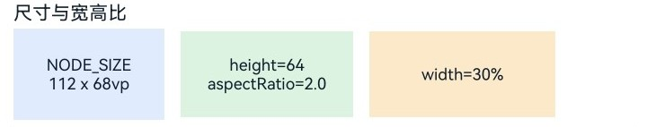
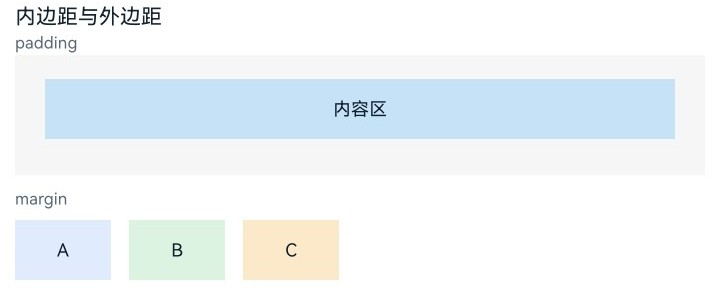
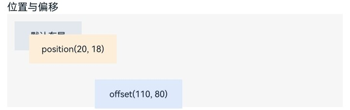

# 设置通用布局属性

<!--Kit: ArkUI-->
<!--Subsystem: ArkUI-->
<!--Owner: @camlostshi-->
<!--Designer: @camlostshi-->
<!--Tester: @weixin_45530366-->
<!--Adviser: @Brilliantry_Rui-->

从API version 12开始，ArkUI在NDK中提供了一组通用布局属性，可以控制组件的尺寸、位置、边框等布局行为。

本文选取了尺寸设置（[width](../reference/apis-arkui/arkui-ts/ts-universal-attributes-size.md#width)、[height](../reference/apis-arkui/arkui-ts/ts-universal-attributes-size.md#height)、[size](../reference/apis-arkui/arkui-ts/ts-universal-attributes-size.md#size)、[aspectRatio](../reference/apis-arkui/arkui-ts/ts-universal-attributes-layout-constraints.md#aspectratio)、[padding](../reference/apis-arkui/arkui-ts/ts-universal-attributes-size.md#padding)、[margin](../reference/apis-arkui/arkui-ts/ts-universal-attributes-size.md#margin)、[layoutWeight](../reference/apis-arkui/arkui-ts/ts-universal-attributes-size.md#layoutweight)）、位置设置（[position](../reference/apis-arkui/arkui-ts/ts-universal-attributes-location.md#position)、[offset](../reference/apis-arkui/arkui-ts/ts-universal-attributes-location.md#offset)）、边框设置（[borderWidth](../reference/apis-arkui/arkui-ts/ts-universal-attributes-border.md#borderwidth)、[borderColor](../reference/apis-arkui/arkui-ts/ts-universal-attributes-border.md#bordercolor)、[borderStyle](../reference/apis-arkui/arkui-ts/ts-universal-attributes-border.md#borderstyle)、[borderRadius](../reference/apis-arkui/arkui-ts/ts-universal-attributes-border.md#borderradius)）三个典型场景，提供NDK下通用布局属性接入的开发指导，对应属性设置和参数类型枚举可参考[ArkUI_NodeType](../reference/apis-arkui/capi-native-node-h.md#arkui_nodetype)。

本示例仅展示核心功能代码，完整示例请参考<!--RP1-->[NDKLayoutSample](https://gitcode.com/openharmony/applications_app_samples/tree/master/code/DocsSample/ArkUISample/NDKLayoutSample)<!--RP1End-->；实现前需要先接入ArkTS页面，具体接入方式可参考[接入ArkTS页面](../ui/ndk-access-the-arkts-page.md)。

## 设置组件尺寸

NDK通用布局属性的推荐使用方式是：先在节点类中封装属性设置方法，再在具体组件上调用。以下示例封装了一组固定尺寸与宽高比属性。

<!-- @[layout_size_node](https://gitcode.com/openharmony/applications_app_samples/blob/master/code/DocsSample/ArkUISample/NDKLayoutSample/entry/src/main/cpp/ArkUINode.h) -->  

``` C
void SetWidth(float width)
{
    ArkUI_NumberValue value[] = {{.f32 = width}};
    ArkUI_AttributeItem item = {value, 1};
    nativeModule_->setAttribute(handle_, NODE_WIDTH, &item);
}
void SetPercentWidth(float percent)
{
    ArkUI_NumberValue value[] = {{.f32 = percent}};
    ArkUI_AttributeItem item = {value, 1};
    nativeModule_->setAttribute(handle_, NODE_WIDTH_PERCENT, &item);
}
void SetHeight(float height)
{
    ArkUI_NumberValue value[] = {{.f32 = height}};
    ArkUI_AttributeItem item = {value, 1};
    nativeModule_->setAttribute(handle_, NODE_HEIGHT, &item);
}
void SetPercentHeight(float percent)
{
    ArkUI_NumberValue value[] = {{.f32 = percent}};
    ArkUI_AttributeItem item = {value, 1};
    nativeModule_->setAttribute(handle_, NODE_HEIGHT_PERCENT, &item);
}
void SetSize(float width, float height)
{
    ArkUI_NumberValue value[] = {{.f32 = width}, {.f32 = height}};
    ArkUI_AttributeItem item = {value, 2};
    nativeModule_->setAttribute(handle_, NODE_SIZE, &item);
}
```

<!-- @[layout_aspect_ratio_node](https://gitcode.com/openharmony/applications_app_samples/blob/master/code/DocsSample/ArkUISample/NDKLayoutSample/entry/src/main/cpp/ArkUINode.h) -->

```C
void SetAspectRatio(float ratio)
{
    ArkUI_NumberValue value[] = {{.f32 = ratio}};
    ArkUI_AttributeItem item = {value, 1};
    nativeModule_->setAttribute(handle_, NODE_ASPECT_RATIO, &item);
}
```

在组件上组合使用这些方法，可以观察到固定尺寸、百分比尺寸和宽高比生效。

<!-- @[layout_size_section](https://gitcode.com/openharmony/applications_app_samples/blob/master/code/DocsSample/ArkUISample/NDKLayoutSample/entry/src/main/cpp/LayoutAttributeExample.h) -->

```C
inline std::shared_ptr<ArkUITextNode> CreateFixedSizeItem()
{
    auto fixedItem = CreateDemoItem("NODE_SIZE\n112 x 68vp", SIZE_ITEM_BLUE);
    fixedItem->SetSize(FIXED_ITEM_WIDTH, FIXED_ITEM_HEIGHT);
    fixedItem->SetMargin(0.0F, SAMPLE_GAP, 0.0F, 0.0F);
    return fixedItem;
}

inline std::shared_ptr<ArkUITextNode> CreateAspectRatioItem()
{
    auto ratioItem = CreateDemoItem("height=64\naspectRatio=2.0", SIZE_ITEM_GREEN);
    ratioItem->SetHeight(RATIO_ITEM_HEIGHT);
    ratioItem->SetAspectRatio(RATIO_VALUE);
    ratioItem->SetMargin(0.0F, SAMPLE_GAP, 0.0F, 0.0F);
    return ratioItem;
}

inline std::shared_ptr<ArkUITextNode> CreatePercentWidthItem()
{
    auto percentItem = CreateDemoItem("width=30%", SIZE_ITEM_ORANGE);
    percentItem->SetPercentWidth(PERCENT_WIDTH_VALUE);
    percentItem->SetHeight(RATIO_ITEM_HEIGHT);
    return percentItem;
}
```

SetSize()同时写入宽和高，适合固定尺寸组件；SetPercentWidth()通过入参常量PERCENT_WIDTH_VALUE配置组件宽度为父容器宽度的30%；SetAspectRatio()通过配置固定宽高比，从显式设置的组件高度自动推导对应的宽度。



通常，还需要通过padding和margin控制内外边距、调节组件尺寸，以实现良好的间距效果。

<!-- @[layout_spacing_node](https://gitcode.com/openharmony/applications_app_samples/blob/master/code/DocsSample/ArkUISample/NDKLayoutSample/entry/src/main/cpp/ArkUINode.h) -->

```C
void SetPadding(float top, float right, float bottom, float left)
{
    ArkUI_NumberValue value[] = {{.f32 = top}, {.f32 = right}, {.f32 = bottom}, {.f32 = left}};
    ArkUI_AttributeItem item = {value, 4};
    nativeModule_->setAttribute(handle_, NODE_PADDING, &item);
}

void SetPercentPadding(float top, float right, float bottom, float left)
{
    ArkUI_NumberValue value[] = {{.f32 = top}, {.f32 = right}, {.f32 = bottom}, {.f32 = left}};
    ArkUI_AttributeItem item = {value, 4};
    nativeModule_->setAttribute(handle_, NODE_PADDING_PERCENT, &item);
}

void SetMargin(float top, float right, float bottom, float left)
{
    ArkUI_NumberValue value[] = {{.f32 = top}, {.f32 = right}, {.f32 = bottom}, {.f32 = left}};
    ArkUI_AttributeItem item = {value, 4};
    nativeModule_->setAttribute(handle_, NODE_MARGIN, &item);
}

void SetPercentMargin(float percent)
{
    ArkUI_NumberValue value[] = {{.f32 = percent}};
    ArkUI_AttributeItem item = {value, 1};
    nativeModule_->setAttribute(handle_, NODE_MARGIN_PERCENT, &item);
}
```

<!-- @[layout_spacing_section](https://gitcode.com/openharmony/applications_app_samples/blob/master/code/DocsSample/ArkUISample/NDKLayoutSample/entry/src/main/cpp/LayoutAttributeExample.h) -->

```C
inline std::shared_ptr<ArkUITextNode> CreatePercentWidthPaddingItem()
{
    auto inner = CreateDemoItem("内容区", PADDING_ITEM_BLUE);
    inner->SetPercentWidth(FULL_SIZE);
    return inner;
}

inline std::shared_ptr<ArkUIColumnNode> CreatePaddingHost()
{
    auto paddingHost = std::make_shared<ArkUIColumnNode>();
    paddingHost->SetPercentWidth(FULL_SIZE);
    paddingHost->SetHeight(SPACING_PADDING_HOST_HEIGHT);
    paddingHost->SetBackgroundColor(SURFACE_BACKGROUND_COLOR);
    paddingHost->SetPadding(PADDING_TOP, PADDING_RIGHT, PADDING_TOP, PADDING_RIGHT);
    paddingHost->SetMargin(0.0F, 0.0F, CARD_MARGIN_BOTTOM, 0.0F);
    paddingHost->AddChild(CreatePercentWidthPaddingItem());
    return paddingHost;
}

inline std::shared_ptr<ArkUITextNode> CreateMarginItem(const std::string &text, uint32_t color, bool addSpacing = false)
{
    auto item = CreateDemoItem(text, color);
    item->SetWidth(SMALL_ITEM_WIDTH);
    if (addSpacing) { item->SetMargin(0.0F, SAMPLE_GAP, 0.0F, 0.0F); }
    return item;
}
```

内边距padding用于控制组件内容区与边缘之间的留白，外边距margin用于控制组件与父容器边缘的留白间距。如果需要按父容器比例设置间距，则可使用[ArkUI_NodeType](../reference/apis-arkui/capi-native-node-h.md#arkui_nodetype)中NODE_PADDING_PERCENT和NODE_MARGIN_PERCENT对应的方法。



## 使用位置属性

当尺寸和间距已经确定后，如果需要进一步调整组件摆放位置，可以使用[position](../reference/apis-arkui/arkui-ts/ts-universal-attributes-location.md#position)和[offset](../reference/apis-arkui/arkui-ts/ts-universal-attributes-location.md#offset)。两者都会改变组件的显示位置，但含义不同。position表示相对父容器进行定位，offset表示在原有布局结果上发生偏移。

<!-- @[layout_position_node](https://gitcode.com/openharmony/applications_app_samples/blob/master/code/DocsSample/ArkUISample/NDKLayoutSample/entry/src/main/cpp/ArkUINode.h) -->

```C
void SetPosition(float x, float y)
{
    ArkUI_NumberValue value[] = {{.f32 = x}, {.f32 = y}};
    ArkUI_AttributeItem item = {value, 2};
    nativeModule_->setAttribute(handle_, NODE_POSITION, &item);
}

void SetOffset(float x, float y)
{
    ArkUI_NumberValue value[] = {{.f32 = x}, {.f32 = y}};
    ArkUI_AttributeItem item = {value, 2};
    nativeModule_->setAttribute(handle_, NODE_OFFSET, &item);
}
```

分别将这两个属性施加在不同组件上对比。

<!-- @[layout_position_section](https://gitcode.com/openharmony/applications_app_samples/blob/master/code/DocsSample/ArkUISample/NDKLayoutSample/entry/src/main/cpp/LayoutAttributeExample.h) -->

```C
inline std::shared_ptr<ArkUITextNode> CreatePositionedItem()
{
    auto positioned = CreateDemoItem("position(20, 18)", POSITION_ITEM_ORANGE);
    positioned->SetWidth(LARGE_ITEM_WIDTH);
    positioned->SetPosition(POSITION_X, POSITION_Y);
    return positioned;
}

inline std::shared_ptr<ArkUITextNode> CreateOffsetItem()
{
    auto offset = CreateDemoItem("offset(110, 80)", POSITION_ITEM_BLUE);
    offset->SetWidth(LARGE_ITEM_WIDTH);
    offset->SetMargin(OFFSET_MARGIN_TOP, 0.0F, 0.0F, 0.0F);
    offset->SetOffset(OFFSET_X, POSITION_Y);
    return offset;
}
```

可以看到两种效果：position直接给出目标位置，offset则保留原有占位关系，再向目标方向偏移。



## 使用边框属性

边框属性在NDK中的使用方式与上文一致，同样是先封装方法，再在具体组件上组合调用。方法封装如下。

<!-- @[layout_border_node](https://gitcode.com/openharmony/applications_app_samples/blob/master/code/DocsSample/ArkUISample/NDKLayoutSample/entry/src/main/cpp/ArkUINode.h) -->  

``` C
void SetBorderWidth(float width)
{
    ArkUI_NumberValue value[] = {{.f32 = width}};
    ArkUI_AttributeItem item = {value, 1};
    nativeModule_->setAttribute(handle_, NODE_BORDER_WIDTH, &item);
}
void SetBorderWidth(float top, float right, float bottom, float left)
{
    ArkUI_NumberValue value[] = {{.f32 = top}, {.f32 = right}, {.f32 = bottom}, {.f32 = left}};
    ArkUI_AttributeItem item = {value, 4};
    nativeModule_->setAttribute(handle_, NODE_BORDER_WIDTH, &item);
}
void SetBorderRadius(float radius)
{
    ArkUI_NumberValue value[] = {{.f32 = radius}};
    ArkUI_AttributeItem item = {value, 1};
    nativeModule_->setAttribute(handle_, NODE_BORDER_RADIUS, &item);
}
void SetBorderRadius(float topLeft, float topRight, float bottomLeft, float bottomRight)
{
    ArkUI_NumberValue value[] = {
        {.f32 = topLeft}, {.f32 = topRight}, {.f32 = bottomLeft}, {.f32 = bottomRight}
    };
    ArkUI_AttributeItem item = {value, 4};
    nativeModule_->setAttribute(handle_, NODE_BORDER_RADIUS, &item);
}
void SetBorderColor(uint32_t color)
{
    ArkUI_NumberValue value[] = {{.u32 = color}};
    ArkUI_AttributeItem item = {value, 1};
    nativeModule_->setAttribute(handle_, NODE_BORDER_COLOR, &item);
}
void SetBorderColor(uint32_t top, uint32_t right, uint32_t bottom, uint32_t left)
{
    ArkUI_NumberValue value[] = {{.u32 = top}, {.u32 = right}, {.u32 = bottom}, {.u32 = left}};
    ArkUI_AttributeItem item = {value, 4};
    nativeModule_->setAttribute(handle_, NODE_BORDER_COLOR, &item);
}
void SetBorderStyle(ArkUI_BorderStyle style)
{
    ArkUI_NumberValue value[] = {{.i32 = style}};
    ArkUI_AttributeItem item = {value, 1};
    nativeModule_->setAttribute(handle_, NODE_BORDER_STYLE, &item);
}
void SetBorderStyle(
    ArkUI_BorderStyle top, ArkUI_BorderStyle right, ArkUI_BorderStyle bottom, ArkUI_BorderStyle left)
{
    ArkUI_NumberValue value[] = {
        {.i32 = top}, {.i32 = right}, {.i32 = bottom}, {.i32 = left}
    };
    ArkUI_AttributeItem item = {value, 4};
    nativeModule_->setAttribute(handle_, NODE_BORDER_STYLE, &item);
}
```

当组件已经具备尺寸和间距后，可以继续叠加这些边框属性，构建轮廓和视觉分隔的效果。


