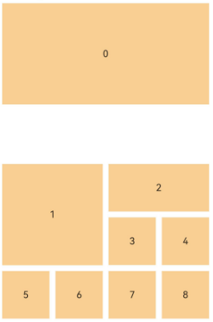

# 使用网格

<!--Kit: ArkUI-->
<!--Subsystem: ArkUI-->
<!--Owner: @zcdqs-->
<!--Designer: @zcdqs-->
<!--Tester: @huchuyun-->
<!--Adviser: @Brilliantry_Rui-->

## 概述

ArkUI开发框架在NDK接口提供了网格组件，使用网格可以将页面按行列分割成单元格，并指定子组件所在单元格和占用的行列数以做出各种布局，如桌面上大小不同的卡片和应用图标、按日期分组显示图片等。网格组件支持滚动事件、支持设置子组件占用不同的行列数、支持使用NodeAdapter实现懒加载以提升滚动场景性能。

使用NDK接口构建UI界面以及NDK基本使用，可以参考[接入ArkTS页面](ndk-access-the-arkts-page.md)。

## 创建网格

参考[示例](ndk-access-the-arkts-page.md#示例)中列表组件的实现方式，将网格组件常用的属性设置，如设置列数、行数、列间距、行间距等封装到ArkUIGridNode类中。

<!-- @[grid_define](https://gitcode.com/openharmony/applications_app_samples/blob/master/code/DocsSample/ArkUISample/NDKGridSample/entry/src/main/cpp/ArkUIGridNode.h) -->

``` C
#ifndef MYAPPLICATION_ARKUIGRIDNODE_H
#define MYAPPLICATION_ARKUIGRIDNODE_H

#include "ArkUINode.h"
#include "ArkUINodeAdapter.h"

namespace NativeModule {
class ArkUIGridNode : public ArkUINode {
public:
    ArkUIGridNode() : ArkUINode((NativeModuleInstance::GetInstance()->GetNativeNodeAPI())->createNode(ARKUI_NODE_GRID))
    {
    }

    ~ArkUIGridNode() override {}

    void SetColumnsTemplate(const std::string &str)
    {
        ArkUI_AttributeItem item = {.string = str.c_str()};
        nativeModule_->setAttribute(handle_, NODE_GRID_COLUMN_TEMPLATE, &item);
    }

    void SetRowsTemplate(const std::string &str)
    {
        ArkUI_AttributeItem item = {.string = str.c_str()};
        nativeModule_->setAttribute(handle_, NODE_GRID_ROW_TEMPLATE, &item);
    }

    void SetColumnsGap(float val)
    {
        ArkUI_NumberValue value[] = {{.f32 = val}};
        ArkUI_AttributeItem item = {value, 1};
        nativeModule_->setAttribute(handle_, NODE_GRID_COLUMN_GAP, &item);
    }

    void SetRowsGap(float val)
    {
        ArkUI_NumberValue value[] = {{.f32 = val}};
        ArkUI_AttributeItem item = {value, 1};
        nativeModule_->setAttribute(handle_, NODE_GRID_ROW_GAP, &item);
    }

    void SetLayoutOptions(ArkUI_GridLayoutOptions *option)
    {
        if (option == nullptr) {
            return;
        }
        ArkUI_AttributeItem item = {.object = option};
        nativeModule_->setAttribute(handle_, NODE_GRID_LAYOUT_OPTIONS, &item);
    }

    void SetScrollBar(int32_t barState)
    {
        ArkUI_NumberValue value[] = {{.i32 = barState}};
        ArkUI_AttributeItem item = {value, 1};
        nativeModule_->setAttribute(handle_, NODE_SCROLL_BAR_DISPLAY_MODE, &item);
    }

    void SetLazyAdapter(const std::shared_ptr<ArkUINodeAdapter> &adapter)
    {
        if (!IsNotNull(adapter)) {
            return;
        }
        ArkUI_AttributeItem item{nullptr, 0, nullptr, adapter->GetAdapter()};
        nativeModule_->setAttribute(handle_, NODE_GRID_NODE_ADAPTER, &item);
        _adapter = adapter;
    }

    void ReleaseAdapter() { return _adapter.reset(); }

private:
    std::shared_ptr<ArkUINodeAdapter> _adapter;
};
} // namespace NativeModule

#endif // MYAPPLICATION_ARKUIGRIDNODE_H
```

## 处理滚动事件

参考[监听组件事件](ndk-listen-to-component-events.md)中列表组件NODE_LIST_ON_SCROLL_INDEX事件监听示例代码，可以实现网格滚动事件监听。网格组件支持的滚动事件列表可以在[ArkUI_NodeEventType](../reference/apis-arkui/capi-native-node-h.md#arkui_nodeeventtype)中搜索`NODE_GRID`查看。

## 设置子组件所占行列数

所有子组件都占1行1列的网格布局，通过列表组件设置`NODE_LIST_LANES`也可以实现。网格布局更适合用于部分项目占用多行或多列的场景，如桌面上大小不同的卡片和应用图标、按日期分组显示图片等。从API version 22开始，这类场景可以通过创建网格时传入合适的[ArkUI_GridLayoutOptions](../reference/apis-arkui/capi-arkui-nativemodule-arkui-gridlayoutoptions.md)实现。

### 固定行列场景指定子组件的位置和大小

如下图是一个6行*4列的网格布局，其中“0”占据2行4列，“1”占据2行2列，“2”占据1行2列，0和1之间有一行空行，模拟手机桌面放置不同大小卡片和应用图标的场景。



在NDK中，设置网格布局使用固定行列和设置行列间距，可以参考如下设置，使用了[创建网格](#创建网格)中封装的`ArkUIGridNode`：

<!-- @[grid_columns_and_rows](https://gitcode.com/openharmony/applications_app_samples/blob/master/code/DocsSample/ArkUISample/NDKGridSample/entry/src/main/cpp/GridRectByIndexExample.cpp) -->

``` C++
auto grid = std::make_shared<ArkUIGridNode>();
grid->SetPercentWidth(0.9f);
grid->SetHeight(SIX_ROWS * ITEM_HEIGHT + (SIX_ROWS - 1) * ROWS_GAP);
grid->SetColumnsTemplate("1fr 1fr 1fr 1fr");
grid->SetRowsTemplate("1fr 1fr 1fr 1fr 1fr 1fr");
grid->SetColumnsGap(10.0f);
grid->SetRowsGap(ROWS_GAP);
```

通过[OH_ArkUI_GridLayoutOptions_RegisterGetRectByIndexCallback](../reference/apis-arkui/capi-native-type-h.md#oh_arkui_gridlayoutoptions_registergetirregularsizebyindexcallback)给网格组件设置用于获取每一个子组件位置的回调函数，开发者可以在该回调中指定每一个子组件所在的起始行号、起始列号、占用行数和占用列数，即[ArkUI_GridItemRect](../reference/apis-arkui/capi-arkui-nativemodule-arkui-griditemrect.md)。上图布局可以通过如下代码实现：

<!-- @[grid_get_rect_by_index](https://gitcode.com/openharmony/applications_app_samples/blob/master/code/DocsSample/ArkUISample/NDKGridSample/entry/src/main/cpp/GridRectByIndexExample.cpp) -->

``` C++
auto option = std::make_shared<ArkuiGridLayoutOptions>();
auto layoutOptions = option->GetLayoutOptions();
OH_ArkUI_GridLayoutOptions_RegisterGetRectByIndexCallback(
    option->GetLayoutOptions(), nullptr, [](int32_t itemIndex, void *userData) -> ArkUI_GridItemRect {
        switch (itemIndex) {
            case 0:
                return ArkUI_GridItemRect{0, 0, 2, 4};
            case 1:
                return ArkUI_GridItemRect{3, 0, 2, 2};
            case ITEM_INDEX_2:
                return ArkUI_GridItemRect{3, 2, 1, 2};
            case ITEM_INDEX_3:
                return ArkUI_GridItemRect{4, 2, 1, 1};
            case ITEM_INDEX_4:
                return ArkUI_GridItemRect{4, 3, 1, 1};
            case ITEM_INDEX_5:
                return ArkUI_GridItemRect{5, 0, 1, 1};
            case ITEM_INDEX_6:
                return ArkUI_GridItemRect{5, 1, 1, 1};
            case ITEM_INDEX_7:
                return ArkUI_GridItemRect{5, 2, 1, 1};
            default:
                return ArkUI_GridItemRect{5, 3, 1, 1};
        }
    });
grid->SetLayoutOptions(layoutOptions);
```

“0”从网格左上角开始占据2行4列，需要将其对应的`ArkUI_GridItemRect`设置为`{0, 0, 2, 4}`。其他子组件的位置和大小设置以此类推。

### 滚动场景分组显示数据

如下图模拟了分组展示图片或文件的场景，表示分组名称的子组件占据一整行，其他子组件占据1行1列。


纵向滚动的网格布局，只需要设置列数，无需设置行数。

<!-- @[grid_columns](https://gitcode.com/openharmony/applications_app_samples/blob/master/code/DocsSample/ArkUISample/NDKGridSample/entry/src/main/cpp/GridIrregularIndexesExample.cpp) -->

分组显示数据，可以通过[OH_ArkUI_GridLayoutOptions_SetIrregularIndexes](../reference/apis-arkui/capi-native-type-h.md#oh_arkui_gridlayoutoptions_setirregularindexes)设置分组节点对应的index，这些index对应的子组件将占据一整行，其他子组件将占据1行1列。

<!-- @[grid_group_indexes](https://gitcode.com/openharmony/applications_app_samples/blob/master/code/DocsSample/ArkUISample/NDKGridSample/entry/src/main/cpp/GridIrregularIndexesExample.cpp) -->

滚动场景建议使用[NodeAdapter](../reference/apis-arkui/capi-arkui-nativemodule-arkui-nodeadapter8h.md)按需生成子组件。详情请参阅[NodeAdapter介绍](ndk-loading-long-list.md#nodeadapter介绍)。

如下代码封装了一个通用的NodeAdapter，开发者根据需要设置自己的创建、绑定、回收子组件等回收函数即可在网格组件使用。

<!-- @[node_adapter](https://gitcode.com/openharmony/applications_app_samples/blob/master/code/DocsSample/ArkUISample/NDKGridSample/entry/src/main/cpp/ArkUINodeAdapter.h) -->