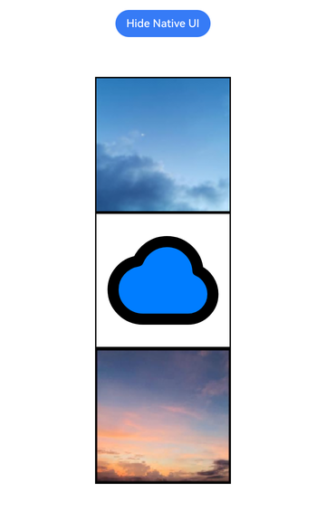

# 显示图片（Image）
<!--Kit: ArkUI-->
<!--Subsystem: ArkUI-->
<!--Owner: @wu-yinxiao-->
<!--Designer: @liyujie43-->
<!--Tester: @wu-yinxiao-->
<!--Adviser: @Brilliantry_Rui-->

从API version 12开始，ArkUI开发框架在NDK接口提供了Image组件，用于在应用中显示图片。Image组件支持多种图片格式，包括png、jpg、jpeg、bmp、webp、heif、SVG等格式，支持多种图片来源（本地资源、网络图片、PixelMap等）和丰富的图片处理功能（缩放、插值、填充颜色、颜色滤镜等）。开发者可以在Native层创建Image组件并设置各种属性，实现高性能的图片展示效果，以及与ArkTS侧Image组件相同的显示效果，ArkTS开发指导请参考[显示图片 (Image)](arkts-graphics-display.md)。

## 约束与限制

1. **线程安全**：所有UI相关接口必须在主线程调用，多线程操作可能导致应用崩溃。
2. **组件挂载**：组件创建后需要通过[addChild](../reference/apis-arkui/capi-arkui-nativemodule-arkui-nativenodeapi-1.md#addchild)添加到父节点才能显示。
3. **图片路径**：
   - 本地图片需使用完整路径或相对路径。
   - 网络图片需申请`ohos.permission.INTERNET`权限。
4. **资源释放**：释放组件时需要调用[disposeNode](../reference/apis-arkui/capi-arkui-nativemodule-arkui-nativenodeapi-1.md#disposenode)来避免内存泄漏。
5. **同步加载**：不建议在图片加载较长时间时使用同步加载，会导致页面无法响应。

## 前置条件

在开始使用Image组件前，需要先完成以下准备工作：

1. 创建Native C++工程：在DevEco Studio中创建Native C++模板项目。
2. 接入ArkTS页面：按照[接入ArkTS页面](ndk-access-the-arkts-page.md)完成Native组件到ArkTS页面的挂载配置。
3. 添加依赖：打开native工程的src/main/cpp/CMakeLists.txt，在target_link_libraries依赖中添加libace_ndk.z.so、libace_napi.z.so以及日志依赖libhilog_ndk.z.so。

    ```cmake
    cmake_minimum_required(VERSION 3.5.0)
    project(ImageExample)

    set(NATIVERENDER_ROOT_PATH ${CMAKE_CURRENT_SOURCE_DIR})

    if(DEFINED PACKAGE_FIND_FILE)
        include(${PACKAGE_FIND_FILE})
    endif()

    include_directories(${NATIVERENDER_ROOT_PATH})

    add_library(entry SHARED
        napi_init.cpp
        NativeEntry.cpp
        ImageExample.cpp
    )

    target_link_libraries(entry PUBLIC
        libace_napi.z.so      # NAPI接口
        libace_ndk.z.so       # ArkUI NDK
        libhilog_ndk.z.so     # 日志
    )
    ```

4. 添加头文件引用。

    ```c++
    #include <arkui/native_node.h>
    #include <arkui/native_type.h>
    #include <arkui/native_interface.h>
    #include <hilog/log.h>
    ```

5. 准备图片资源：准备需要显示的图片文件，Image组件支持多种图片来源，以下介绍常用的资源准备方式。

   - 使用rawfile资源

    将图片文件放到`entry/src/main/resources/rawfile/`目录下，在代码中使用相对路径引用。

    ```c++
    // 设置图片源
    ArkUI_AttributeItem srcItem = {nullptr, 0, "entry/resources/rawfile/startIcon.png"};
    nativeNodeApi->setAttribute(image, NODE_IMAGE_SRC, &srcItem);
    ```

   - 使用网络图片

    在`entry/src/main/module.json5`中添加网络权限，在代码中直接使用网络URL。

    ```json
    {
      "module": {
        "requestPermissions": [
          {
            "name": "ohos.permission.INTERNET"
          }
        ]
      }
    }
    ```

    ```c++
    ArkUI_AttributeItem srcItem = {nullptr, 0, "https://xxx.jpg"};
    nativeNodeApi->setAttribute(image, NODE_IMAGE_SRC, &srcItem);
    ```

## 创建Image组件

### 创建并初始化Image组件

在使用Image组件之前，需要先获取nativeNodeApi，然后使用[createNode](../reference/apis-arkui/capi-arkui-nativemodule-arkui-nativenodeapi-1.md#createnode)接口创建Image组件。

```c++
// 获取ArkUI nativeNodeApi
ArkUI_NativeNodeAPI_1* nativeNodeApi = nullptr;
OH_ArkUI_GetModuleInterface(ARKUI_NATIVE_NODE, ArkUI_NativeNodeAPI_1, nativeNodeApi);
if (nativeNodeApi == nullptr) {
    OH_LOG_ERROR(LOG_APP, "Get native node API failed");
    return;
}

// 创建Image组件
ArkUI_NodeHandle image = nativeNodeApi->createNode(ARKUI_NODE_IMAGE);
if (image == nullptr) {
    OH_LOG_ERROR(LOG_APP, "Create Image failed");
    return;
}
```

### 设置图片源

Image组件支持通过字符串路径或[DrawableDescriptor](../reference/apis-arkui/js-apis-arkui-drawableDescriptor.md)对象设置图片源。

```c++
// 方式一：通过字符串路径设置图片源
// 支持本地路径、网络地址、资源路径等
ArkUI_AttributeItem srcItem = {nullptr, 0, "/data/storage/el2/base/haps/entry/files/example.png"};
nativeNodeApi->setAttribute(image, NODE_IMAGE_SRC, &srcItem);

// 方式二：通过DrawableDescriptor对象设置图片源
// 需要先创建ArkUI_DrawableDescriptor对象
// ArkUI_AttributeItem srcItem = {.object = drawableDescriptor};
// nativeNodeApi->setAttribute(image, NODE_IMAGE_SRC, &srcItem);
```

## 设置图片属性

### Image属性

Image独有属性如下，具体说明请参考[ArkUI_NodeAttributeType](../reference/apis-arkui/capi-native-node-h.md#arkui_nodeattributetype)中的枚举定义。

| 属性名 | 说明 | 起始版本 |
|-------|--------|---------|
| NODE_IMAGE_SRC | 支持字符串路径或DrawableDescriptor。 | 12 |
| NODE_IMAGE_OBJECT_FIT | 控制图片如何适应容器。 | 12 |
| NODE_IMAGE_INTERPOLATION | 图片放大时的插值质量。 | 12 |
| NODE_IMAGE_OBJECT_REPEAT | 图片平铺方式。 | 12 |
| NODE_IMAGE_COLOR_FILTER | 5x4颜色矩阵。 | 12 |
| NODE_IMAGE_AUTO_RESIZE | 是否自动调整图片源大小。 | 12 |
| NODE_IMAGE_ALT | 加载失败时显示的图片。 | 12 |
| NODE_IMAGE_DRAGGABLE | 是否支持拖拽。 | 12 |
| NODE_IMAGE_RENDER_MODE | 原色或黑白模式。 | 12 |
| NODE_IMAGE_FIT_ORIGINAL_SIZE | 显示大小是否跟随图片源尺寸。 | 12 |
| NODE_IMAGE_FILL_COLOR | SVG图片填充颜色。 | 12 |
| NODE_IMAGE_RESIZABLE | 图片拉伸时的边缘处理。 | 12 |
| NODE_IMAGE_SYNC_LOAD | 是否同步加载图片。 | 20 |
| NODE_IMAGE_SOURCE_SIZE | 设置图片解码尺寸。 | 21 |
| NODE_IMAGE_IMAGE_MATRIX | 图片仿射变换矩阵。 | 21 |
| NODE_IMAGE_MATCH_TEXT_DIRECTION | 是否跟随文本方向。 | 21 |
| NODE_IMAGE_COPY_OPTION | 图片是否可复制。 | 21 |
| NODE_IMAGE_ENABLE_ANALYZER | 是否启用AI分析。 | 21 |
| NODE_IMAGE_DYNAMIC_RANGE_MODE | HDR显示模式。 | 21 |
| NODE_IMAGE_HDR_BRIGHTNESS | HDR图片亮度。 | 21 |
| NODE_IMAGE_ORIENTATION | 图片旋转方向。 | 21 |
| NODE_IMAGE_SUPPORT_SVG2 | SVG解析能力范围。 | 21 |
| NODE_IMAGE_CONTENT_TRANSITION | 图片内容变换动画。 | 21 |
| NODE_IMAGE_ALT_PLACEHOLDER | 加载过程中显示的占位图。 | 22 |
| NODE_IMAGE_ALT_ERROR | 加载失败时显示的占位图。 | 22 |


### 设置图片缩放类型

通过[ArkUI_NodeAttributeType](../reference/apis-arkui/capi-native-node-h.md#arkui_nodeattributetype)中的NODE_IMAGE_OBJECT_FIT属性设置图片在容器中的缩放方式。

```c++
// 设置图片缩放类型
ArkUI_NumberValue objectFitValue[] = {{.i32 = ARKUI_OBJECT_FIT_CONTAIN}};
ArkUI_AttributeItem objectFitItem = {objectFitValue, 1};
nativeNodeApi->setAttribute(image, NODE_IMAGE_OBJECT_FIT, &objectFitItem);
```

### 设置图片插值效果

通过[ArkUI_NodeAttributeType](../reference/apis-arkui/capi-native-node-h.md#arkui_nodeattributetype)中的NODE_IMAGE_INTERPOLATION属性设置图片插值效果。

```c++
// 设置图片插值效果
ArkUI_NumberValue interpolationValue[] = {{.i32 = ARKUI_IMAGE_INTERPOLATION_HIGH}};
ArkUI_AttributeItem interpolationItem = {interpolationValue, 1};
nativeNodeApi->setAttribute(image, NODE_IMAGE_INTERPOLATION, &interpolationItem);
```

### 设置图片重复样式

通过[ArkUI_NodeAttributeType](../reference/apis-arkui/capi-native-node-h.md#arkui_nodeattributetype)中的NODE_IMAGE_OBJECT_REPEAT属性设置图片重复样式。

```c++
// 设置图片重复样式
ArkUI_NumberValue repeatValue[] = {{.i32 = ARKUI_IMAGE_REPEAT_NONE}};
ArkUI_AttributeItem repeatItem = {repeatValue, 1};
nativeNodeApi->setAttribute(image, NODE_IMAGE_OBJECT_REPEAT, &repeatItem);
```

### 设置图片填充颜色

通过[ArkUI_NodeAttributeType](../reference/apis-arkui/capi-native-node-h.md#arkui_nodeattributetype)中的NODE_IMAGE_FILL_COLOR属性设置SVG图片填充颜色。

```c++
// 设置图片填充颜色（0xARGB格式）
// 例如：0xFFFF0000表示红色
ArkUI_NumberValue fillColorValue[] = {{.u32 = 0xFF007DFF}};
ArkUI_AttributeItem fillColorItem = {fillColorValue, 1};
nativeNodeApi->setAttribute(image, NODE_IMAGE_FILL_COLOR, &fillColorItem);
```

### 设置占位图

通过[ArkUI_NodeAttributeType](../reference/apis-arkui/capi-native-node-h.md#arkui_nodeattributetype)中的NODE_IMAGE_ALT属性设置占位图。

```c++
// 设置加载失败时的占位图
ArkUI_AttributeItem altItem = {nullptr, 0, "/data/storage/el2/base/haps/entry/files/placeholder.png"};
nativeNodeApi->setAttribute(image, NODE_IMAGE_ALT, &altItem);
```

### 设置图片解码尺寸

通过[ArkUI_NodeAttributeType](../reference/apis-arkui/capi-native-node-h.md#arkui_nodeattributetype)中的NODE_IMAGE_SOURCE_SIZE属性设置图片解码尺寸。

```c++
// 设置图片解码尺寸（单位：px）
ArkUI_NumberValue sourceSizeValue[] = {{.i32 = 200}, {.i32 = 200}};
ArkUI_AttributeItem sourceSizeItem = {sourceSizeValue, 2};
nativeNodeApi->setAttribute(image, NODE_IMAGE_SOURCE_SIZE, &sourceSizeItem);
```

### 设置图片渲染模式

通过[ArkUI_NodeAttributeType](../reference/apis-arkui/capi-native-node-h.md#arkui_nodeattributetype)中的NODE_IMAGE_RENDER_MODE属性设置图片渲染模式。

```c++
// 设置图片渲染模式
ArkUI_NumberValue renderModeValue[] = {{.i32 = ARKUI_IMAGE_RENDER_MODE_ORIGINAL}};
ArkUI_AttributeItem renderModeItem = {renderModeValue, 1};
nativeNodeApi->setAttribute(image, NODE_IMAGE_RENDER_MODE, &renderModeItem);
```

### 设置同步加载

通过[ArkUI_NodeAttributeType](../reference/apis-arkui/capi-native-node-h.md#arkui_nodeattributetype)中的NODE_IMAGE_SYNC_LOAD属性设置图片的同步或异步加载方式。

```c++
// 设置同步加载
ArkUI_NumberValue syncLoadValue[] = {{.i32 = 1}};
ArkUI_AttributeItem syncLoadItem = {syncLoadValue, 1};
nativeNodeApi->setAttribute(image, NODE_IMAGE_SYNC_LOAD, &syncLoadItem);
```

### 设置图片颜色滤镜

通过[ArkUI_NodeAttributeType](../reference/apis-arkui/capi-native-node-h.md#arkui_nodeattributetype)中的NODE_IMAGE_COLOR_FILTER属性设置图片颜色滤镜。

```c++
// 设置颜色滤镜（5x4矩阵，共20个浮点数）
// 矩阵格式：每行5个元素分别表示 R、G、B、A 的系数和偏移量
// 行1: R行 - R_new = R*1 + G*0 + B*0 + A*0 + offset*0 = R
// 行2: G行 - G_new = R*0 + G*1 + B*0 + A*0 + offset*0 = G
// 行3: B行 - B_new = R*0 + G*0 + B*1 + A*0 + offset*0 = B
// 行4: A行 - A_new = R*0 + G*0 + B*0 + A*1 + offset*0 = A
// 示例矩阵为恒等矩阵，即不改变颜色
float colorFilterMatrix[20] = {
    1.0f, 0.0f, 0.0f, 0.0f, 0.0f,  // R行: R、G、B、A的系数及偏移量
    0.0f, 1.0f, 0.0f, 0.0f, 0.0f,  // G行: R、G、B、A的系数及偏移量
    0.0f, 0.0f, 1.0f, 0.0f, 0.0f,  // B行: R、G、B、A的系数及偏移量
    0.0f, 0.0f, 0.0f, 1.0f, 0.0f   // A行: R、G、B、A的系数及偏移量
};
ArkUI_NumberValue colorFilterValue[20] = {
    {.f32 = colorFilterMatrix[0]}, {.f32 = colorFilterMatrix[1]},
    {.f32 = colorFilterMatrix[2]}, {.f32 = colorFilterMatrix[3]},
    {.f32 = colorFilterMatrix[4]}, {.f32 = colorFilterMatrix[5]},
    {.f32 = colorFilterMatrix[6]}, {.f32 = colorFilterMatrix[7]},
    {.f32 = colorFilterMatrix[8]}, {.f32 = colorFilterMatrix[9]},
    {.f32 = colorFilterMatrix[10]}, {.f32 = colorFilterMatrix[11]},
    {.f32 = colorFilterMatrix[12]}, {.f32 = colorFilterMatrix[13]},
    {.f32 = colorFilterMatrix[14]}, {.f32 = colorFilterMatrix[15]},
    {.f32 = colorFilterMatrix[16]}, {.f32 = colorFilterMatrix[17]},
    {.f32 = colorFilterMatrix[18]}, {.f32 = colorFilterMatrix[19]}
};
ArkUI_AttributeItem colorFilterItem = {colorFilterValue, 20};
nativeNodeApi->setAttribute(image, NODE_IMAGE_COLOR_FILTER, &colorFilterItem);
```

### 设置图片显示方向

通过[ArkUI_NodeAttributeType](../reference/apis-arkui/capi-native-node-h.md#arkui_nodeattributetype)中的NODE_IMAGE_ORIENTATION属性设置图片显示方向。

```c++
// 设置图片显示方向
ArkUI_NumberValue orientationValue[] = {{.i32 = ARKUI_ORIENTATION_UP}};
ArkUI_AttributeItem orientationItem = {orientationValue, 1};
nativeNodeApi->setAttribute(image, NODE_IMAGE_ORIENTATION, &orientationItem);
```

## 监听图片事件

通过注册全局事件接收器接收所有节点事件，并在具体节点上通过[ArkUI_NodeEventType](../reference/apis-arkui/capi-native-node-h.md#arkui_nodeeventtype)中的NODE_IMAGE_ON_COMPLETE，NODE_IMAGE_ON_ERROR，NODE_IMAGE_ON_SVG_PLAY_FINISH和NODE_IMAGE_ON_DOWNLOAD_PROGRESS接口来注册特定事件来实现图片事件的监听。

### 注册全局事件接收器

在处理图片事件之前，需要先通过[registerNodeEventReceiver](../reference/apis-arkui/capi-arkui-nativemodule-arkui-nativenodeapi-1.md#registernodeeventreceiver)接口注册全局事件接收器。

```c++
// 全局事件接收器函数
void GlobalEventReceiver(ArkUI_NodeEvent* event)
{
    auto eventType = OH_ArkUI_NodeEvent_GetEventType(event);
    auto nodeHandle = OH_ArkUI_NodeEvent_GetNodeHandle(event);

    // 根据事件类型处理
    switch (eventType) {
        case NODE_IMAGE_ON_COMPLETE:
            // 处理图片加载完成事件
            break;
        case NODE_IMAGE_ON_ERROR:
            // 处理图片加载失败事件
            break;
        case NODE_IMAGE_ON_SVG_PLAY_FINISH:
            // 处理SVG播放完成事件
            break;
        default:
            break;
    }
}

// 注册全局事件接收器
nativeNodeApi->registerNodeEventReceiver(GlobalEventReceiver);
```

### 监听图片加载完成事件

在图片节点上使用[registerNodeEvent](../reference/apis-arkui/capi-arkui-nativemodule-arkui-nativenodeapi-1.md#registernodeevent)接口注册加载NODE_IMAGE_ON_COMPLETE完成事件，当图片加载成功后触发该事件，事件回调中可获取图片尺寸信息。

```c++
// 图片加载完成事件处理
void HandleImageComplete(ArkUI_NodeEvent* event)
{
    // 使用函数获取 componentEvent
    ArkUI_NodeComponentEvent* componentEvent = OH_ArkUI_NodeEvent_GetNodeComponentEvent(event);
    if (componentEvent == nullptr) {
        OH_LOG_ERROR(LOG_APP, "Get component event failed");
        return;
    }

    // 获取图片信息
    float width = componentEvent->data[0].f32;           // 图片原始宽度
    float height = componentEvent->data[1].f32;          // 图片原始高度
    float componentWidth = componentEvent->data[2].f32;  // 组件宽度
    float componentHeight = componentEvent->data[3].f32; // 组件高度
    float contentWidth = componentEvent->data[4].f32;    // 渲染内容宽度
    float contentHeight = componentEvent->data[5].f32;   // 渲染内容高度

    OH_LOG_INFO(LOG_APP, "Image loaded: %.0fx%.0f, component: %.0fx%.0f",
                width, height, componentWidth, componentHeight);
}

// 注册图片加载完成事件
nativeNodeApi->registerNodeEvent(image, NODE_IMAGE_ON_COMPLETE, 0, nullptr);
```

### 监听图片加载失败事件

在图片节点上使用[registerNodeEvent](../reference/apis-arkui/capi-arkui-nativemodule-arkui-nativenodeapi-1.md#registernodeevent)接口注册加载NODE_IMAGE_ON_ERROR失败事件，当图片加载失败时触发该事件，事件回调中可获取错误码信息。

```c++
// 图片加载失败事件处理
void HandleImageError(ArkUI_NodeEvent* event)
{
    ArkUI_NodeComponentEvent* componentEvent = OH_ArkUI_NodeEvent_GetNodeComponentEvent(event);
    if (componentEvent == nullptr) {
        OH_LOG_ERROR(LOG_APP, "Get component event failed");
        return;
    }

    int32_t errorCode = componentEvent->data[0].i32;
    // 401: 图片路径无效
    OH_LOG_ERROR(LOG_APP, "Image load failed, error code: %d", errorCode);
}

// 注册图片加载失败事件
nativeNodeApi->registerNodeEvent(image, NODE_IMAGE_ON_ERROR, 0, nullptr);
```

### 监听SVG播放完成事件

在图片节点上使用[registerNodeEvent](../reference/apis-arkui/capi-arkui-nativemodule-arkui-nativenodeapi-1.md#registernodeevent)接口注册NODE_IMAGE_ON_SVG_PLAY_FINISH播放完成事件，当SVG动画播放结束时触发该事件。

```c++
// SVG播放完成事件处理
void HandleSvgPlayFinish(ArkUI_NodeEvent* event)
{
    OH_LOG_INFO(LOG_APP, "SVG animation play finished");
}

// 注册SVG播放完成事件
nativeNodeApi->registerNodeEvent(image, NODE_IMAGE_ON_SVG_PLAY_FINISH, 0, nullptr);
```

### 注销事件监听

当不再需要监听图片事件时，需要注销在节点上注册的事件以及全局事件接收器。

```c++
// 注销事件监听
nativeNodeApi->unregisterNodeEvent(image, NODE_IMAGE_ON_COMPLETE);
nativeNodeApi->unregisterNodeEvent(image, NODE_IMAGE_ON_ERROR);
nativeNodeApi->unregisterNodeEvent(image, NODE_IMAGE_ON_SVG_PLAY_FINISH);

// 注销全局事件接收器
nativeNodeApi->unregisterNodeEventReceiver();
```

## 完整示例

以下示例展示了如何创建一个包含多种图片属性的完整UI界面。示例代码的目录结构及其文件说明如下：

```text
.
|—— cpp
|    |—— types
|    |      |—— libentry
|    |      |       |—— index.d.ts       // 提供Native和ArkTS侧的桥接方法
|    |—— napi_init.cpp                   // NAPI初始化，与index.d.ts对应的桥接方法
|    |—— NativeEntry.h                   // Native入口定义
|    |—— NativeEntry.cpp                 // Native入口实现
|    |—— ImageExample.h                  // 图片示例定义
|    |—— ImageExample.cpp                // 图片示例实现
|    |—— CMakeLists.txt                  // CMake配置
|
|—— ets
|    |—— pages
|         |—— Index.ets                  // 应用启动页，加载承载Native的容器
|
|—— resources
|    |—— rawfile
|         |—— startIcon.png              // 图片资源文件
```

具体开发步骤如下：

1. 在ArkTS页面上声明占位组件

    在ArkTS页面上声明用于Native页面挂载的占位组件，并在页面创建时通知Native侧创建图片界面。

    ```typescript
    // entry/src/main/ets/pages/Index.ets
    import nativeNode from 'libentry.so';
    import { NodeContent } from '@kit.ArkUI';

    @Entry
    @Component
    struct Index {
    // 初始化NodeContent对象
    private rootSlot: NodeContent = new NodeContent();
    @State @Watch('changeNativeFlag') showNative: boolean = false;

    changeNativeFlag(): void {
        if (this.showNative) {
        // 传递NodeContent对象用于Native创建组件的挂载显示
        nativeNode.createNativeRoot(this.rootSlot)
        } else {
        // 销毁NativeModule组件
        nativeNode.destroyNativeRoot()
        }
    }

    build() {
        Column() {
        Button(this.showNative ? 'Hide Native UI' : 'Show Native UI')
            .onClick(() => {
            this.showNative = !this.showNative
            })
            .id('btn')
        Row() {
            // 将NodeContent和ContentSlot占位组件绑定
            ContentSlot(this.rootSlot)
        }.layoutWeight(1)
        }
        .width('100%')
        .height('100%')
    }
    }
    ```

2. 提供NAPI桥接方法

    声明Native模块的ArkTS接口，并在NAPI层实现与Native侧的桥接，使ArkTS层能够调用Native代码创建和管理图片组件。

    **接口声明**

    ```typescript
    // entry/src/main/cpp/types/libentry/Index.d.ts
    export const createNativeRoot: (content: Object) => void;
    export const destroyNativeRoot: () => void;
    ```

    **NAPI初始化**

    ```cpp
    // entry/src/main/cpp/napi_init.cpp
    #include "napi/native_api.h"
    #include "NativeEntry.h"

    EXTERN_C_START
    static napi_value Init(napi_env env, napi_value exports)
    {
        // 绑定Native侧的创建组件和销毁组件
        napi_property_descriptor desc[] = {
            {"createNativeRoot", nullptr,
            NativeModule::CreateNativeRoot, nullptr, nullptr,
            nullptr, napi_default, nullptr},
            {"destroyNativeRoot", nullptr,
            NativeModule::DestroyNativeRoot, nullptr, nullptr,
            nullptr, napi_default, nullptr}
        };
        napi_define_properties(env, exports, sizeof(desc) / sizeof(desc[0]), desc);
        return exports;
    }
    EXTERN_C_END

    static napi_module demoModule = {
        .nm_version = 1,
        .nm_flags = 0,
        .nm_filename = nullptr,
        .nm_register_func = Init,
        .nm_modname = "entry",
        .nm_priv = ((void *)0),
        .reserved = {0},
    };

    extern "C" __attribute__((constructor)) void RegisterEntryModule(void)
    {
        napi_module_register(&demoModule);
    }
    ```

3. 实现Native入口

    实现Native模块的入口函数，处理来自ArkTS侧的NodeContent和节点操作请求，包括创建图片界面和销毁界面的逻辑。

    **NativeEntry.h**

    ```cpp
    // entry/src/main/cpp/NativeEntry.h
    #ifndef NATIVE_ENTRY_H
    #define NATIVE_ENTRY_H

    #include <arkui/native_node.h>
    #include <arkui/native_node_napi.h>
    #include <arkui/native_interface.h>
    #include <js_native_api.h>

    namespace NativeModule {

    // 获取ArkUI nativeNodeApi
    inline ArkUI_NativeNodeAPI_1* GetNativeNodeAPI()
    {
        static ArkUI_NativeNodeAPI_1* api = nullptr;
        if (api == nullptr) {
            OH_ArkUI_GetModuleInterface(ARKUI_NATIVE_NODE, ArkUI_NativeNodeAPI_1, api);
        }
        return api;
    }

    class NativeEntry {
    public:
        static NativeEntry* GetInstance()
        {
            static NativeEntry instance;
            return &instance;
        }

        void SetContentHandle(ArkUI_NodeContentHandle contentHandle)
        {
            contentHandle_ = contentHandle;
        }

        void SetRootNode(ArkUI_NodeHandle rootNode)
        {
            if (rootNode != nullptr && contentHandle_ != nullptr) {
                rootNode_ = rootNode;
                OH_ArkUI_NodeContent_AddNode(contentHandle_, rootNode);
            }
        }

        void DisposeRootNode()
        {
            if (rootNode_ != nullptr && contentHandle_ != nullptr) {
                OH_ArkUI_NodeContent_RemoveNode(contentHandle_, rootNode_);
                // 使用正确的方式销毁节点
                GetNativeNodeAPI()->disposeNode(rootNode_);
                rootNode_ = nullptr;
            }
        }

    private:
        NativeEntry() = default;
        ~NativeEntry() = default;

        ArkUI_NodeContentHandle contentHandle_ = nullptr;
        ArkUI_NodeHandle rootNode_ = nullptr;
    };

    // NAPI函数声明
    napi_value CreateNativeRoot(napi_env env, napi_callback_info info);
    napi_value DestroyNativeRoot(napi_env env, napi_callback_info info);

    } // namespace NativeModule

    #endif // NATIVE_ENTRY_H
    ```

    **NativeEntry.cpp**

    ```cpp
    // entry/src/main/cpp/NativeEntry.cpp
    #include "NativeEntry.h"
    #include "ImageExample.h"

    namespace NativeModule {

    napi_value CreateNativeRoot(napi_env env, napi_callback_info info)
    {
        size_t argc = 1;
        napi_value args[1] = {nullptr};

        napi_get_cb_info(env, info, &argc, args, nullptr, nullptr);

        // 获取NodeContent
        ArkUI_NodeContentHandle contentHandle;
        OH_ArkUI_GetNodeContentFromNapiValue(env, args[0], &contentHandle);
        NativeEntry::GetInstance()->SetContentHandle(contentHandle);

        // 创建图片示例界面
        auto root = CreateImageExample();

        // 挂载到NodeContent
        NativeEntry::GetInstance()->SetRootNode(root);

        return nullptr;
    }

    napi_value DestroyNativeRoot(napi_env env, napi_callback_info info)
    {
        NativeEntry::GetInstance()->DisposeRootNode();
        return nullptr;
    }

    } // namespace NativeModule
    ```

4. 显示并设置图片

    实现Image组件的具体功能，创建包含多个Image组件的示例界面，演示图片源设置、缩放类型、插值效果、填充颜色、占位图等属性的配置方法。

    **ImageExample.h**

    ```cpp
    // entry/src/main/cpp/ImageExample.h
    #ifndef IMAGE_EXAMPLE_H
    #define IMAGE_EXAMPLE_H

    #include <arkui/native_node.h>

    // 创建图片示例界面
    ArkUI_NodeHandle CreateImageExample();

    #endif // IMAGE_EXAMPLE_H
    ```

    **ImageExample.cpp**

    ```cpp
    // entry/src/main/cpp/ImageExample.cpp
    #include "ImageExample.h"
    #include "NativeEntry.h"
    #include <arkui/native_node.h>
    #include <arkui/native_type.h>
    #include <arkui/native_interface.h>
    #include <hilog/log.h>

    // 日志标签
    #undef LOG_DOMAIN
    #undef LOG_TAG
    #define LOG_DOMAIN 0x3200
    #define LOG_TAG "ImageExample"

    // 全局事件接收器
    void GlobalEventReceiver(ArkUI_NodeEvent* event)
    {
        auto eventType = OH_ArkUI_NodeEvent_GetEventType(event);

        if (eventType == NODE_IMAGE_ON_COMPLETE) {
            ArkUI_NodeComponentEvent* componentEvent = OH_ArkUI_NodeEvent_GetNodeComponentEvent(event);
            if (componentEvent != nullptr) {
                OH_LOG_INFO(LOG_APP, "Image loaded: %.0fx%.0f",
                            componentEvent->data[0].f32, componentEvent->data[1].f32);
            }
        } else if (eventType == NODE_IMAGE_ON_ERROR) {
            ArkUI_NodeComponentEvent* componentEvent = OH_ArkUI_NodeEvent_GetNodeComponentEvent(event);
            if (componentEvent != nullptr) {
                OH_LOG_ERROR(LOG_APP, "Image load failed, error: %d", componentEvent->data[0].i32);
            }
        } else if (eventType == NODE_IMAGE_ON_SVG_PLAY_FINISH) {
            OH_LOG_INFO(LOG_APP, "SVG animation play finished");
        }
    }

    // 创建图片组件界面
    ArkUI_NodeHandle CreateImageExample()
    {
        auto nativeNodeApi = NativeModule::GetNativeNodeAPI();
        if (nativeNodeApi == nullptr) {
            OH_LOG_ERROR(LOG_APP, "Get native node API failed");
            return nullptr;
        }

        // 注册全局事件接收器
        nativeNodeApi->registerNodeEventReceiver(GlobalEventReceiver);

        // 创建Column容器
        ArkUI_NodeHandle column = nativeNodeApi->createNode(ARKUI_NODE_COLUMN);
        if (column == nullptr) {
            OH_LOG_ERROR(LOG_APP, "Create Column failed");
            return nullptr;
        }

        // 设置Column padding属性
        ArkUI_NumberValue paddingValue[] = {{.f32 = 20.0f}};
        ArkUI_AttributeItem paddingItem = {paddingValue, 1};
        nativeNodeApi->setAttribute(column, NODE_PADDING, &paddingItem);

        // 创建Image组件1 - 基础图片
        ArkUI_NodeHandle image1 = nativeNodeApi->createNode(ARKUI_NODE_IMAGE);
        if (image1 != nullptr) {
            // 设置图片源
            ArkUI_AttributeItem srcItem = {nullptr, 0, "entry/resources/rawfile/pic0.png"};
            nativeNodeApi->setAttribute(image1, NODE_IMAGE_SRC, &srcItem);

            // 设置宽高
            ArkUI_NumberValue widthValue[] = {{.f32 = 200.0f}};
            ArkUI_AttributeItem widthItem = {widthValue, 1};
            nativeNodeApi->setAttribute(image1, NODE_WIDTH, &widthItem);

            ArkUI_NumberValue heightValue[] = {{.f32 = 200.0f}};
            ArkUI_AttributeItem heightItem = {heightValue, 1};
            nativeNodeApi->setAttribute(image1, NODE_HEIGHT, &heightItem);

            // 设置缩放类型
            ArkUI_NumberValue fitValue[] = {{.i32 = ARKUI_OBJECT_FIT_COVER}};
            ArkUI_AttributeItem fitItem = {fitValue, 1};
            nativeNodeApi->setAttribute(image1, NODE_IMAGE_OBJECT_FIT, &fitItem);

            // 设置插值效果
            ArkUI_NumberValue interpolationValue[] = {{.i32 = ARKUI_IMAGE_INTERPOLATION_HIGH}};
            ArkUI_AttributeItem interpolationItem = {interpolationValue, 1};
            nativeNodeApi->setAttribute(image1, NODE_IMAGE_INTERPOLATION, &interpolationItem);

            // 设置边框宽度
            ArkUI_NumberValue borderWidthValue[] = {{.f32 = 2.0f}};
            ArkUI_AttributeItem borderWidthItem = {borderWidthValue, 1};
            nativeNodeApi->setAttribute(image1, NODE_BORDER_WIDTH, &borderWidthItem);

            // 注册事件
            nativeNodeApi->registerNodeEvent(image1, NODE_IMAGE_ON_COMPLETE, 0, nullptr);
            nativeNodeApi->registerNodeEvent(image1, NODE_IMAGE_ON_ERROR, 0, nullptr);

            // 添加到Column
            nativeNodeApi->addChild(column, image1);
        }

        // 创建Image组件2 - 带填充颜色的SVG
        ArkUI_NodeHandle image2 = nativeNodeApi->createNode(ARKUI_NODE_IMAGE);
        if (image2 != nullptr) {
            // 设置图片源（可以是SVG）
            ArkUI_AttributeItem srcItem2 = {nullptr, 0, "entry/resources/rawfile/pic1.svg"};
            nativeNodeApi->setAttribute(image2, NODE_IMAGE_SRC, &srcItem2);

            // 设置宽高
            ArkUI_NumberValue widthValue2[] = {{.f32 = 200.0f}};
            ArkUI_AttributeItem widthItem2 = {widthValue2, 1};
            nativeNodeApi->setAttribute(image2, NODE_WIDTH, &widthItem2);

            ArkUI_NumberValue heightValue2[] = {{.f32 = 200.0f}};
            ArkUI_AttributeItem heightItem2 = {heightValue2, 1};
            nativeNodeApi->setAttribute(image2, NODE_HEIGHT, &heightItem2);

            // 设置填充颜色（蓝色）
            ArkUI_NumberValue fillColorValue[] = {{.u32 = 0xFF007DFF}};
            ArkUI_AttributeItem fillColorItem = {fillColorValue, 1};
            nativeNodeApi->setAttribute(image2, NODE_IMAGE_FILL_COLOR, &fillColorItem);

            // 设置边框宽度
            ArkUI_NumberValue borderWidthValue2[] = {{.f32 = 2.0f}};
            ArkUI_AttributeItem borderWidthItem2 = {borderWidthValue2, 1};
            nativeNodeApi->setAttribute(image2, NODE_BORDER_WIDTH, &borderWidthItem2);

            // 添加到Column
            nativeNodeApi->addChild(column, image2);
        }

        // 创建Image组件3 - 带占位图
        ArkUI_NodeHandle image3 = nativeNodeApi->createNode(ARKUI_NODE_IMAGE);
        if (image3 != nullptr) {
            // 设置图片源
            ArkUI_AttributeItem srcItem3 = {nullptr, 0, "entry/resources/rawfile/pic2.png"};
            nativeNodeApi->setAttribute(image3, NODE_IMAGE_SRC, &srcItem3);

            // 设置宽高
            ArkUI_NumberValue widthValue3[] = {{.f32 = 200.0f}};
            ArkUI_AttributeItem widthItem3 = {widthValue3, 1};
            nativeNodeApi->setAttribute(image3, NODE_WIDTH, &widthItem3);

            ArkUI_NumberValue heightValue3[] = {{.f32 = 200.0f}};
            ArkUI_AttributeItem heightItem3 = {heightValue3, 1};
            nativeNodeApi->setAttribute(image3, NODE_HEIGHT, &heightItem3);

            // 设置占位图
            ArkUI_AttributeItem altItem = {nullptr, 0, "entry/resources/rawfile/pic3.png"};
            nativeNodeApi->setAttribute(image3, NODE_IMAGE_ALT, &altItem);

            // 设置解码尺寸
            ArkUI_NumberValue sourceSizeValue[] = {{.i32 = 150}, {.i32 = 150}};
            ArkUI_AttributeItem sourceSizeItem = {sourceSizeValue, 2};
            nativeNodeApi->setAttribute(image3, NODE_IMAGE_SOURCE_SIZE, &sourceSizeItem);

            // 设置边框宽度
            ArkUI_NumberValue borderWidthValue3[] = {{.f32 = 2.0f}};
            ArkUI_AttributeItem borderWidthItem3 = {borderWidthValue3, 1};
            nativeNodeApi->setAttribute(image3, NODE_BORDER_WIDTH, &borderWidthItem3);

            // 添加到Column
            nativeNodeApi->addChild(column, image3);
        }

        return column;
    }
    ```

5. 效果预览

    
