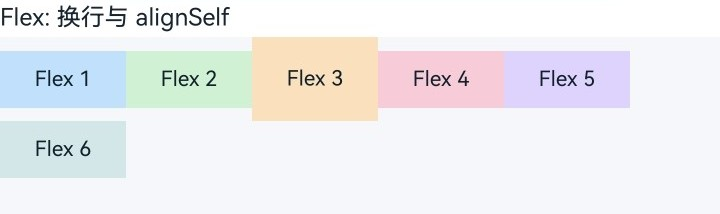
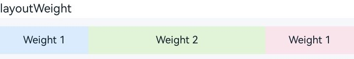

# 使用布局组件

<!--Kit: ArkUI-->
<!--Subsystem: ArkUI-->
<!--Owner: @camlostshi-->
<!--Designer: @camlostshi-->
<!--Tester: @weixin_45530366-->
<!--Adviser: @Brilliantry_Rui-->

从API version 12开始，ArkUI在NDK中提供了常用布局组件[Flex](../reference/apis-arkui/arkui-ts/ts-container-flex.md)、[Row](../reference/apis-arkui/arkui-ts/ts-container-row.md)、[Column](../reference/apis-arkui/arkui-ts/ts-container-column.md)、[Stack](../reference/apis-arkui/arkui-ts/ts-container-stack.md)对应的节点类型和属性设置接口。Flex用于弹性布局，Row和Column用于线性布局，Stack用于层叠布局，对应节点类型和属性设置枚举可参考[ArkUI_NodeType](../reference/apis-arkui/capi-native-node-h.md#arkui_nodetype)。

本文以弹性组件Flex为例，提供NDK下布局组件接入和属性设置的开发指导。本示例仅展示核心功能代码，完整示例请参考<!--RP1-->[NDKFlexSample](https://gitcode.com/openharmony/applications_app_samples/blob/master/code/DocsSample/ArkUISample/NDKFlexSample)<!--RP1End-->；实现前需要先接入ArkTS页面，具体接入方式可参考[接入ArkTS页面](../ui/ndk-access-the-arkts-page.md)。

## 封装容器组件

通过调用[createNode](../reference/apis-arkui/capi-arkui-nativemodule-arkui-nativenodeapi-1.md#createnode)接口，并传入ArkUI_NodeType中的ARKUI_NODE_FLEX，创建Flex节点。如下示例将该节点封装为ArkUIFlexNode，并通过[setAttribute](../reference/apis-arkui/capi-arkui-nativemodule-arkui-nativenodeapi-1.md#setattribute)接口，使用NODE_FLEX_OPTION设置主轴方向、换行和对齐方式。ArkUI_NumberValue中的五个参数分别用于控制不同的弹性布局行为，具体可参考[FlexOptions对象说明](../reference/apis-arkui/arkui-ts/ts-container-flex.md#flexoptions对象说明)。

<!-- @[flex_flex_node](https://gitcode.com/openharmony/applications_app_samples/blob/master/code/DocsSample/ArkUISample/NDKFlexSample/entry/src/main/cpp/ArkUIFlexNode.h) -->

``` C
class ArkUIFlexNode : public ArkUINode {
public:
    ArkUIFlexNode()
        : ArkUINode((NativeModuleInstance::GetInstance()->GetNativeNodeAPI())->createNode(ARKUI_NODE_FLEX)) {}

    ~ArkUIFlexNode() override = default;

    void SetFlexOption(ArkUI_FlexDirection direction, ArkUI_FlexWrap wrap, ArkUI_FlexAlignment justifyContent,
        ArkUI_ItemAlignment alignItems, ArkUI_FlexAlignment alignContent)
    {
        ArkUI_NumberValue value[] = {
            {.i32 = direction},
            {.i32 = wrap},
            {.i32 = justifyContent},
            {.i32 = alignItems},
            {.i32 = alignContent}
        };
        ArkUI_AttributeItem item = {value, 5};
        nativeModule_->setAttribute(handle_, NODE_FLEX_OPTION, &item);
    }
};
```

节点创建完成后，通过预实现的通用属性和上文实现的SetFlexOption，构造了一个预设样式的Flex组件。下面代码展示了如何设置容器按行排列子组件、子组件超出宽度后自动换行、每一行默认从起始位置开始布局。

<!-- @[flex_container_helper](https://gitcode.com/openharmony/applications_app_samples/blob/master/code/DocsSample/ArkUISample/NDKFlexSample/entry/src/main/cpp/FlexLayoutExample.h) -->

``` C
inline std::shared_ptr<ArkUIFlexNode> CreateFlexContainer()
{
    auto flex = std::make_shared<ArkUIFlexNode>();
    flex->SetPercentWidth(FULL_SIZE);
    flex->SetHeight(SECTION_HEIGHT_LARGE);
    flex->SetBackgroundColor(SECTION_BACKGROUND_COLOR);
    flex->SetFlexOption(ARKUI_FLEX_DIRECTION_ROW, ARKUI_FLEX_WRAP_WRAP, ARKUI_FLEX_ALIGNMENT_START,
        ARKUI_ITEM_ALIGNMENT_CENTER, ARKUI_FLEX_ALIGNMENT_START);
    return flex;
}
```

## 添加子组件

如下示例为弹性容器添加了一组子组件。为展示换行和交叉轴对齐效果，为第三个子组件设置单独的高度和[alignSelf](../reference/apis-arkui/arkui-ts/ts-universal-attributes-flex-layout.md#alignself)。alignSelf是在弹性容器内生效的组件通用属性，将该属性设置封装到自定义接口SetAlignSelf中，通过NODE_ALIGN_SELF设置在指定组件上，可以控制单个子组件在父容器交叉轴的对齐格式，且优先级高于容器的[alignItems](../reference/apis-arkui/arkui-ts/ts-container-flex.md#flexoptions对象说明)属性。

<!-- @[flex_align_self_helper](https://gitcode.com/openharmony/applications_app_samples/blob/master/code/DocsSample/ArkUISample/NDKFlexSample/entry/src/main/cpp/FlexLayoutExample.h) -->

``` C
inline void SetAlignSelf(const std::shared_ptr<ArkUIBaseNode> &node, ArkUI_ItemAlignment align)
{
    ArkUI_NumberValue value[] = {{.i32 = align}};
    ArkUI_AttributeItem item = {value, 1};
    NativeModuleInstance::GetInstance()->GetNativeNodeAPI()->setAttribute(node->GetHandle(), NODE_ALIGN_SELF, &item);
}
```

<!-- @[flex_align_self_example](https://gitcode.com/openharmony/applications_app_samples/blob/master/code/DocsSample/ArkUISample/NDKFlexSample/entry/src/main/cpp/FlexLayoutExample.h) -->

``` C
inline std::shared_ptr<ArkUITextNode> CreateFlexExampleItem(int32_t index, uint32_t bgColor)
{
    auto item = CreateFixedItem("Flex " + std::to_string(index + 1), bgColor);
    if (index == ALIGN_SELF_ITEM_INDEX) { item->SetHeight(ALIGN_SELF_ITEM_HEIGHT); }
    if (index == ALIGN_SELF_ITEM_INDEX) { SetAlignSelf(item, ARKUI_ITEM_ALIGNMENT_END); }
    return item;
}
```

在此基础上，创建6个子组件，并添加到同一个Flex组件。

<!-- @[flex_container_example](https://gitcode.com/openharmony/applications_app_samples/blob/master/code/DocsSample/ArkUISample/NDKFlexSample/entry/src/main/cpp/FlexLayoutExample.h) -->

``` C
inline std::array<uint32_t, FLEX_ITEM_COUNT> CreateFlexColorSet()
{
    return {FLEX_ITEM_BLUE, FLEX_ITEM_GREEN, FLEX_ITEM_ORANGE, FLEX_ITEM_PINK, FLEX_ITEM_PURPLE, FLEX_ITEM_TEAL};
}

inline std::shared_ptr<ArkUIFlexNode> CreateFlexWrapExample()
{
    auto flex = CreateFlexContainer();
    const auto flexColors = CreateFlexColorSet();
    for (int32_t index = 0; index < static_cast<int32_t>(flexColors.size()); ++index) { // 循环遍历数组，添加一组子节点
        flex->AddChild(CreateFlexExampleItem(index, flexColors[index]));
    }
    return flex;
}
```

此时，CreateFlexContainer()已将Flex组件的换行行为设置为ARKUI_FLEX_WRAP_WRAP，因此当子组件总宽度超过容器宽度时，布局会自动换行；而第三个子组件调用SetAlignSelf()后，会按照自身的交叉轴对齐规则摆放，而不是使用容器设置的ARKUI_ITEM_ALIGNMENT_CENTER。



如果要将布局方向改为纵向，则可将direction改为ARKUI_FLEX_DIRECTION_COLUMN。此时代码结构保持不变，主轴和交叉轴上的摆放逻辑也保持一致。

## 使用flexBasis和flexGrow分配剩余空间

Flex不仅能够控制子组件排列方向，还能够控制主轴上的剩余空间分配。通过[flexBasis](../reference/apis-arkui/arkui-ts/ts-universal-attributes-flex-layout.md#flexbasis)、[flexGrow](../reference/apis-arkui/arkui-ts/ts-universal-attributes-flex-layout.md#flexgrow)和[flexShrink](../reference/apis-arkui/arkui-ts/ts-universal-attributes-flex-layout.md#flexshrink)三个属性，可以控制子组件的在弹性容器下伸缩行为。

<!-- @[flex_grow_helper](https://gitcode.com/openharmony/applications_app_samples/blob/master/code/DocsSample/ArkUISample/NDKFlexSample/entry/src/main/cpp/FlexLayoutExample.h) -->

``` C
inline void SetFlexGrow(const std::shared_ptr<ArkUIBaseNode> &node, float grow)
{
    ArkUI_NumberValue value[] = {{.f32 = grow}};
    ArkUI_AttributeItem item = {value, 1};
    NativeModuleInstance::GetInstance()->GetNativeNodeAPI()->setAttribute(node->GetHandle(), NODE_FLEX_GROW, &item);
}

inline void SetFlexShrink(const std::shared_ptr<ArkUIBaseNode> &node, float shrink)
{
    ArkUI_NumberValue value[] = {{.f32 = shrink}};
    ArkUI_AttributeItem item = {value, 1};
    NativeModuleInstance::GetInstance()->GetNativeNodeAPI()->setAttribute(
        node->GetHandle(), NODE_FLEX_SHRINK, &item);
}

inline void SetFlexBasis(const std::shared_ptr<ArkUIBaseNode> &node, float basis)
{
    ArkUI_NumberValue value[] = {{.f32 = basis}};
    ArkUI_AttributeItem item = {value, 1};
    NativeModuleInstance::GetInstance()->GetNativeNodeAPI()->setAttribute(node->GetHandle(), NODE_FLEX_BASIS, &item);
}
```

<!-- @[flex_grow_example](https://gitcode.com/openharmony/applications_app_samples/blob/master/code/DocsSample/ArkUISample/NDKFlexSample/entry/src/main/cpp/FlexLayoutExample.h) -->

``` C
inline std::shared_ptr<ArkUITextNode> CreateGrowItem(
    const std::string &text, uint32_t bgColor, float grow, float shrink = 0.0F)
{
    auto item = CreateFlexibleItem(text, bgColor);
    SetFlexBasis(item, FLEX_BASIS);
    SetFlexGrow(item, grow);
    SetFlexShrink(item, shrink);
    return item;
}

inline std::shared_ptr<ArkUIRowNode> CreateFlexGrowExample()
{
    auto growRow = CreateRowContainer();
    growRow->AddChild(CreateGrowItem("1", COLUMN_ITEM_BLUE, DEFAULT_FLEX_GROW));
    growRow->AddChild(CreateGrowItem("2", COLUMN_ITEM_GREEN, EMPHASIZED_FLEX_GROW, EMPHASIZED_FLEX_SHRINK));
    growRow->AddChild(CreateGrowItem("1", COLUMN_ITEM_PINK, DEFAULT_FLEX_GROW));
    return growRow;
}
```

先用SetFlexBasis()给子组件设置主轴上的基准尺寸，再用SetFlexGrow()指定剩余空间的分配比例，最后用SetFlexShrink()定义空间不足时的压缩比例。

示例中三个子组件的flexGrow值分别为1、2、1，因此在容器存在剩余空间时，中间子组件会占据更多宽度。


## 使用layoutWeight按比例分配空间

当父容器主轴尺寸已经确定时，可以通过[layoutWeight](../reference/apis-arkui/arkui-ts/ts-universal-attributes-size.md#layoutweight)按权重分配剩余空间。该属性在Row、Column和Flex中生效。子组件设置的layoutWeight值大于0后，会按照权重占比分配主轴剩余空间，不再参与flexGrow和flexShrink的分配。

<!-- @[flex_layout_weight_helper](https://gitcode.com/openharmony/applications_app_samples/blob/master/code/DocsSample/ArkUISample/NDKFlexSample/entry/src/main/cpp/FlexLayoutExample.h) -->

``` C
inline void SetLayoutWeight(const std::shared_ptr<ArkUIBaseNode> &node, uint32_t weight)
{
    ArkUI_NumberValue value[] = {{.u32 = weight}};
    ArkUI_AttributeItem item = {value, 1};
    NativeModuleInstance::GetInstance()->GetNativeNodeAPI()->setAttribute(
        node->GetHandle(), NODE_LAYOUT_WEIGHT, &item);
}
```

<!-- @[flex_layout_weight_example](https://gitcode.com/openharmony/applications_app_samples/blob/master/code/DocsSample/ArkUISample/NDKFlexSample/entry/src/main/cpp/FlexLayoutExample.h) -->

``` C
inline std::shared_ptr<ArkUITextNode> CreateWeightedItem(const std::string &text, uint32_t bgColor, uint32_t weight)
{
    auto item = CreateFlexibleItem(text, bgColor);
    SetLayoutWeight(item, weight);
    return item;
}

inline std::shared_ptr<ArkUIRowNode> CreateLayoutWeightExample()
{
    auto weightRow = CreateRowContainer();
    weightRow->AddChild(CreateWeightedItem("Weight 1", COLUMN_ITEM_BLUE, DEFAULT_LAYOUT_WEIGHT));
    weightRow->AddChild(CreateWeightedItem("Weight 2", COLUMN_ITEM_GREEN, EMPHASIZED_LAYOUT_WEIGHT));
    weightRow->AddChild(CreateWeightedItem("Weight 1", COLUMN_ITEM_PINK, DEFAULT_LAYOUT_WEIGHT));
    return weightRow;
}
```

示例中三个子组件的layoutWeight值分别为1、2、1，因此中间子组件会分得更多主轴空间。



## 使用displayPriority控制显示优先级

在单行布局场景下，可以通过[displayPriority](../reference/apis-arkui/arkui-ts/ts-universal-attributes-layout-constraints.md#displaypriority)控制子组件的显示优先级。该属性在Row、Column和单行Flex中生效。父容器空间不足时，优先级低的子组件会先被隐藏。

<!-- @[flex_display_priority_helper](https://gitcode.com/openharmony/applications_app_samples/blob/master/code/DocsSample/ArkUISample/NDKFlexSample/entry/src/main/cpp/FlexLayoutExample.h) -->

``` C
inline void SetDisplayPriority(const std::shared_ptr<ArkUIBaseNode> &node, uint32_t priority)
{
    ArkUI_NumberValue value[] = {{.u32 = priority}};
    ArkUI_AttributeItem item = {value, 1};
    NativeModuleInstance::GetInstance()->GetNativeNodeAPI()->setAttribute(
        node->GetHandle(), NODE_DISPLAY_PRIORITY, &item);
}
```

<!-- @[flex_display_priority_example](https://gitcode.com/openharmony/applications_app_samples/blob/master/code/DocsSample/ArkUISample/NDKFlexSample/entry/src/main/cpp/FlexLayoutExample.h) -->

``` C
inline std::shared_ptr<ArkUITextNode> CreatePriorityItem(
    const std::string &text, uint32_t bgColor, uint32_t priority)
{
    auto item = CreateFixedItem(text, bgColor);
    SetDisplayPriority(item, priority);
    return item;
}

inline std::shared_ptr<ArkUIRowNode> CreateDisplayPriorityExample()
{
    auto priorityRow = CreateRowContainer();
    priorityRow->SetWidth(DISPLAY_PRIORITY_ROW_WIDTH);
    priorityRow->SetJustifyContent(ARKUI_FLEX_ALIGNMENT_START);
    priorityRow->AddChild(CreatePriorityItem("High", COLUMN_ITEM_BLUE, HIGH_DISPLAY_PRIORITY));
    priorityRow->AddChild(CreatePriorityItem("Mid", COLUMN_ITEM_GREEN, MEDIUM_DISPLAY_PRIORITY));
    priorityRow->AddChild(CreatePriorityItem("Low", COLUMN_ITEM_PINK, LOW_DISPLAY_PRIORITY));
    return priorityRow;
}
```

示例先设置了较窄的Row容器宽度，再分别设置3、2、1三个优先级。当空间不足时，优先级最低的第三个子组件会先隐藏。


