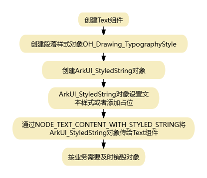

# 使用属性字符串
<!--Kit: ArkUI-->
<!--Subsystem: ArkUI-->
<!--Owner: @hddgzw-->
<!--Designer: @xiangyuan6-->
<!--Tester: @jiaoaozihao-->
<!--Adviser: @Brilliantry_Rui-->

部分框架或应用具备自研的文字排版能力，在移植时，其文字排版能力会被对接到[方舟2D图形服务的文本引擎](../graphics/complex-text-c.md)。为了避免开发者重复开发文本组件，Text组件可以通过[ArkUI_NodeAttributeType](../reference/apis-arkui/capi-native-node-h.md#arkui_nodeattributetype)中的NODE_TEXT_CONTENT_WITH_STYLED_STRING属性，使用格式化字符串对象设置文本内容属性，直接渲染方舟文本引擎生成的文本。

> **说明：**
>
> - 本篇示例仅提供核心接口的调用方法，完整的示例工程请参考<!--RP1-->[StyledStringSample](https://gitcode.com/openharmony/applications_app_samples/tree/master/code/DocsSample/ArkUISample/StyledStringSample)<!--RP1End-->。
>

以下示例代码基于[接入ArkTS页面章节](./ndk-access-the-arkts-page.md)，阐述了如何创建StyledString，并利用[ArkUI_NodeType](../reference/apis-arkui/capi-native-node-h.md#arkui_nodetype)为ARKUI_NODE_TEXT的组件进行渲染显示。

下图展示了 `NODE_TEXT_CONTENT_WITH_STYLED_STRING` 接口的主要使用流程。



## 创建StyledString对象

使用[OH_ArkUI_StyledString_Create](../reference/apis-arkui/capi-styled-string-h.md#oh_arkui_styledstring_create)接口创建StyledString对象，需要传入[段落样式](#设置段落样式)。

<!-- @[styledstring_create](https://gitcode.com/openharmony/applications_app_samples/blob/master/code/DocsSample/ArkUISample/StyledStringSample/entry/src/main/cpp/manager.cpp) -->

``` C++
// 创建StyledString并设置文本内容
ArkUI_StyledString *styledString = OH_ArkUI_StyledString_Create(typographyStyle, fontCollection);
```

## 通过StyledString设置样式

StyledString支持为文本中的不同部分设置不同的样式，包括段落样式和文本样式。

### 设置段落样式

通过如下接口可以设置StyledString的段落样式属性，包括最大行数、对齐方式等。

> **说明：**
>
> StyledString需要依赖`OH_Drawing_`前缀的方舟字体引擎接口进行字体以及段落样式的设置，参考[简单文本绘制与显示（C/C++）](../graphics/simple-text-c.md)、[复杂文本绘制与显示（C/C++）](../graphics/complex-text-c.md)。涉及字体引擎的接口，需在CMakeLists.txt中添加`target_link_libraries(entry PUBLIC libnative_drawing.so)`，否则链接阶段会报错。

**表1** 段落样式设置接口

| 接口 | 描述 |
| ---- | ---- |
| [OH_Drawing_CreateFontCollection](../reference/apis-arkgraphics2d/capi-drawing-font-collection-h.md#oh_drawing_createfontcollection) | 创建字体集对象。 |
| [OH_Drawing_CreateTypographyStyle](../reference/apis-arkgraphics2d/capi-drawing-text-typography-h.md#oh_drawing_createtypographystyle) | 创建段落样式对象。 |
| [OH_Drawing_SetTypographyTextAlign](../reference/apis-arkgraphics2d/capi-drawing-text-typography-h.md#oh_drawing_settypographytextalign) | 设置文本对齐方式。 |
| [OH_Drawing_SetTypographyTextMaxLines](../reference/apis-arkgraphics2d/capi-drawing-text-typography-h.md#oh_drawing_settypographytextmaxlines) | 设置文本最大行数。 |

以下代码示例设置了文字居中，最大行数限制为10。

<!-- @[styledstring_paragraph_style](https://gitcode.com/openharmony/applications_app_samples/blob/master/code/DocsSample/ArkUISample/StyledStringSample/entry/src/main/cpp/manager.cpp) -->

``` C++
// 创建字体集合与段落样式
OH_Drawing_FontCollection *fontCollection = OH_Drawing_CreateFontCollection();
OH_Drawing_TypographyStyle *typographyStyle = OH_Drawing_CreateTypographyStyle();
OH_Drawing_SetTypographyTextAlign(typographyStyle, OH_Drawing_TextAlign::TEXT_ALIGN_CENTER);
OH_Drawing_SetTypographyTextMaxLines(typographyStyle, NUM_10);
```

### 设置文本样式

不同内容的文本可以通过StyledString设置不同的文本样式，但必须按照以下三个接口的逻辑调用顺序进行设置，否则将无法生效。

1. [OH_ArkUI_StyledString_PushTextStyle](../reference/apis-arkui/capi-styled-string-h.md#oh_arkui_styledstring_pushtextstyle)：将文字样式推入栈中。
2. [OH_ArkUI_StyledString_AddText](../reference/apis-arkui/capi-styled-string-h.md#oh_arkui_styledstring_addtext)：添加要修改样式的文字内容。
3. [OH_ArkUI_StyledString_PopTextStyle](../reference/apis-arkui/capi-styled-string-h.md#oh_arkui_styledstring_poptextstyle)：将文字样式弹出栈。

**表2** 文本样式设置接口

| 接口 | 描述 |
| ---- | ---- |
| [OH_Drawing_CreateTextStyle](../reference/apis-arkgraphics2d/capi-drawing-text-typography-h.md#oh_drawing_createtextstyle) | 创建文本样式对象。 |
| [OH_Drawing_SetTextStyleFontSize](../reference/apis-arkgraphics2d/capi-drawing-text-typography-h.md#oh_drawing_settextstylefontsize) | 设置字体大小。 |
| [OH_Drawing_SetTextStyleColor](../reference/apis-arkgraphics2d/capi-drawing-text-typography-h.md#oh_drawing_settextstylecolor) | 设置字体颜色。 |

使用[OH_Drawing_CreateTextStyle](../reference/apis-arkgraphics2d/capi-drawing-text-typography-h.md#oh_drawing_createtextstyle)创建文本样式。以下示例设置"Hello"字体大小28px，颜色为0xFF707070，显示为灰色；设置"World!"字体大小为28px，颜色为0xFF2787D9，显示为蓝色。

<!-- @[styledstring_text_style](https://gitcode.com/openharmony/applications_app_samples/blob/master/code/DocsSample/ArkUISample/StyledStringSample/entry/src/main/cpp/manager.cpp) -->

``` C++
// 第一段文本（灰色"Hello"）
OH_Drawing_TextStyle *textStyle = OH_Drawing_CreateTextStyle();
OH_Drawing_SetTextStyleFontSize(textStyle, FONT_SIZE);
OH_Drawing_SetTextStyleColor(textStyle, TEXT_COLOR_GRAY);
OH_ArkUI_StyledString_PushTextStyle(styledString, textStyle);
OH_ArkUI_StyledString_AddText(styledString, "Hello");
OH_ArkUI_StyledString_PopTextStyle(styledString);
```

<!-- @[styledstring_world](https://gitcode.com/openharmony/applications_app_samples/blob/master/code/DocsSample/ArkUISample/StyledStringSample/entry/src/main/cpp/manager.cpp) -->

``` C++
// 第二段文本（蓝色"World!"）
OH_Drawing_TextStyle *worldTextStyle = OH_Drawing_CreateTextStyle();
OH_Drawing_SetTextStyleFontSize(worldTextStyle, FONT_SIZE);
OH_Drawing_SetTextStyleColor(worldTextStyle, TEXT_COLOR_BLUE);
OH_ArkUI_StyledString_PushTextStyle(styledString, worldTextStyle);
OH_ArkUI_StyledString_AddText(styledString, "World!");
OH_ArkUI_StyledString_PopTextStyle(styledString);
```


## 添加占位符

占位符功能主要用于图文混排场景，可以在文本中插入指定大小的空白区域，用于挂载Image组件或其他自定义内容。

使用[OH_ArkUI_StyledString_AddPlaceholder](../reference/apis-arkui/capi-styled-string-h.md#oh_arkui_styledstring_addplaceholder)接口在文本中插入占位符。

<!-- @[styledstring_placeholder](https://gitcode.com/openharmony/applications_app_samples/blob/master/code/DocsSample/ArkUISample/StyledStringSample/entry/src/main/cpp/manager.cpp) -->

``` C++
// 添加占位符
OH_Drawing_PlaceholderSpan placeHolder{.width = PLACEHOLDER_WIDTH, .height = PLACEHOLDER_HEIGHT};
OH_ArkUI_StyledString_AddPlaceholder(styledString, &placeHolder);
```

## 布局与绘制

StyledString在设置到Text组件之前，需要先完成布局计算，然后再进行渲染。

文字样式和内容设置完成后，调用字体引擎接口[OH_Drawing_TypographyLayout](../reference/apis-arkgraphics2d/capi-drawing-text-typography-h.md#oh_drawing_typographylayout)对文本进行布局，传入最大宽度。超过此宽度的文字会自动换行。

<!-- @[styledstring_layout](https://gitcode.com/openharmony/applications_app_samples/blob/master/code/DocsSample/ArkUISample/StyledStringSample/entry/src/main/cpp/manager.cpp) -->

``` C++
OH_Drawing_Typography *typography = OH_ArkUI_StyledString_CreateTypography(styledString);
OH_Drawing_TypographyLayout(typography, LAYOUT_MAX_WIDTH);
// 布局完成后，将StyledString设置给Text组件
ArkUI_AttributeItem styledStringItem = {.object = styledString};
nodeApi->setAttribute(text, NODE_TEXT_CONTENT_WITH_STYLED_STRING, &styledStringItem);
```

## 序列化与反序列化

从API version 14开始，StyledString提供了序列化和反序列化功能，支持将格式化字符串转换为字节数组或HTML格式，便于数据的存储、传输和跨平台使用。

**表3** 序列化与反序列化接口

| 接口 | 描述 |
| ---- | ---- |
| [OH_ArkUI_StyledString_Descriptor_Create](../reference/apis-arkui/capi-styled-string-h.md#oh_arkui_styledstring_descriptor_create) | 创建StyledString描述符。 |
| [OH_ArkUI_UnmarshallStyledStringDescriptor](../reference/apis-arkui/capi-styled-string-h.md#oh_arkui_unmarshallstyledstringdescriptor) | 反序列化字节数据到描述符。 |
| [OH_ArkUI_ConvertToHtml](../reference/apis-arkui/capi-styled-string-h.md#oh_arkui_converttohtml) | 将描述符转换为HTML格式。 |
| [OH_ArkUI_StyledString_Descriptor_Destroy](../reference/apis-arkui/capi-styled-string-h.md#oh_arkui_styledstring_descriptor_destroy) | 销毁StyledString描述符。 |

以下示例展示了如何创建描述符、反序列化字节数据、转换为HTML并进行验证。

<!-- @[serializeAndDeserialize_styledString](https://gitcode.com/openharmony/applications_app_samples/blob/master/code/DocsSample/ArkUISample/StyledStringSample/entry/src/main/cpp/manager.cpp) -->

``` C++
static void SerializeAndDeserializeStyledString()
{
    // 准备测试数据
    uint8_t data_bytes[] = {0x01, 0x02, 0x03, 0x04, 0x05, 0x06, 0x07, 0x08};
    size_t dataSize = sizeof(data_bytes) / sizeof(data_bytes[0]);

    // 创建StyledString描述符
    auto desc = OH_ArkUI_StyledString_Descriptor_Create();
    if (desc == nullptr) {
        OH_LOG_Print(LOG_APP, LOG_ERROR, LOG_PRINT_DOMAIN, "styledString", "Create Descriptor failed");
        return;
    }

    // 反序列化字节数据
    auto status = OH_ArkUI_UnmarshallStyledStringDescriptor(data_bytes, dataSize, desc);
    OH_LOG_Print(LOG_APP, LOG_ERROR, LOG_PRINT_DOMAIN, "styledString", "Unmarshall status: %{public}d", status);

    // 转换为HTML格式
    const char* html = OH_ArkUI_ConvertToHtml(desc);
    OH_LOG_Print(LOG_APP, LOG_INFO, LOG_PRINT_DOMAIN, "styledString", "html: [%{public}s]", html);
    size_t resultSize = dataSize + 2;
    uint8_t *buf1 = (uint8_t *)malloc(10 * sizeof(uint8_t));
    if (buf1 == nullptr) {
        OH_ArkUI_StyledString_Descriptor_Destroy(desc);
        return;
    }
    OH_LOG_Print(LOG_APP, LOG_INFO, LOG_PRINT_DOMAIN, "styledString", "resultSize: %{public}zu", resultSize);
    uint8_t *buf2 = (uint8_t *)malloc(resultSize * sizeof(uint8_t));

    // 序列化字节数组
    if (buf2 != nullptr) {
        if (resultSize >= dataSize) {
            for (size_t i = 0; i < dataSize; i++) {
                buf2[i] = data_bytes[i];
            }
        } else {
            OH_LOG_Print(LOG_APP, LOG_ERROR, LOG_PRINT_DOMAIN, "styledString",
                         "Buf too small: %{public}zu < %{public}zu", resultSize, dataSize);
            free(buf2);
            free(buf1);
            OH_ArkUI_StyledString_Descriptor_Destroy(desc);
            return;
        }
        bool equal = true;
        for (size_t i = 0; i < dataSize && equal; i++) equal = (data_bytes[i] == buf2[i]);
        OH_LOG_Print(LOG_APP, LOG_INFO, LOG_PRINT_DOMAIN, "styledString",
            "Before: %{public}zu, After: %{public}zu, Equal: %{public}d", dataSize, resultSize, equal);
        free(buf2);
    }
    free(buf1);

    // 释放描述符
    OH_ArkUI_StyledString_Descriptor_Destroy(desc);
}
```
## 销毁对象

Text组件不对本文涉及的任何对象的生命周期进行管理，需由开发者自行负责。字体引擎接口均配有相应的销毁方法。

`OH_Drawing_DestroyTextStyle(OH_Drawing_TextStyle *style)`：销毁文本样式对象。

`OH_Drawing_DestroyTypographyStyle(OH_Drawing_TypographyStyle *style)`：销毁段落样式对象。

当Text组件仍在界面上显示时，此时释放会导致文字无法绘制。在实际业务场景下需确保Text组件不再使用时才释放。

相关字体引擎销毁的接口请参考[OH_Drawing_DestroyTextStyle](../reference/apis-arkgraphics2d/capi-drawing-text-typography-h.md#oh_drawing_destroytextstyle) 和 [OH_Drawing_DestroyTypographyStyle](../reference/apis-arkgraphics2d/capi-drawing-text-typography-h.md#oh_drawing_destroytypographystyle)。

Text组件提供[OH_ArkUI_StyledString_Destroy](../reference/apis-arkui/capi-styled-string-h.md#oh_arkui_styledstring_destroy)，用于销毁属性字符串对象。