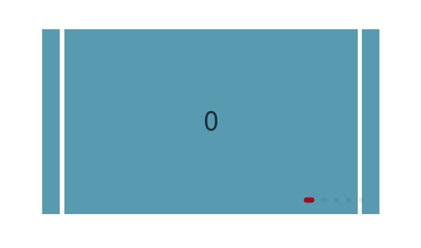

# 使用滑块视图容器 (Swiper)
<!--Kit: ArkUI-->
<!--Subsystem: ArkUI-->
<!--Owner: @Hu_ZeQi-->
<!--Designer: @jiangdayuan-->
<!--Tester: @Giacinta-->
<!--Adviser: @Brilliantry_Rui-->

## 概述

ArkUI开发框架支持在NDK接口使用滑块视图容器Swiper，提供子组件滑动轮播显示的能力。本文介绍NDK接口的开发指导，ArkTS指南请参考[创建轮播 (Swiper)](arkts-layout-development-create-looping.md)。

使用NDK接口构建UI界面以及NDK基本使用，可以参考[接入ArkTS页面](ndk-access-the-arkts-page.md)。页面构建完成[创建Swiper](#创建swiper)后，可以通过[设置常用属性](#设置常用属性)和[设置导航指示器](#设置导航指示器)优化页面显示效果，页面切换时可以通过[监听事件](#监听事件)获取页面切换信息。

## 创建Swiper

本示例通过调用[createNode](../reference/apis-arkui/capi-arkui-nativemodule-arkui-nativenodeapi-1.md#createnode)创建ARKUI_NODE_SWIPER类型的UI组件节点，用于后续设置属性等操作。并通过[addChild](../reference/apis-arkui/capi-arkui-nativemodule-arkui-nativenodeapi-1.md#addchild)在Swiper组件下挂载了多个Text文本组件，作为内容显示。

本示例仅展示核心功能代码，完整示例请参考工程<!--RP1-->[NDKSwiperSample](https://gitcode.com/openharmony/applications_app_samples/blob/master/code/DocsSample/ArkUISample/NDKSwiperSample)<!--RP1End-->。

<!-- @[swiper_create](https://gitcode.com/openharmony/applications_app_samples/blob/master/code/DocsSample/ArkUISample/NDKSwiperSample/entry/src/main/cpp/NativeEntry.cpp) -->

``` C++
ArkUI_NativeNodeAPI_1 *nodeApi = nullptr;
OH_ArkUI_GetModuleInterface(ARKUI_NATIVE_NODE, ArkUI_NativeNodeAPI_1, nodeApi);
ArkUI_NodeHandle swiper = nodeApi->createNode(ARKUI_NODE_SWIPER);
AddChild(swiper, nodeApi);
```

## 设置常用属性

本示例通过设置[ArkUI_NodeAttributeType](../reference/apis-arkui/capi-native-node-h.md#arkui_nodeattributetype)中的属性调整页面显示效果，常见的属性如下：

| 枚举项 | 描述 |
|---------|----------|
| NODE_HEIGHT_PERCENT  | 组件高度百分比。 |
| NODE_WIDTH_PERCENT   | 组件宽度百分比 |
| NODE_SWIPER_PREV_MARGIN   | 前边距大小，当前可见项前一个子项显示在视窗内的大小。 |
| NODE_SWIPER_NEXT_MARGIN   | 后边距大小，当前可见项后一个子项显示在视窗内的大小。 |
| NODE_SWIPER_ITEM_SPACE    | 子项之间的显示间距。 |
| NODE_SWIPER_AUTO_PLAY     | 是否开启自动轮播。   |

本示例仅展示核心功能代码，完整示例请参考工程<!--RP1-->[NDKSwiperSample](https://gitcode.com/openharmony/applications_app_samples/blob/master/code/DocsSample/ArkUISample/NDKSwiperSample)<!--RP1End-->。

<!-- @[swiper_attribute](https://gitcode.com/openharmony/applications_app_samples/blob/master/code/DocsSample/ArkUISample/NDKSwiperSample/entry/src/main/cpp/NativeEntry.cpp) -->

``` C++
// 设置常用属性
ArkUI_NumberValue value[] = {0};
ArkUI_AttributeItem item = {.value = value, .size = 1};
value[0].f32 = SWIPER_HEIGHT_PERCENT;
nodeApi->setAttribute(swiper, NODE_HEIGHT_PERCENT, &item);
value[0].f32 = SWIPER_WIDTH_PERCENT;
nodeApi->setAttribute(swiper, NODE_WIDTH_PERCENT, &item);

value[0].f32 = PREV_AND_NEXT_MARGIN;
nodeApi->setAttribute(swiper, NODE_SWIPER_PREV_MARGIN, &item);
nodeApi->setAttribute(swiper, NODE_SWIPER_NEXT_MARGIN, &item);
value[0].f32 = ITEM_SPACE;
nodeApi->setAttribute(swiper, NODE_SWIPER_ITEM_SPACE, &item);
value[0].i32 = 1;
nodeApi->setAttribute(swiper, NODE_SWIPER_AUTO_PLAY, &item);
```

## 设置导航指示器

本示例通过[OH_ArkUI_SwiperIndicator_Create](../reference/apis-arkui/capi-native-type-h.md#oh_arkui_swiperindicator_create)(ARKUI_SWIPER_INDICATOR_TYPE_DOT)创建圆点类型的导航指示器，并通过[OH_ArkUI_SwiperIndicator_SetEndPosition](../reference/apis-arkui/capi-native-type-h.md#oh_arkui_swiperindicator_setendposition)、[OH_ArkUI_SwiperIndicator_SetSelectedColor](../reference/apis-arkui/capi-native-type-h.md#oh_arkui_swiperindicator_setselectedcolor)接口分别设置导航指示器距离Swiper组件右边的距离和选中圆点的颜色。

本示例仅展示核心功能代码，完整示例请参考工程<!--RP1-->[NDKSwiperSample](https://gitcode.com/openharmony/applications_app_samples/blob/master/code/DocsSample/ArkUISample/NDKSwiperSample)<!--RP1End-->。

<!-- @[indicator_attribute](https://gitcode.com/openharmony/applications_app_samples/blob/master/code/DocsSample/ArkUISample/NDKSwiperSample/entry/src/main/cpp/NativeEntry.cpp) -->

``` C++
// 设置导航导航指示器属性
ArkUI_SwiperIndicator *swiperIndicatorStyle = OH_ArkUI_SwiperIndicator_Create(ARKUI_SWIPER_INDICATOR_TYPE_DOT);
OH_ArkUI_SwiperIndicator_SetEndPosition(swiperIndicatorStyle, 0);
OH_ArkUI_SwiperIndicator_SetSelectedColor(swiperIndicatorStyle, INDICATOR_COLOR_SELECTED);

ArkUI_NumberValue value[] = {0};
ArkUI_AttributeItem item = {.value = value, .size = 1, .object = swiperIndicatorStyle};
value[0].i32 = ARKUI_SWIPER_INDICATOR_TYPE_DOT;
nodeApi->setAttribute(swiper, NODE_SWIPER_INDICATOR, &item);

OH_ArkUI_SwiperIndicator_Dispose(swiperIndicatorStyle);
```

显示效果如下图：



## 监听事件

本示例通过[registerNodeEvent](../reference/apis-arkui/capi-arkui-nativemodule-arkui-nativenodeapi-1.md#registernodeevent)注册Swiper组件的对应支持的事件类型[ArkUI_NodeEventType](../reference/apis-arkui/capi-native-node-h.md#arkui_nodeeventtype)，开发者可以通过[registerNodeEventReceiver](../reference/apis-arkui/capi-arkui-nativemodule-arkui-nativenodeapi-1.md#registernodeeventreceiver)注册的监听回调中，判断回调类型并解析对应的回调内容。涉及的回调如下：

| 枚举项 | 描述 |
|---------|----------|
| NODE_SWIPER_EVENT_ON_CHANGE  | 页面索引切换后显示的页面索引。 |
| NODE_SWIPER_EVENT_ON_ANIMATION_START   | 页面切换动画开始时，当前显示的页面索引和动画结束时切换到的页面索引。 |

本示例仅展示核心功能代码，完整示例请参考工程<!--RP1-->[NDKSwiperSample](https://gitcode.com/openharmony/applications_app_samples/blob/master/code/DocsSample/ArkUISample/NDKSwiperSample)<!--RP1End-->。

<!-- @[swiper_event](https://gitcode.com/openharmony/applications_app_samples/blob/master/code/DocsSample/ArkUISample/NDKSwiperSample/entry/src/main/cpp/NativeEntry.cpp) -->

``` C++
// 注册翻页事件监听
nodeApi->registerNodeEvent(swiper, NODE_SWIPER_EVENT_ON_CHANGE, 0, nullptr);
nodeApi->registerNodeEvent(swiper, NODE_SWIPER_EVENT_ON_ANIMATION_START, 1, nullptr);
nodeApi->registerNodeEventReceiver([](ArkUI_NodeEvent *event) {
    ArkUI_NodeEventType eventType = OH_ArkUI_NodeEvent_GetEventType(event);
    if (eventType == NODE_SWIPER_EVENT_ON_CHANGE) {
        auto componentEvent = OH_ArkUI_NodeEvent_GetNodeComponentEvent(event);
        if (componentEvent) {
            auto index = componentEvent->data[0].i32;
            OH_LOG_Print(LOG_APP, LOG_INFO, LOG_PRINT_DOMAIN, "NDKSwiper",
                         "NODE_SWIPER_EVENT_ON_CHANGE index = %{public}d", index);
        }
    }
    if (eventType == NODE_SWIPER_EVENT_ON_ANIMATION_START) {
        auto componentEvent = OH_ArkUI_NodeEvent_GetNodeComponentEvent(event);
        if (componentEvent) {
            auto currentIndex = componentEvent->data[0].i32;
            auto targetIndex = componentEvent->data[1].i32;
            OH_LOG_Print(LOG_APP, LOG_INFO, LOG_PRINT_DOMAIN, "NDKSwiper",
                         "NODE_SWIPER_EVENT_ON_ANIMATION_START currentIndex = %{public}d, targetIndex = %{public}d",
                         currentIndex, targetIndex);
        }
    }
});
```
