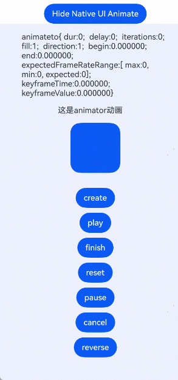

# 使用动画
<!--Kit: ArkUI-->
<!--Subsystem: ArkUI-->
<!--Owner: @CCFFWW-->
<!--Designer: @CCFFWW-->
<!--Tester: @lxl007-->
<!--Adviser: @Brilliantry_Rui-->


## 使用属性动画

ArkUI开发框架在NDK接口主要提供属性动画，实现组件出现/消失转场。同时，可以通过Node-API桥接ArkTS侧帧动画能力，实现Native侧的动画效果。

> **说明：**
>
> - 需要从ArkTS侧获取[this.getUIContext()](../reference/apis-arkui/arkui-ts/ts-custom-component-api.md#getuicontext)，传入到Native侧。
> 
> - 在Native侧通过[OH_ArkUI_GetContextFromNapiValue](../reference/apis-arkui/capi-native-node-napi-h.md)方法获取context。
> 
> - 需要执行的动画属性变化必须写在[ArkUI_ContextCallback](../reference/apis-arkui/capi-arkui-nativemodule-arkui-contextcallback.md)中的callback中。
> 
> - 需要执行的动画属性，必须在执行动画之前设置过。
>
> - 本篇示例仅提供核心接口的调用方法，完整的示例工程请参考<!--RP1-->[AnimationNDK](https://gitcode.com/openharmony/applications_app_samples/tree/master/code/DocsSample/ArkUISample/AnimationNDK)<!--RP1End-->。

提供全局animateTo显式动画接口，来指定由于闭包代码导致的状态变化插入过渡动效。同属性动画，布局类改变宽高的动画，内容都是直接到终点状态。

1. 在.ets文件中创建[NodeContent](../reference//apis-arkui/js-apis-arkui-NodeContent.md)，把NodeContent作为参数输出到Native方法中。

    <!-- @[get_content](https://gitcode.com/openharmony/applications_app_samples/blob/master/code/DocsSample/ArkUISample/AnimationNDK/entry/src/main/ets/pages/UseFrameAnimation.ets) -->
    
    ``` TypeScript
      // 初始化NodeContent对象。
      private rootSlot = new NodeContent();
      @State @Watch('changeNativeFlag') showNative: boolean = false;
    // ···
      changeNativeFlag(): void {
        // ···
        if (this.showNative) {
          // 传递NodeContent对象用于Native创建组件的挂载显示
          nativeNode?.createNativeRoot(this.rootSlot);
        } else {
        // ···
        }
      }
    ```

2. 解析NodeContent，转换为C中的ArkUI_NodeContentHandle对象。

    <!-- @[get_context](https://gitcode.com/openharmony/applications_app_samples/blob/master/code/DocsSample/ArkUISample/AnimationNDK/entry/src/main/cpp/NativeEntry.cpp) -->
    
    ``` C++
    // 获取NodeContent
    ArkUI_NodeContentHandle contentHandle;
    OH_ArkUI_GetNodeContentFromNapiValue(env, args[0], &contentHandle);
    ```

3. 获取ArkUI_NativeAnimateAPI_1 对象。

    <!-- @[get_Api](https://gitcode.com/openharmony/applications_app_samples/blob/master/code/DocsSample/ArkUISample/AnimationNDK/entry/src/main/cpp/ArkUIAnimate.h) -->
    
    ``` C
    // 获取ArkUI_NativeAnimateAPI接口
    ArkUI_NativeAnimateAPI_1 *animateApi = nullptr;
    OH_ArkUI_GetModuleInterface(ARKUI_NATIVE_ANIMATE, ArkUI_NativeAnimateAPI_1, animateApi);
    ```

4. 设置 ArkUI_AnimateOption参数，通过提供的C方法设置对应的参数。

    <!-- @[set_option](https://gitcode.com/openharmony/applications_app_samples/blob/master/code/DocsSample/ArkUISample/AnimationNDK/entry/src/main/cpp/ArkUIAnimate.h) -->
    
    ``` C
    // 设置动画参数
    ArkUI_AnimateOption *option = OH_ArkUI_AnimateOption_Create();
    OH_ArkUI_AnimateOption_SetDuration(option, NUM_2000); // NUM_2000 = 2000
    OH_ArkUI_AnimateOption_SetTempo(option, 1.1);
    OH_ArkUI_AnimateOption_SetCurve(option, ARKUI_CURVE_EASE);
    ArkUI_CurveHandle cubicBezierCurve = OH_ArkUI_Curve_CreateCubicBezierCurve(0.5f, 4.0f, 1.2f, 0.0f);
    // 设置动画的动画曲线，优先于OH_ArkUI_AnimateOption_SetCurve生效
    OH_ArkUI_AnimateOption_SetICurve(option, cubicBezierCurve);
    OH_ArkUI_AnimateOption_SetDelay(option, NUM_20); // NUM_20 = 20
    OH_ArkUI_AnimateOption_SetIterations(option, NUM_1); // NUM_1 = 1
    OH_ArkUI_AnimateOption_SetPlayMode(option, ARKUI_ANIMATION_PLAY_MODE_REVERSE);
    ArkUI_ExpectedFrameRateRange *range = new ArkUI_ExpectedFrameRateRange;
    range->min = NUM_10; // NUM_10 = 10
    range->max = NUM_120; // NUM_120 = 120
    range->expected = NUM_60; // NUM_60 = 60
    OH_ArkUI_AnimateOption_SetExpectedFrameRateRange(option, range);
    ```

5. 设置回调参数。

    <!-- @[set_callback](https://gitcode.com/openharmony/applications_app_samples/blob/master/code/DocsSample/ArkUISample/AnimationNDK/entry/src/main/cpp/ArkUIAnimate.h) -->
    
    ``` C
    // 设置完成的回调
    ArkUI_AnimateCompleteCallback *completeCallback = new ArkUI_AnimateCompleteCallback;
    completeCallback->type = ARKUI_FINISH_CALLBACK_REMOVED;
    // 结构体AnimateData中包含ArkUI_AnimateOption* option和ArkUI_CurveHandle curve
    AnimateData* data = new AnimateData();
    data->option = option;
    data->curve = cubicBezierCurve;
    completeCallback->userData = reinterpret_cast<void*>(data);
    completeCallback->callback = [](void *userData) {
        AnimateData* data = reinterpret_cast<AnimateData*>(userData);
        if (data) {
            ArkUI_AnimateOption* option = data->option;
            ArkUI_CurveHandle curve = data->curve;
            if (option) {
                OH_ArkUI_AnimateOption_Dispose(option);
                OH_LOG_Print(LOG_APP, LOG_ERROR, LOG_PRINT_DOMAIN,
                    "Init", "CXX OH_ArkUI_AnimateOption_Dispose  success!");
            }
            if (curve) {
                OH_ArkUI_Curve_DisposeCurve(curve);
                OH_LOG_Print(LOG_APP, LOG_ERROR, LOG_PRINT_DOMAIN,
                    "Init", "CXX OH_ArkUI_Curve_DisposeCurve  success!");
            }
            delete data; // 释放结构体
        }
    };
                
    // 设置闭包函数
    static bool isback = true;
    ArkUI_ContextCallback *update = new ArkUI_ContextCallback;
    update->callback = [](void *user) {
        // 对应的属性变化 width height
        if (isback) {
            g_animateto_button->SetWidth(NUM_200); // NUM_200 = 200
            g_animateto_button->SetHeight(NUM_80); // NUM_80 = 80
            g_animateto_button->SetBackgroundColor(0xFFA280FF);
        } else {
            g_animateto_button->SetWidth(NUM_100); // NUM_100 = 100
            g_animateto_button->SetHeight(NUM_40); // NUM_40 = 40
            g_animateto_button->SetBackgroundColor(0xFFFF2E77);
        }
        isback = !isback;
    };
    // 执行对应的动画
    animateApi->animateTo(context, option, update, completeCallback);
    ```

   

## 组件出现/消失转场

组件内转场通过NODE_XX_TRANSITION属性（XX包括：OPACITY、TRANSLATE、SCALE、ROTATE、MOVE）配置转场参数，在组件插入和删除时显示过渡动效（通过NODE_TRANSFORM_CENTER属性设置NODE_SCALE_TRANSITION和NODE_ROTATE_ROTATE动效的中心点坐标）。主要用于容器组件中子组件插入和删除时，提升用户体验。

1. 创建可交互界面，界面中包含Button，点击可以控制转场节点的添加和移除。其中 ArkUI_NodeContentHandle 类型节点的获取与使用可参考[接入ArkTS页面](ndk-access-the-arkts-page.md)。

    <!-- @[main_view_method](https://gitcode.com/openharmony/applications_app_samples/blob/master/code/DocsSample/ArkUISample/AnimationNDK/entry/src/main/cpp/ArkUITransition.h) -->
    
    ``` C
    constexpr int32_t BUTTON_CLICK_ID = 1;
    bool g_flag = false;
    ArkUI_NodeHandle parentNode;
    ArkUI_NodeHandle childNode;
    ArkUI_NodeHandle buttonNode;
    // ···
    void mainViewMethod(ArkUI_NodeContentHandle handle)
    {
        ArkUI_NativeNodeAPI_1 *nodeAPI = reinterpret_cast<ArkUI_NativeNodeAPI_1 *>(
            OH_ArkUI_QueryModuleInterfaceByName(ARKUI_NATIVE_NODE, "ArkUI_NativeNodeAPI_1"));
        ArkUI_NodeHandle column = nodeAPI->createNode(ARKUI_NODE_COLUMN);
        ArkUI_NumberValue widthValue[] = {{.f32 = 500}};
        ArkUI_AttributeItem widthItem = {.value = widthValue, .size = sizeof(widthValue) / sizeof(ArkUI_NumberValue)};
        nodeAPI->setAttribute(column, NODE_WIDTH, &widthItem);
        ArkUI_NumberValue heightValue[] = {{.f32 = 500}};
        ArkUI_AttributeItem heightItem = {.value = heightValue, .size = sizeof(heightValue) / sizeof(ArkUI_NumberValue)};
        nodeAPI->setAttribute(column, NODE_HEIGHT, &heightItem);
        ArkUI_NodeHandle buttonShow = nodeAPI->createNode(ARKUI_NODE_BUTTON);
        ArkUI_NumberValue buttonWidthValue[] = {{.f32 = 200}};
        ArkUI_AttributeItem buttonWidthItem = {.value = buttonWidthValue,
                                               .size = sizeof(buttonWidthValue) / sizeof(ArkUI_NumberValue)};
        nodeAPI->setAttribute(buttonShow, NODE_WIDTH, &buttonWidthItem);
        ArkUI_NumberValue buttonHeightValue[] = {{.f32 = 50}};
        ArkUI_AttributeItem buttonHeightItem = {.value = buttonHeightValue,
                                                .size = sizeof(buttonHeightValue) / sizeof(ArkUI_NumberValue)};
        nodeAPI->setAttribute(buttonShow, NODE_HEIGHT, &buttonHeightItem);
        ArkUI_AttributeItem labelItem = {.string = "show"};
        nodeAPI->setAttribute(buttonShow, NODE_BUTTON_LABEL, &labelItem);
        ArkUI_NumberValue buttonOpenTypeValue[] = {{.i32 = static_cast<int32_t>(ARKUI_BUTTON_TYPE_NORMAL)}};
        ArkUI_AttributeItem buttonOpenTypeItem = {.value = buttonOpenTypeValue,
                                                  .size = sizeof(buttonOpenTypeValue) / sizeof(ArkUI_NumberValue)};
        nodeAPI->setAttribute(buttonShow, NODE_BUTTON_TYPE, &buttonOpenTypeItem);
        ArkUI_NumberValue buttonShowMarginValue[] = {{.f32 = 20}};
        ArkUI_AttributeItem buttonShowMarginItem = {.value = buttonShowMarginValue,
                                                    .size = sizeof(buttonShowMarginValue) / sizeof(ArkUI_NumberValue)};
        nodeAPI->setAttribute(buttonShow, NODE_MARGIN, &buttonShowMarginItem);
        nodeAPI->registerNodeEvent(buttonShow, NODE_ON_CLICK, BUTTON_CLICK_ID, nullptr);
        nodeAPI->addNodeEventReceiver(buttonShow, OnButtonShowClicked);
        parentNode = column;
        buttonNode = buttonShow;
        nodeAPI->addChild(column, buttonShow);
        OH_ArkUI_NodeContent_AddNode(handle, column);
    }
    ```

2. 创建一个设置了Transition属性的节点，当目标节点上下树时会播放转场动画。

    <!-- @[create_child_node](https://gitcode.com/openharmony/applications_app_samples/blob/master/code/DocsSample/ArkUISample/AnimationNDK/entry/src/main/cpp/ArkUITransition.h) -->
    
    ``` C
    ArkUI_NodeHandle CreateChildNode()
    {
        ArkUI_NativeNodeAPI_1 *nodeAPI = reinterpret_cast<ArkUI_NativeNodeAPI_1 *>(
            OH_ArkUI_QueryModuleInterfaceByName(ARKUI_NATIVE_NODE, "ArkUI_NativeNodeAPI_1"));
        ArkUI_NodeHandle image = nodeAPI->createNode(ARKUI_NODE_IMAGE);
        ArkUI_AttributeItem imageSrcItem = {.string = "/pages/common/scenery.jpg"};
        nodeAPI->setAttribute(image, NODE_IMAGE_SRC, &imageSrcItem);
        ArkUI_NumberValue textWidthValue[] = {{.f32 = 300}};
        ArkUI_AttributeItem textWidthItem = {.value = textWidthValue,
                                             .size = sizeof(textWidthValue) / sizeof(ArkUI_NumberValue)};
        nodeAPI->setAttribute(image, NODE_WIDTH, &textWidthItem);
        ArkUI_NumberValue textHeightValue[] = {{.f32 = 300}};
        ArkUI_AttributeItem textHeightItem = {.value = textHeightValue,
                                              .size = sizeof(textWidthValue) / sizeof(ArkUI_NumberValue)};
        nodeAPI->setAttribute(image, NODE_HEIGHT, &textHeightItem);
        ArkUI_NumberValue transformCenterValue[] = {0.0f, 0.0f, 0.0f, 0.5f, 0.5f};
        ArkUI_AttributeItem transformCenterItem = {.value = transformCenterValue,
                                                   .size = sizeof(transformCenterValue) / sizeof(ArkUI_NumberValue)};
        nodeAPI->setAttribute(image, NODE_TRANSFORM_CENTER, &transformCenterItem);
        ArkUI_NumberValue rotateAnimationValue[] = {
            0.0f, 0.0f, 1.0f, 360.0f, 0.0f, {.i32 = 500}, {.i32 = static_cast<int32_t>(ARKUI_CURVE_SHARP)}};
        ArkUI_AttributeItem rotateAnimationItem = {.value = rotateAnimationValue,
                                                   .size = sizeof(rotateAnimationValue) / sizeof(ArkUI_NumberValue)};
        nodeAPI->setAttribute(image, NODE_ROTATE_TRANSITION, &rotateAnimationItem);
        ArkUI_NumberValue scaleAnimationValue[] = {
            0.0f, 0.0f, 0.0f, {.i32 = 500}, {.i32 = static_cast<int32_t>(ARKUI_CURVE_SHARP)}};
        ArkUI_AttributeItem scaleAnimationItem = {.value = scaleAnimationValue,
                                                  .size = sizeof(scaleAnimationValue) / sizeof(ArkUI_NumberValue)};
        nodeAPI->setAttribute(image, NODE_SCALE_TRANSITION, &scaleAnimationItem);
        ArkUI_NumberValue translateAnimationValue[] = {
            200, 200, 0.0f, {.i32 = 500}, {.i32 = static_cast<int32_t>(ARKUI_CURVE_SHARP)}};
        ArkUI_AttributeItem translateAnimationItem = {.value = translateAnimationValue,
                                                      .size = sizeof(translateAnimationValue) / sizeof(ArkUI_NumberValue)};
        nodeAPI->setAttribute(image, NODE_TRANSLATE_TRANSITION, &translateAnimationItem);
        return image;
    }
    ```

3. 在Button的监听回调里添加转场节点上下树逻辑，以此控制转场节点的入场和出场。

    <!-- @[button_show](https://gitcode.com/openharmony/applications_app_samples/blob/master/code/DocsSample/ArkUISample/AnimationNDK/entry/src/main/cpp/ArkUITransition.h) -->
    
    ``` C
    void OnButtonShowClicked(ArkUI_NodeEvent *event)
    {
        if (!event) {
            return;
        }
        if (!childNode) {
            childNode = CreateChildNode();
        }
        ArkUI_NativeNodeAPI_1 *nodeAPI = reinterpret_cast<ArkUI_NativeNodeAPI_1 *>(
            OH_ArkUI_QueryModuleInterfaceByName(ARKUI_NATIVE_NODE, "ArkUI_NativeNodeAPI_1"));
        if (g_flag) {
            g_flag = false;
            ArkUI_AttributeItem labelItem = {.string = "show"};
            nodeAPI->setAttribute(buttonNode, NODE_BUTTON_LABEL, &labelItem);
            nodeAPI->removeChild(parentNode, childNode);
        } else {
            g_flag = true;
            ArkUI_AttributeItem labelItem = {.string = "hide"};
            nodeAPI->setAttribute(buttonNode, NODE_BUTTON_LABEL, &labelItem);
            nodeAPI->addChild(parentNode, childNode);
        }
    }
    ```

    

## 使用关键帧动画

[keyframeAnimateTo](../reference/apis-arkui/capi-arkui-nativemodule-arkui-nativeanimateapi-1.md#keyframeanimateto)接口来指定若干个关键帧状态，实现分段的动画。同属性动画，布局类改变宽高的动画，内容都是直接到终点状态。

该示例主要演示如何通过[keyframeAnimateTo](../reference/apis-arkui/capi-arkui-nativemodule-arkui-nativeanimateapi-1.md#keyframeanimateto)来设置关键帧动画，NDK接口开发的UI界面挂载到ArkTS主页面的完整流程可参考[接入ArkTS页面](ndk-access-the-arkts-page.md)。

<!-- @[get_keyframeAnimateTo](https://gitcode.com/openharmony/applications_app_samples/blob/master/code/DocsSample/ArkUISample/AnimationNDK/entry/src/main/cpp/ArkUIAnimate.h) -->    

``` C
// ArkUIColumnNode为工程内封装的node类型
auto column = std::make_shared<ArkUIColumnNode>();
//设置宽度为300，NUM_300 = 300
column->SetWidth(NUM_300);
//设置高度为250，NUM_250 = 250
column->SetHeight(NUM_250);
// 创建文本节点，内容区介绍“这是关键帧动画”
auto textNode = std::make_shared<ArkUITextNode>();
textNode->SetTextContent("这是关键帧动画");
//设置宽度为120，NUM_120 = 120
textNode->SetWidth(NUM_120);
//设置高度为120，NUM_120 = 120
textNode->SetHeight(NUM_50);
// 创建button，后续创建的关键帧动画作用在button组件上
auto button = std::make_shared<ArkUIButtonNode>();
// 设置button初始宽高，NUM_100 = 100
button->SetWidth(NUM_100);
button->SetHeight(NUM_100);
// 存储button全局变量，在onTouch注册时需要使用
g_keyframe_button = button;
// 注册点击事件到button上，NUM_1 = 1
button->RegisterNodeEvent(button->GetHandle(), NODE_ON_CLICK, NUM_1, nullptr);
g_keyframe_text = std::make_shared<ArkUITextNode>();
// 该函数为封装功能为在text组件中打印Animateto中参数值，使用者根据需要自行封装
g_keyframe_text->KeyframeAnimatetoToString();
auto onTouch = [](ArkUI_NodeEvent *event) {
    // 点击button按钮时触发该逻辑，NUM_1 = 1
    if (OH_ArkUI_NodeEvent_GetTargetId(event) == NUM_1) {
        // 获取context对象
        ArkUI_ContextHandle context = nullptr;
        // std::shared_ptr<ArkUIButtonNode> g_keyframe_button存储button的全局变量，在onTouch注册时需要使用
        context = OH_ArkUI_GetContextByNode(g_keyframe_button->GetHandle());
        // 获取ArkUI_NativeAnimateAPI接口
        ArkUI_NativeAnimateAPI_1 *animateApi = nullptr;
        OH_ArkUI_GetModuleInterface(ARKUI_NATIVE_ANIMATE, ArkUI_NativeAnimateAPI_1, animateApi);
            
        // 以下代码为创建关键帧动画的关键流程，包括设置关键帧动画参数、开启关键帧动画
        // 设置ArkUI_KeyframeAnimateOption参数，通过提供的C方法设置对应的参数
        // 关键帧动画状态数，NUM_2 = 2，NUM_500 = 500
        ArkUI_KeyframeAnimateOption *option =  OH_ArkUI_KeyframeAnimateOption_Create(NUM_2);
        OH_ArkUI_KeyframeAnimateOption_SetDelay(option, NUM_500);
        // 第一段关键帧动画的持续时间，NUM_1000 = 1000，NUM_0 = 0
        OH_ArkUI_KeyframeAnimateOption_SetDuration(option, NUM_1000, NUM_0);
        // 第二段关键帧动画的持续时间，NUM_2000 = 2000，NUM_1 = 1
        OH_ArkUI_KeyframeAnimateOption_SetDuration(option, NUM_2000, NUM_1);
        // 关键帧动画播放次数，NUM_5 = 5
        OH_ArkUI_KeyframeAnimateOption_SetIterations(option, NUM_5);
        ArkUI_CurveHandle curve = OH_ArkUI_Curve_CreateCubicBezierCurve(0.5f, 4.0f, 1.2f, 0.0f);
        // 以下四种曲线需要根据实际业务选择
        ArkUI_CurveHandle springCurve = OH_ArkUI_Curve_CreateSpringCurve(0.5f, 4.0f, 1.2f, 0.0f);
        ArkUI_CurveHandle springMotionCurve = OH_ArkUI_Curve_CreateSpringMotion(0.5f, 0.6f, 0.0f);
        ArkUI_CurveHandle responsiveSpringMotionCurve = OH_ArkUI_Curve_CreateResponsiveSpringMotion(0.5f,
            4.0f, 1.2f);
        ArkUI_CurveHandle interpolatingSpringCurve = OH_ArkUI_Curve_CreateInterpolatingSpring(0.5f,
            4.0f, 1.2f, 0.0f);
        OH_ArkUI_KeyframeAnimateOption_SetCurve(option, curve, 1);
        OH_ArkUI_KeyframeAnimateOption_RegisterOnEventCallback(option, nullptr, [](void *userData) {
              g_keyframe_button->SetWidth(NUM_150);
        }, NUM_0); // 第一段关键帧时刻状态的闭包函数NUM_150 = 150，NUM_0 = 0
        OH_ArkUI_KeyframeAnimateOption_RegisterOnEventCallback(option, nullptr, [](void *userData) {
              g_keyframe_button->SetWidth(80);
        }, NUM_1); // 第二段关键帧时刻状态的闭包函数NUM_1 = 1
        KeyFrameAnimateToData* data = new KeyFrameAnimateToData();
        data->option = option;
        data->curve = curve;
        OH_ArkUI_KeyframeAnimateOption_RegisterOnFinishCallback(option, nullptr, [](void *user) {
            KeyFrameAnimateToData* data = reinterpret_cast<KeyFrameAnimateToData*>(user);
            if (data) {
                ArkUI_KeyframeAnimateOption* option = data->option;
                ArkUI_CurveHandle curve = data->curve;
                if (option) {
                    OH_ArkUI_KeyframeAnimateOption_Dispose(option);
                    OH_LOG_Print(LOG_APP, LOG_ERROR, LOG_PRINT_DOMAIN,
                        "Init", "CXX OH_ArkUI_KeyframeAnimateOption_Dispose  success!");
                }
                if (curve) {
                    OH_ArkUI_Curve_DisposeCurve(curve);
                    OH_LOG_Print(LOG_APP, LOG_ERROR, LOG_PRINT_DOMAIN,
                        "Init", "CXX OH_ArkUI_Curve_DisposeCurve  success!");
                }
                delete data; // 释放结构体
            }
        }); // 关键帧动画结束回调
        ArkUI_ExpectedFrameRateRange *range = new ArkUI_ExpectedFrameRateRange;
        range->max = NUM_120; // NUM_120 = 120
        range->expected = NUM_60; // NUM_60 = 60
        range->min = NUM_30; // NUM_30 = 30
        OH_ArkUI_KeyframeAnimateOption_SetExpectedFrameRate(option, range); // 关键帧设置期望帧率

        // 执行对应的动画
        animateApi->keyframeAnimateTo(context, option);
        auto delay = OH_ArkUI_KeyframeAnimateOption_GetDelay(option);
        auto iter = OH_ArkUI_KeyframeAnimateOption_GetIterations(option);
        auto expected = OH_ArkUI_KeyframeAnimateOption_GetExpectedFrameRate(option); // 获取关键帧动画参数的期望帧率
        auto dur0 = OH_ArkUI_KeyframeAnimateOption_GetDuration(option, NUM_1); // NUM_1 = 1
        auto dur1 = OH_ArkUI_KeyframeAnimateOption_GetDuration(option, NUM_1);
        auto curves = OH_ArkUI_KeyframeAnimateOption_GetCurve(option, NUM_1); // 获取关键帧动画某段状态动画曲线
        g_keyframe_text->KeyframeAnimatetoToString(dur0, dur1, delay, iter, *expected);
    }
};
// 注册点击事件的回调函数
button->RegisterNodeEventReceiver(onTouch);
// 将button挂载在column上，返回column节点
column->AddChild(g_keyframe_text);
column->AddChild(textNode);
column->AddChild(button);
```


## 使用帧动画

帧动画具有逐帧回调的特性，便于开发者在每一帧中调整所需属性。通过提供onFrame逐帧回调，帧动画允许开发者在应用的每一帧设置属性值，从而实现组件属性值变化的自然过渡，营造出流畅的动画效果。帧动画接口可参考[createAnimator](../reference/apis-arkui/capi-arkui-nativemodule-arkui-nativeanimateapi-1.md#createanimator)。

与属性动画相比，帧动画能让开发者实时感知动画进程，即时调整UI值，并具备事件即时响应和可暂停的优势，但在性能方面略逊于属性动画。当属性动画能满足需求时，建议优先采用属性动画接口实现。[animateTo](../reference/apis-arkui/capi-arkui-nativemodule-arkui-nativeanimateapi-1.md#animateto)接口的使用可参考[使用属性动画](#使用属性动画)。

该示例主要演示如何通过[createAnimator](../reference/apis-arkui/capi-arkui-nativemodule-arkui-nativeanimateapi-1.md#createanimator)来设置帧动画，完整的示例工程请参考<!--RP1-->[AnimationNDK](https://gitcode.com/openharmony/applications_app_samples/tree/master/code/DocsSample/ArkUISample/AnimationNDK)<!--RP1End-->。

<!-- @[get_createAnimator](https://gitcode.com/openharmony/applications_app_samples/blob/master/code/DocsSample/ArkUISample/AnimationNDK/entry/src/main/cpp/ArkUIAnimate.h) -->

```C
std::shared_ptr<ArkUIBaseNode> CreateAnimator()
{
    auto column = std::make_shared<ArkUIColumnNode>();
    column->SetWidth(NUM_300); // NUM_300 = 300
    column->SetHeight(NUM_250); // NUM_250 = 250
    // 创建文本节点，内容区介绍“这是animator动画”
    auto textNode = std::make_shared<ArkUITextNode>();
    textNode->SetTextContent("这是animator动画");
    textNode->SetWidth(NUM_120); // NUM_120 = 120
    textNode->SetHeight(NUM_50); // NUM_50 = 50
    // 创建createButton，用于初始化animator参数
    auto createButton = std::make_shared<ArkUIButtonNode>();
    // 创建button，后续创建的animator动画作用在button组件上
    auto button = std::make_shared<ArkUIButtonNode>();
    // 设置button初始宽高，NUM_100 = 100
    button->SetWidth(NUM_100);
    button->SetHeight(NUM_100);
    // 存储button全局变量，在onTouch注册时需要使用
    g_animator_button = button;
    // 注册点击事件到button上，NUM_3 = 3
    createButton->RegisterNodeEvent(createButton->GetHandle(), NODE_ON_CLICK, NUM_3, nullptr);
    g_animator_text = std::make_shared<ArkUITextNode>();
    g_animator_text->AnimatorToString();
    auto onTouch = [](ArkUI_NodeEvent *event) {
        // 点击button按钮时触发该逻辑，NUM_3 = 3
        if (OH_ArkUI_NodeEvent_GetTargetId(event) == NUM_3) {
            // 获取context对象
            static ArkUI_ContextHandle context = nullptr;
            context = OH_ArkUI_GetContextByNode(g_animator_button->GetHandle());

            // 获取ArkUI_NativeAnimateAPI接口
            ArkUI_NativeAnimateAPI_1 *animateApi = nullptr;
            OH_ArkUI_GetModuleInterface(ARKUI_NATIVE_ANIMATE, ArkUI_NativeAnimateAPI_1, animateApi);
            
            // 以下代码为创建Animator动画的关键流程，包括设置Animator动画参数、开启Animator动画
            // 设置ArkUI_AnimatorOption参数，通过提供的C方法设置对应的参数，NUM_0 = 0
            static ArkUI_AnimatorOption *option =  OH_ArkUI_AnimatorOption_Create(NUM_0); // Animator动画状态数
            OH_ArkUI_AnimatorOption_SetDuration(option, NUM_2000); // NUM_2000 = 2000
            OH_ArkUI_AnimatorOption_SetDelay(option, NUM_10); // NUM_10 = 10
            OH_ArkUI_AnimatorOption_SetIterations(option, NUM_3); // NUM_3 = 3
            OH_ArkUI_AnimatorOption_SetFill(option, ARKUI_ANIMATION_FILL_MODE_NONE);
            OH_ArkUI_AnimatorOption_SetDirection(option, ARKUI_ANIMATION_DIRECTION_NORMAL);
            ArkUI_CurveHandle curve = OH_ArkUI_Curve_CreateCubicBezierCurve(0.5f, 4.0f, 1.2f, 0.0f); // 构造三阶贝塞尔曲线对象
            OH_ArkUI_AnimatorOption_SetCurve(option, curve);
            OH_ArkUI_AnimatorOption_SetBegin(option, NUM_100); // NUM_100 = 100
            OH_ArkUI_AnimatorOption_SetEnd(option, NUM_150); // NUM_150 = 150
            ArkUI_ExpectedFrameRateRange *range = new ArkUI_ExpectedFrameRateRange;
            range->max = NUM_120; // NUM_120 = 120
            range->expected = NUM_60; // NUM_60 = 60
            range->min = NUM_30; // NUM_30 = 30
            OH_ArkUI_AnimatorOption_SetExpectedFrameRateRange(option, range);
            OH_ArkUI_AnimatorOption_SetKeyframe(option, 0.5, 120.5, NUM_0); // 设置animator动画关键帧参数，NUM_0 = 0
            OH_ArkUI_AnimatorOption_SetKeyframeCurve(option, curve, NUM_0); // 设置animator动画关键帧曲线类型
            OH_ArkUI_AnimatorOption_RegisterOnFrameCallback(option, nullptr, [](ArkUI_AnimatorOnFrameEvent *event)
            {
                OH_ArkUI_AnimatorOnFrameEvent_GetUserData(event); // 获取动画事件对象中的用户自定义对象
                auto value = OH_ArkUI_AnimatorOnFrameEvent_GetValue(event); // 获取动画事件对象中的当前进度
                OH_LOG_Print(LOG_APP, LOG_ERROR, LOG_PRINT_DOMAIN, "Init",
                    "CXX OH_ArkUI_AnimatorOption_RegisterOnFrameCallback  %{public}f", value);
                g_animator_button->SetWidth(value);
            });
            OH_ArkUI_AnimatorOption_RegisterOnFinishCallback(option, nullptr, [](ArkUI_AnimatorEvent* event)
            {
                OH_ArkUI_AnimatorEvent_GetUserData(event); // 获取动画事件对象中的用户自定义对象
            });
            OH_ArkUI_AnimatorOption_RegisterOnCancelCallback(option, nullptr, [](ArkUI_AnimatorEvent* event)
            {
            });
            OH_ArkUI_AnimatorOption_RegisterOnRepeatCallback(option, nullptr, [](ArkUI_AnimatorEvent* event)
            {
            });
            // 执行对应的动画
            animatorHandle = animateApi->createAnimator(context, option);
            
            auto duration = OH_ArkUI_AnimatorOption_GetDuration(option);
            auto delay = OH_ArkUI_AnimatorOption_GetDelay(option);
            auto iterations = OH_ArkUI_AnimatorOption_GetIterations(option);
            auto fill = OH_ArkUI_AnimatorOption_GetFill(option);
            auto direction = OH_ArkUI_AnimatorOption_GetDirection(option);
            auto curves = OH_ArkUI_AnimatorOption_GetCurve(option); // 获取animator动画插值曲线
            auto begin = OH_ArkUI_AnimatorOption_GetBegin(option);
            auto end = OH_ArkUI_AnimatorOption_GetEnd(option); // 获取animator动画插值终点
            auto expected = OH_ArkUI_AnimatorOption_GetExpectedFrameRateRange(option); // 获取关键帧动画参数的期望帧率
            auto keyframeTime = OH_ArkUI_AnimatorOption_GetKeyframeTime(option, NUM_0); // 获取animator动画关键帧时间
            auto keyframeValue = OH_ArkUI_AnimatorOption_GetKeyframeValue(option, NUM_0); // 获取animator动画关键帧数值
            auto keyframeCurve = OH_ArkUI_AnimatorOption_GetKeyframeCurve(option, NUM_0); // 获取animator动画关键帧动画插值曲线
            g_animator_text->AnimatorToString(duration, delay, iterations, fill, direction, begin,
                end, *expected, keyframeTime, keyframeValue);
        }
    };

    // 注册点击事件的回调函数
    createButton->RegisterNodeEventReceiver(onTouch);
    createButton->SetButtonLabel("create");
    // 创建容器，用于存放button按键
    auto buttoColumn = std::make_shared<ArkUIColumnNode>();
    buttoColumn->SetPadding(NUM_30, false); // 设置布局格式，调整组件内间距，NUM_30 = 30
    buttoColumn->SetWidth(NUM_300); // NUM_300 = 300
    // 创建容器，用于存放playButton按键
    auto playButtonColumn = std::make_shared<ArkUIColumnNode>();
    playButtonColumn->SetPadding(NUM_10, false); // 设置布局格式，调整组件内间距，NUM_10 = 10
    playButtonColumn->SetWidth(NUM_300); // NUM_300 = 300
    // 设置animator播放按钮
    auto playButton = std::make_shared<ArkUIButtonNode>();
    playButton->SetButtonLabel("play");
    playButton->RegisterNodeEvent(playButton->GetHandle(), NODE_ON_CLICK, NUM_4, nullptr);
    auto onTouchPlay = [](ArkUI_NodeEvent *event) {
        // 点击button按钮时触发该逻辑，NUM_4 = 4
        if (OH_ArkUI_NodeEvent_GetTargetId(event) == NUM_4) {
            OH_ArkUI_Animator_Play(animatorHandle);
        }
    };
    playButton->RegisterNodeEventReceiver(onTouchPlay);
    // 设置animator结束按钮
    auto finishButton = std::make_shared<ArkUIButtonNode>();
    finishButton->SetButtonLabel("finish");
    finishButton->RegisterNodeEvent(finishButton->GetHandle(), NODE_ON_CLICK, NUM_5, nullptr); // NUM_5 = 5
    auto onTouchFinish = [](ArkUI_NodeEvent *event) {
        // 点击button按钮时触发该逻辑，NUM_5 = 5
        if (OH_ArkUI_NodeEvent_GetTargetId(event) == NUM_5) {
            OH_ArkUI_Animator_Finish(animatorHandle);
        }
    };
    finishButton->RegisterNodeEventReceiver(onTouchFinish);
    // 创建容器，用于存放resetButton按键
    auto resetButtonColumn = std::make_shared<ArkUIColumnNode>();
    resetButtonColumn->SetPadding(NUM_10, false); // 设置布局格式，调整组件内间距，NUM_10 = 10
    resetButtonColumn->SetWidth(NUM_300); // NUM_300 = 300
    // 设置animator更新按钮
    auto resetButton = std::make_shared<ArkUIButtonNode>();
    resetButton->SetButtonLabel("reset");
    resetButton->RegisterNodeEvent(resetButton->GetHandle(), NODE_ON_CLICK, NUM_6, nullptr); // NUM_6 = 6
    auto onTouchReset = [](ArkUI_NodeEvent *event) {
        // 点击button按钮时触发该逻辑，NUM_6 = 6
        if (OH_ArkUI_NodeEvent_GetTargetId(event) == NUM_6) {
            static ArkUI_AnimatorOption *option =  OH_ArkUI_AnimatorOption_Create(NUM_0); // Animator动画状态数
            OH_ArkUI_AnimatorOption_SetDuration(option, NUM_1000); // NUM_1000 = 1000
            OH_ArkUI_AnimatorOption_SetDelay(option, NUM_0);
            OH_ArkUI_AnimatorOption_SetIterations(option, NUM_4); // NUM_4 = 4
            // 根据实际业务需求选择下述两种曲线，设置OH_ArkUI_AnimatorOption_SetCurve
            auto curve = OH_ArkUI_Curve_CreateCurveByType(ARKUI_CURVE_EASE); // 动画以低速开始，然后加快，在结束前变慢
            auto stepsCurve = OH_ArkUI_Curve_CreateStepsCurve(NUM_20, true); // 构造阶梯曲线对象，NUM_20 = 20
            OH_ArkUI_AnimatorOption_SetCurve(option, curve);
            OH_ArkUI_AnimatorOption_SetBegin(option, NUM_200); // NUM_200 = 200
            OH_ArkUI_AnimatorOption_SetEnd(option, NUM_100); // NUM_100 = 100
            OH_ArkUI_AnimatorOption_RegisterOnFrameCallback(option, nullptr, [](ArkUI_AnimatorOnFrameEvent *event)
            {
                OH_ArkUI_AnimatorOnFrameEvent_GetUserData(event); // 获取动画事件对象中的用户自定义对象
                auto value = OH_ArkUI_AnimatorOnFrameEvent_GetValue(event); // 获取动画事件对象中的当前进度
                g_animator_button->SetWidth(value);
            });
            OH_ArkUI_Animator_ResetAnimatorOption(animatorHandle, option);
        }
    };
    resetButton->RegisterNodeEventReceiver(onTouchReset);
    // 设置animator暂停按钮
    auto pauseButton = std::make_shared<ArkUIButtonNode>();
    pauseButton->SetButtonLabel("pause");
    pauseButton->RegisterNodeEvent(pauseButton->GetHandle(), NODE_ON_CLICK, NUM_7, nullptr); // NUM_7 = 7
    auto onTouchPause = [](ArkUI_NodeEvent *event) {
        // 点击button按钮时触发该逻辑，NUM_7 = 7
        if (OH_ArkUI_NodeEvent_GetTargetId(event) == NUM_7) {
            OH_ArkUI_Animator_Pause(animatorHandle);
        }
    };
    pauseButton->RegisterNodeEventReceiver(onTouchPause);
    // 创建容器，用于存放cancelButton按键
    auto cancelButtonColumn = std::make_shared<ArkUIColumnNode>();
    cancelButtonColumn->SetPadding(NUM_10, false); // 设置布局格式，调整组件内间距，NUM_10 = 10
    cancelButtonColumn->SetWidth(NUM_300); // NUM_300 = 300
    // 设置animator取消按钮
    auto cancelButton = std::make_shared<ArkUIButtonNode>();
    cancelButton->SetButtonLabel("cancel");
    cancelButton->RegisterNodeEvent(cancelButton->GetHandle(), NODE_ON_CLICK, NUM_8, nullptr); // NUM_8 = 8
    auto onTouchCancel = [](ArkUI_NodeEvent *event) {
        // 点击button按钮时触发该逻辑，NUM_8 = 8
        if (OH_ArkUI_NodeEvent_GetTargetId(event) == NUM_8) {
            OH_ArkUI_Animator_Cancel(animatorHandle);
        }
    };
    cancelButton->RegisterNodeEventReceiver(onTouchCancel);
    // 设置animator以相反的顺序播放按钮
    auto reverseButton = std::make_shared<ArkUIButtonNode>();
    reverseButton->SetButtonLabel("reverse");
    reverseButton->RegisterNodeEvent(reverseButton->GetHandle(), NODE_ON_CLICK, NUM_9, nullptr);
    auto onTouchReverse = [](ArkUI_NodeEvent *event) {
        // 点击button按钮时触发该逻辑，NUM_9 = 9
        if (OH_ArkUI_NodeEvent_GetTargetId(event) == NUM_9) {
            OH_ArkUI_Animator_Reverse(animatorHandle);
        }
    };
    reverseButton->RegisterNodeEventReceiver(onTouchReverse);
    // 将button挂载在column上，返回column节点
    column->AddChild(g_animator_text);
    column->AddChild(textNode);
    column->AddChild(button);
    buttoColumn->AddChild(createButton);
    playButtonColumn->AddChild(playButton);
    buttoColumn->AddChild(playButtonColumn);
    buttoColumn->AddChild(finishButton);
    resetButtonColumn->AddChild(resetButton);
    buttoColumn->AddChild(resetButtonColumn);
    buttoColumn->AddChild(pauseButton);
    cancelButtonColumn->AddChild(cancelButton);
    buttoColumn->AddChild(cancelButtonColumn);
    buttoColumn->AddChild(reverseButton);
    column->AddChild(buttoColumn);
    return column;
}
```

