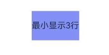
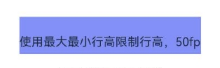
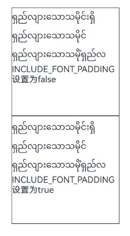
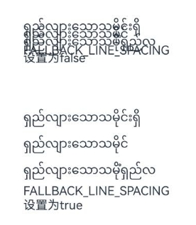
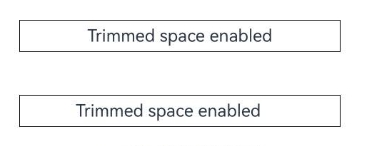

# 使用Text组件
<!--Kit: ArkUI-->
<!--Subsystem: ArkUI-->
<!--Owner: @wangxiuxiu-->
<!--Designer: @xiangyuan6-->
<!--Tester: @jiaoaozihao-->
<!--Adviser: @Brilliantry_Rui-->

[ArkUI](arkui-overview.md)开发框架在[NDK](../napi/ndk-development-overview.md)接口中提供了Text组件，用于显示文本内容。Text组件支持丰富的样式设置，包括字体、颜色、对齐方式、文字效果等，还支持多种子组件，如[StyledString](../reference/apis-arkui/capi-styled-string-h.md)等，实现复杂的文本显示效果。

> **说明：**
>
> - Text组件属于基础UI组件，需要通过[ArkUI_NativeNodeAPI_1](../reference/apis-arkui/capi-arkui-nativemodule-arkui-nativenodeapi-1.md)接口进行创建和属性设置。
>
> - 本篇示例仅提供核心接口的调用方法，完整的示例工程请参考<!--RP1-->[native_node_sample](https://gitcode.com/openharmony/applications_app_samples/tree/master/code/DocsSample/ArkUISample/native_node_sample/entry/src/main/cpp/TextMaker.cpp)<!--RP1End-->。

## 创建文本

### 创建基础组件

创建基础Text组件并设置其基本属性。

<!-- @[setText1](https://gitcode.com/openharmony/applications_app_samples/blob/master/code/DocsSample/ArkUISample/native_node_sample/entry/src/main/cpp/TextMaker.cpp) -->

``` C++
void setText1(ArkUI_NodeHandle &text)
{
    ArkUI_NumberValue textWidth[] = {{.f32 = VALUE_300}};
    ArkUI_AttributeItem textWidthItem = {.value = textWidth, .size = VALUE_1};
    Manager::nodeAPI_->setAttribute(text, NODE_WIDTH, &textWidthItem);
    ArkUI_NumberValue textHeight[] = {{.f32 = VALUE_100}};
    ArkUI_AttributeItem textHeightItem = {.value = textHeight, .size = VALUE_1};
    Manager::nodeAPI_->setAttribute(text, NODE_HEIGHT, &textHeightItem);
    if (text != nullptr) {
        // span仅作为text的子组件形式展示
        ArkUI_NodeHandle span = Manager::nodeAPI_->createNode(ARKUI_NODE_SPAN);
        const char *spanContent = "This is a span";
        ArkUI_AttributeItem spanContentItem = {.string = spanContent};
        Manager::nodeAPI_->setAttribute(span, NODE_SPAN_CONTENT, &spanContentItem);
        if (span != nullptr) {
            // 设置Span背景样式
            ArkUI_NumberValue spanBackground[] = {
                {.u32 = 0xFFE8F4F5}, // 背景颜色
                {.f32 = 5.0f},       // 左上角半径
                {.f32 = 5.0f},       // 右上角半径
                {.f32 = 5.0f},       // 左下角半径
                {.f32 = 5.0f}        // 右下角半径
            };
            ArkUI_AttributeItem spanBackgroundItem = {.value = spanBackground, .size = VALUE_5};
            Manager::nodeAPI_->setAttribute(span, NODE_SPAN_TEXT_BACKGROUND_STYLE, &spanBackgroundItem);

            // 文本基线的偏移量属性
            ArkUI_NumberValue baselineOffsetVal = {.f32 = VALUE_10};
            ArkUI_AttributeItem baselineOffsetItem = {&baselineOffsetVal, VALUE_1};
            Manager::nodeAPI_->setAttribute(text, NODE_SPAN_BASELINE_OFFSET, &baselineOffsetItem);
            // 设置无极字重
            ArkUI_NumberValue fontWeight = {.i32 = ARKUI_FONT_WEIGHT_W500};
            ArkUI_AttributeItem fontWeightItem = {&fontWeight, VALUE_1};
            Manager::nodeAPI_->setAttribute(span, NODE_IMMUTABLE_FONT_WEIGHT, &fontWeightItem);
            ArkUI_NumberValue fontWeight1 = {.i32 = ARKUI_FONT_WEIGHT_W500};
            ArkUI_AttributeItem fontWeight1Item = {&fontWeight1, VALUE_1};
            Manager::nodeAPI_->setAttribute(text, NODE_IMMUTABLE_FONT_WEIGHT, &fontWeight1Item);
            // 长按span组件，触发回调
            Manager::nodeAPI_->registerNodeEvent(span, NODE_TEXT_SPAN_ON_LONG_PRESS, EVENT_SPAN_LONG_PRESS, nullptr);
            Manager::nodeAPI_->registerNodeEventReceiver(&OnEventReceive);
        }
        Manager::nodeAPI_->addChild(text, span);
    }
}
```


### 设置文本内容

设置Text组件的基本文本内容和样式。

<!-- @[setText2](https://gitcode.com/openharmony/applications_app_samples/blob/master/code/DocsSample/ArkUISample/native_node_sample/entry/src/main/cpp/TextMaker.cpp) -->

``` C++
void setText2(ArkUI_NodeHandle &text2)
{
    const char *textContent = "this is text 2 this is text 2 this is text 2!!!! ";
    ArkUI_AttributeItem contentItem = {.string = textContent};
    Manager::nodeAPI_->setAttribute(text2, NODE_TEXT_CONTENT, &contentItem);
    // 设置文本样式
    ArkUI_NumberValue fontSize[] = {{.f32 = VALUE_28}};
    ArkUI_AttributeItem fontSizeItem = {.value = fontSize, .size = VALUE_1};
    Manager::nodeAPI_->setAttribute(text2, NODE_FONT_SIZE, &fontSizeItem);
    ArkUI_NumberValue fontColor = {.u32 = 0xFFFF0000};
    ArkUI_AttributeItem fontColorItem = {.value = &fontColor, .size = VALUE_1};
    Manager::nodeAPI_->setAttribute(text2, NODE_FONT_COLOR, &fontColorItem);

    // 字体样式：斜体样式（ARKUI_FONT_STYLE_ITALIC）
    ArkUI_NumberValue fontStyleVal = {.i32 = ARKUI_FONT_STYLE_ITALIC};
    ArkUI_AttributeItem fontStyleItem = {&fontStyleVal, VALUE_1};
    Manager::nodeAPI_->setAttribute(text2, NODE_FONT_STYLE, &fontStyleItem);

    // 字重：Bold（ARKUI_FONT_WEIGHT_W800）
    ArkUI_NumberValue fontWeightVal = {.i32 = ARKUI_FONT_WEIGHT_W800};
    ArkUI_AttributeItem textWeightItem = {.value = &fontWeightVal, .size = 1};
    Manager::nodeAPI_->setAttribute(text2, NODE_FONT_WEIGHT, &textWeightItem);

    // 文本字符间距
    ArkUI_NumberValue letterSpaceVal = {.f32 = VALUE_10};
    ArkUI_AttributeItem letterSpaceItem = {&letterSpaceVal, VALUE_1};
    Manager::nodeAPI_->setAttribute(text2, NODE_TEXT_LETTER_SPACING, &letterSpaceItem);
    // 文本最大行数
    ArkUI_NumberValue maxLinesVal = {.i32 = VALUE_1};
    ArkUI_AttributeItem maxLinesItem = {&maxLinesVal, VALUE_1};
    Manager::nodeAPI_->setAttribute(text2, NODE_TEXT_MAX_LINES, &maxLinesItem);

    // 设置是否可复制
    ArkUI_NumberValue copyOptionsVal = {.i32 = ARKUI_COPY_OPTIONS_NONE};
    ArkUI_AttributeItem copyOptionsItem = {&copyOptionsVal, VALUE_1};
    Manager::nodeAPI_->setAttribute(text2, NODE_TEXT_COPY_OPTION, &copyOptionsItem);

    // 文本溢出：跑马灯（ARKUI_TEXT_OVERFLOW_MARQUEE）
    ArkUI_NumberValue overflowVal = {.i32 = ARKUI_TEXT_OVERFLOW_MARQUEE};
    ArkUI_AttributeItem overflowItem = {&overflowVal, VALUE_1};
    Manager::nodeAPI_->setAttribute(text2, NODE_TEXT_OVERFLOW, &overflowItem);

    int32_t ret = OH_ArkUI_RegisterSystemFontStyleChangeEvent(text2, text2, &onFontStyleChange);
    if (ret == ARKUI_ERROR_CODE_NO_ERROR) {
        OH_LOG_Print(LOG_APP, LOG_INFO, 0xFF00, "manager", "字体变更回调");
    }
}
```


### 设置文本换行

设置Text组件的换行行为。

<!-- @[setText3_1](https://gitcode.com/openharmony/applications_app_samples/blob/master/code/DocsSample/ArkUISample/native_node_sample/entry/src/main/cpp/TextMaker.cpp) -->

``` C++
void setText3_1(ArkUI_NodeHandle &text3)
{
    const char *textContent =
        "this is text 3 this is text 3 this is text 3!!!!this is text 3 this is text 3!!!! ******@example.com";
    ArkUI_AttributeItem contentItem = {.string = textContent};
    Manager::nodeAPI_->setAttribute(text3, NODE_TEXT_CONTENT, &contentItem);

    ArkUI_NumberValue intVal_0 = {.i32 = VALUE_0};
    ArkUI_AttributeItem int_0_Item = {&intVal_0, VALUE_1};
    // 水平对齐：首部对齐（ARKUI_TEXT_ALIGNMENT_START）
    Manager::nodeAPI_->setAttribute(text3, NODE_TEXT_ALIGN, &int_0_Item);
    // 省略位置：行首省略（ARKUI_ELLIPSIS_MODE_START）
    Manager::nodeAPI_->setAttribute(text3, NODE_TEXT_ELLIPSIS_MODE, &int_0_Item);
    // 自适应高度策略：MaxLines优先
    Manager::nodeAPI_->setAttribute(text3, NODE_TEXT_HEIGHT_ADAPTIVE_POLICY, &int_0_Item);
    // 设置最小最大显示字号
    ArkUI_NumberValue minFontSize = {.f32 = VALUE_20};
    ArkUI_AttributeItem minFontSizeItem = {&minFontSize, VALUE_1};
    Manager::nodeAPI_->setAttribute(text3, NODE_TEXT_MIN_FONT_SIZE, &minFontSizeItem);
    ArkUI_NumberValue maxFontSize = {.f32 = VALUE_30};
    ArkUI_AttributeItem maxFontSizeItem = {&maxFontSize, VALUE_1};
    Manager::nodeAPI_->setAttribute(text3, NODE_TEXT_MAX_FONT_SIZE, &maxFontSizeItem);

    // 首行缩进
    ArkUI_NumberValue indentVal = {.f32 = VALUE_30};
    ArkUI_AttributeItem indentItem = {&indentVal, VALUE_1};
    Manager::nodeAPI_->setAttribute(text3, NODE_TEXT_INDENT, &indentItem);
    // 文本最大行数
    ArkUI_NumberValue maxLinesVal = {.i32 = VALUE_1};
    ArkUI_AttributeItem maxLinesItem = {&maxLinesVal, VALUE_1};
    Manager::nodeAPI_->setAttribute(text3, NODE_TEXT_MAX_LINES, &maxLinesItem);
    // 文本溢出：省略号（ARKUI_TEXT_OVERFLOW_ELLIPSIS）
    ArkUI_NumberValue overflowVal = {.i32 = ARKUI_TEXT_OVERFLOW_ELLIPSIS};
    ArkUI_AttributeItem overflowItem = {&overflowVal, VALUE_1};
    Manager::nodeAPI_->setAttribute(text3, NODE_TEXT_OVERFLOW, &overflowItem);

    // 复制粘贴：应用内支持复制（ARKUI_COPY_OPTIONS_IN_APP）
    ArkUI_NumberValue copyOptVal = {.i32 = ARKUI_COPY_OPTIONS_IN_APP};
    ArkUI_AttributeItem copyOptItem = {&copyOptVal, VALUE_1};
    Manager::nodeAPI_->setAttribute(text3, NODE_TEXT_COPY_OPTION, &copyOptItem);
}

void setText3_2(ArkUI_NodeHandle &text3)
{
    // 设置断行规则
    ArkUI_NumberValue wordBreakVal = {.i32 = ARKUI_WORD_BREAK_BREAK_ALL};
    ArkUI_AttributeItem wordBreakItem = {&wordBreakVal, VALUE_1};
    Manager::nodeAPI_->setAttribute(text3, NODE_TEXT_WORD_BREAK, &wordBreakItem);
    // 设置文本装饰
    ArkUI_NumberValue textDecoration[] = {
        {.i32 = ARKUI_TEXT_DECORATION_TYPE_UNDERLINE}, {.u32 = 0xFFFF0000}, {.i32 = ARKUI_TEXT_DECORATION_STYLE_SOLID}};
    ArkUI_AttributeItem textDecorationItem = {.value = textDecoration, .size = VALUE_3};
    Manager::nodeAPI_->setAttribute(text3, NODE_TEXT_DECORATION, &textDecorationItem);

    // 文本大小写属性
    ArkUI_NumberValue textCase = {.i32 = ARKUI_TEXT_CASE_UPPER};
    ArkUI_AttributeItem textCaseItem = {&textCase, VALUE_1};
    Manager::nodeAPI_->setAttribute(text3, NODE_TEXT_CASE, &textCaseItem);
    // 开启文本识别和设置TextDataDetectorConfig，识别成功时触发onDetectResultUpdate回调
    ArkUI_NumberValue enableDataDetector = {.i32 = true};
    ArkUI_AttributeItem enableDataDetectorItem = {.value = &enableDataDetector, .size = VALUE_1};
    Manager::nodeAPI_->setAttribute(text3, NODE_TEXT_ENABLE_DATA_DETECTOR, &enableDataDetectorItem);
    ArkUI_NumberValue detectorConfig = {.i32 = ARKUI_TEXT_DATA_DETECTOR_TYPE_EMAIL};
    ArkUI_AttributeItem detectorConfigItem = {.value = &detectorConfig, .size = VALUE_2};
    Manager::nodeAPI_->setAttribute(text3, NODE_TEXT_ENABLE_DATA_DETECTOR_CONFIG, &detectorConfigItem);
    Manager::nodeAPI_->registerNodeEvent(text3, NODE_TEXT_ON_DETECT_RESULT_UPDATE, EVENT_TEXT_DETECT_RESULT_UPDATE,
                                         nullptr);
    Manager::nodeAPI_->registerNodeEventReceiver(&OnEventReceive);

    // 设置选中区背景色
    ArkUI_NumberValue selctBackgroundColor = {.u32 = 0xFFFF0000};
    ArkUI_AttributeItem textSelctBackgroundColorItem = {&selctBackgroundColor, VALUE_1};
    Manager::nodeAPI_->setAttribute(text3, NODE_TEXT_SELECTED_BACKGROUND_COLOR, &textSelctBackgroundColorItem);

    // 设置垂直对齐
    ArkUI_NumberValue vAlignVal = {.i32 = ARKUI_TEXT_VERTICAL_ALIGNMENT_BASELINE};
    ArkUI_AttributeItem vAlignItem = {&vAlignVal, VALUE_1};
    Manager::nodeAPI_->setAttribute(text3, NODE_TEXT_VERTICAL_ALIGN, &vAlignItem);
}
```


### 设置字体样式和阴影效果

设置Text组件的字体样式和文字阴影效果。

<!-- @[setText4](https://gitcode.com/openharmony/applications_app_samples/blob/master/code/DocsSample/ArkUISample/native_node_sample/entry/src/main/cpp/TextMaker.cpp) -->

``` C++
void setText4(ArkUI_NodeHandle &text4)
{
    const char *textContent = "这里是第四个文本";
    ArkUI_AttributeItem contentItem = {.string = textContent};
    Manager::nodeAPI_->setAttribute(text4, NODE_TEXT_CONTENT, &contentItem);

    // 设置文本行高
    ArkUI_NumberValue lineHeight = {.f32 = VALUE_50};
    ArkUI_AttributeItem lineHeightItem = {&lineHeight, VALUE_1};
    Manager::nodeAPI_->setAttribute(text4, NODE_TEXT_LINE_HEIGHT, &lineHeightItem);

    // 设置文本垂直居中
    ArkUI_NumberValue halfLeading = {.i32 = true};
    ArkUI_AttributeItem halfLeadingItem = {&halfLeading, VALUE_1};
    Manager::nodeAPI_->setAttribute(text4, NODE_TEXT_HALF_LEADING, &halfLeadingItem);

    // 文本基线的偏移量属性
    ArkUI_NumberValue baselineOffset = {.f32 = VALUE_20};
    ArkUI_AttributeItem baselineOffsetItem = {&baselineOffset, VALUE_1};
    Manager::nodeAPI_->setAttribute(text4, NODE_TEXT_BASELINE_OFFSET, &baselineOffsetItem);

    // 文字阴影效果属性
    ArkUI_NumberValue textShadow[] = {
        {.f32 = VALUE_5}, {.i32 = ARKUI_SHADOW_TYPE_BLUR}, {.u32 = 0xFF0000FF}, {.f32 = VALUE_5}, {.f32 = VALUE_5}};
    ArkUI_AttributeItem textShadowItem = {textShadow, VALUE_5};
    Manager::nodeAPI_->setAttribute(text4, NODE_TEXT_TEXT_SHADOW, &textShadowItem);

    // 设置font样式
    ArkUI_NumberValue textFont[] = {
        {.f32 = VALUE_10}, {.i32 = ARKUI_FONT_WEIGHT_W600}, {.i32 = ARKUI_FONT_STYLE_NORMAL}};
    ArkUI_AttributeItem textFontItem = {textFont, VALUE_3};
    Manager::nodeAPI_->setAttribute(text4, NODE_TEXT_FONT, &textFontItem);
    // 设置NODE_FONT_FEATURE
    ArkUI_AttributeItem fontFeatureItem = {.string = "ss01"};
    Manager::nodeAPI_->setAttribute(text4, NODE_FONT_FEATURE, &fontFeatureItem);

    // 设置NODE_IMMUTABLE_FONT_WEIGHT，字体粗细可以不跟随系统设置变化
    ArkUI_NumberValue fontWeight = {.i32 = ARKUI_FONT_WEIGHT_W500};
    ArkUI_AttributeItem fontWeightItem = {&fontWeight, VALUE_1};
    Manager::nodeAPI_->setAttribute(text4, NODE_IMMUTABLE_FONT_WEIGHT, &fontWeightItem);
    // 指定有效字体可以不跟随主题变更
    ArkUI_AttributeItem fontFamilyVal = {.string = "HarmonyOS Sans"};
    Manager::nodeAPI_->setAttribute(text4, NODE_FONT_FAMILY, &fontFamilyVal);
}
```


### 设置行数限制

设置Text组件的最小和最大行数限制。

<!-- @[setText8](https://gitcode.com/openharmony/applications_app_samples/blob/master/code/DocsSample/ArkUISample/native_node_sample/entry/src/main/cpp/TextMaker.cpp) -->

``` C++
void setText8(ArkUI_NodeHandle &text8)
{
    ArkUI_AttributeItem item0;
    item0.string = "最小显示3行";
    Manager::nodeAPI_->setAttribute(text8, NODE_TEXT_CONTENT, &item0);
    ArkUI_NumberValue value3[] = {{.u32 = 0xFF8090FF}};
    ArkUI_AttributeItem item3 = {value3, sizeof(value3)/ sizeof(ArkUI_NumberValue)};
    Manager::nodeAPI_->setAttribute(text8, NODE_BACKGROUND_COLOR, &item3);
    ArkUI_NumberValue value1[] = {{.i32 = 3}};
    ArkUI_AttributeItem item1 = {value1, sizeof(value1)/ sizeof(ArkUI_NumberValue)};
    Manager::nodeAPI_->setAttribute(text8, NODE_TEXT_MIN_LINES, &item1);
    ArkUI_NumberValue value2[] = {{.i32 = 5}};
    ArkUI_AttributeItem item2 = {value2, sizeof(value2)/ sizeof(ArkUI_NumberValue)};
    Manager::nodeAPI_->setAttribute(text8, NODE_TEXT_MAX_LINES, &item2);
}
```



### 设置行高倍数

从API version 22开始, Text组件支持使用倍数模式设置行高。

<!-- @[setText9](https://gitcode.com/openharmony/applications_app_samples/blob/master/code/DocsSample/ArkUISample/native_node_sample/entry/src/main/cpp/TextMaker.cpp) -->

``` C++
void setText9(ArkUI_NodeHandle &text9)
{
    ArkUI_AttributeItem item0;
    item0.string = "使用倍数模式设置行高，2倍";
    Manager::nodeAPI_->setAttribute(text9, NODE_TEXT_CONTENT, &item0);
    ArkUI_NumberValue value3[] = {{.u32 = 0xFF8090FF}};
    ArkUI_AttributeItem item6 = {value3, sizeof(value3)/ sizeof(ArkUI_NumberValue)};
    Manager::nodeAPI_->setAttribute(text9, NODE_BACKGROUND_COLOR, &item6);
    ArkUI_NumberValue value[] = {{.f32 = 2.0}};
    ArkUI_AttributeItem item = {value, sizeof(value)/ sizeof(ArkUI_NumberValue)};
    Manager::nodeAPI_->setAttribute(text9, NODE_TEXT_LINE_HEIGHT_MULTIPLE, &item);
}
```


### 设置最大最小行高

从API version 22开始, Text组件支持设置最大和最小行高限制。

<!-- @[setText10](https://gitcode.com/openharmony/applications_app_samples/blob/master/code/DocsSample/ArkUISample/native_node_sample/entry/src/main/cpp/TextMaker.cpp) -->

``` C++
void setText10(ArkUI_NodeHandle &text10)
{
    ArkUI_AttributeItem item0;
    item0.string = "使用最大最小行高限制行高，50fp";
    Manager::nodeAPI_->setAttribute(text10, NODE_TEXT_CONTENT, &item0);
    ArkUI_NumberValue value3[] = {{.u32 = 0xFF8090FF}};
    ArkUI_AttributeItem item6 = {value3, sizeof(value3)/ sizeof(ArkUI_NumberValue)};
    Manager::nodeAPI_->setAttribute(text10, NODE_BACKGROUND_COLOR, &item6);
    ArkUI_NumberValue value0[] = {{.f32 = 1.0}};
    ArkUI_AttributeItem item3 = {value0, sizeof(value0)/ sizeof(ArkUI_NumberValue)};
    Manager::nodeAPI_->setAttribute(text10, NODE_TEXT_LINE_HEIGHT, &item3);
    ArkUI_NumberValue value1[] = {{.f32 = 50}};
    ArkUI_AttributeItem item1 = {value1, sizeof(value1)/ sizeof(ArkUI_NumberValue)};
    Manager::nodeAPI_->setAttribute(text10, NODE_TEXT_MIN_LINE_HEIGHT, &item1);
    ArkUI_NumberValue value2[] = {{.f32 = 50}};
    ArkUI_AttributeItem item2 = {value2, sizeof(value2)/ sizeof(ArkUI_NumberValue)};
    Manager::nodeAPI_->setAttribute(text10, NODE_TEXT_MAX_LINE_HEIGHT, &item2);
}
```



### 设置首行缩进和标点压缩

从API version 23开始, Text组件支持设置首行缩进和标点压缩。

<!-- @[setText11](https://gitcode.com/openharmony/applications_app_samples/blob/master/code/DocsSample/ArkUISample/native_node_sample/entry/src/main/cpp/TextMaker.cpp) -->

``` C++
void setText11(ArkUI_NodeHandle &text11, ArkUI_NodeHandle &text11_2)
{
    ArkUI_AttributeItem text;
    ArkUI_AttributeItem text1;
    text.string = "\u300C启用行首标点压缩";
    text1.string = "\u300C关闭行首标点压缩";
    Manager::nodeAPI_->setAttribute(text11, NODE_TEXT_CONTENT, &text);
    Manager::nodeAPI_->setAttribute(text11_2, NODE_TEXT_CONTENT, &text1);
    ArkUI_NumberValue value0[] = {{.i32 = true}};
    ArkUI_NumberValue value1[] = {{.i32 = false}};
    ArkUI_AttributeItem item0 = {value0, sizeof(value0)/ sizeof(ArkUI_NumberValue)};
    ArkUI_AttributeItem item1 = {value1, sizeof(value1)/ sizeof(ArkUI_NumberValue)};
    Manager::nodeAPI_->setAttribute(text11, NODE_TEXT_COMPRESS_LEADING_PUNCTUATION, &item0);
    Manager::nodeAPI_->setAttribute(text11_2, NODE_TEXT_COMPRESS_LEADING_PUNCTUATION, &item1);
    ArkUI_NumberValue value3[] = {{.f32 = 1.0}};
    ArkUI_AttributeItem item3 = {value3, sizeof(value3)/ sizeof(ArkUI_NumberValue)};
    Manager::nodeAPI_->setAttribute(text11, NODE_BORDER_WIDTH, &item3);
    Manager::nodeAPI_->setAttribute(text11_2, NODE_BORDER_WIDTH, &item3);
}
```


### 设置多行文本首尾行间距自适应

从API version 23开始，Text组件支持设置多行文本首尾行间距自适应以避免部分字体的预期外截断行为。

<!-- @[setText12](https://gitcode.com/openharmony/applications_app_samples/blob/master/code/DocsSample/ArkUISample/native_node_sample/entry/src/main/cpp/TextMaker.cpp) -->

``` C++
void setText12(ArkUI_NodeHandle &text12, ArkUI_NodeHandle &text12_2)
{
    ArkUI_AttributeItem textItem = {
        .string = "ရှည်လျားသောသမိုင်းရှိရှည်လျားသောသမိုင်ရှည်လျားသောသမိုံရှည်လ\nINCLUDE_FONT_PADDING设置为false"};
    ArkUI_AttributeItem textItem_2 = {
        .string = "ရှည်လျားသောသမိုင်းရှိရှည်လျားသောသမိုင်ရှည်လျားသောသမိုံရှည်လ\nINCLUDE_FONT_PADDING设置为true"};
    Manager::nodeAPI_->setAttribute(text12, NODE_TEXT_CONTENT, &textItem);
    Manager::nodeAPI_->setAttribute(text12_2, NODE_TEXT_CONTENT, &textItem_2);
    ArkUI_NumberValue textWeightValue[] = {{.f32 = 200}};
    ArkUI_AttributeItem textWeightItem = {.value = textWeightValue,
        .size = sizeof(textWeightValue) / sizeof(ArkUI_NumberValue)};
    Manager::nodeAPI_->setAttribute(text12, NODE_WIDTH, &textWeightItem);
    Manager::nodeAPI_->setAttribute(text12_2, NODE_WIDTH, &textWeightItem);
    ArkUI_NumberValue textHeightValue[] = {{.f32 = 200}};
    ArkUI_AttributeItem textHeightItem = {.value = textHeightValue,
        .size = sizeof(textHeightValue) / sizeof(ArkUI_NumberValue)};
    Manager::nodeAPI_->setAttribute(text12, NODE_HEIGHT, &textHeightItem);
    Manager::nodeAPI_->setAttribute(text12_2, NODE_HEIGHT, &textHeightItem);
    ArkUI_NumberValue textBorderWidthValue[] = {{.f32 = 1}};
    ArkUI_AttributeItem textBorderWidthItem = {.value = textBorderWidthValue,
        .size = sizeof(textBorderWidthValue) / sizeof(ArkUI_NumberValue)};
    Manager::nodeAPI_->setAttribute(text12, NODE_BORDER_WIDTH, &textBorderWidthItem);
    Manager::nodeAPI_->setAttribute(text12_2, NODE_BORDER_WIDTH, &textBorderWidthItem);
    ArkUI_NumberValue textContentAlignValue[] = {{.f32 = 0}};
    ArkUI_AttributeItem textContentAlignItem = {.value = textContentAlignValue,
        .size = sizeof(textContentAlignValue) / sizeof(textContentAlignValue)};
    Manager::nodeAPI_->setAttribute(text12, NODE_TEXT_CONTENT_ALIGN, &textContentAlignItem);
    Manager::nodeAPI_->setAttribute(text12_2, NODE_TEXT_CONTENT_ALIGN, &textContentAlignItem);
    ArkUI_NumberValue textIncludePaddingValue[] = {{.i32 = 0}};
    ArkUI_AttributeItem textIncludePaddingItem = {.value = textIncludePaddingValue,
        .size = sizeof(textIncludePaddingValue) / sizeof(textIncludePaddingValue)};
    Manager::nodeAPI_->setAttribute(text12, NODE_TEXT_INCLUDE_FONT_PADDING, &textIncludePaddingItem);
    ArkUI_NumberValue textIncludePaddingValue_2[] = {{.i32 = 1}};
    ArkUI_AttributeItem textIncludePaddingItem_2 = {.value = textIncludePaddingValue_2,
        .size = sizeof(textIncludePaddingValue_2) / sizeof(textIncludePaddingValue_2)};
    Manager::nodeAPI_->setAttribute(text12_2, NODE_TEXT_INCLUDE_FONT_PADDING, &textIncludePaddingItem_2);
}
```



### 设置行间距自适应选项

从API version 23开始，Text组件支持设置行间距自适应选项，开启后可避免文字重叠。

<!-- @[setText13](https://gitcode.com/openharmony/applications_app_samples/blob/master/code/DocsSample/ArkUISample/native_node_sample/entry/src/main/cpp/TextMaker.cpp) -->

``` C++
void setText13(ArkUI_NodeHandle &text13, ArkUI_NodeHandle &text13_2)
{
    ArkUI_AttributeItem textItem = {
        .string = "ရှည်လျားသောသမိုင်းရှိရှည်လျားသောသမိုင်ရှည်လျားသောသမိုံရှည်လ\nFALLBACK_LINE_SPACING设置为false"};
    ArkUI_AttributeItem textItem_2 = {
        .string = "ရှည်လျားသောသမိုင်းရှိရှည်လျားသောသမိုင်ရှည်လျားသောသမิိုံရှည်လ\nFALLBACK_LINE_SPACING设置为true"};
    Manager::nodeAPI_->setAttribute(text13, NODE_TEXT_CONTENT, &textItem);
    Manager::nodeAPI_->setAttribute(text13_2, NODE_TEXT_CONTENT, &textItem_2);
    ArkUI_NumberValue textWeightValue[] = {{.f32 = 200}};
    ArkUI_AttributeItem textWeightItem = {.value = textWeightValue,
        .size = sizeof(textWeightValue) / sizeof(ArkUI_NumberValue)};
    Manager::nodeAPI_->setAttribute(text13, NODE_WIDTH, &textWeightItem);
    Manager::nodeAPI_->setAttribute(text13_2, NODE_WIDTH, &textWeightItem);
    ArkUI_NumberValue textHeightValue[] = {{.f32 = 150}};
    ArkUI_AttributeItem textHeightItem = {.value = textHeightValue,
        .size = sizeof(textHeightValue) / sizeof(ArkUI_NumberValue)};
    Manager::nodeAPI_->setAttribute(text13, NODE_HEIGHT, &textHeightItem);
    Manager::nodeAPI_->setAttribute(text13_2, NODE_HEIGHT, &textHeightItem);
    ArkUI_NumberValue textLineHeightValue[] = {{.f32 = 10}};
    ArkUI_AttributeItem textLineHeightItem = {.value = textLineHeightValue,
        .size = sizeof(textLineHeightValue) / sizeof(textLineHeightValue)};
    Manager::nodeAPI_->setAttribute(text13, NODE_TEXT_LINE_HEIGHT, &textLineHeightItem);
    Manager::nodeAPI_->setAttribute(text13_2, NODE_TEXT_LINE_HEIGHT, &textLineHeightItem);
    ArkUI_NumberValue textIncludePaddingValue[] = {{.i32 = 0}};
    ArkUI_AttributeItem textIncludePaddingItem = {.value = textIncludePaddingValue,
        .size = sizeof(textIncludePaddingValue) / sizeof(textIncludePaddingValue)};
    Manager::nodeAPI_->setAttribute(text13, NODE_TEXT_FALLBACK_LINE_SPACING, &textIncludePaddingItem);
    ArkUI_NumberValue textIncludePaddingValue_2[] = {{.i32 = 1}};
    ArkUI_AttributeItem textIncludePaddingItem_2 = {.value = textIncludePaddingValue_2,
        .size = sizeof(textIncludePaddingValue_2) / sizeof(textIncludePaddingValue_2)};
    Manager::nodeAPI_->setAttribute(text13_2, NODE_TEXT_FALLBACK_LINE_SPACING, &textIncludePaddingItem_2);
}
```



### 设置尾随空格处理

从API version 23开始，Text组件支持设置尾随空格处理。

<!-- @[setText14](https://gitcode.com/openharmony/applications_app_samples/blob/master/code/DocsSample/ArkUISample/native_node_sample/entry/src/main/cpp/TextMaker.cpp) -->

``` C++
void setText14(ArkUI_NodeHandle &text14)
{
    ArkUI_AttributeItem textItem = {
        .string = "Trimmed space enabled     "};
    Manager::nodeAPI_->setAttribute(text14, NODE_TEXT_CONTENT, &textItem);

    // 水平对齐：居中对齐（ARKUI_TEXT_ALIGNMENT_CENTER）
    ArkUI_NumberValue intVal_0 = {.i32 = ARKUI_TEXT_ALIGNMENT_CENTER};
    ArkUI_AttributeItem textAlignItem = {&intVal_0, VALUE_1};
    Manager::nodeAPI_->setAttribute(text14, NODE_TEXT_ALIGN, &textAlignItem);

    ArkUI_NumberValue optimizeValue = {.i32 = true};
    ArkUI_AttributeItem optimizeTrailingSpaceItem = {&optimizeValue, VALUE_1};
    Manager::nodeAPI_->setAttribute(text14, NODE_TEXT_OPTIMIZE_TRAILING_SPACE, &optimizeTrailingSpaceItem);

    ArkUI_NumberValue borderWidth[] = {{.f32 = VALUE_1}};
    ArkUI_AttributeItem borderWidthItem = {.value = borderWidth, .size = VALUE_1};
    Manager::nodeAPI_->setAttribute(text14, NODE_BORDER_WIDTH, &borderWidthItem);

    ArkUI_NumberValue marginValue[] = {20};
    ArkUI_AttributeItem marginItem = {marginValue, 1};
    Manager::nodeAPI_->setAttribute(text14, NODE_MARGIN, &marginItem);

    ArkUI_NumberValue textWidth[] = {{.f32 = VALUE_300}};
    ArkUI_AttributeItem textWidthItem = {.value = textWidth, .size = VALUE_1};
    Manager::nodeAPI_->setAttribute(text14, NODE_WIDTH, &textWidthItem);

    ArkUI_NumberValue textHeight[] = {{.f32 = VALUE_30}};
    ArkUI_AttributeItem textHeightItem = {.value = textHeight, .size = VALUE_1};
    Manager::nodeAPI_->setAttribute(text14, NODE_HEIGHT, &textHeightItem);
}

void setText15(ArkUI_NodeHandle &text15)
{
    ArkUI_AttributeItem textItem = {
        .string = "Trimmed space enabled     "};
    Manager::nodeAPI_->setAttribute(text15, NODE_TEXT_CONTENT, &textItem);

    // 水平对齐：居中对齐（ARKUI_TEXT_ALIGNMENT_CENTER）
    ArkUI_NumberValue intVal_0 = {.i32 = ARKUI_TEXT_ALIGNMENT_CENTER};
    ArkUI_AttributeItem textAlignItem = {&intVal_0, VALUE_1};
    Manager::nodeAPI_->setAttribute(text15, NODE_TEXT_ALIGN, &textAlignItem);

    ArkUI_NumberValue optimizeValue = {.i32 = false};
    ArkUI_AttributeItem optimizeTrailingSpaceItem = {&optimizeValue, VALUE_1};
    Manager::nodeAPI_->setAttribute(text15, NODE_TEXT_OPTIMIZE_TRAILING_SPACE, &optimizeTrailingSpaceItem);

    ArkUI_NumberValue borderWidth[] = {{.f32 = VALUE_1}};
    ArkUI_AttributeItem borderWidthItem = {.value = borderWidth, .size = VALUE_1};
    Manager::nodeAPI_->setAttribute(text15, NODE_BORDER_WIDTH, &borderWidthItem);

    ArkUI_NumberValue marginValue[] = {20};
    ArkUI_AttributeItem marginItem = {marginValue, 1};
    Manager::nodeAPI_->setAttribute(text15, NODE_MARGIN, &marginItem);

    ArkUI_NumberValue textWidth[] = {{.f32 = VALUE_300}};
    ArkUI_AttributeItem textWidthItem = {.value = textWidth, .size = VALUE_1};
    Manager::nodeAPI_->setAttribute(text15, NODE_WIDTH, &textWidthItem);

    ArkUI_NumberValue textHeight[] = {{.f32 = VALUE_30}};
    ArkUI_AttributeItem textHeightItem = {.value = textHeight, .size = VALUE_1};
    Manager::nodeAPI_->setAttribute(text15, NODE_HEIGHT, &textHeightItem);
}
```



## 添加子组件

### 添加ImageSpan

在Text组件中添加图片子组件。

<!-- @[setText6](https://gitcode.com/openharmony/applications_app_samples/blob/master/code/DocsSample/ArkUISample/native_node_sample/entry/src/main/cpp/TextMaker.cpp) -->

``` C++
void setText6(ArkUI_NodeHandle &text6)
{
    // ImageSpan
    ArkUI_NodeHandle imageSpan = Manager::nodeAPI_->createNode(ARKUI_NODE_IMAGE_SPAN);
    ArkUI_AttributeItem spanUrl = {.string = "/resources/base/media/background.png"};
    ArkUI_NumberValue widthVal[VALUE_1]{};
    widthVal[VALUE_0].f32 = 100.f;
    ArkUI_AttributeItem width = {.value = widthVal, .size = VALUE_1};
    ArkUI_NumberValue heightVal[VALUE_1]{};
    heightVal[VALUE_0].f32 = 100.f;
    ArkUI_AttributeItem height = {.value = heightVal, .size = VALUE_1};
    Manager::nodeAPI_->setAttribute(imageSpan, NODE_WIDTH, &width);
    Manager::nodeAPI_->setAttribute(imageSpan, NODE_HEIGHT, &height);
    Manager::nodeAPI_->setAttribute(imageSpan, NODE_IMAGE_SPAN_SRC, &spanUrl);
    // 设置 NODE_IMAGE_SPAN_VERTICAL_ALIGNMENT
    ArkUI_NumberValue verticalAlignment = {.i32 = ARKUI_IMAGE_SPAN_ALIGNMENT_BOTTOM};
    ArkUI_AttributeItem verticalAlignmentItem = {&verticalAlignment, VALUE_1};
    Manager::nodeAPI_->setAttribute(imageSpan, NODE_IMAGE_SPAN_VERTICAL_ALIGNMENT, &verticalAlignmentItem);
    // imageSpan组件占位图地址属性
    ArkUI_AttributeItem spanAlt = {.string = "/resources/base/media/startIcon.png"};
    Manager::nodeAPI_->setAttribute(imageSpan, NODE_IMAGE_SPAN_ALT, &spanAlt);
    // 设置imageSpan组件的基线偏移量属性
    ArkUI_NumberValue baselineOffset = {.f32 = VALUE_10};
    ArkUI_AttributeItem baselineOffsetItem = {&baselineOffset, VALUE_1};
    Manager::nodeAPI_->setAttribute(imageSpan, NODE_IMAGE_SPAN_BASELINE_OFFSET, &baselineOffsetItem);
    Manager::nodeAPI_->addChild(text6, imageSpan);
}
```


### 使用StyledString

使用样式化字符串（[StyledString](../reference/apis-arkui/capi-styled-string-h.md)）创建文本内容。

<!-- @[setText7](https://gitcode.com/openharmony/applications_app_samples/blob/master/code/DocsSample/ArkUISample/native_node_sample/entry/src/main/cpp/TextMaker.cpp) -->

``` C++
void setText7(ArkUI_NodeHandle &text7)
{
    ArkUI_NodeHandle text = Manager::nodeAPI_->createNode(ARKUI_NODE_TEXT);
    ArkUI_NumberValue textWidth[] = {{.f32 = VALUE_300}};
    ArkUI_AttributeItem textWidthItem = {.value = textWidth, .size = VALUE_1};
    Manager::nodeAPI_->setAttribute(text, NODE_WIDTH, &textWidthItem);
    ArkUI_NumberValue textHeight[] = {{.f32 = VALUE_30}};
    ArkUI_AttributeItem textHeightItem = {.value = textHeight, .size = VALUE_1};
    Manager::nodeAPI_->setAttribute(text, NODE_HEIGHT, &textHeightItem);
    ArkUI_NumberValue borderWidth[] = {{.f32 = VALUE_1}};
    ArkUI_AttributeItem borderWidthItem = {.value = borderWidth, .size = VALUE_1};
    Manager::nodeAPI_->setAttribute(text, NODE_BORDER_WIDTH, &borderWidthItem);
    // OH_Drawing_开头的API是字体引擎提供的，typographyStyle表示段落样式。
    OH_Drawing_TypographyStyle *typographyStyle = OH_Drawing_CreateTypographyStyle();
    OH_Drawing_SetTypographyTextAlign(typographyStyle, OH_Drawing_TextAlign::TEXT_ALIGN_CENTER);
    OH_Drawing_SetTypographyTextMaxLines(typographyStyle, VALUE_10);
    // 创建 ArkUI_StyledString。
    ArkUI_StyledString *styledString = OH_ArkUI_StyledString_Create(typographyStyle, OH_Drawing_CreateFontCollection());
    // 创建文本样式，设置字体和颜色。
    OH_Drawing_TextStyle *textStyle = OH_Drawing_CreateTextStyle();
    OH_Drawing_SetTextStyleFontSize(textStyle, VALUE_28);
    OH_Drawing_SetTextStyleColor(textStyle, OH_Drawing_ColorSetArgb(0xFF, 0x70, 0x70, 0x70));
    // 文本样式的设置顺序push -> add -> pop.
    OH_ArkUI_StyledString_PushTextStyle(styledString, textStyle);
    OH_ArkUI_StyledString_AddText(styledString, "Hello");
    OH_ArkUI_StyledString_PopTextStyle(styledString);
    // 添加占位，此区域内不会绘制文字，可以在此位置挂载Image组件实现图文混排。
    OH_Drawing_PlaceholderSpan placeHolder{.width = VALUE_20, .height = VALUE_20};
    OH_ArkUI_StyledString_AddPlaceholder(styledString, &placeHolder);
    // 设置不同样式的文字
    OH_Drawing_TextStyle *worldTextStyle = OH_Drawing_CreateTextStyle();
    OH_Drawing_SetTextStyleFontSize(worldTextStyle, VALUE_28);
    OH_Drawing_SetTextStyleColor(worldTextStyle, OH_Drawing_ColorSetArgb(0xFF, 0x27, 0x87, 0xD9));
    OH_ArkUI_StyledString_PushTextStyle(styledString, worldTextStyle);
    OH_ArkUI_StyledString_AddText(styledString, "World!");
    OH_ArkUI_StyledString_PopTextStyle(styledString);
    // 依赖StyledString对象创建字体引擎的Typography，此时它已经包含了设置的文本及其样式。
    OH_Drawing_Typography *typography = OH_ArkUI_StyledString_CreateTypography(styledString);
    // 字体引擎布局方法，需传入一个宽度，此宽度需与Text组件宽度匹配。
    // 布局宽度 = Text组件宽度 - (左padding + 右padding)
    OH_Drawing_TypographyLayout(typography, VALUE_300);
    ArkUI_AttributeItem styledStringItem = {.object = styledString};
    // 布局完成后，通过NODE_TEXT_CONTENT_WITH_STYLED_STRING设置给Text组件。
    Manager::nodeAPI_->setAttribute(text, NODE_TEXT_CONTENT_WITH_STYLED_STRING, &styledStringItem);
    OH_ArkUI_StyledString_Destroy(styledString);
    Manager::nodeAPI_->addChild(text7, text);
}
```


## 创建自定义文本样式

### 设置省略模式

设置Text组件的省略显示模式。

<!-- @[setText20](https://gitcode.com/openharmony/applications_app_samples/blob/master/code/DocsSample/ArkUISample/native_node_sample/entry/src/main/cpp/TextMaker.cpp) -->

``` C++
void setText20(ArkUI_NodeHandle &text20, ArkUI_NodeHandle &text21)
{
    ArkUI_AttributeItem content_item = {};
    content_item.string = "这是一段超长文本，用来设置省略号位置ellipsisMode";
    Manager::nodeAPI_->setAttribute(text20, NODE_TEXT_CONTENT, &content_item);
    ArkUI_NumberValue widthValue[] = {{.f32 = 100.0f}};
    ArkUI_AttributeItem width_item = {widthValue, sizeof(widthValue) / sizeof(ArkUI_NumberValue)};
    Manager::nodeAPI_->setAttribute(text20, NODE_WIDTH, &width_item);
    ArkUI_NumberValue maxLinesValue[] = {{.i32 = VALUE_3} };
    ArkUI_AttributeItem maxLinesItem = {maxLinesValue, VALUE_1};
    Manager::nodeAPI_->setAttribute(text20, NODE_TEXT_MAX_LINES, &maxLinesItem);
    ArkUI_NumberValue textOverFlowValue[] = { {.i32 = ARKUI_TEXT_OVERFLOW_ELLIPSIS} };
    ArkUI_AttributeItem textOverFlowItem = {textOverFlowValue, VALUE_1};
    Manager::nodeAPI_->setAttribute(text20, NODE_TEXT_OVERFLOW, &textOverFlowItem);
    ArkUI_NumberValue ellipsisModeValue1[] = { {.i32 = ARKUI_ELLIPSIS_MODE_MULTILINE_START} };
    ArkUI_AttributeItem ellipsisModeItem1 = {ellipsisModeValue1, VALUE_1};
    Manager::nodeAPI_->setAttribute(text20, NODE_TEXT_ELLIPSIS_MODE, &ellipsisModeItem1);

    Manager::nodeAPI_->setAttribute(text21, NODE_TEXT_CONTENT, &content_item);
    Manager::nodeAPI_->setAttribute(text21, NODE_WIDTH, &width_item);
    Manager::nodeAPI_->setAttribute(text21, NODE_TEXT_MAX_LINES, &maxLinesItem);
    Manager::nodeAPI_->setAttribute(text21, NODE_TEXT_OVERFLOW, &textOverFlowItem);
    ArkUI_NumberValue ellipsisModeValue2[] = {{.i32 = ARKUI_ELLIPSIS_MODE_MULTILINE_CENTER}};
    ArkUI_AttributeItem ellipsisModeItem2 = {ellipsisModeValue2, VALUE_1};
    Manager::nodeAPI_->setAttribute(text21, NODE_TEXT_ELLIPSIS_MODE, &ellipsisModeItem2);
}
```


### 设置渐变效果

从API version 20开始，Text组件支持设置渐变颜色效果。

<!-- @[setText5_1](https://gitcode.com/openharmony/applications_app_samples/blob/master/code/DocsSample/ArkUISample/native_node_sample/entry/src/main/cpp/TextMaker.cpp) -->

``` C++
void setText5_1(ArkUI_NodeHandle &text5)
{
    ArkUI_NumberValue textWidth[] = {{.f32 = VALUE_300}};
    ArkUI_AttributeItem textWidthItem = {.value = textWidth, .size = VALUE_1};
    Manager::nodeAPI_->setAttribute(text5, NODE_WIDTH, &textWidthItem);

    const char *textContent = "线性渐变--线性渐变";
    ArkUI_AttributeItem contentItem = {.string = textContent};
    Manager::nodeAPI_->setAttribute(text5, NODE_TEXT_CONTENT, &contentItem);

    ArkUI_NumberValue fontSize[] = {{.f32 = VALUE_50}};
    ArkUI_AttributeItem fontSizeItem = {.value = fontSize, .size = VALUE_1};
    Manager::nodeAPI_->setAttribute(text5, NODE_FONT_SIZE, &fontSizeItem);
    // 设置线性渐变
    float stops[] = { 0.0f, 0.5f };

    uint32_t colors[] = { 0xFFFFFF00, 0xFF0000FF };

    ArkUI_ColorStop colorStop = { colors, stops, VALUE_2 };
    ArkUI_ColorStop *colorStopPtr = &colorStop;

    ArkUI_NumberValue linearGradient[] = {
        {.f32 = FLOAT_50}, {.f32 = FLOAT_50}, {.f32 = FLOAT_50}};

    ArkUI_AttributeItem linearGradientItem = {
        linearGradient, sizeof(linearGradient) / sizeof(ArkUI_NumberValue)};
    linearGradientItem.object = reinterpret_cast<void *>(colorStopPtr);
    linearGradientItem.size = sizeof(linearGradientItem) / sizeof(ArkUI_NumberValue);

    Manager::nodeAPI_->setAttribute(text5, NODE_TEXT_LINEAR_GRADIENT, &linearGradientItem);
}

void setText5_2(ArkUI_NodeHandle &text5_2)
{
    ArkUI_NumberValue textWidth[] = {{.f32 = VALUE_300}};
    ArkUI_AttributeItem textWidthItem = {.value = textWidth, .size = VALUE_1};
    Manager::nodeAPI_->setAttribute(text5_2, NODE_WIDTH, &textWidthItem);

    const char *textContent = "径向渐变--径向渐变";
    ArkUI_AttributeItem contentItem = {.string = textContent};
    Manager::nodeAPI_->setAttribute(text5_2, NODE_TEXT_CONTENT, &contentItem);

    ArkUI_NumberValue fontSize[] = {{.f32 = VALUE_50}};
    ArkUI_AttributeItem fontSizeItem = {.value = fontSize, .size = VALUE_1};
    Manager::nodeAPI_->setAttribute(text5_2, NODE_FONT_SIZE, &fontSizeItem);
    // 设置径向渐变
    float stops[] = { 0.0f, 0.5f };

    uint32_t colors[] = { 0xFFFFFF00, 0xFF0000FF };

    ArkUI_ColorStop colorStop = { colors, stops, VALUE_2 };
    ArkUI_ColorStop *colorStopPtr = &colorStop;

    ArkUI_NumberValue radialGradient[] = {
        {.f32 = FLOAT_50}, {.f32 = FLOAT_50}, {.f32 = FLOAT_50}, {.i32 = true}};
    ArkUI_AttributeItem radialGradientItem = {
        radialGradient, sizeof(radialGradient) / sizeof(ArkUI_NumberValue)};
    radialGradientItem.object = reinterpret_cast<void *>(colorStopPtr);
    radialGradientItem.size = sizeof(radialGradientItem) / sizeof(ArkUI_NumberValue);

    Manager::nodeAPI_->setAttribute(text5_2, NODE_TEXT_RADIAL_GRADIENT, &radialGradientItem);
}
```


### 设置拖拽预览样式

从API version 23开始，Text组件支持设置拖拽预览样式。

<!-- @[setText16](https://gitcode.com/openharmony/applications_app_samples/blob/master/code/DocsSample/ArkUISample/native_node_sample/entry/src/main/cpp/TextMaker.cpp) -->

``` C++
void setText16(ArkUI_NodeHandle &text16)
{
    ArkUI_AttributeItem textItem = {.string = "Text 设置拖拽背板颜色"};
    Manager::nodeAPI_->setAttribute(text16, NODE_TEXT_CONTENT, &textItem);
    ArkUI_NumberValue copyOptVal = { .i32 = ARKUI_TEXT_COPY_OPTIONS_IN_APP };
    ArkUI_AttributeItem copyOptItem = { &copyOptVal, 1 };
    Manager::nodeAPI_->setAttribute(text16, NODE_TEXT_COPY_OPTION, &copyOptItem);
    OH_ArkUI_SetNodeDraggable(text16, true);
    ArkUI_SelectedDragPreviewStyle *text_options = OH_ArkUI_SelectedDragPreviewStyle_Create();
    OH_ArkUI_SelectedDragPreviewStyle_SetColor(text_options, 0xFFE8F4F5);
    ArkUI_AttributeItem textColorItem = {.size = 1, .object = text_options};
    Manager::nodeAPI_->setAttribute(text16, NODE_SELECTED_DRAG_PREVIEW_STYLE, &textColorItem);
    ArkUI_NumberValue marginValue[] = {60};
    ArkUI_AttributeItem marginItem = {marginValue, 1};
    Manager::nodeAPI_->setAttribute(text16, NODE_MARGIN, &marginItem);
    OH_ArkUI_SelectedDragPreviewStyle_Dispose(text_options);
}
```


### 设置跑马灯效果

从API version 23开始，Text组件支持添加跑马灯效果。

<!-- @[setText18](https://gitcode.com/openharmony/applications_app_samples/blob/master/code/DocsSample/ArkUISample/native_node_sample/entry/src/main/cpp/TextMaker.cpp) -->

``` C++
void setText18(ArkUI_NodeHandle &text18)
{
    ArkUI_AttributeItem content_item = {};
    content_item.string = "设置跑马灯TextMaruqeeOptions";
    Manager::nodeAPI_->setAttribute(text18, NODE_TEXT_CONTENT, &content_item);
    ArkUI_NumberValue widthValue[] = {{.f32 = 100.0f}};
    ArkUI_AttributeItem width_item = {widthValue, sizeof(widthValue) / sizeof(ArkUI_NumberValue)};
    Manager::nodeAPI_->setAttribute(text18, NODE_WIDTH, &width_item);
    ArkUI_TextMarqueeOptions* marqueeOptions = OH_ArkUI_TextMarqueeOptions_Create();
    OH_ArkUI_TextMarqueeOptions_SetStart(marqueeOptions, true);
    OH_ArkUI_TextMarqueeOptions_SetStep(marqueeOptions, 5.0f);
    OH_ArkUI_TextMarqueeOptions_SetSpacing(marqueeOptions, 30.0f);
    OH_ArkUI_TextMarqueeOptions_SetFromStart(marqueeOptions, true);
    OH_ArkUI_TextMarqueeOptions_SetDelay(marqueeOptions, VALUE_400);
    OH_ArkUI_TextMarqueeOptions_SetUpdatePolicy(marqueeOptions,
        ArkUI_MarqueeUpdatePolicy::ARKUI_MARQUEEUPDATEPOLICY_PRESERVEPOSITION);
    ArkUI_AttributeItem marqueeOptionsItem = { .object = marqueeOptions, .size = 1 };
    Manager::nodeAPI_->setAttribute(text18, NODE_TEXT_MARQUEE_OPTIONS, &marqueeOptionsItem);
}
```


### 设置文本方向

从API version 23开始，Text组件支持设置文本方向。

<!-- @[setTextDirection](https://gitcode.com/openharmony/applications_app_samples/blob/master/code/DocsSample/ArkUISample/native_node_sample/entry/src/main/cpp/TextMaker.cpp) -->

``` C++
void setTextDirection(ArkUI_NodeHandle &text19)
{
    ArkUI_AttributeItem content_item = {};
    content_item.string = "设置Text NODE_TEXT_DIRECTION";
    Manager::nodeAPI_->setAttribute(text19, NODE_TEXT_CONTENT, &content_item);
    ArkUI_NumberValue directionValue[] = {{.i32 = ARKUI_TEXT_DIRECTION_RTL}};
    ArkUI_AttributeItem direction_item = {directionValue, sizeof(directionValue) / sizeof(ArkUI_NumberValue)};
    Manager::nodeAPI_->setAttribute(text19, NODE_TEXT_DIRECTION, &direction_item);
    ArkUI_NumberValue textWidth[] = {{.f32 = VALUE_300}};
    ArkUI_AttributeItem textWidthItem = {.value = textWidth, .size = VALUE_1};
    Manager::nodeAPI_->setAttribute(text19, NODE_WIDTH, &textWidthItem);
    ArkUI_NumberValue textBorderWidthValue[] = {{.f32 = 1}};
    ArkUI_AttributeItem textBorderWidthItem = {.value = textBorderWidthValue,
        .size = sizeof(textBorderWidthValue) / sizeof(ArkUI_NumberValue)};
    Manager::nodeAPI_->setAttribute(text19, NODE_BORDER_WIDTH, &textBorderWidthItem);
}
```


## 添加事件

### 文本选中事件

为Text组件添加文本选中事件。

<!-- @[setText17](https://gitcode.com/openharmony/applications_app_samples/blob/master/code/DocsSample/ArkUISample/native_node_sample/entry/src/main/cpp/TextMaker.cpp) -->

``` C++
void setText17(ArkUI_NodeHandle &text17)
{
    ArkUI_AttributeItem item0;
    item0.string = "设置文本选中";
    Manager::nodeAPI_->setAttribute(text17, NODE_TEXT_CONTENT, &item0);
    ArkUI_NumberValue value3[] = {{.u32 = 0xFF8090FF}};
    ArkUI_AttributeItem item3 = {value3, sizeof(value3)/ sizeof(ArkUI_NumberValue)};
    Manager::nodeAPI_->setAttribute(text17, NODE_BACKGROUND_COLOR, &item3);
    // 应用内支持复制
    ArkUI_NumberValue copyOptVal = {.i32 = ARKUI_COPY_OPTIONS_IN_APP};
    ArkUI_AttributeItem copyOptItem = {&copyOptVal, VALUE_1};
    Manager::nodeAPI_->setAttribute(text17, NODE_TEXT_COPY_OPTION, &copyOptItem);
    ArkUI_NumberValue marginValue[] = {60};
    ArkUI_AttributeItem marginItem = {marginValue, 1};
    Manager::nodeAPI_->setAttribute(text17, NODE_MARGIN, &marginItem);
}
```


### 文本布局事件

获取Text组件的布局信息。

<!-- @[setText22](https://gitcode.com/openharmony/applications_app_samples/blob/master/code/DocsSample/ArkUISample/native_node_sample/entry/src/main/cpp/TextMaker.cpp) -->

``` C++
void setText22More(ArkUI_NodeHandle &text22, ArkUI_NodeHandle &button)
{
    if (Manager::nodeAPI_ != nullptr) {
        Manager::nodeAPI_->addNodeEventReceiver(button, [](ArkUI_NodeEvent *event) {
            auto *layoutManager = Manager::nodeAPI_->getAttribute(TextMaker::text22, NODE_TEXT_LAYOUT_MANAGER);
            ArkUI_TextLayoutManager *manager = (ArkUI_TextLayoutManager *)layoutManager->object;

            // 获取文本行数
            int lineCount = OH_ArkUI_TextLayoutManager_GetLineCount(manager);
            printf("Line count: %d\n", lineCount);

            // 获取每行文本信息
            for (int i = 0; i < lineCount; i++) {
                ArkUI_TextLineInfo lineInfo;
                OH_ArkUI_TextLayoutManager_GetLineInfo(manager, i, &lineInfo);
                printf("Line %d: start=%d, end=%d, width=%f\n",
                    i, lineInfo.charStart, lineInfo.charEnd, lineInfo.width);
            }

            // 获取字符边界信息
            if (OH_ArkUI_TextLayoutManager_GetCharBoundary(manager, 5, &lineInfo)) {
                printf("Char boundary: start=%d, end=%d\n", lineInfo.charStart, lineInfo.charEnd);
            }
        });
    }
}

void setText22(ArkUI_NodeHandle &text22, ArkUI_NodeHandle &button)
{
    ArkUI_AttributeItem button_Item = {.string = "点击获取文本信息"};
    ArkUI_AttributeItem text_Item = {
        .string = "HelloWorld  您好，世界! \n HelloWorld  您好，世界! \n HelloWorld  您好，世界! \n"};
    Manager::nodeAPI_->setAttribute(button, NODE_BUTTON_LABEL, &button_Item);
    Manager::nodeAPI_->setAttribute(TextMaker::text22, NODE_TEXT_CONTENT, &text_Item);
    Manager::nodeAPI_->registerNodeEvent(button, NODE_ON_CLICK, 0, nullptr);
    setText22More(text22, button);
    ArkUI_NumberValue marginValue[] = {20};
    ArkUI_AttributeItem marginItem = {marginValue, 1};
    Manager::nodeAPI_->setAttribute(TextMaker::text22, NODE_MARGIN, &marginItem);

    // 设置文本布局管理器
    ArkUI_TextLayoutManager *layoutManager = OH_ArkUI_TextLayoutManager_Create();
    ArkUI_AttributeItem layoutManagerItem = {.object = layoutManager, .size = 1};
    Manager::nodeAPI_->setAttribute(TextMaker::text22, NODE_TEXT_LAYOUT_MANAGER, &layoutManagerItem);

    // 设置事件回调
    Manager::nodeAPI_->addNodeEventReceiver(TextMaker::text22, [](ArkUI_NodeEvent *event) {
        int eventId = OH_ArkUI_TextLayoutEvent_GetEventId(event);
        if (eventId == EVENT_TEXT_INPUT_SELECTION_CHANGE) {
            int charStart = OH_ArkUI_TextLayoutEvent_GetCharStart(event);
            int charEnd = OH_ArkUI_TextLayoutEvent_GetCharEnd(event);
            printf("Text selection changed: %d-%d\n", charStart, charEnd);
        }
    });
}
```


## 相关接口

### 属性设置

| 属性 | 描述 |
|------|------|
| `NODE_TEXT_CONTENT` | 设置文本内容。 |
| `NODE_TEXT_CONTENT_WITH_STYLED_STRING` | 设置样式化文本内容。 |
| `NODE_WIDTH` | 设置组件宽度。 |
| `NODE_HEIGHT` | 设置组件高度。 |
| `NODE_FONT_SIZE` | 设置字体大小。 |
| `NODE_FONT_WEIGHT` | 设置字体粗细。 |
| `NODE_FONT_COLOR` | 设置文本颜色。 |
| `NODE_BACKGROUND_COLOR` | 设置背景颜色。 |
| `NODE_TEXT_LINE_HEIGHT` | 设置行高。 |
| `NODE_TEXT_LINE_HEIGHT_MULTIPLE` | 设置行高倍数。 |
| `NODE_TEXT_MIN_LINE_HEIGHT` | 设置最小行高。 |
| `NODE_TEXT_MAX_LINE_HEIGHT` | 设置最大行高。 |
| `NODE_TEXT_MIN_LINES` | 设置最小行数。 |
| `NODE_TEXT_MAX_LINES` | 设置最大行数。 |
| `NODE_TEXT_ALIGN` | 设置文本对齐。 |
| `NODE_TEXT_VERTICAL_ALIGN` | 设置垂直对齐。 |
| `NODE_TEXT_DIRECTION` | 设置文本方向。 |
| `NODE_TEXT_ELLIPSIS_MODE` | 设置省略模式。 |
| `NODE_TEXT_WORD_BREAK` | 设置换行规则。 |
| `NODE_TEXT_INDENT` | 设置首行缩进。 |
| `NODE_TEXT_PUNCTUATION_COMPRESSION` | 设置标点压缩。 |
| `NODE_TEXT_INCLUDE_FONT_PADDING` | 设置字体填充。 |
| `NODE_TEXT_FALLBACK_LINE_SPACING` | 设置行间距回退。 |
| `NODE_TEXT_TRIM_SPACE` | 设置尾随空格处理。 |
| `NODE_TEXT_COPY_OPTION` | 设置复制选项。 |
| `NODE_TEXT_MARQUEE_OPTIONS` | 设置跑马灯选项。 |
| `NODE_TEXT_LINEAR_GRADIENT` | 设置线性渐变。 |
| `NODE_TEXT_RADIAL_GRADIENT` | 设置径向渐变。 |
| `NODE_TEXT_LAYOUT_MANAGER` | 设置布局管理器。 |
| `NODE_TEXT_TEXT_SHADOW` | 设置文字阴影效果。 |
| `NODE_TEXT_FONT` | 设置字体样式。 |
| `NODE_FONT_FEATURE` | 设置字体特性。 |
| `NODE_IMMUTABLE_FONT_WEIGHT` | 设置不可变字体粗细。 |
| `NODE_FONT_FAMILY` | 设置字体族。 |
| `NODE_TEXT_BASELINE_OFFSET` | 设置文本基线偏移量。 |
| `NODE_TEXT_HALF_LEADING` | 设置文本垂直居中。 |
| `NODE_TEXT_LETTER_SPACING` | 设置文本字符间距。 |
| `NODE_TEXT_MAX_FONT_SIZE` | 设置最大显示字号。 |
| `NODE_TEXT_MIN_FONT_SIZE` | 设置最小显示字号。 |
| `NODE_TEXT_HEIGHT_ADAPTIVE_POLICY` | 设置自适应高度策略。 |
| `NODE_TEXT_DECORATION` | 设置文本装饰。 |
| `NODE_TEXT_CASE` | 设置文本大小写。 |
| `NODE_TEXT_ENABLE_DATA_DETECTOR` | 设置文本识别。 |
| `NODE_TEXT_ENABLE_DATA_DETECTOR_CONFIG` | 设置文本识别配置。 |
| `NODE_TEXT_SELECTED_BACKGROUND_COLOR` | 设置选中区背景色。 |
| `NODE_TEXT_COMPRESS_LEADING_PUNCTUATION` | 设置行首标点压缩。 |
| `NODE_TEXT_OPTIMIZE_TRAILING_SPACE` | 设置尾随空格处理优化。 |
| `NODE_IMAGE_SPAN_SRC` | 设置图片内容。 |
| `NODE_IMAGE_SPAN_VERTICAL_ALIGNMENT` | 设置图片垂直对齐。 |
| `NODE_IMAGE_SPAN_ALT` | 设置图片占位图。 |
| `NODE_IMAGE_SPAN_BASELINE_OFFSET` | 设置图片基线偏移量。 |
| `NODE_TEXT_ON_DETECT_RESULT_UPDATE` | 文本识别结果更新事件。 |
| `NODE_TEXT_SPAN_ON_LONG_PRESS` | Span长按事件。 |

### 子组件操作

| 接口 | 描述 |
|------|------|
| `ARKUI_NODE_SPAN` | Span组件节点类型。 |
| `ARKUI_NODE_IMAGE_SPAN` | ImageSpan组件节点类型。 |
| `ArkUI_NativeNodeAPI::addChild()` | 添加子组件。 |
| `ArkUI_NativeNodeAPI::removeChild()` | 移除子组件。 |

### 事件处理

| 接口 | 描述 |
|------|------|
| `NODE_ON_CLICK` | 点击事件。 |
| `EVENT_TEXT_INPUT_SELECTION_CHANGE` | 文本选中变化事件。 |
| `EVENT_TEXT_ON_CLICK` | 文本点击事件。 |

完整API文档请参考[ArkUI_NativeNodeAPI_1](../reference/apis-arkui/capi-arkui-nativemodule-arkui-nativenodeapi-1.md)。

## 参考链接

- [native_node_sample](https://gitcode.com/openharmony/applications_app_samples/tree/master/code/DocsSample/ArkUISample/native_node_sample/entry/src/main/cpp/TextMaker.cpp) - 完整的示例工程
- [ArkUI_NativeNodeAPI_1](../reference/apis-arkui/capi-arkui-nativemodule-arkui-nativenodeapi-1.md) - ArkUI原生节点API文档
- [capi-native-node](../reference/apis-arkui/capi-native-node-h.md) - 属性设置相关文档