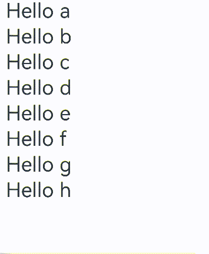
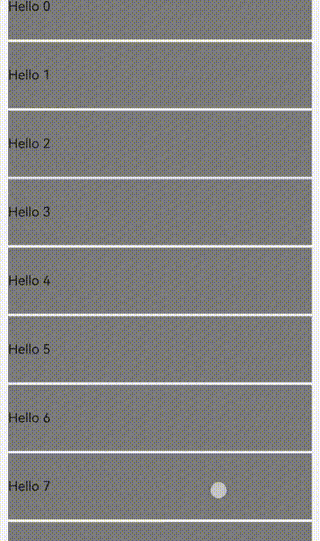

# LazyForEach：数据懒加载
<!--Kit: ArkUI-->
<!--Subsystem: ArkUI-->
<!--Owner: @maorh-->
<!--Designer: @keerecles-->
<!--Tester: @TerryTsao-->
<!--Adviser: @zhang_yixin13-->

## 概述

从API version 7开始，LazyForEach为开发者提供了基于数据源渲染出一系列子组件的能力。具体而言，LazyForEach从数据源中按需迭代数据，并在每次迭代时创建相应组件。当LazyForEach用于滚动容器时，框架会根据滚动容器可视区域按需创建组件，当组件滑出可视区域外时，框架会销毁并回收组件以降低内存占用。</br>
本文档依次介绍了LazyForEach的[基础特性](#基础特性)、[高级特性](#高级特性)和[常见问题](#常见问题)，开发者可以按需阅读。在[首次渲染](#首次渲染)小节中，给出了简单的示例，可以帮助开发者快速上手LazyForEach的使用。</br>
本文档对应的API接口说明参见[LazyForEach API参数说明](../../reference/apis-arkui/arkui-ts/ts-rendering-control-lazyforeach.md)。

> **说明：**
>
> 在大量子组件的场景下，LazyForEach与缓存列表项、动态预加载、组件复用等方法配合使用，可以进一步提升滑动帧率并降低应用内存占用。最佳实践请参考[长列表加载丢帧优化](https://developer.huawei.com/consumer/cn/doc/best-practices/bpta-best-practices-long-list)。
> [Repeat](./arkts-new-rendering-control-repeat.md)组件也提供了循环渲染能力。相较于LazyForEach，Repeat基于状态管理监听数据源变化，使用更加便利。同时，Repeat具有子组件复用能力，UI渲染效率更高。建议开发者优先使用Repeat。开发者也可参考[LazyForEach迁移Repeat指南](./arkts-lazyforeach-repeat-migration-guide.md)，将现有的LazyForEach组件迁移至Repeat组件。

## 使用限制

- LazyForEach必须在容器组件内使用，仅有[List](../../reference/apis-arkui/arkui-ts/ts-container-list.md)、[ListItemGroup](../../reference/apis-arkui/arkui-ts/ts-container-listitemgroup.md)、[Grid](../../reference/apis-arkui/arkui-ts/ts-container-grid.md)、[Swiper](../../reference/apis-arkui/arkui-ts/ts-container-swiper.md)以及[WaterFlow](../../reference/apis-arkui/arkui-ts/ts-container-waterflow.md)组件支持数据懒加载（可配置cachedCount属性，即只加载可视部分以及其前后少量数据用于缓冲），其他组件仍然是一次性加载所有的数据。支持数据懒加载的父组件根据自身及子组件的高度或宽度计算可视区域内需布局的子节点数量，高度或宽度的缺失会导致部分场景[懒加载失效](#子组件尺寸缺失导致懒加载失效)。
- LazyForEach依赖生成的键值判断是否刷新子组件，键值不变则不触发刷新。
- 容器组件内只能包含一个LazyForEach。以List为例，不建议同时包含ListItem、ForEach、LazyForEach，不建议同时包含多个LazyForEach。
- LazyForEach在每次迭代中，必须创建且只允许创建一个子组件；即LazyForEach的子组件生成函数有且只有一个根组件。
- 生成的子组件必须是允许包含在LazyForEach父容器组件中的子组件。
- 允许LazyForEach包含在if/else条件渲染语句中，也允许LazyForEach中出现if/else条件渲染语句。
- 键值生成器必须针对每个数据生成唯一的值，如果键值相同，将导致键值相同的UI组件渲染出现问题。
- LazyForEach必须使用一个数据变化监听器DataChangeListener对象进行更新（具体参数使用参考[LazyForEach](../../reference/apis-arkui/arkui-ts/ts-rendering-control-lazyforeach.md)），重新赋值第一个参数dataSource会导致异常；dataSource使用状态变量时，状态变量改变不会触发LazyForEach的UI刷新。
- 为了高性能渲染，使用DataChangeListener对象的onDataChange方法更新UI时，需要生成不同于原来的键值来触发组件刷新。
- LazyForEach和[\@Reusable装饰器](../state-management/arkts-reusable.md)一起使用能触发节点复用。使用方法：将@Reusable装饰在LazyForEach列表的组件上，见[列表滚动配合LazyForEach使用](../state-management/arkts-reusable.md#列表滚动配合lazyforeach使用)。
- LazyForEach和[\@ReusableV2装饰器](../state-management/arkts-new-reusableV2.md)一起使用能触发节点复用。详见@ReusableV2装饰器指南文档中的[在LazyForEach组件中使用](../state-management/arkts-new-reusableV2.md#在lazyforeach组件中使用)。
- LazyForEach的子节点在离开可视区域和预加载区域时，不会立即被析构或回收，LazyForEach会在空闲时析构或回收这些节点。

## 基础特性

### 设置数据源

为了管理[DataChangeListener](../../reference/apis-arkui/arkui-ts/ts-rendering-control-lazyforeach.md#datachangelistener)监听器和通知LazyForEach更新数据，开发者需要使用如下方法：首先实现LazyForEach提供的[IDataSource](../../reference/apis-arkui/arkui-ts/ts-rendering-control-lazyforeach.md#idatasource)接口，将其作为LazyForEach的数据源，然后管理监听器和更新数据。

为实现基本的数据管理和监听能力，开发者需要实现`IDataSource`的[totalCount](../../reference/apis-arkui/arkui-ts/ts-rendering-control-lazyforeach.md#totalcount)、[getData](../../reference/apis-arkui/arkui-ts/ts-rendering-control-lazyforeach.md#getdata)、[registerDataChangeListener](../../reference/apis-arkui/arkui-ts/ts-rendering-control-lazyforeach.md#registerdatachangelistener)和[unregisterDataChangeListener](../../reference/apis-arkui/arkui-ts/ts-rendering-control-lazyforeach.md#unregisterdatachangelistener)方法，具体请参考[BasicDataSource示例代码](#basicdatasource示例代码)。当数据源变化时，通过调用监听器的接口通知LazyForEach更新，具体请参考[数据更新](#数据更新)。

### 键值生成规则

在`LazyForEach`循环渲染过程中，系统为每个item生成一个唯一且持久的键值，用于标识对应的组件。键值变化时，ArkUI框架将视为该数组元素已被替换或修改，并基于新的键值创建新的组件。

`LazyForEach`提供了参数`keyGenerator`，开发者可以使用该函数生成自定义键值。如果未定义`keyGenerator`函数，ArkUI框架将使用默认的键值生成函数：`(item: Object, index: number) => { return viewId + '-' + index.toString(); }`。viewId在编译器转换过程中生成，同一个LazyForEach组件内的viewId一致。

键值应满足以下条件。
1. 键值具有唯一性，每个数据项对应的键值互不相同。
2. 键值具有一致性，数据项不变时对应的键值也不变。

上述条件保证`LazyForEach`正确、高效地更新子组件，否则可能存在渲染结果异常、渲染效率降低等问题。

### 组件创建规则

在确定键值生成规则后，LazyForEach的第二个参数`itemGenerator`函数会根据组件创建规则为数据源的每个数组项创建组件。组件的创建包括两种情况：LazyForEach[首次渲染](#首次渲染)和LazyForEach非首次渲染的[数据更新](#数据更新)。

### 首次渲染

使用LazyForEach时，开发者需要提供数据源、键值生成函数和组件创建函数。**开发者需保证键值生成函数为每项数据生成不同的键值。**</br>
在LazyForEach首次渲染时，会根据上述键值生成规则为数据源的每个数组项生成唯一键值并创建相应的组件。

对于预加载区域内的节点，若创建耗时较长，框架会分帧执行创建任务。

BasicDataSource代码见文档末尾BasicDataSource示例代码: [string类型数组的BasicDataSource代码](#string类型数组的basicdatasource代码)。

<!-- @[initial_rendering](https://gitcode.com/openharmony/applications_app_samples/blob/master/code/DocsSample/ArkUISample/RenderingControl/entry/src/main/ets/pages/RenderingLazyForeach/InitialRendering.ets) -->

``` TypeScript
import { hilog } from '@kit.PerformanceAnalysisKit';
/** BasicDataSource代码见文档末尾BasicDataSource示例代码: String类型数组的BasicDataSource代码。**/
import { BasicDataSource } from './BasicDataSource';
const TAG = '[Sample_RenderingControl]';
const DOMAIN = 0xF811;

class InitialDataSource extends BasicDataSource {
  private dataArray: string[] = [];

  public totalCount(): number {
    return this.dataArray.length;
  }

  public getData(index: number): string {
    return this.dataArray[index];
  }

  public pushData(data: string): void {
    this.dataArray.push(data);
    this.notifyDataAdd(this.dataArray.length - 1);
  }
}

@Entry
@Component
struct InitialRendering {
  private data: InitialDataSource = new InitialDataSource();

  aboutToAppear() {
    for (let i = 0; i <= 20; i++) {
      this.data.pushData(`Hello ${i}`);
    }
  }

  build() {
    List({ space: 3 }) {
      LazyForEach(this.data, (item: string) => {
        ListItem() {
          Row() {
            Text(item).fontSize(50)
              .onAppear(() => {
                hilog.info(DOMAIN, TAG, 'appear: ${item}');
              })
          }.margin({ left: 10, right: 10 })
        }
      }, (item: string) => item)
    }
    .cachedCount(5)
  }
}
```

在上述代码中，`keyGenerator`函数的返回值是`item`。`LazyForEach`循环渲染时，为数据源数组项依次生成键值`Hello 0`、`Hello 1` ... `Hello 20`，并创建对应的`ListItem`子组件渲染到界面上。

运行效果如下图所示。

**LazyForEach正常首次渲染**  


**错误案例：键值相同导致渲染异常**

当不同数据项生成的键值相同时，框架的行为是不可预测的。例如，在以下代码中，`LazyForEach`渲染的数据项键值均相同，在滑动过程中，`LazyForEach`会预加载划入划出当前页面的子组件，而新建的子组件和销毁的旧子组件具有相同的键值，框架可能取用错误的缓存，导致子组件渲染出现问题。

BasicDataSource代码见文档末尾BasicDataSource示例代码: [string类型数组的BasicDataSource代码](#string类型数组的basicdatasource代码)。

```ts
/** BasicDataSource代码见文档末尾BasicDataSource示例代码: string类型数组的BasicDataSource代码 **/
import { BasicDataSource } from './BasicDataSource';

class MyDataSource extends BasicDataSource {
  private dataArray: string[] = [];

  public totalCount(): number {
    return this.dataArray.length;
  }

  public getData(index: number): string {
    return this.dataArray[index];
  }

  public pushData(data: string): void {
    this.dataArray.push(data);
    this.notifyDataAdd(this.dataArray.length - 1);
  }
}

@Entry
@Component
struct MyComponent {
  private data: MyDataSource = new MyDataSource();

  aboutToAppear() {
    for (let i = 0; i <= 20; i++) {
      this.data.pushData(`Hello ${i}`);
    }
  }

  build() {
    List({ space: 3 }) {
      LazyForEach(this.data, (item: string) => {
        ListItem() {
          Row() {
            Text(item).fontSize(50)
              .onAppear(() => {
                console.info(`appear: ${item}`);
              })
          }.margin({ left: 10, right: 10 })
        }
      }, (item: string) => `same key`) // 自定义键值生成函数，返回相同键值
    }.cachedCount(5)
  }
}
```

运行效果如下图所示。

**LazyForEach存在相同键值**  


修改上述示例中LazyForEach的键值生成函数，使每个数据项生成唯一的键值，保证渲染效果符合预期。

<!-- @[initial_rendering_two](https://gitcode.com/openharmony/applications_app_samples/blob/master/code/DocsSample/ArkUISample/RenderingControl/entry/src/main/ets/pages/RenderingLazyForeach/InitialRendering2.ets) -->

``` TypeScript
LazyForEach(this.data, (item: string) => {
  ListItem() {
    Row() {
      Text(item).fontSize(50)
        .onAppear(() => {
          hilog.info(DOMAIN, TAG, 'appear: ${item}');
        })
    }.margin({ left: 10, right: 10 })
  }
}, (item: string, index: number) => `${item}-${index}`) // 自定义键值生成函数，返回唯一键值
```

修改后运行效果如下图所示。

**LazyForEach生成唯一键值**  


### 数据更新

当`LazyForEach`数据源发生变化，需要再次渲染时，开发者应根据数据源的变化情况调用`listener`对应的接口，通知`LazyForEach`做相应的更新。`LazyForEach`的更新操作包括：添加数据、删除数据、交换数据、改变单个数据、改变多个数据以及精准批量修改数据，各使用场景示例如下。

**添加数据**

BasicDataSource代码见文档末尾BasicDataSource示例代码: [string类型数组的BasicDataSource代码](#string类型数组的basicdatasource代码)。

<!-- @[add_data](https://gitcode.com/openharmony/applications_app_samples/blob/master/code/DocsSample/ArkUISample/RenderingControl/entry/src/main/ets/pages/RenderingLazyForeach/AddingData.ets) -->

``` TypeScript
/** BasicDataSource代码见文档末尾BasicDataSource示例代码: String类型数组的BasicDataSource代码。**/
import { BasicDataSource } from './BasicDataSource';

class MyDataSource extends BasicDataSource {
  private dataArray: string[] = [];

  public totalCount(): number {
    return this.dataArray.length;
  }

  public getData(index: number): string {
    return this.dataArray[index];
  }

  public pushData(data: string): void {
    this.dataArray.push(data);
    this.notifyDataAdd(this.dataArray.length - 1);
  }
}

@Entry
@Component
struct AddingData {
  private data: MyDataSource = new MyDataSource();

  aboutToAppear() {
    for (let i = 0; i <= 20; i++) {
      this.data.pushData(`Hello ${i}`);
    }
  }

  build() {
    Scroll(){
      List({ space: 3 }) {
        LazyForEach(this.data, (item: string) => {
          ListItem() {
            Row() {
              Text(item).fontSize(50)
                .onAppear(() => {
                })
            }.margin({ left: 10, right: 10 })
          }
          .onClick(() => {
            // 点击追加子组件
            this.data.pushData(`Hello ${this.data.totalCount()}`);
          })
        }, (item: string) => item)
      }
      .cachedCount(5)
    }
  }
}
```

点击`LazyForEach`的子组件时，首先调用数据源`data`的`pushData`方法。此方法会在数据源末尾添加数据，并调用`notifyDataAdd`方法。`notifyDataAdd`方法内部会调用`listener.onDataAdd`方法，通知`LazyForEach`有数据添加。`LazyForEach`接收到通知后，在该索引处新建子组件。

运行效果如下图所示。

**LazyForEach添加数据**  


**删除数据**

BasicDataSource代码见文档末尾BasicDataSource示例代码: [string类型数组的BasicDataSource代码](#string类型数组的basicdatasource代码)。

<!-- @[delete_data](https://gitcode.com/openharmony/applications_app_samples/blob/master/code/DocsSample/ArkUISample/RenderingControl/entry/src/main/ets/pages/RenderingLazyForeach/DataDeletion.ets) -->

``` TypeScript
import { hilog } from '@kit.PerformanceAnalysisKit';
/** BasicDataSource代码见文档末尾BasicDataSource示例代码: String类型数组的BasicDataSource代码。**/
import { BasicDataSource } from './BasicDataSource';
const TAG = '[Sample_RenderingControl]';
const DOMAIN = 0xF811;

class DataDeletionSource extends BasicDataSource {
  private dataArray: string[] = [];

  public totalCount(): number {
    return this.dataArray.length;
  }

  public getData(index: number): string {
    return this.dataArray[index];
  }

  public getAllData(): string[] {
    return this.dataArray;
  }

  public pushData(data: string): void {
    this.dataArray.push(data);
  }

  public deleteData(index: number): void {
    this.dataArray.splice(index, 1);
    this.notifyDataDelete(index);
  }
}

@Entry
@Component
struct DataDeletion {
  private data: DataDeletionSource = new DataDeletionSource();

  aboutToAppear() {
    for (let i = 0; i <= 20; i++) {
      this.data.pushData(`Hello ${i}`);
    }
  }

  build() {
    List({ space: 3 }) {
      LazyForEach(this.data, (item: string, index: number) => {
        ListItem() {
          Row() {
            Text(item).fontSize(50)
              .onAppear(() => {
                hilog.info(DOMAIN, TAG, 'appear: ${item}');
              })
          }.margin({ left: 10, right: 10 })
        }
        .onClick(() => {
          // 点击删除子组件
          this.data.deleteData(this.data.getAllData().indexOf(item));
        })
      }, (item: string) => item)
    }
    .cachedCount(5)
  }
}
```

点击`LazyForEach`的子组件时，调用数据源`data`的`deleteData`方法。此方法删除数据源中对应索引的数据，并调用`notifyDataDelete`方法。`notifyDataDelete`方法内调用`listener.onDataDelete`方法，通知 `LazyForEach`删除该索引处的子组件。

运行效果如下图所示。

**LazyForEach删除数据**  


**交换数据**

BasicDataSource代码见文档末尾BasicDataSource示例代码: [string类型数组的BasicDataSource代码](#string类型数组的basicdatasource代码)。

<!-- @[swap_data](https://gitcode.com/openharmony/applications_app_samples/blob/master/code/DocsSample/ArkUISample/RenderingControl/entry/src/main/ets/pages/RenderingLazyForeach/SwappingData.ets) -->

``` TypeScript
import { hilog } from '@kit.PerformanceAnalysisKit';
/** BasicDataSource代码见文档末尾BasicDataSource示例代码: String类型数组的BasicDataSource代码。**/
import { BasicDataSource } from './BasicDataSource';
const TAG = '[Sample_RenderingControl]';
const DOMAIN = 0xF811;

class SwappingDataSource extends BasicDataSource {
  private dataArray: string[] = [];

  public totalCount(): number {
    return this.dataArray.length;
  }

  public getData(index: number): string {
    return this.dataArray[index];
  }

  public getAllData(): string[] {
    return this.dataArray;
  }

  public pushData(data: string): void {
    this.dataArray.push(data);
  }

  public moveData(from: number, to: number): void {
    let temp: string = this.dataArray[from];
    this.dataArray[from] = this.dataArray[to];
    this.dataArray[to] = temp;
    this.notifyDataMove(from, to);
  }
}

@Entry
@Component
struct SwappingData {
  private moved: number[] = [];
  private data: SwappingDataSource = new SwappingDataSource();

  aboutToAppear() {
    for (let i = 0; i <= 20; i++) {
      this.data.pushData(`Hello ${i}`);
    }
  }

  build() {
    List({ space: 3 }) {
      LazyForEach(this.data, (item: string, index: number) => {
        ListItem() {
          Row() {
            Text(item).fontSize(50)
              .onAppear(() => {
                hilog.info(DOMAIN, TAG, 'appear: ${item}');
              })
          }.margin({ left: 10, right: 10 })
        }
        .onClick(() => {
          this.moved.push(this.data.getAllData().indexOf(item));
          if (this.moved.length === 2) {
            // 点击交换子组件
            this.data.moveData(this.moved[0], this.moved[1]);
            this.moved = [];
          }
        })
      }, (item: string) => item)
    }
    .cachedCount(5)
  }
}
```

首次点击`LazyForEach`的子组件时，将要移动的数据索引存储在`moved`成员变量中。再次点击`LazyForEach`的另一个子组件时，将首次点击的子组件移到此处。调用数据源`data`的`moveData`方法，该方法将数据源中的数据移动到预期位置，并调用`notifyDataMove`方法。`notifyDataMove`方法会调用`listener.onDataMove`方法，通知`LazyForEach`在该处有数据需要移动。`LazyForEach`将`from`和`to`索引处的子组件进行位置调换。

运行效果如下图所示。

**LazyForEach交换数据**  


**改变单个数据**

BasicDataSource代码见文档末尾BasicDataSource示例代码: [string类型数组的BasicDataSource代码](#string类型数组的basicdatasource代码)。

<!-- @[change_individual_data](https://gitcode.com/openharmony/applications_app_samples/blob/master/code/DocsSample/ArkUISample/RenderingControl/entry/src/main/ets/pages/RenderingLazyForeach/ModifyingIndividualDataItems.ets) -->

``` TypeScript
import { hilog } from '@kit.PerformanceAnalysisKit';
/** BasicDataSource代码见文档末尾BasicDataSource示例代码: String类型数组的BasicDataSource代码。**/
import { BasicDataSource } from './BasicDataSource';
const TAG = '[Sample_RenderingControl]';
const DOMAIN = 0xF811;

class ModifyingDataSource extends BasicDataSource {
  private dataArray: string[] = [];

  public totalCount(): number {
    return this.dataArray.length;
  }

  public getData(index: number): string {
    return this.dataArray[index];
  }

  public pushData(data: string): void {
    this.dataArray.push(data);
  }

  public changeData(index: number, data: string): void {
    this.dataArray.splice(index, 1, data);
    this.notifyDataChange(index);
  }
}

@Entry
@Component
struct ModifyingIndividualDataItems {
  private data: ModifyingDataSource = new ModifyingDataSource();

  aboutToAppear() {
    for (let i = 0; i <= 20; i++) {
      this.data.pushData(`Hello ${i}`);
    }
  }

  build() {
    List({ space: 3 }) {
      LazyForEach(this.data, (item: string, index: number) => {
        ListItem() {
          Row() {
            Text(item).fontSize(50)
              .onAppear(() => {
                hilog.info(DOMAIN, TAG, 'appear: ${item}');
              })
          }.margin({ left: 10, right: 10 })
        }
        .onClick(() => {
          this.data.changeData(index, item + '00');
        })
      }, (item: string) => item)
    }
    .cachedCount(5)
  }
}
```

点击`LazyForEach`的子组件时，首先改变当前数据，然后调用数据源`data`的`changeData`方法。`changeData` 方法会调用`notifyDataChange`方法，该方法又会调用`listener.onDataChange`方法，通知`LazyForEach`组件数据发生变化。`LazyForEach`会在对应索引处重建子组件。

运行效果如下图所示。

**LazyForEach改变单个数据**  


**改变多个数据**

BasicDataSource代码见文档末尾BasicDataSource示例代码: [string类型数组的BasicDataSource代码](#string类型数组的basicdatasource代码)。

<!-- @[change_multiple_data](https://gitcode.com/openharmony/applications_app_samples/blob/master/code/DocsSample/ArkUISample/RenderingControl/entry/src/main/ets/pages/RenderingLazyForeach/ModifyingMultipleDataItems.ets) -->

``` TypeScript
import { hilog } from '@kit.PerformanceAnalysisKit';
/** BasicDataSource代码见文档末尾BasicDataSource示例代码: String类型数组的BasicDataSource代码。**/
import { BasicDataSource } from './BasicDataSource';
const TAG = '[Sample_RenderingControl]';
const DOMAIN = 0xF811;

class ModifyingMultiSourceEleven extends BasicDataSource {
  private dataArray: string[] = [];

  public totalCount(): number {
    return this.dataArray.length;
  }

  public getData(index: number): string {
    return this.dataArray[index];
  }

  public pushData(data: string): void {
    this.dataArray.push(data);
  }

  public reloadData(): void {
    this.notifyDataReload();
  }

  public modifyAllData(): void {
    this.dataArray = this.dataArray.map((item: string) => {
      return item + '0';
    });
  }
}

@Entry
@Component
struct ModifyingMultipleDataItems {
  private data: ModifyingMultiSourceEleven = new ModifyingMultiSourceEleven();

  aboutToAppear() {
    for (let i = 0; i <= 20; i++) {
      this.data.pushData(`Hello ${i}`);
    }
  }

  build() {
    List({ space: 3 }) {
      LazyForEach(this.data, (item: string, index: number) => {
        ListItem() {
          Row() {
            Text(item).fontSize(50)
              .onAppear(() => {
                hilog.info(DOMAIN, TAG, 'appear: ${item}');
              })
          }.margin({ left: 10, right: 10 })
        }
        .onClick(() => {
          this.data.modifyAllData();
          this.data.reloadData();
        })
      }, (item: string) => item)
    }
    .cachedCount(5)
  }
}
```

点击`LazyForEach`的子组件时，首先调用`data`的`modifyAllData`方法修改数据源中的所有数据，然后调用数据源的`reloadData`方法。该方法内会调用`notifyDataReload`方法，`notifyDataReload`方法内会调用`listener.onDataReloaded`方法，通知`LazyForEach`重建所有子节点。`LazyForEach`会将原数据项和新数据项进行键值比对，若键值相同则使用缓存，若键值不同则重新构建。

运行效果如下图所示。

**LazyForEach改变多个数据**  


**精准批量修改数据**

BasicDataSource代码见文档末尾BasicDataSource示例代码: [string类型数组的BasicDataSource代码](#string类型数组的basicdatasource代码)。

<!-- @[precisely_modifying_data](https://gitcode.com/openharmony/applications_app_samples/blob/master/code/DocsSample/ArkUISample/RenderingControl/entry/src/main/ets/pages/RenderingLazyForeach/PreciselyModifyingData.ets) -->

``` TypeScript
import { hilog } from '@kit.PerformanceAnalysisKit';
/** BasicDataSource代码见文档末尾BasicDataSource示例代码: String类型数组的BasicDataSource代码。**/
import { BasicDataSource } from './BasicDataSource';
const TAG = '[Sample_RenderingControl]';
const DOMAIN = 0xF811;

class PreciseModifyingDataSource extends BasicDataSource {
  private dataArray: string[] = [];

  public totalCount(): number {
    return this.dataArray.length;
  }

  public getData(index: number): string {
    return this.dataArray[index];
  }

  public operateData(): void {
    this.dataArray.splice(4, 0, this.dataArray[1]);
    this.dataArray.splice(1, 1);
    let temp = this.dataArray[4];
    this.dataArray[4] = this.dataArray[6];
    this.dataArray[6] = temp;
    this.dataArray.splice(8, 0, 'Hello 1', 'Hello 2');
    this.dataArray.splice(12, 2);
    this.notifyDatasetChange([
      { type: DataOperationType.MOVE, index: { from: 1, to: 3 } },
      { type: DataOperationType.EXCHANGE, index: { start: 4, end: 6 } },
      { type: DataOperationType.ADD, index: 8, count: 2 },
      { type: DataOperationType.DELETE, index: 10, count: 2 }]);
  }

  public init(): void {
    this.dataArray.splice(0, 0, 'Hello a', 'Hello b', 'Hello c', 'Hello d', 'Hello e', 'Hello f', 'Hello g', 'Hello h',
      'Hello i', 'Hello j', 'Hello k', 'Hello l', 'Hello m', 'Hello n', 'Hello o', 'Hello p', 'Hello q', 'Hello r');
  }
}

@Entry
@Component
struct PreciselyModifyingData {
  private data: PreciseModifyingDataSource = new PreciseModifyingDataSource();

  aboutToAppear() {
    this.data.init();
  }

  build() {
    Column() {
      Text('change data')
        .fontSize(10)
        .backgroundColor(Color.Blue)
        .fontColor(Color.White)
        .borderRadius(50)
        .padding(5)
        .onClick(() => {
          this.data.operateData();
        })
      List({ space: 3 }) {
        LazyForEach(this.data, (item: string, index: number) => {
          ListItem() {
            Row() {
              Text(item).fontSize(35)
                .onAppear(() => {
                  hilog.info(DOMAIN, TAG, 'appear: ${item}');
                })
            }.margin({ left: 10, right: 10 })
          }

        }, (item: string) => item + new Date().getTime())
      }
      .cachedCount(5)
    }
  }
}
```

onDatasetChange接口允许开发者一次性通知LazyForEach进行数据添加、删除、移动和交换等操作。在上述例子中，点击“change data”文本后，第二项数据被移动到第四项位置，第五项与第七项数据交换位置，并且从第九项开始添加了数据"Hello 1"和"Hello 2"，同时从第十一项开始删除了两项数据。  

**LazyForEach改变多个数据**  
  

第二个例子，直接给数组赋值，不涉及 splice 操作。operations直接从比较原数组和新数组得到。

BasicDataSource代码见文档末尾BasicDataSource示例代码: [string类型数组的BasicDataSource代码](#string类型数组的basicdatasource代码)。

<!-- @[precisely_modifying_data_two](https://gitcode.com/openharmony/applications_app_samples/blob/master/code/DocsSample/ArkUISample/RenderingControl/entry/src/main/ets/pages/RenderingLazyForeach/PreciselyModifyingData2.ets) -->

``` TypeScript
import { hilog } from '@kit.PerformanceAnalysisKit';
/** BasicDataSource代码见文档末尾BasicDataSource示例代码: String类型数组的BasicDataSource代码。**/
import { BasicDataSource } from './BasicDataSource';
const TAG = '[Sample_RenderingControl]';
const DOMAIN = 0xF811;

class PreciselyModifyingSource extends BasicDataSource {
  private dataArray: string[] = [];

  public totalCount(): number {
    return this.dataArray.length;
  }

  public getData(index: number): string {
    return this.dataArray[index];
  }

  public operateData(): void {
    this.dataArray =
      ['Hello x', 'Hello 1', 'Hello 2', 'Hello b', 'Hello c', 'Hello e', 'Hello d', 'Hello f', 'Hello g', 'Hello h'];
    this.notifyDatasetChange([
      { type: DataOperationType.CHANGE, index: 0 },
      { type: DataOperationType.ADD, index: 1, count: 2 },
      { type: DataOperationType.EXCHANGE, index: { start: 3, end: 4 } },
    ]);
  }

  public init(): void {
    this.dataArray = ['Hello a', 'Hello b', 'Hello c', 'Hello d', 'Hello e', 'Hello f', 'Hello g', 'Hello h'];
  }
}

@Entry
@Component
struct PreciselyModifyingDataTwo {
  private data: PreciselyModifyingSource = new PreciselyModifyingSource();

  aboutToAppear() {
    this.data.init();
  }

  build() {
    Column() {
      Text('Multi-Data Change')
        .fontSize(10)
        .backgroundColor(Color.Blue)
        .fontColor(Color.White)
        .borderRadius(50)
        .padding(5)
        .onClick(() => {
          this.data.operateData();
        })
      List({ space: 3 }) {
        LazyForEach(this.data, (item: string, index: number) => {
          ListItem() {
            Row() {
              Text(item).fontSize(35)
                .onAppear(() => {
                  hilog.info(DOMAIN, TAG, 'appear: ${item}');
                })
            }.margin({ left: 10, right: 10 })
          }
        }, (item: string) => item + new Date().getTime())
      }
      .cachedCount(5)
    }
  }
}
```

**LazyForEach改变多个数据**  
  

使用该接口时请注意以下事项。

1. 不要将`onDatasetChange`与其他操作数据的接口混用。
2. 传入`onDatasetChange`的`operations`中，每一项`operation`的`index`均从修改前的原数组中查找。因此，`operations`中的`index`不总是与`Datasource`中的`index`一一对应，并且不能为负数。

   第一个例子清楚地显示了这一点:

   ```ts
   // 修改之前的数组
   ['Hello a','Hello b','Hello c','Hello d','Hello e','Hello f','Hello g','Hello h','Hello i','Hello j','Hello k','Hello l','Hello m','Hello n','Hello o','Hello p','Hello q','Hello r']
   // 修改之后的数组
   ['Hello a','Hello c','Hello d','Hello b','Hello g','Hello f','Hello e','Hello h','Hello 1','Hello 2','Hello i','Hello j','Hello m','Hello n','Hello o','Hello p','Hello q','Hello r']
   ```

   "Hello b" 从第2项变成第4项，因此第一个 operation 为 `{ type: DataOperationType.MOVE, index: { from: 1, to: 3 } }`。

   "Hello e" 跟 "Hello g" 对调了，而 "Hello e" 在修改前的原数组中的 index=4，"Hello g" 在修改前的原数组中的 index=6, 因此第二个 operation 为 `{ type: DataOperationType.EXCHANGE, index: { start: 4, end: 6 } }`。

   "Hello 1","Hello 2" 在 "Hello h" 之后插入，而 "Hello h" 在修改前的原数组中的 index=7，因此第三个 operation 为 `{ type: DataOperationType.ADD, index: 8, count: 2 }`。

   "Hello k","Hello l" 被删除了，而 "Hello k" 在原数组中的 index=10，因此第四个 operation 为 `{ type: DataOperationType.DELETE, index: 10, count: 2 }`。

3. 在同一个`onDatasetChange`批量处理数据时，如果多个`DataOperation`操作同一个`index`，只有第一个`DataOperation`生效。
4. 部分操作由开发者传入键值，LazyForEach不再重复调用`keygenerator`获取键值，开发者需保证传入键值的正确性。
5. 若操作集合中包含RELOAD操作，则其他操作均不生效。

## 高级特性

### 使用状态管理V1修改数据子属性

若仅靠`LazyForEach`的刷新机制，当`item`变化时若想更新子组件，需要将原来的子组件全部销毁再重新构建，在子组件结构较为复杂的情况下，靠改变键值去刷新渲染性能较低。因此状态管理V1提供了[\@Observed装饰器和\@ObjectLink装饰器](../state-management/arkts-observed-and-objectlink.md)机制进行深度观测，可以做到仅刷新使用了该属性的组件，提高渲染性能。开发者可根据其自身业务特点选择使用哪种刷新方式。

GenericBasicDataSource代码见文档末尾BasicDataSource示例代码: [泛型数组的BasicDataSource代码](#泛型数组的basicdatasource代码)。

<!-- @[changing_data_sub_properties](https://gitcode.com/openharmony/applications_app_samples/blob/master/code/DocsSample/ArkUISample/RenderingControl/entry/src/main/ets/pages/RenderingLazyForeach/ChangingDataSubproperties.ets) -->

``` TypeScript
/** GenericBasicDataSource代码见文档末尾BasicDataSource示例代码: 泛型数组的BasicDataSource代码 **/
import { GenericBasicDataSource } from './GenericBasicDataSource';

class MySubDataSource extends GenericBasicDataSource<StringData> {
  private dataArray: StringData[] = [];

  public totalCount(): number {
    return this.dataArray.length;
  }

  public getData(index: number): StringData {
    return this.dataArray[index];
  }

  public pushData(data: StringData): void {
    this.dataArray.push(data);
    this.notifyDataAdd(this.dataArray.length - 1);
  }
}

@Observed
class StringData {
  public message: string;

  constructor(message: string) {
    this.message = message;
  }
}

@Entry
@Component
struct ChangingDataSubproperties {
  private data: MySubDataSource = new MySubDataSource();

  aboutToAppear() {
    for (let i = 0; i <= 20; i++) {
      this.data.pushData(new StringData(`Hello ${i}`));
    }
  }

  build() {
    List({ space: 3 }) {
      LazyForEach(this.data, (item: StringData, index: number) => {
        ListItem() {
          ChangingDataSubpropertiesChildComponent({ data: item })
        }
        .onClick(() => {
          item.message += '0';
        })
      }, (item: StringData, index: number) => index.toString())
    }
    .cachedCount(5)
  }
}

@Component
struct ChangingDataSubpropertiesChildComponent {
  @ObjectLink data: StringData;

  build() {
    Row() {
      Text(this.data.message).fontSize(50)
        .onAppear(() => {
        })
    }.margin({ left: 10, right: 10 })
  }
}
```

点击`LazyForEach`子组件改变`item.message`时，重渲染依赖`ChangingDataSubpropertiesChildComponent`的`@ObjectLink`成员变量对子属性的监听。框架仅刷新`Text(this.data.message)`，不会重建整个`ListItem`子组件。

**LazyForEach改变数据子属性**  


### 使用状态管理V2修改数据子属性

状态管理V2提供[\@ObservedV2装饰器和\@Trace装饰器](../state-management/arkts-new-observedV2-and-trace.md)，用于实现属性的深度观测。使用[\@Local装饰器](../state-management/arkts-new-local.md)和[\@Param装饰器](../state-management/arkts-new-param.md)，可以管理子组件的刷新，仅刷新使用了对应属性的组件。

**嵌套类属性变化观测**

GenericBasicDataSource代码见文档末尾BasicDataSource示例代码: [泛型数组的BasicDataSource代码](#泛型数组的basicdatasource代码)。

<!-- @[observing_nested_class_properties](https://gitcode.com/openharmony/applications_app_samples/blob/master/code/DocsSample/ArkUISample/RenderingControl/entry/src/main/ets/pages/RenderingLazyForeach/ObservingNestedClassProperties.ets) -->    

``` TypeScript
/** GenericBasicDataSource代码见文档末尾BasicDataSource示例代码: 泛型数组的BasicDataSource代码 **/
import { GenericBasicDataSource } from './GenericBasicDataSource';

class PropertiesDataSource extends GenericBasicDataSource<ClassPropertiesStringData> {
  private dataArray: ClassPropertiesStringData[] = [];

  public totalCount(): number {
    return this.dataArray.length;
  }

  public getData(index: number): ClassPropertiesStringData {
    return this.dataArray[index];
  }

  public pushData(data: ClassPropertiesStringData): void {
    this.dataArray.push(data);
    this.notifyDataAdd(this.dataArray.length - 1);
  }
}

class ClassPropertiesStringData {
  public firstLayer: FirstLayer;

  constructor(firstLayer: FirstLayer) {
    this.firstLayer = firstLayer;
  }
}

class FirstLayer {
  public secondLayer: SecondLayer;

  constructor(secondLayer: SecondLayer) {
    this.secondLayer = secondLayer;
  }
}

class SecondLayer {
  public thirdLayer: ThirdLayer;

  constructor(thirdLayer: ThirdLayer) {
    this.thirdLayer = thirdLayer;
  }
}

@ObservedV2
class ThirdLayer {
  @Trace public fourthLayer: string;

  constructor(fourthLayer: string) {
    this.fourthLayer = fourthLayer;
  }
}

@Entry
@ComponentV2
struct ObservingNestedClassProperties {
  private data: PropertiesDataSource = new PropertiesDataSource();

  aboutToAppear() {
    for (let i = 0; i <= 20; i++) {
      this.data.pushData(new ClassPropertiesStringData(new FirstLayer(new SecondLayer(new ThirdLayer(`Hello ${i}`)))));
    }
  }

  build() {
    List({ space: 3 }) {
      LazyForEach(this.data, (item: ClassPropertiesStringData, index: number) => {
        ListItem() {
          Text(item.firstLayer.secondLayer.thirdLayer.fourthLayer).fontSize(50)
            .onClick(() => {
              item.firstLayer.secondLayer.thirdLayer.fourthLayer += '!';
            })
        }
      }, (item: ClassPropertiesStringData, index: number) => index.toString())
    }
    .cachedCount(5)
  }
}
```

`@ObservedV2`与`@Trace`用于装饰类以及类中的属性，配合使用能深度观测被装饰的类和属性。示例中，展示了深度嵌套类结构下，通过`@ObservedV2`和`@Trace`实现对多层嵌套属性变化的观测和子组件刷新。当点击子组件`Text`修改被`@Trace`修饰的嵌套类最内层的类成员属性时，仅重新渲染依赖了该属性的组件。

**组件内部状态**

GenericBasicDataSource代码见文档末尾BasicDataSource示例代码: [泛型数组的BasicDataSource代码](#泛型数组的basicdatasource代码)。

<!-- @[observing_component_internal_state](https://gitcode.com/openharmony/applications_app_samples/blob/master/code/DocsSample/ArkUISample/RenderingControl/entry/src/main/ets/pages/RenderingLazyForeach/ObservingComponentInternalState.ets) -->    

``` TypeScript
/** GenericBasicDataSource代码见文档末尾BasicDataSource示例代码: 泛型数组的BasicDataSource代码 **/
import { GenericBasicDataSource } from './GenericBasicDataSource';

class MyStateDataSource extends GenericBasicDataSource<StateStringData> {
  private dataArray: StateStringData[] = [];

  public totalCount(): number {
    return this.dataArray.length;
  }

  public getData(index: number): StateStringData {
    return this.dataArray[index];
  }

  public pushData(data: StateStringData): void {
    this.dataArray.push(data);
    this.notifyDataAdd(this.dataArray.length - 1);
  }
}

@ObservedV2
class StateStringData {
  @Trace public message: string;

  constructor(message: string) {
    this.message = message;
  }
}

@Entry
@ComponentV2
struct ObservingComponentInternalState {
  data: MyStateDataSource = new MyStateDataSource();

  aboutToAppear() {
    for (let i = 0; i <= 20; i++) {
      this.data.pushData(new StateStringData(`Hello ${i}`));
    }
  }

  build() {
    List({ space: 3 }) {
      LazyForEach(this.data, (item: StateStringData, index: number) => {
        ListItem() {
          Row() {
            Text(item.message).fontSize(50)
              .onClick(() => {
                // 修改@ObservedV2装饰类中@Trace装饰的变量，触发刷新此处Text组件
                item.message += '!';
              })
            ObservingComponentChildComponent()
          }
        }
      }, (item: StateStringData, index: number) => index.toString())
    }
    .cachedCount(5)
  }
}

@ComponentV2
struct ObservingComponentChildComponent {
  @Local message: string = '?';

  build() {
    Row() {
      Text(this.message).fontSize(50)
        .onClick(() => {
          // 修改@Local装饰的变量，触发刷新此处Text组件
          this.message += '?';
        })
    }
  }
}
```

`@Local`使得自定义组件内被修饰的变量具有观测其变化的能力，该变量必须在组件内部进行初始化。示例中，点击`Text`组件修改`item.message`触发变量更新并刷新使用该变量的组件，`ObservingComponentChildComponent`中`@Local`装饰的变量`message`变化时也能刷新子组件。

**组件外部输入**

GenericBasicDataSource代码见文档末尾BasicDataSource示例代码: [泛型数组的BasicDataSource代码](#泛型数组的basicdatasource代码)。

<!-- @[receiving_external_input](https://gitcode.com/openharmony/applications_app_samples/blob/master/code/DocsSample/ArkUISample/RenderingControl/entry/src/main/ets/pages/RenderingLazyForeach/ReceivingExternalInput.ets) -->    

``` TypeScript
/** GenericBasicDataSource代码见文档末尾BasicDataSource示例代码: 泛型数组的BasicDataSource代码 **/
import { GenericBasicDataSource } from './GenericBasicDataSource';

class MyInputDataSource extends GenericBasicDataSource<InputStringData> {
  private dataArray: InputStringData[] = [];

  public totalCount(): number {
    return this.dataArray.length;
  }

  public getData(index: number): InputStringData {
    return this.dataArray[index];
  }

  public pushData(data: InputStringData): void {
    this.dataArray.push(data);
    this.notifyDataAdd(this.dataArray.length - 1);
  }
}

@ObservedV2
class InputStringData {
  @Trace public message: string;

  constructor(message: string) {
    this.message = message;
  }
}

@Entry
@ComponentV2
struct ReceivingExternalInput {
  data: MyInputDataSource = new MyInputDataSource();

  aboutToAppear() {
    for (let i = 0; i <= 20; i++) {
      this.data.pushData(new InputStringData(`Hello ${i}`));
    }
  }

  build() {
    List({ space: 3 }) {
      LazyForEach(this.data, (item: InputStringData, index: number) => {
        ListItem() {
          ReceivingExternalInputChildComponent({ data: item.message })
            .onClick(() => {
              item.message += '!';
            })
        }
      }, (item: InputStringData, index: number) => index.toString())
    }
    .cachedCount(5)
  }
}

@ComponentV2
struct ReceivingExternalInputChildComponent {
  @Param @Require data: string = '';

  build() {
    Row() {
      Text(this.data).fontSize(50)
    }
  }
}
```

使用`@Param`装饰器，子组件可以接受外部输入参数，实现父子组件间的数据同步。在`ReceivingExternalInput`中创建子组件时，传递`item.message`，并用`@Param`修饰的变量`data`与其关联。点击`ListItem`中的组件修改`item.message`，数据变化会从父组件传递到子组件，触发子组件刷新。

### 拖拽排序
当LazyForEach在List组件下使用，并且设置了[onMove](../../reference/apis-arkui/arkui-ts/ts-universal-attributes-drag-sorting.md#onmove)事件，可以使能拖拽排序。拖拽排序释放后，如果数据位置发生变化，将触发onMove事件，上报原始索引号和目标索引号。在onMove事件中，根据上报的索引号修改数据源。修改数据源时，无需调用DataChangeListener接口通知数据源变化。

BasicDataSource代码见文档末尾BasicDataSource示例代码: [string类型数组的BasicDataSource代码](#string类型数组的basicdatasource代码)。

<!-- @[drag_sorting](https://gitcode.com/openharmony/applications_app_samples/blob/master/code/DocsSample/ArkUISample/RenderingControl/entry/src/main/ets/pages/RenderingLazyForeach/DragandDropSorting.ets) -->

``` TypeScript
/** BasicDataSource代码见文档末尾BasicDataSource示例代码: String类型数组的BasicDataSource代码。**/
import { BasicDataSource } from './BasicDataSource';

class DragAndDropDataSource extends BasicDataSource {
  private dataArray: string[] = [];

  public totalCount(): number {
    return this.dataArray.length;
  }

  public getData(index: number): string {
    return this.dataArray[index];
  }

  public moveDataWithoutNotify(from: number, to: number): void {
    let tmp = this.dataArray.splice(from, 1);
    this.dataArray.splice(to, 0, tmp[0]);
  }

  public pushData(data: string): void {
    this.dataArray.push(data);
    this.notifyDataAdd(this.dataArray.length - 1);
  }
}

@Entry
@Component
struct DragandDropSorting {
  private data: DragAndDropDataSource = new DragAndDropDataSource();

  aboutToAppear(): void {
    for (let i = 0; i < 100; i++) {
      this.data.pushData(i.toString());
    }
  }

  build() {
    Row() {
      List() {
        LazyForEach(this.data, (item: string) => {
          ListItem() {
            Text(item.toString())
              .fontSize(16)
              .textAlign(TextAlign.Center)
              .size({ height: 100, width: '100%' })
          }.margin(10)
          .borderRadius(10)
          .backgroundColor('#FFFFFFFF')
        }, (item: string) => item)
          .onMove((from: number, to: number) => {
            this.data.moveDataWithoutNotify(from, to);
          })
      }
      .width('100%')
      .height('100%')
      .backgroundColor('#FFDCDCDC')
    }
  }
}
```

**LazyForEach拖拽排序效果图**  


## 常见问题

### 删除节点后渲染结果非预期

BasicDataSource代码见文档末尾BasicDataSource示例代码: [string类型数组的BasicDataSource代码](#string类型数组的basicdatasource代码)。

```ts
/** BasicDataSource代码见文档末尾BasicDataSource示例代码: string类型数组的BasicDataSource代码 **/
import { BasicDataSource } from './BasicDataSource';

class MyDataSource extends BasicDataSource {
  private dataArray: string[] = [];

  public totalCount(): number {
    return this.dataArray.length;
  }

  public getData(index: number): string {
    return this.dataArray[index];
  }

  public pushData(data: string): void {
    this.dataArray.push(data);
    this.notifyDataAdd(this.dataArray.length - 1);
  }

  public deleteData(index: number): void {
    this.dataArray.splice(index, 1);
    this.notifyDataDelete(index);
  }
}

@Entry
@Component
struct MyComponent {
  private data: MyDataSource = new MyDataSource();

  aboutToAppear() {
    for (let i = 0; i <= 20; i++) {
      this.data.pushData(`Hello ${i}`);
    }
  }

  build() {
    List({ space: 3 }) {
      LazyForEach(this.data, (item: string, index: number) => {
        ListItem() {
          Row() {
            Text(item).fontSize(50)
              .onAppear(() => {
                console.info(`appear: ${item}`);
              })
          }.margin({ left: 10, right: 10 })
        }
        .onClick(() => {
          // 点击删除子组件
          this.data.deleteData(index);
        })
      }, (item: string) => item)
    }.cachedCount(5)
  }
}
```

**LazyForEach删除数据非预期**  


多次点击子组件时，发现删除的不一定是点击的那个子组件。原因在于删除某个子组件后，该子组件之后的数据项的`index`应减1，但实际后续数据项对应的子组件仍使用最初分配的`index`，`itemGenerator`中的`index`未更新，导致删除结果与预期不符。

修复代码如下。

BasicDataSource代码见文档末尾BasicDataSource示例代码: [string类型数组的BasicDataSource代码](#string类型数组的basicdatasource代码)。

<!-- @[unexpected_rendering_results](https://gitcode.com/openharmony/applications_app_samples/blob/master/code/DocsSample/ArkUISample/RenderingControl/entry/src/main/ets/pages/RenderingLazyForeach/UnexpectedRenderingResults.ets) -->

``` TypeScript
import { hilog } from '@kit.PerformanceAnalysisKit';
/** BasicDataSource代码见文档末尾BasicDataSource示例代码: String类型数组的BasicDataSource代码。**/
import { BasicDataSource } from './BasicDataSource';
const TAG = '[Sample_RenderingControl]';
const DOMAIN = 0xF811;

class UnexpectedDataSource extends BasicDataSource {
  private dataArray: string[] = [];

  public totalCount(): number {
    return this.dataArray.length;
  }

  public getData(index: number): string {
    return this.dataArray[index];
  }

  public pushData(data: string): void {
    this.dataArray.push(data);
    this.notifyDataAdd(this.dataArray.length - 1);
  }

  public deleteData(index: number): void {
    this.dataArray.splice(index, 1);
    this.notifyDataDelete(index);
  }

  public reloadData(): void {
    this.notifyDataReload();
  }
}

@Entry
@Component
struct UnexpectedRenderingResults {
  private data: UnexpectedDataSource = new UnexpectedDataSource();

  aboutToAppear() {
    for (let i = 0; i <= 20; i++) {
      this.data.pushData(`Hello ${i}`);
    }
  }

  build() {
    List({ space: 3 }) {
      LazyForEach(this.data, (item: string, index: number) => {
        ListItem() {
          Row() {
            Text(item).fontSize(50)
              .onAppear(() => {
                hilog.info(DOMAIN, TAG, 'appear: ${item}');
              })
          }.margin({ left: 10, right: 10 })
        }
        .onClick(() => {
          // 点击删除子组件
          this.data.deleteData(index);
          // 重置所有子组件的index索引
          this.data.reloadData();
        })
      }, (item: string, index: number) => item + index.toString())
    }
    .cachedCount(5)
  }
}
```

在删除一个数据项后调用`reloadData`方法，重建后面的数据项，以达到更新`index`索引的目的。要保证`reloadData`方法重建数据项，必须保证数据项能生成新的key。这里用了`item + index.toString()`保证被删除数据项后面的数据项都被重建。如果用`item + Date.now().toString()`替代，那么所有数据项都生成新的key，导致所有数据项都被重建。这种方法，效果是一样的，只是性能略差。

**修复LazyForEach删除数据非预期**  


### 重渲染时图片闪烁

GenericBasicDataSource代码见文档末尾BasicDataSource示例代码: [泛型数组的BasicDataSource代码](#泛型数组的basicdatasource代码)。

```ts
/** GenericBasicDataSource代码见文档末尾BasicDataSource示例代码: 泛型数组的BasicDataSource代码 **/
import { GenericBasicDataSource } from './GenericBasicDataSource';

class MyDataSource extends GenericBasicDataSource<StringData> {
  private dataArray: StringData[] = [];

  public totalCount(): number {
    return this.dataArray.length;
  }

  public getData(index: number): StringData {
    return this.dataArray[index];
  }

  public pushData(data: StringData): void {
    this.dataArray.push(data);
    this.notifyDataAdd(this.dataArray.length - 1);
  }

  public reloadData(): void {
    this.notifyDataReload();
  }
}

class StringData {
  message: string;
  imgSrc: Resource;

  constructor(message: string, imgSrc: Resource) {
    this.message = message;
    this.imgSrc = imgSrc;
  }
}

@Entry
@Component
struct MyComponent {
  private moved: number[] = [];
  private data: MyDataSource = new MyDataSource();

  aboutToAppear() {
    for (let i = 0; i <= 20; i++) {
      // 此处'app.media.img'仅作示例，请开发者自行替换，否则imageSource创建失败会导致后续无法正常执行。
      this.data.pushData(new StringData(`Hello ${i}`, $r('app.media.img')));
    }
  }

  build() {
    List({ space: 3 }) {
      LazyForEach(this.data, (item: StringData, index: number) => {
        ListItem() {
          Column() {
            Text(item.message).fontSize(50)
              .onAppear(() => {
                console.info(`appear: ${item.message}`);
              })
            Image(item.imgSrc)
              .width(500)
              .height(200)
          }.margin({ left: 10, right: 10 })
        }
        .onClick(() => {
          item.message += '00';
          this.data.reloadData();
        })
      }, (item: StringData, index: number) => item.message) // 修改message属性会导致键值变化
    }.cachedCount(5)
  }
}
```

**LazyForEach仅改变文字但是图片闪烁问题**  


单击`ListItem`子组件时，只改变了数据项的`message`属性，但因为键值发生变化，导致整个`ListItem`被重建。由于`Image`组件异步刷新，视觉上图片会闪烁。解决方法是保持键值不变，并使用`@ObjectLink`和`@Observed`单独刷新子组件`Text`。

修复代码如下。

GenericBasicDataSource代码见文档末尾BasicDataSource示例代码: [泛型数组的BasicDataSource代码](#泛型数组的basicdatasource代码)。

<!-- @[image_flickering_during_rerenders](https://gitcode.com/openharmony/applications_app_samples/blob/master/code/DocsSample/ArkUISample/RenderingControl/entry/src/main/ets/pages/RenderingLazyForeach/ImageFlickeringDuringRerenders.ets) -->    

``` TypeScript
import { hilog } from '@kit.PerformanceAnalysisKit';
/** GenericBasicDataSource代码见文档末尾BasicDataSource示例代码: 泛型数组的BasicDataSource代码 **/
import { GenericBasicDataSource } from './GenericBasicDataSource';
const TAG = '[Sample_RenderingControl]';
const DOMAIN = 0xF811;

class FliceringDataSource extends GenericBasicDataSource<ImageFliceringStringData> {
  private dataArray: ImageFliceringStringData[] = [];

  public totalCount(): number {
    return this.dataArray.length;
  }

  public getData(index: number): ImageFliceringStringData {
    return this.dataArray[index];
  }

  public pushData(data: ImageFliceringStringData): void {
    this.dataArray.push(data);
    this.notifyDataAdd(this.dataArray.length - 1);
  }
}

// @Observed类装饰器 和 @ObjectLink 用于在涉及嵌套对象或数组的场景中进行双向数据同步
@Observed
class ImageFliceringStringData {
  public message: string;
  public imgSrc: Resource;

  constructor(message: string, imgSrc: Resource) {
    this.message = message;
    this.imgSrc = imgSrc;
  }
}

@Entry
@Component
struct ImageFlickeringDuringRerenders {
  private data: FliceringDataSource = new FliceringDataSource();

  aboutToAppear() {
    for (let i = 0; i <= 20; i++) {
      // 此处'app.media.img'仅作示例，请开发者自行替换，否则imageSource创建失败会导致后续无法正常执行。
      this.data.pushData(new ImageFliceringStringData(`Hello ${i}`, $r('app.media.img')));
    }
  }

  build() {
    List({ space: 3 }) {
      LazyForEach(this.data, (item: ImageFliceringStringData, index: number) => {
        ListItem() {
          ImageFlickeringChildComponent({ data: item })
        }
        .onClick(() => {
          item.message += '0';
        })
      }, (item: ImageFliceringStringData, index: number) => index.toString()) // 键值不受message属性影响
    }
    .cachedCount(5)
  }
}

@Component
struct ImageFlickeringChildComponent {
  // 用状态变量来驱动UI刷新，而不是通过Lazyforeach的api来驱动UI刷新
  @ObjectLink data: ImageFliceringStringData;

  build() {
    Column() {
      Text(this.data.message).fontSize(50)
        .onAppear(() => {
          hilog.info(DOMAIN, TAG, 'appear: ${this.data.message}');
        })
      Image(this.data.imgSrc)
        .width(500)
        .height(200)
    }.margin({ left: 10, right: 10 })
  }
}
```

**修复LazyForEach仅改变文字但是图片闪烁问题**  


### @ObjectLink属性变化UI未更新

GenericBasicDataSource代码见文档末尾BasicDataSource示例代码: [泛型数组的BasicDataSource代码](#泛型数组的basicdatasource代码)。

```ts
/** GenericBasicDataSource代码见文档末尾BasicDataSource示例代码: 泛型数组的BasicDataSource代码 **/
import { GenericBasicDataSource } from './GenericBasicDataSource';

class MyDataSource extends GenericBasicDataSource<StringData> {
  private dataArray: StringData[] = [];

  public totalCount(): number {
    return this.dataArray.length;
  }

  public getData(index: number): StringData {
    return this.dataArray[index];
  }

  public pushData(data: StringData): void {
    this.dataArray.push(data);
    this.notifyDataAdd(this.dataArray.length - 1);
  }
}

@Observed
class StringData {
  message: NestedString;

  constructor(message: NestedString) {
    this.message = message;
  }
}

@Observed
class NestedString {
  message: string;

  constructor(message: string) {
    this.message = message;
  }
}

@Entry
@Component
struct MyComponent {
  private moved: number[] = [];
  private data: MyDataSource = new MyDataSource();

  aboutToAppear() {
    for (let i = 0; i <= 20; i++) {
      this.data.pushData(new StringData(new NestedString(`Hello ${i}`)));
    }
  }

  build() {
    List({ space: 3 }) {
      LazyForEach(this.data, (item: StringData, index: number) => {
        ListItem() {
          ChildComponent({ data: item })
        }
        .onClick(() => {
          item.message.message += '0';
        })
      }, (item: StringData, index: number) => item.message.message + index.toString())
    }.cachedCount(5)
  }
}

@Component
struct ChildComponent {
  @ObjectLink data: StringData;

  build() {
    Row() {
      Text(this.data.message.message).fontSize(50)
        .onAppear(() => {
          console.info(`appear: ${this.data.message.message}`);
        })
    }.margin({ left: 10, right: 10 })
  }
}
```

**ObjectLink属性变化后UI未更新**  


@ObjectLink装饰的成员变量仅能监听到其子属性的变化，无法监听深层嵌套属性，因此，只能通过修改子属性来通知组件重新渲染。具体请查看[@ObjectLink装饰器与@Observed装饰器的详细使用方法和限制条件](../state-management/arkts-observed-and-objectlink.md)。

修复代码如下。

GenericBasicDataSource代码见文档末尾BasicDataSource示例代码: [泛型数组的BasicDataSource代码](#泛型数组的basicdatasource代码)。

<!-- @[ui_not_rerendered](https://gitcode.com/openharmony/applications_app_samples/blob/master/code/DocsSample/ArkUISample/RenderingControl/entry/src/main/ets/pages/RenderingLazyForeach/UINotRerenderedWhenObjectLinkIsChanged.ets) -->    

``` TypeScript
/** GenericBasicDataSource代码见文档末尾BasicDataSource示例代码: 泛型数组的BasicDataSource代码 **/
import { GenericBasicDataSource } from './GenericBasicDataSource';

class UINoteRenderingSource extends GenericBasicDataSource<UINoteRenderingStringData> {
  private dataArray: UINoteRenderingStringData[] = [];

  public totalCount(): number {
    return this.dataArray.length;
  }

  public getData(index: number): UINoteRenderingStringData {
    return this.dataArray[index];
  }

  public pushData(data: UINoteRenderingStringData): void {
    this.dataArray.push(data);
    this.notifyDataAdd(this.dataArray.length - 1);
  }
}

@Observed
class UINoteRenderingStringData {
  public message: NestedString;

  constructor(message: NestedString) {
    this.message = message;
  }
}

@Observed
class NestedString {
  public message: string;

  constructor(message: string) {
    this.message = message;
  }
}

@Entry
@Component
struct UINotRerenderedWhenObjectLinkIsChanged {
  private moved: number[] = [];
  private data: UINoteRenderingSource = new UINoteRenderingSource();

  aboutToAppear() {
    for (let i = 0; i <= 20; i++) {
      this.data.pushData(new UINoteRenderingStringData(new NestedString(`Hello ${i}`)));
    }
  }

  build() {
    List({ space: 3 }) {
      LazyForEach(this.data, (item: UINoteRenderingStringData, index: number) => {
        ListItem() {
          UINotRerenderedChildComponent({ data: item })
        }
        .onClick(() => {
          // @ObjectLink装饰的成员变量仅能监听到其子属性的变化，再深入嵌套的属性便无法观测到
          item.message = new NestedString(item.message.message + '0');
        })
      }, (item: UINoteRenderingStringData, index: number) => item.message.message + index.toString())
    }
    .cachedCount(5)
  }
}

@Component
struct UINotRerenderedChildComponent {
  @ObjectLink data: UINoteRenderingStringData;

  build() {
    Row() {
      Text(this.data.message.message).fontSize(50)
    }.margin({ left: 10, right: 10 })
  }
}
```

**修复ObjectLink属性变化后UI更新**  


### 在List内使用屏幕闪烁
在List的onScrollIndex方法中调用onDataReloaded可能会导致屏幕闪烁。

BasicDataSource代码见文档末尾BasicDataSource示例代码: [string类型数组的BasicDataSource代码](#string类型数组的basicdatasource代码)。

```ts
/** BasicDataSource代码见文档末尾BasicDataSource示例代码: string类型数组的BasicDataSource代码 **/
import { BasicDataSource } from './BasicDataSource';

class MyDataSource extends BasicDataSource {
  private dataArray: string[] = [];

  public totalCount(): number {
    return this.dataArray.length;
  }

  public getData(index: number): string {
    return this.dataArray[index];
  }

  public pushData(data: string): void {
    this.dataArray.push(data);
    this.notifyDataAdd(this.dataArray.length - 1);
  }

  operateData(): void {
    const totalCount = this.dataArray.length;
    const batch = 5;
    for (let i = totalCount; i < totalCount + batch; i++) {
      this.dataArray.push(`Hello ${i}`);
    }
    this.notifyDataReload();
  }
}

@Entry
@Component
struct MyComponent {
  private moved: number[] = [];
  private data: MyDataSource = new MyDataSource();

  aboutToAppear() {
    for (let i = 0; i <= 10; i++) {
      this.data.pushData(`Hello ${i}`);
    }
  }

  build() {
    List({ space: 3 }) {
      LazyForEach(this.data, (item: string, index: number) => {
        ListItem() {
          Row() {
            Text(item)
              .width('100%')
              .height(80)
              .backgroundColor(Color.Gray)
              .onAppear(() => {
                console.info(`appear: ${item}`);
              })
          }.margin({ left: 10, right: 10 })
        }
      }, (item: string) => item)
    }.cachedCount(10)
    .onScrollIndex((start, end, center) => {
      if (end === this.data.totalCount() - 1) {
        console.info('scroll to end');
        this.data.operateData();
      }
    })
  }
}
```

**当List下拉到底时，屏幕闪烁**  


使用`onDatasetChange`代替`onDataReloaded`，不仅可以修复闪屏问题，还能提升加载性能。

BasicDataSource代码见文档末尾BasicDataSource示例代码: [string类型数组的BasicDataSource代码](#string类型数组的basicdatasource代码)。

<!-- @[screen_flickering_in_list](https://gitcode.com/openharmony/applications_app_samples/blob/master/code/DocsSample/ArkUISample/RenderingControl/entry/src/main/ets/pages/RenderingLazyForeach/ScreenFlickeringInList.ets) -->

``` TypeScript
import { hilog } from '@kit.PerformanceAnalysisKit';
/** BasicDataSource代码见文档末尾BasicDataSource示例代码: String类型数组的BasicDataSource代码。**/
import { BasicDataSource } from './BasicDataSource';
const TAG = '[Sample_RenderingControl]';
const DOMAIN = 0xF811;

class ScreenFliceringDataSource extends BasicDataSource {
  private dataArray: string[] = [];

  public totalCount(): number {
    return this.dataArray.length;
  }

  public getData(index: number): string {
    return this.dataArray[index];
  }

  public pushData(data: string): void {
    this.dataArray.push(data);
    this.notifyDataAdd(this.dataArray.length - 1);
  }

  operateData(): void {
    const totalCount = this.dataArray.length;
    const batch = 5;
    for (let i = totalCount; i < totalCount + batch; i++) {
      this.dataArray.push(`Hello ${i}`);
    }
    // 替换 notifyDataReload
    this.notifyDatasetChange([{ type: DataOperationType.ADD, index: totalCount - 1, count: batch }]);
  }
}

@Entry
@Component
struct ScreenFlickeringInList {
  private moved: number[] = [];
  private data: ScreenFliceringDataSource = new ScreenFliceringDataSource();

  aboutToAppear() {
    for (let i = 0; i <= 10; i++) {
      this.data.pushData(`Hello ${i}`);
    }
  }

  build() {
    List({ space: 3 }) {
      LazyForEach(this.data, (item: string, index: number) => {
        ListItem() {
          Row() {
            Text(item)
              .width('100%')
              .height(80)
              .backgroundColor(Color.Gray)
              .onAppear(() => {
                hilog.info(DOMAIN, TAG, 'appear: ${item}');
              })
          }.margin({ left: 10, right: 10 })
        }
      }, (item: string) => item)
    }
    .cachedCount(10)
    .onScrollIndex((start, end, center) => {
      if (end === this.data.totalCount() - 1) {
        this.data.operateData();
      }
    })
  }
}
```

**修复后，当List下拉到底时，屏幕不闪烁**  


### 组件复用渲染异常

`@Reusable装饰器`与[\@ComponentV2装饰器](../state-management/arkts-create-custom-components.md#componentv2)混用会导致组件渲染异常。

GenericBasicDataSource代码见文档末尾BasicDataSource示例代码: [泛型数组的BasicDataSource代码](#泛型数组的basicdatasource代码)。

```ts
/** GenericBasicDataSource代码见文档末尾BasicDataSource示例代码: 泛型数组的BasicDataSource代码 **/
import { GenericBasicDataSource } from './GenericBasicDataSource';

class MyDataSource extends GenericBasicDataSource<StringData> {
  private dataArray: StringData[] = [];

  public totalCount(): number {
    return this.dataArray.length;
  }

  public getData(index: number): StringData {
    return this.dataArray[index];
  }

  public pushData(data: StringData): void {
    this.dataArray.push(data);
    this.notifyDataAdd(this.dataArray.length - 1);
  }
}


class StringData {
  message: string;

  constructor(message: string) {
    this.message = message;
  }
}

@Entry
@ComponentV2
struct MyComponent {
  data: MyDataSource = new MyDataSource();

  aboutToAppear() {
    for (let i = 0; i <= 30; i++) {
      this.data.pushData(new StringData(`Hello${i}`));
    }
  }

  build() {
    List({ space: 3 }) {
      LazyForEach(this.data, (item: StringData, index: number) => {
        ListItem() {
          ChildComponent({ data: item })
            .onAppear(() => {
              console.info(`onAppear: ${item.message}`);
            })
        }
      }, (item: StringData, index: number) => index.toString())
    }.cachedCount(5)
  }
}

@Reusable
@Component
struct ChildComponent {
  @State data: StringData = new StringData('');

  aboutToAppear(): void {
    console.info(`aboutToAppear: ${this.data.message}`);
  }

  aboutToRecycle(): void {
    console.info(`aboutToRecycle: ${this.data.message}`);
  }

  // 对复用的组件进行数据更新
  aboutToReuse(params: Record<string, ESObject>): void {
    this.data = params.data as StringData;
    console.info(`aboutToReuse: ${this.data.message}`);
  }

  build() {
    Row() {
      Text(this.data.message).fontSize(50)
    }
  }
}
```

反例中，在`@ComponentV2`装饰的组件`MyComponent`中，`LazyForEach`列表使用了`@Reusable`装饰的组件`ChildComponent`，导致组件渲染失败。从日志中可以看到，组件触发了`onAppear`，但没有触发`aboutToAppear`。

将`@ComponentV2`修改为[\@Component](../state-management/arkts-create-custom-components.md#component)可以修复渲染异常。修复后，当滑动事件触发组件节点下树时，对应的可复用组件`ChildComponent`会被加入复用缓存，而非被销毁，并触发`aboutToRecycle`事件，打印日志信息。当列表滑动，出现新节点时，会将可复用的组件从复用缓存中重新加入到节点树，触发`aboutToReuse`刷新组件数据，并打印日志信息。

### 键值不合理导致组件不刷新

开发者需要定义合适的键值生成函数，返回与目标数据相关联的键值。目标数据发生改变时，LazyForEach识别到键值改变才会刷新对应组件。

BasicDataSource代码见文档末尾BasicDataSource示例代码: [string类型数组的BasicDataSource代码](#string类型数组的basicdatasource代码)。

```ts
/** BasicDataSource代码见文档末尾BasicDataSource示例代码: string类型数组的BasicDataSource代码 **/
import { BasicDataSource } from './BasicDataSource';

class MyDataSource extends BasicDataSource {
  private dataArray: string[] = [];

  public totalCount(): number {
    return this.dataArray.length;
  }

  public getData(index: number): string {
    return this.dataArray[index];
  }

  public pushData(data: string): void {
    this.dataArray.push(data);
    this.notifyDataAdd(this.dataArray.length - 1);
  }

  public updateAllData(): void {
    this.dataArray = this.dataArray.map((item: string) => item + `!`);
    this.notifyDataReload();
  }
}

@Entry
@Component
struct MyComponent {
  private data: MyDataSource = new MyDataSource();

  aboutToAppear() {
    for (let i = 0; i <= 20; i++) {
      this.data.pushData(`Hello ${i}`);
    }
  }

  build() {
    Column() {
      Button(`update all`)
        .onClick(() => {
          this.data.updateAllData();
        })
      List({ space: 3 }) {
        LazyForEach(this.data, (item: string) => {
          ListItem() {
            Text(item).fontSize(50)
          }
        })
      }.cachedCount(5)
    }
  }
}
```

**点击按钮更新数据，组件不会刷新**  


LazyForEach依赖生成的键值判断是否刷新子组件，如果更新的数据没有改变键值（如示例中开发者没有定义键值生成函数，此时键值仅与组件索引index有关，更新数据时键值不变），则LazyForEach不会刷新对应组件。

<!-- @[define_key](https://gitcode.com/openharmony/applications_app_samples/blob/master/code/DocsSample/ArkUISample/RenderingControl/entry/src/main/ets/pages/RenderingLazyForeach/ComponentRerenderingFailure.ets) -->

``` TypeScript
LazyForEach(this.data, (item: string) => {
  ListItem() {
    Text(item).fontSize(50)
  }
}, (item: string) => item) // 定义键值生成函数
```

**定义键值生成函数后，点击按钮更新数据，组件刷新**  


### 子组件尺寸缺失导致懒加载失效

支持数据懒加载的父组件基于自身和子组件的高度或宽度计算可视范围内应布局的子节点数量，高度或宽度的缺失会导致部分场景懒加载失效。如下示例，在纵向布局中，首次渲染时子组件的高度缺失，所有数据项对应组件都会被创建。

BasicDataSource代码见文档末尾BasicDataSource示例代码: [string类型数组的BasicDataSource代码](#string类型数组的basicdatasource代码)。

```ts
/** BasicDataSource代码见文档末尾BasicDataSource示例代码: string类型数组的BasicDataSource代码 **/
import { BasicDataSource } from './BasicDataSource';

class MyDataSource extends BasicDataSource {
  public dataArray: string[] = [];

  public totalCount(): number {
    return this.dataArray.length;
  }

  public getData(index: number): string {
    return this.dataArray[index];
  }

  public pushData(data: string): void {
    this.dataArray.push(data);
    this.notifyDataAdd(this.dataArray.length - 1);
  }
}

@Entry
@Component
struct MyComponent {
  private data: MyDataSource = new MyDataSource();

  aboutToAppear() {
    for (let i = 0; i <= 100; i++) {
      this.data.pushData(``);
    }
  }

  build() {
    List() {
      LazyForEach(this.data, (item: string, index: number) => {
        ChildComponent({ message: item, index: index })
        // 子组件未设置默认高度，首次渲染时所有数据项对应组件都被创建
        // .height(60)
      }, (item: string, index: number) => item + index)
    }
    .cachedCount(2)
  }
}

@Component
struct ChildComponent {
  message: string = ``;
  index: number = -1;

  aboutToAppear(): void {
    console.info(`about to appear ${this.index}`);
  }

  build() {
    Text(this.message).fontSize(50)
  }
}
```

上述示例由于子组件`ChildComponent`的变量`message`初始值为空字符串，导致其内部的`Text`组件高度为 0，同时子组件未显式设置默认高度（如`.height(60)`），因此在首次渲染时所有子组件的高度均被计算为0。父组件`List`在基于高度计算可视范围时，判断所有子组件均位于可视区域内，导致懒加载机制失效，最终触发了全部数据项对应组件的创建（此示例无实际显示内容，可通过日志观察到所有`about to appear`打印）。

为子组件设置默认高度，确保父组件能正确计算可视范围，从而恢复此场景下懒加载功能（此示例无实际显示内容，可通过日志观察到仅显示区域和预加载区域内的节点打印了`about to appear`日志）。

<!-- @[set_default_height](https://gitcode.com/openharmony/applications_app_samples/blob/master/code/DocsSample/ArkUISample/RenderingControl/entry/src/main/ets/pages/RenderingLazyForeach/LazyLoadingFailure.ets) -->

``` TypeScript
LazyForEach(this.data, (item: string, index: number) => {
  ChildComponent({ message: item, index: index })
  // 设置子组件默认高度，首次渲染懒加载生效
    .height(60)
}, (item: string, index: number) => item + index)
```

## BasicDataSource示例代码

### string类型数组的BasicDataSource代码

<!-- @[basic_data_source_string](https://gitcode.com/openharmony/applications_app_samples/blob/master/code/DocsSample/ArkUISample/RenderingControl/entry/src/main/ets/pages/RenderingLazyForeach/BasicDataSource.ets) -->    

``` TypeScript
// BasicDataSource.ets
// BasicDataSource实现了IDataSource接口，用于管理listener监听，以及通知LazyForEach数据更新
export class BasicDataSource implements IDataSource {
  private listeners: DataChangeListener[] = [];
  private originDataArray: string[] = [];

  public totalCount(): number {
    return this.originDataArray.length;
  }

  public getData(index: number): string {
    return this.originDataArray[index];
  }

  // 该方法为框架侧调用，为LazyForEach组件向其数据源处添加listener监听
  registerDataChangeListener(listener: DataChangeListener): void {
    if (this.listeners.indexOf(listener) < 0) {
      this.listeners.push(listener);
    }
  }

  // 该方法为框架侧调用，为对应的LazyForEach组件在数据源处去除listener监听
  unregisterDataChangeListener(listener: DataChangeListener): void {
    const pos = this.listeners.indexOf(listener);
    if (pos >= 0) {
      this.listeners.splice(pos, 1);
    }
  }

  // 通知LazyForEach组件需要重载所有子组件
  notifyDataReload(): void {
    this.listeners.forEach(listener => {
      listener.onDataReloaded();
    });
  }

  // 通知LazyForEach组件需要在index对应索引处添加子组件
  notifyDataAdd(index: number): void {
    this.listeners.forEach(listener => {
      listener.onDataAdd(index);
      // 写法2：listener.onDatasetChange([{type: DataOperationType.ADD, index: index}]);
    });
  }

  // 通知LazyForEach组件在index对应索引处数据有变化，需要重建该子组件
  notifyDataChange(index: number): void {
    this.listeners.forEach(listener => {
      listener.onDataChange(index);
      // 写法2：listener.onDatasetChange([{type: DataOperationType.CHANGE, index: index}]);
    });
  }

  // 通知LazyForEach组件需要在index对应索引处删除该子组件
  notifyDataDelete(index: number): void {
    this.listeners.forEach(listener => {
      listener.onDataDelete(index);
      // 写法2：listener.onDatasetChange([{type: DataOperationType.DELETE, index: index}]);
    });
  }

  // 通知LazyForEach组件将from索引和to索引处的子组件进行交换
  notifyDataMove(from: number, to: number): void {
    this.listeners.forEach(listener => {
      listener.onDataMove(from, to);
      // 写法2：listener.onDatasetChange(
      //         [{type: DataOperationType.EXCHANGE, index: {start: from, end: to}}]);
    });
  }

  notifyDatasetChange(operations: DataOperation[]): void {
    this.listeners.forEach(listener => {
      listener.onDatasetChange(operations);
    });
  }
}
```

### 泛型数组的BasicDataSource代码

<!-- @[generic_basic_data_source](https://gitcode.com/openharmony/applications_app_samples/blob/master/code/DocsSample/ArkUISample/RenderingControl/entry/src/main/ets/pages/RenderingLazyForeach/GenericBasicDataSource.ets) -->

``` TypeScript
// GenericBasicDataSource.ets
// GenericBasicDataSource实现了IDataSource接口，用于管理listener监听，以及通知LazyForEach数据更新
export class GenericBasicDataSource<T> implements IDataSource {
  private listeners: DataChangeListener[] = [];
  private originDataArray: T[] = [];

  public totalCount(): number {
    return this.originDataArray.length;
  }

  public getData(index: number): T {
    return this.originDataArray[index];
  }

  // 该方法为框架侧调用，为LazyForEach组件向其数据源处添加listener监听
  registerDataChangeListener(listener: DataChangeListener): void {
    if (this.listeners.indexOf(listener) < 0) {
      this.listeners.push(listener);
    }
  }

  // 该方法为框架侧调用，为对应的LazyForEach组件在数据源处去除listener监听
  unregisterDataChangeListener(listener: DataChangeListener): void {
    const pos = this.listeners.indexOf(listener);
    if (pos >= 0) {
      this.listeners.splice(pos, 1);
    }
  }

  // 通知LazyForEach组件需要重载所有子组件
  notifyDataReload(): void {
    this.listeners.forEach(listener => {
      listener.onDataReloaded();
    });
  }

  // 通知LazyForEach组件需要在index对应索引处添加子组件
  notifyDataAdd(index: number): void {
    this.listeners.forEach(listener => {
      listener.onDataAdd(index);
    });
  }

  // 通知LazyForEach组件在index对应索引处数据有变化，需要重建该子组件
  notifyDataChange(index: number): void {
    this.listeners.forEach(listener => {
      listener.onDataChange(index);
    });
  }

  // 通知LazyForEach组件需要在index对应索引处删除该子组件
  notifyDataDelete(index: number): void {
    this.listeners.forEach(listener => {
      listener.onDataDelete(index);
    });
  }

  // 通知LazyForEach组件将from索引和to索引处的子组件进行交换
  notifyDataMove(from: number, to: number): void {
    this.listeners.forEach(listener => {
      listener.onDataMove(from, to);
    });
  }

  notifyDatasetChange(operations: DataOperation[]): void {
    this.listeners.forEach(listener => {
      listener.onDatasetChange(operations);
    });
  }
}
```