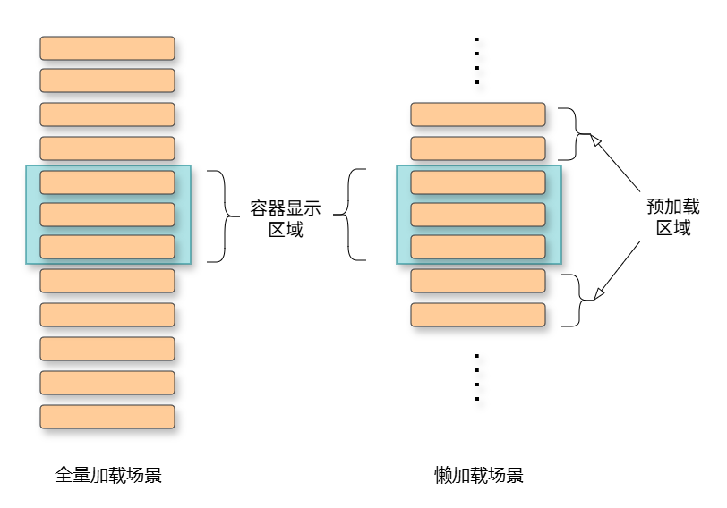

# 渲染控制概述
<!--Kit: ArkUI-->
<!--Subsystem: ArkUI-->
<!--Owner: @liubihao-->
<!--Designer: @lixingchi1-->
<!--Tester: @TerryTsao-->
<!--Adviser: @zhang_yixin13-->

ArkUI通过[自定义组件](../state-management/arkts-create-custom-components.md)的build()函数和[@Builder装饰器](../state-management/arkts-builder.md)中的声明式UI描述语句构建相应的UI。在声明式描述语句中开发者除了使用系统组件外，还可以使用渲染控制语句来辅助UI的构建，这些渲染控制语句包括控制组件是否显示的条件渲染语句，基于数组数据快速生成组件的循环渲染语句，针对大数据量场景的数据懒加载语句，针对混合模式开发的组件渲染语句。

## 名词说明

| 名词     | 含义          |
| ---------- | ------------- |
| 条件渲染组件 | 能够控制UI组件分支切换的语法组件：[if-else](./arkts-rendering-control-ifelse.md) |
| 循环渲染组件 | 能够循环渲染UI组件的语法组件：[ForEach](./arkts-rendering-control-foreach.md), [LazyForEach](./arkts-rendering-control-lazyforeach.md), [Repeat](./arkts-new-rendering-control-repeat.md) |
| 滚动容器组件 | [List](../../reference/apis-arkui/arkui-ts/ts-container-list.md)、[ListItemGroup](../../reference/apis-arkui/arkui-ts/ts-container-listitemgroup.md)、[Grid](../../reference/apis-arkui/arkui-ts/ts-container-grid.md)、[Swiper](../../reference/apis-arkui/arkui-ts/ts-container-swiper.md)、[WaterFlow](../../reference/apis-arkui/arkui-ts/ts-container-waterflow.md) |
| 预加载区域 | 紧邻容器组件显示范围的区域。该区域内的子组件会在系统空闲时提前创建并布局。其大小由容器组件的cachedCount属性设定。 以List为例，设置[cachedCount](../../reference/apis-arkui/arkui-ts/ts-container-list.md#cachedcount)属性后，显示区域外上下各会预加载并布局cachedCount行ListItem。cachedCount默认值等于显示区域中节点的数量。 |

## 全量加载&懒加载介绍

循环渲染数组数据，通常有以下两种方式：全量加载和懒加载（配合滚动容器组件）。

全量加载场景下，组合（Composition）阶段会一次性将所有子组件节点都挂载到UI树上，后续渲染（Rendering）阶段绘制全部子组件。长列表场景下，加载所有节点会导致页面卡顿、高内存占用，尤其是当列表数据高频刷新时，非常影响页面使用体验。首次加载耗时长，但滑动时性能较好，适合数据较少的场景。

相比之下，懒加载场景只加载“列表显示区域+预加载区域”的子组件节点。滚动容器组件获取需要构建的组件的索引范围，创建需要的节点并计算布局，在列表滑动或数据更新时再次刷新索引范围。首次加载性能提升，滑动时创建节点，性能降低。

应用开发者应该根据实际业务情况选择适合的场景。当明确数据列表长度固定，且长度小于某个值（取决于容器组件区域显示子组件的个数），可以考虑使用全量加载方式。除此之外的其他场景，都推荐使用懒加载方式渲染列表数据。

ArkUI框架为鸿蒙应用开发者提供了[ForEach](./arkts-rendering-control-foreach.md)组件（全量加载）和[LazyForEach](./arkts-rendering-control-lazyforeach.md)组件（懒加载）对列表数据循环渲染。除此之外，[Repeat](./arkts-new-rendering-control-repeat.md)组件同时支持两种开发场景，并且默认具备组件复用能力。

## 最佳实践

- [懒加载优化性能-界面渲染性能优化-性能场景优化案例](https://developer.huawei.com/consumer/cn/doc/best-practices/bpta-lazyforeach-optimization)
- [长列表加载丢帧优化-界面渲染性能优化-性能场景优化案例](https://developer.huawei.com/consumer/cn/doc/best-practices/bpta-best-practices-long-list)
