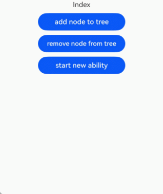

# \@Component装饰器: 自定义组件

在ArkUI中，UI显示的内容均为组件，框架直接提供的称为系统组件，开发者定义的称为自定义组件。进行UI界面开发时，需组合使用系统组件，确保代码的可复用性、业务逻辑与UI的分离，以及后续版本的演进。因此，将UI和部分业务逻辑封装成自定义组件是必需的。此外，自定义组件需要通过import才能使用，而动态自定义组件则不需要。

自定义组件具有以下特点：

- 可组合：允许开发者组合使用系统组件及其属性和方法。

- 可重用：自定义组件可以被其他组件重用，并作为不同的实例在不同的父组件或容器中使用。

- 数据驱动UI更新：通过状态变量的改变，来驱动UI的刷新。

>**说明：**
>
>从API版本26.0.0开始，自定义组件支持跨[Ability](../../reference/apis-ability-kit/js-apis-app-ability-ability.md)迁移。因为自定义组件提供的是UI能力，所以这里的Ability也特指[UIAbility](../../reference/apis-ability-kit/js-apis-app-ability-uiAbility.md)。具体示例参考[自定义组件支持跨Ability迁移](#自定义组件支持跨ability迁移)。\@ComponentV2装饰的自定义组件同样支持该能力，详见[\@ComponentV2装饰器：自定义组件](./arkts-static-componentv2.md#自定义组件支持跨ability迁移)。

## 自定义组件的基本用法

以下示例展示了自定义组件的基本用法。

<!-- @[ComponentBasicUsage](https://gitcode.com/openharmony/applications_app_samples/blob/OpenHarmony_feature_sta_20260331/code/DocsSample/ArkUISample-Sta/CreateComponent/entry/src/main/ets/pages/ComponentBasicUsage.ets) -->

``` TypeScript
import { Column, Component, Divider, Entry, State, Text } from '@kit.ArkUI';

@Component
struct HelloComponent {
  @State message: string = 'Hello, World!';

  build() {
    // HelloComponent自定义组件组合系统组件Row和Text
    Column() {
      Text(this.message)
        .onClick(() => {
        .fontSize(20)
        .margin(10)
          this.message = 'Hello, ArkUI!';
        })
    }
    .width('100%')
  }
}

@Entry
@Component
struct ParentComponent {
  build() {
    Column() {
      Text('ArkUI message')
        .fontSize(20)
        .margin(10)
      HelloComponent({ message: 'Hello World!' });
      Divider()
      HelloComponent({ message: '你好，世界!' });
    }
    .width('100%')
  }
}
```

> **说明：**
>
> 如果在其他文件中引用自定义组件，需要使用`export`关键字导出组件，并在页面中使用`import`语句导入该组件。

在其他自定义组件的`build()`函数中多次创建`HelloComponent`实例，可以实现自定义组件的重用。

要完全理解上面的示例，需要了解自定义组件的以下概念定义，本文将在后面的小节中介绍：

- [自定义组件的基本结构](#自定义组件的基本结构)

- [成员函数/变量](#成员函数变量)

- [自定义组件的参数规定](#自定义组件的参数规定)

- [build()函数](#build函数)


## 自定义组件的基本结构

### struct

自定义组件通过 `struct` 实现，由自定义组件名及大括号内的内容构成，不允许有继承关系。实例化 `struct` 时可省略 `new`。

  > **说明：**
  >
  > 自定义组件名、类名、函数名不能与系统组件名重复。

### \@Component

struct被\@Component装饰后具备组件化能力，需实现build方法描述UI。每个struct仅能被一个\@Component装饰。

  ```typescript
  'use static'

  // @Component装饰器需要import。
  import { Component } from '@kit.ArkUI';
  @Component
  struct MyComponent {
  }
  ```

### build()函数
build()函数用于定义自定义组件的声明式UI描述，自定义组件必须实现build()函数。

  ```typescript
  'use static'

  import { Button, Component } from '@kit.ArkUI';
  @Component
  struct MyComponent {
    build() {
    }
  }
  ```
### \@Entry

\@Entry装饰的自定义组件是UI页面的入口。每个UI页面只能有一个@Entry装饰的组件。\@Entry搭配自定义组件装饰器\@Component使用时，可以接受的参数如下表所示。

| 参数名   | 类型   | 必填 | 说明                                                           |
| ------ | ------ | ------------------------------------------------------------- | ------------------------------------------------------------- |
| routeName | string | 否 | 表示作为命名路由页面的名字。 |
| storage | string | 否 | 返回[LocalStorage](../state-management/arkts-localstorage.md)实例对象的函数名。 |
| useSharedStorage | boolean | 否 | 是否使用UIContext.getSharedLocalStorage()接口返回的共享的[LocalStorage](../state-management/arkts-localstorage.md)实例对象，默认值false。<br>true表示使用共享的[LocalStorage](../state-management/arkts-localstorage.md)实例对象。<br>false表示不使用共享的[LocalStorage](../state-management/arkts-localstorage.md)实例对象。 |


<!-- @[EntryDecorator](https://gitcode.com/openharmony/applications_app_samples/blob/OpenHarmony_feature_sta_20260331/code/DocsSample/ArkUISample-Sta/CreateComponent/entry/src/main/ets/pages/EntryDecorator.ets) -->
``` TypeScript
'use static'

import { Column, Component, Entry, LocalStorage, Text } from '@kit.ArkUI';

const myStorage: () => LocalStorage = () => new LocalStorage();

@Entry({routeName: 'myPage', storage: 'myStorage', useSharedStorage: false})
@Component
struct MyComponent {
  build() {
    Column() {
      Text('@Entry with routeName, storage, useSharedStorage')
    }
  }
}
```

## 成员函数/变量

自定义组件可包含成员变量或成员函数， 如果声明的成员函数或变量是私有的， 不可将成员函数或成员变量声明为静态的。

## 自定义组件的参数规定

下面示例中，开发者可以在build方法里创建静态自定义组件，并在创建过程中根据装饰器的规则来初始化自定义组件的参数。

<!-- @[ComponentParams](https://gitcode.com/openharmony/applications_app_samples/blob/OpenHarmony_feature_sta_20260331/code/DocsSample/ArkUISample-Sta/CreateComponent/entry/src/main/ets/pages/ComponentParams.ets) -->

``` TypeScript
import { Color, Column, Component, Entry, Text } from '@kit.ArkUI';

@Component
struct MyComponent {
  private countDownFrom: number = 0;
  private color: Color = Color.Blue;

  build() {
    Column() {
      Text(`countDownFrom: ${this.countDownFrom}`)
        .fontColor(this.color)
    }
  }
}

@Entry
@Component
struct ParentComponent {
  private someColor: Color = Color.Pink;

  build() {
    Column() {
      // 创建MyComponent实例，并将成员变量countDownFrom初始化为10，将成员变量color初始化为this.someColor。
      MyComponent({ countDownFrom: 10, color: this.someColor })
    }
    .width('100%')
  }
}
```
## build()

在 `build()` 函数中声明的所有语句统称为UI描述，这些描述需遵循以下规则：

-  [@Entry](../../reference/apis-arkui/arkui-ts/ts-custom-component-decorator-entry-static.md)装饰的自定义组件，其build()函数下的根节点是容器组件，并且必须和唯一存在。[ForEach](../../reference/apis-arkui/arkui-ts/ts-rendering-control-foreach-sta.md)不能作为根节点。
- 使用[@Component](../../reference/apis-arkui/arkui-ts/ts-custom-component-decorator-component-static.md)或[@ComponentV2](../../reference/apis-arkui/arkui-ts/ts-custom-component-decorator-componentv2-static.md)装饰的自定义组件，其`build()` 函数下的根节点必须唯一且必要，可以是非容器组件，但 `ForEach` 不能作为根节点。

<!-- @[BuildFunction](https://gitcode.com/openharmony/applications_app_samples/blob/OpenHarmony_feature_sta_20260331/code/DocsSample/ArkUISample-Sta/CreateComponent/entry/src/main/ets/pages/BuildFunction.ets) -->

``` TypeScript
import { Component, Entry, Row, Text } from '@kit.ArkUI';

@Entry
@Component
struct MyComponent {
  build() {
    // 根节点唯一且必要，必须为容器组件
    Row() {
      ChildComponent()
    }
    .height('100%')
  }
}

@Component
struct ChildComponent {
  build() {
    // 根节点唯一且必要，可为非容器组件
    Text('Hello world')
      .fontSize(20)
      .margin(10)
  }
}
```
### build()函数支持写非UI的逻辑

`build()`函数支持编写非 UI 逻辑，如变量声明、[`switch/case`](../../quick-start/introduction-to-arkts.md) 语句和打印日志。但是，不能执行耗时操作，否则会阻塞 UI 主线程，影响应用界面的渲染性能。
**建议用法**

**在build()根节点中进行变量声明**

<!-- @[BuildVariableDeclaration](https://gitcode.com/openharmony/applications_app_samples/blob/OpenHarmony_feature_sta_20260331/code/DocsSample/ArkUISample-Sta/CreateComponent/entry/src/main/ets/pages/BuildVariableDeclaration.ets) -->

``` TypeScript
import { Column, Component, Entry, Text } from '@kit.ArkUI';

@Entry
@Component
struct MyStateSample {
  build() {
    Column() {
      let num: int = 1; // 在build()根节点中进行变量声明
      Text('show text1')
        .fontSize(20)
        .margin(10)
    }
    .width('100%')
    .height('100%')
  }
}
```

**在build()根节点中添加日志打印**

<!-- @[BuildLogPrint](https://gitcode.com/openharmony/applications_app_samples/blob/OpenHarmony_feature_sta_20260331/code/DocsSample/ArkUISample-Sta/CreateComponent/entry/src/main/ets/pages/BuildLogPrint.ets) -->

``` TypeScript
import { Button, ClickEvent, Column, Component, Entry, State, Text } from '@kit.ArkUI';
import { hilog } from '@kit.PerformanceAnalysisKit';

@Entry
@Component
struct MyStateSample {
  @State stateVar: int = 1;

  build() {
    Column() {
      hilog.info(0X0000, 'testTag', `${this.stateVar}`); // 在build()根节点中打印日志
      Text('show text1')
        .fontSize(20)
        .margin(10)
      Button('change stateVar')
        .width(300)
        .margin(10)
        .onClick((e: ClickEvent) => {
          this.stateVar = (this.stateVar + 1) % 4;
        })
    }
    .width('100%')
    .height('100%')
  }
}
```


**在build()函数中使用switch/case结构**

<!-- @[BuildSwitchCase](https://gitcode.com/openharmony/applications_app_samples/blob/OpenHarmony_feature_sta_20260331/code/DocsSample/ArkUISample-Sta/CreateComponent/entry/src/main/ets/pages/BuildSwitchCase.ets) -->

``` TypeScript
import { Button, ClickEvent, Column, Component, Entry, State, Text } from '@kit.ArkUI';

@Entry
@Component
struct MyStateSample {
  @State stateVar: int = 1;

  build() {
    Column() {
      switch(this.stateVar) {
        case 1:
          Text('show text1')
            .fontSize(20)
            .margin(10)
          break;  // 不加break会执行下一个case分支
        case 2:
          Text('show text2')
            .fontSize(20)
            .margin(10)
          break;
        default:
          Text('show default')
            .fontSize(20)
            .margin(10)
          break;
      }
      Button('change stateVar')
        .width(300)
        .margin(10)
        .onClick((e: ClickEvent) => {
          this.stateVar = (this.stateVar + 1) % 4;
        })
    }
    .width('100%')
    .height('100%')
  }
}
```
  > **说明：**
  >
  > 上述 `switch` 示例包含两个 `case` 分支和一个 `default` 分支。当 `condition` 满足某个 `case` 分支的常量表达式时，执行对应的 `case` 分支。如果所有 `case` 分支都不匹配，则执行 `default` 分支。


**允许创建本地的作用域**

<!-- @[BuildLocalScope](https://gitcode.com/openharmony/applications_app_samples/blob/OpenHarmony_feature_sta_20260331/code/DocsSample/ArkUISample-Sta/CreateComponent/entry/src/main/ets/pages/BuildLocalScope.ets) -->

``` TypeScript
import { Component, Entry, Text } from '@kit.ArkUI';

@Entry
@Component
struct MyComponent {
  build() {
    {  // 允许本地作用域
      Text('hello world')
        .fontSize(20)
        .margin(10)
    }
  }
}
```

**允许使用表达式**

<!-- @[BuildExpression](https://gitcode.com/openharmony/applications_app_samples/blob/OpenHarmony_feature_sta_20260331/code/DocsSample/ArkUISample-Sta/CreateComponent/entry/src/main/ets/pages/BuildExpression.ets) -->

``` TypeScript
import { ClickEvent, Column, Component, Entry, State, Text } from '@kit.ArkUI';

@Entry
@Component
struct MyComponent {
  @State stateVar: int = 1;
  build() {
    Column() {
      this.stateVar == 1 ? Text('is equal to 1').fontSize(20).margin(10): Text('is not euqal to 1').fontSize(20).margin(10); // 支持使用表达式
      Text('hello world')
        .fontSize(20)
        .margin(10)
        .onClick((e: ClickEvent) => {
          this.stateVar++;
        })
    }
    .width('100%')
  }
}
```
  > **说明：**
  >
  > 上述代码中，通过三元表达式，也能实现条件渲染。this.stateVar为1时，展示本文内容为`is equal to 1`，this.stateVar不为1时，展示本文内容为`is not equal to 1`。


**不建议用法**

**在 build() 函数中调用耗时的同步接口示例**

在build()函数中，不建议编写非UI逻辑，如调用剪切板接口[getDataSync](../../reference/apis-basic-services-kit/js-apis-pasteboard.md#getdatasync11)获取剪切板数据或执行for循环等。这些操作会增加构建时间，影响UI性能。

``` TypeScript
'use static'

import { Column, Component, Entry, State, Text } from '@kit.ArkUI';
import { BusinessError } from '@kit.BasicServicesKit';
import pasteboard from '@ohos.pasteboard';

@Entry
@Component
struct MyStateSample {
  @State stateVar: string = 'testPasteBoard';

  build() {
    let systemPasteboard: pasteboard.SystemPasteboard = pasteboard.getSystemPasteboard();
    try {
      let result: pasteboard.PasteData = systemPasteboard.getDataSync(); // 获取通过同步接口获取剪切板数据，不推荐
    } catch (err: BusinessError) {
      console.error('Failed to get PasteData, Cause:' + err.message);
    }
    Column() {
      Text(this.stateVar)
    }
    .width('100%')
    .height('100%')
  }
}
```

**在组件中编写复杂的计算逻辑**

<!-- @[BuildNotRecommended](https://gitcode.com/openharmony/applications_app_samples/blob/OpenHarmony_feature_sta_20260331/code/DocsSample/ArkUISample-Sta/CreateComponent/entry/src/main/ets/pages/BuildNotRecommended.ets) -->

``` TypeScript
import { Column, Component, Entry, State, Text } from '@kit.ArkUI';

@Entry
@Component
struct MyStateSample {
  @State stateVar: string = 'hello';

  build() {
    let sum: int = 0;
    for(let i = 0; i < 100000; i++) {
      sum += i * i; // 在build中执行复杂的计算逻辑
    }
    Column() {
      Text(this.stateVar)
        .fontSize(20)
        .margin(10)
    }
    .width('100%')
    .height('100%')
  }
}
```
### 在build()过程中不允许修改状态变量

不允许在`build()`函数的UI组件中改变状态变量的值，否则编译时会提示报错。
``` TypeScript
'use static'

import { Button, ClickEvent, Color, Column, Component, Entry, State, Text } from '@kit.ArkUI';

@Entry
@Component
struct MyComponent {
  @State textColor: Color = Color.Yellow;
  @State columnColor: Color = Color.Green;
  @State count: number = 1;
  build() {
    Column() {
      // 不允许在build过程修改状态变量，编译时报错
      Text(`${this.count++}`)
        .width(50)
        .height(50)
        .fontColor(this.textColor)
        .onClick((e: ClickEvent) => {
          this.columnColor = Color.Red;
        })
      Button('change textColor')
        .onClick((e: ClickEvent) => {
          this.textColor = Color.Pink;
        })
    }
    .backgroundColor(this.columnColor)
  }
}
```

## 自定义组件通用样式

自定义组件通过“.”链式调用设置通用样式。

<!-- @[ComponentStyle](https://gitcode.com/openharmony/applications_app_samples/blob/OpenHarmony_feature_sta_20260331/code/DocsSample/ArkUISample-Sta/CreateComponent/entry/src/main/ets/pages/ComponentStyle.ets) -->

``` TypeScript
import { Button, Color, Component, Entry, Row } from '@kit.ArkUI';

@Component
struct ChildComponent {
  build() {
    Button(`Hello World`)
      .width('90%')
      .margin(10)
  }
}

@Entry
@Component
struct MyComponent {
  build() {
    Row() {
      ChildComponent()
        .width(300)
        .height(300)
        .backgroundColor(Color.Pink)
    }
    .height('100%')
  }
}
```
在ArkUI中，给自定义组件设置样式时，实际上是将样式应用到一个不可见的容器组件上，而不是直接应用到ChildComponent的Button组件上。因此，背景颜色红色会显示在Button所在的不可见容器组件上。

## 支持自定义组件扩展

从API version 23开始，开发者可以在自定义组件中重写通用属性的方法，并使用[`super`](../../quick-start/introduction-to-arkts.md)关键字调用基类的通用属性的方法。当使用"."链式调用自定义组件方法时，需注意以下事项：
1. 实现链式调用的关键是：每个方法必须返回[`this`](../../quick-start/introduction-to-arkts.md#this)，以允许连续调用。如果某个方法未返回`this`，则无法作为链式调用的中间步骤，导致后续调用无法解析，从而引发编译错误。
2. 通过链式调用的方法，其调用时机是在创建自定义组件时，所以在方法内，不能改变关联其他组件或方法的状态变量，否则会有运行时报错。

示例如下。

<!-- @[ComponentExtend](https://gitcode.com/openharmony/applications_app_samples/blob/OpenHarmony_feature_sta_20260331/code/DocsSample/ArkUISample-Sta/CreateComponent/entry/src/main/ets/pages/ComponentExtend.ets) -->

``` TypeScript
import { Color, ColorMetrics, Column, Component, Entry, Link, ResourceColor, State, Text } from '@kit.ArkUI';
import hilog from '@ohos.hilog';

@Component
struct ChildComponent {
  @State message: string = 'default';
  @Link info: string;

  // override关键字可缺省
  override backgroundColor(value: ResourceColor | ColorMetrics | undefined): this {
    hilog.info(0X0000, 'testTag', `override backgroundColor`);
    // this.info = 'Change'; // 运行时报错，禁止在构建组件树的时候修改有依赖的状态变量
    this.message = 'Change'; // 正常运行，可以在构建组件树的时候修改没有依赖的状态变量
    super.backgroundColor(Color.Pink); // 背景颜色显示为粉色，开发者可以选择不调用基类的backgroundColor方法，即不设置背景颜色
    return this;
  }

  // overload
  backgroundColor(value: Array<number>): this {
    hilog.info(0X0000, 'testTag', `overload backgroundColor`);
    return this;
  }

  // myStyle没有返回this，仅可以在链式调用的最后一项被调用
  myStyle(): void {
    hilog.info(0X0000, 'testTag', `myStyle`);
  }

  build() {
    Column() {
      Text(`ChildComponent message ${this.message}`)
        .fontSize(20)
        .margin(10)
      Text(`ChildComponent info ${this.info}`)
        .fontSize(20)
        .margin(10)
    }
    .width('100%')
  }
}

@Entry
@Component
struct MyComponent {
  @State message: string = 'Hello World';

  build() {
    Column() {
      Text(`MyComponent ${this.message}`)
        .fontSize(20)
        .margin(10)

      ChildComponent({ message: this.message, info: this.message })
        .width(200)
        .height(300)
        .backgroundColor(Color.Red)
        .backgroundColor([0])
        .myStyle()
    }
    .height(500)
    .width(300)
  }
}
```

## 自定义组件支持跨Ability迁移

API版本26.0.0之前，自定义组件不支持跨Ability迁移，自定义组件实例在跨Ability后，改变自定义组件的状态变量将无法触发UI组件刷新。

从API版本26.0.0开始，自定义组件支持跨Ability迁移，迁移后的自定义组件能够正常触发UI刷新。

需要注意：

仅支持组件树上的自定义组件迁移。对于未挂载在组件树上的自定义组件将不支持迁移。

在下面的示例中：
1. 点击```Button('add node to tree')```，创建BuilderNode节点挂载到`NodeContainer`下。
2. 点击```Button('remove node from tree')```，将BuilderNode节点从`NodeContainer`上移除。
3. 点击```Button('start new ability')```，拉起`ExtraAbility`。
4. 点击`ExtraIndex`内的```Button('add node to tree')```，将BuilderNode节点重新挂载到`ExtraIndex`内的`NodeContainer`下。
   - 自定义组件`ComponentUnderBuilderNode`在被挂载到新的Ability下时，会通知切换Ability的自定义组件更新其所属的Ability实例ID。
   - 点击自定义组件`ComponentUnderBuilderNode`内```Button('change message')```，改变状态变量`message`的值，触发```@Watch('messageUpdate') ```回调和UI刷新。

下面的示例包含了创建新的Ability流程，具体示例可参考[startAbility](../../reference/apis-ability-kit/js-apis-inner-application-uiAbilityContext.md#startability)。

``` TypeScript
'use static'

import UIAbility from '@ohos.app.ability.UIAbility';
import AbilityConstant from '@ohos.app.ability.AbilityConstant';
import Want from '@ohos.app.ability.Want';
import window from '@ohos.window';
import { BusinessError } from '@ohos.base';
import hilog from '@ohos.hilog';

class EntryAbility extends UIAbility {
  onCreate(want: Want, launchParam: AbilityConstant.LaunchParam): void {
    hilog.info(0x0000, 'testTag', 'EntryAbility onCreate');
  }

  onWindowStageCreate(windowStage: window.WindowStage): void {
    hilog.info(0x0000, 'testTag', 'EntryAbility onWindowStageCreate');
    try {
      // 加载Index页面
      windowStage.loadContent('pages/Index', (err: BusinessError<void> | null): void => {
        if (err && err.code) {
          hilog.info(0x0000, 'testTag', 'loadContent error');
          return;
        }
        hilog.info(0x0000, 'testTag', 'loadContent ok');
      });
    } catch (e) {
      hilog.info(0x0000, 'testTag', 'loadContent catch error: ' + e.message);
    }
  }
}
```

``` TypeScript
'use static'

import { MyNodeController } from './MyNodeController';
import hilog from '@ohos.hilog';
import common from '@ohos.app.ability.common';
import Want from '@ohos.app.ability.Want';
import { BusinessError } from '@ohos.base';
import { Entry, Component, Column, Text, Button, NodeContainer, ColumnOptions } from '@kit.ArkUI';

const DOMAIN = 0x0000;

@Entry
@Component
struct Index {
  private nodeController: MyNodeController = new MyNodeController();

  startNewAbility() {
    const want: Want = {
      // 应用包名
      bundleName: 'com.example.customcomponentcross',
      abilityName: 'ExtraAbility'
    };

    try {
      const context = this.getUIContext()?.getHostContext() as common.UIAbilityContext;
      context!.startAbility(want);
    } catch (err) {
      hilog.error(DOMAIN, 'testTag', `startAbility failed, message is ${err.message}`);
    }
  }

  build() {
    Column({ space: 10} as ColumnOptions) {
      Text('Index')
      Button('add node to tree')
        .width(200)
        .onClick(() => {
          // 创建globalBuilderNode，并将globalBuilderNode下的节点挂在NodeContainer的占位节点下
          this.nodeController.addBuilderNode();
        })
      Button('remove node from tree')
        .width(200)
        .onClick(() => {
          // 从NodeContainer的占位节点下移除globalBuilderNode下的节点
          this.nodeController.removeBuilderNode();
        })
      Button('start new ability')
        .width(200)
        .onClick(() => {
          // 拉起新的Ability
          this.startNewAbility();
        })
      NodeContainer(this.nodeController)
        .backgroundColor('#FFEEF0')
    }
    .width('100%')
    .height('100%')
  }
}
```

``` TypeScript
'use static'

import { Builder, BuilderNode, FrameNode, NodeController, UIContext, wrapBuilder,
        Column, Component, State, Watch, Text, Button, ColumnOptions } from '@kit.ArkUI';
import hilog from '@ohos.hilog';

const DOMAIN = 0x0000;

let globalBuilderNode: BuilderNode | undefined = undefined;

export class MyNodeController extends NodeController {
  private rootNode: FrameNode | null = null;
  private uiContext: UIContext | null = null;

  makeNode(uiContext: UIContext): FrameNode | null {
    this.rootNode = new FrameNode(uiContext);
    this.uiContext = uiContext;
    return this.rootNode;
  }

  addBuilderNode(): void {
    // 如果globalBuilderNode尚未创建，则创建一个新的BuilderNode
    if (!globalBuilderNode && this.uiContext) {
      globalBuilderNode = new BuilderNode<undefined>(this.uiContext as UIContext);
      globalBuilderNode!.build(wrapBuilder(buildComponent));
    }
    // 将globalBuilderNode下的节点挂载到NodeContainer的占位节点下
    if (this.rootNode && globalBuilderNode) {
      this.rootNode!.appendChild(globalBuilderNode!.getFrameNode()!);
    }
  }

  removeBuilderNode(): void {
    // 从NodeContainer的占位节点下移除globalBuilderNode下的节点
    if (this.rootNode && globalBuilderNode) {
      this.rootNode!.removeChild(globalBuilderNode!.getFrameNode()!);
    }
  }

  disposeNode(): void {
    // 销毁globalBuilderNode下的节点
    if (this.rootNode && globalBuilderNode) {
      globalBuilderNode!.dispose();
      globalBuilderNode = undefined;
    }
  }
}

@Builder
function buildComponent() {
  Column() {
    ComponentUnderBuilderNode()
  }
}

@Component
struct ComponentUnderBuilderNode {
  @State @Watch('messageUpdate') message: string = 'hello';

  messageUpdate(propertyName: string) {
    hilog.info(DOMAIN, 'testTag', `ComponentUnderBuilderNode message change ${this.message}`);
  }

  build() {
    Column({ space: 10} as ColumnOptions) {
      Text(`message: ${this.message}`)
      // 改变message的值，触发@Watch('messageUpdate')回调和Text组件的刷新
      Button('change message')
        .onClick(() => {
          this.message += ' world';
        })
    }
  }
}
```

``` TypeScript
'use static'

import UIAbility from '@ohos.app.ability.UIAbility';
import AbilityConstant from '@ohos.app.ability.AbilityConstant';
import Want from '@ohos.app.ability.Want';
import window from '@ohos.window';
import { BusinessError } from '@ohos.base';
import hilog from '@ohos.hilog';

class ExtraAbility extends UIAbility {
  onCreate(want: Want, launchParam: AbilityConstant.LaunchParam): void {
    hilog.info(0x0000, 'testTag', 'ExtraAbility onCreate');
  }

  onWindowStageCreate(windowStage: window.WindowStage): void {
    hilog.info(0x0000, 'testTag', 'ExtraAbility onWindowStageCreate');
    try {
      // 加载ExtraIndex页面
      windowStage.loadContent('extraability/ExtraIndex', (err: BusinessError<void> | null): void => {
        if (err && err.code) {
          hilog.info(0x0000, 'testTag', 'loadContent error');
          return;
        }
        hilog.info(0x0000, 'testTag', 'loadContent ok');
      });
    } catch (e) {
      hilog.info(0x0000, 'testTag', 'loadContent catch error: ' + e.message);
    }
  }
}
```

``` TypeScript
'use static'

import { Entry, Text, Column, Component, Button, NodeContainer, ColumnOptions } from '@kit.ArkUI';
import { MyNodeController } from '../pages/MyNodeController';

@Entry
@Component
struct ExtraIndex {
  private nodeController: MyNodeController = new MyNodeController();

  build() {
    Column({ space: 10} as ColumnOptions) {
      Text('ExtraIndex')
      Button('add node to tree')
        .width(200)
        .onClick(() => {
          // 将globalBuilderNode下的节点挂在NodeContainer的占位节点下
          this.nodeController.addBuilderNode();
        })
      Button('remove node from tree')
        .width(200)
        .onClick(() => {
          // 从NodeContainer的占位节点下移除globalBuilderNode下的节点
          this.nodeController.removeBuilderNode();
        })
      Button('dispose node')
        .width(200)
        .onClick(() => {
          // 销毁globalBuilderNode下的节点
          this.nodeController.disposeNode();
        })
      NodeContainer(this.nodeController)
        .backgroundColor('#FFEEF0')
    }
    .width('100%')
    .height('100%')
  }
}
```

