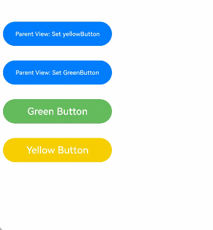
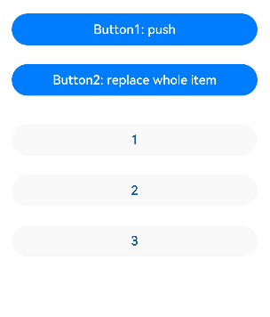
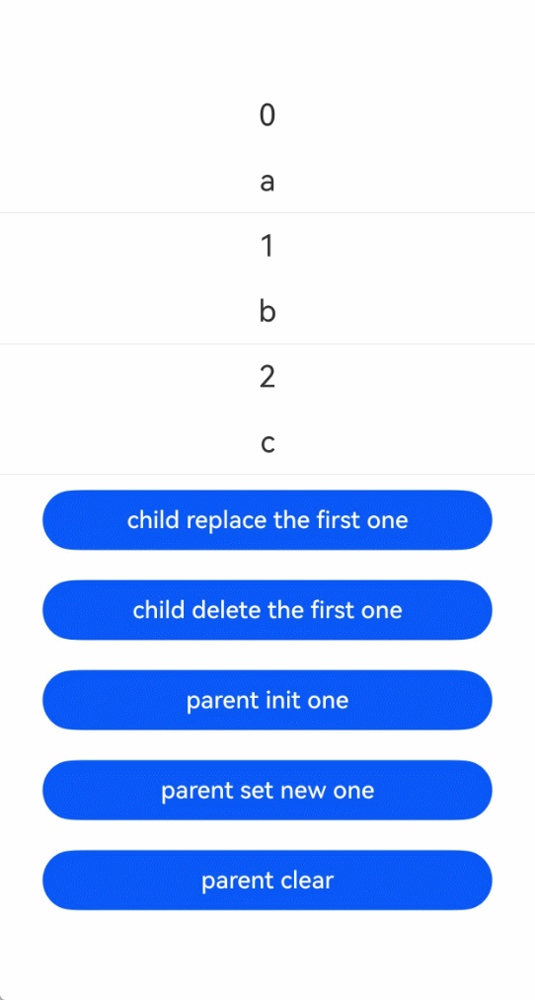
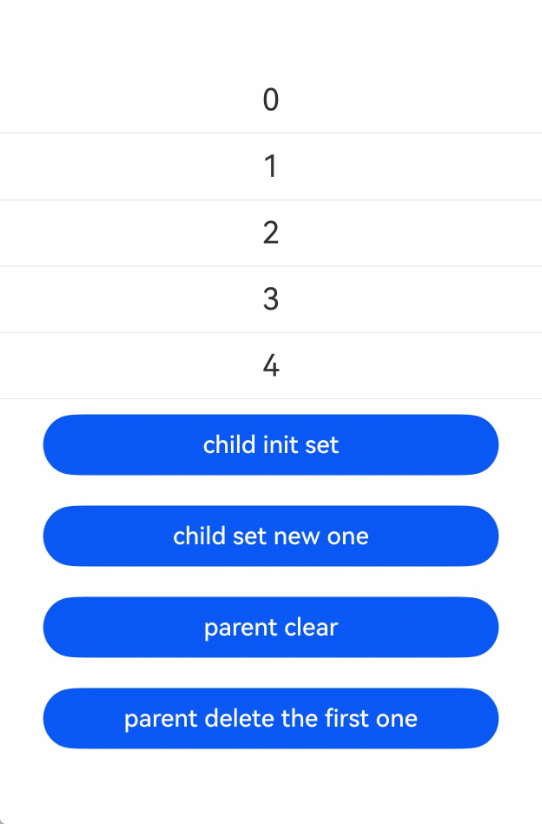
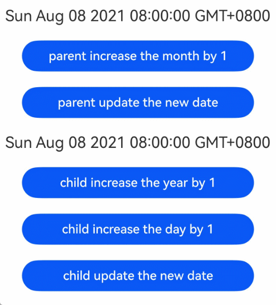
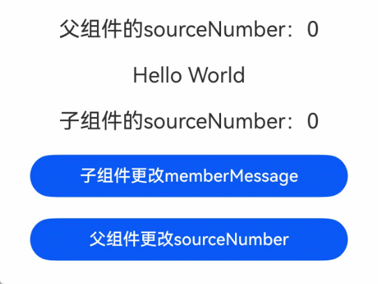
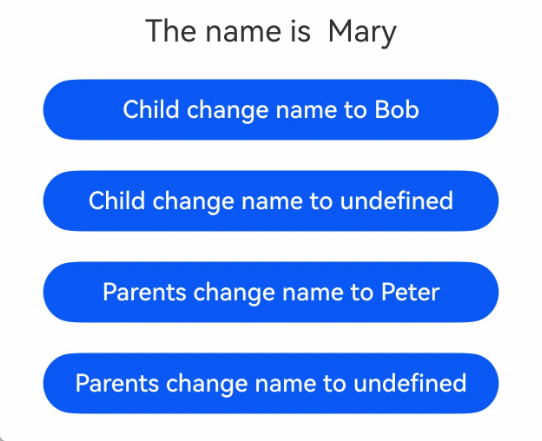

# \@Link装饰器：父子双向同步

@Link装饰的变量与外部传入的状态变量数据源建立双向同步。

## 概述

\@Link获取外部传入状态变量数据源的引用，当数据源改变时，@Link能够感知到变化，触发绑定的UI组件刷新。同时，@Link修改时，数据源处也能感知到变化，触发数据源绑定的UI组件刷新。

在静态语言上下文中使用时，需要导入装饰器：

```ts
import { Link } from '@kit.ArkUI';
```

## 装饰器说明

| \@Link变量装饰器   | 说明                                                         |
| ------------------ | ------------------------------------------------------------ |
| 装饰器参数         | 无。                                                         |
| 允许装饰的变量类型  | 支持Object、class、string、int、double、long、boolean、enum、interface等基本类型。<br/>支持[Array](#装饰数组类型变量)、[Date](#装饰date类型变量)、[Map](#装饰map类型变量)、[Set](#装饰set类型变量)等内嵌类型。<br/>支持null、undefined以及[联合类型](#link支持联合类型)。 |
| 初始化规则         | 禁止本地初始化。使用父组件传入的变量进行初始化。                                         |
| 同步规则           | **在子组件使用时：**<br/>与父组件[\@State](./arkts-static-state.md)、\@Link、[\@PropRef](./arkts-static-propref.md)、[\@Provide、\@Consume](./arkts-static-provide-and-consume.md)、[\@ObjectLink](./arkts-static-observed-and-objectlink.md)、[\@StorageLink](./arkts-static-appstorage.md#storagelink)、[\@StoragePropRef](./arkts-static-appstorage.md#storagepropref)、[\@LocalStorageLink](./arkts-static-localstorage.md#localstoragelink)和[\@LocalStoragePropRef](./arkts-static-localstorage.md#localstoragepropref)建立双向绑定。允许父组件中\@State、\@Link、\@PropRef、\@Provide、\@Consume、\@ObjectLink、\@StorageLink、\@StoragePropRef、\@LocalStorageLink和\@LocalStoragePropRef装饰变量初始化子组件\@Link。<br/>**在父组件使用时：**<br/>可用于初始化常规变量、\@State、\@Link、\@PropRef、\@Provide。 |

## 观察变化和行为表现

- 当装饰的数据类型为boolean、string、int时，可以同步观察到数值的变化，示例请参考[装饰简单类型变量](#装饰简单类型变量)。

- 当装饰的数据类型为class或者Object时，对对象属性的观测需要借助[@Observed](./arkts-static-observed-and-objectlink.md)与[@Track](./arkts-static-track.md)实现，单独的\@Link无法再观测对象的属性变化，仅能观测对象整体的赋值。

- 当装饰的对象是Array时，可以观察到数组添加、删除、更新数组单元的变化，示例请参考[装饰数组类型变量](#装饰数组类型变量)。

- 当装饰的对象是Date时，可以观察到Date的整体赋值，以及通过调用`setFullYear`, `setMonth`, `setDate`, `setHours`, `setMinutes`, `setSeconds`, `setMilliseconds`, `setTime`, `setUTCFullYear`, `setUTCMonth`, `setUTCDate`, `setUTCHours`, `setUTCMinutes`, `setUTCSeconds`, `setUTCMilliseconds`方法更新其属性。详见[装饰Date类型变量](#装饰date类型变量)。

- 当装饰的变量是Map时，可以观察到Map整体的赋值，以及通过调用Map的`set`、`clear`、`delete`接口更新Map的值。详见[装饰Map类型变量](#装饰map类型变量)。

- 当装饰的变量是Set时，可以观察Set整体的赋值，以及通过调用Set的`add`、`clear`、`delete`接口更新其值。详见[装饰Set类型变量](#装饰set类型变量)。

- 当装饰interface字面量类型时，可以观察到字面量整体及其属性的变化。

  <!-- @[LinkInterface](https://gitcode.com/openharmony/applications_app_samples/blob/OpenHarmony_feature_sta_20260331/code/DocsSample/ArkUISample-Sta/LinkDecorator/entry/src/main/ets/pages/LinkInterface.ets) -->
  
  ``` TypeScript
  import { ClickEvent, Column, Component, Entry, Link, State, Text } from '@kit.ArkUI';
  
  interface Info {
    name: string;
    age: int;
  }
  
  @Component
  struct Child {
    @Link info: Info;
    build() {
      Column() {
        Text(`Child info.name: ${this.info.name}`)
          .onClick((e: ClickEvent) => {
            this.info.name = 'Jerry';
          })
      }
    }
  }
  
  @Entry
  @Component
  struct Parent {
    // 装饰字面量
    @State info: Info = { name: 'Bob', age: 22 } as Info;
    build() {
      Column() {
        Text(`Parent info.name: ${this.info.name}`)
          .onClick((e: ClickEvent) => {
            this.info.name = 'Tom';
          })
        Child({info: this.info})
      }
    }
  }
  ```
  
## 限制条件

1. \@Link装饰器不能在[\@Entry](./arkts-static-create-component.md#entry)装饰的自定义组件中使用。
2. \@Link装饰的变量禁止在本地初始化，否则编译期会报错。

    ```ts
    // 错误写法，编译报错
    @Link count: int = 10;
    
    // 正确写法
    @Link count: int;
    ```

3. \@Link装饰的状态变量的类型要和数据源的类型保持一致，否则编译期会报错。同时，数据源必须是状态变量，否则在运行时会崩溃。

    > **说明：**
    >
    > 从API version 23开始，添加对\@Link数据源错误的校验，运行时崩溃变为编译期报错。

    【反例】

    ```ts
    'use static'

    import { Column, Component, Entry, Link, State, Text } from '@kit.ArkUI';
    
    class Info {
      info: string = 'Hello';
    }
    
    class Cousin {
      name: string = 'Hello';
    }
    
    @Component
    struct Child {
      // 错误写法1：@Link与@State数据源类型不一致
      @Link test: Cousin;
      // 错误写法2：数据源非状态变量
      @Link testStr: string;
    
      build() {
        Text(this.test.name)
      }
    }
    
    @Entry
    @Component
    struct LinkExample {
      @State info: Info = new Info();
    
      build() {
        Column() {
          Child({
            // 错误写法1：@Link与@State数据源类型不一致
            test: this.info,
            // 错误写法2：数据源非状态变量
            testStr: this.info.info
          })
        }
      }
    }
    ```

    【正例】

    <!-- @[LinkTypeConsistent](https://gitcode.com/openharmony/applications_app_samples/blob/OpenHarmony_feature_sta_20260331/code/DocsSample/ArkUISample-Sta/LinkDecorator/entry/src/main/ets/pages/LinkTypeConsistent.ets) -->
    
    ``` TypeScript
    import { Column, Component, Entry, Link, State, Text } from '@kit.ArkUI';
    
    class Info {
      info: string = 'Hello';
    }
    
    @Component
    struct Child {
      // 正确写法
      @Link test: Info;
    
      build() {
        Text(this.test.info)
      }
    }
    
    @Entry
    @Component
    struct LinkExample {
      @State info: Info = new Info();
    
      build() {
        Column() {
          // 正确写法
          Child({test: this.info})
        }
      }
    }
    ```

4. \@Link装饰的状态变量仅能被状态变量初始化，不能使用常规变量初始化，否则编译期会给出告警，并在运行时崩溃。

    【反例】
  
    ```ts
    'use static'
    
    import { Column, Component, Entry, Link, State, Text } from '@kit.ArkUI';
    
    class Info {
      info: string = 'Hello';
    }
    
    @Component
    struct Child {
      @Link msg: string;
      @Link info: string;
    
      build() {
        Text(this.msg + this.info)
      }
    }
    
    @Entry
    @Component
    struct LinkExample {
      @State message: string = 'Hello';
      @State info: Info = new Info();
    
      build() {
        Column() {
          // 错误写法，常规变量不能初始化@Link
          Child({msg: 'World', info: this.info.info})
        }
      }
    }
    ```
    
    【正例】

    <!-- @[LinkStateVarInit](https://gitcode.com/openharmony/applications_app_samples/blob/OpenHarmony_feature_sta_20260331/code/DocsSample/ArkUISample-Sta/LinkDecorator/entry/src/main/ets/pages/LinkStateVarInit.ets) -->
    
    ``` TypeScript
    import { Column, Component, Entry, Link, State, Text } from '@kit.ArkUI';
    
    class Info {
      info: string = 'Hello';
    }
    
    @Component
    struct Child {
      @Link msg: string;
      @Link info: Info;
    
      build() {
        Text(this.msg + this.info.info)
      }
    }
    
    @Entry
    @Component
    struct LinkExample {
      @State message: string = 'Hello';
      @State info: Info = new Info();
    
      build() {
        Column() {
          // 正确写法
          Child({msg: this.message, info: this.info})
        }
      }
    }
    ```
5. \@Link不支持装饰Function与() => void类型的变量，API version 23之前，框架会抛出运行时错误。
   从API version 23开始，添加对\@Link装饰Function与() => void类型变量的校验，编译期会报错。
   
## 使用场景

### 简单类型和类对象类型的\@Link

以下示例中，点击父组件ShufflingContainer中的“Parent View: Set yellowButton”和“Parent View: Set GreenButton”，可以从父组件将变化同步给子组件。

  1.点击子组件GreenButton和YellowButton中的Button，子组件会发生相应变化，将变化同步给父组件。因为@Link是双向同步，会将变化同步给@State。

  2.当点击父组件ShufflingContainer中的Button时，@State会发生变化，并同步给\@Link，子组件也会进行对应的刷新。

<!-- @[LinkBasicTypes](https://gitcode.com/openharmony/applications_app_samples/blob/OpenHarmony_feature_sta_20260331/code/DocsSample/ArkUISample-Sta/LinkDecorator/entry/src/main/ets/pages/LinkBasicTypes.ets) -->

``` TypeScript
import {
  Button,
  ClickEvent,
  Column,
  Component,
  Entry,
  Link,
  State,
  Text,
  Flex,
  FlexDirection,
  ItemAlign,
  FlexAlign,
  Observed
} from '@kit.ArkUI';

@Observed
class GreenButtonState {
  public width: int = 0;

  constructor(width: int) {
    this.width = width;
  }
}

@Component
struct GreenButton {
  @Link greenButtonState: GreenButtonState;

  build() {
    Button('Green Button')
      .width(this.greenButtonState.width)
      .height(40)
      .backgroundColor('#64bb5c')
      .fontColor('#FFFFFF')
      .onClick(() => {
        if (this.greenButtonState.width < 700) {
          // 更新class的属性，变化可以被观察到同步回父组件
          this.greenButtonState.width += 60;
        } else {
          // 更新class，变化可以被观察到同步回父组件
          this.greenButtonState = new GreenButtonState(180);
        }
      })
  }
}

@Component
struct YellowButton {
  @Link yellowButtonState: int;

  build() {
    Button('Yellow Button')
      .width(this.yellowButtonState)
      .height(40)
      .backgroundColor('#f7ce00')
      .fontColor('#FFFFFF')
      .onClick(() => {
        // 子组件的简单类型可以同步回父组件
        this.yellowButtonState += 40.0;
      })
  }
}

@Entry
@Component
struct ShufflingContainer {
  @State greenButtonState: GreenButtonState = new GreenButtonState(180);
  @State yellowButtonProp: int = 180;

  build() {
    Column() {
      Flex({ direction: FlexDirection.Column, alignItems: ItemAlign.Center }) {
        // 简单类型从父组件@State向子组件@Link数据同步
        Button('Parent View: Set yellowButton')
          .width(this.yellowButtonProp)
          .height(40)
          .margin(12)
          .fontColor('#FFFFFF')
          .onClick(() => {
            this.yellowButtonProp = (this.yellowButtonProp < 700) ? this.yellowButtonProp + 40 : 100;
          })
        // class类型从父组件@State向子组件@Link数据同步
        Button('Parent View: Set GreenButton')
          .width(this.greenButtonState.width)
          .height(40)
          .margin(12)
          .fontColor('#FFFFFF')
          .onClick(() => {
            this.greenButtonState.width = (this.greenButtonState.width < 700) ? this.greenButtonState.width + 100 : 100;
          })
        // class类型初始化@Link
        GreenButton({ greenButtonState: this.greenButtonState }).margin(12)
        // 简单类型初始化@Link
        YellowButton({ yellowButtonState: this.yellowButtonProp }).margin(12)
      }
    }
  }
}
```



### 装饰数组类型变量

当装饰数组时，可以观察到数组整体和数组项的变化，同时可以通过调用Array的接口 `push`、`pop`、`shift`、`unshift`、`splice`、`copyWithin`、`fill`、`reverse`、`sort`更新Array的数据。

<!-- @[LinkArray](https://gitcode.com/openharmony/applications_app_samples/blob/OpenHarmony_feature_sta_20260331/code/DocsSample/ArkUISample-Sta/LinkDecorator/entry/src/main/ets/pages/LinkArray.ets) -->

``` TypeScript
import { Button, ClickEvent, Column, Component, Entry, ForEach, Link, State, Text } from '@kit.ArkUI';
@Component
struct Child {
  @Link items: int[];

  build() {
    Column() {
      Button(`Button1: push`)
        .margin(12)
        .width(312)
        .height(40)
        .fontColor('#FFFFFF')
        .onClick((e: ClickEvent) => {
          this.items.push(this.items.length + 1);
        })
      // 子组件的数组类型可以同步回父组件
      Button(`Button2: replace whole item`)
        .margin(12)
        .width(312)
        .height(40)
        .fontColor('#FFFFFF')
        .onClick((e: ClickEvent) => {
          this.items = [100, 200, 300];
        })
    }
  }
}

@Entry
@Component
struct Parent {
  @State arr: int[] = [1, 2, 3];

  build() {
    Column() {
      Child({ items: this.arr })
        .margin(12)
      ForEach(this.arr,
        (item: int) => {
          Button(`${item}`)
            .margin(12)
            .width(312)
            .height(40)
            .backgroundColor('#11a2a2a2')
            .fontColor('#e6000000')
        },
        (item: int) => item.toString()
      )
    }
  }
}
```



状态管理框架可以观察到数组元素的添加、删除和替换。在该示例中，\@State和\@Link的类型均为number[]，不支持将\@Link定义成number类型（\@Link item : number），并用\@State数组中的每个数据项在父组件中创建子组件。如需使用这种场景，可以参考[\@Prop](arkts-prop.md)和[\@Observed](./arkts-observed-and-objectlink.md)。

### 装饰Map类型变量

在下面的示例中，message类型为Map\<int, string\>，点击Button改变message的值，视图会随之刷新。

<!-- @[LinkMap](https://gitcode.com/openharmony/applications_app_samples/blob/OpenHarmony_feature_sta_20260331/code/DocsSample/ArkUISample-Sta/LinkDecorator/entry/src/main/ets/pages/LinkMap.ets) -->

``` TypeScript
import { Button, ClickEvent, Column, Component, Divider, Entry, ForEach, Link, Row, State, Text } from '@kit.ArkUI';
@Component
struct Child {
  @Link value: Map<int, string>;

  build() {
    Column() {
      ForEach(Array.from(this.value.entries()), (item: [int, string]) => {
        Text(`${item[0]}`)
          .fontSize(20)
          .margin(10)
        Text(`${item[1]}`)
          .fontSize(20)
          .margin(10)
        Divider()
      })
      Button('child replace the first one')
        .width(300)
        .margin(10)
        .onClick((e: ClickEvent) => {
          // 更新键值对，触发UI刷新
          this.value.set(0, 'aa');
      })
      Button('child delete the first one')
        .width(300)
        .margin(10)
        .onClick((e: ClickEvent) => {
          // 删除键值对，触发UI刷新
          this.value.delete(0);
      })
    }
    .width('100%')
  }
}

@Entry
@Component
struct MapSample {
  @State message: Map<int, string> = new Map<int, string>([[0, 'a'], [1, 'b'], [2, 'c']]);

  build() {
    Row() {
      Column() {
        Child({ value: this.message })
        Button('parent init one')
          .width(300)
          .margin(10)
          .onClick((e: ClickEvent) => {
            this.message = new Map<int, string>([[0, 'a'], [1, 'b'], [2, 'c']]);
        })
        Button('parent set new one')
          .width(300)
          .margin(10)
          .onClick((e: ClickEvent) => {
            // 新增键值对，触发UI刷新
            this.message.set(3, 'd');
        })
        Button('parent clear')
          .width(300)
          .margin(10)
          .onClick((e: ClickEvent) => {
            // 清空Map，触发UI刷新
            this.message.clear();
        })
      }
      .width('100%')
    }
    .height('100%')
  }
}
```



### 装饰Set类型变量

在下面的示例中，message类型为Set\<int\>，点击Button改变message的值，视图会随之刷新。

<!-- @[LinkSet](https://gitcode.com/openharmony/applications_app_samples/blob/OpenHarmony_feature_sta_20260331/code/DocsSample/ArkUISample-Sta/LinkDecorator/entry/src/main/ets/pages/LinkSet.ets) -->

``` TypeScript
import { Button, ClickEvent, Column, Component, Divider, Entry, ForEach, Link, Row, State, Text } from '@kit.ArkUI';

@Component
struct Child {
  @Link message: Set<int>;

  build() {
    Column() {
      ForEach(Array.from(this.message.entries()), (item: [int, int]) => {
        Text(`${item[0]}`)
          .fontSize(20)
          .margin(10)
        Divider()
      })
      Button('child init set')
        .width(300)
        .margin(10)
        .onClick((e: ClickEvent) => {
          this.message = new Set<int>([0, 1, 2, 3, 4]);
      })
      Button('child set new one')
        .width(300)
        .margin(10)
        .onClick((e: ClickEvent) => {
          // 新增元素，触发UI刷新
          this.message.add(5);
      })
    }
    .width('100%')
  }
}

@Entry
@Component
struct SetSample {
  @State message: Set<int> = new Set<int>([0, 1, 2, 3, 4]);

  build() {
    Row() {
      Column() {
        Child({ message: this.message })
        Button('parent clear')
          .width(300)
          .margin(10)
          .onClick((e: ClickEvent) => {
            // 清空Set，触发UI刷新
            this.message.clear();
        })
        Button('parent delete the first one')
          .width(300)
          .margin(10)
          .onClick((e: ClickEvent) => {
            // 删除元素，触发UI刷新
            this.message.delete(0);
        })
      }
      .width('100%')
    }
    .height('100%')
  }
}
```



### 装饰Date类型变量

在下面的示例中，selectedDate类型为Date，点击Button改变selectedDate的值，视图会随之刷新。

<!-- @[LinkDate](https://gitcode.com/openharmony/applications_app_samples/blob/OpenHarmony_feature_sta_20260331/code/DocsSample/ArkUISample-Sta/LinkDecorator/entry/src/main/ets/pages/LinkDate.ets) -->

``` TypeScript
import { Button, ClickEvent, Column, Component, Entry, Link, State, Text } from '@kit.ArkUI';

@Component
struct DateComponent {
  @Link selectedDate: Date;

  build() {
    Column() {
      Text(`${this.selectedDate}`)
        .fontSize(20)
        .margin(10)
      Button('child increase the year by 1')
        .width(300)
        .margin(10)
        .onClick((e: ClickEvent) => {
          // 调用Date的setFullYear接口修改年份，触发UI刷新
          this.selectedDate.setFullYear(this.selectedDate.getFullYear() + 1);
        })
      Button('child increase the day by 1')
        .width(300)
        .margin(10)
        .onClick((e: ClickEvent) => {
          // 调用Date的setDate接口修改日期，触发UI刷新
          this.selectedDate.setDate(this.selectedDate.getDate() + 1);
        })
      Button('child update the new date')
        .width(300)
        .margin(10)
        .onClick((e: ClickEvent) => {
          // 通过给selectedDate重新赋值新的Date实例，触发UI刷新
          this.selectedDate = new Date('2023-09-09');
        })
    }
    .width('100%')
  }
}
@Entry
@Component
struct ParentComponent {
  @State parentSelectedDate: Date = new Date('2021-08-08');

  build() {
    Column() {
      Text(`${this.parentSelectedDate}`)
        .fontSize(20)
        .margin(10)
      Button('parent increase the month by 1')
        .width(300)
        .margin(10)
        .onClick((e: ClickEvent) => {
          // 调用Date的setMonth接口修改月份，触发UI刷新
          this.parentSelectedDate.setMonth(this.parentSelectedDate.getMonth() + 1);
        })
      Button('parent update the new date')
        .width(300)
        .margin(10)
        .onClick((e: ClickEvent) => {
          // 通过给parentSelectedDate重新赋值新的Date实例，触发UI刷新
          this.parentSelectedDate = new Date('2023-07-07');
        })
      DateComponent({ selectedDate:this.parentSelectedDate })
    }
    .width('100%')
  }
}
```



### 使用双向同步机制更改本地其他变量

通过[\@Watch](./arkts-static-watch.md)可以在双向同步时更改本地变量。

以下示例中，在\@Link的\@Watch回调中修改\@State装饰的状态变量memberMessage，实现父子组件间的变量同步。但是在本地修改\@State装饰的变量memberMessage不会影响到父组件中的变量改变。

<!-- @[LinkWatch](https://gitcode.com/openharmony/applications_app_samples/blob/OpenHarmony_feature_sta_20260331/code/DocsSample/ArkUISample-Sta/LinkDecorator/entry/src/main/ets/pages/LinkWatch.ets) -->

``` TypeScript
import { Button, ClickEvent, Column, Component, Entry, Link, State, Text, Watch } from '@kit.ArkUI';

@Entry
@Component
struct Parent {
  @State sourceNumber: int = 0;

  build() {
    Column() {
      Text(`父组件的sourceNumber：` + this.sourceNumber)
        .fontSize(20)
        .margin(10)
      Child({ sourceNumber: this.sourceNumber })
      Button('父组件更改sourceNumber')
        .width(300)
        .margin(10)
        .onClick((e: ClickEvent) => {
          this.sourceNumber++;
        })
    }
    .width('100%')
  }
}

@Component
struct Child {
  @State memberMessage: string = 'Hello World';
  @Link @Watch('onSourceChange') sourceNumber: int;

  onSourceChange(propertyName: string) {
    // 给memberMessage变量赋新的值
    this.memberMessage = this.sourceNumber.toString();
  }

  build() {
    Column() {
      Text(this.memberMessage)
        .fontSize(20)
        .margin(10)
      Text(`子组件的sourceNumber：` + this.sourceNumber.toString())
        .fontSize(20)
        .margin(10)
      Button('子组件更改memberMessage')
        .width(300)
        .margin(10)
        .onClick((e: ClickEvent) => {
          this.memberMessage = 'Hello memberMessage';
        })
    }
    .width('100%')
  }
}
```



### \@Link支持联合类型

`@Link`支持联合类型、`undefined`和`null`。在以下示例中，`name`类型为`string | undefined`。点击父组件`Index`中的按钮可以改变`name`的属性或类型，`Child`组件也会相应刷新。

<!-- @[LinkUnionType](https://gitcode.com/openharmony/applications_app_samples/blob/OpenHarmony_feature_sta_20260331/code/DocsSample/ArkUISample-Sta/LinkDecorator/entry/src/main/ets/pages/LinkUnionType.ets) -->

``` TypeScript
import { Button, ClickEvent, Column, Component, Entry, Link, State, Text } from '@kit.ArkUI';

@Component
struct Child {
  @Link name: string | undefined;

  build() {
    Column() {
      Button('Child change name to Bob')
        .width(300)
        .margin(10)
        .onClick((e: ClickEvent) => {
          this.name = 'Bob';
        })
      Button('Child change name to undefined')
        .width(300)
        .margin(10)
        .onClick((e: ClickEvent) => {
          this.name = undefined;
        })
    }.width('100%')
  }
}

@Entry
@Component
struct Index {
  @State name: string | undefined = 'Mary';

  build() {
    Column() {
      Text(`The name is  ${this.name}`) // 显示name变量的值
        .fontSize(20)
        .margin(10)
      Child({ name: this.name })
      Button('Parents change name to Peter')
        .width(300)
        .margin(10)
        .onClick((e: ClickEvent) => {
          this.name = 'Peter';
        })
      Button('Parents change name to undefined')
        .width(300)
        .margin(10)
        .onClick((e: ClickEvent) => {
          this.name = undefined;
        })
    }
    .width('100%')
  }
}
```



<!--no_check-->
