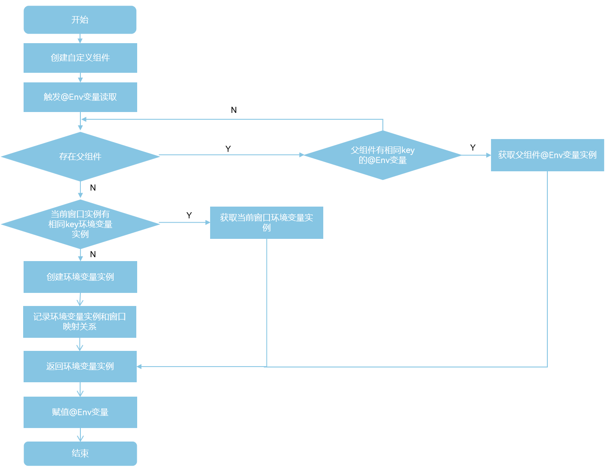
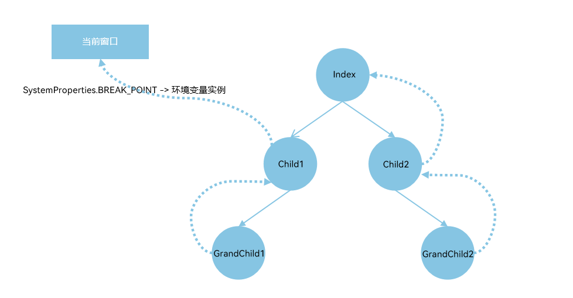
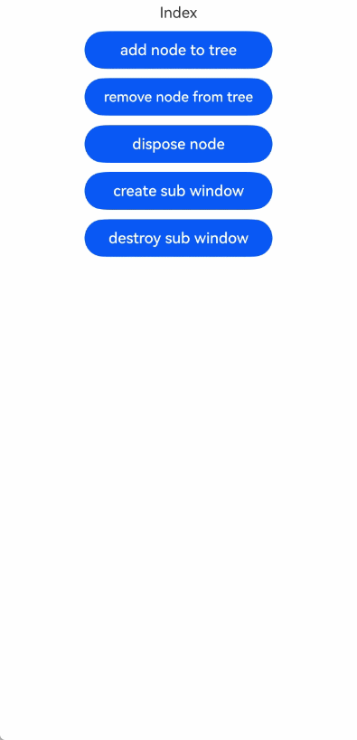
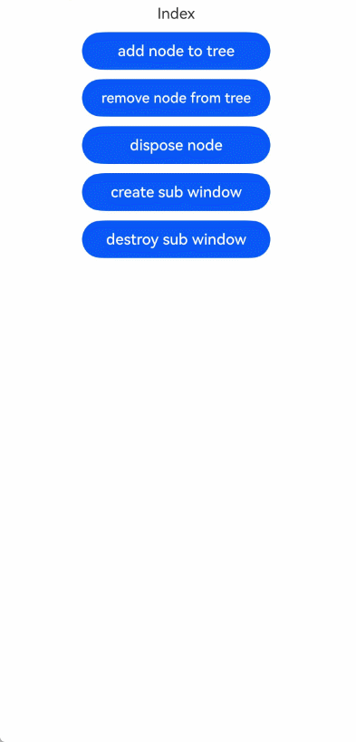

# \@Env：环境变量

在多设备开发的场景中，开发者可以使用\@Env装饰器监听系统环境变量的改变，并根据系统环境变量来进行相应的场景判断，以减少不同设备间的适配逻辑和重复开发。

> **说明：**
>
> 从API version 24开始，\@Env支持在[\@Component](./arkts-static-create-component.md)和[\@ComponentV2](./arkts-static-componentv2.md)中使用。

## 概述

\@Env是响应式系统环境变量装饰器，其功能包括：
- 根据入参读取相应的环境变量信息，详情见[\@Env支持参数](#env支持参数)。目前支持以下几种环境变量：
  - [SystemProperties.BREAK_POINT](../../reference/apis-arkui/arkui-ts/ts-state-management-env-static.md#systemproperties)，用于获取窗口不同宽高阈值下对应的断点值信息。
  - [SystemProperties.WINDOW_SIZE](../../reference/apis-arkui/arkui-ts/ts-state-management-env-static.md#systemproperties)，用于获取窗口的大小信息，单位为vp。
  - [SystemProperties.WINDOW_SIZE_PX](../../reference/apis-arkui/arkui-ts/ts-state-management-env-static.md#systemproperties)，用于获取窗口的大小信息，单位为px。
  - [SystemProperties.WINDOW_AVOID_AREA](../../reference/apis-arkui/arkui-ts/ts-state-management-env-static.md#systemproperties)，用于获取窗口的避让区域信息，单位为vp。
  - [SystemProperties.WINDOW_AVOID_AREA_PX](../../reference/apis-arkui/arkui-ts/ts-state-management-env-static.md#systemproperties)，用于获取窗口的避让区域信息，单位为px。
- 系统环境变量改变时，通知\@Env装饰的变量更新，并触发\@Env关联组件刷新，以实现界面内容的同步更新。
- \@Env装饰的变量不允许开发者初始化。\@Env会返回给开发者可观察的环境变量类的实例。开发者如果想监听环境变量的变化，可以使用[addMonitor](./arkts-static-new-addmonitor-clearmonitor.md)，具体示例见[在\@ComponentV2中使用\@Env](#在componentv2中使用env)。

## \@Env支持参数

@Env支持的参数请参考[SystemProperties枚举类型说明](../../reference/apis-arkui/arkui-ts/ts-state-management-env-static.md#systemproperties)。

## \@Env和Environment能力对比

\@Env和[Environment](./arkts-static-environment.md)都是系统环境变量相关，但两者能力有较大的不同，具体能力对比见下表。

| 能力 | \@Env | Environment |
| ------------------ | ------------------ | ------------------ |
| 起始API version | 从API version 24开始支持。 | 从API version 23开始支持。 |
| 支持参数 | [SystemProperties的枚举值](../../reference/apis-arkui/arkui-ts/ts-state-management-env-static.md#systemproperties) | 支持`languageCode`等参数，详情见[Environment内置参数](./arkts-static-environment.md#environment内置参数)。 |
| 使用形式 | \@Env为装饰器，可声明在\@Component或\@ComponentV2中，获取对应参数的环境变量信息。 | 通过[envProp](../../reference/apis-arkui/arkui-ts/ts-state-management.md#envprop10)等接口获取当前应用的环境变量，并存入[AppStorage](./arkts-static-appstorage.md)中，开发者可通过AppStorage的接口访问系统环境变量的值，具体例子见[从UI中访问Environment参数](./arkts-static-environment.md#从ui中访问environment参数)。 |
| 是否有响应式能力 | 有，当系统环境变量变化时，会通知\@Env装饰的环境变量的改变，并通知\@Env关联组件刷新。 | 无，系统环境变量变化时，不会通知Environment改变。 |

## 限制条件

- \@Env仅支持在\@Component和\@ComponentV2中使用，否则会有编译时报错。如果开发者绕过编译时检查，则会有运行时报错。

  ```ts
  'use static'

  import { Env, Component, Entry, SystemProperties } from '@kit.ArkUI';
  import uiObserver from '@ohos.arkui.observer';

  class Info {
    @Env(SystemProperties.BREAK_POINT) breakpoint: uiObserver.WindowSizeLayoutBreakpointInfo; // 错误用法，编译时报错
  }

  @Entry
  @Component
  struct Index {
    @Env(SystemProperties.BREAK_POINT) breakpoint: uiObserver.WindowSizeLayoutBreakpointInfo; // 正确用法

    build() {
    }
  }
  ```

- \@Env装饰的变量为只读属性，不允许开发者进行初始化或赋值操作，否则会有编译时报错。如果开发者绕过编译时检查，则会有运行时报错。

  ```ts
  'use static'

  import { Env, Component, Entry, SystemProperties, Text, Column, Button } from '@kit.ArkUI';
  import uiObserver from '@ohos.arkui.observer';

  @Entry
  @Component
  struct Index {
    @Env(SystemProperties.BREAK_POINT) breakpoint: uiObserver.WindowSizeLayoutBreakpointInfo =
      new uiObserver.WindowSizeLayoutBreakpointInfo(); // 错误用法，编译时报错

    build() {
      Column() {
        Text(`breakpoint height ${this.breakpoint.heightBreakpoint}`)
          .fontSize(20)
        Text(`breakpoint width ${this.breakpoint.widthBreakpoint}`)
          .fontSize(20)
        Button('change breakpoint')
          .onClick(() => {
            this.breakpoint = new uiObserver.WindowSizeLayoutBreakpointInfo(); // 错误用法，编译时报错
          })
      }
    }
  }
  ```

- \@Env当前支持[SystemProperties的枚举值](../../reference/apis-arkui/arkui-ts/ts-state-management-env-static.md#systemproperties)。若使用不支持的参数，将触发编译时报错。

  ```ts
  'use static'

  import { Env, Component, Entry, SystemProperties, Text } from '@kit.ArkUI';
  import uiObserver from '@ohos.arkui.observer';

  @Entry
  @Component
  struct Index {
    @Env(SystemProperties.BREAK_POINT) breakpoint: uiObserver.WindowSizeLayoutBreakpointInfo; // 正确写法
    @Env('unsupported_key') breakpoint2: uiObserver.WindowSizeLayoutBreakpointInfo; // 错误写法，@Env非法入参，编译时报错。

    build() {
      Text(`breakpoint2 width: ${this.breakpoint2.widthBreakpoint} height: ${this.breakpoint2.heightBreakpoint}`)
    }
  }
  ```

- \@Env使用不同的key值时，装饰的变量类型必须一一对应，否则会有编译时报错。
  - \@Env使用`SystemProperties.BREAK_POINT`时，装饰的变量类型必须为`uiObserver.WindowSizeLayoutBreakpointInfo`类型。
  - \@Env使用`SystemProperties.WINDOW_SIZE`时，装饰的变量类型必须为`window.SizeInVP`类型。
  - \@Env使用`SystemProperties.WINDOW_SIZE_PX`时，装饰的变量类型必须为`window.Size`类型。
  - \@Env使用`SystemProperties.WINDOW_AVOID_AREA`时，装饰的变量类型必须为`window.UIEnvWindowAvoidAreaInfoVP`类型。
  - \@Env使用`SystemProperties.WINDOW_AVOID_AREA_PX`时，装饰的变量类型必须为`window.UIEnvWindowAvoidAreaInfoPX`类型。

  ```ts
  'use static'

  import { Env, Component, Entry, SystemProperties } from '@kit.ArkUI';
  import uiObserver from '@ohos.arkui.observer';

  @Entry
  @Component
  struct Index {
    @Env(SystemProperties.BREAK_POINT) breakpoint: uiObserver.WindowSizeLayoutBreakpointInfo; // 正确写法
    @Env(SystemProperties.BREAK_POINT) breakpoint2: string; // 错误写法，@Env使用SystemProperties.BREAK_POINT时仅支持装饰WindowSizeLayoutBreakpointInfo类型

    build() {
    }
  }
  ```

- \@Env只能单独使用，不能和其他V1V2状态变量装饰器或@Require联用，否则会有编译时报错。

  ```ts
  @Env(SystemProperties.BREAK_POINT) breakpoint1: uiObserver.WindowSizeLayoutBreakpointInfo; // 正确写法
  @State @Env(SystemProperties.BREAK_POINT) breakpoint2: uiObserver.WindowSizeLayoutBreakpointInfo; // 错误写法，编译时报错
  @Require @Env(SystemProperties.BREAK_POINT) breakpoint3: uiObserver.WindowSizeLayoutBreakpointInfo; // 错误写法，编译时报错
  @Local @Env(SystemProperties.BREAK_POINT) breakpoint4: uiObserver.WindowSizeLayoutBreakpointInfo; // 错误写法，编译时报错
  ```

- \@Env装饰的变量在\@Component和\@ComponentV2传递遵循以下规则：
  - \@Env装饰的变量仅能用于初始化\@ComponentV2中@Param装饰的变量，否则会有编译时报错。
  - \@Env装饰的变量仅能用于初始化\@Component中常规变量，否则会有编译时报错。需要注意，通过[BuilderNode](../../reference/apis-arkui/js-apis-arkui-builderNode.md)切换窗口，会导致\@Env依据新的窗口更新环境变量实例。在切换窗口的场景中，不建议开发者使用\@Env变量来初始化子组件的常规变量，否则会造成该常规变量无法被\@Env通知触发其关联UI组件刷新。具体示例可见[通过BuilderNode切换窗口](#通过buildernode切换窗口)。

  ```ts
  'use static'

  import { Env, Entry, Component, ComponentV2, Column, Require, Param, ObjectLink, SystemProperties } from '@kit.ArkUI';
  import uiObserver from '@ohos.arkui.observer';

  @Entry
  @Component
  struct Index {
    @Env(SystemProperties.BREAK_POINT) breakpoint: uiObserver.WindowSizeLayoutBreakpointInfo; // 正确写法

    build() {
      Column() {
        CompV2({ breakpoint: this.breakpoint }) // 正确写法
        Comp({ breakpoint: this.breakpoint }) // 正确写法

        CompV2Invalid({ breakpoint: this.breakpoint }) // 错误写法，@Env装饰的变量仅能初始化V2的@Param变量
        CompInvalid({ breakpoint: this.breakpoint }) // 错误写法，@Env装饰的变量仅能初始化V1的常规变量
      }
    }
  }

  @ComponentV2
  struct CompV2 {
    @Require @Param breakpoint: uiObserver.WindowSizeLayoutBreakpointInfo; // 正确写法

    build() {
    }
  }

  @ComponentV2
  struct CompV2Invalid {
    @Require breakpoint: uiObserver.WindowSizeLayoutBreakpointInfo; // 错误写法

    build() {
    }
  }

  @Component
  struct Comp {
    @Require breakpoint: uiObserver.WindowSizeLayoutBreakpointInfo; // 正确写法

    build() {
    }
  }

  @Component
  struct CompInvalid {
    @ObjectLink breakpoint: uiObserver.WindowSizeLayoutBreakpointInfo; // 错误写法

    build() {
    }
  }
  ```

## \@Env初始化流程

\@Env变量不允许开发者初始化，其值由框架根据当前窗口的环境变量自动提供，\@Env变量在被第一次读值的时候，会触发初始化。\@Env变量初始化遵循以下流程：

1. 从父组件中查找已有实例：
   - 向上递归查找父组件。
   - 如果某个父组件在同一窗口中已经初始化过相同key的\@Env变量，则直接复用该实例。
   - 若未找到，则继续向上查找，直到父组件为空。需要注意，向上查找父组件的流程会被`BuilderNode`打断。
2. 查找当前窗口的\@Env实例。
   - 如果在父组件中未找到对应的实例，则检查当前窗口是否已有相同key的\@Env变量实例。
   - 如存在，则复用该窗口内的\@Env实例。
3. 首次请求：创建新环境变量实例。
   - 若以上两步都无法得到实例，则说明当前窗口第一次读取该环境变量。
   - 框架会创建一个新的可观察环境变量实例并与当前窗口绑定，然后完成初始化。

流程图如下。



基于上面流程，下面的示例中以@Env使用`SystemProperties.BREAK_POINT`为例，各个组件中的初始化如下图。



1. `Child1`初始化`@Env(SystemProperties.BREAK_POINT)`：
   - 递归查找直到父组件为空：向上查找父组件`Index`，没有\@Env对应的`SystemProperties.BREAK_POINT`实例。
   - 查找当前窗口：没有\@Env对应的`SystemProperties.BREAK_POINT`实例。
   - 创建`SystemProperties.BREAK_POINT`对应的可观察的环境变量实例，并和当前窗口绑定。
2. `GrandChild1`初始化`@Env(SystemProperties.BREAK_POINT)`：
   - 递归查找父组件，直到父组件为空：向上查找父组件`Child1`，查找到`Child1`有\@Env对应的`SystemProperties.BREAK_POINT`实例。
   - 复用`Child1`中\@Env对应的`SystemProperties.BREAK_POINT`实例。
3. `GrandChild2`初始化`@Env(SystemProperties.BREAK_POINT)`：
   - 递归查找直到父组件为空：向上查找父组件`Child2`和祖先节点`Index`，均没有\@Env对应的`SystemProperties.BREAK_POINT`实例。
   - 查找当前窗口：有\@Env对应的`SystemProperties.BREAK_POINT`实例。
   - 复用窗口中`SystemProperties.BREAK_POINT`对应的环境变量实例。

```ts
'use static'

import {
  Env,
  Entry,
  Component,
  ComponentV2,
  Column,
  Require,
  Param,
  ObjectLink,
  SystemProperties,
  Text
} from '@kit.ArkUI';
import uiObserver from '@ohos.arkui.observer';

@Entry
@Component
struct Index {
  build() {
    Column() {
      Text(`Index`)
      Child1()
      Child2()
    }
    .height('100%')
    .width('100%')
  }
}

@Component
struct Child1 {
  // 父组件Index不存在对应的@Env实例，在此处创建。
  @Env(SystemProperties.BREAK_POINT) breakpoint: uiObserver.WindowSizeLayoutBreakpointInfo;

  build() {
    Column() {
      // 打印当前窗口宽度所在的布局断点枚举值
      Text(`Child1 breakpoint width: ${this.breakpoint.widthBreakpoint}`)
        .fontSize(20)
      // 打印当前窗口高度所在的布局断点枚举值
      Text(`Child1 breakpoint height: ${this.breakpoint.heightBreakpoint}`)
        .fontSize(20)
      GrandChild1()
    }
  }
}

@Component
struct Child2 {
  build() {
    Column() {
      GrandChild2()
    }
  }
}

@Component
struct GrandChild1 {
  // 复用Child1组件中对应的@Env实例。
  @Env(SystemProperties.BREAK_POINT) breakpoint: uiObserver.WindowSizeLayoutBreakpointInfo;

  build() {
    Column() {
      // 打印当前窗口宽度所在的布局断点枚举值
      Text(`GrandChild1 breakpoint width: ${this.breakpoint.widthBreakpoint}`)
        .fontSize(20)
      // 打印当前窗口高度所在的布局断点枚举值
      Text(`GrandChild1 breakpoint height: ${this.breakpoint.heightBreakpoint}`)
        .fontSize(20)
    }
  }
}

@Component
struct GrandChild2 {
  // Index与Child2组件均不存在对应的@Env实例，故在此处创建。
  @Env(SystemProperties.BREAK_POINT) breakpoint: uiObserver.WindowSizeLayoutBreakpointInfo;

  build() {
    Column() {
      // 打印当前窗口宽度所在的布局断点枚举值
      Text(`GrandChild2 breakpoint width: ${this.breakpoint.widthBreakpoint}`)
        .fontSize(20)
      // 打印当前窗口高度所在的布局断点枚举值
      Text(`GrandChild2 breakpoint height: ${this.breakpoint.heightBreakpoint}`)
        .fontSize(20)
    }
  }
}
```

## 使用场景

### 在\@ComponentV2中使用\@Env

下面的例子中：
- 在\@ComponentV2中声明\@Env，获取当前\@ComponentV2组件创建时所在窗口尺寸的布局断点信息，并用[addMonitor](./arkts-static-new-addmonitor-clearmonitor.md)监听`this.breakpoint`的属性的变化。
- 在\@ComponentV2中声明\@Env，获取当前\@ComponentV2组件创建时所在窗口的大小信息，单位为vp，并用[addMonitor](./arkts-static-new-addmonitor-clearmonitor.md)监听`this.sizeInVP`的属性的变化。
- 在\@ComponentV2中声明\@Env，获取当前\@ComponentV2组件创建时所在窗口的大小信息，单位为px，并用[addMonitor](./arkts-static-new-addmonitor-clearmonitor.md)监听`this.sizeInPX`的属性的变化。
- 将\@Env装饰的变量传递给`CompV2`中[\@Param](./arkts-static-new-param.md)装饰的变量和`Comp`中的常规变量。
- 点击`Button('Landscape')`和`Button('Portrait')`切换横竖屏，`Index`、`CompV2`和`Comp`关联组件进行对应的刷新，`orientationChange`被触发监听回调。

```ts
'use static'

import {
  Env,
  Entry,
  Component,
  ComponentV2,
  Column,
  Require,
  Param,
  ObjectLink,
  SystemProperties,
  Text,
  UIUtils,
  IMonitor,
  Button,
  IMonitorDecoratedVariable
} from '@kit.ArkUI';
import uiObserver from '@ohos.arkui.observer';
import window from '@ohos.window';
import { common } from '@kit.AbilityKit';

@Entry
@ComponentV2
struct Index {
  @Env(SystemProperties.BREAK_POINT) breakpoint: uiObserver.WindowSizeLayoutBreakpointInfo;
  @Env(SystemProperties.WINDOW_SIZE) sizeInVP: window.SizeInVP;
  @Env(SystemProperties.WINDOW_SIZE_PX) sizeInPX: window.Size;
  valueMonitor?: IMonitorDecoratedVariable;

  orientationChange(mon: IMonitor) {
    // 当前窗口宽、高度对应的布局断点信息变化时，触发该回调将变化前后值打印。
    mon.dirty.forEach((path: string) => {
      console.info(`[Env] ${path} changes from ${mon.value<Any>(path)?.before} to ${mon.value<Any>(path)?.now}`);
    })
  }

  aboutToAppear(): void {
    // @Env装饰变量的属性的改变可以通过addMonitor监听
    const callBackArray: Array<() => Any> = [];
    callBackArray.push(() => this.breakpoint.widthBreakpoint);
    callBackArray.push(() => this.breakpoint.heightBreakpoint);
    this.valueMonitor = UIUtils.addMonitor(callBackArray, this.orientationChange);
  }

  private changeOrientation(isLandscape: boolean) {
    // 页面横竖屏切换
    const context = this.getUIContext()?.getHostContext() as common.UIAbilityContext;
    window.getLastWindow(context).then((lastWindow) => {
      lastWindow.setPreferredOrientation(isLandscape ? window.Orientation.LANDSCAPE : window.Orientation.PORTRAIT);
    });
  }

  build() {
    Column() {
      // 打印当前窗口宽度所在的布局断点枚举值
      Text(`Index breakpoint width: ${this.breakpoint.widthBreakpoint}`)
        .fontSize(20)
      // 打印当前窗口高度所在的布局断点枚举值
      Text(`Index breakpoint height: ${this.breakpoint.heightBreakpoint}`)
        .fontSize(20)
      // 打印当前窗口宽度（单位vp）
      Text(`Index sizeInVP width: ${this.sizeInVP.width}`)
        .fontSize(20)
      // 打印当前窗口高度（单位vp）
      Text(`Index sizeInVP height: ${this.sizeInVP.height}`)
        .fontSize(20)
      // 打印当前窗口宽度（单位px）
      Text(`Index sizeInPX width: ${this.sizeInPX.width}`)
        .fontSize(20)
      // 打印当前窗口高度（单位px）
      Text(`Index sizeInPX height: ${this.sizeInPX.height}`)
        .fontSize(20)

      Button('Landscape')
        .onClick(() => {
          this.changeOrientation(true);
        })

      Button('Portrait')
        .onClick(() => {
          this.changeOrientation(false);
        })

      CompV2({ breakpoint: this.breakpoint, sizeInVP: this.sizeInVP, sizeInPX: this.sizeInPX })
      Comp({ breakpoint: this.breakpoint, sizeInVP: this.sizeInVP, sizeInPX: this.sizeInPX })
    }
  }
}

@ComponentV2
struct CompV2 {
  @Require @Param breakpoint: uiObserver.WindowSizeLayoutBreakpointInfo;
  @Require @Param sizeInVP: window.SizeInVP;
  @Require @Param sizeInPX: window.Size;

  build() {
    Column() {
      // 打印当前窗口宽度所在的布局断点枚举值
      Text(`CompV2 breakpoint width: ${this.breakpoint.widthBreakpoint}`)
        .fontSize(20)
      // 打印当前窗口高度所在的布局断点枚举值
      Text(`CompV2 breakpoint height: ${this.breakpoint.heightBreakpoint}`)
        .fontSize(20)
      // 打印当前窗口宽度（单位vp）
      Text(`CompV2 sizeInVP width: ${this.sizeInVP.width}`)
        .fontSize(20)
      // 打印当前窗口高度（单位vp）
      Text(`CompV2 sizeInVP height: ${this.sizeInVP.height}`)
        .fontSize(20)
      // 打印当前窗口宽度（单位px）
      Text(`CompV2 sizeInPX width: ${this.sizeInPX.width}`)
        .fontSize(20)
      // 打印当前窗口高度（单位px）
      Text(`CompV2 sizeInPX height: ${this.sizeInPX.height}`)
        .fontSize(20)
    }
  }
}

@Component
struct Comp {
  @Require breakpoint: uiObserver.WindowSizeLayoutBreakpointInfo;
  @Require sizeInVP: window.SizeInVP;
  @Require sizeInPX: window.Size;

  build() {
    Column() {
      // 打印当前窗口宽度所在的布局断点枚举值
      Text(`Comp breakpoint width: ${this.breakpoint.widthBreakpoint}`)
        .fontSize(20)
      // 打印当前窗口高度所在的布局断点枚举值
      Text(`Comp breakpoint height: ${this.breakpoint.heightBreakpoint}`)
        .fontSize(20)
      // 打印当前窗口宽度（单位vp）
      Text(`Comp sizeInVP width: ${this.sizeInVP.width}`)
        .fontSize(20)
      // 打印当前窗口高度（单位vp）
      Text(`Comp sizeInVP height: ${this.sizeInVP.height}`)
        .fontSize(20)
      // 打印当前窗口宽度（单位px）
      Text(`Comp sizeInPX width: ${this.sizeInPX.width}`)
        .fontSize(20)
      // 打印当前窗口高度（单位px）
      Text(`Comp sizeInPX height: ${this.sizeInPX.height}`)
        .fontSize(20)
    }
  }
}
```

### 在\@Component中使用\@Env

\@Env在\@Component中使用和其在\@ComponentV2中使用类似，示例如下。

```ts
'use static'

import {
  Env,
  Entry,
  Component,
  ComponentV2,
  Column,
  Require,
  Param,
  ObjectLink,
  SystemProperties,
  Text,
  UIUtils,
  IMonitor,
  Button,
  IMonitorDecoratedVariable
} from '@kit.ArkUI';
import uiObserver from '@ohos.arkui.observer';
import window from '@ohos.window';
import { common } from '@kit.AbilityKit';

@Entry
@Component
struct Index {
  @Env(SystemProperties.BREAK_POINT) breakpoint: uiObserver.WindowSizeLayoutBreakpointInfo;
  @Env(SystemProperties.WINDOW_SIZE) sizeInVP: window.SizeInVP;
  @Env(SystemProperties.WINDOW_SIZE_PX) sizeInPX: window.Size;
  valueMonitor?: IMonitorDecoratedVariable;

  orientationChange(mon: IMonitor) {
    // 当前窗口宽、高度对应的布局断点信息变化时，触发该回调将变化前后值打印。
    mon.dirty.forEach((path: string) => {
      console.info(`[Env] ${path} changes from ${mon.value<Any>(path)?.before} to ${mon.value<Any>(path)?.now}`);
    })
  }

  aboutToAppear(): void {
    // @Env装饰变量的属性的改变可以通过addMonitor监听
    const callBackArray: Array<() => Any> = [];
    callBackArray.push(() => this.breakpoint.widthBreakpoint);
    callBackArray.push(() => this.breakpoint.heightBreakpoint);
    this.valueMonitor = UIUtils.addMonitor(callBackArray, this.orientationChange)
  }

  private changeOrientation(isLandscape: boolean) {
    // 页面横竖屏切换
    const context = this.getUIContext()?.getHostContext() as common.UIAbilityContext;
    window.getLastWindow(context).then((lastWindow) => {
      lastWindow.setPreferredOrientation(isLandscape ? window.Orientation.LANDSCAPE : window.Orientation.PORTRAIT);
    });
  }

  build() {
    Column() {
      // 打印当前窗口宽度所在的布局断点枚举值
      Text(`Index breakpoint width: ${this.breakpoint.widthBreakpoint}`)
        .fontSize(20)
      // 打印当前窗口高度所在的布局断点枚举值
      Text(`Index breakpoint height: ${this.breakpoint.heightBreakpoint}`)
        .fontSize(20)
      // 打印当前窗口宽度（单位vp）
      Text(`Index sizeInVP width: ${this.sizeInVP.width}`)
        .fontSize(20)
      // 打印当前窗口高度（单位vp）
      Text(`Index sizeInVP height: ${this.sizeInVP.height}`)
        .fontSize(20)
      // 打印当前窗口宽度（单位px）
      Text(`Index sizeInPX width: ${this.sizeInPX.width}`)
        .fontSize(20)
      // 打印当前窗口高度（单位px）
      Text(`Index sizeInPX height: ${this.sizeInPX.height}`)
        .fontSize(20)

      Button('Landscape')
        .onClick(() => {
          this.changeOrientation(true);
        })

      Button('Portrait')
        .onClick(() => {
          this.changeOrientation(false);
        })

      CompV2({ breakpoint: this.breakpoint, sizeInVP: this.sizeInVP, sizeInPX: this.sizeInPX })
      Comp({ breakpoint: this.breakpoint, sizeInVP: this.sizeInVP, sizeInPX: this.sizeInPX })
    }
  }
}

@ComponentV2
struct CompV2 {
  @Require @Param breakpoint: uiObserver.WindowSizeLayoutBreakpointInfo;
  @Require @Param sizeInVP: window.SizeInVP;
  @Require @Param sizeInPX: window.Size;

  build() {
    Column() {
      // 打印当前窗口宽度所在的布局断点枚举值
      Text(`CompV2 breakpoint width: ${this.breakpoint.widthBreakpoint}`)
        .fontSize(20)
      // 打印当前窗口高度所在的布局断点枚举值
      Text(`CompV2 breakpoint height: ${this.breakpoint.heightBreakpoint}`)
        .fontSize(20)
      // 打印当前窗口宽度（单位vp）
      Text(`CompV2 sizeInVP width: ${this.sizeInVP.width}`)
        .fontSize(20)
      // 打印当前窗口高度（单位vp）
      Text(`CompV2 sizeInVP height: ${this.sizeInVP.height}`)
        .fontSize(20)
      // 打印当前窗口宽度（单位px）
      Text(`CompV2 sizeInPX width: ${this.sizeInPX.width}`)
        .fontSize(20)
      // 打印当前窗口高度（单位px）
      Text(`CompV2 sizeInPX height: ${this.sizeInPX.height}`)
        .fontSize(20)
    }
  }
}

@Component
struct Comp {
  @Require breakpoint: uiObserver.WindowSizeLayoutBreakpointInfo;
  @Require sizeInVP: window.SizeInVP;
  @Require sizeInPX: window.Size;

  build() {
    Column() {
      // 打印当前窗口宽度所在的布局断点枚举值
      Text(`Comp breakpoint width: ${this.breakpoint.widthBreakpoint}`)
        .fontSize(20)
      // 打印当前窗口高度所在的布局断点枚举值
      Text(`Comp breakpoint height: ${this.breakpoint.heightBreakpoint}`)
        .fontSize(20)
      // 打印当前窗口宽度（单位vp）
      Text(`Comp sizeInVP width: ${this.sizeInVP.width}`)
        .fontSize(20)
      // 打印当前窗口高度（单位vp）
      Text(`Comp sizeInVP height: ${this.sizeInVP.height}`)
        .fontSize(20)
      // 打印当前窗口宽度（单位px）
      Text(`Comp sizeInPX width: ${this.sizeInPX.width}`)
        .fontSize(20)
      // 打印当前窗口高度（单位px）
      Text(`Comp sizeInPX height: ${this.sizeInPX.height}`)
        .fontSize(20)
    }
  }
}
```

### 通过BuilderNode切换窗口 
\@Env用于展示\@Component/\@ComponentV2所在[窗口](../../reference/apis-arkui/arkts-apis-window-Window.md)的环境变量信息。开发者通过BuilderNode切换@Component/\@ComponentV2所在的窗口实例时，\@Env会根据新的窗口获取对应的环境变量信息，并触发关联的UI组件刷新。以`SystemProperties.BREAK_POINT`为例。

在下面的示例中：
1. 点击```Button('add node to tree')```，创建BuilderNode节点挂载到`NodeContainer`下。
2. 点击```Button('remove node from tree')```，将BuilderNode节点从`NodeContainer`上移除。
3. 点击```Button(`create sub window`)```，创建子窗并显示`SubWindow`窗口。
4. 点击`SubWindow`窗口内的```Button('add node to tree')```，将BuilderNode节点重新挂载到`SubWindow`内的`NodeContainer`下。
   - `ComponentUnderBuilderNode`在被挂载到新的窗口下时，会触发\@Env重新获取新的环境变量。
   - \@Env重新获取新的环境变量后，触发其关联组件的刷新。其中`ComponentUnderBuilderNode`中`@Env(SystemProperties.BREAK_POINT) breakpoint: uiObserver.WindowSizeLayoutBreakpointInfo`会通知`CompV2`内的`@Param breakpoint`刷新，但是并不会通知`Comp`内的常规变量`breakpoint`触发UI刷新。所以在切换窗口，\@Env重新获取环境变量的场景下，建议开发者不要将\@Env传递给常规变量，以避免常规变量不能被通知UI刷新的问题。

下面的示例包含了创建子窗的流程，具体可参考[管理应用窗口（Stage模型）](../../windowmanager/application-window-stage.md)。

```ts
'use static'

// EntryAbility.ets
import UIAbility from '@ohos.app.ability.UIAbility';
import AbilityConstant from '@ohos.app.ability.AbilityConstant';
import Want from '@ohos.app.ability.Want';
import window from '@ohos.window';
import hilog from '@ohos.hilog';
import { AppStorage } from '@kit.ArkUI';
import { BusinessError } from '@ohos.base';

class EntryAbility extends UIAbility {
  onCreate(want: Want, launchParam: AbilityConstant.LaunchParam): void {
    hilog.info(0x0000, 'testTag', 'EntryAbility onCreate');
  }

  onWindowStageCreate(windowStage: window.WindowStage): void {
    hilog.info(0x0000, 'testTag', 'EntryAbility onWindowStageCreate');
    try {
      windowStage.loadContent('pages/Index', (err: BusinessError<void> | null): void => {
        hilog.info(0x0000, 'testTag', 'loadContent entering');
        if (err && err.code) {
          hilog.error(0x0000, 'testTag', 'loadContent error');
          return;
        }
        hilog.info(0x0000, 'testTag', 'loadContent ok');
        // 在AppStorage中创建windowStage变量
        AppStorage.setOrCreate<window.WindowStage>('windowStage', windowStage);
      });
    } catch (e: Error) {
      hilog.info(0x0000, 'testTag', 'loadContent catch error: -----------' + e.message);
    }
  }
}
```

```ts
'use static'

// Index.ets
import {
  Entry,
  Text,
  Column,
  Component,
  Button,
  ClickEvent,
  ComponentV2,
  NodeContainer,
  State,
  Env,
  IMonitor,
  Require,
  Param,
  SystemProperties,
  AppStorage,
  wrapBuilder,
  ColumnOptions
} from '@kit.ArkUI';
import window from '@ohos.window';
import hilog from '@ohos.hilog';
import uiObserver from '@ohos.arkui.observer';
import { common } from '@kit.AbilityKit';
import { BusinessError } from '@kit.BasicServicesKit';
import { UIContext } from '@ohos.arkui.UIContext';
import { BuilderNode, FrameNode, NodeController } from '@ohos.arkui.node';

const DOMAIN = 0x0000;

let windowStage_: window.WindowStage | undefined = undefined;
let sub_windowClass: window.Window | undefined = undefined;
let globalBuilderNode: BuilderNode<ParamsInt> | undefined = undefined;

// BuilderNode的参数类，用于传递构建参数
class ParamsInt {
  text: int = 0;

  constructor(text: int) {
    this.text = text;
  }
}

// 自定义NodeController类，用于控制节点容器的行为
export class MyNodeController extends NodeController {
  private rootNode: FrameNode | null = null;
  private uiContext: UIContext | null = null;

  makeNode(uiContext: UIContext): FrameNode | null {
    // 根据uiContext创建FrameNode
    this.rootNode = new FrameNode(uiContext);
    this.uiContext = uiContext;
    return this.rootNode;
  }

  // 如果globalBuilderNode尚未创建，则创建一个新的BuilderNode
  // 然后将BuilderNode的FrameNode添加到根节点的子节点中
  addBuilderNode(): void {
    if (!globalBuilderNode && this.uiContext) {
      // 创建参数对象
      let num: int = 0;
      let params: ParamsInt = new ParamsInt(num);
      // 创建新的BuilderNode实例
      globalBuilderNode = new BuilderNode<ParamsInt>(this.uiContext!);
      // 使用wrapBuilder包装buildComponent函数，构建组件并传入参数
      globalBuilderNode!.build(wrapBuilder(buildComponent), params);
    }
    // 如果根节点和globalBuilderNode都存在，将globalBuilderNode添加到根节点
    if (this.rootNode && globalBuilderNode) {
      this.rootNode!.appendChild(globalBuilderNode!.getFrameNode()!);
    }
  }

  // 将globalBuilderNode的FrameNode从根节点的子节点中移除
  removeBuilderNode(): void {
    if (this.rootNode && globalBuilderNode) {
      // 从根节点移除globalBuilderNode的FrameNode
      this.rootNode!.removeChild(globalBuilderNode!.getFrameNode()!);
    }
  }

  // 释放BuilderNode占用的资源，并将globalBuilderNode重置为undefined
  disposeNode(): void {
    if (this.rootNode && globalBuilderNode) {
      // 调用dispose方法释放BuilderNode的资源
      globalBuilderNode!.dispose();
      // 将globalBuilderNode重置为undefined，标记为已销毁
      globalBuilderNode = undefined;
    }
  }
}

@Builder
function buildComponent(params: ParamsInt) {
  Column() {
    ComponentUnderBuilderNode()
  }
}

@Entry
@ComponentV2
struct Index {
  // 创建MyNodeController实例，用于控制NodeContainer中的节点
  private nodeController: MyNodeController = new MyNodeController();

  private createSubWindow() {
    // 从AppStorage中获取windowStage实例
    const windowStage_: window.WindowStage | undefined = AppStorage.get<window.WindowStage>('windowStage');
    if (windowStage_ === undefined) {
      // 如果windowStage不存在，打印错误日志
      hilog.error(DOMAIN, 'testTag', 'Failed to create the subwindow. Cause: windowStage_ is null');
    } else {
      // windowStage存在，调用createSubWindow方法创建子窗口
      windowStage_!.createSubWindow('mySubWindow').then((data: window.Window | undefined): void => {
        sub_windowClass = data;
        // 检查子窗口是否创建成功
        if (!sub_windowClass) {
          hilog.error(DOMAIN, 'testTag', 'sub_windowClass is undefined');
          return;
        }
        // 子窗口创建成功，打印成功日志和窗口数据
        hilog.info(DOMAIN, 'testTag', 'Succeeded in creating the subwindow. Data: ' + JSON.stringify(data));
        try {
          // 移动子窗口到指定位置
          sub_windowClass!.moveWindowTo(200, 1300);
          // 调整子窗口大小
          sub_windowClass!.resize(900, 1800);
        } catch (err: Error) {
          // 如果移动或调整窗口大小失败，打印错误日志
          hilog.error(DOMAIN, 'testTag', 'Failed to move or change the window. Cause:' + JSON.stringify(err));
        }
        // 子窗口加载对应的目标页面
        sub_windowClass!.setUIContent('pages/SubWindow', (err: BusinessError<void> | null): void => {
          // 检查加载页面是否成功
          if (err?.code) {
            hilog.error(DOMAIN, 'testTag', 'Failed to load the content. Cause:' + JSON.stringify(err));
            return;
          }
          // 页面加载成功，打印成功日志
          hilog.info(DOMAIN, 'testTag', 'Succeeded in loading the content.');
          // 显示子窗口
          sub_windowClass!.showWindow((err: BusinessError<void> | null): void => {
            // 检查显示子窗口是否成功
            if (err?.code) {
              hilog.error(DOMAIN, 'testTag', 'Failed to show the window. Cause: ' + JSON.stringify(err));
              return;
            }
            // 子窗口显示成功，打印成功日志
            hilog.info(DOMAIN, 'testTag', 'Succeeded in showing the window.');
          })
        })
      })
    }
  }

  private destroySubWindow() {
    // 检查子窗口实例是否存在
    if (!sub_windowClass) {
      hilog.error(DOMAIN, 'testTag', 'sub_windowClass is undefined');
      return;
    }
    // 调用destroyWindow方法销毁子窗口
    sub_windowClass!.destroyWindow((err: BusinessError<void>): void => {
      // 检查销毁是否成功
      let errCode: number = err.code;
      if (errCode) {
        hilog.error(DOMAIN, 'testTag', 'Failed to destroy the window. Cause: ' + JSON.stringify(err));
        return;
      }
      // 窗口销毁成功，打印成功日志
      hilog.info(DOMAIN, 'testTag', 'Succeeded in destroying the window.');
    });
  }

  build() {
    Column({ space: 10 } as ColumnOptions) {
      Text(`Index`)
      // 第一步：创建globalBuilderNode，并将globalBuilderNode下的节点挂在NodeContainer的占位节点下
      Button('add node to tree').width(200)
        .onClick((e: ClickEvent) => {
          this.nodeController.addBuilderNode();
        })
      // 第二步：从NodeContainer的占位节点下移除globalBuilderNode下的节点
      Button('remove node from tree').width(200)
        .onClick((e: ClickEvent) => {
          this.nodeController.removeBuilderNode();
        })
      // 销毁globalBuilderNode下的节点
      Button('dispose node').width(200)
        .onClick((e: ClickEvent) => {
          this.nodeController.disposeNode();
        })
      // 第三步：创建子窗
      Button(`create sub window`).width(200)
        .onClick((e: ClickEvent) => {
          this.createSubWindow();
        })
      // 销毁子窗
      Button(`destroy sub window`).width(200)
        .onClick((e: ClickEvent) => {
          this.destroySubWindow();
        })
      NodeContainer(this.nodeController).backgroundColor('#FFEEF0')
    }
    .width('100%')
    .height('100%')
  }
}

@Component
struct ComponentUnderBuilderNode {
  // 使用@Env装饰器监听窗口的断点信息
  @Env(SystemProperties.BREAK_POINT) breakpoint: uiObserver.WindowSizeLayoutBreakpointInfo;

  build() {
    Column() {
      // 打印当前窗口宽度所在的布局断点枚举值
      Text(`ComponentUnderBuilderNode breakpoint width: ${this.breakpoint.widthBreakpoint}`)
      // 打印当前窗口高度所在的布局断点枚举值
      Text(`ComponentUnderBuilderNode breakpoint height: ${this.breakpoint.heightBreakpoint}`)

      CompV2({ breakpoint: this.breakpoint })
      Comp({ breakpoint: this.breakpoint })
    }
  }
}

@ComponentV2
struct CompV2 {
  @Require @Param breakpoint: uiObserver.WindowSizeLayoutBreakpointInfo;

  build() {
    Column() {
      // 打印当前窗口宽度所在的布局断点枚举值
      Text(`CompV2 breakpoint width: ${this.breakpoint.widthBreakpoint}`)
      // 打印当前窗口高度所在的布局断点枚举值
      Text(`CompV2 breakpoint height: ${this.breakpoint.heightBreakpoint}`)
    }
  }
}

@Component
struct Comp {
  // 仅使用@Require装饰器，不能响应父组件@Env变量的改值
  @Require breakpoint: uiObserver.WindowSizeLayoutBreakpointInfo;

  build() {
    Column() {
      // 打印首次传递进来的宽度断点信息
      Text(`Comp breakpoint width: ${this.breakpoint.widthBreakpoint}`)
      // 打印首次传递进来的高度断点信息
      Text(`Comp breakpoint height: ${this.breakpoint.heightBreakpoint}`)
    }
  }
}
```

```ts
'use static'

// SubWindow.ets
import { MyNodeController } from './Index';
import { Entry, Text, Column, Component, Button, ClickEvent, NodeContainer, ColumnOptions } from '@kit.ArkUI';
import { common } from '@kit.AbilityKit';
import window from '@ohos.window';

@Entry
@Component
struct SubWindow {
  private nodeController: MyNodeController = new MyNodeController();

  build() {
    Column({ space: 10 } as ColumnOptions) {
      Text(`SubWindow`)
      // 第四步：在第一步中已在创建globalBuilderNode。将globalBuilderNode下的节点挂子窗的NodeContainer的占位节点下
      Button('add node to tree').width(200)
        .onClick((e: ClickEvent) => {
          this.nodeController.addBuilderNode();
        })
      // 从子窗口的NodeContainer的占位节点下移除globalBuilderNode下的节点
      Button('remove node from tree').width(200)
        .onClick((e: ClickEvent) => {
          this.nodeController.removeBuilderNode();
        })
      // 销毁globalBuilderNode下的节点
      Button('dispose node').width(200)
        .onClick((e: ClickEvent) => {
          this.nodeController.disposeNode();
        })
      NodeContainer(this.nodeController).backgroundColor('#FFEEF0')
    }
    .height('100%')
    .width('100%')
    .backgroundColor('#0D9FFB')
  }
}
```

运行效果图如下。



可以使用lambda闭包函数将`ComponentUnderBuilderNode`中的\@Env向下传递。通过这种方式`ComponentUnderBuilderNode`中的\@Env可以收集到子组件`Comp`内组件的依赖，在切换窗口实例的时候触发`Comp`内组件的刷新。

这种方法的优点：
- @Env装饰的变量通过lambda闭包函数传递给子组件
- 子组件在build方法中调用闭包函数获取@Env的值
- 这样@Env可以收集到子组件对环境变量的依赖
- 当窗口切换时，@Env会通知所有依赖它的子组件进行刷新

具体示例如下。

```ts
'use static'

// Index.ets
import {
  Entry,
  Text,
  Column,
  Component,
  Button,
  ClickEvent,
  ComponentV2,
  NodeContainer,
  State,
  Env,
  IMonitor,
  Require,
  Param,
  SystemProperties,
  AppStorage,
  wrapBuilder,
  ColumnOptions
} from '@kit.ArkUI';
import window from '@ohos.window';
import hilog from '@ohos.hilog';
import uiObserver from '@ohos.arkui.observer';
import { common } from '@kit.AbilityKit';
import { BusinessError } from '@kit.BasicServicesKit';
import { UIContext } from '@ohos.arkui.UIContext';
import { BuilderNode, FrameNode, NodeController } from '@ohos.arkui.node';

const DOMAIN = 0x0000;

let windowStage_: window.WindowStage | undefined = undefined;
let sub_windowClass: window.Window | undefined = undefined;
let globalBuilderNode: BuilderNode<ParamsInt> | undefined = undefined;

// BuilderNode的参数类，用于传递构建参数
class ParamsInt {
  text: int = 0;

  constructor(text: int) {
    this.text = text;
  }
}

// 自定义NodeController类，用于控制节点容器的行为
export class MyNodeController extends NodeController {
  private rootNode: FrameNode | null = null;
  private uiContext: UIContext | null = null;

  makeNode(uiContext: UIContext): FrameNode | null {
    // 根据uiContext创建FrameNode
    this.rootNode = new FrameNode(uiContext);
    this.uiContext = uiContext;
    return this.rootNode;
  }

  // 如果globalBuilderNode尚未创建，则创建一个新的BuilderNode
  // 然后将BuilderNode的FrameNode添加到根节点的子节点中
  addBuilderNode(): void {
    if (!globalBuilderNode && this.uiContext) {
      // 创建参数对象
      let num: int = 0;
      let params: ParamsInt = new ParamsInt(num);
      // 创建新的BuilderNode实例
      globalBuilderNode = new BuilderNode<ParamsInt>(this.uiContext!);
      // 使用wrapBuilder包装buildComponent函数，构建组件并传入参数
      globalBuilderNode!.build(wrapBuilder(buildComponent), params);
    }
    // 如果根节点和globalBuilderNode都存在，将globalBuilderNode添加到根节点
    if (this.rootNode && globalBuilderNode) {
      this.rootNode!.appendChild(globalBuilderNode!.getFrameNode()!);
    }
  }

  // 将globalBuilderNode的FrameNode从根节点的子节点中移除
  removeBuilderNode(): void {
    if (this.rootNode && globalBuilderNode) {
      // 从根节点移除globalBuilderNode的FrameNode
      this.rootNode!.removeChild(globalBuilderNode!.getFrameNode()!);
    }
  }

  // 释放BuilderNode占用的资源，并将globalBuilderNode重置为undefined
  disposeNode(): void {
    if (this.rootNode && globalBuilderNode) {
      // 调用dispose方法释放BuilderNode的资源
      globalBuilderNode!.dispose();
      // 将globalBuilderNode重置为undefined，标记为已销毁
      globalBuilderNode = undefined;
    }
  }
}

@Builder
function buildComponent(params: ParamsInt) {
  Column() {
    ComponentUnderBuilderNode()
  }
}

@Entry
@ComponentV2
struct Index {
  // 创建MyNodeController实例，用于控制NodeContainer中的节点
  private nodeController: MyNodeController = new MyNodeController();

  private createSubWindow() {
    // 从AppStorage中获取windowStage实例
    const windowStage_: window.WindowStage | undefined = AppStorage.get<window.WindowStage>('windowStage');
    if (windowStage_ === undefined) {
      // 如果windowStage不存在，打印错误日志
      hilog.error(DOMAIN, 'testTag', 'Failed to create the subwindow. Cause: windowStage_ is null');
    } else {
      // windowStage存在，调用createSubWindow方法创建子窗口
      windowStage_!.createSubWindow('mySubWindow').then((data: window.Window | undefined): void => {
        sub_windowClass = data;
        // 检查子窗口是否创建成功
        if (!sub_windowClass) {
          hilog.error(DOMAIN, 'testTag', 'sub_windowClass is undefined');
          return;
        }
        // 子窗口创建成功，打印成功日志和窗口数据
        hilog.info(DOMAIN, 'testTag', 'Succeeded in creating the subwindow. Data: ' + JSON.stringify(data));
        try {
          // 移动子窗口到指定位置
          sub_windowClass!.moveWindowTo(200, 1300);
          // 调整子窗口大小
          sub_windowClass!.resize(900, 1800);
        } catch (err: Error) {
          // 如果移动或调整窗口大小失败，打印错误日志
          hilog.error(DOMAIN, 'testTag', 'Failed to move or change the window. Cause:' + JSON.stringify(err));
        }
        // 子窗口加载对应的目标页面
        sub_windowClass!.setUIContent('pages/SubWindow', (err: BusinessError<void> | null): void => {
          // 检查加载页面是否成功
          if (err?.code) {
            hilog.error(DOMAIN, 'testTag', 'Failed to load the content. Cause:' + JSON.stringify(err));
            return;
          }
          // 页面加载成功，打印成功日志
          hilog.info(DOMAIN, 'testTag', 'Succeeded in loading the content.');
          // 显示子窗口
          sub_windowClass!.showWindow((err: BusinessError<void> | null): void => {
            // 检查显示子窗口是否成功
            if (err?.code) {
              hilog.error(DOMAIN, 'testTag', 'Failed to show the window. Cause: ' + JSON.stringify(err));
              return;
            }
            // 子窗口显示成功，打印成功日志
            hilog.info(DOMAIN, 'testTag', 'Succeeded in showing the window.');
          })
        })
      })
    }
  }

  private destroySubWindow() {
    // 检查子窗口实例是否存在
    if (!sub_windowClass) {
      hilog.error(DOMAIN, 'testTag', 'sub_windowClass is undefined');
      return;
    }
    // 调用destroyWindow方法销毁子窗口
    sub_windowClass!.destroyWindow((err: BusinessError<void>): void => {
      // 检查销毁是否成功
      let errCode: number = err.code;
      if (errCode) {
        hilog.error(DOMAIN, 'testTag', 'Failed to destroy the window. Cause: ' + JSON.stringify(err));
        return;
      }
      // 窗口销毁成功，打印成功日志
      hilog.info(DOMAIN, 'testTag', 'Succeeded in destroying the window.');
    });
  }

  build() {
    Column({ space: 10 } as ColumnOptions) {
      Text(`Index`)
      // 第一步：创建globalBuilderNode，并将globalBuilderNode下的节点挂在NodeContainer的占位节点下
      Button('add node to tree').width(200)
        .onClick((e: ClickEvent) => {
          this.nodeController.addBuilderNode();
        })
      // 第二步：从NodeContainer的占位节点下移除globalBuilderNode下的节点
      Button('remove node from tree').width(200)
        .onClick((e: ClickEvent) => {
          this.nodeController.removeBuilderNode();
        })
      // 销毁globalBuilderNode下的节点
      Button('dispose node').width(200)
        .onClick((e: ClickEvent) => {
          this.nodeController.disposeNode();
        })
      // 第三步：创建子窗
      Button(`create sub window`).width(200)
        .onClick((e: ClickEvent) => {
          this.createSubWindow();
        })
      // 销毁子窗
      Button(`destroy sub window`).width(200)
        .onClick((e: ClickEvent) => {
          this.destroySubWindow();
        })
      NodeContainer(this.nodeController).backgroundColor('#FFEEF0')
    }
    .width('100%')
    .height('100%')
  }
}

@Component
struct ComponentUnderBuilderNode {
  // 使用@Env装饰器监听窗口的断点信息
  @Env(SystemProperties.BREAK_POINT) breakpoint: uiObserver.WindowSizeLayoutBreakpointInfo;

  build() {
    Column() {
      // 打印当前窗口宽度所在的布局断点枚举值
      Text(`ComponentUnderBuilderNode breakpoint width: ${this.breakpoint.widthBreakpoint}`)
      // 打印当前窗口高度所在的布局断点枚举值
      Text(`ComponentUnderBuilderNode breakpoint height: ${this.breakpoint.heightBreakpoint}`)

      CompV2({ breakpoint: this.breakpoint })
      // 通过lambda闭包函数，使得@Env可以关联到Comp内的组件
      Comp({ getEnv: () => this.breakpoint })
    }
  }
}

@ComponentV2
struct CompV2 {
  @Require @Param breakpoint: uiObserver.WindowSizeLayoutBreakpointInfo;

  build() {
    Column() {
      // 打印当前窗口宽度所在的布局断点枚举值
      Text(`CompV2 breakpoint width: ${this.breakpoint.widthBreakpoint}`)
      // 打印当前窗口高度所在的布局断点枚举值
      Text(`CompV2 breakpoint height: ${this.breakpoint.heightBreakpoint}`)
    }
  }
}

@Component
struct Comp {
  // 通过lambda闭包函数获取父组件的@Env的实例
  @Require getEnv: () => uiObserver.WindowSizeLayoutBreakpointInfo;

  build() {
    Column() {
      // 打印当前窗口宽度所在的布局断点枚举值
      Text(`Comp breakpoint width: ${this.getEnv().widthBreakpoint}`)
      // 打印当前窗口高度所在的布局断点枚举值
      Text(`Comp breakpoint height: ${this.getEnv().heightBreakpoint}`)
    }
  }
}
```

运行效果图如下。


