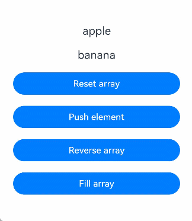
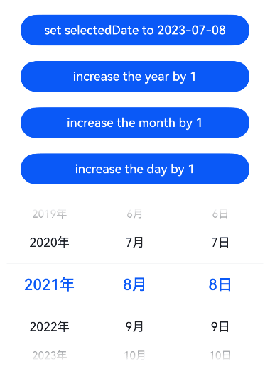
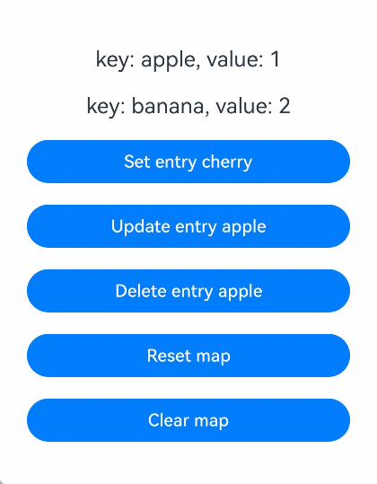
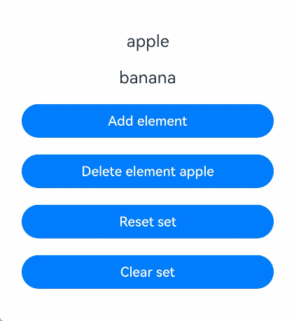
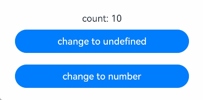

# \@Local装饰器：组件内部状态

\@Local表示组件内部状态，用于定义在组件内部使用的状态变量。

## 概述

\@Local装饰器用于[\@ComponentV2](./arkts-static-componentv2.md#componentv2)装饰的自定义组件中，定义组件内部状态。\@Local装饰的变量为状态变量，具有观察变化的能力，当变量变化时，会触发绑定的UI组件刷新。\@Local装饰的变量仅能在组件内部初始化，不支持从父组件传入初始化。

\@Local装饰器具有以下能力：

- \@Local装饰的变量变化时，会刷新使用该变量的组件。
- \@Local支持观察Object、class、string、int、double、long、boolean、enum、interface等基本类型以及[Array](#装饰array类型变量)、[Date](#装饰date类型变量)、[Map](#装饰map类型变量)、[Set](#装饰set类型变量)等内置类型。
- \@Local支持null、undefined以及[联合类型](#联合类型)。

在静态语言上下文中使用时，需要导入装饰器：

```ts
import { Local } from '@kit.ArkUI';
```

## 装饰器说明

| \@Local变量装饰器  | 说明                                                         |
| ------------------ | ------------------------------------------------------------ |
| 装饰器参数         | 无                                                           |
| 允许装饰的变量类型 | Object、class、string、int、double、long、boolean、enum、interface等基本类型以及[Array](#装饰array类型变量)、[Date](#装饰date类型变量)、[Map](#装饰map类型变量)、[Set](#装饰set类型变量)等内嵌类型。支持null、undefined以及[联合类型](#联合类型)。 |
| 初始化规则         | 仅能本地初始化，不支持从父组件传入初始化。                   |
| 同步规则           | **在子组件使用时：**<br>不与父组件中的任何类型变量同步。<br/>**在父组件使用时：**<br/>- 可以初始化子组件的[\@Param](./arkts-static-new-param.md)变量。<br/>- \@Local变量的变化会同步给子组件的\@Param变量。 |

## 观察变化

\@Local装饰的变量能够观察变量变化，当变量变化时，触发绑定的UI组件刷新。

- 当装饰boolean、string、int时，可以观察到对变量赋值的变化。

  <!-- @[LocalBasicTypes](https://gitcode.com/openharmony/applications_app_samples/blob/OpenHarmony_feature_sta_20260331/code/DocsSample/ArkUISample-Sta/LocalDecorator/entry/src/main/ets/pages/LocalBasicTypes.ets) -->
  
  ``` TypeScript
  import { Button, ClickEvent, Column, ComponentV2, Entry, Local, Text } from '@kit.ArkUI';
  
  @Entry
  @ComponentV2
  struct Index {
    @Local count: int = 0;
    @Local message: string = 'Hello';
    @Local flag: boolean = false;
  
    build() {
      Column() {
        Text(`${this.count}`)
        Text(`${this.message}`)
        Text(`${this.flag}`)
        Button('change Local')
          .onClick((e: ClickEvent) => {
            // 当@Local装饰简单类型时，能够观察到对变量的赋值
            this.count++;
            this.message += ' World';
            this.flag = !this.flag;
          })
      }
    }
  }
  ```

- 当装饰类对象时，仅能观察到对类对象整体赋值的变化，无法直接观察到对类成员属性赋值的变化。对类成员属性的观察依赖[\@ObservedV2与\@Trace](./arkts-static-new-observedV2-and-trace.md)装饰器。

  <!-- @[LocalClassObject](https://gitcode.com/openharmony/applications_app_samples/blob/OpenHarmony_feature_sta_20260331/code/DocsSample/ArkUISample-Sta/LocalDecorator/entry/src/main/ets/pages/LocalClassObject.ets) -->
  
  ``` TypeScript
  import { Button, ClickEvent, Column, ComponentV2, Entry, Local, ObservedV2, Text, Trace } from '@kit.ArkUI';
  class RawObject {
    name: string;
    constructor(name: string) {
      this.name = name;
    }
  }
  @ObservedV2
  class ObservedObject {
    @Trace name: string;
    constructor(name: string) {
      this.name = name;
    }
  }
  
  @Entry
  @ComponentV2
  struct Index {
    @Local rawObject: RawObject = new RawObject('rawObject');
    @Local observedObject: ObservedObject = new ObservedObject('observedObject');
  
    build() {
      Column() {
        Text(`${this.rawObject.name}`)
        Text(`${this.observedObject.name}`)
        Button('change object')
          .onClick((e: ClickEvent) => {
            // 对类对象整体的修改均能观察到
            this.rawObject = new RawObject('new rawObject');
            this.observedObject = new ObservedObject('new observedObject');
          })
        Button('change name')
          .onClick((e: ClickEvent) => {
            // @Local不具备观察类对象属性的能力，因此对rawObject.name的修改无法观察到
            this.rawObject.name = 'new rawObject name';
            // 由于ObservedObject的name属性被@Trace装饰，因此对observedObject.name的修改能被观察到
            this.observedObject.name = 'new observedObject name';
          })
      }
    }
  }
  ```

- 当装饰简单类型数组时，可以观察到数组整体或数组项的变化。

  <!-- @[LocalArray](https://gitcode.com/openharmony/applications_app_samples/blob/OpenHarmony_feature_sta_20260331/code/DocsSample/ArkUISample-Sta/LocalDecorator/entry/src/main/ets/pages/LocalArray.ets) -->
  
  ``` TypeScript
  import { Button, ClickEvent, Column, ComponentV2, Entry, Local, Text } from '@kit.ArkUI';
  
  @Entry
  @ComponentV2
  struct Index {
    @Local numArr: int[] = [1, 2, 3, 4, 5];
    @Local dimensionTwo: int[][] = [[1, 2, 3], [4, 5, 6]];
  
    build() {
      Column() {
        Text(`${this.numArr[0]}`)
        Text(`${this.numArr[1]}`)
        Text(`${this.numArr[2]}`)
        Text(`${this.dimensionTwo[0][0]}`)
        Text(`${this.dimensionTwo[1][1]}`)
        Button('change array item')
          .onClick((e: ClickEvent) => {
            this.numArr[0]++;
            this.numArr[1] += 2;
            this.dimensionTwo[0][0] = 0;
            this.dimensionTwo[1][1] = 0;
          })
        Button('change whole array')
          .onClick((e: ClickEvent) => {
            this.numArr = [5, 4, 3, 2, 1];
            this.dimensionTwo = [[7, 8, 9], [0, 1, 2]];
          })
      }
    }
  }
  ```

- 当装饰内置类型时，可以观察到变量整体赋值及API调用带来的变化。

  | 类型  | 可观察变化的API                                              |
  | ----- | ------------------------------------------------------------ |
  | Array | push, pop, shift, unshift, splice, copyWithin, fill, reverse, sort |
  | Date  | setFullYear, setMonth, setDate, setHours, setMinutes, setSeconds, setMilliseconds, setTime, setUTCFullYear, setUTCMonth, setUTCDate, setUTCHours, setUTCMinutes, setUTCSeconds, setUTCMilliseconds |
  | Map   | set, clear, delete                                           |
  | Set   | add, clear, delete                                           |

- 当装饰interface字面量类型时，仅能观察到字面量整体的变化，无法观察到属性的变化，可以使用[makeObserved接口](./arkts-static-new-makeObserved.md)实现对字面量属性的观察。

  <!-- @[LocalInterface](https://gitcode.com/openharmony/applications_app_samples/blob/OpenHarmony_feature_sta_20260331/code/DocsSample/ArkUISample-Sta/LocalDecorator/entry/src/main/ets/pages/LocalInterface.ets) -->
  
  ``` TypeScript
  import { Button, ClickEvent, Column, ComponentV2, Entry, Local, Text } from '@kit.ArkUI';
  interface Info {
    name: string;
    age: int;
  }
  
  @Entry
  @ComponentV2
  struct Index {
    // 装饰字面量
    @Local info: Info = { name: 'Jack', age: 25 } as Info;
    
    build() {
      Column() {
        Text(`info.name: ${this.info.name}`)
        Text(`info.age: ${this.info.age}`)
        Button('change info')
          .onClick((e: ClickEvent) => {
            this.info = { name: 'Tom', age: 18 } as Info; // 变化可观察
          })
        Button('change info.name')
          .onClick((e: ClickEvent) => {
            this.info.name = 'Lucy'; // 变化无法观察
          })
      }
    }
  }
  ```

## 限制条件

- \@Local装饰器仅能在\@ComponentV2装饰的自定义组件中使用。

  ```ts
  'use static'
  
  import { Component, ComponentV2, Entry, Local } from '@kit.ArkUI';
  @Entry
  @ComponentV2
  struct MyComponent {
    @Local message: string = 'Hello World'; // 正确用法
    build() {
    }
  }
  @Component
  struct TestComponent {
    @Local message: string = 'Hello World'; // 错误用法，编译时报错
    build() {
    }
  }
  ```

- \@Local装饰的变量表示组件内部状态，不支持从父组件传入初始化。

  ```ts
  'use static'
  
  import { Column, ComponentV2, Entry, Local } from '@kit.ArkUI';
  @ComponentV2
  struct ChildComponent {
    @Local message: string = 'Hello World';
    build() {
    }
  }
  @Entry
  @ComponentV2
  struct MyComponent {
    build() {
      Column() {
        ChildComponent({ message: 'Hello' }) // 错误用法，编译时报错
      }
    }
  }
  ```

## \@Local与\@State对比

| 用法           | [\@State](./arkts-static-state.md)                                          | \@Local                                           |
| -------------- | ------------------------------------------------ | ------------------------------------------------- |
| 参数           | 无                                              | 无                                              |
| 从父组件初始化 | 可选。                                           | 不允许从父组件传入初始化。                        |
| 观察能力       | 能观察变量本身以及一层的成员属性，无法深度观察。 | 能观察变量本身，深度观察类属性依赖\@Trace装饰器。 |
| 数据传递       | 可以作为数据源和子组件中状态变量同步。           | 可以作为数据源和子组件中状态变量同步。            |

## 使用场景

### 观察对象整体变化

被\@ObservedV2与\@Trace装饰的类对象实例，具有深度观察对象属性的能力。但当类对象整体赋值时，UI却无法刷新。使用\@Local装饰对象，可以达到观察对象本身变化的效果。

<!-- @[LocalObservedObject](https://gitcode.com/openharmony/applications_app_samples/blob/OpenHarmony_feature_sta_20260331/code/DocsSample/ArkUISample-Sta/LocalDecorator/entry/src/main/ets/pages/LocalObservedObject.ets) -->

``` TypeScript
import { Button, Column, ComponentV2, Entry, Local, ObservedV2, Row, Text, Trace } from '@kit.ArkUI';

@ObservedV2
class Info {
  @Trace name: string;
  @Trace age: int;

  constructor(name: string, age: int) {
    this.name = name;
    this.age = age;
  }
}

@Entry
@ComponentV2
struct Index {
  info: Info = new Info('Tom', 25);
  @Local localInfo: Info = new Info('Tom', 25);

  build() {
    Row() {
      Column() {
        Text(`info: ${this.info.name}-${this.info.age}`) // Text1
          .margin(10)
        Text(`localInfo: ${this.localInfo.name}-${this.localInfo.age}`) // Text2
          .margin(10)
        Button('change info&localInfo')
          .onClick(() => {
            this.info = new Info('Lucy', 18); // Text1不会刷新
            this.localInfo = new Info('Lucy', 18); // Text2会刷新
          })
          .margin(10)
      }
      .width('100%')
    }
    .height('100%')
  }
}
```


### 装饰Array类型变量

当装饰Array类型时，可以观察到Array整体及其元素的变化。通过API操作更改数组内容也能被观察到。

<!-- @[LocalArrayVariable](https://gitcode.com/openharmony/applications_app_samples/blob/OpenHarmony_feature_sta_20260331/code/DocsSample/ArkUISample-Sta/LocalDecorator/entry/src/main/ets/pages/LocalArrayVariable.ets) -->

``` TypeScript
import { Button, Column, ComponentV2, Entry, ForEach, Local, Row, Text } from '@kit.ArkUI';

class Fruit {
  name: string;

  constructor(name: string) {
    this.name = name;
  }
}

@Entry
@ComponentV2
struct Index {
  @Local fruits: Fruit[] = [new Fruit('apple'), new Fruit('banana')]; // 使用@Local装饰Array类型变量

  build() {
    Row() {
      Column() {
        ForEach(this.fruits, (item: Fruit) => {
          Text(`${item.name}`)
            .fontSize(20)
            .margin(10)
        })
        // 对数组整体重新赋值，触发UI刷新
        Button('Reset array')
          .onClick(() => {
            this.fruits = [new Fruit('strawberry'), new Fruit('blueberry')];
          })
          .width(300)
          .margin(10)
        // 新增数组元素，触发UI刷新
        Button('Push element')
          .onClick(() => {
            this.fruits.push(new Fruit('cherry'));
          })
          .width(300)
          .margin(10)
        // 翻转数组元素，触发UI刷新
        Button('Reverse array')
          .onClick(() => {
            this.fruits.reverse();
          })
          .width(300)
          .margin(10)
        // 使用同一元素填充数组，触发UI刷新
        Button('Fill array')
          .onClick(() => {
            this.fruits.fill(new Fruit('apple'));
          })
          .width(300)
          .margin(10)
      }
      .width('100%')
    }
    .height('100%')
  }
}
```



### 装饰Date类型变量

当装饰Date类型时，可以观察到Date整体及其API操作的变化。

<!-- @[LocalDateVariable](https://gitcode.com/openharmony/applications_app_samples/blob/OpenHarmony_feature_sta_20260331/code/DocsSample/ArkUISample-Sta/LocalDecorator/entry/src/main/ets/pages/LocalDateVariable.ets) -->

``` TypeScript
import { Button, Column, ComponentV2, DatePicker, Entry, Local, Row } from '@kit.ArkUI';

@Entry
@ComponentV2
struct DatePickerExample {
  @Local selectedDate: Date = new Date('2021-08-08'); // 使用@Local装饰Date类型变量

  build() {
    Row() {
      Column() {
        // 通过给selectedDate重新赋值新的Date实例，触发UI刷新
        Button('set selectedDate to 2023-07-08')
          .onClick(() => {
            this.selectedDate = new Date('2023-07-08');
          })
          .margin(10)
          .width(300)
        // 调用Date的setFullYear接口修改年份，触发UI刷新
        Button('increase the year by 1')
          .onClick(() => {
            this.selectedDate.setFullYear(this.selectedDate.getFullYear() + 1);
          })
          .margin(10)
          .width(300)
        // 调用Date的setMonth接口修改月份，触发UI刷新
        Button('increase the month by 1')
          .onClick(() => {
            this.selectedDate.setMonth(this.selectedDate.getMonth() + 1);
          })
          .margin(10)
          .width(300)
        // 调用Date的setDate接口修改日期，触发UI刷新
        Button('increase the day by 1')
          .onClick(() => {
            this.selectedDate.setDate(this.selectedDate.getDate() + 1);
          })
          .margin(10)
          .width(300)
        DatePicker({
          start: new Date('1970-1-1'),
          end: new Date('2100-1-1'),
          selected: this.selectedDate
        }).margin(20)
      }
      .width('100%')
    }
    .height('100%')
  }
}
```



### 装饰Map类型变量

当装饰Map类型时，可以观察到Map整体及其API操作带来的变化。

<!-- @[LocalMapVariable](https://gitcode.com/openharmony/applications_app_samples/blob/OpenHarmony_feature_sta_20260331/code/DocsSample/ArkUISample-Sta/LocalDecorator/entry/src/main/ets/pages/LocalMapVariable.ets) -->

``` TypeScript
import { Button, Column, ComponentV2, Entry, ForEach, Local, Row, Text } from '@kit.ArkUI';

@Entry
@ComponentV2
struct MapSample {
  @Local fruits: Map<string, int> = new Map<string, int>([['apple', 1], ['banana', 2]]); // 使用@Local装饰Map类型变量

  build() {
    Row() {
      Column() {
        ForEach(Array.from(this.fruits.entries()), (item: [string, int]) => {
          Text(`key: ${item[0]}, value: ${item[1]}`)
            .fontSize(20)
            .margin(10)
        })
        // 新增键值对，触发UI刷新
        Button('Set entry cherry')
          .onClick(() => {
            this.fruits.set('cherry', 3);
          })
          .width(300)
          .margin(10)
        // 更新键值对，触发UI刷新
        Button('Update entry apple')
          .onClick(() => {
            this.fruits.set('apple', 4);
          })
          .width(300)
          .margin(10)
        // 删除键值对，触发UI刷新
        Button('Delete entry apple')
          .onClick(() => {
            this.fruits.delete('apple');
          })
          .width(300)
          .margin(10)
        // 对Map整体重新赋值，触发UI刷新
        Button('Reset map')
          .onClick(() => {
            this.fruits = new Map<string, int>([['strawberry', 9], ['blueberry', 8]]);
          })
          .width(300)
          .margin(10)
        // 清空Map，触发UI刷新
        Button('Clear map')
          .onClick(() => {
            this.fruits.clear();
          })
          .width(300)
          .margin(10)
      }
      .width('100%')
    }
    .height('100%')
  }
}
```



### 装饰Set类型变量

当装饰Set类型时，可以观察到Set整体及其API操作带来的变化。

<!-- @[LocalSetVariable](https://gitcode.com/openharmony/applications_app_samples/blob/OpenHarmony_feature_sta_20260331/code/DocsSample/ArkUISample-Sta/LocalDecorator/entry/src/main/ets/pages/LocalSetVariable.ets) -->

``` TypeScript
import { Button, Column, ComponentV2, Entry, ForEach, Local, Row, Text } from '@kit.ArkUI';

@Entry
@ComponentV2
struct SetSample {
  @Local fruits: Set<string> = new Set<string>(['apple', 'banana']); // 使用@Local装饰Set类型变量

  build() {
    Row() {
      Column() {
        ForEach(Array.from(this.fruits.entries()), (item: [string, string]) => {
          Text(`${item[0]}`)
            .fontSize(20)
            .margin(10)
        })
        // 新增元素，触发UI刷新
        Button('Add element')
          .onClick(() => {
            this.fruits.add('cherry');
          })
          .width(300)
          .margin(10)
        // 删除元素，触发UI刷新
        Button('Delete element apple')
          .onClick(() => {
            this.fruits.delete('apple');
          })
          .width(300)
          .margin(10)
        // 对Set整体重新赋值，触发UI刷新
        Button('Reset set')
          .onClick(() => {
            this.fruits = new Set<string>(['strawberry', 'blueberry']);
          })
          .width(300)
          .margin(10)
        // 清空Set，触发UI刷新
        Button('Clear set')
          .onClick(() => {
            this.fruits.clear();
          })
          .width(300)
          .margin(10)
      }
      .width('100%')
    }
    .height('100%')
  }
}
```



### 联合类型

\@Local支持null、undefined以及联合类型。在下面的示例中，count类型为int | undefined，点击改变count的类型，UI会随之刷新。

<!-- @[LocalUnionType](https://gitcode.com/openharmony/applications_app_samples/blob/OpenHarmony_feature_sta_20260331/code/DocsSample/ArkUISample-Sta/LocalDecorator/entry/src/main/ets/pages/LocalUnionType.ets) -->

``` TypeScript
import { Button, Column, ComponentV2, Entry, Local, Row, Text } from '@kit.ArkUI';

@Entry
@ComponentV2
struct Index {
  @Local count: int | undefined = 10; // 使用@Local装饰联合类型变量

  build() {
    Row() {
      Column() {
        Text(`count: ${this.count}`)
        // 将联合类型变量从int切换为undefined，触发UI刷新
        Button('change to undefined')
          .onClick(() => {
            this.count = undefined;
          })
          .width(300)
          .margin(10)
        // 将联合类型变量从undefined切换为int，触发UI刷新
        Button('change to int')
          .onClick(() => {
            this.count = 10;
          })
          .width(300)
          .margin(10)
      }
      .width('100%')
    }
    .height('100%')
  }
}
```


