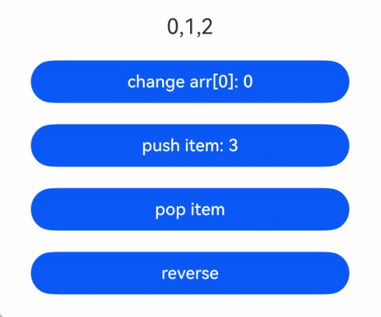
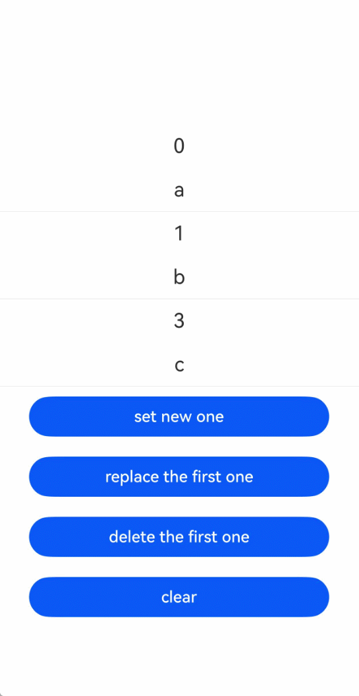
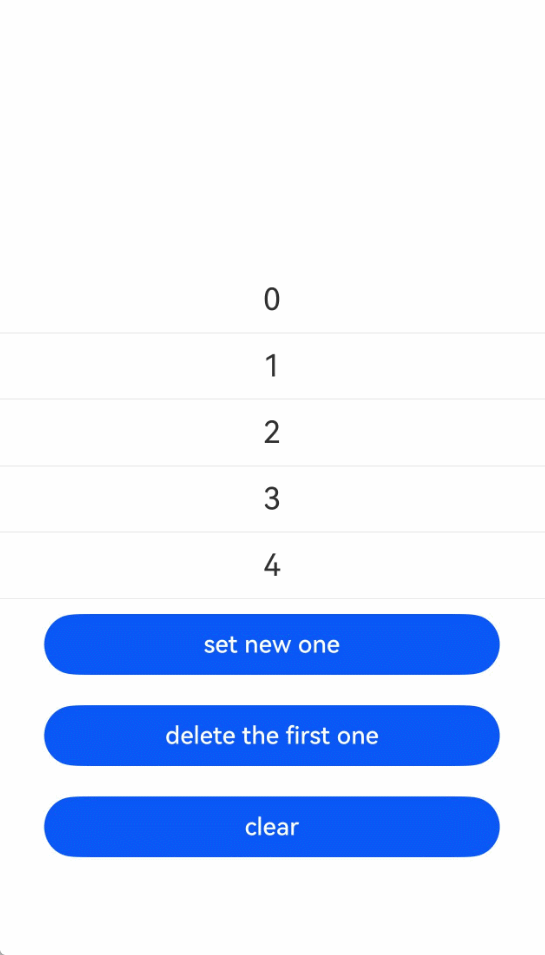
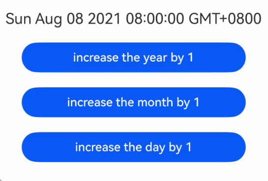
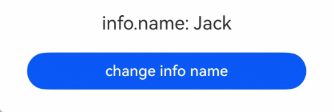

# makeObserved接口：将非观察数据变为可观察数据

为了将普通不可观察数据变为可观察数据，开发者可以使用[makeObserved接口](../../reference/apis-arkui/js-apis-stateManagement-static.md#makeobserved)。

## 概述

makeObserved接口可以将[Array](#makeobserved与array配合使用)、[Map](#makeobserved与map配合使用)、[Set](#makeobserved与set配合使用)、[Date](#makeobserved与date配合使用)以及[interface字面量类型](#makeobserved与interface字面量配合使用)的变量转变为可观察数据。

由makeObserved转换的数据，即使不使用状态变量装饰器，也能观察其内部属性变化。

从API版本26.0.0开始，makeObserved支持通过重载参数`allowDeep`控制观察深度。不传`allowDeep`时，与原有定义保持一致，为深度观察；传入`true`时，同样为深度观察；传入`false`时，仅观察一层属性变化，不继续观察嵌套对象属性的变化。

对于built-in类型（Array、Map、Set、Date），从API版本26.0.0开始，开发者也可以直接使用[ObservedArray/ObservedMap/ObservedSet/ObservedDate](./arkts-static-new-observed-built-in-types.md)创建可观察实例。

在静态语言上下文中使用时，需要导入[UIUtils](../../reference/apis-arkui/js-apis-stateManagement-static.md#uiutils)工具：

```ts
import { UIUtils } from '@kit.ArkUI';
```

## 支持类型和观察变化

### 支持类型

makeObserved支持以下类型的变量：

- Array、Map、Set、Date
- interface字面量

### 观察变化

- makeObserved支持以下调用方式：

  | 调用方式 | 观察能力 |
  | -------- | -------- |
  | `UIUtils.makeObserved(source)` | 默认为深度观察。 |
  | `UIUtils.makeObserved(source, true)` | 深度观察。 |
  | `UIUtils.makeObserved(source, false)` | 一层观察，仅观察第一层属性变化。 |

- makeObserved传入Array、Map、Set、Date类型的实例时，可以观察其API带来的变化。

  | 类型  | 可观测变化的API                                              |
  | ----- | ------------------------------------------------------------ |
  | Array | push、pop、shift、unshift、splice、copyWithin、fill、reverse、sort |
  | Map   | set、clear、delete                                           |
  | Set   | add、clear、delete                                           |
  | Date  | setFullYear、setMonth、setDate、setHours、setMinutes、setSeconds、setMilliseconds、setTime、setUTCFullYear、setUTCMonth、setUTCDate、setUTCHours、setUTCMinutes、setUTCSeconds、setUTCMilliseconds |

- makeObserved转换的数据具备可观察能力，即使不使用状态变量装饰器，也能观察其内部属性变化。

  <!-- @[MakeObservedBasic](https://gitcode.com/openharmony/applications_app_samples/blob/OpenHarmony_feature_sta_20260331/code/DocsSample/ArkUISample-Sta/MakeObserved/entry/src/main/ets/pages/MakeObservedBasic.ets) --> 
  
  ``` TypeScript
  import { ClickEvent, Column, Component, Entry, Text, UIUtils } from '@kit.ArkUI';
  interface Info {
    name: string;
    age: number;
  }
  @Entry
  @Component
  struct Index {
    info: Info = UIUtils.makeObserved({ name: 'Jack', age: 25} as Info) as Info;
    build() {
      Column() {
        Text(`info.name: ${this.info.name}`)
          .onClick((e: ClickEvent) => {
            this.info.name = 'Tom'; // 不依赖装饰器，仍能观察内部变化
          })
      }
    }
  }
  ```

- 从API版本26.0.0开始，不设置`allowDeep`参数，或将其设置为`true`时，makeObserved支持观察嵌套场景。

  <!-- @[MakeObservedNested](https://gitcode.com/openharmony/applications_app_samples/blob/OpenHarmony_feature_sta_20260331/code/DocsSample/ArkUISample-Sta/MakeObserved/entry/src/main/ets/pages/MakeObservedNested.ets) --> 
  
  ``` TypeScript
  import { ClickEvent, Column, Component, Entry, Text, UIUtils } from '@kit.ArkUI';
  
  export interface Info {
    name: string;
    age: number;
  }
  
  export interface Person {
    info: Info;
  }
  
  @Entry
  @Component
  struct Index {
    person: Person = UIUtils.makeObserved({ info: { name: 'Jack', age: 25 } as Info } as Person) as Person;
  
    build() {
      Column() {
        Text(`info.name: ${this.person.info.name}`)
          .onClick((e: ClickEvent) => {
            this.person.info.name = 'Tom'; // 支持观察嵌套场景
          })
      }
    }
  }
  ```

- 从API版本26.0.0开始，当`allowDeep`为`false`时，makeObserved仅观察一层属性变化，嵌套属性变化不触发刷新。

  <!-- @[MakeObservedOneLevel](https://gitcode.com/openharmony/applications_app_samples/blob/OpenHarmony_feature_sta_20260331/code/DocsSample/ArkUISample-Sta/MakeObserved/entry/src/main/ets/pages/MakeObservedOneLevel.ets) --> 
  
  ``` TypeScript
  import { Button, ClickEvent, Column, Component, Entry, Text, UIUtils } from '@kit.ArkUI';
  
  export interface Info {
    name: string;
    age: number;
  }
  
  export interface Person {
    info: Info;
  }
  
  @Entry
  @Component
  struct Index {
    person: Person = UIUtils.makeObserved({ info: { name: 'Jack', age: 25 } as Info } as Person, false) as Person;
  
    build() {
      Column() {
        Text(`info.name: ${this.person.info.name}`)
        Button('change name').onClick((e: ClickEvent) => {
          this.person.info.name = 'Tom'; // 不触发刷新，属于第二层属性变化
        })
        Button('replace info').onClick((e: ClickEvent) => {
          this.person.info = { name: 'Tom', age: 25 } as Info; // 触发刷新，属于第一层属性变化
        })
      }
    }
  }
  ```

- 当makeObserved的返回值被状态变量装饰器装饰时，观察能力以makeObserved为准。

  <!-- @[MakeObservedWithDecorator](https://gitcode.com/openharmony/applications_app_samples/blob/OpenHarmony_feature_sta_20260331/code/DocsSample/ArkUISample-Sta/MakeObserved/entry/src/main/ets/pages/MakeObservedWithDecorator.ets) --> 
  
  ``` TypeScript
  import { ClickEvent, Column, Component, Entry, State, Text, UIUtils } from '@kit.ArkUI';
  interface Info {
    name: string;
    age: number;
  }
  interface Person {
    info: Info;
  }
  @Entry
  @Component
  struct Index {
    @State person: Person = UIUtils.makeObserved({ info: { name: 'Jack', age: 25} as Info} as Person) as Person;
    build() {
      Column() {
        Text(`info.name: ${this.person.info.name}`)
          .onClick((e: ClickEvent) => {
            // @State本身无法观察name变化，但makeObserved支持观察嵌套
            // 此时以makeObserved为准，因此name变化可观察
            this.person.info.name = 'Tom';
          })
      }
    }
  }
  ```

## 限制条件

- 仅支持非空对象作为makeObserved的参数。

  - 不支持undefined和null：返回自身，不做处理。
  - 不支持非对象类型：返回自身，不做处理。

  ```ts
  import { UIUtils } from '@kit.ArkUI';
  let res1 = UIUtils.makeObserved(2); // 非对象类型入参，实际无作用，返回2
  let res2 = UIUtils.makeObserved(undefined); // 非对象类型入参，实际无作用，返回undefined
  let res3 = UIUtils.makeObserved(null); // 非对象类型入参，实际无作用，返回null
  ```

- makeObserved传入Array、Map、Set、Date以及interface字面量之外的其他对象类型变量将不做处理。

  ```ts
  import { UIUtils } from '@kit.ArkUI';
  @ObservedV2
  class Info {
    @Trace id: number = 0;
  }
  let observedInfo: Info = UIUtils.makeObserved(new Info()); // 非支持类型，不做处理
  class Info2 {
    id: number = 0;
  }
  let observedInfo1: Info2 = UIUtils.makeObserved(new Info2()); // 非支持类型，不做处理
  ```

## 使用场景

### makeObserved与Array配合使用

<!-- @[MakeObservedArray](https://gitcode.com/openharmony/applications_app_samples/blob/OpenHarmony_feature_sta_20260331/code/DocsSample/ArkUISample-Sta/MakeObserved/entry/src/main/ets/pages/MakeObservedArray.ets) --> 

``` TypeScript
import { Button, ClickEvent, Column, Component, Entry, Text, UIUtils } from '@kit.ArkUI';

@Entry
@Component
struct Index {
  arr: int[] = UIUtils.makeObserved([0, 1, 2]);

  build() {
    Column() {
      Text(`${this.arr}`)
        .fontSize(20)
        .margin(10)
      // 修改数组元素，触发UI刷新
      Button(`change arr[0]: ${this.arr[0]}`)
        .width(300)
        .margin(10)
        .onClick((e: ClickEvent) => {
          this.arr[0]++;
        })
      // 新增数组元素，触发UI刷新
      Button(`push item: ${this.arr.length}`)
        .width(300)
        .margin(10)
        .onClick((e: ClickEvent) => {
          this.arr.push(Double.toInt(this.arr.length));
        })
      // 删除数组元素，触发UI刷新
      Button(`pop item`)
        .width(300)
        .margin(10)
        .onClick((e: ClickEvent) => {
          this.arr.pop();
        })
      // 翻转数组元素，触发UI刷新
      Button(`reverse`)
        .width(300)
        .margin(10)
        .onClick((e: ClickEvent) => {
          this.arr.reverse();
        })
    }
    .width('100%')
  }
}
```



### makeObserved与Map配合使用

<!-- @[MakeObservedMap](https://gitcode.com/openharmony/applications_app_samples/blob/OpenHarmony_feature_sta_20260331/code/DocsSample/ArkUISample-Sta/MakeObserved/entry/src/main/ets/pages/MakeObservedMap.ets) --> 

``` TypeScript
import { Button, ClickEvent, Column, Component, Divider, Entry, ForEach, Row, Text, UIUtils } from '@kit.ArkUI';

@Entry
@Component
struct MapSample {
  message: Map<int, string> = UIUtils.makeObserved(new Map<int, string>([[0, 'a'], [1, 'b'], [3, 'c']]));

  build() {
    Row() {
      Column() {
        ForEach(Array.from(this.message.entries()), (item: [int, string]) => {
          Text(`${item[0]}`)
            .fontSize(20)
            .margin(10)
          Text(`${item[1]}`)
            .fontSize(20)
            .margin(10)
          Divider()
        })
        // 新增键值对，触发UI刷新
        Button('set new one')
          .width(300)
          .margin(10)
          .onClick((e: ClickEvent) => {
            this.message.set(4, 'd');
          })
        // 更新键值对，触发UI刷新
        Button('replace the first one')
          .width(300)
          .margin(10)
          .onClick((e: ClickEvent) => {
            this.message.set(0, 'aa');
          })
        // 删除键值对，触发UI刷新
        Button('delete the first one')
          .width(300)
          .margin(10)
          .onClick((e: ClickEvent) => {
            this.message.delete(0);
          })
        // 清空Map，触发UI刷新
        Button('clear')
          .width(300)
          .margin(10)
          .onClick((e: ClickEvent) => {
            this.message.clear();
          })
      }
      .width('100%')
    }
    .height('100%')
  }
}
```



### makeObserved与Set配合使用

<!-- @[MakeObservedSet](https://gitcode.com/openharmony/applications_app_samples/blob/OpenHarmony_feature_sta_20260331/code/DocsSample/ArkUISample-Sta/MakeObserved/entry/src/main/ets/pages/MakeObservedSet.ets) --> 

``` TypeScript
import { Button, ClickEvent, Column, Component, Divider, Entry, ForEach, Row, Text, UIUtils } from '@kit.ArkUI';

@Entry
@Component
struct SetSample {
  message: Set<int> = UIUtils.makeObserved(new Set<int>([0, 1, 2, 3, 4]));

  build() {
    Row() {
      Column() {
        ForEach(Array.from(this.message.entries()), (item: [int, int]) => {
          Text(`${item[0]}`)
            .fontSize(20)
            .margin(10)
          Divider()
        })
        // 新增元素，触发UI刷新
        Button('set new one')
          .width(300)
          .margin(10)
          .onClick((e: ClickEvent) => {
            this.message.add(5);
          })
        // 删除元素，触发UI刷新
        Button('delete the first one')
          .width(300)
          .margin(10)
          .onClick((e: ClickEvent) => {
            this.message.delete(0);
          })
        // 清空Set，触发UI刷新
        Button('clear')
          .width(300)
          .margin(10)
          .onClick((e: ClickEvent) => {
            this.message.clear();
          })
      }
      .width('100%')
    }
    .height('100%')
  }
}
```



### makeObserved与Date配合使用

<!-- @[MakeObservedDate](https://gitcode.com/openharmony/applications_app_samples/blob/OpenHarmony_feature_sta_20260331/code/DocsSample/ArkUISample-Sta/MakeObserved/entry/src/main/ets/pages/MakeObservedDate.ets) --> 

``` TypeScript
import { Button, ClickEvent, Column, Component, Entry, Text, UIUtils } from '@kit.ArkUI';

@Entry
@Component
struct DateExample {
  selectedDate: Date = UIUtils.makeObserved(new Date('2021-08-08'));

  build() {
    Column() {
      Text(`${this.selectedDate}`)
        .fontSize(20)
        .margin(10)
      // 调用Date的setFullYear接口修改年份，触发UI刷新
      Button('increase the year by 1')
        .width(300)
        .margin(10)
        .onClick((e: ClickEvent) => {
          this.selectedDate.setFullYear(this.selectedDate.getFullYear() + 1);
        })
      // 调用Date的setMonth接口修改月份，触发UI刷新
      Button('increase the month by 1')
        .width(300)
        .margin(10)
        .onClick((e: ClickEvent) => {
          this.selectedDate.setMonth(this.selectedDate.getMonth() + 1);
        })
      // 调用Date的setDate接口修改日期，触发UI刷新
      Button('increase the day by 1')
        .width(300)
        .margin(10)
        .onClick((e: ClickEvent) => {
          this.selectedDate.setDate(this.selectedDate.getDate() + 1);
        })
    }
    .width('100%')
  }
}
```



### makeObserved与interface字面量配合使用

<!-- @[MakeObservedInterface](https://gitcode.com/openharmony/applications_app_samples/blob/OpenHarmony_feature_sta_20260331/code/DocsSample/ArkUISample-Sta/MakeObserved/entry/src/main/ets/pages/MakeObservedInterface.ets) --> 

``` TypeScript
import { ClickEvent, Column, Component, Entry, Text, UIUtils, Button } from '@kit.ArkUI';

interface Info {
  name: string,
  age: int
}

@Entry
@Component
struct Index {
  info: Info = UIUtils.makeObserved({ name: 'Jack', age: 25 } as Info) as Info;

  build() {
    Column() {
      Text(`info.name: ${this.info.name}`)
        .fontSize(20)
        .margin(10)
      Button('change info name')
        .width(300)
        .margin(10)
        .onClick((e: ClickEvent) => {
          // 由于info变量可深度观察，故该属性变化可触发UI刷新。
          this.info.name = 'Tom';
        })
    }
    .width('100%')
  }
}
```



