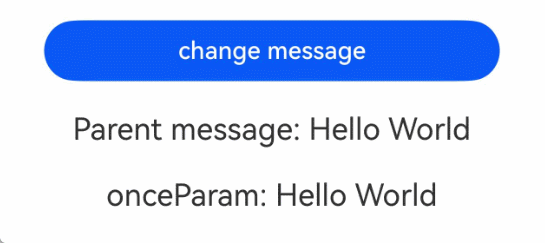
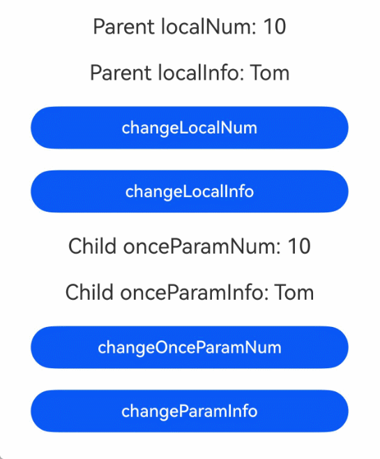

# \@Once：初始化同步一次

使用\@Once装饰器搭配[\@Param](./arkts-static-new-param.md)装饰器，可以实现仅从外部初始化一次且不接受后续同步变化的能力。

## 概述

\@Once装饰器在变量初始化时接受外部传入值进行初始化，后续数据源更改不会同步给子组件。

- \@Once必须搭配\@Param使用，单独使用或搭配其他装饰器使用都是不允许的。
- \@Once不影响\@Param的观测能力，仅拦截数据源的变化。
- \@Once与\@Param装饰变量的先后顺序不影响使用功能。
- \@Once与\@Param搭配使用时，可以在本地修改\@Param变量的值。

在静态语言上下文中使用时，需导入装饰器：

```ts
import { Once } from '@kit.ArkUI';
```

## 装饰器说明

\@Once装饰器作为辅助装饰器，本身没有装饰类型要求和变量观察能力。

| \@Once变量装饰器 | 说明                                      |
| ---------------- | ----------------------------------------- |
| 装饰器参数       | 无                                      |
| 使用条件         | 无法单独使用，必须配合\@Param装饰器使用。 |

## 限制条件

- \@Once仅在[\@ComponentV2](./arkts-static-componentv2.md)装饰的自定义组件中与\@Param搭配使用。

  ```ts
  @ComponentV2
  struct MyComponent {
    @Param @Once onceParam: string = 'onceParam'; // 正确用法
    @Once onceStr: string = 'Once'; // 错误用法，@Once无法单独使用
    @Local @Once onceLocal: string = 'onceLocal'; // 错误用法，@Once不能与@Local一起使用
  }
  @Component
  struct Index {
    @Once @Param onceParam: string = 'onceParam'; // 错误用法
  }
  ```

- \@Once与\@Param的先后顺序无关，可以写成\@Param \@Once也可以写成\@Once \@Param。

  ```ts
  @ComponentV2
  struct MyComponent {
    @Param @Once param1: number;
    @Once @Param param2: number;
  }
  ```

## 使用场景

### 变量仅初始化同步一次

\@Once用于变量仅初始化同步数据源一次，之后不再继续同步变化的场景。

<!-- @[OnceInitSync](https://gitcode.com/openharmony/applications_app_samples/blob/OpenHarmony_feature_sta_20260331/code/DocsSample/ArkUISample-Sta/OnceDecorator/entry/src/main/ets/pages/OnceInitSync.ets) --> 

``` TypeScript
import { Button, ClickEvent, Column, ComponentV2, Entry, Local, Once, Param, Text } from '@kit.ArkUI';

@ComponentV2
struct ChildComponent {
  @Param @Once onceParam: string = '';

  build() {
    Column() {
      // onceParam变量只在初始化时接收父组件传值。
      Text(`onceParam: ${this.onceParam}`)
        .fontSize(20)
        .margin(10)
    }
    .width('100%')
  }
}

@Entry
@ComponentV2
struct MyComponent {
  @Local message: string = 'Hello World';

  build() {
    Column() {
      Button('change message')
        .width(300)
        .margin(10)
        .onClick((e: ClickEvent) => {
          // 修改message变量，并不会同步给子组件。
          this.message = 'Hello Tomorrow';
        })
      Text(`Parent message: ${this.message}`)
        .fontSize(20)
        .margin(10)
      ChildComponent({ onceParam: this.message })
    }
    .width('100%')
  }
}
```



### 本地修改\@Param变量

当\@Once与\@Param结合使用时，可以解除\@Param本地不可修改的限制，并能够触发UI刷新。此时，使用\@Param和\@Once的效果类似于[\@Local](./arkts-static-new-local.md)，但\@Param和\@Once还能接收外部传入的初始值。

<!-- @[OnceLocalModify](https://gitcode.com/openharmony/applications_app_samples/blob/OpenHarmony_feature_sta_20260331/code/DocsSample/ArkUISample-Sta/OnceDecorator/entry/src/main/ets/pages/OnceLocalModify.ets) --> 

``` TypeScript
import {
  Button,
  ClickEvent,
  Column,
  ComponentV2,
  Entry,
  Local,
  ObservedV2,
  Once,
  Param,
  Require,
  Text,
  Trace
} from '@kit.ArkUI';

@ObservedV2
class Info {
  @Trace name: string;

  constructor(name: string) {
    this.name = name;
  }
}

@ComponentV2
struct Child {
  @Param @Once onceParamNum: number = 0;
  @Param @Once @Require onceParamInfo: Info;

  build() {
    Column() {
      // 子组件内可修改onceParamNum与onceParamInfo变量，并能触发UI刷新。
      Text(`Child onceParamNum: ${this.onceParamNum}`)
        .fontSize(20)
        .margin(10)
      Text(`Child onceParamInfo: ${this.onceParamInfo.name}`)
        .fontSize(20)
        .margin(10)
      Button('changeOnceParamNum')
        .width(300)
        .margin(10)
        .onClick((e: ClickEvent) => {
          this.onceParamNum++;
        })
      Button('changeParamInfo')
        .width(300)
        .margin(10)
        .onClick((e: ClickEvent) => {
          this.onceParamInfo = new Info('Cindy');
        })
    }
    .width('100%')
  }
}

@Entry
@ComponentV2
struct Index {
  @Local localNum: number = 10;
  @Local localInfo: Info = new Info('Tom');

  build() {
    Column() {
      Text(`Parent localNum: ${this.localNum}`)
        .fontSize(20)
        .margin(10)
      Text(`Parent localInfo: ${this.localInfo.name}`)
        .fontSize(20)
        .margin(10)
      Button('changeLocalNum')
        .width(300)
        .margin(10)
        .onClick((e: ClickEvent) => {
          this.localNum++;
        })
      Button('changeLocalInfo')
        .width(300)
        .margin(10)
        .onClick((e: ClickEvent) => {
          this.localInfo = new Info('Cindy');
        })
      // 首次渲染时把当前本地值传给子组件。
      Child({
        onceParamNum: this.localNum,
        onceParamInfo: this.localInfo
      })
    }
    .width('100%')
  }
}
```


