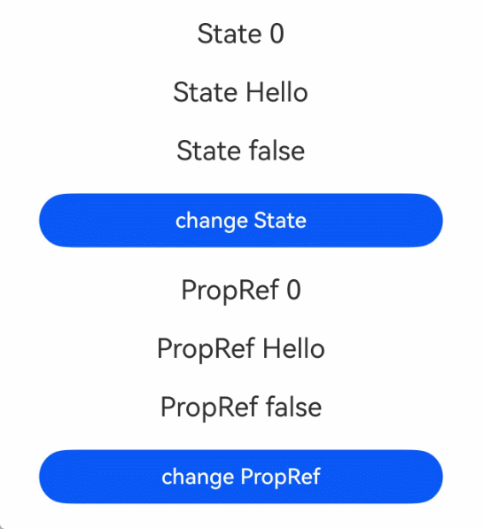
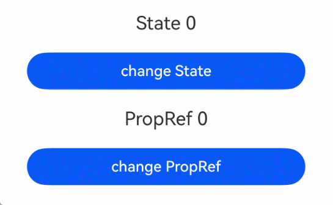
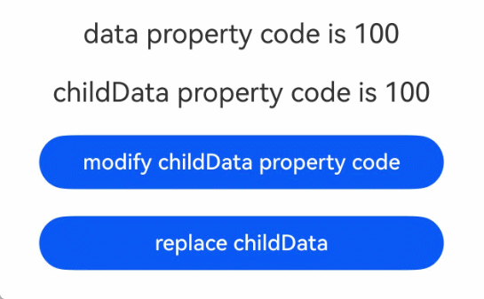
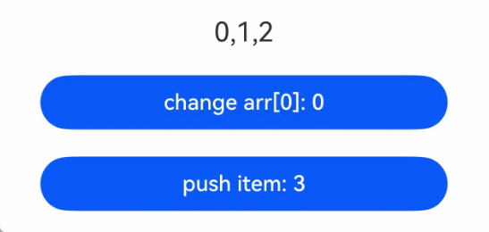
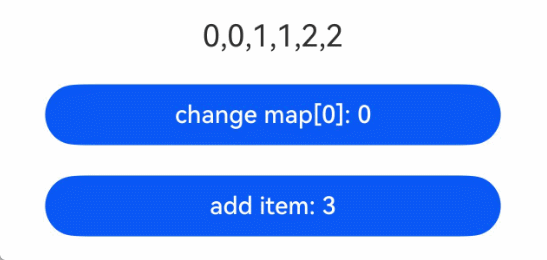
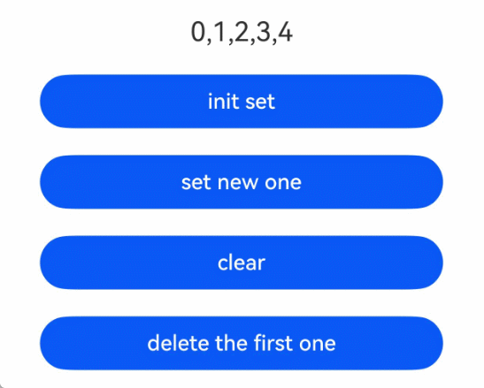
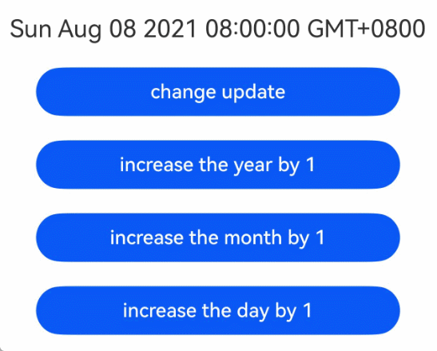

# @PropRef装饰器：父子单向同步

\@PropRef装饰的变量可以与父组件传入变量建立单向同步。该变量允许在本地修改，但修改后的变化不会同步回父组件。

> **说明：**
>
> 从API version 23开始，开发者可以在静态语言上下文中使用\@PropRef装饰器。

## 概述

\@PropRef提供了对标动态语言上下文中[\@Prop](../state-management/arkts-prop.md)装饰器的单向同步的能力。与\@Prop相比，\@PropRef去除了自动深拷贝的功能，仅直接获得数据源的单向引用。该单向引用含义为：

- \@PropRef装饰的变量允许本地修改，该修改不会同步回父组件。由于获得了数据源的引用，当数据源为对象类型时，修改\@PropRef装饰对象的属性仍会在父组件中体现。
- 当数据源更改时，\@PropRef装饰的变量会更新为数据源的最新值，本地修改将被覆盖。

在静态上下文中使用时，需导入装饰器：

```ts
import { PropRef } from '@kit.ArkUI';
```

## 装饰器说明

| \@PropRef变量装饰器 | 说明                                                         |
| ------------------- | ------------------------------------------------------------ |
| 装饰器参数          | 无。                                                         |
| 允许装饰的变量类型  | Object、class、string、number、boolean、enum、interface等基本类型以及[Array](#装饰array类型)、[Date](#装饰date类型)、[Map](#装饰map类型)、[Set](#装饰set类型)等内嵌类型。支持null、undefined以及联合类型。 |
| 初始化规则          | **定义本地默认值时：**<br/>支持从父组件传入变量（含undefined类型），此时优先使用传入值进行初始化。<br/>若父组件未传值，则使用本地默认值进行初始化。<br>**未定义本地默认值时：**<br>必须从父组件传入变量进行初始化。 |
| 同步规则            | **在子组件使用时：**<br/>与父组件中传入的变量单向同步。<br/>当父组件传入的变量改变时（含undefined类型）会更新\@PropRef，覆盖\@PropRef在子组件的修改<br/>**在父组件使用时：**<br/>可以初始化子组件的常规变量、[\@State](./arkts-static-state.md)、[\@Link](./arkts-static-link.md)、\@PropRef、[\@Provide](./arkts-static-provide-and-consume.md)。<br/>\@PropRef变量的变化会同步给子组件的\@Link、\@PropRef变量。 |

## 观察变化

当\@PropRef装饰的变量发生变化时，会触发绑定到该变量的UI组件刷新。

- 当装饰的变量为boolean、string、number等类型时，数据源的变化可以被同步观察到。

  <!-- @[PropRefBasicTypes](https://gitcode.com/openharmony/applications_app_samples/blob/OpenHarmony_feature_sta_20260331/code/DocsSample/ArkUISample-Sta/PropRefDecorator/entry/src/main/ets/pages/PropRefBasicTypes.ets) --> 
  
  ``` TypeScript
  import { Button, ClickEvent, Column, Component, Entry, PropRef, State, Text } from '@kit.ArkUI';
  @Entry
  @Component
  struct Index {
    @State count: number = 0;
    @State message: string = 'Hello';
    @State flag: boolean = false;
    build() {
      Column() {
        Text(`State ${this.count}`)
          .fontSize(20)
          .margin(10)
        Text(`State ${this.message}`)
          .fontSize(20)
          .margin(10)
        Text(`State ${this.flag}`)
          .fontSize(20)
          .margin(10)
        Button('change State')
          .width(300)
          .margin(10)
          .onClick((e: ClickEvent) => {
            // 对数据源的更改会同步给子组件
            this.count++;
            this.message += ' World';
            this.flag = !this.flag;
        })
        Child({
          count: this.count,
          message: this.message,
          flag: this.flag
        })
      }
      .width('100%')
    }
  }
  @Component
  struct Child {
    @PropRef count: number;
    @PropRef message: string;
    @PropRef flag: boolean;
    build() {
      Column() {
        Text(`PropRef ${this.count}`)
          .fontSize(20)
          .margin(10)
        Text(`PropRef ${this.message}`)
          .fontSize(20)
          .margin(10)
        Text(`PropRef ${this.flag}`)
          .fontSize(20)
          .margin(10)
        Button('change PropRef')
          .width(300)
          .margin(10)
          .onClick((e: ClickEvent) => {
            this.count++;
            this.message += '!';
            this.flag = !this.flag;
          })
      }
      .width('100%')
    }
  }
  ```



- 装饰的变量为内置类型时，可观察变量整体赋值和API调用的变化。

  | 类型  | 可观测变化的API                                              |
  | ----- | ------------------------------------------------------------ |
  | Array | push、pop、shift、unshift、splice、copyWithin、fill、reverse、sort |
  | Date  | setFullYear, setMonth, setDate, setHours, setMinutes, setSeconds, setMilliseconds, setTime, setUTCFullYear, setUTCMonth, setUTCDate, setUTCHours, setUTCMinutes, setUTCSeconds, setUTCMilliseconds |
  | Map   | set, clear, delete                                           |
  | Set   | add, clear, delete                                           |

## 限制条件

1. \@PropRef不支持装饰Function与() => void类型的变量，API version 23之前，框架会抛出运行时错误。从API version 23开始，添加对\@PropRef装饰Function与() => void类型变量的校验，编译期会报错。

## 使用场景

### 从父组件到子组件变量变化单向同步

\@PropRef可以接收父组件传递的数据源，并与之单向同步。

<!-- @[PropRefParentChild](https://gitcode.com/openharmony/applications_app_samples/blob/OpenHarmony_feature_sta_20260331/code/DocsSample/ArkUISample-Sta/PropRefDecorator/entry/src/main/ets/pages/PropRefParentChild.ets) --> 

``` TypeScript
import { Button, ClickEvent, Column, Component, Entry, PropRef, State, Text } from '@kit.ArkUI';
@Entry
@Component
struct Index {
  @State count: number = 0;
  build() {
    Column() {
      Text(`State ${this.count}`)
        .fontSize(20)
        .margin(10)
      Button('change State')
        .width(300)
        .margin(10)
        .onClick((e: ClickEvent) => {
          // 对数据源的更改会同步给子组件
          this.count++;
      })
      Child({ count: this.count })
    }
    .width('100%')
  }
}
@Component
struct Child {
  @PropRef count: number;
  build() {
    Column() {
      Text(`PropRef ${this.count}`)
        .fontSize(20)
        .margin(10)
      Button('change PropRef')
        .width(300)
        .margin(10)
        .onClick((e: ClickEvent) => {
          this.count++;
        })
    }
    .width('100%')
  }
}
```



### \@PropRef获得父组件中数据源的引用

\@PropRef会获得父组件数据源的引用，对于复杂类型，修改属性将在父组件中体现。若希望不影响父组件中的数据源，则需重新赋值对象。

<!-- @[PropRefDataSourceRef](https://gitcode.com/openharmony/applications_app_samples/blob/OpenHarmony_feature_sta_20260331/code/DocsSample/ArkUISample-Sta/PropRefDecorator/entry/src/main/ets/pages/PropRefDataSourceRef.ets) --> 

``` TypeScript
import { 
  Entry, 
  Text, 
  Column, 
  Component, 
  Button, 
  ClickEvent,
  State,
  PropRef,
  Observed,
  Track
} from '@kit.ArkUI';

@Observed
class Data {
  @Track code: number;

  constructor(code: number) {
    this.code = code;
  }
}

@Entry
@Component
struct Index {
  @State data: Data = new Data(100);

  build() {
    Column() {
      Text(`data property code is ${this.data.code}`)
        .fontSize(20)
        .margin(10)
      Child({
        childData: this.data
      })
    }
    .width('100%')
  }
}

@Component
struct Child {
  @PropRef childData: Data;

  build() {
    Column() {
      Text(`childData property code is ${this.childData.code}`)
        .fontSize(20)
        .margin(10)
      Button('modify childData property code')
        .width(300)
        .margin(10)
        .onClick((e: ClickEvent) => {
          // 如果只点击该Button，由于childData是父组件中数据源的引用，则父组件中数据源的属性也会修改。
          this.childData.code += 10;
        })

      Button('replace childData')
        .width(300)
        .margin(10)
        .onClick((e: ClickEvent) => {
          // 如果点击该Button，本地的childData变量会引用新的对象，所以不会影响父组件中的数据源。
          this.childData = new Data(200);
        })
    }
    .width('100%')
  }
}
```



### 装饰Array类型

当使用\@PropRef装饰数组类型时，可以观察到数组整体及其元素的变化。通过API操作更改数组内容也能被观测到。

<!-- @[PropRefArray](https://gitcode.com/openharmony/applications_app_samples/blob/OpenHarmony_feature_sta_20260331/code/DocsSample/ArkUISample-Sta/PropRefDecorator/entry/src/main/ets/pages/PropRefArray.ets) -->

``` TypeScript
import { Button, ClickEvent, Column, Component, Entry, PropRef, State, Text } from '@kit.ArkUI';
@Entry
@Component
struct Index {
  @State arr: int[] = [0, 1, 2];
  build() {
    Column() {
      Child({ arr: this.arr })
    }
    .width('100%')
  }
}
@Component
struct Child {
  @PropRef arr: int[];
  build() {
    Column() {
      Text(`${this.arr}`)
        .fontSize(20)
        .margin(10)
      Button(`change arr[0]: ${this.arr[0]}`)
        .width(300)
        .margin(10)
        .onClick((e: ClickEvent) => {
          // 修改arr变量中元素的值，触发UI刷新
          this.arr[0]++;
      })
      Button(`push item: ${this.arr.length}`)
        .width(300)
        .margin(10)
        .onClick((e: ClickEvent) => {
          // 向arr变量中添加元素，触发UI刷新
          this.arr.push(Double.toInt(this.arr.length));
      })
    }
    .width('100%')
  }
}
```



### 装饰Map类型

使用\@PropRef装饰Map类型时，可以观察到Map整体及其API操作带来的变化。

<!-- @[PropRefMap](https://gitcode.com/openharmony/applications_app_samples/blob/OpenHarmony_feature_sta_20260331/code/DocsSample/ArkUISample-Sta/PropRefDecorator/entry/src/main/ets/pages/PropRefMap.ets) -->

``` TypeScript
import { Button, ClickEvent, Column, Component, Entry, PropRef, State, Text } from '@kit.ArkUI';
@Entry
@Component
struct Index {
  @State map: Map<int, int> = new Map<int, int>([[0, 0], [1, 1], [2, 2]]);
  build() {
    Column() {
      Child({ map: this.map })
    }
    .width('100%')
  }
}
@Component
struct Child {
  @PropRef map: Map<int, int>;
  build() {
    Column() {
      Text(`${this.map}`)
        .fontSize(20)
        .margin(10)
      Button(`change map[0]: ${this.map.get(0)}`)
        .width(300)
        .margin(10)
        .onClick((e: ClickEvent) => {
          // 更新键值对，触发UI刷新
          this.map.set(0, this.map.get(0)! + 1);
      })
      Button(`add item: ${this.map.size}`)
        .width(300)
        .margin(10)
        .onClick((e: ClickEvent) => {
          // 新增键值对，触发UI刷新
          this.map.set(this.map.size, this.map.size);
      })
    }
    .width('100%')
  }
}
```



### 装饰Set类型

使用\@PropRef装饰Set类型时，可以观察到Set整体以及API操作带来的变化。

<!-- @[PropRefSet](https://gitcode.com/openharmony/applications_app_samples/blob/OpenHarmony_feature_sta_20260331/code/DocsSample/ArkUISample-Sta/PropRefDecorator/entry/src/main/ets/pages/PropRefSet.ets) -->

``` TypeScript
import { Button, ClickEvent, Column, Component, Entry, PropRef, State, Text } from '@kit.ArkUI';
@Entry
@Component
struct Index {
  @State set: Set<int> = new Set<int>([0, 1, 2, 3, 4]);
  build() {
    Column() {
      Child({ set: this.set })
    }
    .width('100%')
  }
}
@Component
struct Child {
  @PropRef set: Set<int>;
  build() {
    Column() {
      Text(`${Array.from(this.set)}`)
        .fontSize(20)
        .margin(10)
      Button('init set')
        .width(300)
        .margin(10)
        .onClick((e: ClickEvent) => {
          this.set = new Set<int>([0, 1, 2, 3, 4]);
      })
      Button('set new one')
        .width(300)
        .margin(10)
        .onClick((e: ClickEvent) => {
          // 新增元素，触发UI刷新
          this.set.add(5);
      })
      Button('clear')
        .width(300)
        .margin(10)
        .onClick((e: ClickEvent) => {
          // 清空Set，触发UI刷新
          this.set.clear();
      })
      Button('delete the first one')
        .width(300)
        .margin(10)
        .onClick((e: ClickEvent) => {
          // 删除元素，触发UI刷新
          this.set.delete(0);
      })
    }
    .width('100%')
  }
}
```



### 装饰Date类型

使用\@PropRef装饰Date类型时，可以观察到Date整体及其API操作的变化。

<!-- @[PropRefDate](https://gitcode.com/openharmony/applications_app_samples/blob/OpenHarmony_feature_sta_20260331/code/DocsSample/ArkUISample-Sta/PropRefDecorator/entry/src/main/ets/pages/PropRefDate.ets) -->

``` TypeScript
import { Button, ClickEvent, Column, Component, Entry, PropRef, State, Text } from '@kit.ArkUI';
@Entry
@Component
struct Index {
  @State date: Date = new Date('2021-08-08');
  build() {
    Column() {
      Child({ date: this.date })
    }
    .width('100%')
  }
}
@Component
struct Child {
  @PropRef date: Date;
  build() {
    Column() {
      Text(`${this.date}`)
        .fontSize(20)
        .margin(10)
      Button(`change update`)
        .width(300)
        .margin(10)
        .onClick((e: ClickEvent) => {
          // 通过给date重新赋值新的Date实例，触发UI刷新
          this.date = new Date('2023-09-09');
      })
      Button('increase the year by 1')
        .width(300)
        .margin(10)
        .onClick((e: ClickEvent) => {
          // 调用Date的setFullYear接口修改年份，触发UI刷新
          this.date.setFullYear(this.date.getFullYear() + 1);
      })
      Button('increase the month by 1')
        .width(300)
        .margin(10)
        .onClick((e: ClickEvent) => {
          // 调用Date的setMonth接口修改月份，触发UI刷新
          this.date.setMonth(this.date.getMonth() + 1);
      })
      Button('increase the day by 1')
        .width(300)
        .margin(10)
        .onClick((e: ClickEvent) => {
          // 调用Date的setDate接口修改日期，触发UI刷新
          this.date.setDate(this.date.getDate() + 1);
      })
    }
    .width('100%')
  }
}
```

