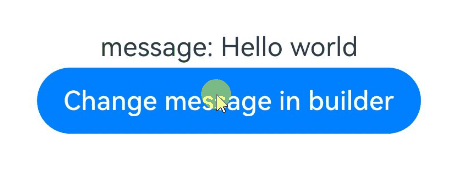
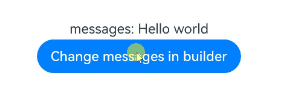
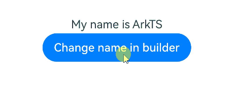
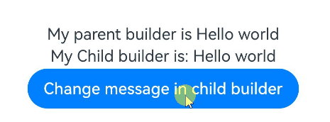
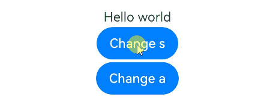

# rememberVariable：@Builder内部状态（ArkTS-Sta）

开发者可以在[@Builder](../state-management/arkts-builder.md)函数内声明新的状态变量并用于UI组件，修改这些状态变量能触发UI组件的更新。

> **说明：**
>
> - 从API version 23开始，开发者可以在静态语言上下文中使用rememberVariable方法。
>
> - 该模块适用于ArkTS-Sta。

## 概述

在ArkTS-Dyn中，@Builder函数需要从外部传入状态变量，才能支持@Builder函数内UI组件的刷新，参考[按引用传递参数](../state-management/arkts-builder.md#按引用传递参数)。这会导致@Builder需要依赖其他组件才能正常运行。在ArkTS-Sta中，提供了在@Builder内声明新的状态变量的能力，使@Builder独立于调用组件的内部状态，增强@Builder函数的复用能力。

rememberVariable可以在@Builder中声明状态变量，开发者传入状态变量的初始值，返回MutableVariable类型的状态变量。该状态变量可以用于UI组件，对状态变量的修改能够刷新UI。

在静态语言上下文中使用时，需要导入[rememberVariable](../../reference/apis-arkui/arkui-ts/ts-universal-remembervariable-static.md#remembervariablet)方法和[MutableVariable](../../reference/apis-arkui/arkui-ts/ts-universal-remembervariable-static.md#mutablevariablet)类型：

```ts
import { rememberVariable, MutableVariable } from '@kit.ArkUI';
```

## 支持类型和观察变化

### 支持类型

rememberVariable支持以下类型的变量：

- 基础类型：int、long、double、number、boolean、string、枚举。
- 内置类型：Array、Map、Set、Date。
- interface字面量。
- [@ObservedV2](./arkts-static-new-observedV2-and-trace.md)和[@Observed](./arkts-static-observed-and-objectlink.md)装饰的class。

### 观察变化

- 创建基础类型的状态变量时，使用泛型T作为参数传入rememberVariable，详细示例见[@Builder内声明基础类型的状态变量](#builder内声明基础类型的状态变量)。
- 创建内置类型，interface和class的状态变量时，使用回调() => T作为入参传入rememberVariable，使用内置类型的详细示例见[@Builder内声明内置类型的状态变量](#builder内声明内置类型的状态变量)。
- 内置类型和interface字面量需要使用makeObserved封装后再传入rememberVariable才能刷新UI，详细示例见[@Builder内声明interface字面量的状态变量](#builder内声明interface字面量的状态变量)。
- class需要被@Observed或@ObservedV2装饰，传入rememberVariable后才能刷新UI，详细示例见[@Builder内声明class类型的状态变量](#builder内声明class类型的状态变量)。

## 使用限制

- rememberVariable的入参initialValue只在@Builder被首次调用时确定，后续@Builder组件刷新时不会再次初始化，所以rememberVariable创建的状态变量不会同步其他状态变量的值，详细用例见[常见问题](#build内使用remembervariable声明的状态变量不能同步数据)。
- rememberVariable只能在@Builder函数、build()内调用，在其他位置调用时会编译报错，报错信息是`No matching call signature for rememberVariable...`。

   ```ts
   @Builder
   function MyBuilder() {
     let message: MutableVariable<string> = rememberVariable<string>('Hello world'); // 在@Builder函数中使用rememberVariable，编译成功。
   }
   @Entry
   @Component
   struct Index {
     message: MutableVariable<string> = rememberVariable<string>('Hello world'); // 在非@Builder函数中使用rememberVaraiable，编译报错。
     build() { }
   }
   ```

## 使用场景

### @Builder内声明基础类型的状态变量

基础类型初始值可以直接传入rememberVariable用于在@Builder函数内创建状态变量，建议不要使用回调传入基础类型的初始值，避免创建回调本身带来的性能损耗。

```ts
'use static'
import { rememberVariable, MutableVariable, Entry, Component, Column, Text,
         Builder, Button, ColumnOptions } from '@kit.ArkUI';

@Builder
function MyBuilder() {
  let message: MutableVariable<string> = rememberVariable<string>('Hello world'); // 声明基础类型的状态变量，直接传入初始值。
  Text(`message: ${message.value}`) // 通过.value获取状态变量的值，绑定UI组件。
  Button('Change message in builder')
    .onClick(() => {
      message.value += '!'; // 通过.value修改状态变量，触发UI组件更新。
    })
}
@Entry
@Component
struct Index {
  build() {
    Column({space: '10px'} as ColumnOptions) {
      MyBuilder()
    }.width('100%')
  }
}
```



### @Builder内声明内置类型的状态变量

内置类型（Array、Map、Set和Date）需要通过[UIUtils.makeObserved](./arkts-static-new-makeObserved.md)封装后，再传给rememberVariable创建状态变量，才具有观察能力。推荐使用回调初始化rememberVariable，避免在UI刷新时重复创建实例。

```ts
'use static'
import { rememberVariable, MutableVariable, UIUtils, Entry, Component, Column,
         Text, Builder, Button, ColumnOptions } from '@kit.ArkUI';

@Builder
function MyBuilder() {
  let messages: MutableVariable<string[]> = rememberVariable<string[]>(
    () => UIUtils.makeObserved(['Hello world']));
  Text(`messages: ${messages.value}`)
  Button('Change messages in builder')
    .onClick(() => {
      messages.value.push('Hello ArkTS');
    })
}
@Entry
@Component
struct Index {
  build() {
    Column({space: '10px'} as ColumnOptions) {
      MyBuilder()
    }.width('100%')
  }
}
```



### @Builder内声明interface字面量的状态变量

interface字面量需要通过makeObserved封装后，再传给rememberVariable创建状态变量，才具有观察能力。推荐使用回调初始化rememberVariable，避免在UI刷新时重复创建实例。

```ts
'use static'
import { rememberVariable, MutableVariable, UIUtils, Entry, Component, Column,
         Text, Builder, Button, ColumnOptions } from '@kit.ArkUI';

interface Person {
  name: string
}

@Builder
function MyBuilder() {
  let person: MutableVariable<Person> = rememberVariable<Person>(
    () => UIUtils.makeObserved({name: 'ArkTS'} as Person));
  Text(`My name is ${person.value.name}`)
  Button('Change name in builder')
    .onClick(() => {
      person.value.name += '!';
    })
}
@Entry
@Component
struct Index {
  build() {
    Column({space: '10px'} as ColumnOptions) {
      MyBuilder()
    }.width('100%')
  }
}
```



### @Builder内声明class类型的状态变量

class需要被@Observed或@ObservedV2装饰才具有观测能力。推荐使用回调初始化rememberVariable，避免在UI刷新时重复创建实例。

```ts
'use static'
import { rememberVariable, MutableVariable, UIUtils, Entry, Component, Column,
         Text, Builder, Observed, Button, ColumnOptions } from '@kit.ArkUI';

@Observed
class Person {
  name: string
  constructor(name: string) {
    this.name = name;
  }
}

@Builder
function MyBuilder() {
  let person: MutableVariable<Person> = rememberVariable<Person>(new Person('ArkTS'));
  Text(`My name is ${person.value.name}`)
  Button('Change name in builder')
    .onClick(() => {
      person.value.name += '!';
    })
}
@Entry
@Component
struct Index {
  build() {
    Column({space: '10px'} as ColumnOptions) {
      MyBuilder()
    }.width('100%')
  }
}
```


### @Builder内声明状态变量并传递

在@Builder函数中声明的MutableVariable类型的状态变量，能传递给其他@Builder函数，同样支持状态变量的同步和UI刷新功能。

```ts
'use static'
import { rememberVariable, MutableVariable, UIUtils, Entry, Component, Column,
         Text, Builder, Button, ColumnOptions } from '@kit.ArkUI';

@Builder
function MyChildBuilder(message: MutableVariable<string>) {
  Text(`My Child builder is: ${message.value}`)
  Button('Change message in child builder')
    .onClick(() => {
      message.value += '!';
    })
}

@Builder
function MyBuilder() {
  let message: MutableVariable<string> = rememberVariable<string>('Hello world');
  Text(`My parent builder is ${message.value}`)
  MyChildBuilder(message)
}

@Entry
@Component
struct Index {
  build() {
    Column({space: '10px'} as ColumnOptions) {
      MyBuilder()
    }.width('100%')
  }
}
```



## 常见问题

### build()内使用rememberVariable声明的状态变量不能同步数据

在build()内使用rememberVariable封装已有的状态变量只能记录状态变量初始值，不能同步状态变量的改动。

```ts
'use static'
import { rememberVariable, MutableVariable, Entry, Component, Column, Text,
         Button, Builder, State, ColumnOptions } from '@kit.ArkUI';

@Entry
@Component
struct Index {
  @State source: string = 'Hello world';
  build() {
    Column({space: '10px'} as ColumnOptions) {
      // 创建新状态变量，只能继承初始值，不能同步数据
      let message: MutableVariable<string> = rememberVariable<string>(this.source);
      Text(message.value)
      Button('Change source')
        .onClick(() => {
          this.source += '!'; // 修改初始化状态变量没有同步功能，不能刷新UI
        })
      Button('Change message')
        .onClick(() => {
          message.value += '!'; //直接修改MutableVariable可以刷新UI
        })
    }.width('100%')
  }
}
```

