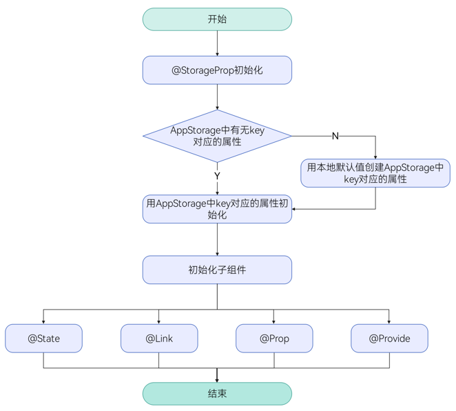
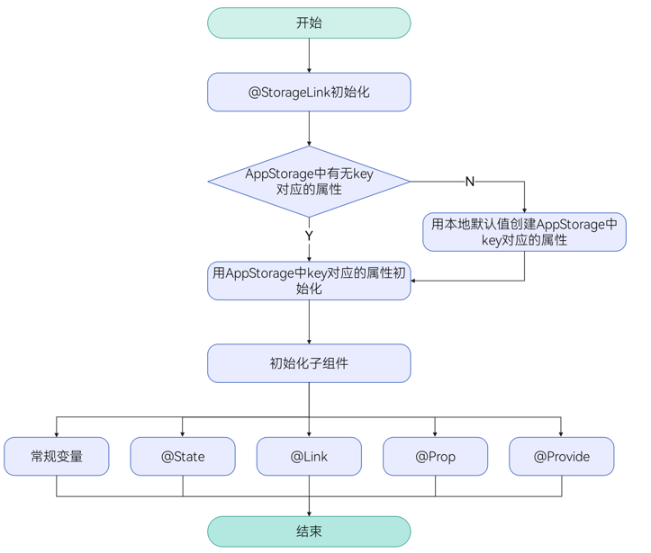

# AppStorage：应用全局的UI状态存储
<!--Kit: ArkUI-->
<!--Subsystem: ArkUI-->
<!--Owner: @zzq212050299-->
<!--Designer: @s10021109-->
<!--Tester: @TerryTsao-->
<!--Adviser: @zhang_yixin13-->

在阅读本文档前，建议提前阅读：[状态管理概述](./arkts-state-management-overview.md)，从而对状态管理框架中AppStorage的定位有一个宏观了解。

AppStorage是与应用进程绑定的全局UI状态存储中心，由UI框架在应用启动时创建，将UI状态数据存储于运行内存，实现应用级全局状态共享。

作为应用的“中枢”，AppStorage是[持久化数据PersistentStorage](arkts-persiststorage.md)和[环境变量Environment](arkts-environment.md)与UI交互的中转桥梁。其核心价值在于为开发者提供跨ability的大范围UI状态数据共享能力。

AppStorage提供了API接口，允许开发者在自定义组件外手动触发AppStorage对应属性的增、删、改、查操作。建议配合[AppStorage API文档](../../reference/apis-arkui/arkui-ts/ts-state-management.md#appstorage)阅读。最佳实践请参考[状态管理最佳实践](https://developer.huawei.com/consumer/cn/doc/best-practices/bpta-status-management)。

> **说明：**
>
> 多组件间状态共享和同步、状态管理和UI解耦，可以参考解决方案[基于StateStore的全局状态管理开发实践](https://developer.huawei.com/consumer/cn/doc/best-practices/bpta-global-state-management-state-store)。
>
> 不涉及UI组件同步的数据处理工作，建议[通过用户首选项实现数据持久化](https://developer.huawei.com/consumer/cn/doc/harmonyos-guides/data-persistence-by-preferences)。

## 概述

AppStorage是在应用启动时创建的单例，用于提供应用状态数据的中心存储。这些状态数据在应用级别可访问。AppStorage在应用运行过程中保留其属性。

AppStorage中保存的属性通过唯一的字符串类型属性名（key）访问，该属性可以和UI组件同步，且可以在应用业务逻辑中被访问。

AppStorage支持应用的[主线程](../../application-models/thread-model-stage.md)内多个[UIAbility](../../reference/apis-ability-kit/js-apis-app-ability-uiAbility.md)实例间的UI状态数据共享。

AppStorage中的属性通过唯一的字符串类型key值访问，支持与UI组件同步，并可在应用业务逻辑中被访问。其支持应用的[主线程](../../application-models/thread-model-stage.md)内多个[UIAbility](../../reference/apis-ability-kit/js-apis-app-ability-uiAbility.md)实例间的UI状态数据共享。

AppStorage中的属性可以被双向同步，并具有不同的功能，比如数据持久化（详见[PersistentStorage](arkts-persiststorage.md)）。这些UI状态是通过业务逻辑实现，与UI解耦，如果希望这些UI状态在UI中使用，需要用到[@StorageProp](#storageprop)和[@StorageLink](#storagelink)。

## \@StorageProp

\@StorageProp与AppStorage中对应的属性建立单向数据同步。

> **说明：**
>
> 从API version 11开始，该装饰器支持在原子化服务中使用。

### 装饰器使用规则说明

| \@StorageProp变量装饰器 | 说明                                                         |
| ----------------------- | ------------------------------------------------------------ |
| 装饰器参数              | 常量字符串，必填（字符串需要有引号）。<br/>**说明：**<br/>使用null和undefined作为key时，会隐式转换为对应的字符串，不建议该用法。                |
| 允许装饰的变量类型      | Object、class、string、number、boolean、enum类型，以及这些类型的数组。<br/>API Version 12及以上支持Map、Set、Date、undefined和null类型以及这些类型的联合类型，示例见[AppStorage支持联合类型](#appstorage支持联合类型)。<br/>嵌套类型的场景请参考[观察变化和行为表现](#观察变化和行为表现)。 <br/>**说明：**<br/>变量类型必须被指定，建议和AppStorage中对应属性类型相同，否则会发生类型隐式转换，从而导致应用行为异常。|
| 不允许装饰的变量类型                | 不支持装饰Function类型。 |
| 同步类型                | 单向同步：从AppStorage的对应属性到组件的状态变量。<br/>组件本地的修改是允许的，但是AppStorage中给定的属性一旦发生变化，将覆盖本地的修改。 |
| 被装饰变量的初始值      | 必须本地初始化，如果AppStorage实例中不存在属性，则用该初始值初始化该属性，并存入AppStorage中。 |

### 变量的传递/访问规则说明

| 传递/访问      | 说明                                       |
| ---------- | ---------------------------------------- |
| 从父节点初始化和更新 | 禁止从父节点初始化和更新@StorageProp。仅支持使用AppStorage中对应key的属性进行初始化，如果不存在对应key，则使用本地默认值进行初始化。 |
| 初始化子节点     | 支持，可用于初始化[\@State](./arkts-state.md)、[\@Link](./arkts-link.md)、[\@Prop](./arkts-prop.md)、[\@Provide](./arkts-provide-and-consume.md)。 |
| 是否支持组件外访问  | 否。                                       |

  **图1** \@StorageProp初始化规则图示  



### 观察变化和行为表现

**观察变化**

- 当装饰的类型为boolean、string、number时，可以观察到数值的变化。

- 当装饰的数据类型为class或者Object时，可以观察到对象整体赋值和属性变化（详见[从ui内部使用appstorage](#从ui内部使用appstorage)）。

- 当装饰的对象是数组时，可以观察到数组添加、删除、更新数组单元的变化。

- 当装饰的对象是Date时，可以观察到Date整体的赋值，以及通过调用Date的接口`setFullYear`、`setMonth`、`setDate`、`setHours`、`setMinutes`、`setSeconds`、`setMilliseconds`、`setTime`、`setUTCFullYear`、`setUTCMonth`、`setUTCDate`、`setUTCHours`、`setUTCMinutes`、`setUTCSeconds`、`setUTCMilliseconds`更新Date的属性。详见[装饰Date类型变量](#装饰date类型变量)。

- 当装饰的变量是Map时，可以观察到Map整体的赋值，以及通过调用Map的接口`set`、`clear`、`delete`更新Map的值。详见[装饰Map类型变量](#装饰map类型变量)。

- 当装饰的变量是Set时，可以观察到Set整体的赋值，以及通过调用Set的接口`add`、`clear`、`delete`更新Set的值。详见[装饰Set类型变量](#装饰set类型变量)。

**框架行为**

1. \@StorageProp(key)装饰的数值发生变化，不会同步写回AppStorage对应的属性；变化会触发自定义组件重新渲染，并且该变动仅作用于当前组件的私有成员变量，其他绑定该key的数据不会同步改变。

2. 当AppStorage中对应key的属性发生改变时，所有\@StorageProp(key)装饰的变量都会同步更新，本地的修改将被覆盖。

## \@StorageLink

\@StorageLink与AppStorage中对应的属性建立双向数据同步。

> **说明：**
>
> 从API version 11开始，该装饰器支持在原子化服务中使用。

### 装饰器使用规则说明

| \@StorageLink变量装饰器 | 说明                                                         |
| ----------------------- | ------------------------------------------------------------ |
| 装饰器参数              | key：常量字符串，必填（字符串需要有引号）。<br/>**注意：**<br/>使用null和undefined作为key时，会隐式转换为对应的字符串，不建议该用法。                  |
| 允许装饰的变量类型      | Object、class、string、number、boolean、enum类型，以及这些类型的数组。<br/>API Version 12及以上支持Map、Set、Date、undefined和null类型以及这些类型的联合类型，示例见[AppStorage支持联合类型](#appstorage支持联合类型)。<br/>嵌套类型的场景请参考[观察变化和行为表现](#观察变化和行为表现-1)。 <br/>**注意：**<br/>变量类型必须被指定，建议和AppStorage中对应属性类型相同，否则会发生类型隐式转换，从而导致应用行为异常。 |
| 不允许装饰的变量类型                | 不支持装饰Function类型。 |
| 同步类型                | 双向同步：从AppStorage的对应属性到自定义组件，从自定义组件到AppStorage对应属性。 |
| 被装饰变量的初始值      | 必须本地初始化，如果AppStorage实例中不存在属性，则用该初始值初始化该属性，并存入AppStorage中。 |


### 变量的传递/访问规则说明

| 传递/访问      | 说明                                       |
| ---------- | ---------------------------------------- |
| 从父节点初始化和更新 | 禁止。                                      |
| 初始化子节点     | 支持，可用于初始化常规变量、\@State、\@Link、\@Prop、\@Provide。 |
| 是否支持组件外访问  | 否。                                       |

  **图2** \@StorageLink初始化规则图示  



### 观察变化和行为表现

**观察变化**

- 装饰的数据类型为boolean、string、number时，可以观察到数值变化。

- 装饰的数据类型为class或Object时，可以观察到对象整体赋值和属性变化。（详见[从ui内部使用appstorage](#从ui内部使用appstorage)）。

- 当装饰的对象是数组时，可以观察到数组添加、删除、更新数组单元的变化。

- 当装饰的对象是Date时，可以观察到Date整体的赋值，以及通过调用Date的接口`setFullYear`, `setMonth`, `setDate`, `setHours`, `setMinutes`, `setSeconds`, `setMilliseconds`, `setTime`, `setUTCFullYear`, `setUTCMonth`, `setUTCDate`, `setUTCHours`, `setUTCMinutes`, `setUTCSeconds`, `setUTCMilliseconds` 更新Date的属性。详见[装饰Date类型变量](#装饰date类型变量)。

- 当装饰的变量是Map时，可以观察到Map整体的赋值，以及通过调用Map的接口`set`、`clear`、`delete`更新Map的值。详见[装饰Map类型变量](#装饰map类型变量)。

- 当装饰的变量是Set时，可以观察到Set的整体赋值，以及通过调用Set的接口`add`、`clear`、`delete`更新Set的值。详见[装饰Set类型变量](#装饰set类型变量)。

**框架行为**

1. 当\@StorageLink(key)装饰的数值发生变化时，修改将被同步回AppStorage对应key的属性中。

2. AppStorage中key对应的数据一旦改变，其绑定的所有的数据（包括双向\@StorageLink和单向\@StorageProp）都将被同步修改。

3. `@StorageLink(key)`装饰的数据是状态变量，其变化不仅会同步到AppStorage，还会触发自定义组件的重新渲染。


## 限制条件

1. \@StorageProp/\@StorageLink的参数必须为string类型，否则编译期会报错。

    ```ts
    AppStorage.setOrCreate('propA', 47);

    // 错误写法，编译报错
    @StorageProp() storageProp: number = 1;
    @StorageLink() storageLink: number = 2;

    // 正确写法
    @StorageProp('propA') storageProp: number = 1;
    @StorageLink('propA') storageLink: number = 2;
    ```

2. \@StorageProp与\@StorageLink不支持装饰Function类型的变量，框架会抛出运行时错误。

3. AppStorage与[PersistentStorage](arkts-persiststorage.md)以及[Environment](arkts-environment.md)配合使用时，需要注意以下几点：

    1. 在AppStorage中创建属性后，调用PersistentStorage.[persistProp](../../reference/apis-arkui/arkui-ts/ts-state-management.md#persistpropdeprecated)接口时，会使用AppStorage中已存在的值，并覆盖PersistentStorage中的同名属性。因此，建议使用相反的调用顺序。反例可见[在PersistentStorage之前访问AppStorage中的属性](arkts-persiststorage.md#在persistentstorage之前访问appstorage中的属性)。

    2. 如果在AppStorage中已创建属性，再调用Environment.[envProp](../../reference/apis-arkui/arkui-ts/ts-state-management.md#envprop10)创建同名属性，会调用失败。因为AppStorage已有同名属性，Environment环境变量不会再写入AppStorage中，所以建议不要在AppStorage中使用Environment预置环境变量名。

4. 状态装饰器装饰的变量，改变会引起UI的渲染更新。如果改变的变量仅用于消息传递，不用于UI更新，推荐使用emitter方式。具体示例可见[不建议借助@StorageLink的双向同步机制实现事件通知](#不建议借助storagelink的双向同步机制实现事件通知)。

5. AppStorage同一进程内共享，UIAbility和<!--Del-->[<!--DelEnd-->UIExtensionAbility<!--Del-->](../../application-models/uiextensionability-sys.md)<!--DelEnd-->是两个进程，所以在<!--Del-->[<!--DelEnd-->UIExtensionAbility<!--Del-->](../../application-models/uiextensionability-sys.md)<!--DelEnd-->中不共享主进程的AppStorage。

## 使用场景

### 从应用逻辑使用AppStorage和LocalStorage

AppStorage是单例，其所有API均为静态方法，使用方法类似于LocalStorage中对应的非静态方法。

```ts
AppStorage.setOrCreate('propA', 47);

let storage: LocalStorage = new LocalStorage();
storage.setOrCreate('propA',17);
let propA: number | undefined = AppStorage.get('propA'); // propA in AppStorage == 47, propA in LocalStorage == 17
let link1: SubscribedAbstractProperty<number> = AppStorage.link('propA'); // link1.get() == 47
let link2: SubscribedAbstractProperty<number> = AppStorage.link('propA'); // link2.get() == 47
let prop: SubscribedAbstractProperty<number> = AppStorage.prop('propA'); // prop.get() == 47

link1.set(48); // 双向同步: link1.get() == link2.get() == prop.get() == 48
prop.set(1); // 单向同步: prop.get() == 1; 但 link1.get() == link2.get() == 48
link1.set(49); // 双向同步: link1.get() == link2.get() == prop.get() == 49

storage.get<number>('propA') // == 17
storage.set('propA', 101);
storage.get<number>('propA') // == 101

AppStorage.get<number>('propA') // == 49
link1.get() // == 49
link2.get() // == 49
prop.get() // == 49
```


### 从UI内部使用AppStorage

@StorageLink与AppStorage配合使用，通过AppStorage中的属性创建双向数据同步。
@StorageProp与AppStorage配合使用，通过AppStorage中的属性创建单向数据同步。

<!-- @[appstorage_page_two](https://gitcode.com/openharmony/applications_app_samples/blob/master/code/DocsSample/ArkUISample/AppStorage/entry/src/main/ets/pages/PageTwo.ets) -->
### AppStorage支持联合类型

在下面的示例中，变量linkA的类型为number | null，变量linkB的类型为number | undefined。Text组件初始化分别显示为null和undefined，点击切换为数字，再次点击切换回null和undefined。

<!-- @[appstorage_page_three](https://gitcode.com/openharmony/applications_app_samples/blob/master/code/DocsSample/ArkUISample/AppStorage/entry/src/main/ets/pages/PageThree.ets) -->
### 装饰Date类型变量

> **说明：**
>
> 从API version 12开始，AppStorage支持Date类型。

在下面的示例中，@StorageLink装饰的selectedDate类型为Date。点击Button改变selectedDate的值，视图会随之刷新。

<!-- @[appstorage_page_four](https://gitcode.com/openharmony/applications_app_samples/blob/master/code/DocsSample/ArkUISample/AppStorage/entry/src/main/ets/pages/PageFour.ets) -->
### 装饰Map类型变量

> **说明：**
>
> 从API version 12开始，AppStorage支持Map类型。

在下面的示例中，@StorageLink装饰的message类型为Map\<number, string\>，点击Button改变message的值，视图会随之刷新。

<!-- @[appstorage_page_five](https://gitcode.com/openharmony/applications_app_samples/blob/master/code/DocsSample/ArkUISample/AppStorage/entry/src/main/ets/pages/PageFive.ets) -->

### 装饰Set类型变量

> **说明：**
>
> 从API version 12开始，AppStorage支持Set类型。

在下面的示例中，@StorageLink装饰的memberSet类型为Set\<number\>，点击Button改变memberSet的值，视图会随之刷新。

<!-- @[appstorage_page_six](https://gitcode.com/openharmony/applications_app_samples/blob/master/code/DocsSample/ArkUISample/AppStorage/entry/src/main/ets/pages/PageSix.ets) -->

## AppStorage使用建议

### 不建议借助@StorageLink的双向同步机制实现事件通知

不建议使用@StorageLink和AppStorage的双向同步机制来实现事件通知。AppStorage中的变量可能绑定在多个页面的组件中，但事件通知不一定需要通知到所有这些组件。此外，当这些@StorageLink装饰的变量在UI中使用时，会触发UI刷新，造成不必要的性能影响。

示例代码中，`TapImage`中的点击事件会触发`AppStorage`中`tapIndex`对应属性的改变。由于`@StorageLink`是双向同步的，修改会同步回`AppStorage`中，因此所有绑定`AppStorage`的`tapIndex`自定义组件都能感知到`tapIndex`的变化。使用`@Watch`监听到`tapIndex`的变化后，修改状态变量`tapColor`，从而触发UI刷新（此处`tapIndex`未直接绑定在UI上，因此`tapIndex`的变化不会直接触发UI刷新）。

使用该机制实现事件通知时，应确保AppStorage中的变量不直接被绑定到UI上，同时控制[@Watch](./arkts-watch.md)函数的复杂度。如果@Watch函数执行时间过长，会影响UI刷新效率。

<!-- @[appstorage_page_seven](https://gitcode.com/openharmony/applications_app_samples/blob/master/code/DocsSample/ArkUISample/AppStorage/entry/src/main/ets/pages/PageSeven.ets) -->

相比借助@StorageLink的双向同步机制实现事件通知，开发者可以使用emit订阅某个事件并接收事件回调的方式来减少开销，增强代码的可读性。

> **说明：**
>
> emit接口不支持在Previewer预览器中使用。

<!-- @[appstorage_page_eight](https://gitcode.com/openharmony/applications_app_samples/blob/master/code/DocsSample/ArkUISample/AppStorage/entry/src/main/ets/pages/PageEight.ets) -->

以上通知事件逻辑简单，也可以简化成三元表达式。

<!-- @[appstorage_page_nine](https://gitcode.com/openharmony/applications_app_samples/blob/master/code/DocsSample/ArkUISample/AppStorage/entry/src/main/ets/pages/PageNine.ets) -->

### \@StorageProp和AppStorage接口配合使用时，需要注意更新规则

使用setOrCreate/set接口更新key的值时，如果值相同，setOrCreate不会通知\@StorageLink/\@StorageProp更新，但因为\@StorageProp本身有数据副本，更改值不会同步给AppStorage，这会导致开发者误认己通过AppStorage改了值，但实际上未通知\@StorageProp更新值的情况。
示例如下。

<!-- @[appstorage_page_ten](https://gitcode.com/openharmony/applications_app_samples/blob/master/code/DocsSample/ArkUISample/AppStorage/entry/src/main/ets/pages/PageTen.ets) -->

``` TypeScript
AppStorage.setOrCreate('propA', false);

@Entry
@Component
struct PageTenIndex {
  @StorageProp('propA') @Watch('onChange') propA: boolean = false;

  onChange() {
    console.info(`propA change`);
  }

  aboutToAppear(): void {
    this.propA = true;
  }

  build() {
    Column() {
      Text(`${this.propA}`)
      Button('change')
        .onClick(() => {
          AppStorage.setOrCreate('propA', false);
          console.info(`propA: ${this.propA}`);
        })
    }
  }
}
```

上述示例，在点击事件之前，propA的值已经在本地被更改为true，而AppStorage中存的值仍为false。当点击事件通过setOrCreate接口尝试更新propA的值为false时，由于AppStorage中的值为false，两者相等，不会触发更新同步，因此@StorageProp的值仍为true。

实现二者同步有以下两种方式：
1. 将\@StorageProp更改为\@StorageLink。
2. 本地更改值的方式变为使用AppStorage.setOrCreate('propA', true)的方式。
