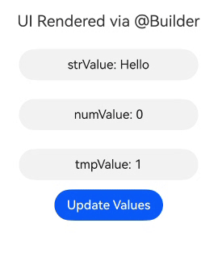
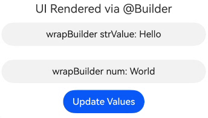
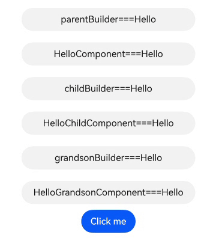
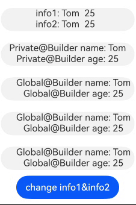
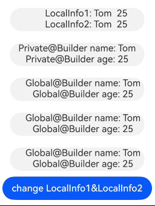

# \@Builder装饰器：自定义构建函数
<!--Kit: ArkUI-->
<!--Subsystem: ArkUI-->
<!--Owner: @zhangboren-->
<!--Designer: @zhangboren-->
<!--Tester: @TerryTsao-->
<!--Adviser: @zhang_yixin13-->

ArkUI提供轻量的UI元素复用机制\@Builder，其内部UI结构固定，仅与使用方进行数据传递。开发者可将重复使用的UI元素抽象成函数，在build函数中调用。

\@Builder装饰的函数也称为“自定义构建函数”。

在阅读本文档前，建议提前阅读：[基本语法概述](./arkts-basic-syntax-overview.md)、[声明式UI描述](./arkts-declarative-ui-description.md)、[自定义组件-创建自定义组件](./arkts-create-custom-components.md)。

@Builder装饰器和[@Component装饰器](./arkts-create-custom-components.md#component)在功能和使用方式上的主要差异：

1. @Builder装饰器用于封装可复用的UI结构，通过提取重复的布局代码提高开发效率。该装饰器严格禁止在其内部定义状态变量或使用生命周期函数，必须通过参数传递或者访问所属组件的状态变量完成数据交互。

2. 在ArkUI框架中，@Component装饰器作为封装复杂UI组件的核心机制，允许开发者通过组合多个基础组件来构建可复用的复合界面。该装饰器不仅支持内部状态变量的定义，还能完整管理组件的生命周期。

> **说明：**
>
> 从API version 9开始，该装饰器支持在ArkTS卡片中使用。
>
> 从API version 11开始，该装饰器支持在原子化服务中使用。


## 装饰器使用说明

\@Builder装饰器有两种使用方式，分别是定义在自定义组件内部的[私有自定义构建函数](#私有自定义构建函数)和定义在全局的[全局自定义构建函数](#全局自定义构建函数)。

### 私有自定义构建函数

示例：

<!-- @[private_custom_constructor](https://gitcode.com/openharmony/applications_app_samples/blob/master/code/DocsSample/ArkUISample/BuilderComponent/entry/src/main/ets/pages/PrivateCustomConstructor.ets) -->

``` TypeScript
@Entry
@Component
struct BuilderDemo {
  @Builder
  showTextBuilder() {
    // @Builder装饰此函数，使其能以链式调用的方式配置并构建Text组件
    Text('Hello World')
      .fontSize(30)
      .fontWeight(FontWeight.Bold)
  }

  @Builder
  showTextValueBuilder(param: string) {
    Text(param)
      .fontSize(30)
      .fontWeight(FontWeight.Bold)
  }

  build() {
    Column() {
      // 无参数
      this.showTextBuilder()
      // 有参数
      this.showTextValueBuilder('Hello @Builder')
    }
  }
}
```

使用方法：

- 允许在自定义组件内定义一个或多个@Builder函数，该函数被认为是该组件的私有、特殊类型的成员函数。

- 私有自定义构建函数允许在自定义组件内、build函数和其他自定义构建函数中调用。

- 在自定义组件中，`this`指代当前所属组件，组件的状态变量可在自定义构建函数内访问。建议通过`this`访问组件的状态变量，而不是通过参数传递。

### 全局自定义构建函数

示例：

<!-- @[global_custom_constructor](https://gitcode.com/openharmony/applications_app_samples/blob/master/code/DocsSample/ArkUISample/BuilderComponent/entry/src/main/ets/pages/GlobalCustomConstructor.ets) -->

``` TypeScript
@Builder
function showTextBuilder() {
  Text('Hello World')
    .fontSize(30)
    .fontWeight(FontWeight.Bold)
}
@Entry
@Component
struct BuilderSample {
  build() {
    Column() {
      showTextBuilder()
    }
  }
}
```

- 如果不涉及组件状态变量变化，建议使用全局的自定义构建函数。

- 全局自定义构建函数允许在build函数和其他自定义构建函数中调用。


## 参数传递规则

自定义构建函数的参数传递有[按回调传递](#按回调传递参数)，[按引用传递](#按引用传递参数)和[按值传递](#按值传递参数)，均需遵守以下规则：

- \@Builder装饰的函数参数类型不允许为undefined、null和返回undefined、null的表达式。

- 在\@Builder装饰的函数内部，不允许改变参数值。

- \@Builder内UI语法遵循[UI语法规则](arkts-create-custom-components.md#build函数)。

- 按回调传递和按引用传递时，支持\@Builder函数内UI组件刷新。按引用传递只在传入一个参数且该参数直接传入对象字面量时生效，有多个参数时不支持@Builder函数内UI组件刷新。

- 使用引用传递时，在@Builder函数中不能修改参数的属性，但使用`UIUtils.makeBinding`并传入写回调时，我们可以在@Builder函数内修改属性，并同步到调用@Builder的组件中。

### 按回调传递参数

从API version 20开始，开发者可以通过使用`UIUtils.makeBinding()`函数、`Binding`类和`MutableBinding`类实现\@Builder函数中状态变量的刷新。详细用例见[\@Builder支持状态变量刷新](#builder支持状态变量刷新)。

使用`UIUtils.makeBinding()`包装读取状态变量的回调函数作为参数传入@Builder函数，可以支持@Builder函数中UI组件刷新；`UIUTils.makeBinding()`中额外传入写状态变量的回调函数可以进一步将@Builder内对参数改变，传递到调用Builder函数的组件中。

<!-- @[by_makebinding_parameter_passing](https://gitcode.com/openharmony/applications_app_samples/blob/master/code/DocsSample/ArkUISample/BuilderComponent/entry/src/main/ets/pages/ParameterMakeBinding.ets) -->

``` TypeScript
import { Binding, MutableBinding, UIUtils } from '@kit.ArkUI';

@Builder
function customButton(num1: Binding<number>, num2: MutableBinding<number>) {
  Row() {
    Column() {
      Text(`number1: ${num1.value}, number2: ${num2.value}`)
      Button(`only change number2`)
        .onClick(() => {
          // 赋值MutableBinding类型传递该修改到父组件中。
          num2.value += 1;
        })
    }
  }
}

@Entry
@ComponentV2
struct ParameterMakeBinding {
  @Local number1: number = 5;
  @Local number2: number = 12;

  build() {
    Column() {
      customButton(
        // 使用makeBinding传入参数，需要传入读回调，返回Binding类型，支持@Builder内组件UI刷新。
        UIUtils.makeBinding<number>(() => this.number1),
        // makeBinding额外传入写回调时返回MutableBinding类型，支持@Builder内组件UI刷新并且同步属性修改。
        UIUtils.makeBinding<number>(
          () => this.number2,
          (val: number) => {
            this.number2 = val;
          })
      )
    }
  }
}
```

### 按引用传递参数

按引用传递参数时，传递的参数可为状态变量，且状态变量的改变会引起\@Builder函数内的UI刷新。

<!-- @[by_reference_parameter_passing](https://gitcode.com/openharmony/applications_app_samples/blob/master/code/DocsSample/ArkUISample/BuilderComponent/entry/src/main/ets/pages/ParameterReference.ets) -->

``` TypeScript
class Tmp {
  public paramA1: string = '';
}

@Builder
function overBuilderByReference(params: Tmp) {
  Row() {
    Text(`UseStateVarByReference: ${params.paramA1} `)
  }
}

@Entry
@Component
struct ParameterReference {
  @State label: string = 'Hello';

  build() {
    Column() {
      // 在父组件中调用overBuilderByReference组件时，
      // 把this.label通过引用传递的方式传给overBuilderByReference组件。
      overBuilderByReference({ paramA1: this.label })
      Button('Click me').onClick(() => {
        // 单击Click me后，UI文本从Hello更改为ArkUI。
        this.label = 'ArkUI';
      })
    }
  }
}
```

### 按值传递参数

调用\@Builder装饰的函数默认按值传递。当传递的参数为状态变量时，状态变量的改变不会引起\@Builder函数内的UI刷新。所以当使用状态变量的时候，推荐使用[按回调传递](#按回调传递参数)或[按引用传递](#按引用传递参数)。

<!-- @[by_value_parameter_passing](https://gitcode.com/openharmony/applications_app_samples/blob/master/code/DocsSample/ArkUISample/BuilderComponent/entry/src/main/ets/pages/ParameterValue.ets) -->

``` TypeScript
@Builder
function overBuilderByValue(paramA1: string) {
  Row() {
    Text(`UseStateVarByValue: ${paramA1} `)
  }
}

@Entry
@Component
struct ParameterValue {
  @State label: string = 'Hello';

  build() {
    Column() {
      overBuilderByValue(this.label)
    }
  }
}
```

## 限制条件

1. \@Builder装饰的函数内部在没有使用[MutableBinding](../../reference/apis-arkui/js-apis-StateManagement.md#mutablebindingt20)时不允许修改参数值，修改不会触发UI刷新。若[按引用传递参数](#按引用传递参数)且仅传入一个参数时，修改参数内部的属性会抛出运行时错误。使用MutableBinding可以帮助开发者在\@Builder装饰的函数内部修改参数值，请参考[在@Builder装饰的函数内部修改入参内容](#在builder装饰的函数内部修改入参内容)。

2. \@Builder按引用传递且仅传入一个参数时，才会触发动态渲染UI。请参考[按引用传递参数](#按引用传递参数)。

3. 如果\@Builder传入的参数是两个或两个以上，不会触发动态渲染UI，请参考[@Builder存在两个或两个以上参数](#builder存在两个或两个以上参数)。

4. \@Builder传入的参数中同时包含按值传递和按引用传递，不会触发动态渲染UI，请参考[@Builder存在两个或两个以上参数](#builder存在两个或两个以上参数)。

5. \@Builder的参数必须按照对象字面量的形式，把所需属性一一传入，才会触发动态渲染UI，请参考[@Builder存在两个或两个以上参数](#builder存在两个或两个以上参数)。


## 使用场景

### 自定义组件内使用自定义构建函数

创建私有的`@Builder`函数，在`Column`中使用`this.builder()`调用。通过`aboutToAppear`生命周期函数和按钮的点击事件更新`builderValue`，实现UI的动态渲染。

<!-- @[using_custom_builder_function_in_custom_component](https://gitcode.com/openharmony/applications_app_samples/blob/master/code/DocsSample/ArkUISample/BuilderComponent/entry/src/main/ets/pages/InCustomComponent.ets) -->

``` TypeScript
@Entry
@Component
struct PrivateBuilder {
  @State builderValue: string = 'Hello';

  @Builder
  builder() {
    Column() {
      Text(this.builderValue)
        .width(230)
        .height(40)
        .backgroundColor('#ffeae5e5')
        .borderRadius(20)
        .margin(12)
        .textAlign(TextAlign.Center)
    }
  }

  aboutToAppear(): void {
    setTimeout(() => {
      this.builderValue = 'Hello World';
    }, 2000);
  }

  build() {
    Row() {
      Column() {
        Text(this.builderValue)
          .width(230)
          .height(40)
          .backgroundColor('#ffeae5e5')
          .borderRadius(20)
          .textAlign(TextAlign.Center)
        this.builder()
        Button('Click to change the builderValue')
          .onClick(() => {
            this.builderValue = 'builderValue was clicked';
          })
      }
      .height('100%')
      .width('100%')
    }
  }
}
```
示例效果图


### 全局自定义构建函数

创建全局的`@Builder`函数，并在`Column`中通过`overBuilder()`方式调用。传递参数时，可以使用对象字面量形式，无论是简单类型还是复杂类型，值的任何变化都会触发UI界面的刷新。

<!-- @[global_custom_builder_function](https://gitcode.com/openharmony/applications_app_samples/blob/master/code/DocsSample/ArkUISample/BuilderComponent/entry/src/main/ets/pages/GlobalCustomBuilder.ets) -->

``` TypeScript
class ChildTmp {
  public val: number = 1;
}

class ParamTmp {
  public strValue: string = 'Hello';
  public numValue: number = 0;
  public tmpValue: ChildTmp = new ChildTmp();
  public arrayTmpValue: Array<ChildTmp> = [];
}

@Builder
function overBuilder(param: ParamTmp) {
  Column() {
    Text(`strValue: ${param.strValue}`)
      .width(230)
      .height(40)
      .margin(12)
      .backgroundColor('#0d000000')
      .fontColor('#e6000000')
      .borderRadius(20)
      .textAlign(TextAlign.Center)
    Text(`numValue: ${param.numValue}`)
      .width(230)
      .height(40)
      .margin(12)
      .backgroundColor('#0d000000')
      .fontColor('#e6000000')
      .borderRadius(20)
      .textAlign(TextAlign.Center)
    Text(`tmpValue: ${param.tmpValue.val}`)
      .width(230)
      .height(40)
      .margin(12)
      .backgroundColor('#0d000000')
      .fontColor('#e6000000')
      .borderRadius(20)
      .textAlign(TextAlign.Center)
    ForEach(param.arrayTmpValue, (item: ChildTmp) => {
      ListItem() {
        Text(`arrayTmpValue: ${item.val}`)
          .width(230)
          .height(40)
          .margin(12)
          .backgroundColor('#0d000000')
          .fontColor('#e6000000')
          .borderRadius(20)
          .textAlign(TextAlign.Center)
      }
    }, (item: ChildTmp) => JSON.stringify(item))
  }
}

@Entry
@Component
struct ParentDemo {
  @State objParam: ParamTmp = new ParamTmp();

  build() {
    Column() {
      Text('UI Rendered via @Builder')
        .fontSize(20)
        .margin(12)
      overBuilder({
        strValue: this.objParam.strValue,
        numValue: this.objParam.numValue,
        tmpValue: this.objParam.tmpValue,
        arrayTmpValue: this.objParam.arrayTmpValue
      })
      Button('Update Values').onClick(() => {
        this.objParam.strValue = 'Hello World';
        this.objParam.numValue = 1;
        this.objParam.tmpValue.val = 8;
        const childValue: ChildTmp = {
          val: 2
        }
        this.objParam.arrayTmpValue.push(childValue);
      })
    }
    .height('100%')
    .width('100%')
  }
}
```
示例效果图



### 修改装饰器修饰的变量触发UI刷新

在该场景中，`@Builder`被用来展示Text组件，不会参与动态UI刷新。Text组件中值的变化是通过使用装饰器的特性，监听到值的改变触发的UI刷新，而不是通过`@Builder`的能力触发的。

<!-- @[changing_by_the_decorator_triggers_ui_rerendering](https://gitcode.com/openharmony/applications_app_samples/blob/master/code/DocsSample/ArkUISample/BuilderComponent/entry/src/main/ets/pages/ChangingByDecorator.ets) -->

``` TypeScript
class ChildrenTmp {
  public strValue: string = 'Hello';
}

@Entry
@Component
struct ParentSample {
  @State objParam: ChildrenTmp = new ChildrenTmp();
  @State label: string = 'World';

  @Builder
  privateBuilder() {
    Column() {
      Text(`wrapBuilder strValue: ${this.objParam.strValue}`)
        .width(350)
        .height(40)
        .margin(12)
        .backgroundColor('#0d000000')
        .fontColor('#e6000000')
        .borderRadius(20)
        .textAlign(TextAlign.Center)
      Text(`wrapBuilder num: ${this.label}`)
        .width(350)
        .height(40)
        .margin(12)
        .backgroundColor('#0d000000')
        .fontColor('#e6000000')
        .borderRadius(20)
        .textAlign(TextAlign.Center)
    }
  }

  build() {
    Column() {
      Text('UI Rendered via @Builder')
        .fontSize(20)
      this.privateBuilder()
      Button('Update Values').onClick(() => {
        this.objParam.strValue = 'strValue Hello World';
        this.label = 'label Hello World';
      })
    }
    .height('100%')
    .width('100%')
  }
}
```
示例效果图



### 将@Builder装饰的函数当作CustomBuilder类型使用

当参数类型为`CustomBuilder`时，可以传入定义的`@Builder`函数。因为`CustomBuilder`实际上是`Function(() => any)`或`void`类型，而`@Builder`也是`Function`类型。所以通过传入`@Builder`可以实现特定效果。
全局`@Builder`函数当作`CustomBuilder`类型传递时需要绑定this上下文，开发者可以直接调用全局`@Builder`函数，编译工具链会自动生成绑定this上下文的代码。

<!-- @[using_function_decorated_with_builder_as_custom_builder](https://gitcode.com/openharmony/applications_app_samples/blob/master/code/DocsSample/ArkUISample/BuilderComponent/entry/src/main/ets/pages/AsCustomBuilder.ets) -->

``` TypeScript
@Builder
function overBuilderDemo() {
  Row() {
    Text('Global Builder')
      .fontSize(30)
      .fontWeight(FontWeight.Bold)
  }
}

@Entry
@Component
struct customBuilderDemo {
  @State arr: number[] = [0, 1, 2, 3, 4];

  @Builder
  privateBuilder() {
    Row() {
      Text('Private Builder')
        .fontSize(30)
        .fontWeight(FontWeight.Bold)
    }
  }

  build() {
    Column() {
      List({ space: 10 }) {
        ForEach(this.arr, (item: number) => {
          ListItem() {
            Text(`${item}`)
              .width('100%')
              .height(100)
              .fontSize(16)
              .textAlign(TextAlign.Center)
              .borderRadius(10)
              .backgroundColor(0xFFFFFF)
          }
          .swipeAction({
            start: {
              builder: overBuilderDemo() // 编译工具链会自动绑定this上下文
            },
            end: {
              builder: () => {
                // 在箭头函数中调用局部@Builder会自动绑定this上下文，无需编译工具链处理
                this.privateBuilder()
              }
            }
          })
        }, (item: number) => JSON.stringify(item))
      }
    }
  }
}
```
示例效果图


### 多层\@Builder函数嵌套

在\@Builder函数内调用自定义组件或其他\@Builder函数，实现多个\@Builder嵌套使用。若要实现最内层的\@Builder动态UI刷新功能，每层调用\@Builder的地方必须使用按引用传递的方式。这里`$$`不是必须的参数形式，可以换成其他名称。

<!-- @[nested_builder_functions](https://gitcode.com/openharmony/applications_app_samples/blob/master/code/DocsSample/ArkUISample/BuilderComponent/entry/src/main/ets/pages/NestedBuilderFunctions.ets) -->

``` TypeScript
class ThisTmp {
  public paramA1: string = '';
}

@Builder
function parentBuilder($$: ThisTmp) {
  Row() {
    Column() {
      Text(`parentBuilder===${$$.paramA1}`)
        .width(300)
        .height(40)
        .margin(10)
        .backgroundColor('#0d000000')
        .fontColor('#e6000000')
        .borderRadius(20)
        .textAlign(TextAlign.Center)
      HelloComponent({ message: $$.paramA1 })
      childBuilder({ paramA1: $$.paramA1 })
    }
  }
}

@Component
struct HelloComponent {
  @Prop message: string = '';

  build() {
    Row() {
      Text(`HelloComponent===${this.message}`)
        .width(300)
        .height(40)
        .margin(10)
        .backgroundColor('#0d000000')
        .fontColor('#e6000000')
        .borderRadius(20)
        .textAlign(TextAlign.Center)
    }
  }
}

@Builder
function childBuilder($$: ThisTmp) {
  Row() {
    Column() {
      Text(`childBuilder===${$$.paramA1}`)
        .width(300)
        .height(40)
        .margin(10)
        .backgroundColor('#0d000000')
        .fontColor('#e6000000')
        .borderRadius(20)
        .textAlign(TextAlign.Center)
      HelloChildComponent({ message: $$.paramA1 })
      grandsonBuilder({ paramA1: $$.paramA1 })
    }
  }
}

@Component
struct HelloChildComponent {
  @Prop message: string = '';

  build() {
    Row() {
      Text(`HelloChildComponent===${this.message}`)
        .width(300)
        .height(40)
        .margin(10)
        .backgroundColor('#0d000000')
        .fontColor('#e6000000')
        .borderRadius(20)
        .textAlign(TextAlign.Center)
    }
  }
}

@Builder
function grandsonBuilder($$: ThisTmp) {
  Row() {
    Column() {
      Text(`grandsonBuilder===${$$.paramA1}`)
        .width(300)
        .height(40)
        .margin(10)
        .backgroundColor('#0d000000')
        .fontColor('#e6000000')
        .borderRadius(20)
        .textAlign(TextAlign.Center)
      HelloGrandsonComponent({ message: $$.paramA1 })
    }
  }
}

@Component
struct HelloGrandsonComponent {
  @Prop message: string;

  build() {
    Row() {
      Text(`HelloGrandsonComponent===${this.message}`)
        .width(300)
        .height(40)
        .margin(10)
        .backgroundColor('#0d000000')
        .fontColor('#e6000000')
        .borderRadius(20)
        .textAlign(TextAlign.Center)
    }
  }
}

@Entry
@Component
struct ParentExample {
  @State label: string = 'Hello';

  build() {
    Column() {
      parentBuilder({ paramA1: this.label })
      Button('Click me').onClick(() => {
        this.label = 'ArkUI';
      })
    }
    .height('100%')
    .width('100%')
  }
}
```
示例效果图



### \@Builder函数联合V2装饰器

由[@ObservedV2](./arkts-new-observedV2-and-trace.md)和[@Trace](./arkts-new-observedV2-and-trace.md)装饰的类对象实例具备深度观测属性变化的能力。在`@ComponentV2`装饰的自定义组件中，当调用全局Builder或局部Builder且使用值传递的方式传递参数时，修改`@Trace`装饰的对象属性可以触发UI刷新。
<!-- @[builder_function_combined_with_the_v2_decorator](https://gitcode.com/openharmony/applications_app_samples/blob/master/code/DocsSample/ArkUISample/BuilderComponent/entry/src/main/ets/pages/BuilderCombined.ets) -->

``` TypeScript
@ObservedV2
class Info {
  @Trace public name: string;
  @Trace public age: number;

  constructor(name: string, age: number) {
    this.name = name;
    this.age = age;
  }
}

@Builder
function overBuilderTest(param: Info) {
  Column() {
    Text(`Global@Builder name: ${param.name}`)
    Text(`Global@Builder age: ${param.age}`)
  }
  .width(230)
  .height(40)
  .margin(10)
  .padding({ left: 20 })
  .backgroundColor('#0d000000')
  .borderRadius(20)
}

@ComponentV2
struct ChildPage {
  @Require @Param childInfo: Info;

  build() {
    Column() {
      // 此处必须为值传递方式，如果使用引用传递的方式会被ArkTS语法拦截
      overBuilderTest(this.childInfo)
    }
  }
}

@Entry
@ComponentV2
struct ParentPage {
  info1: Info = new Info('Tom', 25);
  info2: Info = new Info('Tom', 25);

  @Builder
  privateBuilder() {
    Column() {
      Text(`Private@Builder name: ${this.info1.name}`)
      Text(`Private@Builder age: ${this.info1.age}`)
    }
    .width(230)
    .height(40)
    .margin(10)
    .backgroundColor('#0d000000')
    .borderRadius(20)
  }

  build() {
    Column() {
      Flex() {
        Column() {
          Text(`info1: ${this.info1.name}  ${this.info1.age}`) // Text1
          Text(`info2: ${this.info2.name}  ${this.info2.age}`) // Text2
        }
      }
      .width(230)
      .height(40)
      .margin(10)
      .padding({ left: 60 })
      .backgroundColor('#0d000000')
      .borderRadius(20)

      // 调用局部@Builder
      this.privateBuilder()
      // 调用全局@Builder, 此处必须为值传递方式，如果使用引用传递的方式会被ArkTS语法拦截
      overBuilderTest(this.info2)
      ChildPage({ childInfo: this.info1 }) // 调用自定义组件
      ChildPage({ childInfo: this.info2 }) // 调用自定义组件
      Button('change info1&info2')
        .onClick(() => {
          this.info1.name = 'Cat'; // 修改Text1显示的info1的name值
          this.info1.age = 18; // 修改Text1显示的info1的age值
          this.info2.name = 'Cat'; // 修改Text2显示的info2的name值
          this.info2.age = 18; // 修改Text2显示的info2的age值
        })
    }
    .height('100%')
    .width('100%')
  }
}
```
示例效果图



当通过引用传递方式向`@Builder`传递参数时，若参数为`@Local`装饰的对象，对该对象进行整体赋值会触发`@Builder`中UI刷新。

<!-- @[builder_function_combined_with_the_v2_decorator_and_local](https://gitcode.com/openharmony/applications_app_samples/blob/master/code/DocsSample/ArkUISample/BuilderComponent/entry/src/main/ets/pages/BuilderCombinedLocal.ets) -->

``` TypeScript
class LocalInfo {
  public name: string = 'Tom';
  public age: number = 25;
}

@Builder
function overBuilderLocal(param: LocalInfo) {
  Column() {
    Text(`Global@Builder name: ${param.name}`)
    Text(`Global@Builder age: ${param.age}`)
  }
  .width(230)
  .height(40)
  .margin(10)
  .padding({ left: 20 })
  .backgroundColor('#0d000000')
  .borderRadius(20)
}

@ComponentV2
struct ChildLocalPage {
  @Require @Param childLocalInfo: LocalInfo;

  build() {
    Column() {
      // 此处为引用传递方式
      overBuilderLocal({ name: this.childLocalInfo.name, age: this.childLocalInfo.age })
    }
  }
}

@Entry
@ComponentV2
struct ParentLocalPage {
  LocalInfo1: LocalInfo = { name: 'Tom', age: 25 };
  @Local LocalInfo2: LocalInfo = { name: 'Tom', age: 25 };

  @Builder
  privateBuilder() {
    Column() {
      Text(`Private@Builder name: ${this.LocalInfo1.name}`)
      Text(`Private@Builder age: ${this.LocalInfo1.age}`)
    }
    .width(230)
    .height(40)
    .margin(10)
    .backgroundColor('#0d000000')
    .borderRadius(20)
  }

  build() {
    Column() {
      Flex() {
        Column() {
          Text(`LocalInfo1: ${this.LocalInfo1.name}  ${this.LocalInfo1.age}`) // Text1
          Text(`LocalInfo2: ${this.LocalInfo2.name}  ${this.LocalInfo2.age}`) // Text2
        }
      }
      .width(230)
      .height(40)
      .margin(10)
      .padding({ left: 60 })
      .backgroundColor('#0d000000')
      .borderRadius(20)

      // 调用局部@Builder
      this.privateBuilder()
      // 调用全局@Builder, 此处为引用传递方式
      overBuilderLocal({ name: this.LocalInfo2.name, age: this.LocalInfo2.age })
      ChildLocalPage({ childLocalInfo: this.LocalInfo1 }) // 调用自定义组件
      ChildLocalPage({ childLocalInfo: this.LocalInfo2 }) // 调用自定义组件
      Button('change LocalInfo1&LocalInfo2')
        .onClick(() => {
          this.LocalInfo1 = { name: 'Cat', age: 18 }; // Text1不会刷新，原因是没有装饰器修饰监听不到值的改变
          this.LocalInfo2 = { name: 'Cat', age: 18 }; // Text2会刷新，原因是有装饰器修饰，可以监听到值的改变
        })
    }
    .height('100%')
    .width('100%')
  }
}
```
示例效果图



### 跨组件复用的全局\@Builder

在跨组件的场景中调用全局\@Builder，通过按引用传递的方式传递参数，可以实现UI的动态刷新功能。

<!-- @[global_builder_reused_across_components](https://gitcode.com/openharmony/applications_app_samples/blob/master/code/DocsSample/ArkUISample/BuilderComponent/entry/src/main/ets/pages/AcrossComponents.ets) -->

``` TypeScript
class ReusableTmp {
  public componentName: string = 'Child';
}

@Builder
function itemBuilder(params: ReusableTmp) {
  Column() {
    Text(`Builder ===${params.componentName}`)
      .width(300)
      .height(40)
      .margin(10)
      .backgroundColor('#0d000000')
      .fontColor('#e6000000')
      .borderRadius(20)
      .textAlign(TextAlign.Center)
  }
}

@Entry
@Component
struct ReusablePage {
  @State switchFlag: boolean = true;

  build() {
    Column() {
      if (this.switchFlag) {
        ReusableChildPage({ message: 'Child' })
      } else {
        ReusableChildTwoPage({ message: 'ChildTwo' })
      }
      Button('Click me')
        .onClick(() => {
          this.switchFlag = !this.switchFlag;
        })
    }
    .height('100%')
    .width('100%')
  }
}

@Reusable
@Component
struct ReusableChildPage {
  @State message: string = 'Child';

  aboutToReuse(params: Record<string, ESObject>): void {
    console.info('Recycle ====Child');
    this.message = params.message;
  }

  build() {
    Column() {
      Text(`ReusableChildPage ===${this.message}`)
        .width(300)
        .height(40)
        .margin(10)
        .backgroundColor('#0d000000')
        .fontColor('#e6000000')
        .borderRadius(20)
        .textAlign(TextAlign.Center)
      itemBuilder({ componentName: this.message })
    }
  }
}

@Reusable
@Component
struct ReusableChildTwoPage {
  @State message: string = 'ChildTwo';

  aboutToReuse(params: Record<string, ESObject>): void {
    console.info('Recycle ====ChildTwo');
    this.message = params.message;
  }

  build() {
    Column() {
      Text(`ReusableChildTwoPage ===${this.message}`)
        .width(300)
        .height(40)
        .margin(10)
        .backgroundColor('#0d000000')
        .fontColor('#e6000000')
        .borderRadius(20)
        .textAlign(TextAlign.Center)
      itemBuilder({ componentName: this.message })
    }
  }
}
```
示例效果图


### \@Builder支持状态变量刷新

从API version 20开始，开发者可以通过使用`UIUtils.makeBinding()`函数、`Binding`类和`MutableBinding`类实现\@Builder函数中状态变量的刷新。详情请参考[状态管理API文档](../../reference/apis-arkui/js-apis-StateManagement.md#makebinding20)。

<!-- @[builder_supports_state_variable_refresh](https://gitcode.com/openharmony/applications_app_samples/blob/master/code/DocsSample/ArkUISample/BuilderComponent/entry/src/main/ets/pages/BuilderSupports.ets) -->

``` TypeScript
import { Binding, MutableBinding, UIUtils } from '@kit.ArkUI';

@ObservedV2
class ClassA {
  @Trace public props: string = 'Hello';
}

@Builder
function customButton(num1: Binding<number>, num2: MutableBinding<number>) {
  Row() {
    Column() {
      Text(`number1 === ${num1.value},  number2 === ${num2.value}`)
        .width(300)
        .height(40)
        .margin(10)
        .backgroundColor('#0d000000')
        .fontColor('#e6000000')
        .borderRadius(20)
        .textAlign(TextAlign.Center)

      Button(`only change number2`)
        .onClick(() => {
          num2.value += 1;
        })
    }
  }
}

@Builder
function customButtonObj(obj1: MutableBinding<ClassA>) {
  Row() {
    Column() {
      Text(`props === ${obj1.value.props}`)
        .width(300)
        .height(40)
        .margin(10)
        .backgroundColor('#0d000000')
        .fontColor('#e6000000')
        .borderRadius(20)
        .textAlign(TextAlign.Center)

      Button(`change props`)
        .onClick(() => {
          obj1.value.props += 'Hi';
        })
    }
  }
}

@Entry
@ComponentV2
struct Single {
  @Local number1: number = 5;
  @Local number2: number = 12;
  @Local classA: ClassA = new ClassA();

  build() {
    Column() {
      Button(`change both number1 and number2`)
        .onClick(() => {
          this.number1 += 1;
          this.number2 += 2;
        })
      Text(`number1 === ${this.number1}`)
        .width(300)
        .height(40)
        .margin(10)
        .backgroundColor('#0d000000')
        .fontColor('#e6000000')
        .borderRadius(20)
        .textAlign(TextAlign.Center)
      Text(`number2 === ${this.number2}`)
        .width(300)
        .height(40)
        .margin(10)
        .backgroundColor('#0d000000')
        .fontColor('#e6000000')
        .borderRadius(20)
        .textAlign(TextAlign.Center)
      customButton(
        UIUtils.makeBinding<number>(() => this.number1),
        UIUtils.makeBinding<number>(
          () => this.number2,
          (val: number) => {
            this.number2 = val;
          })
      )
      Text(`classA.props === ${this.classA.props}`)
        .width(300)
        .height(40)
        .margin(10)
        .backgroundColor('#0d000000')
        .fontColor('#e6000000')
        .borderRadius(20)
        .textAlign(TextAlign.Center)
      customButtonObj(
        UIUtils.makeBinding<ClassA>(
          () => this.classA,
          (val: ClassA) => {
            this.classA = val;
          })
      )
    }
    .width('100%')
    .height('100%')
    .alignItems(HorizontalAlign.Center)
    .justifyContent(FlexAlign.Center)
  }
}
```
示例效果图


## 常见问题

### @Builder存在两个或两个以上参数

当存在两个或两个以上的参数时，即使通过对象字面量形式传递，值的改变也不会触发UI刷新。

【反例】

<!-- @[multiple_parameters_in_builder_incorrect_usage_1](https://gitcode.com/openharmony/applications_app_samples/blob/master/code/DocsSample/ArkUISample/BuilderComponent/entry/src/main/ets/pages/MultipleIncorrectUsage1.ets) -->

``` TypeScript
class GlobalTmp1 {
  public strValue: string = 'Hello';
}

@Builder function overBuilder1(param: GlobalTmp1, num: number) {
  Column() {
    Text(`strValue: ${param.strValue}`)
    Text(`num: ${num}`)
  }
}

@Entry
@Component
struct Parent1 {
  @State objParam: GlobalTmp1 = new GlobalTmp1();
  @State num: number = 0;
  build() {
    Column() {
      Text('UI Rendered via @Builder')
        .fontSize(20)
      // 使用了两个参数，用法错误。
      overBuilder1({strValue: this.objParam.strValue}, this.num)
      Line()
        .width('100%')
        .height(10)
        .backgroundColor('#000000').margin(10)
      Button('Update Values').onClick(() => {
        this.objParam.strValue = 'Hello World';
        this.num = 1;
      })
    }
  }
}
```

【反例】

<!-- @[multiple_parameters_in_builder_incorrect_usage_2](https://gitcode.com/openharmony/applications_app_samples/blob/master/code/DocsSample/ArkUISample/BuilderComponent/entry/src/main/ets/pages/MultipleIncorrectUsage2.ets) -->

``` TypeScript
class GlobalTmp2 {
  public strValue: string = 'Hello';
}
class SecondTmp {
  public numValue: number = 0;
}
@Builder function overBuilder2(param: GlobalTmp2, num: SecondTmp) {
  Column() {
    Text(`strValue: ${param.strValue}`)
    Text(`num: ${num.numValue}`)
  }
}

@Entry
@Component
struct Parent2 {
  @State strParam: GlobalTmp2 = new GlobalTmp2();
  @State numParam: SecondTmp = new SecondTmp();
  build() {
    Column() {
      Text('UI Rendered via @Builder')
        .fontSize(20)
      // 使用了两个参数，用法错误。
      overBuilder2({strValue: this.strParam.strValue}, {numValue: this.numParam.numValue})
      Line()
        .width('100%')
        .height(10)
        .backgroundColor('#000000').margin(10)
      Button('Update Values').onClick(() => {
        this.strParam.strValue = 'Hello World';
        this.numParam.numValue = 1;
      })
    }
  }
}
```

\@Builder只接受一个参数。当传入一个参数的时候，通过对象字面量的形式传递，值的改变会引起UI的刷新。

【正例】

<!-- @[multiple_parameters_in_builder_correct_usage](https://gitcode.com/openharmony/applications_app_samples/blob/master/code/DocsSample/ArkUISample/BuilderComponent/entry/src/main/ets/pages/MultipleCorrectUsage.ets) -->

``` TypeScript
class GlobalTmp3 {
  public strValue: string = 'Hello';
  public numValue: number = 0;
}
@Builder function overBuilder3(param: GlobalTmp3) {
  Column() {
    Text(`strValue: ${param.strValue}`)
    Text(`num: ${param.numValue}`)
  }
}

@Entry
@Component
struct Parent3 {
  @State objParam: GlobalTmp3 = new GlobalTmp3();
  build() {
    Column() {
      Text('UI Rendered via @Builder')
        .fontSize(20)
      overBuilder3({strValue: this.objParam.strValue, numValue: this.objParam.numValue})
      Line()
        .width('100%')
        .height(10)
        .backgroundColor('#000000').margin(10)
      Button('Update Values').onClick(() => {
        this.objParam.strValue = 'Hello World';
        this.objParam.numValue = 1;
      })
    }
  }
}
```

### 使用@ComponentV2装饰器触发动态刷新

在@ComponentV2装饰的组件中，配合@ObservedV2和@Trace装饰器，通过按值传递实现UI刷新功能。

【反例】

在@ComponentV2装饰的自定义组件中，使用简单数据类型不可以触发UI的刷新。

<!-- @[dynamic_rerendering_with_component_v2_incorrect_usage](https://gitcode.com/openharmony/applications_app_samples/blob/master/code/DocsSample/ArkUISample/BuilderComponent/entry/src/main/ets/pages/DynamicIncorrectUsage.ets) -->

``` TypeScript
@ObservedV2
class ParamTemp {
  @Trace public count : number = 0;
}

@Builder
function renderNumber(paramNum: number) {
  Text(`paramNum : ${paramNum}`)
    .fontSize(30)
    .fontWeight(FontWeight.Bold)
}

@Entry
@ComponentV2
struct PageBuilderIncorrectUsage {
  @Local classValue: ParamTemp = new ParamTemp();
  // 此处使用简单数据类型不支持刷新UI的能力。
  @Local numValue: number = 0;
  private progressTimer: number = -1;

  aboutToAppear(): void {
    this.progressTimer = setInterval(() => {
      if (this.classValue.count < 100) {
        this.classValue.count += 5;
        this.numValue += 5;
      } else {
        clearInterval(this.progressTimer);
      }
    }, 500);
  }

  build() {
    Column() {
      renderNumber(this.numValue)
    }
    .width('100%')
    .height('100%')
    .padding(50)
  }
}
```

【正例】

在@ComponentV2装饰器装饰的自定义组件中，只有使用@ObservedV2装饰的ParamTmpClass类和使用@Trace装饰的count属性才能触发UI刷新。

<!-- @[dynamic_rerendering_with_component_v2_correct_usage](https://gitcode.com/openharmony/applications_app_samples/blob/master/code/DocsSample/ArkUISample/BuilderComponent/entry/src/main/ets/pages/DynamicCorrectUsage.ets) -->

``` TypeScript
@ObservedV2
class ParamTmpClass {
  @Trace public count : number = 0;
}

@Builder
function renderText(param: ParamTmpClass) {
  Column() {
    Text(`param : ${param.count}`)
      .fontSize(20)
      .fontWeight(FontWeight.Bold)
  }
}

@Builder
function renderMap(paramMap: Map<string,number>) {
  Text(`paramMap : ${paramMap.get('name')}`)
    .fontSize(20)
    .fontWeight(FontWeight.Bold)
}

@Builder
function renderSet(paramSet: Set<number>) {
  Text(`paramSet : ${paramSet.size}`)
    .fontSize(20)
    .fontWeight(FontWeight.Bold)
}

@Builder
function renderNumberArr(paramNumArr: number[]) {
  Text(`paramNumArr : ${paramNumArr[0]}`)
    .fontSize(20)
    .fontWeight(FontWeight.Bold)
}

@Entry
@ComponentV2
struct PageBuilderCorrectUsage {
  @Local builderParams: ParamTmpClass = new ParamTmpClass();
  @Local mapValue: Map<string,number> = new Map();
  @Local setValue: Set<number> = new Set([0]);
  @Local numArrValue: number[] = [0];
  private progressTimer: number = -1;

  aboutToAppear(): void {
    this.progressTimer = setInterval(() => {
      if (this.builderParams.count < 100) {
        this.builderParams.count += 5;
        this.mapValue.set('name', this.builderParams.count);
        this.setValue.add(this.builderParams.count);
        this.numArrValue[0] = this.builderParams.count;
      } else {
        clearInterval(this.progressTimer);
      }
    }, 500);
  }

  @Builder
  localBuilder() {
    Column() {
      Text(`localBuilder : ${this.builderParams.count}`)
        .fontSize(20)
        .fontWeight(FontWeight.Bold)
    }
  }

  build() {
    Column() {
      this.localBuilder()
      Text(`builderParams :${this.builderParams.count}`)
        .fontSize(20)
        .fontWeight(FontWeight.Bold)
      renderText(this.builderParams)
      renderText({ count: this.builderParams.count })
      renderMap(this.mapValue)
      renderSet(this.setValue)
      renderNumberArr(this.numArrValue)
    }
    .width('100%')
    .height('100%')
  }
}
```

### 在\@Builder内创建自定义组件传递参数不刷新问题

在parentBuilder1函数中创建自定义组件HelloComponent1，传递参数为class对象并修改对象内的值时，UI不会触发刷新功能。

【反例】

<!-- @[builder_parameter_update_propagation_incorrect_usage](https://gitcode.com/openharmony/applications_app_samples/blob/master/code/DocsSample/ArkUISample/BuilderComponent/entry/src/main/ets/pages/BuilderIncorrectUsage.ets) -->

``` TypeScript
class Tmp4 {
  public name: string = 'Hello';
  public age: number = 16;
}

@Builder
function parentBuilder1(params: Tmp4) {
  Row() {
    Column() {
      Text(`parentBuilder1===${params.name}===${params.age}`)
        .fontSize(20)
        .fontWeight(FontWeight.Bold)
      // 此写法不属于按引用传递方式，用法错误导致UI不刷新。
      HelloComponent1({ info: params })
    }
  }
}

@Component
struct HelloComponent1 {
  @Prop info: Tmp4 = new Tmp4();

  build() {
    Row() {
      Text(`HelloComponent1===${this.info.name}===${this.info.age}`)
        .fontSize(20)
        .fontWeight(FontWeight.Bold)
    }
  }
}

@Entry
@Component
struct ParentPage1 {
  @State nameValue: string = 'Zhang San';
  @State ageValue: number = 18;

  build() {
    Column() {
      parentBuilder1({ name: this.nameValue, age: this.ageValue })
      Button('Click me')
        .onClick(() => {
          // 此处修改内容时，不会引起HelloComponent1处的变化
          this.nameValue = 'Li Si';
          this.ageValue = 20;
        })
    }
    .height('100%')
    .width('100%')
  }
}
```

在parentBuilder2函数中创建自定义组件HelloComponent2，传递参数为对象字面量形式并修改对象内的值时，UI触发刷新功能。

【正例】

<!-- @[builder_parameter_update_propagation_correct_usage](https://gitcode.com/openharmony/applications_app_samples/blob/master/code/DocsSample/ArkUISample/BuilderComponent/entry/src/main/ets/pages/BuilderCorrectUsage.ets) -->

``` TypeScript
class Tmp5 {
  public name: string = 'Hello';
  public age: number = 16;
}

@Builder
function parentBuilder2(params: Tmp5) {
  Row() {
    Column() {
      Text(`parentBuilder2===${params.name}===${params.age}`)
        .fontSize(20)
        .fontWeight(FontWeight.Bold)
      // 将整个对象拆分开变成简单类型，属于按引用传递方式，更改属性能够触发UI刷新。
      HelloComponent2({ childName: params.name, childAge: params.age })
    }
  }
}

@Component
struct HelloComponent2 {
  @Prop childName: string = '';
  @Prop childAge: number = 0;

  build() {
    Row() {
      Text(`HelloComponent2===${this.childName}===${this.childAge}`)
        .fontSize(20)
        .fontWeight(FontWeight.Bold)
    }
  }
}

@Entry
@Component
struct ParentPage2 {
  @State nameValue: string = 'Zhang San';
  @State ageValue: number = 18;

  build() {
    Column() {
      parentBuilder2({ name: this.nameValue, age: this.ageValue })
      Button('Click me')
        .onClick(() => {
          // 此处修改内容时，会引起HelloComponent2处的变化
          this.nameValue = 'Li Si';
          this.ageValue = 20;
        })
    }
    .height('100%')
    .width('100%')
  }
}
```

### 在UI语句外调用\@Builder函数或方法影响节点正常刷新

当\@Builder方法赋值给变量或者数组后，在UI方法中无法使用，且会造成刷新时节点显示异常。

【反例】
<!-- @[calling_builder_outside_incorrect_usage](https://gitcode.com/openharmony/applications_app_samples/blob/master/code/DocsSample/ArkUISample/BuilderComponent/entry/src/main/ets/pages/OutsideIncorrectUsage.ets) -->

``` TypeScript
@Entry
@Component
struct BackGround1 {
  @Builder
  myImages() {
    Column() {
      // 从应用media目录加载名为startIcon的图像资源。此处'app.media.startIcon'仅作示例，请开发者自行替换。
      Image($r('app.media.startIcon')).width('100%').height('100%')
    }
  };

  @Builder
  myImages2() {
    Column() {
      Image($r('app.media.startIcon')).width('100%').height('100%')
    }
  };

  private bgList: Array<CustomBuilder> =[this.myImages(), this.myImages2()]; // 错误用法，应避免在UI方法外调用@Builder方法

  @State bgBuilder: CustomBuilder = this.myImages(); // 错误用法，应避免在UI方法外调用@Builder方法
  @State bgColor: ResourceColor = Color.Orange;
  @State bgColor2: ResourceColor = Color.Orange;
  @State index: number = 0;

  build() {
    Column({space: 10}) {
      Text('1').width(100).height(50)
      Text('2').width(100).height(50)
      Text('3').width(100).height(50)

      Text('4-1').width(100).height(50).fontColor(this.bgColor)
      Text('5-1').width(100).height(50)
      Text('4-2').width(100).height(50)
      Text('5-2').width(100).height(50)
      Stack() {
        Column(){
          Text('Vsync2')
        }
        .size({ width: '100%', height: '100%' })
        .border({ width: 1, color: Color.Black })
      }
      .size({ width: 100, height: 80 })
      .backgroundColor('#ffbbd4bb')

      Button('change').onClick((event: ClickEvent) => {
        this.index = 1;
        this.bgColor = Color.Red;
        this.bgColor2 = Color.Red;
      })
    }
    .margin(10)
  }
}
```
\@Builder方法赋值给变量或数组后在UI方法中无法使用，开发者应避免将\@Builder赋值给变量或数组后再使用。

【正例】
<!-- @[calling_builder_outside_correct_usage](https://gitcode.com/openharmony/applications_app_samples/blob/master/code/DocsSample/ArkUISample/BuilderComponent/entry/src/main/ets/pages/OutsideCorrectUsage.ets) -->

``` TypeScript
@Entry
@Component
struct BackGround2 {
  @Builder
  myImages() {
    Column() {
      Image($r('app.media.startIcon')).width('100%').height('100%')
    }
  }

  @Builder
  myImages2() {
    Column() {
      Image($r('app.media.startIcon')).width('100%').height('100%')
    }
  }

  @State bgColor: ResourceColor = Color.Orange;
  @State bgColor2: ResourceColor = Color.Orange;
  @State index: number = 0;

  build() {
    Column({ space: 10 }) {
      Text('1').width(100).height(50)
      Text('2').width(100).height(50).background(this.myImages) // 直接传递@Builder方法
      Text('3').width(100).height(50).background(this.myImages()) // 直接调用@Builder方法

      Text('4-1').width(100).height(50).fontColor(this.bgColor)
      Text('5-1').width(100).height(50)
      Text('4-2').width(100).height(50)
      Text('5-2').width(100).height(50)
      Stack() {
        Column() {
          Text('Vsync2')
        }
        .size({ width: '100%', height: '100%' })
        .border({ width: 1, color: Color.Black })
      }
      .size({ width: 100, height: 80 })
      .backgroundColor('#ffbbd4bb')

      Button('change').onClick((event: ClickEvent) => {
        this.index = 1;
        this.bgColor = Color.Red;
        this.bgColor2 = Color.Red;
      })
    }
    .margin(10)
  }
}
```

### 在\@Builder方法中使用MutableBinding未传递set访问器

\@Builder方法定义时使用MutableBinding，构造时没有给MutableBinding类型参数传递set访问器，触发set访问器会造成运行时错误。

【反例】
<!-- @[not_passed_set_accessor_builder_incorrect_usage](https://gitcode.com/openharmony/applications_app_samples/blob/master/code/DocsSample/ArkUISample/BuilderComponent/entry/src/main/ets/pages/AccessorIncorrectUsage.ets) -->

``` TypeScript
import { UIUtils, Binding, MutableBinding } from '@kit.ArkUI';
@ObservedV2
class GlobalTmp1 {
  @Trace public strValue: string = 'Hello';
}

@Builder
function builderWithTwoParams1(param1: Binding<GlobalTmp1>, param2: MutableBinding<number>) {
  Column() {
    Text(`strValue: ${param1.value.strValue}`)
    Button(`num: ${param2.value}`)
      .onClick(()=>{
        param2.value += 1; // 点击Button触发set访问器会造成运行时错误
      })
  }.borderWidth(1)
}

@Entry
@ComponentV2
struct MakeBindingTest1 {
  @Local GlobalTmp1: GlobalTmp1 = new GlobalTmp1();
  @Local num: number = 0;

  build() {
    Column() {
      Text(`${this.GlobalTmp1.strValue}`)
      builderWithTwoParams1(UIUtils.makeBinding(() => this.GlobalTmp1),
        UIUtils.makeBinding<number>(() => this.num)) // 构造MutableBinding类型参数时没有传SetterCallback
      Button('Update Values').onClick(() => {
        this.GlobalTmp1.strValue = 'Hello World 2025';
        this.num = 1;
      })
    }
  }
}
```
MutableBinding的使用规格详见[状态管理API文档](../../reference/apis-arkui/js-apis-StateManagement.md#mutablebindingt20)。

【正例】
<!-- @[not_passed_set_accessor_builder_correct_usage](https://gitcode.com/openharmony/applications_app_samples/blob/master/code/DocsSample/ArkUISample/BuilderComponent/entry/src/main/ets/pages/AccessorCorrectUsage.ets) -->

``` TypeScript
import { UIUtils, Binding, MutableBinding } from '@kit.ArkUI';

@ObservedV2
class GlobalTmp2 {
  @Trace public strValue: string = 'Hello';
}

@Builder
function builderWithTwoParams2(param1: Binding<GlobalTmp2>, param2: MutableBinding<number>) {
  Column() {
    Text(`strValue: ${param1.value.strValue}`)
    Button(`num: ${param2.value}`)
      .onClick(() => {
        param2.value += 1; // 修改了MutableBinding类型参数的value属性
      })
  }.borderWidth(1)
}

@Entry
@ComponentV2
struct MakeBindingTest2 {
  @Local GlobalTmp2: GlobalTmp2 = new GlobalTmp2();
  @Local num: number = 0;

  build() {
    Column() {
      Text(`${this.GlobalTmp2.strValue}`)
      builderWithTwoParams2(UIUtils.makeBinding(() => this.GlobalTmp2),
        UIUtils.makeBinding<number>(() => this.num,
          val => {
            this.num = val;
          }))
      Button('Update Values').onClick(() => {
        this.GlobalTmp2.strValue = 'Hello World 2025';
        this.num = 1;
      })
    }
  }
}
```

### 在\@Builder装饰的函数内部修改入参内容

不使用[MutableBinding](../../reference/apis-arkui/js-apis-StateManagement.md#mutablebindingt20)的情况下，在\@Builder装饰的函数内部修改参数值，修改不会生效且可能造成运行时错误。

【反例】
<!-- @[changing_input_parameters_builder_incorrect_usage](https://gitcode.com/openharmony/applications_app_samples/blob/master/code/DocsSample/ArkUISample/BuilderComponent/entry/src/main/ets/pages/ChangingIncorrectUsage.ets) -->

``` TypeScript
@Builder
function myGlobalBuilder(value: string) {
  Column() {
    Text(`myGlobalBuilder: ${value} `)
      .fontSize(16)
      .onClick(() => {
        // 简单类型按值传递的@Builder函数中修改参数，不闪退但UI不刷新
        value = 'value change';
      })
  }.borderWidth(1)
}

interface TempMod1 {
  paramA: string;
}

@Builder
function overBuilderMod1(param: TempMod1) {
  Row() {
    Column() {
      Button(`overBuilderMod1 === ${param.paramA}`)
        .onClick(() => {
          // 错误写法，不允许在@Builder装饰的函数内部修改对象类型参数的属性，闪退且UI不刷新
          param.paramA = 'Yes';
        })
      Button('change')
        .onClick(() => {
          // 错误写法，不允许在@Builder装饰的函数内部修改对象类型参数的引用，不闪退但UI不刷新
          param = { paramA: 'change trial' };
        })
    }
  }
}

@Entry
@Component
struct ParentMod1 {
  @State label: string = 'Hello';
  @State message1: string = 'Value Passing';

  @Builder
  extendBlank() {
    Row() {
      Blank()
    }
    .height(20)
  }

  build() {
    Column() {
      // 按引用传递能实现参数变化时的UI刷新，但不能在@Builder函数内部修改参数
      overBuilderMod1({ paramA: this.label });
      this.extendBlank();
      Button('click me')
        .onClick(() => {
          this.label = 'ArkUI';
        })
      this.extendBlank();
      myGlobalBuilder(this.message1);
    }
  }
}
```
正确使用[MutableBinding](../../reference/apis-arkui/js-apis-StateManagement.md#mutablebindingt20)可以帮助开发者在\@Builder装饰的函数内部修改参数值。

【正例】
<!-- @[changing_input_parameters_builder_correct_usage](https://gitcode.com/openharmony/applications_app_samples/blob/master/code/DocsSample/ArkUISample/BuilderComponent/entry/src/main/ets/pages/ChangingCorrectUsage.ets) -->

``` TypeScript
import { UIUtils, MutableBinding } from '@kit.ArkUI';

// 使用MutableBinding在@Builder装饰的函数中修改参数值
@Builder
function myGlobalBuilderMod(str: MutableBinding<string>) {
  Column() {
    Text(`Mod--MyGlobalBuilder: ${str.value}`)
      .fontSize(16)
      .onClick(() => {
        str.value = 'value change mod';
      })
  }
}

interface TempMod2 {
  paramA: string;
}

// 使用MutableBinding在@Builder装饰的函数内部修改参数值
@Builder
function overBuilderMod2(param: MutableBinding<TempMod2>) {
  Column() {
    Button(`Mod--overBuilder === ${param.value.paramA}`)
      .onClick(() => {
        param.value.paramA = 'Yes';
      })
    Button(`change`)
      .onClick(() => {
        param.value = { paramA: 'trialOne' };
      })
  }
}

@Entry
@Component
struct ParentMod2 {
  @State label: string = 'Hello';
  @State message1: string = 'Value Passing';
  @State objectOne: TempMod2 = {
    paramA: this.label
  };

  @Builder
  extendBlank() {
    Row() {
      Blank()
    }
    .height(20)
  }

  build() {
    Column() {
      // 使用MutableBinding时无法传对象字面量，需要先将字面量对象抽出为状态变量
      overBuilderMod2(
        UIUtils.makeBinding<TempMod2>(
          () => this.objectOne,
          value => {
            this.objectOne = value; // 必须要传SetterCallback，否则触发时会造成运行时错误
          }
        )
      )
      this.extendBlank();
      Button('click me')
        .onClick(() => {
          this.objectOne.paramA = 'ArkUI';
        })
      this.extendBlank();
      myGlobalBuilderMod(
        UIUtils.makeBinding<string>(
          () => this.message1,
          value => {
            this.message1 = value; // 必须要传SetterCallback，否则触发时会造成运行时错误
          }
        )
      );
    }
  }
}
```

### 在\@Watch函数中执行\@Builder函数

在\@Watch函数中执行\@Builder函数，会导致UI刷新异常。

【反例】
<!-- @[executing_builder_function_watch_incorrect_usage](https://gitcode.com/openharmony/applications_app_samples/blob/master/code/DocsSample/ArkUISample/BuilderComponent/entry/src/main/ets/pages/WatchIncorrectUsage.ets) -->

``` TypeScript
@Entry
@Component
struct Child1 {
  @Provide @Watch('provideWatch') content: string = 'Index: hello world';

  @Builder
  watchBuilder(content: string) {
    Row() {
      Text(`${content}`)
    }
  }

  provideWatch() {
    this.watchBuilder(this.content); // 错误写法，在@Watch函数中使用@Builder函数
  }

  build() {
    Column() {
      Button(`content value: ${this.content}`)
        .onClick(() => {
          this.content += '_world';
        })
      this.watchBuilder(this.content);
    }
  }
}
```
Button按钮会出现UI异常的情况，开发者需要避免在\@Watch函数中使用\@Builder函数。

【正例】
<!-- @[executing_builder_function_watch_correct_usage](https://gitcode.com/openharmony/applications_app_samples/blob/master/code/DocsSample/ArkUISample/BuilderComponent/entry/src/main/ets/pages/WatchCorrectUsage.ets) -->

``` TypeScript
@Entry
@Component
struct Child2 {
  @Provide @Watch('provideWatch') content: string = 'Index: hello world';

  @Builder
  watchBuilder(content: string) {
    Row() {
      Text(`${content}`)
    }
  }

  provideWatch() {
    console.info(`content value has changed.`);
  }

  build() {
    Column() {
      Button(`content value: ${this.content}`)
        .onClick(() => {
          this.content += '_world';
        })
      this.watchBuilder(this.content);
    }
  }
}
```
