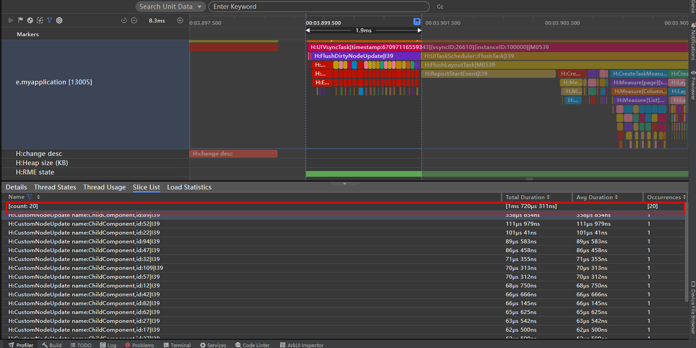

# 自定义组件冻结功能（V1）
<!--Kit: ArkUI-->
<!--Subsystem: ArkUI-->
<!--Owner: @liwenzhen3-->
<!--Designer: @s10021109-->
<!--Tester: @TerryTsao-->
<!--Adviser: @zhang_yixin13-->

自定义组件冻结功能专为优化复杂UI页面的性能而设计，尤其适用于包含多个页面栈、长列表或宫格布局的场景。当状态变量绑定多个UI组件时，其变化易触发大量组件刷新，导致界面卡顿与响应延迟。为提升这类高负载UI界面的刷新性能，建议开发者使用自定义组件冻结功能。

组件冻结功能是一种性能优化机制，它会冻结非激活状态下的组件的刷新能力。当组件处于非激活状态时，即使其绑定的状态变量发生变化，也不会触发该组件的UI重新渲染，从而降低复杂UI场景下的刷新负载。

在阅读本文档前，开发者需要了解自定义组件基本语法。建议提前阅读：[自定义组件](./arkts-create-custom-components.md)。

> **说明：**
>
> 从API version 11开始，支持自定义组件冻结功能。
>
> 从API version 18开始，支持自定义组件冻结混用场景。
> 
> 从API version 20开始，通过配置[BuilderNode](../../reference/apis-arkui/js-apis-arkui-builderNode.md)的[inheritFreezeOptions](../../reference/apis-arkui/js-apis-arkui-builderNode.md#inheritfreezeoptions20)接口为true，实现BuilderNode继承冻结的能力。具体示例见[BuilderNode对象继承组件冻结](../../reference/apis-arkui/js-apis-arkui-builderNode.md#inheritfreezeoptions20)。


## 概述

组件冻结的工作原理是：
1. 开发者通过设置[freezeWhenInactive](../../reference/apis-arkui/arkui-ts/ts-custom-component-parameter.md#componentoptions)属性，即可激活组件冻结机制。
2. 启用后，系统将仅对处于激活状态的自定义组件进行更新，这使得UI框架可以尽量缩小更新范围，仅限于用户可见范围内（激活状态）的自定义组件，从而提高复杂UI场景下的刷新效率。
3. 当之前处于inactive状态的自定义组件重新变为active状态时，状态管理框架会对其执行必要的刷新操作，确保UI的正确展示。

简而言之，组件冻结旨在优化复杂界面下的UI刷新性能。在存在多个不可见自定义组件的情况下，如多页面栈、长列表或宫格，通过组件冻结可以实现按需刷新，即仅刷新当前可见的自定义组件，而将不可见自定义组件的刷新延迟至它们变为可见时。

需要注意，组件active/inactive并不等同于其可见性。组件冻结目前仅适用于以下场景：

1. [页面路由](../../reference/apis-arkui/js-apis-router.md)：当前栈顶页面为active状态，非栈顶不可见页面为inactive状态。
2. [TabContent](../../reference/apis-arkui/arkui-ts/ts-container-tabcontent.md)：只有当前显示的TabContent中的自定义组件处于active状态，其余则为inactive。
3. [LazyForEach](../../reference/apis-arkui/arkui-ts/ts-rendering-control-lazyforeach.md)：仅当前显示的LazyForEach中的自定义组件为active状态，而缓存节点的组件则为inactive状态。
4. [Navigation](../../reference/apis-arkui/arkui-ts/ts-basic-components-navigation.md)：当前显示的NavDestination中的自定义组件为active状态，而其他未显示的NavDestination组件则为inactive状态。需要注意，本文档中涉及的“激活（active）/非激活（inactive）”是指组件冻结的激活/非激活状态，和[NavDestination](../../reference/apis-arkui/arkui-ts/ts-basic-components-navdestination.md)组件中的[onActive](../../reference/apis-arkui/arkui-ts/ts-basic-components-navdestination.md#onactive17)和[onInactive](../../reference/apis-arkui/arkui-ts/ts-basic-components-navdestination.md#oninactive17)不同。
5. 组件复用：进入复用池的组件为inactive状态，从复用池上树的节点为active状态。
6. 混用场景：对于以上场景的组合使用，例如TabContent下面使用LazyForEach，切换Tab时，API version 17及以下，LazyForEach中的所有节点都会被设置为active状态，而从API version 18开始，只有LazyForEach的屏上节点会被设置为active状态，其余则为inactive状态。

## 当前支持的场景

### 页面路由

> **说明：**
>
> 本示例使用了router进行页面跳转，建议开发者使用组件导航(Navigation)代替页面路由(router)来实现页面切换。Navigation提供了更多的功能和更灵活的自定义能力。请参考[使用Navigation的组件冻结用例](#navigation)。

当页面1调用router.pushUrl接口跳转到页面2时，页面1为隐藏不可见状态，此时如果更新页面1中的状态变量，不会触发页面1刷新。
图示如下：


页面1：
<!-- @[arkts_custom_components_freeze1](https://gitcode.com/openharmony/applications_app_samples/blob/master/code/DocsSample/ArkUISample/CustomComponentsFreeze/entry/src/main/ets/View/Page1.ets) -->

``` TypeScript
import { hilog } from '@kit.PerformanceAnalysisKit';
const DOMAIN = 0x0001;
const TAG = 'FreezeChild';

@Entry
@Component({ freezeWhenInactive: true })
struct PageOne {
  @StorageLink('PropA') @Watch('first') storageLink: number = 47;

  first() {
    hilog.info(DOMAIN, TAG, 'first page ' + `${this.storageLink}`);
  }

  build() {
    Column() {
      Text(`From first Page ${this.storageLink}`).fontSize(50)
      Button('first page storageLink + 1').fontSize(30)
        .onClick(() => {
          this.storageLink += 1;
        })
      Button('go to next page').fontSize(30)
        .onClick(() => {
          this.getUIContext().getRouter().pushUrl({ url: 'View/PageTwo' });
        })
    }
  }
}
```

页面2：
<!-- @[arkts_custom_components_freeze2](https://gitcode.com/openharmony/applications_app_samples/blob/master/code/DocsSample/ArkUISample/CustomComponentsFreeze/entry/src/main/ets/View/PageTwo.ets) -->

在上面的示例中：

1.在页面1中点击`first page storageLink + 1`，storageLink状态变量改变，[@Watch](./arkts-watch.md)注册的方法first会被调用。

2.在页面1中点击`go to next page`，跳转到页面2，页面1隐藏，状态由active变为inactive。

3.在页面2中点击`this.storageLink2 += 2`，只会回调页面2中@Watch注册的方法second，因为页面1的状态变量此时已被冻结。

4.在页面2中点击`back`，页面2被销毁，页面1的状态由inactive变为active，重新刷新在inactive时被冻结的状态变量，页面1中@Watch注册的方法first被再次调用。


### TabContent

对Tabs中当前不可见的TabContent进行冻结，修改状态变量不会触发冻结组件的更新。

需要注意的是：在首次渲染的时候，Tabs只会创建当前正在显示的TabContent，当切换全部的TabContent后，TabContent才会被全部创建。

图示如下：

<!-- @[arkts_custom_components_freeze3](https://gitcode.com/openharmony/applications_app_samples/blob/master/code/DocsSample/ArkUISample/CustomComponentsFreeze/entry/src/main/ets/View/TabContentTest.ets) -->

在上面的示例中：

1.点击`change message`更改message的值，当前正在显示的TabContent组件中的@Watch注册的方法onMessageUpdated被触发。

2.点击`tab1`切换到另外的TabContent，该TabContent的状态由inactive变为active，对应的@Watch注册的方法onMessageUpdated被触发。 

3.再次点击`change message`更改message的值，仅当前显示的TabContent子组件中的@Watch注册的方法onMessageUpdated被触发。


### LazyForEach

对LazyForEach中缓存的自定义组件进行冻结，修改状态变量不会触发缓存组件的更新。
<!-- @[arkts_custom_components_freeze4](https://gitcode.com/openharmony/applications_app_samples/blob/master/code/DocsSample/ArkUISample/CustomComponentsFreeze/entry/src/main/ets/View/LazyforEachTest.ets) -->

在上面的示例中：

1.点击`change message`更改message的值，当前正在显示的ListItem中的子组件@Watch注册的方法onMessageUpdated被触发。缓存节点中@Watch注册的方法不会被触发。（如果不加组件冻结，当前正在显示的ListItem和cachecount缓存节点中@Watch注册的方法onMessageUpdated都会被触发。）

2.List区域外的ListItem滑动到List区域内，状态由inactive变为active，对应的@Watch注册的方法onMessageUpdated被触发。

3.再次点击`change message`更改message的值，仅有当前显示的ListItem中的子组件@Watch注册的方法onMessageUpdated被触发。


### Navigation

当NavDestination不可见时，会将其子自定义组件设置成非激活态，修改状态变量不会触发冻结组件的刷新。当返回该页面时，其子自定义组件重新恢复成激活态，触发@Watch回调进行刷新。

在下面例子中，NavigationContentMsgStack会被设置成非激活态，将不再响应状态变量的变化，也不会触发组件刷新。
<!-- @[arkts_custom_components_freeze5](https://gitcode.com/openharmony/applications_app_samples/blob/master/code/DocsSample/ArkUISample/CustomComponentsFreeze/entry/src/main/ets/View/MyNavigationTestStack.ets) -->


在上面的示例中：

1.点击`change message`更改message的值，当前正在显示的MyNavigationTestStack组件中的@Watch注册的方法info被触发。

2.点击`Next Page`切换到PageOne，创建PageOneStack节点。

3.再次点击`change message`更改message的值，仅PageOneStack中的NavigationContentMsgStack子组件中@Watch注册的方法info被触发。

4.再次点击`Next Page`切换到PageTwo，创建PageTwoStack节点。

5.再次点击`change message`更改message的值，仅PageTwoStack中的NavigationContentMsgStack子组件中@Watch注册的方法info被触发。

6.再次点击`Next Page`切换到PageThree，创建PageThreeStack节点。

7.再次点击`change message`更改message的值，仅PageThreeStack中的NavigationContentMsgStack子组件中@Watch注册的方法info被触发。

8.点击`Back Page`回到PageTwo，此时，仅PageTwoStack中的NavigationContentMsgStack子组件中@Watch注册的方法info被触发。

9.再次点击`Back Page`回到PageOne，此时，仅PageOneStack中的NavigationContentMsgStack子组件中@Watch注册的方法info被触发。

10.再次点击`Back Page`回到初始页，此时，无任何触发。


### 组件复用

[组件复用](./arkts-reusable.md)通过重利用缓存池中已存在的节点，而非创建新节点，来优化UI性能并提升应用流畅度。复用池中的节点尽管未在UI组件树上展示，但是状态变量的更改仍会触发UI刷新。为了解决复用池中组件异常刷新问题，可以使用组件冻结避免复用池中的组件刷新。

**组件复用、if和组件冻结混用场景**

下面是组件复用、if组件和组件冻结混合使用场景的例子，if组件绑定的状态变量变化成false时，触发子组件`ChildComponent`的下树，由于`ChildComponent`被标记了组件复用，所以不会被销毁，而是进入复用池，这个时候如果同时开启了组件冻结，则可以使在复用池里不再刷新。
<!-- @[arkts_custom_components_freeze6](https://gitcode.com/openharmony/applications_app_samples/blob/master/code/DocsSample/ArkUISample/CustomComponentsFreeze/entry/src/main/ets/View/ComponentReuse.ets) -->

在上面的示例中：

1. 点击`change flag`，改变`flag`为false：
    -  被标记\@Reusable的`ChildComponent`组件在下树时，不会被销毁，而是进入复用池，触发aboutToRecycle生命周期，同时设置状态为inactive。
    - `ChildComponent`同时也开启了组件冻结，当其状态为inactive时，不会响应任何状态变量变化带来的UI刷新。
2. 点击`change desc`，触发`Page`的成员变量`desc`的变化：
    - `desc`是\@State装饰的，其变化会通知给其子组件`ChildComponent`[\@Link](./arkts-link.md)装饰的`desc`。
    - 但因为`ChildComponent`是inactive状态，且开启了组件冻结，所以这次变化并不会触发`@Watch('descChange')`的回调和`ChildComponent`UI刷新。如果没有开启组件冻结，当前`@Watch('descChange')`会立即回调，且复用池内的`ChildComponent`组件也会对应刷新。
3. 再次点击`change flag`，改变`flag`为true：
    - `ChildComponent`从复用池中重新加入到组件树上。
    - 回调aboutToReuse生命周期，将当前最新的`count`值同步给子组件。`desc`是通过[@State](./arkts-state.md)到@Link同步的，所以无需开发者手动在aboutToReuse中赋值。
    - 设置ChildComponent为active状态，并且刷新在inactive时没有刷新的组件，在当前例子中，就是`Text(ChildComponent desc: ${this.desc})`。

**LazyForEach、组件复用和组件冻结混用场景**

在数据很多的长列表滑动场景下，开发者会使用LazyForEach来按需创建组件，同时配合组件复用降低在滑动过程中因创建和销毁组件带来的开销。但是开发者如果根据其复用类型不同，设置了[reuseId](../../reference/apis-arkui/arkui-ts/ts-universal-attributes-reuse-id.md#reuseid)，或者为了保证滑动性能设置了较大的cacheCount，这就可能使复用池或者LazyForEach缓存较多的节点。在这种情况下，如果开发者触发List下所有子节点的刷新，就会带来节点刷新数量过多的问题，这个时候，可以考虑搭配组件冻结使用。
<!-- @[arkts_custom_components_freeze7](https://gitcode.com/openharmony/applications_app_samples/blob/master/code/DocsSample/ArkUISample/CustomComponentsFreeze/entry/src/main/ets/View/ComponentReuse1.ets) -->

在上面的示例中：

1. 滑动到index为14的位置，当前屏幕上可见区域内有15个`ChildComponent`。
2. 在滑动过程中：
    - 列表上端的`ChildComponent`滑出可视区域外，此时先进入LazyForEach的缓存区域内，被设置inactive。在滑出LazyForEach缓存区域外后，因为标记了组件复用，所以并不会被析构，而是会进入复用池，此时再次被设置inactive。
    - 列表下端LazyForEach的缓存节点会进入List范围内，此时会试图请求创建新的节点进入LazyForEach的缓存，发现有可复用的节点时，从复用池中拿出已有节点，触发aboutToReuse生命周期回调，此时因为节点进入的是LazyForEach的缓存区域，所以其状态依旧是inactive。
3. 点击`change desc`，触发`Page`的成员变量`desc`的变化：
    - `desc`是\@State装饰的，其变化会通知给其子组件`ChildComponent`\@Link装饰的`desc`。
    - 非可视区域内的`ChildComponent`是inactive状态，且开启了组件冻结，所以这次变化只触发可视区域内的15个节点的`@Watch('descChange')`回调，并只刷新对应可视区域内的15个节点。LazyForEach和复用池中的节点并不会刷新，也不会触发\@Watch回调。
    

图示如下：

可通过trace观察，仅触发了15个`ChildComponent`节点的刷新。


**LazyForEach、if、组件复用和组件冻结混用场景**

下面的场景中展示了LazyForEach、if、组件复用和组件冻结混用场景。在同一个父自定义组件下，可复用的节点可能通过不同的方式进入复用池，比如：
- 通过滑动从LazyForEach的缓存区域下树，进入复用池。
- if条件切换通知子节点下树，进入复用池。
<!-- @[arkts_custom_components_freeze8](https://gitcode.com/openharmony/applications_app_samples/blob/master/code/DocsSample/ArkUISample/CustomComponentsFreeze/entry/src/main/ets/View/ComponentReuse2.ets) -->


在上面的示例中：

1. 当滑动到index为14的位置，屏幕上可见区域内有10个`ChildComponent`，9个是LazyForEach的子节点，1个是if的子节点。
2. 点击`change flag`，if的条件变成false，其子节点`ChildComponent`进入复用池。当前屏幕显示9个节点。
3. 此时不管是通过LazyForEach还是if下树的节点都会进入`Page`节点下的复用池。
4. 点击`change desc`，仅更新屏幕上的9个`ChildComponent`节点，具体可参考下面的trace。
5. 再次点击`change flag`，if的条件变成true，`ChildComponent`从复用池中重新加入到组件树上，其状态变成active。
6. 再次点击`change desc`，从复用池中通过if和LazyForEach上树的节点都可正常刷新。

开启组件冻结trace：


没有开启组件冻结trace：



### 组件混用

当支持组件冻结的场景彼此之间组合使用时，对于不同的API版本，冻结行为会有不同。给父组件设置组件冻结标志，在API version 17及以下，当父组件解冻时，会解冻自己子组件所有的节点；从API version 18开始，父组件解冻时，只会解冻子组件的屏上节点。

**Navigation和TabContent的混用**

代码示例如下：
<!-- @[arkts_custom_components_freeze9](https://gitcode.com/openharmony/applications_app_samples/blob/master/code/DocsSample/ArkUISample/CustomComponentsFreeze/entry/src/main/ets/View/ComponentMixing.ets) -->


代码运行结果图如下：


点击`Next Page`，进入pageOne页面，页面中存在两个tab标签，默认在Update标签，开启组件冻结功能，Tabcontent的标签如果未被选中，状态变量不会刷新，如以下操作。

点击`Incr state`，日志中查询Appmonitor，存在3个打印。


切换到DelayUpdate标签，点击`Incr state`，日志中查询Appmonitor，存在2个打印。DelayUpdate中状态变量不会刷新与Update标签中相关的状态变量。


在API version 17及以下：

点击`Next page`进入下一个页面并返回，标签默认在DelayUpdate，再次点击`Incr state`，日志中查询Appmonitor，存在4个打印，页面路由返回时，会解冻Tabcontent所有的标签。


在API version 18及以上：

点击`Next page`进入下一个页面并返回，标签默认在DelayUpdate，再次点击`Incr state`，日志中查询Appmonitor，存在2个打印，页面路由返回时，只会解冻对应标签的节点。


**页面和LazyForEach**

Navigation和TabContent混用时，之所以会解锁TabContent标签的子节点，是因为回到前一个页面时会从父组件开始递归解冻子组件，与此行为类似的还有页面生命周期：OnPageShow。OnPageShow会将当前Page中的根节点设置为active状态，TabContent作为页面的子节点，也会被设置为active状态。在屏幕灭屏和屏幕亮屏时会分别触发页面的生命周期：OnPageHide和OnPageShow，因此页面中使用LazyForEach时，手动灭屏和亮屏也能实现页面路由一样的效果，如以下示例代码：
<!-- @[arkts_custom_components_freeze10](https://gitcode.com/openharmony/applications_app_samples/blob/master/code/DocsSample/ArkUISample/CustomComponentsFreeze/entry/src/main/ets/View/ComponentMixing1.ets) -->


在组件复用场景中，已经对LazyForEach的节点进行了详细说明，分为屏上节点和cachedCount节点。


向下滑动LazyForEach，让cachedCount补充节点，点击`add sum`，搜索打印日志：sum：Change，出现了8条打印。


在API version 17及以下：

灭屏之后亮屏，触发OnPageShow，点击`add sum`，打印数量为屏上节点与cachedCount数量的总和。


从API version 18开始：

灭屏之后亮屏，触发OnPageShow，点击`add sum`，只会打印屏上节点数量，不会再解冻cachedCount中的节点。


## 限制条件

### BuilderNode无法继承父组件冻结

在API version 20之前，BuilderNode无法继承父组件冻结。如下面的例子所示，FreezeBuildNode中使用了自定义节点[BuilderNode](../../reference/apis-arkui/js-apis-arkui-builderNode.md)。BuilderNode可以通过命令式动态挂载组件，而组件冻结又是强依赖父子关系来通知是否开启组件冻结。如果父组件使用组件冻结，且组件树的中间层级上又启用了BuilderNode，则BuilderNode的子组件将无法被冻结。

在API version 20及以后，开发者可以通过配置BuilderNode的inheritFreezeOptions接口为true，实现BuilderNode继承冻结的能力。具体示例见[BuilderNode对象继承组件冻结](../../reference/apis-arkui/js-apis-arkui-builderNode.md#inheritfreezeoptions20)。
<!-- @[arkts_custom_components_freeze11](https://gitcode.com/openharmony/applications_app_samples/blob/master/code/DocsSample/ArkUISample/CustomComponentsFreeze/entry/src/main/ets/View/Constraints.ets) -->


在上面的示例中：

点击`change`，改变message的值，当前正在显示的TabContent组件中@Watch注册的方法onMessageUpdated被触发。未显示的TabContent中的BuilderNode节点下组件的@Watch方法onMessageUpdated也被触发，并没有被冻结。

