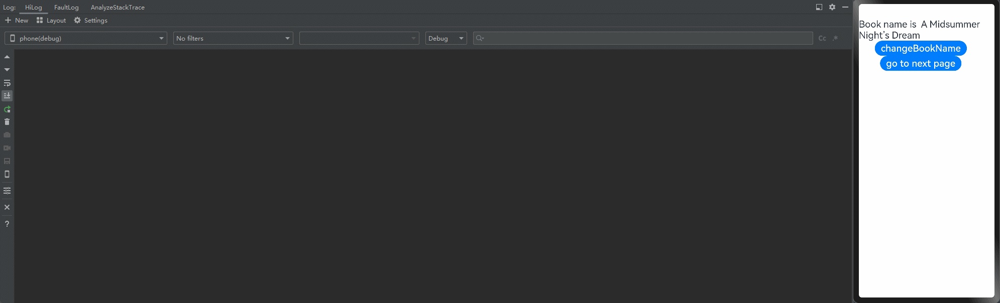
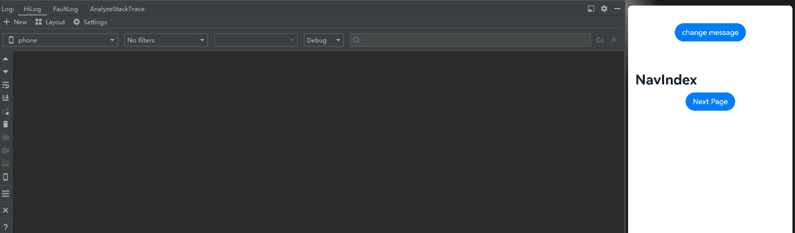

# 自定义组件冻结功能（V2）
<!--Kit: ArkUI-->
<!--Subsystem: ArkUI-->
<!--Owner: @liwenzhen3-->
<!--Designer: @s10021109-->
<!--Tester: @TerryTsao-->
<!--Adviser: @zhang_yixin13-->

当@ComponentV2装饰的自定义组件处于非激活状态时，状态变量将不响应更新，即[@Monitor](./arkts-new-monitor.md)不会调用，状态变量关联的节点不会刷新。该冻结机制在复杂UI场景下能显著优化性能，避免非激活组件因状态变量更新进行无效刷新，从而减少资源消耗。通过freezeWhenInactive属性来决定是否使用冻结功能，不传参数时默认不使用。支持的场景有：[页面路由](../../reference/apis-arkui/js-apis-router.md)、[TabContent](../../reference/apis-arkui/arkui-ts/ts-container-tabcontent.md)、[Navigation](../../reference/apis-arkui/arkui-ts/ts-basic-components-navigation.md)、[Repeat](../../reference/apis-arkui/arkui-ts/ts-rendering-control-repeat.md)。

在阅读本文档前，开发者需要了解\@ComponentV2基本语法。建议提前阅读：[\@ComponentV2](./arkts-new-componentV2.md)。

> **说明：**
>
> 从API version 12开始，支持@ComponentV2装饰的自定义组件冻结功能。
>
> 从API version 18开始，支持自定义组件冻结混用场景。
>
> 与@Component的组件冻结不同，@ComponentV2装饰的自定义组件不支持在LazyForEach场景下缓存节点组件冻结。

## 当前支持的场景

### 页面路由

> **说明：**
>
> 本示例使用了router进行页面跳转，建议开发者使用组件导航(Navigation)代替页面路由(router)来实现页面切换。Navigation提供了更多的功能和更灵活的自定义能力。请参考[使用Navigation的组件冻结用例](#navigation)。

当页面1调用router.pushUrl接口跳转到页面2时，页面1为隐藏不可见状态，此时如果更新页面1中的状态变量，不会触发页面1刷新。
图示如下：


页面1：

<!-- @[freeze_template1_Page1_start](https://gitcode.com/openharmony/applications_app_samples/blob/master/code/DocsSample/ArkUISample/FreezeV2/entry/src/main/ets/pages/freeze/template1/Page1.ets) -->


页面2：

<!-- @[freeze_template1_Page2_start](https://gitcode.com/openharmony/applications_app_samples/blob/master/code/DocsSample/ArkUISample/FreezeV2/entry/src/main/ets/pages/freeze/template1/Page2.ets) -->


在上面的示例中：

1. 在页面1中点击`changeBookName`，bookTest变量的name属性改变，@Monitor中注册的方法onMessageChange会被调用。

2. 在页面1中点击`go to next page`，跳转到页面2，然后延迟1s更新状态变量bookTest。在更新bookTest的时候，已经跳转到页面2，页面1处于inactive状态，[@Local](./arkts-new-local.md)装饰的状态变量bookTest将不响应更新，其@Monitor不会调用，关联的节点不会刷新。

Trace如下：


3. 点击`Back`，页面2被销毁，页面1的状态由inactive变为active。状态变量bookTest的更新被观察到，@Monitor中注册的方法onMessageChange被调用，对应的Text显示内容改变。



### TabContent

对Tabs中当前不可见的TabContent进行冻结，修改状态变量不会触发冻结组件的更新。

需要注意的是：在首次渲染的时候，Tabs只会创建当前正在显示的TabContent，当切换全部的TabContent后，TabContent才会被全部创建。

图示如下：


<!-- @[freeze_template2_start](https://gitcode.com/openharmony/applications_app_samples/blob/master/code/DocsSample/ArkUISample/FreezeV2/entry/src/main/ets/pages/freeze/template2/TabContentTest.ets) -->

在上面的示例中：

1.点击`change message`更改message的值，当前正在显示的TabContent组件中@Monitor注册的方法onMessageUpdated被触发。

2.点击`tab1`切换到另外的TabContent，该TabContent的状态由inactive变为active，对应的@Monitor注册的方法onMessageUpdated被触发。 

3.再次点击`change message`更改message的值，仅当前显示的TabContent子组件中@Monitor注册的方法onMessageUpdated被触发。其他inactive的TabContent组件不会触发@Monitor。


### Navigation

当NavDestination不可见时，会将其子自定义组件设置成非激活态，修改状态变量不会触发冻结组件的刷新。当返回该页面时，其子自定义组件重新恢复成激活态，触发@Monitor回调进行刷新。

需要注意：本文档里说的“激活（active）/非激活（inactive）”是指组件冻结的激活/非激活状态，和[NavDestination](../../reference/apis-arkui/arkui-ts/ts-basic-components-navdestination.md)组件中的[onActive](../../reference/apis-arkui/arkui-ts/ts-basic-components-navdestination.md#onactive17)和[onInactive](../../reference/apis-arkui/arkui-ts/ts-basic-components-navdestination.md#oninactive17)不同。

<!-- @[freeze_template3_start](https://gitcode.com/openharmony/applications_app_samples/blob/master/code/DocsSample/ArkUISample/FreezeV2/entry/src/main/ets/pages/freeze/template3/MyNavigationTestStack.ets) -->


在上面的示例中：

1.点击`change message`更改message的值，当前正在显示的MyNavigationTestStack组件中@Monitor注册的方法info被触发。

2.点击`Next Page`切换到PageOne，创建PageOneStack节点。

3.再次点击`change message`更改message的值，仅PageOneStack中的NavigationContentMsgStack子组件中@Monitor注册的方法info被触发。

4.再次点击`Next Page`切换到PageTwo，创建PageTwoStack节点。PageOneStack节点状态由active变为inactive。

5.再次点击`change message`更改message的值，仅PageTwoStack中的NavigationContentMsgStack子组件中@Monitor注册的方法info被触发。Navigation路由栈中非栈顶的NavDestination中的子自定义组件是inactive状态，@Monitor方法不会触发。

6.再次点击`Next Page`切换到PageThree，创建PageThreeStack节点。PageTwoStack节点状态由active变为inactive。

7.再次点击`change message`更改message的值，仅PageThreeStack中的NavigationContentMsgStack子组件中@Monitor注册的方法info被触发。Navigation路由栈中非栈顶的NavDestination中的子自定义组件是inactive状态，@Monitor方法不会触发。

8.点击`Back Page`回到PageTwo，此时，PageTwoStack节点状态由inactive变为active，其NavigationContentMsgStack子组件中@Monitor注册的方法info被触发。

9.再次点击`Back Page`回到PageOne，此时，PageOneStack节点状态由inactive变为active，其NavigationContentMsgStack子组件中@Monitor注册的方法info被触发。

10.再次点击`Back Page`回到初始页，此时，无任何触发。



### Repeat

> **说明：**
>
> Repeat从API version 18开始支持自定义组件冻结。

对Repeat缓存池中的自定义组件进行冻结，避免不必要的组件刷新。建议提前阅读[Repeat节点更新/复用能力说明](../rendering-control/arkts-new-rendering-control-repeat.md#节点更新复用能力说明)。

<!-- @[freeze_template4_start](https://gitcode.com/openharmony/applications_app_samples/blob/master/code/DocsSample/ArkUISample/FreezeV2/entry/src/main/ets/pages/freeze/template4/RepeatVirtualScrollFreeze.ets) -->

在上面的示例中：

点击`Reduce length to 5`后，被移除的两个组件会进入Repeat缓存池，然后点击`Change bgColor`更改bgColor的值触发节点刷新。

开启组件冻结（freezeWhenInactive: true），只有剩余节点中@Monitor装饰的方法onBgColorChange被触发，如示例中屏上的5个节点会刷新并打印5条日志，缓存池中的节点则不会。


<!-- @[freeze_template4_pageB_start](https://gitcode.com/openharmony/applications_app_samples/blob/master/code/DocsSample/ArkUISample/FreezeV2/entry/src/main/ets/pages/freeze/template4/PageB.ets) -->


不开启组件冻结（freezeWhenInactive: false，当未指定freezeWhenInactive参数时默认不开启组件冻结），剩余节点和缓存池节点中@Monitor装饰的方法onBgColorChange都会被触发，即会有7个节点会刷新并打印7条日志。


### 仅子组件开启组件冻结

如果开发者只想冻结某个子组件，可以选择只在子组件设置freezeWhenInactive为true。

<!-- @[freeze_template5_PageA_start](https://gitcode.com/openharmony/applications_app_samples/blob/master/code/DocsSample/ArkUISample/FreezeV2/entry/src/main/ets/pages/freeze/template5/PageA.ets) -->


<!-- @[freeze_template5_PageB_start](https://gitcode.com/openharmony/applications_app_samples/blob/master/code/DocsSample/ArkUISample/FreezeV2/entry/src/main/ets/pages/freeze/template5/PageB.ets) -->

使用Navigation时，需要添加配置系统路由表文件src/main/resources/base/profile/route_map.json，并替换pageSourceFile为Page2页面的路径，并且在module.json5中添加："routerMap": "$profile:route_map"。

```json
{
  "routerMap": [
    {
      "name": "PageB",
      "pageSourceFile": "src/main/ets/pages/freeze/template5/PageB.ets",
      "buildFunction": "page2Builder",
      "data": {
        "description" : "This is the PageB"
      }
    }
  ]
}
```

在上面的示例中：
- Page1的子组件Child，设置`freezeWhenInactive: true`, 开启了组件冻结功能。
- 点击`change BookName`，然后3s内点击`Go to next page`。在更新bookTest的时候，已经跳转到Page2，Page1的组件处于inactive状态，又因为Child组件开启了组件冻结，状态变量`@Local bookTest`将不响应更新，其@Monitor装饰的回调方法不会被调用，状态变量关联的组件不会刷新。
- 点击`Back`回到前一个页面，调用@Monitor装饰的回调方法，状态变量关联的组件刷新。

### 混用场景

当支持组件冻结的场景彼此之间组合使用时，对于不同的API版本，冻结行为会有不同。给父组件设置组件冻结标志，在API version 17及以下，当父组件解冻时，会解冻自己子组件所有的节点；从API version 18开始，父组件解冻时，只会解冻子组件的屏上节点，详细说明见[\@Component的自定义组件冻结的混用场景](./arkts-custom-components-freeze.md#组件混用)。

**Navigation和TabContent的混用**

<!-- @[freeze_template6_start](https://gitcode.com/openharmony/applications_app_samples/blob/master/code/DocsSample/ArkUISample/FreezeV2/entry/src/main/ets/pages/freeze/template6/MyNavigationTestStack.ets) -->

在API version 17及以下：

点击`Next page`进入下一个页面并返回，会解冻Tabcontent所有的标签。

在API version 18及以上：

点击`Next page`进入下一个页面并返回，只会解冻对应标签的节点。

## 限制条件

如下面的例子所示，FreezeBuildNode中使用了自定义节点[BuilderNode](../../reference/apis-arkui/js-apis-arkui-builderNode.md)。BuilderNode可以通过命令式动态挂载组件，而组件冻结又是强依赖父子关系来通知是否开启组件冻结。如果父组件使用组件冻结，且组件树的中间层级上又启用了BuilderNode，则BuilderNode的子组件将无法被冻结。

<!-- @[freeze_template7_start](https://gitcode.com/openharmony/applications_app_samples/blob/master/code/DocsSample/ArkUISample/FreezeV2/entry/src/main/ets/pages/freeze/template7/BuilderNode.ets) -->

``` TypeScript
import { BuilderNode, FrameNode, NodeController, UIContext } from '@kit.ArkUI';
import { hilog } from '@kit.PerformanceAnalysisKit';

const DOMAIN = 0x0000;

// 定义一个Params类，用于传递参数
@ObservedV2
class Params {
  // 单例模式，确保只有一个Params实例
  public static singleton_: Params;

  // 获取Params实例的方法
  public static instance() {
    if (!Params.singleton_) {
      Params.singleton_ = new Params(0);
    }
    return Params.singleton_;
  }

  // 使用@Trace装饰器装饰message属性，以便跟踪其变化
  @Trace public message: string = 'Hello';
  public index: number = 0;

  constructor(index: number) {
    this.index = index;
  }
}

// 定义一个buildNodeChild组件，它包含一个message属性和一个index属性
@ComponentV2
struct buildNodeChild {
  // 使用Params实例作为storage属性
  storage: Params = Params.instance();
  @Param index: number = 0;

  // 使用@Monitor装饰器监听storage.message的变化
  @Monitor('storage.message')
  onMessageChange(monitor: IMonitor) {
    hilog.info(DOMAIN, 'onMessageChange',
      `FreezeBuildNode buildNodeChild message callback func ${this.storage.message}, index:${this.index}`);
  }

  build() {
    Text(`buildNode Child message: ${this.storage.message}`).fontSize(30)
  }
}

// 定义一个buildText函数，它接收一个Params参数并构建一个Column组件
@Builder
function buildText(params: Params) {
  Column() {
    buildNodeChild({ index: params.index })
  }
}

class TextNodeController extends NodeController {
  private textNode: BuilderNode<[Params]> | null = null;
  private index: number = 0;

  // 构造函数接收一个index参数
  constructor(index: number) {
    super();
    this.index = index;
  }

  // 创建并返回一个FrameNode
  makeNode(context: UIContext): FrameNode | null {
    this.textNode = new BuilderNode(context);
    this.textNode.build(wrapBuilder<[Params]>(buildText), new Params(this.index));
    return this.textNode.getFrameNode();
  }
}

// 定义一个Index组件，它包含一个message属性和一个data数组
@Entry
@ComponentV2
struct Index {
  // 使用Params实例作为storage属性
  storage: Params = Params.instance();
  private data: number[] = [0, 1];

  build() {
    Row() {
      Column() {
        Button('change').fontSize(30)
          .onClick(() => {
            this.storage.message += 'a';
          })

        Tabs() {
          // 使用Repeat重复渲染TabContent组件
          Repeat<number>(this.data)
            .each((obj: RepeatItem<number>) => {
              TabContent() {
                FreezeBuildNode({ index: obj.item })
                  .margin({ top: 20 })
              }.tabBar(`tab${obj.item}`)
            })
            .key((item: number) => item.toString())
        }
      }
    }
    .width('100%')
    .height('100%')
  }
}

// 定义一个FreezeBuildNode组件，它包含一个message属性和一个index属性
@ComponentV2({ freezeWhenInactive: true })
struct FreezeBuildNode {
  // 使用Params实例作为storage属性
  storage: Params = Params.instance();
  @Param index: number = 0;

  // 使用@Monitor装饰器监听storage.message的变化
  @Monitor('storage.message')
  onMessageChange(monitor: IMonitor) {
    hilog.info(DOMAIN, 'onMessageChange',
      `FreezeBuildNode message callback func ${this.storage.message}, index: ${this.index}`);
  }

  build() {
    NodeContainer(new TextNodeController(this.index))
      .width('100%')
      .height('100%')
      .backgroundColor('#FFF0F0F0')
  }
}
```

点击`change`，改变message的值，当前正在显示的TabContent组件中的[@Watch](./arkts-watch.md)中注册的方法onMessageUpdated被触发。未显示的TabContent中的BuilderNode节点下组件的@Watch方法onMessageUpdated也被触发，并没有被冻结。

