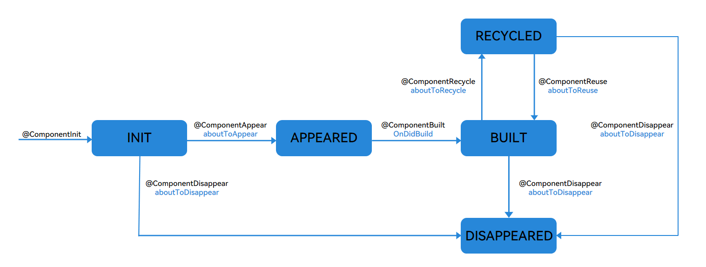
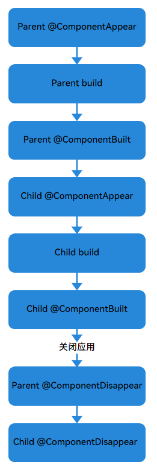

# 自定义组件生命周期（推荐）
<!--Kit: ArkUI-->
<!--Subsystem: ArkUI-->
<!--Owner: @xin11112-->
<!--Designer: @zhangboren-->
<!--Tester: @TerryTsao-->
<!--Adviser: @zhang_yixin13-->

## 概述

已有的[自定义组件生命周期](./arkts-page-custom-components-lifecycle.md)回调函数触发只取决于事件的触发，在某些特定的情况下，会出现自定义组件生命周期回调函数的触发顺序不符合预期。比如：[aboutToDisappear在特定情况下会误调用aboutToAppear、组件未展开被复用时，会误调用aboutToReuse](#生命周期回调函数的区别)。新的自定义组件生命周期回调函数受状态机限制，生命周期回调函数调用时机符合预期。

自定义组件生命周期，即用[@Component](arkts-create-custom-components.md#component)或[@ComponentV2](./arkts-create-custom-components.md#componentv2)装饰的自定义组件的生命周期，从API version 23开始，提供以下生命周期装饰器：

- [\@ComponentInit](../../reference/apis-arkui/arkui-ts/ts-custom-component-new-lifecycle.md#componentinit)：\@ComponentInit装饰的函数在自定义组件即将构造完毕时执行。可以在此函数中注册监听和修改变量。

- [\@ComponentAppear](../../reference/apis-arkui/arkui-ts/ts-custom-component-new-lifecycle.md#componentappear)：组件即将出现时回调该装饰器装饰的函数，具体时机为在创建自定义组件的新实例后，在执行其build函数之前执行。

- [\@ComponentBuilt](../../reference/apis-arkui/arkui-ts/ts-custom-component-new-lifecycle.md#componentbuilt)：在组件首次渲染触发的build函数执行完成后，回调该装饰器装饰的函数，后续组件重新渲染将不再回调该函数。开发者可以在此阶段实现数据上报等不影响实际UI的功能。

- [\@ComponentDisappear](../../reference/apis-arkui/arkui-ts/ts-custom-component-new-lifecycle.md#componentdisappear)：该装饰器装饰的函数在自定义组件析构销毁之前执行。不建议在\@ComponentDisappear装饰的函数中改变状态变量，特别是@Link变量的修改可能会导致应用程序行为不稳定。

- [\@ComponentReuse](../../reference/apis-arkui/arkui-ts/ts-custom-component-new-lifecycle.md#componentreuse)：当可复用的自定义组件从缓存中重新添加到节点树时调用该装饰器装饰的函数，以接收组件的构造入参。最后，\@ComponentReuse装饰的函数会递归遍历所有子组件，对每个完成复用的组件调用\@ComponentReuse装饰的函数。

- [\@ComponentRecycle](../../reference/apis-arkui/arkui-ts/ts-custom-component-new-lifecycle.md#componentrecycle)：当组件被回收后触发，先执行应用程序中定义的必要回收操作，完成回收后调用该装饰器装饰的函数。最后，\@ComponentRecycle装饰的函数会递归遍历所有子组件，对每个完成回收的组件调用\@ComponentRecycle装饰的函数。

- [\@ComponentActive](../../reference/apis-arkui/arkui-ts/ts-custom-component-new-lifecycle.md#componentactive)：当组件从非激活状态变为激活状态时，调用该装饰器装饰的函数。自定义组件激活和非激活概念详见[支持场景](#自定义组件的激活与非激活生命周期调用时机)。自定义组件的激活和非激活概念与[组件冻结](./arkts-custom-components-freeze.md)中的组件激活（active）和非激活（inactive）概念相同。

- [\@ComponentInactive](../../reference/apis-arkui/arkui-ts/ts-custom-component-new-lifecycle.md#componentinactive)：当组件从激活状态变为非激活状态时，调用该装饰器装饰的函数。

自定义组件生命周期受状态机限制，流程如下图所示。



### 自定义组件的创建和渲染流程

1. 自定义组件的创建：自定义组件的实例由ArkUI框架创建。

2. 初始化自定义组件的成员变量：通过本地默认值或者构造函数传递参数来初始化自定义组件的成员变量，初始化顺序为成员变量的定义顺序。

3. 在首次渲染的时候，执行build函数渲染系统组件，如果子组件为自定义组件，则创建自定义组件的实例。在首次渲染的过程中，框架会记录状态变量和组件的映射关系，当状态变量改变时，驱动其相关的组件刷新。

### 自定义组件的删除

例如if组件的分支改变或ForEach循环渲染中数组的个数改变，组件将被移除：

1. 在删除组件之前，将调用其\@ComponentDisappear装饰的生命周期函数，标记着该节点将要被销毁。ArkUI的节点删除机制是：后端节点直接从组件树上摘下，后端节点被销毁，对前端节点解引用，前端节点已经没有引用时，将被Ark虚拟机垃圾回收。

2. 自定义组件和它的变量将被删除，如果组件有同步的变量（如[@Link](arkts-link.md)、[@Prop](arkts-prop.md)、[@StorageLink](arkts-appstorage.md#storagelink)），将从[同步源](arkts-state-management-glossary.md#数据源同步源data-source)上取消注册。

## 限制条件

- \@ComponentInit、\@ComponentAppear、\@ComponentBuilt、\@ComponentDisappear、\@ComponentReuse和\@ComponentRecycle只能在\@Component或者\@ComponentV2装饰的struct中使用，否则编译会报错。

- \@ComponentInit、\@ComponentAppear、\@ComponentBuilt、\@ComponentDisappear和\@ComponentRecycle装饰的函数不能有入参，否则编译会报错。

- 在\@Component装饰的struct中，\@ComponentReuse装饰的函数可以没有入参或者有一个入参，否则编译会报错。

- 在\@ComponentV2装饰的struct中，\@ComponentReuse装饰的函数不能有入参，否则编译会报错。

- 新增生命周期装饰器装饰方法时，自定义组件对应事件发生时会回调该方法。新增生命周期装饰器建议单独使用，不与其他状态变量装饰器联合使用。比如生命周期装饰器和[\@Computed](./arkts-new-computed.md)联合使用时，生命周期装饰器不生效。
  ```typescript
  @Computed
  @ComponentAppear
  get sum() {
    return 1 + 2 + 3; // 错误用法，生命周期装饰器装饰get方法不生效
  }
  ```
- 当自定义组件没有使用生命周期装饰器，且没有注册监听，使用[getCurrentState](../../reference/apis-arkui/arkui-ts/ts-custom-component-new-lifecycle.md#getcurrentstate)查询自定义组件当前生命周期状态时，返回值永远为[CustomComponentLifecycleState.INIT](../../reference/apis-arkui/arkui-ts/ts-custom-component-new-lifecycle.md#customcomponentlifecyclestate)。

-  `@ComponentActive`和`@ComponentInactive`这两个自定义组件生命周期装饰器自API版本26.0.0起可用，用于监听组件的激活状态变化，不受状态机约束。它们独立于状态机工作：当组件由非激活转为激活状态（例如应用从后台切回前台、页面重新显示时），会触发`@ComponentActive`装饰的函数；反之，当组件从激活转为非激活状态（例如应用退至后台、页面隐藏或组件预创建时），则调用`@ComponentInactive`装饰的函数，目前激活和非激活生命周期仅支持[以下场景](#自定义组件的激活与非激活生命周期调用时机)。

- 自定义组件创建后默认为激活状态，不会触发`@ComponentActive`装饰的函数。

## 使用场景

### 自定义组件嵌套使用

通过以下示例，来详细说明自定义组件在嵌套使用时，自定义组件生命周期的调用时序：

```typescript
import { hilog } from '@kit.PerformanceAnalysisKit';
import { ComponentAppear, ComponentBuilt, ComponentDisappear } from '@kit.ArkUI';

@Entry
@Component
struct Index {
  @State show: boolean = true;
  @State btnColor: string = '#FF007DFF';
  build() {
    Column() {
      Button('delete Parent And Child')
        .margin(20)
        .backgroundColor(this.btnColor)
        .onClick(() => {
          this.show = !this.show;
        })
      if (this.show) {
        Parent()
      }
    }
  }
}
@Component
struct Parent {
  @State showChild: boolean = true;
  @State btnColor: string = '#FF007DFF';
  // 组件生命周期ComponentAppear，在Parent创建实例后，执行build函数之前回调myAppear
  @ComponentAppear
  myAppear() {
    hilog.info(0x0000, 'testTag', 'Parent myAppear');
  }
  // 组件生命周期ComponentBuilt，在Parent首次渲染触发的build函数执行完成之后回调myBuilt
  @ComponentBuilt
  myBuilt() {
    hilog.info(0x0000, 'testTag', 'Parent myBuilt');
  }
  // 组件生命周期ComponentDisappear，在Parent析构销毁之前回调myDisappear
  @ComponentDisappear
  myDisappear() {
    hilog.info(0x0000, 'testTag', 'Parent myDisappear');
  }

  build() {
    Column() {
      // this.showChild为true，创建Child子组件，执行Child myAppear
      if (this.showChild) {
        Child()
      }
      Button('delete Child')
        .margin(20)
        .backgroundColor(this.btnColor)
        .onClick(() => {
          // 更改this.showChild为false，删除Child子组件，执行Child myDisappear
          // 更改this.showChild为true，添加Child子组件，执行Child myAppear
          this.showChild = !this.showChild;
        })
    }
  }
}

@Component
struct Child {
  @State title: string = 'Hello World';
  @ComponentDisappear
  myDisappear() {
    hilog.info(0x0000, 'testTag', 'Child myDisappear');
  }
  @ComponentBuilt
  myBuilt() {
    hilog.info(0x0000, 'testTag', 'Child myBuilt');
  }
  @ComponentAppear
  myAppear() {
    hilog.info(0x0000, 'testTag', 'Child myAppear');
  }

  build() {
    Text(this.title)
      .fontSize(50)
      .margin(20)
      .onClick(() => {
        this.title = 'Hello ArkUI';
      })
  }
}
```

以上示例中，Index页面包含两个自定义组件，一个是Parent，一个是Child，Parent及其子组件Child分别声明了各自的自定义组件生命周期装饰器装饰的函数（myAppear / myBuilt / myDisappear）。

- 应用冷启动的初始化流程为：Parent myAppear --&gt; Parent build --&gt; Parent myBuilt --&gt; Child myAppear --&gt; Child build --&gt; Child myBuilt。此处体现了自定义组件懒展开特性，即Parent执行完myBuilt之后才会执行Child组件的myAppear。日志输出信息如下：

```text
Parent myAppear
Parent myBuilt
Child myAppear
Child myBuilt
```

- 点击Button按钮，更改showChild为false，删除Child组件，执行Child myDisappear函数。

- 如果点击Button按钮，更改show为false,或者直接退出应用，则会触发以下生命周期：Parent myDisappear --&gt; Child myDisappear，此处体现了自定义组件删除顺序也是从父到子。日志输出信息如下：

```text
Parent myDisappear
Child myDisappear
```

- 最小化应用或者应用进入后台，当前Index页面未被销毁，所以并不会执行组件的myDisappear。

- 如果showChild的默认值为false，则应用冷启动的初始化流程为：Parent myAppear --&gt; Parent build --&gt; Parent myBuilt。日志输出信息如下：

```text
Parent myAppear
Parent myBuilt
```
- 如果showChild的默认值为false，此时点击Button按钮更改show为false或者直接退出应用，则只执行Parent myDisappear函数。

- 如果showChild的默认值为false，此时点击Button按钮，更改showChild为true，添加Child组件，添加流程为：Child myAppear --&gt; Child build --&gt; Child myBuilt。日志输出信息如下：

```text
Child myAppear
Child myBuilt
```
当showchild为默认值true时，该示例的生命周期流程图如下所示：



### 自定义组件回收复用

通过以下示例，来详细说明自定义组件在使用时，回收复用的生命周期调用时序：

```typescript
import { ComponentInit, ComponentAppear, ComponentBuilt, ComponentDisappear, ComponentReuse, ComponentRecycle } from '@kit.ArkUI';
import { hilog } from '@kit.PerformanceAnalysisKit';

export class Message {
  value: string | undefined;
  constructor(value: string) {
    this.value = value;
  }
}
@Entry
@Component
struct Index {
  @State switch: boolean = true;

  build() {
    Column() {
      Button('Hello')
        .fontSize(30)
        .fontWeight(FontWeight.Bold)
        .onClick(() => {
          this.switch = !this.switch;
        })
      // 通过改变switch，实现Child的回收和复用
      // 更改this.switch为false，回收Child子组件，执行Child myRecycle
      // 更改this.switch为true，复用Child子组件，执行Child myReuse
      if (this.switch) {
        // 如果只有一个复用的组件，可以不用设置reuseId。
        Child({ message: new Message('Child') })
          .reuseId('Child')
      }
    }
    .height('100%')
    .width('100%')
  }
}

@Reusable
@Component
struct Child {
  @State message: Message = new Message('Child');
  @State label: string = 'HelloWorld';
  @State switch: boolean = true;
  @ComponentInit
  myInit() {
    hilog.info(0x0000, 'testTag', 'Child myInit');
  }
  @ComponentAppear
  myAppear() {
    this.label = 'myAppear';
    hilog.info(0x0000, 'testTag', 'Child myAppear');
  }
  @ComponentBuilt
  myBuilt() {
    this.label = 'myBuilt';
    hilog.info(0x0000, 'testTag', 'Child myBuilt');
  }
  @ComponentRecycle
  myRecycle() {
    this.label = 'myRecycle';
    hilog.info(0x0000, 'testTag', 'Child myRecycle');
  }
  @ComponentDisappear
  myDisappear() {
    this.label = 'myDisappear';
    hilog.info(0x0000, 'testTag', 'Child myDisappear');
  }
  @ComponentReuse
  myReuse(params?: Record<string, Object | undefined | null>) {
    this.label = 'myReuse';
    hilog.info(0x0000, 'testTag', 'Child myReuse');
  }

  build() {
    Column() {
      Text(this.message.value)
        .fontSize(30)
      Button('Hello')
        .fontSize(30)
        .fontWeight(FontWeight.Bold)
        .onClick(() => {
          this.switch = !this.switch;
        })
      if (this.switch) {
        GrandChild({ message: new Message('GrandChild') })
          .reuseId('GrandChild')
      }
    }
    .borderWidth(1)
    .height(100)
  }
}

@Reusable
@Component
struct GrandChild {
  @State message: Message = new Message('GrandChild');
  @State label: string = 'HelloWorld';
  @State switch: boolean = true;
  @ComponentInit
  myInit() {
    hilog.info(0x0000, 'testTag', 'GrandChild myInit');
  }
  @ComponentAppear
  myAppear() {
    this.label = 'myAppear';
    hilog.info(0x0000, 'testTag', 'GrandChild myAppear');
  }
  @ComponentBuilt
  myBuilt() {
    this.label = 'myBuilt';
    hilog.info(0x0000, 'testTag', 'GrandChild myBuilt');
  }
  @ComponentRecycle
  myRecycle() {
    this.label = 'myRecycle';
    hilog.info(0x0000, 'testTag', 'GrandChild myRecycle');
  }
  @ComponentDisappear
  myDisappear() {
    this.label = 'myDisappear';
    hilog.info(0x0000, 'testTag', 'GrandChild myDisappear');
  }
  @ComponentReuse
  myReuse(params?: Record<string, Object | undefined | null>) {
    this.label = 'myReuse';
    hilog.info(0x0000, 'testTag', 'GrandChild myReuse');
  }

  build() {
    Column() {
      Text(this.message.value)
        .fontSize(30)
    }
    .borderWidth(1)
    .height(100)
  }
}
```

以上示例中，Index页面包含自定义组件Child，Child组件包含自定义组件GrandChild。Child和GrandChild分别声明了各自的自定义组件生命周期装饰器装饰的函数（myInit / myAppear / myBuilt / myRecycle / myReuse / myDisappear）。

- 应用冷启动的初始化流程为：Child myInit --&gt; Child myAppear --&gt; GrandChild myInit --&gt; Child myBuilt --&gt; GrandChild myAppear --&gt; GrandChild myBuilt。此处体现了自定义组件懒展开特性，即Child执行完myBuilt之后才会执行GrandChild组件的myAppear。日志输出信息如下：

```text
Child myInit
Child myAppear
GrandChild myInit
Child myBuilt
GrandChild myAppear
GrandChild myBuilt
```

- 点击Button按钮，更改showChild为false，回收Child组件和GrandChild组件，执行Child和GrandChild的myRecycle函数。

```text
Child myRecycle
GrandChild myRecycle
```

### 自定义组件生命周期的注册监听

[CustomComponentLifecycleObserver](../../reference/apis-arkui/arkui-ts/ts-custom-component-new-lifecycle.md#customcomponentlifecycleobserver)用于监听自定义组件的生命周期，开发者可以根据自己的需求重写CustomComponentLifecycleObserver中的回调函数。

```typescript
import { ComponentInit, ComponentDisappear, UIUtils, CustomComponentLifecycleObserver, CustomComponentLifecycle } from '@kit.ArkUI';
import { hilog } from '@kit.PerformanceAnalysisKit';

export class Message {
  value: string | undefined;
  constructor(value: string) {
    this.value = value;
  }
}

@Entry
@Component
struct Index {
  @State switch: boolean = true;

  build() {
    Column() {
      Button('Hello')
        .fontSize(30)
        .fontWeight(FontWeight.Bold)
        .onClick(() => {
          this.switch = !this.switch;
        })
      if (this.switch) {
        // 如果只有一个复用的组件，可以不用设置reuseId。
        Child({ message: new Message('Child') })
          .reuseId('Child')
      }
    }
    .height('100%')
    .width('100%')
  }
}

@Reusable
@Component
struct Child {
  @State message: Message = new Message('AboutToReuse');
  @State label: string = 'HelloWorld';
  @ComponentInit
  myInit(): void {
    registerObserver(UIUtils.getLifecycle(this));
  }
  @ComponentDisappear
  myDisappear(): void {
    unRegisterObserver(UIUtils.getLifecycle(this));
  }

  build() {
    Column() {
      Text(this.message.value)
        .fontSize(30)
    }
  }
}

export class MyObserver implements CustomComponentLifecycleObserver {
  // 重写CustomComponentLifecycleObserver中的生命周期事件，CustomComponentLifecycleObserver无法监听父组件的aboutToInit
  aboutToAppear() {
    hilog.info(0x0000, 'testTag', 'MyObserver aboutToAppear');
  }
  onDidBuild() {
    hilog.info(0x0000, 'testTag', 'MyObserver onDidBuild');
  }
  aboutToReuse(params?: Record<string, Object | undefined | null>) {
    // params存在时，为V1的复用；
    hilog.info(0x0000, 'testTag', 'MyObserver aboutToReuse');
  }
  aboutToRecycle() {
    hilog.info(0x0000, 'testTag', 'MyObserver aboutToRecycle');
  }
  // 在父组件的aboutToDelete函数中解除注册监听，则无法监听父组件的aboutToDisappear
  aboutToDisappear() {
    hilog.info(0x0000, 'testTag', 'MyObserver aboutToDisappear');
  }
}

// 创建Observer对象
const observer = new MyObserver();
export function registerObserver(lifeCycle: CustomComponentLifecycle) {
  // 向lifeCycle注册监听
  lifeCycle.addObserver(observer);
}
export function unRegisterObserver(lifeCycle: CustomComponentLifecycle) {
  // 向lifeCycle取消注册监听
  lifeCycle.removeObserver(observer);
}
```

在@ComponentDisappear装饰的函数中解除注册监听，所以监听器无法监听到aboutToDisappear。

按两次Hello按钮，然后关闭程序，此时日志输出信息如下：

```text
MyObserver aboutToAppear
MyObserver onDidBuild
MyObserver aboutToRecycle
MyObserver aboutToReuse
```

可以在组件的onAppear和onDisAppear中注册和解除监听。在onAppear中注册监听，此时组件已经处于Appeared状态，所以无法监听组件的aboutToAppear。

```typescript
Column() {
  Text('Hello World')
}
.onAppear(() => {
  // 在onAppear中注册监听
  registerObserver(UIUtils.getLifecycle(this));
})
.onDisAppear(() => {
  unRegisterObserver(UIUtils.getLifecycle(this));
})
```

### 自定义组件的激活与非激活生命周期调用时机

需要注意，组件激活/非激活并不等同于其可见性。自定义组件从激活状态转变为非激活状态时，触发`@ComponentInactive`装饰的方法；自定义组件从非激活状态转变为激活状态时，触发`@ComponentActive`装饰的方法。自定义组件激活和非激活状态切换仅涵盖以下场景：

- **[组件回收复用](../../ui/state-management/arkts-reusable.md)**：进入复用池的组件为非激活状态，从复用池上树的组件为激活状态。在可复用组件从缓存中重新添加到节点树或被回收时，可以通过`@ComponentActive`和`@ComponentInactive`装饰器监听组件的激活状态变化。其中，@ComponentActive触发时机晚于`@ComponentRecycle`和`aboutToRecycle`，`@ComponentInactive`触发时机晚于`@ComponentReuse`和`aboutToReuse`。

- **[Router](../../ui/arkts-router-to-navigation.md)**：当前栈顶页面为激活状态，非栈顶不可见页面为非激活状态。页面每次隐藏时触发onPageHide，页面中的自定义组件从激活状态变为非激活状态，触发`@ComponentInactive`装饰的方法；页面每次显示时触发onPageShow，页面中的自定义组件从非激活状态变为激活状态，触发`@ComponentActive`装饰的方法。同理，息屏时页面也会触发onPageHide，页面中的自定义组件从激活状态变为非激活状态，触发`@ComponentInactive`装饰的方法；亮屏时页面会触发onPageShow，页面中的自定义组件会触发`@ComponentActive`装饰的方法。

- **[Tabs](../../ui/arkts-navigation-tabs.md)**：只有当前显示的`TabContent`中的自定义组件处于激活状态，其余则为非激活状态。需要注意`TabContent`会懒创建子组件，第一次切换到`TabContent`时，`TabContent`中的组件开始创建。当`TabContent`中的自定义组件从非激活状态变为激活状态时，触发`@ComponentActive`装饰的方法；当`TabContent`中的自定义组件从激活状态变为非激活状态时，触发`@ComponentInactive`装饰的方法。

- **[LazyForEach](../../ui/rendering-control/arkts-rendering-control-lazyforeach.md)**：仅当前显示的LazyForEach中的自定义组件为激活状态，而缓存节点的组件则为非激活状态。在懒加载场景下，当数据项进入或离开可视区域时，组件会触发激活状态变化。进入可视区域的自定义组件触发`@ComponentActive`装饰的方法；离开可视区域和进入预加载区域的自定义组件触发`@ComponentInactive`装饰的方法。

- **[BuilderNode](../../ui/arkts-user-defined-arktsNode-builderNode.md)**：BuilderNode会打断BuilderNode上层自定义组件激活和非激活状态传递给BuilderNode内的自定义组件的行为。当BuilderNode的inheritFreezeOptions设置为true时，BuilderNode中自定义组件可以继承BuilderNode上层自定义组件的激活和非激活状态。当BuilderNode中的自定义组件从非激活状态变为激活状态时，触发`@ComponentActive`装饰的方法；当节点从激活状态变为非激活状态时，触发`@ComponentInactive`装饰的方法。

- **[Repeat](../../ui/rendering-control/arkts-new-rendering-control-repeat.md)**：Repeat组件在渲染数据项时，屏上的RepeatItem中的自定义组件为激活状态，而离开屏上的RepeatItem中的组件为非激活状态。当RepeatItem中的自定义组件从非激活状态变为激活状态时，触发`@ComponentActive`装饰的方法；当节点从激活状态变为非激活状态时，触发`@ComponentInactive`装饰的方法。

- **[Swiper](../../reference/apis-arkui/arkui-ts/ts-container-swiper.md)**：Swiper轮播组件当前显示页面中的自定义组件为激活状态，而非当前显示的缓存页面中的组件为非激活状态。当Swiper中的自定义组件从非激活状态变为激活状态时，触发`@ComponentActive`装饰的方法；当节点从激活状态变为非激活状态时，触发`@ComponentInactive`装饰的方法。

- **[Navigation](../../ui/arkts-navigation-introduction.md)**：当前栈顶页面为激活状态，非栈顶不可见页面为非激活状态。当导航组件中的自定义组件从非激活状态变为激活状态时，触发`@ComponentActive`装饰的方法；当节点从激活状态变为非激活状态时，触发`@ComponentInactive`装饰的方法。

- **[Scroll](../../reference/apis-arkui/arkui-ts/ts-container-scroll.md)和[ForEach](../../ui/rendering-control/arkts-rendering-control-foreach.md)**：在滚动容器中，所有子组件在初始创建时都会完成构建，没有预加载机制，所有子组件都是激活状态。在ForEach循环渲染场景中，所有数据项对应的节点在初始创建时都会一次性构建完成，所有子组件都是激活状态。当数据项进入或离开可视区域时，不会触发数据项中自定义组件的`@ComponentActive`和`@ComponentInactive`装饰的方法。

- **组件混用**：在多个支持激活状态的场景组合使用时，`@ComponentActive`和`@ComponentInactive`会根据实际组件的激活状态变化而触发。例如Navigation和TabContent混用时，当Navigation页面切换或Tab标签切换，都会触发相应组件的激活/非激活回调。

以下示例展示了Navigation和TabContent混用场景下，`@ComponentActive`和`@ComponentInactive`生命周期装饰器的触发时机：

```typescript
// Index.ets
@Entry
@Component
struct Index {
  @State message: string = 'Hello World';
  @State pageStack: NavPathStack = new NavPathStack();

  build() {
    Column() {
      Navigation(this.pageStack) {
        Text(this.message)
        Button(`PageOne`)
          .onClick(() => {
            // 跳转到PageOne页面
            this.pageStack.pushPath({ name: 'PageOne' });
          })
          .width('80%')
        Button(`PageTwo`)
          .onClick(() => {
            // 跳转到PageTwo页面
            this.pageStack.pushPath({ name: 'PageTwo' });
          })
          .width('80%')
      }
    }
  }
}
```

```typescript
// PageOne.ets
@Builder
export function PageOneBuilder() {
  PageOne()
}

@Entry
@Component
struct PageOne {
  @State pageStack: NavPathStack = new NavPathStack();

  build() {
    NavDestination() {
      Column() {
        Text(`PageOne`)
        Button('PageTwo')
          .onClick(() => {
            // 跳转到PageTwo页面
            this.pageStack.pushPath({ name: 'PageTwo' });
          })
          .width('80%')
        Button(`back`)
          .onClick(() => {
            // 返回上一页
            this.pageStack.pop();
          })
          .width('80%')
      }
    }
    .onReady((context: NavDestinationContext) => {
      // 页面准备就绪时，获取导航路径栈
      this.pageStack = context.pathStack;
    })
  }
}
```

```typescript
// PageTwo.ets
import { ComponentActive, ComponentInactive } from '@kit.ArkUI';

@Builder
export function PageTwoBuilder() {
  PageTwo()
}

@Entry
@Component
struct PageTwo {
  @State pageStack: NavPathStack = new NavPathStack();
  @State @Watch('onMessageUpdated') message: number = 0;

  onMessageUpdated() {
    console.info(`TabContent message callback func ${this.message}`);
  }

  build() {
    NavDestination() {
      Column() {
        Text(`PageTwo`)
        Button(`PageOne`)
          .onClick(() => {
            // 跳转到PageOne页面
            this.pageStack.pushPath({ name: 'PageOne' });
          })
          .width('80%')
        Button(`back`)
          .onClick(() => {
            // 返回上一页
            this.pageStack.pop();
          })
          .width('80%')
        Row() {
          Column() {
            Button(`change message`)
              .onClick(() => {
                this.message++;
              })
            TabsComponent();
          }
          .width('100%')
        }
        .height('100%')
      }
    }
    .onReady((context: NavDestinationContext) => {
      // 页面准备就绪时，获取导航路径栈
      this.pageStack = context.pathStack;
    })
  }
}

// 冻结子组件：使用freezeWhenInactive配置
@Component({ freezeWhenInactive: true })
struct FreezeChild {
  @Link message: number;
  index: number = 0;

  @ComponentActive
  myActive() {
    // 组件从非激活状态变为激活状态时触发
    console.info(`FreezeChild myActive, index: ${this.index}`);
  }

  @ComponentInactive
  myInactive() {
    // 组件从激活状态变为非激活状态时触发
    console.info(`FreezeChild myInactive, index: ${this.index}`);
  }

  build() {
    Text(`message ${this.message}, index: ${this.index}`)
  }
}

@Component
struct TabsComponent {
  private data: number[] = [0, 1, 2];
  private controller: TabsController = new TabsController();
  @State @Watch('onMessageUpdated') message: number = 0;

  onMessageUpdated() {
    console.info(`TabContent message callback func ${this.message}`);
  }

  build() {
    Column() {
      Button(`Incr state ${this.message}`)
        .onClick(() => {
          this.message++;
        })
      Tabs() {
        ForEach(this.data, (item: number) => {
          TabContent() {
            // 将message作为@Link传递给FreezeChild，使状态可以在父子组件间同步
            FreezeChild({ message: this.message, index: item })
          }.tabBar(`tab${item}`)
        }, (item: number) => item.toString())
      }
      .vertical(false)
      .scrollable(true)
      .barMode(BarMode.Fixed)
      .barWidth(400)
      .barHeight(150)
      .animationDuration(400)
      .width('100%')
      .height(200)
      .backgroundColor(0xF5F5F5)
    }
  }
}
```

在系统配置文件`route_map.json`中配置子页信息如下：
```json5
{
  "routerMap": [
    {
      "name": "PageOne",
      "buildFunction": "PageOneBuilder",
      "pageSourceFile": "src/main/ets/pages/PageOne.ets"
    },
    {
      "name": "PageTwo",
      "buildFunction": "PageTwoBuilder",
      "pageSourceFile": "src/main/ets/pages/PageTwo.ets"
    }
  ]
}
```

在module.json5配置文件中配置routerMap路由映射。
```json5
{
  "module": {
    // ···
    "routerMap": "$profile:route_map",
    // ···
  }
}
```

**场景说明与日志输出：**

本示例展示了`Navigation`页面路由和`TabContent`切换场景下的组件激活/非激活状态变化。当页面路由切换时，离开页面的FreezeChild触发`@ComponentInactive`，返回时触发`@ComponentActive`。

上述代码建议按以下步骤执行。

1. 点击PageTwo跳转到PageTwo。

   无日志输出，FreezeChild组件已创建并处于激活状态。

2. 点击tab1，tab0下的自定义组件FreezeChild触发@ComponentInactive。
   ```text
   FreezeChild myInactive, index: 0
   ```

3. 点击tab0，tab1下的自定义组件FreezeChild触发@ComponentInactive，tab0下的自定义组件FreezeChild触发@ComponentActive。
   ```text
   FreezeChild myActive, index: 0
   FreezeChild myInactive, index: 1
   ```

4. 点击PageOne，tab0下的自定义组件FreezeChild触发@ComponentInactive。
   ```text
   FreezeChild myInactive, index: 0
   ```

5. 点击back，tab0下的自定义组件FreezeChild触发@ComponentActive。
   ```text
   FreezeChild myActive, index: 0
   ```

## 生命周期回调函数的区别

### \@ComponentAppear、\@ComponentDisappear与aboutToAppear、aboutToDisappear的区别

自定义组件在INIT状态时，即将转化为APPEARED时，先调用aboutToAppear后调用\@ComponentAppear装饰的函数。

自定义组件在INIT状态、BUILT状态或RECYCLED状态时，即将转化为DISAPPEARED时，先调用\@ComponentDisappear装饰的函数后调用aboutToDisappear。

aboutToAppear是自定义组件build之前执行，aboutToDisappear是自定义组件销毁前执行。但有时自定义组件没有build，就被销毁。为了执行一个完整的生命周期，aboutToDisappear会判断，该组件是否执行了aboutToAppear，如果没有执行便强制触发一次aboutToAppear。\@ComponentAppear装饰的函数和\@ComponentDisappear装饰的函数受状态机约束，\@ComponentDisappear装饰的函数不会误调用\@ComponentAppear装饰的函数。例子如下所示：

```typescript
// Index.ets
import { SwiperExample } from './SwiperPage';

@Entry
@Component
struct Index {
  @State message: string = 'Hello World';
  controller: TabsController = new TabsController();
  @State show: boolean = false;
  @State currentTabIndex: number = 0;

  build() {
    RelativeContainer() {
      Text('start')
        .fontSize(50)
        .fontColor('#000')
        .id('text')
        .alignRules({
          top: { anchor: '__container__', align: VerticalAlign.Top },
          middle: { anchor: '__container__', align: HorizontalAlign.Center }
        })
        .onClick(() => {
          // this.show为true，创建SwiperExample；this.show为false，销毁SwiperExample
          this.show = !this.show;
        })
      if (this.show) {
        SwiperExample()
          .id('TableExample')
          .alignRules({
            bottom: { anchor: '__container__', align: VerticalAlign.Bottom },
            middle: { anchor: '__container__', align: HorizontalAlign.Center }
          })
          .width('100%')
          .height('auto')
      }
    }
    .height('100%')
    .width('100%')
  }
}
```

```typescript
// SwiperPage.ets
import { ComponentAppear, ComponentDisappear } from '@kit.ArkUI';
import { hilog } from '@kit.PerformanceAnalysisKit';

@Component
export struct SwiperPage {
  @State name: number = 0;
  aboutToAppear(): void {
    hilog.info(0x0000, 'testTag', 'SwiperPage aboutToAppear %{public}d', this.name);
  }
  aboutToDisappear(): void {
    hilog.info(0x0000, 'testTag', 'SwiperPage aboutToDisappear %{public}d', this.name);
  }
  @ComponentAppear
  myAppear(): void {
    hilog.info(0x0000, 'testTag', 'SwiperPage myAppear %{public}d', this.name);
  }
  @ComponentDisappear
  myDisappear(): void {
    hilog.info(0x0000, 'testTag', 'SwiperPage myDisappear %{public}d', this.name);
  }

  build() {
    Text(this.name.toString())
      .width('90%')
      .height(160)
      .fontColor(Color.Black)
      .backgroundColor(0xAFEEEE)
      .textAlign(TextAlign.Center)
      .fontSize(30)
  }
}

class MyDataSource implements IDataSource {
  list: number[] = [];
  constructor(list: number[]) {
    this.list = list;
  }
  totalCount(): number {
    return this.list.length;
  }
  getData(index: number): number {
    return this.list[index];
  }
  registerDataChangeListener(listener: DataChangeListener): void {}
  unregisterDataChangeListener() {}
}

@Entry
@Component
export struct SwiperExample {
  private swiperController: SwiperController = new SwiperController()
  private data: MyDataSource = new MyDataSource([])
  @State selectedTabIndex: number = 0;
  @ComponentAppear
  myAppear(): void {
    // myAppear中为data赋值
    let list: number[] = [];
    for (let i = 0; i <= 11; i++) {
      list.push(i);
    }
    this.data = new MyDataSource(list);
  }

  build() {
    Column({ space: 5 }) {
      Swiper(this.swiperController) {
        ForEach(this.data.list, (item: number) => {
          SwiperPage({
            name: item
          })
        })
      }
      .index(this.selectedTabIndex)
      .autoPlay(false)
      .disableSwipe(true)
      .indicator(false)
      .width('100%')
      .cachedCount(2) // 以当前节点为基础，往前缓存两个节点，往后缓存两个节点
      .onChange((index) => {
        this.selectedTabIndex = index;
      })
      Row({ space: 12 }) {
        Button('showNext')
          .onClick(() => {
            this.swiperController.showNext();
          })
        Button('showPrevious')
          .onClick(() => {
            this.swiperController.showPrevious();
          })
      }
      .margin(5)
    }
    .width('100%')
    .margin({ top: 5 })
  }
}
```
启动程序后，先按start按钮，此时只有swipe缓存的五个节点开始执行aboutToAppear和myAppear，非缓存的节点未触发aboutToAppear和myAppear。

日志输出信息如下：

```text
SwiperPage:aboutToAppear 0
SwiperPage:myAppear 0
SwiperPage:aboutToAppear 11
SwiperPage:myAppear 11
SwiperPage:aboutToAppear 1
SwiperPage:myAppear 1
SwiperPage:aboutToAppear 10
SwiperPage:myAppear 10
SwiperPage:aboutToAppear 2
SwiperPage:myAppear 2
```

此时关闭程序，缓存的五个节点正常触发aboutToDisappear，但是非缓存的节点触发aboutToDisappear前，会强制触发aboutToAppear。无论是否是缓存节点，myDisappear不会误触发myAppear。

```text
SwiperPage:myDisappear 0
SwiperPage:aboutToDisappear 0
SwiperPage:myDisappear 1
SwiperPage:aboutToDisappear 1
SwiperPage:myDisappear 2
SwiperPage:aboutToDisappear 2
SwiperPage:aboutToAppear 3
SwiperPage:myDisappear 3
SwiperPage:aboutToDisappear 3
SwiperPage:aboutToAppear 4
SwiperPage:myDisappear 4
SwiperPage:aboutToDisappear 4
...
```

### \@ComponentReuse、\@ComponentRecycle与aboutToReuse、aboutToRecycle的区别

自定义组件在RECYCLED状态时，即将转化为BUILT时，先调用aboutToReuse后调用\@ComponentReuse装饰的函数。

自定义组件在BUILT状态时，即将转化为RECYCLED时，先调用aboutToRecycle后调用\@ComponentRecycle装饰的函数。

```typescript
import { ComponentAppear, ComponentBuilt, ComponentReuse } from '@kit.ArkUI';
import { hilog } from '@kit.PerformanceAnalysisKit';

@Entry
@Component
struct ReusableTest {
  @State flag1: boolean = true;
  @State flag2: boolean = false;
  build() {
    Column() {
      // 点击Button切换flag1，触发ReusableComp1和ReusableComp2的回收/复用
      Button('a')
        .onClick(() => {
          this.flag1 = !this.flag1;
        })
      // 点击Button切换flag2，触发ReusableComp1和ReusableComp3的回收/复用
      Button('b')
        .onClick(() => {
          this.flag2 = !this.flag2;
        })
      if (this.flag1) {
        ReusableComp1({ flag: true })
      }
      if (this.flag2) {
        ReusableComp1({ flag: false })
      }
    }
  }
}

@Reusable
@Component
struct ReusableComp1 {
  @Require @Prop flag: boolean = true;
  build() {
    if (this.flag) {
      ReusableComp2()
    } else {
      ReusableComp3()
    }
  }
}

@Reusable
@Component
struct ReusableComp2 {
  build() {
    Text('A')
  }
}

@Reusable
@Component
struct ReusableComp3 {
  aboutToAppear(): void {
    hilog.info(0x0000, 'testTag', 'ReusableComp3 aboutToAppear');
  }
  aboutToReuse(params: Record<string, Object | undefined | null>): void {
    hilog.info(0x0000, 'testTag', 'ReusableComp3 aboutToReuse');
  }
  @ComponentReuse
  myReuse(params: Record<string, Object | undefined | null>): void {
    hilog.info(0x0000, 'testTag', 'ReusableComp3 myReuse');
  }
  @ComponentAppear
  myAppear(): void {
    hilog.info(0x0000, 'testTag', 'ReusableComp3 myAppear');
  }
  @ComponentBuilt
  myBuilt(): void {
    hilog.info(0x0000, 'testTag', 'ReusableComp3 myBuilt');
  }

  build() {
    Text('B')
  }
}
```

按下a按钮，此时ReusableComp2进入回收状态，再按下b按钮，此时ReusableComp3第一次被创建，此时日志输出信息如下：

```text
ReusableComp3 aboutToReuse
ReusableComp3 aboutToAppear
ReusableComp3 myAppear
ReusableComp3 myBuilt
```

ReusableComp3从未创建过，但按下b按钮后，ReusableComp3的aboutToReuse误调用，同时ReusableComp3的aboutToAppear和myBuilt被调用。而myReuse没有被误调用，这是因为myReuse受状态机约束，当组件不是RECYCLED状态时，不会执行myReuse。