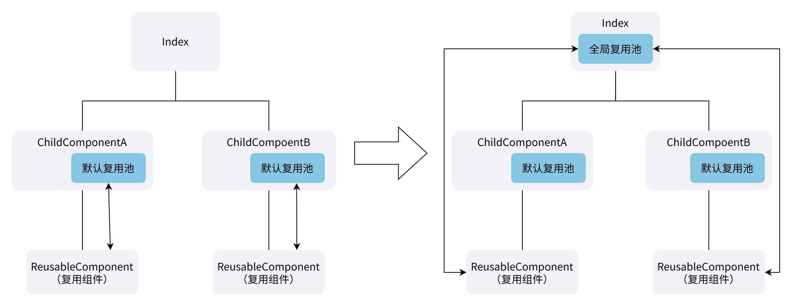
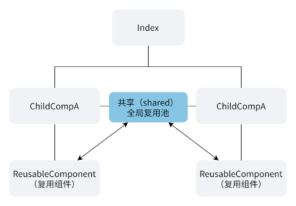
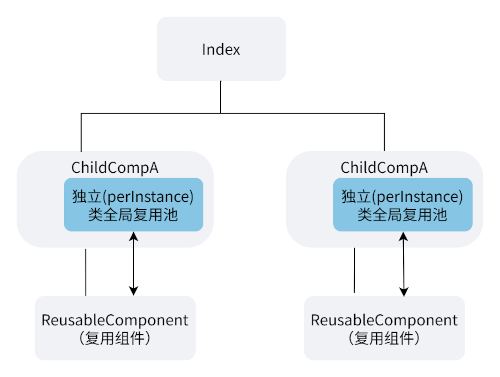
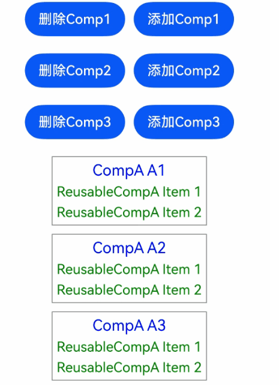
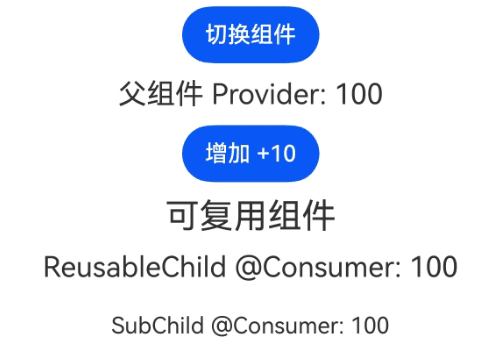
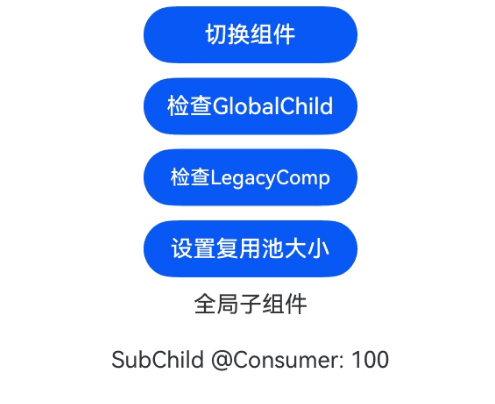
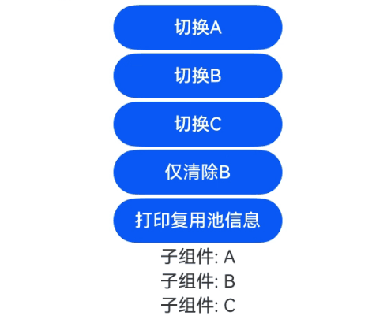
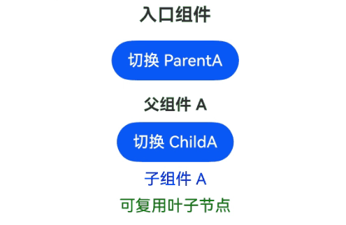

# 全局复用：集中化的组件回收与复用
<!--Kit: ArkUI-->
<!--Subsystem: ArkUI-->
<!--Owner: @zhangboren-->
<!--Designer: @zhangboren-->
<!--Tester: @TerryTsao-->
<!--Adviser: @zhang_yixin13-->

为提升组件回收与复用的性能和内存效率，全局复用池功能允许开发者在任意自定义组件上配置针对指定@Reusable/@ReusableV2复用组件的复用池，该全局复用池优先级高于与父组件绑定的默认复用池。

全局复用池提供了在不同父组件间共享回收组件实例、控制缓存生命周期和大小、以及首次使用前预渲染组件的能力。在阅读本文档之前，建议先阅读[@ComponentV2](./arkts-create-custom-components.md#componentv2)、[@Component](./arkts-create-custom-components.md#component)、[@Reusable](./arkts-reusable.md)和[@ReusableV2](./arkts-new-reusableV2.md)。

>**说明：**
>
> 全局复用池功能从API版本26.0.0开始支持。
>
> 该功能可从API版本26.0.0开始在原子化服务中使用。
>
> 全局复用池功能从API版本26.0.0开始支持在ArkTS-Sta中使用。

## 概述

在当前实现中，每个@Reusable/@ReusableV2组件的父组件都维护自己的本地复用池。当相同的可复用组件类型被多个同级组件使用时，这会导致复用效率低下，因为一个父组件池中的回收实例无法被另一个父组件复用。

全局复用池通过允许开发者在组件树的上级节点（标注为@Component或@ComponentV2的组件）处配置复用池来解决上述复用效率问题。全局复用池启用后，当复用组件创建或销毁时，框架会向上遍历组件树，为回收和复用操作查找接受指定可复用组件类型的全局复用池，从而支持跨父组件的复用场景，增加复用率，提升复用组件切换的性能。全局复用池的能力：

- 单个复用池可以为多个子组件提供服务，减少复用池的数量并提高复用率。
- 开发者可以选择组件类的所有实例共享单个复用池（[shared](#复用池所有权模式)）还是每个实例拥有自己的池（[perInstance](#复用池所有权模式)）。
- IReusableInfo（动态ArkTS接口[IReusableInfo](../../reference/apis-arkui/js-apis-stateManagement.md#ireusableinfo)，静态ArkTS接口[IReusableInfo](../../reference/apis-arkui/js-apis-stateManagement-static.md#ireusableinfo)）接口允许应用程序查询和限制缓存组件的数量，包括`reuseId`等信息。
- preRender接口（动态ArkTS接口[preRender](../../reference/apis-arkui/js-apis-stateManagement.md#prerender)，静态ArkTS接口[preRender](../../reference/apis-arkui/js-apis-stateManagement-static.md#prerender)）允许提前创建可复用组件并将其放入复用池，加快初始渲染速度。
- 复用组件在被回收或创建时，如果通过遍历父组件未找到匹配的全局复用池，则该组件会使用父组件中的默认复用池进行回收和复用。

### @Reusable/@ReusableV2默认复用池的局限性

@Reusable和@ReusableV2声明的自定义组件有默认的复用能力，其默认复用池仅存在父组件中，所以当复用的组件是粒度较小的自定义组件，同一复用组件在不同父组件中使用时，无法复用不同父组件下创建的复用组件。

典型应用场景如下，一个父组件下拥有2个可以切换的不同子组件，不同子组件使用了相同的复用组件，这些复用组件的复用池在默认情况下只能存在于子组件中，在子组件切换时，复用池会跟着子组件一起销毁，导致渲染新组件时使用的复用组件只能重新创建，无法从默认复用池中复用已创建的实例。

新增全局复用能力后，我们可以在最上层组件`Index`上声明全局复用池，在if切换组件时，`ChildComponentA`下的复用组件`ReusableComponent`能存入`Index`上的全局复用池，然后在`ChildComponentB`中的`ReusableComponent`创建时从全局复用池中取出并复用，避免重复创建复用组件。



默认复用池实例代码：

**ArkTS-Dyn:**

```ts
@Entry
@ComponentV2
struct Index {
  @Local componentSwitch: boolean = false;
  build() {
    Column() {
      Button('Switch components')
        .onClick(() => {
          this.componentSwitch = !this.componentSwitch;
        })
      if (this.componentSwitch) { // 切换不同子组件
        ChildComponentA()
      } else {
        ChildComponentB()
      }
    }
  }
}
@ComponentV2
struct ChildComponentA { // ReusableComponent复用组件的复用池默认在组件ChildComponentA上，在Index组件中if分支切换时销毁
  build() {
    Column() {
      Text('Component A')
      ReusableComponent() // 子组件ComponentA和ComponentB共用复用组件ReusableComponent
    }
  }
}
@ComponentV2
struct ChildComponentB {
  build() {
    Column() {
      Text('Component B')
      ReusableComponent() // 子组件ComponentA和ComponentB共用复用组件ReusableComponent
    }
  }
}
@ReusableV2
@ComponentV2
struct ReusableComponent { // 复用组件
  aboutToRecycle() {
    console.info('Reusable component is being recycled');
  }
  aboutToDisappear() {
    // 在Index组件中if分支切换时，由于位于父组件ChildComponentA的默认复用池被销毁，该复用组件也会被销毁，无法被ChildComponentB复用。
    console.info('Reusable component is being destroyed');
  }
  build() {
    Text('ReusableComponent')
  }
}
```

**ArkTS-Sta:**

```ts
'use static'
import { Entry, ComponentV2, Local, Column, Button, Text, ReusableV2 } from '@kit.ArkUI';

@Entry
@ComponentV2
struct Index {
  @Local componentSwitch: boolean = false;
  build() {
    Column() {
      Button('Switch components')
        .onClick(() => {
          this.componentSwitch = !this.componentSwitch;
        })
      if (this.componentSwitch) { // 切换不同子组件
        ChildComponentA()
      } else {
        ChildComponentB()
      }
    }
  }
}
@ComponentV2
// ReusableComponent复用组件的复用池默认在组件ChildComponentA上，在Index组件中if分支切换时销毁
struct ChildComponentA { 
  build() {
    Column() {
      Text('Component A')
      ReusableComponent() // 子组件ComponentA和ComponentB共用复用组件ReusableComponent
    }
  }
}
@ComponentV2
struct ChildComponentB {
  build() {
    Column() {
      Text('Component B')
      ReusableComponent() // 子组件ComponentA和ComponentB共用复用组件ReusableComponent
    }
  }
}
@ReusableV2
@ComponentV2
struct ReusableComponent { // 复用组件
  aboutToRecycle() {
    console.info('Reusable component is being recycled');
  }
  aboutToDisappear() {
    // 在Index组件中if分支切换时，由于位于父组件ChildComponentA的默认复用池被销毁，该复用组件也会被销毁，无法被ChildComponentB复用。
    console.info('Reusable component is being destroyed'); 
  }
  build() {
    Text('ReusableComponent')
  }
}
```

适配全局复用能力的示例如下：

**ArkTS-Dyn:**

```ts
@ReusableV2
@ComponentV2
struct ReusableComponent { // 复用组件
  aboutToRecycle() {
    // 在Index组件中if分支切换时，该组件由上层组件Index声明的全局复用池接纳，并复用到ChildComponentB中的ReusableComponent创建过程中
    console.info('Reusable component is being recycled'); 
  }
  aboutToDisappear() {
    console.info('Reusable component is being destroyed'); 
  }
  build() {
    Text('ReusableComponent')
  }
}
@Entry
@ComponentV2({
  reusePool: 'shared', // 配置全局复用池模式，使能全局复用能力
  poolAccepts: [ReusableComponent], // 配置全局复用池接纳名称为ReusableComponent的自定义组件
  freezeWhenInactive: false // 组件冻结默认配置 
})
struct Index {
  @Local componentSwitch: boolean = false;
  build() {
    Column() {
      Button('Switch components')
        .onClick(() => {
          this.componentSwitch = !this.componentSwitch;
        })
      if (this.componentSwitch) { // 切换不同子组件
        ChildComponentA()
      } else {
        ChildComponentB()
      }
    }
  }
}
@ComponentV2
struct ChildComponentA { // ReusableComponent复用组件的复用池使用上层组件Index的全局复用池，在ComponentA上的默认复用池会被跳过
  build() {
    Column() {
      Text('Component A')
      ReusableComponent() // 子组件ComponentA和ComponentB共用复用组件ReusableComponent
    }
  }
}
@ComponentV2
struct ChildComponentB {
  build() {
    Column() {
      Text('Component B')
      ReusableComponent() // 子组件ComponentA和ComponentB共用复用组件ReusableComponent
    }
  }
}
```

**ArkTS-Sta:**

```ts
'use static'
import { Entry, ComponentV2, Column, Button, Text, ReusableV2, ReusePoolOwnership, Local } from '@kit.ArkUI';

@Entry
@ComponentV2({
  reusePool: ReusePoolOwnership.SHARED, // 配置全局复用池模式，使能全局复用能力
  poolAccepts: ['ReusableComponent'], // 配置全局复用池接纳名称为ReusableComponent的自定义组件
})
struct Index {
  @Local componentSwitch: boolean = false;
  build() {
    Column() {
      Button('Switch components')
        .onClick(() => {
          this.componentSwitch = !this.componentSwitch;
        })
      if (this.componentSwitch) { // 切换不同子组件
        ChildComponentA()
      } else {
        ChildComponentB()
      }
    }
  }
}
@ComponentV2
struct ChildComponentA { // ReusableComponent复用组件的复用池使用上层组件Index的全局复用池，在ComponentA上的默认复用池会被跳过
  build() {
    Column() {
      Text('Component A')
      ReusableComponent() // 子组件ComponentA和ComponentB共用复用组件ReusableComponent
    }
  }
}
@ComponentV2
struct ChildComponentB {
  build() {
    Column() {
      Text('Component B')
      ReusableComponent() // 子组件ComponentA和ComponentB共用复用组件ReusableComponent
    }
  }
}
@ReusableV2
@ComponentV2
struct ReusableComponent { // 复用组件
  aboutToRecycle() {
    // 在Index组件中if分支切换时，该组件由上层组件Index声明的全局复用池接纳，并复用到ChildComponentB中的ReusableComponent创建过程中
    console.info('Reusable component is being recycled'); 
  }
  aboutToDisappear() {
    console.info('Reusable component is being destroyed'); 
  }
  build() {
    Text('ReusableComponent')
  }
}
```

### 全局复用池与默认复用池对比

| 类别 | 默认复用池 | 全局复用池 |
| -------- | ------------------ | ---------------- |
| 声明方式 | 默认复用池无需声明，当@Reusable或@Reusable装饰的自定义组件被创建或销毁时，会在父组件上创建默认复用池，该复用池能接受任意自定义组件类型。 | 全局复用池通过在@Component或@ComponentV2中配置`reusePool`和`poolAccepts`开启。 | 
| 池共享 | 每个父实例有自己的池。 | `shared`模式允许拥有组件类的所有实例共享单个池。 |
| 缓存大小控制 | 不支持 | `IReusableInfo.maxCount`提供按组件、按reuseId的缓存限制。 |
| 预渲染 | 不支持 | `preRender`在首次使用前创建组件。 |
| 内存管理 | 池生命周期与父实例绑定 | `shared`池持续存在直到所有拥有实例被销毁；`perInstance`池与单个实例绑定。 |
| V1 与 V2 混合 | 不支持 | `poolAccepts`可同时包含@Reusable复用组件@ReusableV2复用组件。 |
| 读取复用池状态 | 不支持 | getReusableInfo（动态ArkTS接口[getReusableInfo](../../reference/apis-arkui/js-apis-stateManagement.md#getreusableinfo)，静态ArkTS接口[getReusableInfo](../../reference/apis-arkui/js-apis-stateManagement-static.md#getreusableinfo)）可获取当前自定义组件的全局复用池的信息。 |

## 装饰器说明

### @Component/@ComponentV2配置参数

| 参数      | 类型 | 必填 | 说明 |
| --------- | --- | ---  | --- |
| `reusePool` | [`ReusePoolOwnership`](#复用池所有权模式) | 否 | 如果使用全局复用功能，该参数的值必须为`"shared"`或`"perInstance"`。决定此组件类的所有实例是共享单个复用池还是每个实例拥有自己的池。必须与`poolAccepts`一起使用。 |
| `poolAccepts` | **ArkTS-Dyn:** Function[]<br>**ArkTS-Sta:** string[] | 否 | 可复用组件名称的数组。列出此复用池接受哪些@Reusable/@ReusableV2组件进行回收。`reusePool`和`poolAccepts`参数必须同时提供。|
| `freezeWhenInactive` | **ArkTS-Dyn:** boolean | 是 | 配置自定义组件支持组件冻结。true：开启组件冻结，false：不开启组件冻结。<br>从API version 11开始，支持通过此参数配置@Component组件冻结。例子可见[自定义组件冻结](../../ui/state-management/arkts-custom-components-freeze.md)。<br>从API version 12开始，支持通过此参数配置@ComponentV2组件冻结。例子可见[自定义组件冻结](../../ui/state-management/arkts-custom-components-freezeV2.md)。<br>该参数只适用于ArkTS-Dyn，ArkTS-Sta无需配置。|


## 使用规则

### 配置复用池

- `reusePool`和`poolAccepts`参数必须同时提供。仅指定其中一个会导致编译错误。

- `poolAccepts`必须是非空数组，否则会导致编译报错。`poolAccepts`的成员必须是@Reusable或@ReusableV2装饰的自定义组件，使用普通（不可复用）组件、[@Builder](./arkts-builder.md) 函数或非组件类会导致编译错误。

- @Component或@ComponentV2最多只能有一个复用池。

- `reusePool`和`poolAccepts`配置仅在@Component和@ComponentV2上支持。在[@CustomDialog](../arkts-common-components-custom-dialog.md)上不受支持。

- `poolAccepts`可以同时支持V1和V2可复用组件：数组可以同时包含@Reusable和@ReusableV2装饰的自定义组件。

- 可复用组件不能在自己的全局复用池中直接接受自身组件类型，否则会导致编译错误。

### 复用池所有权模式

**ArkTS-Dyn:** **`"shared"`**：拥有@Component/@ComponentV2类的所有实例共享单个复用池实例。
**ArkTS-Sta:** **`ReusePoolOwnership.SHARED`**: 拥有@Component/@ComponentV2类的所有实例共享单个复用池实例。



`shared`复用池的生命周期：

1. 当拥有组件的第一个实例被创建时，复用池被创建并被该实例引用。
2. 当拥有组件的第二个实例被创建时，它引用已创建的复用池。不会创建新池。
3. 当第一个实例被销毁时，复用池不会被销毁，因为它仍被第二个实例引用。
4. 当第二个（最后一个）实例被销毁时，复用池也被销毁。其中的所有回收组件被删除。
5. 如果稍后创建拥有组件的新实例，则会创建新的复用池。

> **说明：**
>
> `shared`所有权与`static`类属性不同。全局复用池有跨实例的引用计数，而非永久单例。

**ArkTS-Dyn:** **`"perInstance"`**：拥有@Component/@ComponentV2的每个实例都有自己的复用池实例。复用池的生命周期与其拥有组件实例的生命周期相同。当拥有组件被销毁时，其复用池和其中的所有回收组件也被销毁。
**ArkTS-Sta:** **`ReusePoolOwnership.PER_INSTANCE`**：拥有@Component/@ComponentV2的每个实例都有自己的复用池实例。复用池的生命周期与其拥有组件实例的生命周期相同。当拥有组件被销毁时，其复用池和其中的所有回收组件也被销毁。



**ArkTS-Sta:** **`ReusePoolOwnership.OFF`**: 关闭@Component/@ComponentV2组件上的全局复用功能，在静态ArkTS中是reusePool参数的默认值。
**ArkTS-Dyn:** 动态ArkTS无需设置OFF，@Component/@ComponentV2不设置reusePool参数就可以关闭全局复用能力。

建议开发者配置`shared`所有权。这样可以获得更好的复用率和更低的内存占用。

## 接口说明

有关包括类型定义、参数表、返回值和示例在内的完整API参考，动态ArkTS请参阅[@ohos.arkui.StateManagement (状态管理) (ArkTS-Dyn)](../../reference/apis-arkui/js-apis-stateManagement.md)，静态ArkTS请参阅[@ohos.arkui.stateManagement (状态管理) (ArkTS-Sta)](../../reference/apis-arkui/js-apis-stateManagement-static.md)。

以下接口可用于全局复用池：

| 接口 | 说明 |
| --- | ----------- |
| UIUtils.getCustomComponentContext(this).getReusePool()（动态ArkTS接口[getReusePool](../../reference/apis-arkui/js-apis-stateManagement.md#getreusepool)，静态ArkTS接口[getReusePool](../../reference/apis-arkui/js-apis-stateManagement-static.md#getreusepool)） | 获取当前组件的IReusePool（动态ArkTS接口[IReusePool](../../reference/apis-arkui/js-apis-stateManagement.md#ireusepool)，静态ArkTS接口[IReusePool](../../reference/apis-arkui/js-apis-stateManagement-static.md#ireusepool)）。如果该组件或其上层组件未配置全局复用池，则返回`undefined`。 |
| IReusePool.getReusableInfo(reusableComp, reuseId?)（动态ArkTS接口[getReusableInfo](../../reference/apis-arkui/js-apis-stateManagement.md#getreusableinfo)，静态ArkTS接口[getReusableInfo](../../reference/apis-arkui/js-apis-stateManagement-static.md#getreusableinfo)） | 检索池中给定可复用组件类型的回收实例信息。支持按reuseId查询。 |
| IReusePool.preRender(builder, n)（动态ArkTS接口[preRender](../../reference/apis-arkui/js-apis-stateManagement.md#prerender)，静态ArkTS接口[preRender](../../reference/apis-arkui/js-apis-stateManagement-static.md#prerender)） | 调度空闲任务以预创建可复用组件并在首次使用前将其放入复用池。 |
| IReusableInfo（动态ArkTS接口[IReusableInfo](../../reference/apis-arkui/js-apis-stateManagement.md#ireusableinfo)，静态ArkTS接口[IReusableInfo](../../reference/apis-arkui/js-apis-stateManagement-static.md#ireusableinfo)）.count | 池中当前回收的组件数（只读）。 |
| `IReusableInfo.maxCount` | 允许的最大回收组件数。设置此项可控制缓存大小。 |
| `IReusableInfo.reuseId` | 与此池桶关联的reuseId（只读）。 |

## 使用限制

- 动态ArkTS中，@Component和@ComponentV2在配置`reusePool`和`poolAccepts`启用全局复用的同时，需要额外配置`freezeWhenInactive`参数，`freezeWhenInactive`参数的取值请参考[自定义组件冻结功能（V1）](./arkts-custom-components-freeze.md)或[自定义组件冻结功能（V2）](./arkts-custom-components-freezeV2.md)；静态ArkTS中，自定义组件默认支持冻结，@Component和@ComponentV2无需配置`freezeWhenInactive`参数。

- `getReusableInfo`和`preRender`仅在全局复用池实例上可用。它们不能在默认复用池的自定义组件上使用。

- 将`IReusableInfo.maxCount`设置为小于当前`count`的值会导致异步清除。在延迟期间，`count`可能暂时超过`maxCount`。

- 使用`preRender`预渲染但不被任何池接受的组件会被创建并立即销毁。仅预渲染池配置为接受的组件。

- 使用`"shared"`所有权时，只要拥有组件类的任何实例存在，池就会持续存在。如果拥有组件在应用程序的多个部分中使用，回收的组件可能会累积。使用`maxCount`来控制内存使用。

- 建议不要在[aboutToRecycle](../../reference/apis-arkui/arkui-ts/ts-custom-component-lifecycle.md#abouttorecycle10)中修改会触发重新渲染的状态变量，因为组件此时正从UI树中移除。

- 由于ArkTS语法限制，`poolAccepts`参数配置的自定义组件，必须在`poolAccepts`上方的代码中有定义或者从其他文件导入。如果在poolAccepts传入的组件在下方定义，则会编译报错，报错消息是“Class '...' used before its declaration.”。

## 使用场景

### 多个父组件间共享复用池

在此示例中，多个`CompA`实例为`ReusableCompA`子组件创建了共享类型的全局复用池。当删除`CompA`实例时，`ReusableCompA`子组件被回收到全局复用池中。当添加新的`CompA`实例时，它从全局复用池中复用组件，避免创建新组件。

**ArkTS-Dyn:**

```typescript
@Entry
@ComponentV2
struct Parent {
  @Local show: boolean[] = [true, true, true];

  build() {
    Column({ space: 20 }) {
      Row({ space: 10 }) {
        Button('删除Comp1')
          .onClick(() => this.show[0] = false)
        Button('添加Comp1')
          .onClick(() => this.show[0] = true)
      }
      Row({ space: 10 }) {
        Button('删除Comp2')
          .onClick(() => this.show[1] = false)
        Button('添加Comp2')
          .onClick(() => this.show[1] = true)
      }
      Row({ space: 10 }) {
        Button('删除Comp3')
          .onClick(() => this.show[2] = false)
        Button('添加Comp3')
          .onClick(() => this.show[2] = true)
      }

      Column({ space: 10 }) {
        // 使用if切换触发复用。
        if (this.show[0]) CompA({ label: 'A1' })
        if (this.show[1]) CompA({ label: 'A2' })
        if (this.show[2]) CompA({ label: 'A3' })
      }
    }
    .width('100%')
  }
}

@ReusableV2
@ComponentV2
struct ReusableCompA {
  @Require @Param value: number;

  aboutToAppear() {
    console.info('ReusableCompA aboutToAppear');
  }
  aboutToReuse() {
    console.info('ReusableCompA aboutToReuse');
  }
  aboutToRecycle() {
    console.info('ReusableCompA aboutToRecycle');
  }
  aboutToDisappear() {
    console.info('ReusableCompA aboutToDisappear');
  }

  build() {
    Text(`ReusableCompA Item ${this.value}`)
      .fontSize(16)
      .fontColor(Color.Green)
  }
}

// 多个CompA组件实例共用一个ReusableCompA的全局复用池。
@ComponentV2({ reusePool: 'shared', poolAccepts: [ReusableCompA], freezeWhenInactive: false})
struct CompA {
  @Require @Param label: string;

  build() {
    Column({ space: 5 }) {
      Text(`CompA ${this.label}`)
        .fontSize(18)
        .fontColor(Color.Blue)
      ReusableCompA({ value: 1 })
      ReusableCompA({ value: 2 })
    }
      .border({ width: 1, color: Color.Gray })
      .padding(5)
  }
}
```

**ArkTS-Sta:**

```typescript
'use static'
import { Entry, ComponentV2, Local, Column, Row, Button, Text, ReusableV2, Param, Require,
         ReusePoolOwnership, ColumnOptions, RowOptions, Color } from '@kit.ArkUI';

@Entry
@ComponentV2
struct Parent {
  @Local show: boolean[] = [true, true, true];

  build() {
    Column({ space: 20 } as ColumnOptions) {
      Row({ space: 10 } as RowOptions) {
        Button('删除Comp1')
          .onClick(() => {
            this.show[0] = false;
          })
        Button('添加Comp1')
          .onClick(() => {
            this.show[0] = true;
          })
      }
      Row({ space: 10 } as RowOptions) {
        Button('删除Comp2')
          .onClick(() => {
            this.show[1] = false;
          })
        Button('添加Comp2')
          .onClick(() => {
            this.show[1] = true;
          })
      }
      Row({ space: 10 } as RowOptions) {
        Button('删除Comp3')
          .onClick(() => {
            this.show[2] = false;
          })
        Button('添加Comp3')
          .onClick(() => {
            this.show[2] = true;
          })
      }

      Column({ space: 10 } as ColumnOptions) {
        // 使用if切换触发复用。
        if (this.show[0]) CompA({ label: 'A1' })
        if (this.show[1]) CompA({ label: 'A2' })
        if (this.show[2]) CompA({ label: 'A3' })
      }
    }
    .width('100%')
  }
}

@ReusableV2
@ComponentV2
struct ReusableCompA {
  @Require @Param value: number;

  aboutToAppear() {
    console.info('ReusableCompA aboutToAppear');
  }
  aboutToReuse() {
    console.info('ReusableCompA aboutToReuse');
  }
  aboutToRecycle() {
    console.info('ReusableCompA aboutToRecycle');
  }
  aboutToDisappear() {
    console.info('ReusableCompA aboutToDisappear');
  }

  build() {
    Text(`ReusableCompA Item ${this.value}`)
      .fontSize(16)
      .fontColor(Color.Green)
  }
}

// 多个CompA组件实例共用一个ReusableCompA的全局复用池。
@ComponentV2({ reusePool: ReusePoolOwnership.SHARED, poolAccepts: ['ReusableCompA']})
struct CompA {
  @Require @Param label: string;

  build() {
    Column({ space: 5 } as ColumnOptions) {
      Text(`CompA ${this.label}`)
        .fontSize(18)
        .fontColor(Color.Blue)
      ReusableCompA({ value: 1 })
      ReusableCompA({ value: 2 })
    }
      .border({ width: 1, color: Color.Gray })
      .padding(5)
  }
}
```



**启动** — 6个ReusableCompA子组件被创建：
```plaintext
ReusableCompA aboutToAppear (×6)
```

**删除 Comp1** — 子组件被回收：
```plaintext
ReusableCompA aboutToRecycle (×2)
```

**添加 Comp1** — 子组件从共享池中复用：
```plaintext
ReusableCompA aboutToReuse (×2)
```

**依次删除所有 3 个 CompA** — 当最后一个CompA被销毁时，没有剩余的CompA实例，因此共享池也被销毁：
```plaintext
// 删除 Comp1 和 Comp2：子组件被回收
ReusableCompA aboutToRecycle (×2, 每个被删除的 CompA)

// 删除 Comp3：最后一个实例 — 共享池被销毁
ReusableCompA aboutToDisappear (×6, 所有缓存实例被永久销毁)
```

### 使用@Provider/@Consumer的独立复用池

此示例演示与特定父实例绑定的`perInstance`池。它还展示了[@Consumer](./arkts-new-provider-and-consumer.md)在复用周期后如何重连到[@Provider](./arkts-new-provider-and-consumer.md)。

**ArkTS-Dyn:**

```typescript
@ReusableV2
@ComponentV2
struct ReusableChild {
  @Consumer() provide: number = 10;

  aboutToAppear() {
    console.info('ReusableChild aboutToAppear');
  }
  aboutToReuse() {
    console.info('ReusableChild aboutToReuse');
    // 组件被复用时修改@Consumer状态变量，能同步该数据到Parent组件的@Provider状态变量中。
    this.provide = 150;
  }
  aboutToRecycle() {
    console.info('ReusableChild aboutToRecycle');
  }
  aboutToDisappear() {
    console.info('ReusableChild aboutToDisappear');
  }

  build() {
    Column({ space: 20 }) {
      Text(`ReusableChild @Consumer: ${this.provide}`)
        .fontSize(20)
      SubChild()
    }
  }
}

@Entry
// 声明全局复用池，接纳ReusableChild复用组件。
@ComponentV2({ reusePool: 'perInstance', poolAccepts: [ReusableChild], freezeWhenInactive: false })
struct Parent {
  @Provider() provide: number = 100;
  @Local boolVal: boolean = false;

  build() {
    Column({ space: 10 }) {
      Button('切换组件')
        .onClick(() => {
          this.boolVal = !this.boolVal;
        })

      Text(`父组件 Provider: ${this.provide}`)
        .fontSize(20)
      Button('增加 +10')
        .onClick(() => {
          this.provide += 10;
        })

      // 切换到可复用组件时，ReusableChild会进入当前组件的全局复用池中。
      if (this.boolVal) {
        Text('非可复用组件')
          .fontSize(24)
        Child()
      } else {
        Text('可复用组件')
          .fontSize(24)
        ReusableChild()
      }
    }
    .width('100%')
  }
}

@ComponentV2
struct SubChild {
  @Consumer() provide: number = 10;

  aboutToAppear() {
    console.info('SubChild aboutToAppear');
  }
  aboutToReuse() {
    console.info('SubChild aboutToReuse');
  }
  aboutToRecycle() {
    console.info('SubChild aboutToRecycle');
  }
  aboutToDisappear() {
    console.info('SubChild aboutToDisappear');
  }

  build() {
    Text(`SubChild @Consumer: ${this.provide}`)
  }
}

@ComponentV2
struct Child {
  @Consumer() provide: number = 10;

  aboutToAppear() {
    console.info('Child aboutToAppear');
  }
  aboutToDisappear() {
    console.info('Child aboutToDisappear');
  }

  build() {
    Column({ space: 20 }) {
      Text(`Child @Consumer: ${this.provide}`)
        .fontSize(20)
      SubChild()
    }
  }
}
```

**ArkTS-Sta:**

```typescript
'use static'
import { Entry, ComponentV2, Local, Column, Row, Button, Text, ReusableV2, Param, Require,
         Provider, Consumer, ReusePoolOwnership, ColumnOptions } from '@kit.ArkUI';

@ReusableV2
@ComponentV2
struct ReusableChild {
  @Consumer() provide: number = 10;

  aboutToAppear() {
    console.info('ReusableChild aboutToAppear');
  }
  aboutToReuse() {
    console.info('ReusableChild aboutToReuse');
    // 组件被复用时修改@Consumer状态变量，能同步该数据到Parent组件的@Provider状态变量中。
    this.provide = 150;
  }
  aboutToRecycle() {
    console.info('ReusableChild aboutToRecycle');
  }
  aboutToDisappear() {
    console.info('ReusableChild aboutToDisappear');
  }

  build() {
    Column({ space: 20 } as ColumnOptions) {
      Text(`ReusableChild @Consumer: ${this.provide}`)
        .fontSize(20)
      SubChild()
    }
  }
}

@Entry
// 声明全局复用池，接纳ReusableChild复用组件。
@ComponentV2({ reusePool: ReusePoolOwnership.PER_INSTANCE, poolAccepts: ['ReusableChild'] })
struct Parent {
  @Provider() provide: number = 100;
  @Local boolVal: boolean = false;

  build() {
    Column({ space: 10 } as ColumnOptions) {
      Button('切换组件')
        .onClick(() => {
          this.boolVal = !this.boolVal;
        })

      Text(`父组件 Provider: ${this.provide}`)
        .fontSize(20)
      Button('增加 +10')
        .onClick(() => {
          this.provide += 10;
        })

      // 切换到可复用组件时，ReusableChild会进入当前组件的全局复用池中。
      if (this.boolVal) {
        Text('非可复用组件')
          .fontSize(24)
        Child()
      } else {
        Text('可复用组件')
          .fontSize(24)
        ReusableChild()
      }
    }
    .width('100%')
  }
}

@ComponentV2
struct SubChild {
  @Consumer() provide: number = 10;

  aboutToAppear() {
    console.info('SubChild aboutToAppear');
  }
  aboutToReuse() {
    console.info('SubChild aboutToReuse');
  }
  aboutToRecycle() {
    console.info('SubChild aboutToRecycle');
  }
  aboutToDisappear() {
    console.info('SubChild aboutToDisappear');
  }

  build() {
    Text(`SubChild @Consumer: ${this.provide}`)
  }
}

@ComponentV2
struct Child {
  @Consumer() provide: number = 10;

  aboutToAppear() {
    console.info('Child aboutToAppear');
  }
  aboutToDisappear() {
    console.info('Child aboutToDisappear');
  }

  build() {
    Column({ space: 20 } as ColumnOptions) {
      Text(`Child @Consumer: ${this.provide}`)
        .fontSize(20)
      SubChild()
    }
  }
}
```



**从ReusableChild切换到Child**：
```plaintext
ReusableChild aboutToRecycle   // 进入池
SubChild aboutToRecycle        // 子树级联
Child aboutToAppear            // 非可复用，全新创建
SubChild aboutToAppear         // Child内的新SubChild
```

**从Child切换到ReusableChild**：
```plaintext
Child aboutToDisappear         // 非可复用，永久销毁
SubChild aboutToDisappear      // 随Child一起销毁
ReusableChild aboutToReuse     // 从池中检索，@Consumer重连
SubChild aboutToReuse          // 子树级联
```

复用后，`aboutToReuse`回调设置`this.provide = 150`。[@Consumer](./arkts-new-provider-and-consumer.md)重连到Parent组件的[@Provider](./arkts-new-provider-and-consumer.md)。后续@Provider更新正确传播到复用的组件。

### 使用`getReusableInfo`检查和控制池

此示例演示如何使用`getReusableInfo`接口在运行时检查池状态和控制缓存大小。

**ArkTS-Dyn:**

```typescript
import { UIUtils, IReusableInfo } from '@kit.ArkUI';

@ReusableV2
@ComponentV2
struct GlobalChild {
  @Consumer() provide: number = 10;

  aboutToAppear() {
    console.info('GlobalChild aboutToAppear');
  }
  aboutToReuse() {
    console.info('GlobalChild aboutToReuse');
  }
  aboutToRecycle() {
    console.info('GlobalChild aboutToRecycle');
  }
  aboutToDisappear() {
    console.info('GlobalChild aboutToDisappear');
  }

  build() {
    Column({ space: 20 }) {
      Text('全局子组件')
      SubChild()
    }
  }
}

@ReusableV2
@ComponentV2
struct LegacyComp {
  aboutToAppear() {
    console.info('LegacyComp aboutToAppear');
  }
  aboutToReuse() {
    console.info('LegacyComp aboutToReuse');
  }
  aboutToRecycle() {
    console.info('LegacyComp aboutToRecycle');
  }
  aboutToDisappear() {
    console.info('LegacyComp aboutToDisappear');
  }

  build() {
    Column() {
      Text('传统组件')
      ReusableChild()
    }
  }
}

@ReusableV2
@ComponentV2
struct ReusableChild {
  @Consumer() provide: number = 10;
  aboutToAppear() {
    console.info('ReusableChild aboutToAppear');
  }
  aboutToReuse() {
    console.info('ReusableChild aboutToReuse');
  }
  aboutToRecycle() {
    console.info('ReusableChild aboutToRecycle');
  }
  aboutToDisappear() {
    console.info('ReusableChild aboutToDisappear');
  }

  build() {
    Text(`ReusableChild @Consumer: ${this.provide}`)
  }
}

@ReusableV2
@ComponentV2
struct SubChild {
  @Consumer() provide: number = 10;
  aboutToAppear() {
    console.info('SubChild aboutToAppear');
  }
  aboutToReuse() {
    console.info('SubChild aboutToReuse');
  }
  aboutToRecycle() {
    console.info('SubChild aboutToRecycle');
  }
  aboutToDisappear() {
    console.info('SubChild aboutToDisappear');
  }

  build() {
    Text(`SubChild @Consumer: ${this.provide}`)
  }
}

@Entry
// 配置全局复用池，使用perInstance所有权模式，全局复用池接纳4个复用组件
@ComponentV2({ reusePool: 'perInstance', poolAccepts: [LegacyComp, GlobalChild, ReusableChild, SubChild], freezeWhenInactive: false })
struct Index {
  @Provider() provide: number = 100;
  @Local boolVal: boolean = true;

  // 检查并打印复用池大小信息
  verifyPool(compName: string, comp: Function) {
    const pool = UIUtils.getCustomComponentContext(this).getReusePool();
    if (!pool) {
      console.info('Cannot find pool.');
      return;
    }
    const ret = pool.getReusableInfo(comp);
    // 基于复用数据类型打印复用池信息
    if (ret === undefined) {
      console.info(`getReusableInfo(${compName}): undefined`);
    } else if (Array.isArray(ret)) {
      console.info(`getReusableInfo(${compName}): Array[${ret.length}]`);
      ret.forEach((info: IReusableInfo, i: number) => {
        console.info(`  [${i}] count=${info.count}, maxCount=${info.maxCount}`);
      });
    } else {
      console.info(`getReusableInfo(${compName}): count=${ret.count}, maxCount=${ret.maxCount}`);
    }
  }

  // 设置复用池大小为0，清空复用池中指定组件的实例
  setPoolMaxCount(compName: string, comp: Function) {
    const pool = UIUtils.getCustomComponentContext(this).getReusePool();
    if (!pool) {
      console.info('Cannot find pool.');
      return;
    }
    const ret = pool.getReusableInfo(comp);
    if (ret && !Array.isArray(ret)) {
      // maxCount赋值为0时会释放复用池中的组件。
      ret.maxCount = 0;
    }
  }

  build() {
    Column({ space: 10 }) {
      Button('切换组件')
        .onClick(() => {
          this.boolVal = !this.boolVal;
        })
        .width(150)

      // 手动池检查按钮
      Button('检查GlobalChild')
        .onClick(() => this.verifyPool('GlobalChild', GlobalChild))
        .width(150)
      Button('检查LegacyComp')
        .onClick(() => this.verifyPool('LegacyComp', LegacyComp))
        .width(150)
      Button('设置复用池大小')
        .onClick(() => this.setPoolMaxCount('LegacyComp', LegacyComp))
        .width(150)

      if (this.boolVal) {
        GlobalChild()
      } else {
        LegacyComp()
      }
    }
    .width('100%')
  }
}
```

**ArkTS-Sta:**

```typescript
'use static'
import { UIUtils, IReusableInfo, ReusableV2, ComponentV2, Consumer, Provider, Text, Entry,
         Local, Column, Button, ColumnOptions } from '@kit.ArkUI';

// 可复用全局子组件，使用@Consumer装饰器消费提供的数据
@ReusableV2
@ComponentV2
struct GlobalChild {
  @Consumer() provide: number = 10;

  aboutToAppear() {
    console.info('GlobalChild aboutToAppear');
  }
  aboutToReuse() {
    console.info('GlobalChild aboutToReuse');
  }
  aboutToRecycle() {
    console.info('GlobalChild aboutToRecycle');
  }
  aboutToDisappear() {
    console.info('GlobalChild aboutToDisappear');
  }

  build() {
    Column({ space: 20 } as ColumnOptions) {
      Text('全局子组件')
      SubChild()
    }
  }
}

@ReusableV2
@ComponentV2
struct LegacyComp {
  aboutToAppear() {
    console.info('LegacyComp aboutToAppear');
  }
  aboutToReuse() {
    console.info('LegacyComp aboutToReuse');
  }
  aboutToRecycle() {
    console.info('LegacyComp aboutToRecycle');
  }
  aboutToDisappear() {
    console.info('LegacyComp aboutToDisappear');
  }

  build() {
    Column() {
      Text('传统组件')
      ReusableChild()
    }
  }
}

// 可复用子组件，使用@Consumer装饰器消费提供的数据
@ReusableV2
@ComponentV2
struct ReusableChild {
  @Consumer() provide: number = 10;
  aboutToAppear() {
    console.info('ReusableChild aboutToAppear');
  }
  aboutToReuse() {
    console.info('ReusableChild aboutToReuse');
  }
  aboutToRecycle() {
    console.info('ReusableChild aboutToRecycle');
  }
  aboutToDisappear() {
    console.info('ReusableChild aboutToDisappear');
  }

  build() {
    Text(`ReusableChild @Consumer: ${this.provide}`)
  }
}

// 可复用的子子组件，使用@Consumer装饰器消费提供的数据
@ReusableV2
@ComponentV2
struct SubChild {
  @Consumer() provide: number = 10;
  aboutToAppear() {
    console.info('SubChild aboutToAppear');
  }
  aboutToReuse() {
    console.info('SubChild aboutToReuse');
  }
  aboutToRecycle() {
    console.info('SubChild aboutToRecycle');
  }
  aboutToDisappear() {
    console.info('SubChild aboutToDisappear');
  }

  build() {
    Text(`SubChild @Consumer: ${this.provide}`)
  }
}

// 配置perInstance模式的复用池，接纳指定的可复用组件
@Entry
@ComponentV2({ reusePool: ReusePoolOwnership.PER_INSTANCE, poolAccepts: ['LegacyComp', 'GlobalChild', 'ReusableChild', 'SubChild'] })
struct Index {
  // 使用@Provider装饰器提供数据
  @Provider() provide: number = 100;
  @Local boolVal: boolean = true;

  // 验证复用池状态的方法，打印指定组件的复用池信息
  verifyPool(compName: string, comp: Class) {
    const pool = UIUtils.getCustomComponentContext(this).getReusePool();
    if (!pool) {
      console.info('Cannot find pool.');
      return;
    }
    // 获取指定组件的复用信息
    const ret = pool.getReusableInfo(comp);
    if (ret === undefined) {
      console.info(`getReusableInfo(${compName}): undefined`);
    } else if (Array.isArray(ret)) {
      console.info(`getReusableInfo(${compName}): Array[${(ret as IReusableInfo[]).length}]`);
      (ret as IReusableInfo[]).forEach((info: IReusableInfo, i: int) => {
        console.info(`  [${i}] count=${(info as IReusableInfo).count}, maxCount=${(info as IReusableInfo).maxCount}`);
      });
    } else {
      console.info(`getReusableInfo(${compName}): count=${(ret as IReusableInfo).count},`
          + ` maxCount=${(ret as IReusableInfo).maxCount}`);
    }
  }

  // 设置复用池最大缓存数量的方法
  setPoolMaxCount(compName: string, comp: Class) {
    const pool = UIUtils.getCustomComponentContext(this).getReusePool();
    if (!pool) {
      console.info('Cannot find pool.');
      return;
    }
    const ret = pool.getReusableInfo(comp);
    if (ret && !Array.isArray(ret)) {
      // maxCount赋值为0时会释放复用池中的组件。
      (ret as IReusableInfo).maxCount = 0;
    }
  }

  build() {
    Column({ space: 10 } as ColumnOptions) {
      Button('切换组件')
        .onClick(() => {
          this.boolVal = !this.boolVal;
        })
        .width(150)

      // 手动池检查按钮
      Button('检查GlobalChild')
        .onClick(() => this.verifyPool('GlobalChild', Class.from<GlobalChild>()))
        .width(150)
      Button('检查LegacyComp')
        .onClick(() => this.verifyPool('LegacyComp', Class.from<LegacyComp>()))
        .width(150)
      Button('设置复用池大小')
        .onClick(() => this.setPoolMaxCount('LegacyComp', Class.from<LegacyComp>()))
        .width(150)

      // 根据boolVal状态显示不同的可复用组件
      if (this.boolVal) {
        GlobalChild()
      } else {
        LegacyComp()
      }
    }
    .width('100%')
  }
}
```



**步骤1 — 启动**（GlobalChild可见）：

点击"检查GlobalChild"：`count=0, maxCount=100`（GlobalChild可见，不在池中）。

点击"检查LegacyComp"：`count=0, maxCount=100`（LegacyComp不可见，不在池中）。

**步骤2 — 切换到LegacyComp**：
```plaintext
GlobalChild aboutToRecycle    // 进入池
SubChild aboutToRecycle       // 和GlobalChild一起进入复用池
LegacyComp aboutToAppear      // 全新创建
ReusableChild aboutToAppear
```

点击"检查GlobalChild"：`count=1, maxCount=100`（回收到池中）。

点击"检查LegacyComp"：`count=0, maxCount=100`（可见，不在池中）。

**步骤3 — 切换回GlobalChild**：
```plaintext
LegacyComp aboutToRecycle
ReusableChild aboutToRecycle
GlobalChild aboutToReuse      // 从池中复用
SubChild aboutToReuse         // 和GlobalChild一起被复用
```

点击"检查LegacyComp"：`count=1, maxCount=100`（现在回收到池中）。

**步骤4 — 点击设置复用池大小**：

```plaintext
LegacyComp aboutToDisappear
ReusableChild aboutToRecycle
```

再点击"检查LegacyComp": `count=0, maxCount=0`（复用池被手动清空了）

### 使用`reuseId`控制缓存大小

当使用不同的`reuseId`值回收组件时，`getReusableInfo`返回可以独立控制的每个桶的信息。

**ArkTS-Dyn:**

```typescript
import { UIUtils, IReusableInfo } from '@kit.ArkUI';

@ReusableV2
@ComponentV2
struct TestChild {
  @Param label: string = '';
  aboutToAppear() {
    console.info(`TestChild [${this.label}] aboutToAppear`);
  }
  aboutToReuse() {
    console.info(`TestChild [${this.label}] aboutToReuse`);
  }
  aboutToRecycle() {
    console.info(`TestChild [${this.label}] aboutToRecycle`);
  }
  aboutToDisappear() {
    console.info(`TestChild [${this.label}] aboutToDisappear`);
  }
  build() {
    Text(`子组件: ${this.label}`)
  }
}

@Entry
// 配置全局复用池，使用perInstance所有权模式，接纳TestChild复用组件
@ComponentV2({ reusePool: 'perInstance', poolAccepts: [TestChild], freezeWhenInactive: false })
struct PoolOwner {
  @Local showA: boolean = true;
  @Local showB: boolean = true;
  @Local showC: boolean = true;

  // 清空指定reuseId的复用池
  purgeReuseId(id: string) {
    const pool = UIUtils.getCustomComponentContext(this).getReusePool();
    const info = pool?.getReusableInfo(TestChild, id) as IReusableInfo;
    if (info) {
      info.maxCount = 0;  // 仅释放全局复用池中此reuseId对应的复用组件
    }
  }

  // 打印当前组件复用池信息
  printReusePool() {
    const pool = UIUtils.getCustomComponentContext(this).getReusePool();
    const info = pool?.getReusableInfo(TestChild) as IReusableInfo[];
    if (info) {
      info.forEach((item) => {
        console.info(`{ count: ${item.count}, maxCount: ${item.maxCount}, reuseId: ${item.reuseId} }`);
      })
    }
  }

  build() {
    Column({ space: 3 }) {
      Button('切换A')
        .onClick(() => {
          this.showA = !this.showA;
        })
        .width(150)
      Button('切换B')
        .onClick(() => {
          this.showB = !this.showB;
        })
        .width(150)
      Button('切换C')
        .onClick(() => {
          this.showC = !this.showC;
        })
        .width(150)
      Button('仅清除B')
        // 清除reuseId为B的复用池大小
        .onClick(() => this.purgeReuseId('B'))
        .width(150)
      Button('打印复用池信息')
        .onClick(() => this.printReusePool())
        .width(150)

      if (this.showA) {
        TestChild({ label: 'A' })
          .reuse({ reuseId: () => 'A' })
      }
      if (this.showB) {
        // TestChild B 使用reuseId B
        TestChild({ label: 'B' })
          .reuse({ reuseId: () => 'B' })
      }
      if (this.showC) {
        TestChild({ label: 'C' })
          .reuse({ reuseId: () => 'C' })
      }
    }
    .width('100%')
  }
}
```

**ArkTS-Sta:**

```typescript
'use static'
import { UIUtils, IReusableInfo, ReusableV2, ComponentV2, Param, Text, Entry, Local,
         Column, Button, ReusePoolOwnership, ColumnOptions } from '@kit.ArkUI';

@ReusableV2
@ComponentV2
struct TestChild {
  @Param label: string = '';
  aboutToAppear() {
    console.info(`TestChild [${this.label}] aboutToAppear`);
  }
  aboutToReuse() {
    console.info(`TestChild [${this.label}] aboutToReuse`);
  }
  aboutToRecycle() {
    console.info(`TestChild [${this.label}] aboutToRecycle`);
  }
  aboutToDisappear() {
    console.info(`TestChild [${this.label}] aboutToDisappear`);
  }
  build() {
    Text(`子组件: ${this.label}`)
  }
}

@Entry
// 配置全局复用池，使用perInstance所有权模式，接纳TestChild复用组件
@ComponentV2({ reusePool: ReusePoolOwnership.PER_INSTANCE, poolAccepts: ['TestChild'] })
struct PoolOwner {
  @Local showA: boolean = true;
  @Local showB: boolean = true;
  @Local showC: boolean = true;

  // 清空指定reuseId的复用池
  purgeReuseId(id: string) {
    const pool = UIUtils.getCustomComponentContext(this).getReusePool();
    const info = pool?.getReusableInfo(Class.from<TestChild>(), id) as IReusableInfo;
    if (info) {
      info.maxCount = 0;  // 仅释放全局复用池中此reuseId对应的复用组件
    }
  }

  // 打印当前组件复用池信息
  printReusePool() {
    const pool = UIUtils.getCustomComponentContext(this).getReusePool();
    const info = pool?.getReusableInfo(Class.from<TestChild>()) as IReusableInfo[];
    if (info) {
      info.forEach((item) => {
        console.info(`{ count: ${item.count}, maxCount: ${item.maxCount}, reuseId: ${item.reuseId} }`);
      })
    }
  }

  build() {
    Column({ space: 3 } as ColumnOptions) {
      Button('切换A')
        .onClick(() => {
          this.showA = !this.showA;
        })
        .width(150)
      Button('切换B')
        .onClick(() => {
          this.showB = !this.showB;
        })
        .width(150)
      Button('切换C')
        .onClick(() => {
          this.showC = !this.showC;
        })
        .width(150)
      Button('仅清除B')
        // 清除reuseId为B的复用池大小
        .onClick(() => this.purgeReuseId('B'))
        .width(150)
      Button('打印复用池信息')
        .onClick(() => this.printReusePool())
        .width(150)

      if (this.showA) {
        TestChild({ label: 'A' })
          .reuse({ reuseId: () => 'A' })
      }
      if (this.showB) {
        // TestChild B 使用reuseId B
        TestChild({ label: 'B' })
          .reuse({ reuseId: () => 'B' })
      }
      if (this.showC) {
        TestChild({ label: 'C' })
          .reuse({ reuseId: () => 'C' })
      }
    }
    .width('100%')
  }
}
```



当所有3个都被关闭时，`getReusableInfo(TestChild)`（不带reuseId）返回一个数组：
```typescript
  { count: 0, maxCount: 100, reuseId: undefined }  // 始终包含
  { count: 1, maxCount: 100, reuseId: 'A' }
  { count: 1, maxCount: 100, reuseId: 'B' }
  { count: 1, maxCount: 100, reuseId: 'C' }
```

点击"仅清除B"（设置B的`maxCount = 0`）后，只有B的实例被释放。数组变为：
```typescript
  { count: 0, maxCount: 100, reuseId: undefined }
  { count: 1, maxCount: 100, reuseId: 'A' }
  { count: 0, maxCount: 0, reuseId: 'B' } // maxCount非默认时也会显示
  { count: 1, maxCount: 100, reuseId: 'C' }
```

全部重新打开：
- A和C触发`aboutToReuse`（从池中复用）。
- B触发`aboutToAppear`（新实例）。

查询不存在的reuseId（例如，`pool.getReusableInfo(TestChild, 'X')`）返回单个对象，其中 `count: 0, maxCount: 100`。

### 多级复用池结构

当在组件树的不同级别存在多个复用池配置时，每个可复用组件路由到接受它的最近的祖先池。

**ArkTS-Dyn:**

```typescript
@ReusableV2
@ComponentV2
struct ChildA {
  aboutToAppear() {
    console.info('ChildA aboutToAppear');
  }
  aboutToReuse() {
    console.info('ChildA aboutToReuse');
  }
  aboutToRecycle() {
    console.info('ChildA aboutToRecycle');
  }
  aboutToDisappear() {
    console.info('ChildA aboutToDisappear');
  }

  build() {
    Column({ space: 8 }) {
      Text('子组件 A')
        .fontColor(Color.Blue)
      // 复用组件ChildA中包含复用组件ReusableLeaf
      ReusableLeaf()
    }
  }
}

@ReusableV2
@ComponentV2
struct ReusableLeaf {
  aboutToAppear() {
    console.info('ReusableLeaf aboutToAppear');
  }
  aboutToReuse() {
    console.info('ReusableLeaf aboutToReuse');
  }
  aboutToRecycle() {
    console.info('ReusableLeaf aboutToRecycle');
  }
  aboutToDisappear() {
    console.info('ReusableLeaf aboutToDisappear');
  }

  build() {
    Text('可复用叶子节点')
      .fontColor(Color.Green)
  }
}

@Entry
// 配置全局复用池，接纳ChildA复用组件
@ComponentV2({ reusePool: 'shared', poolAccepts: [ChildA], freezeWhenInactive: false })
struct EntryComp {
  @Local showParent: boolean = true;

  build() {
    Column({ space: 15 }) {
      Text('入口组件')
        .fontSize(18)
        .fontWeight(FontWeight.Bold)
      Button('切换 ParentA')
        .onClick(() => {
          // 修改if条件触发组件复用
          this.showParent = !this.showParent;
        })
      // 切换if分支后，ParentA中的ChildA进入EntryComp的全局复用池
      if (this.showParent) {
        ParentA()
      }
    }
    .width('100%')
  }
}

// 配置全局复用池，接纳ReusableLeaf复用组件
@ComponentV2({ reusePool: 'perInstance', poolAccepts: [ReusableLeaf], freezeWhenInactive: false })
struct ParentA {
  @Local showChild: boolean = true;

  aboutToAppear() {
    console.info('ParentA aboutToAppear');
  }

  build() {
    Column({ space: 8 }) {
      Text('父组件 A')
        .fontSize(16)
        .fontWeight(FontWeight.Bold)
      Button('切换 ChildA')
        .onClick(() => { 
          // 修改if条件触发子组件ChildA复用
          this.showChild = !this.showChild;
        })
      // 切换if分支后，ChildA进入EntryComp的全局复用池，ReusableLeaf节点跟随ChildA存入EntryComp复用池中。
      if (this.showChild) {
        ChildA()
      }
    }
  }
}
```

**ArkTS-Sta:**

```typescript
'use static'
import { ReusableV2, ComponentV2, Local, Column, Row, Button, Text, Entry, 
         ReusePoolOwnership, ColumnOptions, Color, FontWeight } from '@kit.ArkUI';
@ReusableV2
@ComponentV2
struct ChildA {
  aboutToAppear() {
    console.info('ChildA aboutToAppear');
  }
  aboutToReuse() {
    console.info('ChildA aboutToReuse');
  }
  aboutToRecycle() {
    console.info('ChildA aboutToRecycle');
  }
  aboutToDisappear() {
    console.info('ChildA aboutToDisappear');
  }

  build() {
    Column({ space: 8 } as ColumnOptions) {
      Text('子组件 A')
        .fontColor(Color.Blue)
      // 复用组件ChildA中包含复用组件ReusableLeaf
      ReusableLeaf()
    }
  }
}

@ReusableV2
@ComponentV2
struct ReusableLeaf {
  aboutToAppear() {
    console.info('ReusableLeaf aboutToAppear');
  }
  aboutToReuse() {
    console.info('ReusableLeaf aboutToReuse');
  }
  aboutToRecycle() {
    console.info('ReusableLeaf aboutToRecycle');
  }
  aboutToDisappear() {
    console.info('ReusableLeaf aboutToDisappear');
  }

  build() {
    Text('可复用叶子节点')
      .fontColor(Color.Green)
  }
}

@Entry
// 配置全局复用池，接纳ChildA复用组件
@ComponentV2({ reusePool: ReusePoolOwnership.SHARED, poolAccepts: ['ChildA'] })
struct EntryComp {
  @Local showParent: boolean = true;

  build() {
    Column({ space: 15 } as ColumnOptions) {
      Text('入口组件')
        .fontSize(18)
        .fontWeight(FontWeight.Bold)
      Button('切换 ParentA')
        .onClick(() => {
          // 修改if条件触发组件复用
          this.showParent = !this.showParent;
        })
      // 切换if分支后，ParentA中的ChildA进入EntryComp的全局复用池
      if (this.showParent) {
        ParentA()
      }
    }
    .width('100%')
  }
}

// 配置全局复用池，接纳ReusableLeaf复用组件
@ComponentV2({ reusePool: ReusePoolOwnership.PER_INSTANCE, poolAccepts: ['ReusableLeaf'] })
struct ParentA {
  @Local showChild: boolean = true;

  aboutToAppear() {
    console.info('ParentA aboutToAppear');
  }

  build() {
    Column({ space: 8 } as ColumnOptions) {
      Text('父组件 A')
        .fontSize(16)
        .fontWeight(FontWeight.Bold)
      Button('切换 ChildA')
        .onClick(() => { 
          // 修改if条件触发子组件ChildA复用
          this.showChild = !this.showChild;
        })
      // 切换if分支后，ChildA进入EntryComp的全局复用池，ReusableLeaf节点跟随ChildA存入EntryComp复用池中。
      if (this.showChild) {
        ChildA()
      }
    }
  }
}
```



- `ChildA`使用`EntryComp`上声明的全局复用池，因为`EntryComp`复用池配置`poolAccepts`接受`ChildA`。
- `ReusableLeaf`和它的父组件`ChildA`一起进入`EntryComp`的复用池中，不会进入`ParentA`上配置的全局复用池。


**关闭/打开ChildA** — `ChildA`和`ReusableLeaf`都从各自的池中回收和复用：
```plaintext
ChildA aboutToRecycle / aboutToReuse         // EntryComp的池
ReusableLeaf aboutToRecycle / aboutToReuse   // EntryComp的池
```

**关闭ParentA**（当ChildA在池中时）— ParentA被销毁，但ParentA复用池为空，不会触发ReusableLeaf的组件销毁。

**打开ParentA** — ParentA被全新创建。ChildA从EntryComp的池中复用，ReusableLeaf也被复用：
```plaintext
ParentA aboutToAppear           // 新实例
ChildA aboutToReuse             // 从EntryComp的复用池中取出
ReusableLeaf aboutToReuse       // 从EntryComp的复用池中取出
```

### 使用`preRender`预渲染组件

`preRender`用于提前创建可复用组件实例并将其放入复用池，后续创建时可直接复用。

**ArkTS-Dyn:**

```typescript
import { UIUtils, IReusableInfo } from '@kit.ArkUI';

@ReusableV2
@ComponentV2
struct ReusableComponent {
  @Param param: number = 8;

  aboutToAppear() {
    console.info('ReusableComponent aboutToAppear');
  }
  aboutToReuse() {
    console.info('ReusableComponent aboutToReuse');
  }

  build() {
    Column() {
      Text(`ReusableComponent ${this.param}`)
    }
  }
}

@Builder 
function preRenderBuilder() {
  ReusableComponent()
}

@Entry
@ComponentV2({ reusePool: 'shared', poolAccepts: [ReusableComponent], freezeWhenInactive: false })
struct Index {
  @Local onUIFullyLoaded: boolean = false;

  aboutToAppear() {
    // 获取池并调度预渲染。
    const pool = UIUtils.getCustomComponentContext(this).getReusePool();
    pool!.preRender(new WrappedBuilder<[]>(preRenderBuilder.bind(this)), 1)
      .then(() => {
        console.info('ReusableComponent preRender completes');
      });
  }

  checkPool() {
    // 获取全局复用池内组件数量
    const reusePool = UIUtils.getCustomComponentContext(this).getReusePool();
    const reusableInfo: IReusableInfo = reusePool!.getReusableInfo(ReusableComponent) as IReusableInfo;
    console.info(`ReusableComponent reuse pool count=${reusableInfo.count}`);
  }

  build() {
    Column({ space: 5 }) {
      Button('Switch')
        .onClick(() => {
          // 切换触发组件复用
          this.onUIFullyLoaded = !this.onUIFullyLoaded;
        })
        .width(100)
      Button('Check pool')
        .onClick(() => {
          // 检查复用池大小
          this.checkPool();
        })
        .width(100)
      CompA({ showFullUI: this.onUIFullyLoaded })
    }
    .width('100%')
  }
}

@ComponentV2
struct CompA {
  @Require @Param showFullUI: boolean;

  build() {
    if (this.showFullUI) {
      ReusableComponent()
    }
  }
}
```

**ArkTS-Sta:**

```typescript
'use static'
import { UIUtils, ReusableV2, ComponentV2, Param, Require, Local, Column, Text, Entry,
         ReusePoolOwnership, WrappedBuilder, Builder, IReusableInfo, ColumnOptions, Button } from '@kit.ArkUI';

@ReusableV2
@ComponentV2
struct ReusableComponent {
  @Param param: number = 8;

  aboutToAppear() {
    console.info('ReusableComponent aboutToAppear');
  }
  aboutToReuse() {
    console.info('ReusableComponent aboutToReuse');
  }

  build() {
    Column() {
      Text(`ReusableComponent ${this.param}`)
    }
  }
}

@Builder 
function preRenderBuilder() {
  ReusableComponent()
}

@Entry
@ComponentV2({ reusePool: ReusePoolOwnership.SHARED, poolAccepts: ['ReusableComponent'] })
struct Index {
  @Local onUIFullyLoaded: boolean = false;

  aboutToAppear() {
    // 获取池并调度预渲染。
    const pool = UIUtils.getCustomComponentContext(this).getReusePool();
    pool!.preRender(new WrappedBuilder<@Builder () => void>(preRenderBuilder), 1)
      .then(() => {
        console.info('ReusableComponent preRender completes');
      });
  }

  checkPool() {
    const pool = UIUtils.getCustomComponentContext(this).getReusePool();
    const reusableInfo: IReusableInfo = pool!.getReusableInfo(Class.from<ReusableComponent>()) as IReusableInfo;
    console.info(`ReusableComponent reuse pool count=${reusableInfo.count}`);
  }

  build() {
    Column({ space: 5 } as ColumnOptions) {
      Button('Switch')
        .onClick(() => {
          // 切换触发组件复用
          this.onUIFullyLoaded = !this.onUIFullyLoaded;
        })
        .width(100)
      Button('Check pool')
        .onClick(() => {
          // 检查复用池大小
          this.checkPool();
        })
        .width(100)
      CompA({ showFullUI: this.onUIFullyLoaded })
    }
    .width('100%')
  }
}

@ComponentV2
struct CompA {
  @Require @Param showFullUI: boolean;

  build() {
    if (this.showFullUI) {
      ReusableComponent()
    }
  }
}
```


执行序列：

1. 启动时，`Index.aboutToAppear()`通过`UIUtils.getCustomComponentContext(this).getReusePool()`获取池并调用`preRender`。`preRender`作为空闲任务异步执行：它调用@Builder函数，创建`ReusableComponent`实例。
2. 预渲染的`ReusableComponent`被回收到`Index`的复用池中。预渲染完成打印日志。
   ```plaintext
   ReusableComponent preRender completes
   ```
3. 点击`Check pool`按钮检查全局复用池大小，打印日志，当前复用池大小为1。
   ```plaintext
   ReusableComponent reuse pool count=1
   ```
4. 点击`Switch`按钮设置`onUIFullyLoaded = true`，这会触发`CompA`的重新渲染。
5. `CompA`的if条件变为true。框架创建`ReusableComponent`时，能找到`Index`上的全局复用池，并取出预渲染的实例。`aboutToAppear`触发，组件被复用，无需重新创建，然后执行build展开。
   ```plaintext
   ReusableComponent aboutToAppear
   ```
6. 再次点击`Check pool`按钮检查全局复用池大小，打印日志，当前复用池大小减少到0，表示预渲染的组件被使用并取出复用池。
   ```plaintext
   ReusableComponent reuse pool count=0
   ```

>**说明：**
>
> `preRender`仅将池配置为接受的组件放入其中。预渲染复用池不接受的组件会立即创建并销毁。预渲染期间不会从全局池中复用组件；复用池仅接受新创建的实例。