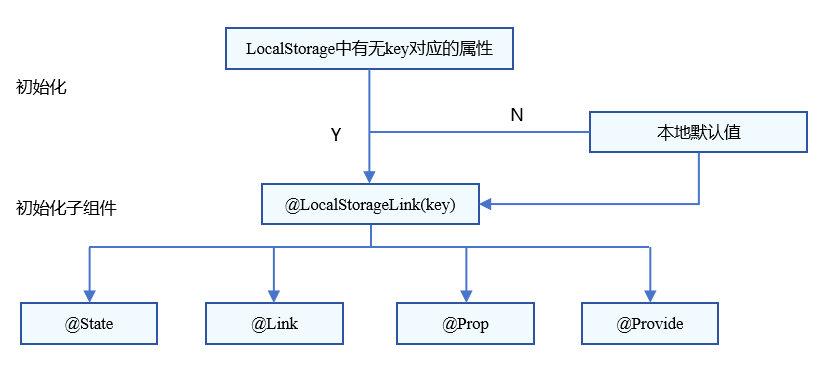

# LocalStorage：页面级UI状态存储
<!--Kit: ArkUI-->
<!--Subsystem: ArkUI-->
<!--Owner: @zzq212050299-->
<!--Designer: @s10021109-->
<!--Tester: @TerryTsao-->
<!--Adviser: @zhang_yixin13-->


LocalStorage是页面级的UI状态存储，通过\@Entry装饰器接收的参数可以在页面内共享同一个LocalStorage实例。LocalStorage支持UIAbility实例内多个页面间状态共享。


本文仅介绍LocalStorage使用场景和相关的装饰器：\@LocalStorageProp和\@LocalStorageLink。


在阅读本文档前，需要开发者对状态管理框架有基本的了解。建议提前阅读：[状态管理概述](./arkts-state-management-overview.md)。

LocalStorage还提供了API接口，可以让开发者通过接口在自定义组件外手动触发Storage对应key的增删改查，建议配合[LocalStorage API文档](../../reference/apis-arkui/arkui-ts/ts-state-management.md#localstorage9)阅读。最佳实践请参考[状态管理最佳实践](https://developer.huawei.com/consumer/cn/doc/best-practices/bpta-status-management)。

> **说明：**
>
> LocalStorage从API version 9开始支持。


## 概述

LocalStorage是ArkTS为构建页面级别状态变量提供存储的内存内的“数据库”。

- 应用程序可以创建多个LocalStorage实例，LocalStorage实例可以在页面内共享，也可以通过getSharedLocalStorage接口，实现跨页面、跨UIAbility实例共享。

- 组件树的根节点，即被[\@Entry](../../reference/apis-arkui/arkui-ts/ts-universal-entry.md#entry)装饰的[\@Component](./arkts-create-custom-components.md#component)，可以被分配一个LocalStorage实例，此组件的所有子组件实例将自动获得对该LocalStorage实例的访问权限。

- \@Component装饰的组件既可以自动继承来自父组件的LocalStorage实例，也可以传入指定的LocalStorage的实例，详见：[自定义组件接收LocalStorage实例](#自定义组件接收localstorage实例)。

- LocalStorage中的所有属性都是可变的。

应用程序决定LocalStorage对象的生命周期。当应用释放最后一个指向LocalStorage的引用时，比如销毁最后一个自定义组件，LocalStorage将被JS Engine垃圾回收。

LocalStorage根据与\@Component装饰的组件的同步类型不同，提供了两个装饰器：

- [@LocalStorageProp](#localstorageprop)：\@LocalStorageProp装饰的变量与LocalStorage中给定属性建立单向同步关系。

- [@LocalStorageLink](#localstoragelink)：\@LocalStorageLink装饰的变量与LocalStorage中给定属性建立双向同步关系。


## \@LocalStorageProp

在上文中已经提到，如果要建立LocalStorage和自定义组件的联系，需要使用\@LocalStorageProp和\@LocalStorageLink装饰器。使用\@LocalStorageProp(key)/\@LocalStorageLink(key)装饰组件内的变量，key标识了LocalStorage的属性。


当自定义组件初始化的时候，\@LocalStorageProp(key)/\@LocalStorageLink(key)装饰的变量会通过给定的key，绑定LocalStorage对应的属性，完成初始化。本地初始化是必要的，因为无法保证LocalStorage一定存在给定的key（这取决于应用逻辑是否在组件初始化之前在LocalStorage实例中存入对应的属性）。


> **说明：**
>
> 从API version 9开始，该装饰器支持在ArkTS卡片中使用。
>
> 从API version 11开始，该装饰器支持在原子化服务中使用。

\@LocalStorageProp(key)和LocalStorage中key对应的属性建立单向数据同步，ArkUI框架支持修改\@LocalStorageProp(key)在本地的值，但是对本地值的修改不会同步回LocalStorage中。相反，如果LocalStorage中key对应的属性值发生改变，例如通过set接口对LocalStorage中的值进行修改，改变会同步给\@LocalStorageProp(key)，并覆盖掉本地的值。


### 装饰器使用规则

| \@LocalStorageProp变量装饰器 | 说明                                                         |
| ---------------------------- | ------------------------------------------------------------ |
| 装饰器参数                   | key：常量字符串，必填（字符串需要有引号）。                  |
| 允许装饰的变量类型           | Object、class、string、number、boolean、enum类型，以及这些类型的数组。<br/>API version 12及以上支持Map、Set、Date、undefined和null类型以及这些类型的联合类型，示例见[LocalStorage支持联合类型](#localstorage支持联合类型)。<br/>嵌套类型的场景请参考[观察变化和行为表现](#观察变化和行为表现)。 <br/>**说明：**<br/>变量类型必须被指定，建议和LocalStorage中对应属性类型相同，否则会发生类型隐式转换，从而导致应用行为异常。|
| 同步类型                     | 单向同步：从LocalStorage的对应属性到组件的状态变量。组件本地的修改是允许的，但是LocalStorage中给定的属性一旦发生变化，将覆盖本地的修改。 |
| 被装饰变量的初始值           | 必须指定，如果LocalStorage实例中不存在属性，则用该初始值初始化该属性，并存入LocalStorage中。 |


### 变量的传递/访问规则

| 传递/访问规则    | 说明                                                                                  |
| ---------- |-------------------------------------------------------------------------------------|
| 从父节点初始化和更新 | 禁止，\@LocalStorageProp不支持从父节点初始化，只能从LocalStorage中key对应的属性初始化，如果没有对应的key，将使用本地默认值初始化。 |
| 初始化子节点     | 支持，可用于初始化\@State、\@Link、\@Prop、\@Provide。                                           |
| 是否支持组件外访问  | 否。                                                                                  |


  **图1** \@LocalStorageProp初始化规则图示

### 观察变化和行为表现

**观察变化**


- 当装饰的数据类型为boolean、string、number类型时，可以观察到数值的变化。

- 当装饰的数据类型为class或者Object时，可以观察到对象整体赋值和对象属性变化（详见[从ui内部使用localstorage](#从ui内部使用localstorage)）。

- 当装饰的对象是数组时，可以观察到数组添加、删除、更新数组单元的变化。

- 当装饰的对象是Date时，可以观察到Date整体的赋值，同时可通过调用Date的接口`setFullYear`, `setMonth`, `setDate`, `setHours`, `setMinutes`, `setSeconds`, `setMilliseconds`, `setTime`, `setUTCFullYear`, `setUTCMonth`, `setUTCDate`, `setUTCHours`, `setUTCMinutes`, `setUTCSeconds`, `setUTCMilliseconds` 更新Date的属性。详见[装饰Date类型变量](#装饰date类型变量)。

- 当装饰的变量是Map时，可以观察到Map整体的赋值，同时可通过调用Map的接口`set`, `clear`, `delete` 更新Map的值。详见[装饰Map类型变量](#装饰map类型变量)。

- 当装饰的变量是Set时，可以观察到Set整体的赋值，同时可通过调用Set的接口`add`, `clear`, `delete` 更新Set的值。详见[装饰Set类型变量](#装饰set类型变量)。


**框架行为**


1. 使用\@LocalStorageProp(key)装饰的变量更新时，不会写回LocalStorage，但会触发当前自定义组件的重新渲染。

2. 当LocalStorage中对应key的值发生变化时，所有使用\@LocalStorageProp(key)装饰的变量都会同步更新，覆盖本地修改。

**LocalStorage与\@LocalStorageProp数据同步如下图所示**


  **图2** LocalStorage与\@LocalStorageProp数据同步图示

## \@LocalStorageLink

> **说明：**
>
> 从API version 11开始，该装饰器支持在原子化服务中使用。

如果我们需要将自定义组件的状态变量的更新同步回LocalStorage，就需要用到\@LocalStorageLink。

\@LocalStorageLink(key)是和LocalStorage中key对应的属性建立双向数据同步：

1. 本地修改发生，该修改会被写回LocalStorage中。

2. LocalStorage中的修改发生后，该修改会被同步到所有绑定LocalStorage对应key的属性上，包括单向（\@LocalStorageProp和通过prop创建的单向绑定变量）、双向（\@LocalStorageLink和通过link创建的双向绑定变量）变量。

### 装饰器使用规则

| \@LocalStorageLink变量装饰器 | 说明                                                         |
| ---------------------------- | ------------------------------------------------------------ |
| 装饰器参数                   | key：常量字符串，必填（字符串需要有引号）。                  |
| 允许装饰的变量类型           | Object、class、string、number、boolean、enum类型，以及这些类型的数组。<br/>API version 12及以上支持Map、Set、Date、undefined和null类型以及这些类型的联合类型。示例见[LocalStorage支持联合类型](#localstorage支持联合类型)。<br/>嵌套类型的场景请参考[观察变化和行为表现](#观察变化和行为表现-1)。<br/>**说明：**<br/>变量类型必须被指定，建议和LocalStorage中对应属性类型相同，否则会发生类型隐式转换，从而导致应用行为异常。|
| 同步类型                     | 双向同步：从LocalStorage的对应属性到自定义组件，从自定义组件到LocalStorage对应属性。 |
| 被装饰变量的初始值           | 必须指定，如果LocalStorage实例中不存在属性，则用该初始值初始化该属性，并存入LocalStorage中。 |


### 变量的传递/访问规则

| 传递/访问规则      | 说明                                                                                  |
| ---------- |-------------------------------------------------------------------------------------|
| 从父节点初始化和更新 | 禁止，\@LocalStorageLink不支持从父节点初始化，只能从LocalStorage中key对应的属性初始化，如果没有对应的key，将使用本地默认值初始化。 |
| 初始化子节点     | 支持，可用于初始化\@State、\@Link、\@Prop、\@Provide。                                           |
| 是否支持组件外访问  | 否。                                                                                  |




  **图3** \@LocalStorageLink初始化规则图示

### 观察变化和行为表现

**观察变化**


- 当装饰的数据类型为boolean、string、number类型时，可以观察到数值的变化。

- 当装饰的数据类型为class或者Object时，可以观察到对象整体赋值和对象属性变化（详见[从ui内部使用localstorage](#从ui内部使用localstorage)）。

- 当装饰的对象是数组时，可以观察到数组添加、删除、更新数组单元的变化。

- 当装饰的对象是Date时，可以观察到Date整体的赋值，同时可通过调用Date的接口`setFullYear`, `setMonth`, `setDate`, `setHours`, `setMinutes`, `setSeconds`, `setMilliseconds`, `setTime`, `setUTCFullYear`, `setUTCMonth`, `setUTCDate`, `setUTCHours`, `setUTCMinutes`, `setUTCSeconds`, `setUTCMilliseconds` 更新Date的属性。详见[装饰Date类型变量](#装饰date类型变量)。

- 当装饰的变量是Map时，可以观察到Map整体的赋值，同时可通过调用Map的接口`set`, `clear`, `delete` 更新Map的值。详见[装饰Map类型变量](#装饰map类型变量)。

- 当装饰的变量是Set时，可以观察到Set整体的赋值，同时可通过调用Set的接口`add`, `clear`, `delete` 更新Set的值。详见[装饰Set类型变量](#装饰set类型变量)。


**框架行为**


1. 使用\@LocalStorageLink(key)装饰的变量更新时，会同步写回LocalStorage对应的key，还会触发当前自定义组件的重新渲染。

2. 当LocalStorage中对应key的值发生变化时，所有绑定该key的数据（包括双向\@LocalStorageLink和单向\@LocalStorageProp）都会同步更新。

**LocalStorage与\@LocalStorageLink数据同步如下图所示**


  **图4** LocalStorage与\@LocalStorageLink数据同步图示

## 限制条件

1. \@LocalStorageProp/\@LocalStorageLink的参数必须为string类型，否则编译期会报错。

    ```ts
    let storage = new LocalStorage();
    storage.setOrCreate('PropA', 48);

    // 错误写法，编译报错
    @LocalStorageProp() localStorageProp: number = 1;
    @LocalStorageLink() localStorageLink: number = 2;

    // 正确写法
    @LocalStorageProp('PropA') localStorageProp: number = 1;
    @LocalStorageLink('PropA') localStorageLink: number = 2;
    ```

2. \@LocalStorageProp与\@LocalStorageLink不支持装饰Function类型的变量，框架会抛出运行时错误。

3. LocalStorage创建后，命名属性的类型不可更改。后续调用Set时必须使用相同类型的值。

4. LocalStorage是页面级存储，[getSharedLocalStorage](../../reference/apis-arkui/arkts-apis-uicontext-uicontext.md#getsharedlocalstorage12)接口仅能获取当前Stage通过[windowStage.loadContent](../../reference/apis-arkui/arkts-apis-window-Window.md#loadcontent9)传入的LocalStorage实例，否则返回undefined。例子可见[将LocalStorage实例从UIAbility共享到一个或多个页面](#将localstorage实例从uiability共享到一个或多个页面)。


## 使用场景


### 应用逻辑使用LocalStorage


```ts
let para: Record<string,number> = { 'PropA': 47 };
let storage: LocalStorage = new LocalStorage(para); // 创建新实例并使用给定对象初始化
let propA: number | undefined = storage.get('PropA'); // propA == 47
let link1: SubscribedAbstractProperty<number> = storage.link('PropA'); // link1.get() == 47
let link2: SubscribedAbstractProperty<number> = storage.link('PropA'); // link2.get() == 47
let prop: SubscribedAbstractProperty<number> = storage.prop('PropA'); // prop.get() == 47
link1.set(48); // 双向同步: link1.get() == link2.get() == prop.get() == 48
prop.set(1); // 单向同步: prop.get() == 1; 但 link1.get() == link2.get() == 48
link1.set(49); // 双向同步: link1.get() == link2.get() == prop.get() == 49
```

### 从UI内部使用LocalStorage

除了应用程序逻辑使用LocalStorage，还可以借助LocalStorage相关的两个装饰器\@LocalStorageProp和\@LocalStorageLink，在UI组件内部获取到LocalStorage实例中存储的状态变量。

本示例以\@LocalStorageLink为例，展示了：

- 使用构造函数创建LocalStorage实例storage。

- 使用\@Entry装饰器将storage添加到Parent顶层组件中。

- \@LocalStorageLink绑定LocalStorage对给定的属性，建立双向数据同步。

<!-- @[localtorage_page_one_double_syn](https://gitcode.com/openharmony/applications_app_samples/blob/master/code/DocsSample/ArkUISample/LocalStorage/entry/src/main/ets/pages/PageOneDoubleSYN.ets) -->

``` TypeScript
class Data {
  public code: number;

  constructor(code: number) {
    this.code = code;
  }
}

// 创建新实例并使用给定对象初始化
let para: Record<string, number> = { 'PropA': 47 };
let storage: LocalStorage = new LocalStorage(para);
storage.setOrCreate('PropB', new Data(50));

@Component
struct Child {
  // @LocalStorageLink变量装饰器与LocalStorage中的'PropA'属性建立双向绑定
  @LocalStorageLink('PropA') childLinkNumber: number = 1;
  // @LocalStorageLink变量装饰器与LocalStorage中的'PropB'属性建立双向绑定
  @LocalStorageLink('PropB') childLinkObject: Data = new Data(0);

  build() {
    Column({ space: 15 }) {
      // 更改将同步至LocalStorage中的'PropA'以及Parent.parentLinkNumber
      Button(`Child from LocalStorage ${this.childLinkNumber}`)
        .onClick(() => {
          this.childLinkNumber += 1;
        })
      // 更改将同步至LocalStorage中的'PropB'以及Parent.parentLinkObject.code
      Button(`Child from LocalStorage ${this.childLinkObject.code}`)
        .onClick(() => {
          this.childLinkObject.code += 1;
        })
    }
  }
}

// 使LocalStorage可从@Component组件访问
@Entry(storage)
@Component
struct Parent {
  // @LocalStorageLink变量装饰器与LocalStorage中的'PropA'属性建立双向绑定
  @LocalStorageLink('PropA') parentLinkNumber: number = 1;
  // @LocalStorageLink变量装饰器与LocalStorage中的'PropB'属性建立双向绑定
  @LocalStorageLink('PropB') parentLinkObject: Data = new Data(0);

  build() {
    Column({ space: 15 }) {
      // 由于LocalStorage中PropA已经被初始化，因此this.parentLinkNumber的值为47
      Button(`Parent from LocalStorage ${this.parentLinkNumber}`)
        .onClick(() => {
          this.parentLinkNumber += 1;
        })
      // 由于LocalStorage中PropB已经被初始化，因此this.parentLinkObject.code的值为50
      Button(`Parent from LocalStorage ${this.parentLinkObject.code}`)
        .onClick(() => {
          this.parentLinkObject.code += 1;
        })
      // @Component子组件自动获得对Parent LocalStorage实例的访问权限
      Child()
    }
  }
}
```

### \@LocalStorageProp和LocalStorage单向同步的简单场景

本示例展示了ParentOne和ChildOne组件各自在本地创建与paraOneLocal中'PropA'属性的单向数据同步：

- ParentOne中对this.storagePropOne的修改，只会在ParentOne中生效，并没有同步回storageOneLocal。

- ChildOne组件中，Text绑定的storagePropTwo 依旧显示47。

<!-- @[localtorage_page_two_sigle_syn](https://gitcode.com/openharmony/applications_app_samples/blob/master/code/DocsSample/ArkUISample/LocalStorage/entry/src/main/ets/pages/PageTwoSigleSYN.ets) -->

``` TypeScript
// 创建新实例并使用给定对象初始化
let paraOneLocal: Record<string, number> = { 'PropA': 47 };
let storageOneLocal: LocalStorage = new LocalStorage(paraOneLocal);
// 使LocalStorage可从@Component组件访问
@Entry(storageOneLocal)
@Component
struct ParentOne {
  // @LocalStorageProp变量装饰器与LocalStorage中的'PropA'属性建立单向绑定
  @LocalStorageProp('PropA') storagePropOne: number = 1;

  build() {
    Column({ space: 15 }) {
      // 点击后从47开始加1，只改变当前组件显示的storagePropOne ，不会同步到LocalStorage中
      Button(`ParentOne from LocalStorage ${this.storagePropOne}`)
        .onClick(() => {
          this.storagePropOne += 1;
        })
      ChildOne()
    }
  }
}

@Component
struct ChildOne {
  // @LocalStorageProp变量装饰器与LocalStorage中的'PropA'属性建立单向绑定
  @LocalStorageProp('PropA') storagePropTwo: number = 2;

  build() {
    Column({ space: 15 }) {
      // 当ParentOne改变时，当前storagePropTwo不会改变，显示47
      Text(`ParentOne from LocalStorage ${this.storagePropTwo}`)
    }
  }
}
```

### \@LocalStorageLink和LocalStorage双向同步的简单场景

下面的示例展示了\@LocalStorageLink装饰的数据和LocalStorage双向同步的场景：

<!-- @[localtorage_page_two_way_syn](https://gitcode.com/openharmony/applications_app_samples/blob/master/code/DocsSample/ArkUISample/LocalStorage/entry/src/main/ets/pages/PageTwoWaySYN.ets) -->

``` TypeScript
// 构造LocalStorage实例
let paraOne: Record<string, number> = { 'PropA': 47 };
let storageOne: LocalStorage = new LocalStorage(paraOne);
// 调用link（api9以上）接口构造'PropA'的双向同步数据，linkToPropA 是全局变量
let linkToPropA: SubscribedAbstractProperty<object> = storageOne.link('PropA');

@Entry(storageOne)
@Component
struct ParentTwo {

  // @LocalStorageLink('PropA')在Parent自定义组件中创建'PropA'的双向同步数据，初始值为47，因为在构造LocalStorage已经给“PropA”设置47
  @LocalStorageLink('PropA') storageLink: number = 1;

  build() {
    Column() {
      Text(`incr @LocalStorageLink variable`)
      // 点击“incr @LocalStorageLink variable”，this.storageLink加1，改变同步回storage，全局变量linkToPropA也会同步改变

        .onClick(() => {
          this.storageLink += 1;
        })

      // 并不建议在组件内使用全局变量linkToPropA.get()，因为可能会有生命周期不同引起的错误。
      Text(`@LocalStorageLink: ${this.storageLink} - linkToPropA: ${linkToPropA.get()}`)
    }
  }
}
```

### 兄弟组件之间同步状态变量

下面的示例展示了通过\@LocalStorageLink双向同步兄弟组件之间的状态。

先看ParentFour自定义组件中发生的变化：

1.点击“playCount ${this.playCount} dec by 1”，this.playCount减1，修改同步回LocalStorage中，ChildFour组件中的playCountLink绑定的组件会同步刷新。

2.点击“countStorage ${this.playCount} incr by 1”，调用LocalStorage的set接口，更新LocalStorage中“countStorage”对应的属性，ChildFour组件中的playCountLink绑定的组件会同步刷新。

3.Text组件“playCount in LocalStorage for debug ${storageFour.get&lt;number&gt;('countStorage')}”没有同步刷新，因为storageFour.get&lt;number&gt;('countStorage')返回的是常规变量，常规变量的更新并不会引起Text组件的重新渲染。

ChildFour自定义组件中的变化：

playCountLink的刷新会同步回LocalStorage，并且引起兄弟组件和父组件相应的刷新。

<!-- @[localtorage_page_four_state_variable_syn](https://gitcode.com/openharmony/applications_app_samples/blob/master/code/DocsSample/ArkUISample/LocalStorage/entry/src/main/ets/pages/PageFourStateVariableSYN.ets) -->

``` TypeScript
let count: Record<string, number> = { 'countStorage': 1 };
let storageFour: LocalStorage = new LocalStorage(count);

@Component
struct ChildFour {
  // 子组件实例的名字
  label: string = 'no name';
  // 和LocalStorage中“countStorage”的双向绑定数据
  @LocalStorageLink('countStorage') playCountLink: number = 0;

  build() {
    Row() {
      Text(this.label)
        .width(50)
        .height(60)
        .fontSize(12)
      Text(`playCountLink ${this.playCountLink}: inc by 1`)
        .onClick(() => {
          this.playCountLink += 1;
        })
        .width(200)
        .height(60)
        .fontSize(12)
    }
    .width(300)
    .height(60)
  }
}

@Entry(storageFour)
@Component
struct ParentFour {
  @LocalStorageLink('countStorage') playCount: number = 0;

  build() {
    Column() {
      Row() {
        Text('Parent')
          .width(50)
          .height(60)
          .fontSize(12)
        Text(`playCount ${this.playCount} dec by 1`)
          .onClick(() => {
            this.playCount -= 1;
          })
          .width(250)
          .height(60)
          .fontSize(12)
      }
      .width(300)
      .height(60)

      Row() {
        Text('LocalStorage')
          .width(50)
          .height(60)
          .fontSize(12)
        Text(`countStorage ${this.playCount} incr by 1`)
          .onClick(() => {
            storageFour.set<number | undefined>('countStorage', Number(storageFour.get<number>('countStorage')) + 1);
          })
          .width(250)
          .height(60)
          .fontSize(12)
      }
      .width(300)
      .height(60)

      ChildFour({ label: 'ChildA' })
      ChildFour({ label: 'ChildB' })

      Text(`playCount in LocalStorage for debug ${storageFour.get<number>('countStorage')}`)
        .width(300)
        .height(60)
        .fontSize(12)
    }
  }
}
```

### 将LocalStorage实例从UIAbility共享到一个或多个页面

上面的实例中，LocalStorage的实例仅仅在一个\@Entry装饰的组件和其所属的子组件（一个页面）中共享，如果希望其在多个页面中共享，可以在所属UIAbility中创建LocalStorage实例，并调用windowStage.[loadContent](../../reference/apis-arkui/arkts-apis-window-Window.md#loadcontent9)。

<!-- @[localstorage_export_one](https://gitcode.com/openharmony/applications_app_samples/blob/master/code/DocsSample/ArkUISample/LocalStorage/entry/src/main/ets/entryability/EntryAbility.ets) -->

``` TypeScript
// EntryAbility.ets
import { UIAbility } from '@kit.AbilityKit';
import { window } from '@kit.ArkUI';

// ···
export default class EntryAbility extends UIAbility {
  para: Record<string, number> = {
    'PropA': 47
  };
  storage: LocalStorage = new LocalStorage(this.para);

  onWindowStageCreate(windowStage: window.WindowStage): void {
    // 当前用例需要开发者手动修改为windowStage.loadContent('pages/PageFiveShare', this.storage);
    windowStage.loadContent('pages/Index', this.storage);
  }

// ···
}
```

> **说明：**
>
> 在UI页面通过getSharedLocalStorage获取当前stage共享的LocalStorage实例。
>
> this.getUIContext().getSharedLocalStorage()只在模拟器或者实机上才有效，在Previewer预览器中使用不生效。


在下面的用例中，PageFiveShare页面中的propA通过使用共享的LocalStorage实例。点击Button跳转到PageFiveShareChange页面，点击Change propA改变propA的值，back回PageFiveShare页面后，页面中propA的值也同步修改。

<!-- @[localtorage_page_five_share](https://gitcode.com/openharmony/applications_app_samples/blob/master/code/DocsSample/ArkUISample/LocalStorage/entry/src/main/ets/pages/PageFiveShare.ets) -->

``` TypeScript
// PageFiveShare.ets
// 预览器上不支持获取页面共享的LocalStorage实例
@Entry({ useSharedStorage: true })
@Component
struct PageFiveShare {
  // 可以使用@LocalStorageLink/Prop与LocalStorage实例中的变量建立联系
  @LocalStorageLink('PropA') propA: number = 1;
  pageStack: NavPathStack = new NavPathStack();

  build() {
    Navigation(this.pageStack) {
      Row() {
        Column() {
          Text(`${this.propA}`)
            .fontSize(50)
            .fontWeight(FontWeight.Bold)
          Button('To Page')
            .onClick(() => {
              this.pageStack.pushPathByName('Page', null);
            })
        }
        .width('100%')
      }
      .height('100%')
    }
  }
}
```


<!-- @[localtorage_page_five_share2](https://gitcode.com/openharmony/applications_app_samples/blob/master/code/DocsSample/ArkUISample/LocalStorage/entry/src/main/ets/pages/PageFiveShareChange.ets) -->

``` TypeScript

@Builder
export function PageBuilder() {
  PageFiveShareChange()
}

// PageFiveShareChange组件获得了父亲PageFiveShare组件的LocalStorage实例
@Component
struct PageFiveShareChange {
  @LocalStorageLink('PropA') propA: number = 2;
  pathStack: NavPathStack = new NavPathStack();

  build() {
    NavDestination() {
      Row() {
        Column() {
          Text(`${this.propA}`)
            .fontSize(50)
            .fontWeight(FontWeight.Bold)

          Button('Change propA')
            .onClick(() => {
              this.propA = 100;
            })

          Button('Back PageFiveShare')
            .onClick(() => {
              this.pathStack.pop();
            })
        }
        .width('100%')
      }
    }
    .onReady((context: NavDestinationContext) => {
      this.pathStack = context.pathStack;
    })
  }
}
```

使用Navigation时，需要添加配置系统路由表文件src/main/resources/base/profile/route_map.json，并替换pageSourceFile为PageFiveShareChange页面的路径，并且在module.json5中添加："routerMap": "$profile:route_map"。
```json
{
  "routerMap": [
    {
      "name": "Page",
      "pageSourceFile": "src/main/ets/pages/PageFiveShareChange.ets",
      "buildFunction": "PageBuilder",
      "data": {
        "description" : "LocalStorage example"
      }
    }
  ]
}
```


> **说明：**
>
> 对于开发者更建议使用这个方式来构建LocalStorage的实例，并且在创建LocalStorage实例的时候就写入默认值，因为默认值可以作为运行异常的备份，也可以用作页面的单元测试。


### 自定义组件接收LocalStorage实例

除了根节点可通过\@Entry来接收LocalStorage实例，自定义组件（子节点）也可以通过构造参数来传递LocalStorage实例。

本示例以\@LocalStorageLink为例，展示了：

- 父组件TestIndex中的Text，显示LocalStorage实例localStorageOne中PropA的值为“propA”。

- ChildSix组件中，Text绑定的propB，显示LocalStorage实例localStorageTwo中PropB的值为“propB”。

> **说明：**
>
> 从API version 12开始，自定义组件支持接收LocalStorage实例。
> 当自定义组件作为子节点，定义了成员属性时，LocalStorage实例必须要放在第二个参数位置传递，否则会报类型不匹配的编译问题。
> 当在自定义组件中定义了属性时，暂时不支持只有一个LocalStorage实例作为入参。如果没定义属性，可以只传入一个LocalStorage实例作为入参。
> 如果定义的属性不需要从父组件初始化变量，则第一个参数需要传{}。
> 作为构造参数传给子组件的LocalStorage实例在初始化时就会被决定，可以通过@LocalStorageLink或者LocalStorage的API修改LocalStorage实例中保存的属性值，但LocalStorage实例自身不能被动态修改。

<!-- @[localtorage_page_six_local_storage](https://gitcode.com/openharmony/applications_app_samples/blob/master/code/DocsSample/ArkUISample/LocalStorage/entry/src/main/ets/pages/PageSixLocalStorage.ets) -->

``` TypeScript
let localStorageOne: LocalStorage = new LocalStorage();
localStorageOne.setOrCreate('propA', 'propA');

let localStorageTwo: LocalStorage = new LocalStorage();
localStorageTwo.setOrCreate('propB', 'propB');

@Entry(localStorageOne)
@Component
struct TestIndex {
  // 'PropA'，和localStorageOne中'propA'的双向同步
  @LocalStorageLink('PropA') propA: string = 'Hello World';
  @State count: number = 0;

  build() {
    Row() {
      Column() {
        Text(this.propA)
          .fontSize(50)
          .fontWeight(FontWeight.Bold)
        // 使用LocalStorage 实例localStorageTwo
        ChildSix({ count: this.count }, localStorageTwo)
      }
      .width('100%')
    }
    .height('100%')
  }
}


@Component
struct ChildSix {
  @Link count: number;
  //  'Hello World'和localStorageTwo中'propB'的双向同步，如果localStorageTwo中没有'propB'，则使用默认值'Hello World'
  @LocalStorageLink('PropB') propB: string = 'Hello World';

  build() {
    Text(this.propB)
      .fontSize(50)
      .fontWeight(FontWeight.Bold)
  }
}
```

1. 当自定义组件没有定义属性时，可以只传入一个LocalStorage实例作为入参。

   <!-- @[localtorage_page_six_local_storageA](https://gitcode.com/openharmony/applications_app_samples/blob/master/code/DocsSample/ArkUISample/LocalStorage/entry/src/main/ets/pages/PageSixLocalStorageA.ets) -->
   
   ``` TypeScript
   let localStorageInstance: LocalStorage = new LocalStorage();
   localStorageInstance.setOrCreate('propA', 'propA');
   
   let localStorageChange: LocalStorage = new LocalStorage();
   localStorageChange.setOrCreate('propB', 'propB');
   
   @Entry(localStorageInstance)
   @Component
   struct Index {
     // 'PropA'，和localStorageInstance中'PropA'的双向同步
     @LocalStorageLink('PropA') propA: string = 'Hello World';
     @State count: number = 0;
   
     build() {
       Row() {
         Column() {
           Text(this.propA)
             .fontSize(50)
             .fontWeight(FontWeight.Bold)
           // 使用LocalStorage 实例localStorageChange
           ChildOne(localStorageChange)
         }
         .width('100%')
       }
       .height('100%')
     }
   }
   
   @Component
   struct ChildOne {
     build() {
       Text('hello')
         .fontSize(50)
         .fontWeight(FontWeight.Bold)
     }
   }
   ```


2. 当定义的属性不需要从父组件初始化变量时，第一个参数需要传{}。

   <!-- @[localtorage_page_six_local_storageB](https://gitcode.com/openharmony/applications_app_samples/blob/master/code/DocsSample/ArkUISample/LocalStorage/entry/src/main/ets/pages/PageSixLocalStorageB.ets) -->
   
   ``` TypeScript
   let localStorageBOne: LocalStorage = new LocalStorage();
   localStorageBOne.setOrCreate('propA', 'propA');
   
   let localStorageBTwo: LocalStorage = new LocalStorage();
   localStorageBTwo.setOrCreate('propB', 'propB');
   
   @Entry(localStorageBOne)
   @Component
   struct PageSixLocalStorageB {
     // 'PropA'，和localStorageBOne中'propA'的双向同步
     @LocalStorageLink('PropA') propA: string = 'Hello World';
     @State count: number = 0;
   
     build() {
       Row() {
         Column() {
           Text(this.propA)
             .fontSize(50)
             .fontWeight(FontWeight.Bold)
           // 使用LocalStorage 实例localStorageBTwo
           Child({}, localStorageBTwo)
         }
         .width('100%')
       }
       .height('100%')
     }
   }
   
   @Component
   struct Child {
     @State count: number = 5;
     // 'Hello World'，和localStorageBTwo中'propB'的双向同步，如果localStorageBTwo中没有'propB'，则使用默认值'Hello World'
     @LocalStorageLink('PropB') propB: string = 'Hello World';
   
     build() {
       Text(this.propB)
         .fontSize(50)
         .fontWeight(FontWeight.Bold)
     }
   }
   ```

### Navigation组件和LocalStorage联合使用

可以通过传递不同的LocalStorage实例给自定义组件，从而实现在navigation跳转到不同的页面时，绑定不同的LocalStorage实例，显示对应绑定的值。

本示例以\@LocalStorageLink为例，展示了：

- 点击父组件中的Button "Next Page",创建并跳转到name为"pageOne"的子页面，Text显示信息为LocalStorage实例localStorageA中绑定的propA的值，为"propA"。

- 继续点击页面上的Button "Next Page",创建并跳转到name为"pageTwo"的子页面，Text显示信息为LocalStorage实例localStorageB中绑定的propB的值，为"propB"。

- 继续点击页面上的Button "Next Page",创建并跳转到name为"pageTree"的子页面，Text显示信息为LocalStorage实例localStorageC中绑定的propC的值，为"propC"。

- 继续点击页面上的Button "Next Page",创建并跳转到name为"pageOne"的子页面，Text显示信息为LocalStorage实例localStorageA中绑定的propA的值，为"propA"。

- NavigationContentMsgStack自定义组件中的Text组件，共享对应自定义组件树上LocalStorage实例绑定的propA的值。

<!-- @[localtorage_page_my_navigation](https://gitcode.com/openharmony/applications_app_samples/blob/master/code/DocsSample/ArkUISample/LocalStorage/entry/src/main/ets/pages/PageMyNavigation.ets) -->

``` TypeScript
let localStorageA: LocalStorage = new LocalStorage();
localStorageA.setOrCreate('propA', 'propA');

let localStorageB: LocalStorage = new LocalStorage();
localStorageB.setOrCreate('propB', 'propB');

let localStorageC: LocalStorage = new LocalStorage();
localStorageC.setOrCreate('propC', 'propC');

@Entry
@Component
struct MyNavigationTestStack {
  @Provide('pageInfo') pageInfo: NavPathStack = new NavPathStack();

  @Builder
  PageMap(name: string) {
    if (name === 'pageOne') {
      // 传递不同的LocalStorage实例
      PageOneStack({}, localStorageA)
    } else if (name === 'pageTwo') {
      PageTwoStack({}, localStorageB)
    } else if (name === 'pageThree') {
      PageThreeStack({}, localStorageC)
    }
  }

  build() {
    Column({ space: 5 }) {
      Navigation(this.pageInfo) {
        Column() {
          Button('Next Page', { stateEffect: true, type: ButtonType.Capsule })
            .width('80%')
            .height(40)
            .margin(20)
            .onClick(() => {
              this.pageInfo.pushPath({ name: 'pageOne' }); //将name指定的NavDestination页面信息入栈
            })
        }
      }.title('NavIndex')
      .navDestination(this.PageMap)
      .mode(NavigationMode.Stack)
      .borderWidth(1)
    }
  }
}

@Component
struct PageOneStack {
  @Consume('pageInfo') pageInfo: NavPathStack;
  @LocalStorageLink('PropA') propA: string = 'Hello World';

  build() {
    NavDestination() {
      Column() {
        NavigationContentMsgStack()
        // 显示绑定的LocalStorage中PropA的值'PropA'
        Text(`${this.propA}`)
        Button('Next Page', { stateEffect: true, type: ButtonType.Capsule })
          .width('80%')
          .height(40)
          .margin(20)
          .onClick(() => {
            this.pageInfo.pushPathByName('pageTwo', null);
          })
      }.width('100%').height('100%')
    }.title('pageOne')
    .onBackPressed(() => {
      this.pageInfo.pop();
      return true;
    })
  }
}

@Component
struct PageTwoStack {
  @Consume('pageInfo') pageInfo: NavPathStack;
  @LocalStorageLink('PropB') propB: string = 'Hello World';

  build() {
    NavDestination() {
      Column() {
        NavigationContentMsgStack()
        // 如果绑定的LocalStorage中没有PropB,显示本地初始化的值 'Hello World'
        Text(`${this.propB}`)
        Button('Next Page', { stateEffect: true, type: ButtonType.Capsule })
          .width('80%')
          .height(40)
          .margin(20)
          .onClick(() => {
            this.pageInfo.pushPathByName('pageThree', null);
          })

      }.width('100%').height('100%')
    }.title('pageTwo')
    .onBackPressed(() => {
      this.pageInfo.pop();
      return true;
    })
  }
}

@Component
struct PageThreeStack {
  @Consume('pageInfo') pageInfo: NavPathStack;
  @LocalStorageLink('PropC') propC: string = 'pageThreeStack';

  build() {
    NavDestination() {
      Column() {
        NavigationContentMsgStack()

        // 如果绑定的LocalStorage中没有PropC,显示本地初始化的值 'pageThreeStack'
        Text(`${this.propC}`)
        Button('Next Page', { stateEffect: true, type: ButtonType.Capsule })
          .width('80%')
          .height(40)
          .margin(20)
          .onClick(() => {
            this.pageInfo.pushPathByName('pageOne', null);
          })

      }.width('100%').height('100%')
    }.title('pageThree')
    .onBackPressed(() => {
      this.pageInfo.pop();
      return true;
    })
  }
}

@Component
struct NavigationContentMsgStack {
  @LocalStorageLink('PropA') propA: string = 'Hello';

  build() {
    Column() {
      Text(`${this.propA}`)
        .fontSize(30)
        .fontWeight(FontWeight.Bold)
    }
  }
}
```

### LocalStorage支持联合类型

在下面的示例中，变量linkA的类型为number | null，变量linkB的类型为number | undefined。Text组件初始化分别显示为null和undefined，点击切换为数字，再次点击切换回null和undefined。

<!-- @[localtorage_page_local_storage_link](https://gitcode.com/openharmony/applications_app_samples/blob/master/code/DocsSample/ArkUISample/LocalStorage/entry/src/main/ets/pages/PageLocalStorageLink.ets) -->

``` TypeScript
@Component
struct LocalStorageLinkComponent {
  @LocalStorageLink('LinkA') linkA: number | null = null;
  @LocalStorageLink('LinkB') linkB: number | undefined = undefined;

  build() {
    Column() {
      Text('@LocalStorageLink API Initialization, @LocalStorageLink Value')
      Text(`${this.linkA}`)
        .fontSize(20)
        .onClick(() => {
          this.linkA ? this.linkA = null : this.linkA = 1;
        })
      Text(`${this.linkB}`)
        .fontSize(20)
        .onClick(() => {
          this.linkB ? this.linkB = undefined : this.linkB = 1;
        })
    }
    .borderWidth(3).borderColor(Color.Green)
  }
}

@Component
struct LocalStoragePropComponent {
  @LocalStorageProp('PropA') propA: number | null = null;
  @LocalStorageProp('PropB') propB: number | undefined = undefined;

  build() {
    Column() {
      Text('@LocalStorageProp API Initialization, @LocalStorageProp Value')
      Text(`${this.propA}`)
        .fontSize(20)
        .onClick(() => {
          this.propA ? this.propA = null : this.propA = 1;
        })
      Text(`${this.propB}`)
        .fontSize(20)
        .onClick(() => {
          this.propB ? this.propB = undefined : this.propB = 1;
        })
    }
    .borderWidth(3)
    .borderColor(Color.Yellow)
  }
}

let storageLink: LocalStorage = new LocalStorage();

@Entry(storageLink)
@Component
struct LinkIndex {
  build() {
    Row() {
      Column() {
        LocalStorageLinkComponent()
        LocalStoragePropComponent()
      }
      .width('100%')
    }
    .height('100%')
  }
}
```

### 装饰Date类型变量

> **说明：**
>
> 从API version 12开始，LocalStorage支持Date类型。

在下面的示例中，\@LocalStorageLink装饰的selectedDate类型为Date，点击Button改变selectedDate的值，UI会随之刷新。

<!-- @[localtorage_local_date_sample](https://gitcode.com/openharmony/applications_app_samples/blob/master/code/DocsSample/ArkUISample/LocalStorage/entry/src/main/ets/pages/LocalDateSample.ets) -->

``` TypeScript
@Entry
@Component
struct LocalDateSample {
  @LocalStorageLink('date') selectedDate: Date = new Date('2021-08-08');

  build() {
    Column() {
      Button('set selectedDate to 2023-07-08')
        .margin(10)
        .onClick(() => {
          this.selectedDate = new Date('2023-07-08');
        })
      Button('increase the year by 1')
        .margin(10)
        .onClick(() => {
          this.selectedDate.setFullYear(this.selectedDate.getFullYear() + 1);
        })
      Button('increase the month by 1')
        .margin(10)
        .onClick(() => {
          this.selectedDate.setMonth(this.selectedDate.getMonth() + 1);
        })
      Button('increase the day by 1')
        .margin(10)
        .onClick(() => {
          this.selectedDate.setDate(this.selectedDate.getDate() + 1);
        })
      DatePicker({
        start: new Date('1970-1-1'),
        end: new Date('2100-1-1'),
        selected: $$this.selectedDate
      })
    }.width('100%')
  }
}
```

### 装饰Map类型变量

> **说明：**
>
> 从API version 12开始，LocalStorage支持Map类型。

在下面的示例中，\@LocalStorageLink装饰的message类型为Map\<number, string\>，点击Button改变message的值，UI会随之刷新。

<!-- @[localtorage_local_map_sample](https://gitcode.com/openharmony/applications_app_samples/blob/master/code/DocsSample/ArkUISample/LocalStorage/entry/src/main/ets/pages/LocalMapSample.ets) -->

``` TypeScript
@Entry
@Component
struct LocalMapSample {
  @LocalStorageLink('map') message: Map<number, string> = new Map([[0, 'a'], [1, 'b'], [3, 'c']]);

  build() {
    Row() {
      Column() {
        ForEach(Array.from(this.message.entries()), (item: [number, string]) => {
          Text(`${item[0]}`).fontSize(30)
          Text(`${item[1]}`).fontSize(30)
          Divider()
        })
        Button('init map').onClick(() => {
          this.message = new Map([[0, 'a'], [1, 'b'], [3, 'c']]);
        })
        Button('set new one').onClick(() => {
          this.message.set(4, 'd');
        })
        Button('clear').onClick(() => {
          this.message.clear();
        })
        Button('replace the existing one').onClick(() => {
          this.message.set(0, 'aa');
        })
        Button('delete the existing one').onClick(() => {
          this.message.delete(0);
        })
      }
      .width('100%')
    }
    .height('100%')
  }
}
```

### 装饰Set类型变量

> **说明：**
>
> 从API version 12开始，LocalStorage支持Set类型。

在下面的示例中，\@LocalStorageLink装饰的memberSet类型为Set\<number\>，点击Button改变memberSet的值，UI会随之刷新。

<!-- @[localtorage_local_set_sample](https://gitcode.com/openharmony/applications_app_samples/blob/master/code/DocsSample/ArkUISample/LocalStorage/entry/src/main/ets/pages/LocalSetSample.ets) -->

``` TypeScript
@Entry
@Component
struct LocalSetSample {
  @LocalStorageLink('set') memberSet: Set<number> = new Set([0, 1, 2, 3, 4]);

  build() {
    Row() {
      Column() {
        ForEach(Array.from(this.memberSet.entries()), (item: [number, number]) => {
          Text(`${item[0]}`)
            .fontSize(30)
          Divider()
        })
        Button('init set')
          .onClick(() => {
            this.memberSet = new Set([0, 1, 2, 3, 4]);
          })
        Button('set new one')
          .onClick(() => {
            this.memberSet.add(5);
          })
        Button('clear')
          .onClick(() => {
            this.memberSet.clear();
          })
        Button('delete the first one')
          .onClick(() => {
            this.memberSet.delete(0);
          })
      }
      .width('100%')
    }
    .height('100%')
  }
}
```

### 自定义组件外改变状态变量

<!-- @[localtorage_change_local_set_sample](https://gitcode.com/openharmony/applications_app_samples/blob/master/code/DocsSample/ArkUISample/LocalStorage/entry/src/main/ets/pages/ChangeLocalSetSample.ets) -->

``` TypeScript
let storageChange = new LocalStorage();
storageChange.setOrCreate('count', 47);

class Model {
  public storage: LocalStorage = storageChange;

  call(propName: string, value: number) {
    this.storage.setOrCreate<number>(propName, value);
  }
}

let model: Model = new Model();

@Entry({ storage: storageChange })
@Component
struct Test {
  @LocalStorageLink('count') count: number = 0;

  build() {
    Column() {
      Text(`count value: ${this.count}`)
      Button('change')
        .onClick(() => {
          model.call('count', this.count + 1);
        })
    }
  }
}
```

<!--no_check-->
