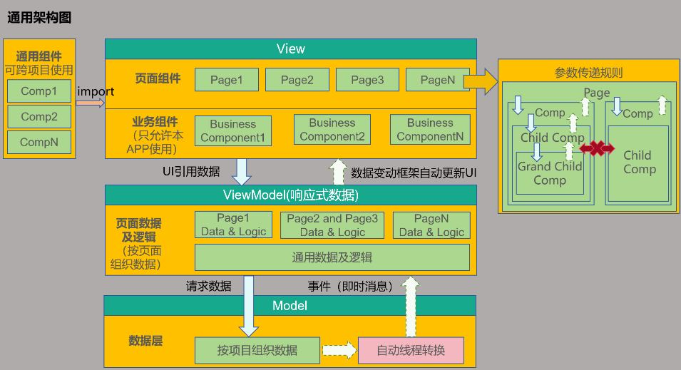

# MVVM模式（V1）
<!--Kit: ArkUI-->
<!--Subsystem: ArkUI-->
<!--Owner: @zzq212050299-->
<!--Designer: @s10021109-->
<!--Tester: @TerryTsao-->
<!--Adviser: @zhang_yixin13-->

当开发者掌握了状态管理的基本概念后，通常会尝试开发自己的应用，在应用开发初期，如果未能精心规划项目结构，随着项目扩展和复杂化，状态变量的增多将导致组件间关系变得错综复杂。此时，开发新功能可能引起连锁反应，维护成本也会增加。为此，本文旨在介绍MVVM模式以及ArkUI的UI开发模式与MVVM的关系，指导开发者如何设计项目结构，以便在产品迭代和升级时能更轻松地开发和维护。


本文档涵盖了大多数状态管理V1装饰器，所以在阅读本文档前，建议开发者对状态管理V1有一定的了解。建议提前阅读：[状态管理概述](./arkts-state-management-overview.md)和状态管理V1装饰器相关文档。

## MVVM模式介绍

### 概念

在应用开发中，UI更新需要实时同步数据状态变化，这直接影响应用程序的性能和用户体验。为了解决数据与UI同步的复杂性，ArkUI采用了 Model-View-ViewModel（MVVM）架构模式。MVVM 将应用分为Model、View和ViewModel三个核心部分，实现数据、视图与逻辑的分离。通过这种模式，UI可以自动更新状态变化，从而更高效地管理数据和视图的绑定与更新。

- View：用户界面层。负责用户界面展示并与用户交互，不包含任何业务逻辑。它通过绑定ViewModel层提供的数据实现动态更新。
- Model：数据访问层。以数据为中心，不直接与用户界面交互。负责数据结构定义，数据管理（获取、存储、更新等），以及业务逻辑处理。
- ViewModel：表示逻辑层。作为连接Model和View的桥梁，通常一个View对应一个ViewModel。View和ViewModel有两种通信方式：

  1. 方法调用：View通过事件监听用户行为，在回调里面触发ViewModel层的方法。例如当View监听到用户Button点击行为，调用ViewModel对应的方法，处理用户操作。  
  2. 双向绑定：View绑定ViewModel的数据，实现双向同步。  

ArkUI的UI开发模式就属于MVVM模式，通过对MVVM概念的基本介绍，开发者大致能猜到状态管理能在MVVM中起什么样的作用，状态管理旨在数据驱动更新，让开发者只用关注页面设计，而不去关注整个UI的刷新逻辑，数据的维护也无需开发者进行感知，由状态变量自动更新完成，而这就是属于ViewModel层所需要支持的内容，因此开发者使用MVVM模式开发自己的应用是最省心省力的。

### ArkUI开发模式图

ArkUI的UI开发模式即是MVVM模式，而状态变量在MVVM模式中扮演着ViewModel的角色，向上刷新UI，向下更新数据，整体框架如下图：



### 分层说明

**View层**

View层通常可以分为下列组件：
* 页面组件：所有应用基本都是按照页面进行分类的，比如登录页，列表页，编辑页，帮助页，版权页等。每个页面对应需要的数据可能是完全不一样的，也可能多个页面需要的数据是同一套。
* 业务组件：本身具备本APP部分业务能力的功能组件，典型的就是这个业务组件可能关联了本项目的ViewModel中的数据，不可以被共享给其他项目使用。
* 通用组件：像系统组件一样，这类组件不会关联本APP中ViewModel的数据，这些组件可实现跨越多个项目进行共享，来完成比较通用的功能。

**Model层**

Model层是应用的原始数据提供者，代表应用的核心业务逻辑和数据。

**ViewModel层**

为View层的组件提供对应数据，按照页面组织，当用户浏览页面时，某些页面可能不会被显示，因此，页面数据最好设计成懒加载（按需加载）的模式。

> ViewModel层数据和Model层数据的区别：
>
> Model层数据是按照整个工程、项目来组织数据，构成一套完整的APP业务数据体系。
>
> ViewModel层数据，是提供某个页面上使用的数据，它可能是整个APP的业务数据的一部分。另外ViewModel层还可以附加对应Page的辅助页面显示数据，这部分数据可能与本APP的业务完全无关，仅仅是为页面展示提供便利的辅助数据。

### 架构核心原则

**不可跨层访问**

* View层不可以直接调用Model层的数据，只能通过ViewModel提供的方法进行调用。
* Model层不能直接操作UI，只能通知ViewModel层数据有更新，由ViewModel层更新对应的数据。

**下层不可访问上层数据**

下层数据通过通知模式更新上层数据。在业务逻辑中，下层不可直接获取上层数据。例如，ViewModel层的逻辑处理不应该依赖View层界面上的某个值。

**非父子组件间不可直接访问**

这是针对View层设计的核心原则，一个组件应该具备以下逻辑：

* 禁止直接访问父组件（必须使用事件或是订阅能力）。
* 禁止直接访问兄弟组件。这是因为组件应该仅能访问自己的子节点（通过传参）和父节点（通过事件或通知），以此完成组件之间的解耦。

对于一个组件，这样设计的原因如下：

* 组件自己使用了哪些子组件是明确的，因此可以访问。
* 组件被放置于哪个父节点下是未知的，因此组件想访问父节点，就只能通过通知或者事件能力完成。
* 组件不可能知道自己的兄弟节点是谁，因此组件不可以操纵兄弟节点。

## 备忘录开发实战

本节通过备忘录应用的开发，使开发者了解如何使用ArkUI框架设计自己的应用。本节直接进行功能开发，未设计代码架构，即根据需求即时开发，不考虑后续维护，同时，本节还将介绍功能开发所需的装饰器。

### @State状态变量

* [@State](./arkts-state.md)装饰器是最常用的装饰器之一，用于定义状态变量。通常，这些状态变量作为父组件的数据源，开发者点击时，触发状态变量的更新，刷新UI。

<!-- @[state_source_update_refresh](https://gitcode.com/openharmony/applications_app_samples/blob/master/code/DocsSample/ArkUISample/ArktsMvvmSample/entry/src/main/ets/pages/StateIndex.ets) -->

``` TypeScript
@Entry
@Component
struct StateIndex {
  @State isFinished: boolean = false;

  build() {
    Column() {
      Row() {
        // 请将$r('app.string.all_tasks')替换为实际资源文件，在本示例中该资源文件的value值为"全部待办"
        Text($r('app.string.all_tasks'))
          .fontSize(30)
          .fontWeight(FontWeight.Bold)
      }
      .width('100%')
      .margin({ top: 10, bottom: 10 })

      // 待办事项
      Row({ space: 15 }) {
        if (this.isFinished) {
          // 请将$r('app.media.finished')替换为实际资源文件
          Image($r('app.media.finished'))
            .width(28)
            .height(28)
        } else {
          // 请将$r('app.media.unfinished')替换为实际资源文件
          Image($r('app.media.unfinished'))
            .width(28)
            .height(28)
        }
        // 请将$r('app.string.all_learn_advanced_math')替换为实际资源文件，在本示例中该资源文件的value值为"学习高数"
        Text($r('app.string.learn_advanced_math'))
          .fontSize(24)
          .decoration({ type: this.isFinished ? TextDecorationType.LineThrough : TextDecorationType.None })
      }
      .height('40%')
      .width('100%')
      .border({ width: 5 })
      .padding({ left: 15 })
      .onClick(() => {
        this.isFinished = !this.isFinished;
      })
    }
    .height('100%')
    .width('100%')
    .margin({ top: 5, bottom: 5 })
    .backgroundColor('#90f1f3f5')
  }
}
```

效果图：


### @Prop、@Link的作用

上述示例中，所有代码都写在了`@Entry`组件中。随着需要渲染的组件越来越多，`@Entry`组件必然需要进行拆分，为此，拆分出的子组件就需要使用\@Prop和\@Link装饰器：

* [\@Prop](./arkts-prop.md)是父子间单向传递，子组件会深拷贝父组件数据，可从父组件更新，也可自己更新数据，但不会同步回父组件。
* [\@Link](./arkts-link.md)是父子间双向传递，父组件改变，会通知所有的\@Link，同时\@Link的更新也会通知父组件的数据源进行刷新。

<!-- @[prop_link_update_refresh](https://gitcode.com/openharmony/applications_app_samples/blob/master/code/DocsSample/ArkUISample/ArktsMvvmSample/entry/src/main/ets/pages/PropLinkIndex.ets) -->

``` TypeScript
@Component
struct PropLinkTodoComponent {
  build() {
    Row() {
      // 请将$r('app.string.all_tasks')替换为实际资源文件，在本示例中该资源文件的value值为"全部待办"
      Text($r('app.string.all_tasks'))
        .fontSize(30)
        .fontWeight(FontWeight.Bold)
    }
    .width('100%')
    .margin({ top: 10, bottom: 10 })
  }
}

@Component
struct PropLinkAllChooseComponent {
  @Link isFinished: boolean;

  build() {
    Row() {
      // 请将$r('app.string.check_all')替换为实际资源文件，在本示例中该资源文件的value值为"全选"
      Button($r('app.string.check_all'), { type: ButtonType.Normal })
        .onClick(() => {
          this.isFinished = !this.isFinished;
        })
        .fontSize(30)
        .fontWeight(FontWeight.Bold)
        .backgroundColor('#f7f6cc74')
    }
    .padding({ left: 15 })
    .width('100%')
    .margin({ top: 10, bottom: 10 })
  }
}

@Component
struct ThingComponent1 {
  @Prop isFinished: boolean;

  build() {
    // 待办事项1
    Row({ space: 15 }) {
      if (this.isFinished) {
        // 请将$r('app.media.finished')替换为实际资源文件
        Image($r('app.media.finished'))
          .width(28)
          .height(28)
      } else {
        // 请将$r('app.media.unfinished')替换为实际资源文件
        Image($r('app.media.unfinished'))
          .width(28)
          .height(28)
      }
      // 请将$r('app.string.learn_chinese')替换为实际资源文件，在本示例中该资源文件的value值为"学习语文"
      Text($r('app.string.learn_chinese'))
        .fontSize(24)
        .decoration({ type: this.isFinished ? TextDecorationType.LineThrough : TextDecorationType.None })
    }
    .height('40%')
    .width('100%')
    .border({ width: 5 })
    .padding({ left: 15 })
    .onClick(() => {
      this.isFinished = !this.isFinished;
    })
  }
}

@Component
struct ThingComponent2 {
  @Prop isFinished: boolean;

  build() {
    // 待办事项1
    Row({ space: 15 }) {
      if (this.isFinished) {
        // 请将$r('app.media.finished')替换为实际资源文件
        Image($r('app.media.finished'))
          .width(28)
          .height(28)
      } else {
        // 请将$r('app.media.unfinished')替换为实际资源文件
        Image($r('app.media.unfinished'))
          .width(28)
          .height(28)
      }
      // 请将$r('app.string.learn_advanced_math')替换为实际资源文件，在本示例中该资源文件的value值为"学习高数"
      Text($r('app.string.learn_advanced_math'))
        .fontSize(24)
        .decoration({ type: this.isFinished ? TextDecorationType.LineThrough : TextDecorationType.None })
    }
    .height('40%')
    .width('100%')
    .border({ width: 5 })
    .padding({ left: 15 })
    .onClick(() => {
      this.isFinished = !this.isFinished;
    })
  }
}

@Entry
@Component
struct PropLinkIndex {
  @State isFinished: boolean = false;

  build() {
    Column() {
      // 全部待办
      PropLinkTodoComponent()

      // 全选
      PropLinkAllChooseComponent({ isFinished: this.isFinished })

      // 待办事项1
      ThingComponent1({ isFinished: this.isFinished })

      // 待办事项2
      ThingComponent2({ isFinished: this.isFinished })
    }
    .height('100%')
    .width('100%')
    .margin({ top: 5, bottom: 5 })
    .backgroundColor('#90f1f3f5')
  }
}
```


效果图如下：


### 循环渲染组件

* 上个示例虽然拆分出了子组件，但发现组件1和组件2的代码非常相似，当渲染的组件除了数据外，其他设置都相同时，此时就需要使用[ForEach循环渲染](../../reference/apis-arkui/arkui-ts/ts-rendering-control-foreach.md)。
* ForEach使用之后，冗余代码变得更少，并且代码结构更加清晰。

<!-- @[foreach_update_refresh](https://gitcode.com/openharmony/applications_app_samples/blob/master/code/DocsSample/ArkUISample/ArktsMvvmSample/entry/src/main/ets/pages/ForEachIndex.ets) -->

``` TypeScript
@Component
struct ForEachTodoComponent {
  build() {
    Row() {
      // 请将$r('app.string.all_tasks')替换为实际资源文件，在本示例中该资源文件的value值为"全部待办"
      Text($r('app.string.all_tasks'))
        .fontSize(30)
        .fontWeight(FontWeight.Bold)
    }
    .width('100%')
    .margin({ top: 10, bottom: 10 })
  }
}

@Component
struct ForEachAllChooseComponent {
  @Link isFinished: boolean;

  build() {
    Row() {
      // 请将$r('app.string.check_all')替换为实际资源文件，在本示例中该资源文件的value值为"全选"
      Button($r('app.string.check_all'), { type: ButtonType.Normal })
        .onClick(() => {
          this.isFinished = !this.isFinished;
        })
        .fontSize(30)
        .fontWeight(FontWeight.Bold)
        .backgroundColor('#f7f6cc74')
    }
    .padding({ left: 15 })
    .width('100%')
    .margin({ top: 10, bottom: 10 })
  }
}

@Component
struct ForEachThingComponent {
  @Prop isFinished: boolean;
  @Prop thing: string;

  build() {
    // 待办事项1
    Row({ space: 15 }) {
      if (this.isFinished) {
        // 请将$r('app.media.finished')替换为实际资源文件
        Image($r('app.media.finished'))
          .width(28)
          .height(28)
      } else {
        // 请将$r('app.media.unfinished')替换为实际资源文件
        Image($r('app.media.unfinished'))
          .width(28)
          .height(28)
          // ...
      }
      Text(`${this.thing}`)
        .fontSize(24)
        .decoration({ type: this.isFinished ? TextDecorationType.LineThrough : TextDecorationType.None })
    }
    .height('8%')
    .width('90%')
    .padding({ left: 15 })
    .opacity(this.isFinished ? 0.3 : 1)
    .border({ width: 1 })
    .borderColor(Color.White)
    .borderRadius(25)
    .backgroundColor(Color.White)
    .onClick(() => {
      this.isFinished = !this.isFinished;
    })
  }
}

@Entry
@Component
struct ForEachIndex {
  @State isFinished: boolean = false;
  @State planList: ResourceStr[] = [
    // 请将$r('app.string.get_up')替换为实际资源文件，在本示例中该资源文件的value值为"7.30 起床"
    $r('app.string.get_up'),
    // 请将$r('app.string.breakfast')替换为实际资源文件，在本示例中该资源文件的value值为"8.30 早餐"
    $r('app.string.breakfast'),
    // 请将$r('app.string.lunch')替换为实际资源文件，在本示例中该资源文件的value值为"11.30 中餐"
    $r('app.string.lunch'),
    // 请将$r('app.string.dinner')替换为实际资源文件，在本示例中该资源文件的value值为"17.30 晚餐"
    $r('app.string.dinner'),
    // 请将$r('app.string.midnight_snack')替换为实际资源文件，在本示例中该资源文件的value值为"21.30 夜宵"
    $r('app.string.midnight_snack'),
    // 请将$r('app.string.bathe')替换为实际资源文件，在本示例中该资源文件的value值为"22.30 洗澡"
    $r('app.string.bathe'),
    // 请将$r('app.string.sleep')替换为实际资源文件，在本示例中该资源文件的value值为"1.30 睡觉"
    $r('app.string.sleep')
  ];
  context1 = this.getUIContext().getHostContext();

  aboutToAppear(): void {
    for (let i = 0; i < this.planList.length; i++) {
      this.planList[i] = this.context1!.resourceManager.getStringSync((this.planList[i] as Resource).id);
    };
  }

  build() {
    Column() {
      // 全部待办
      ForEachTodoComponent()

      // 全选
      ForEachAllChooseComponent({ isFinished: this.isFinished })

      List() {
        ForEach(this.planList, (item: string) => {
          // 待办事项1
          ForEachThingComponent({ isFinished: this.isFinished, thing: item })
            .margin(5)
        })
      }
    }
    .height('100%')
    .width('100%')
    .margin({ top: 5, bottom: 5 })
    .backgroundColor('#90f1f3f5')
  }
}
```


效果图如下：


### @Builder方法

* Builder方法用于组件内定义方法，可以使得相同代码可以在组件内进行复用。
* 本示例不仅使用了[@Builder](./arkts-builder.md)方法进行去重，还对数据进行了移除，可以看到此时代码更加清晰易读，相对于最开始的代码，`@Entry`组件基本只用于处理页面构建逻辑，而不处理大量与页面设计无关的内容。

<!-- @[builder_source_update_refresh](https://gitcode.com/openharmony/applications_app_samples/blob/master/code/DocsSample/ArkUISample/ArktsMvvmSample/entry/src/main/ets/pages/BuilderIndex.ets) -->

``` TypeScript
@Observed
class TodoListData {
  public planList: ResourceStr[] = [
    // 请将$r('app.string.get_up')替换为实际资源文件，在本示例中该资源文件的value值为"7.30 起床"
    $r('app.string.get_up'),
    // 请将$r('app.string.breakfast')替换为实际资源文件，在本示例中该资源文件的value值为"8.30 早餐"
    $r('app.string.breakfast'),
    // 请将$r('app.string.lunch')替换为实际资源文件，在本示例中该资源文件的value值为"11.30 中餐"
    $r('app.string.lunch'),
    // 请将$r('app.string.dinner')替换为实际资源文件，在本示例中该资源文件的value值为"17.30 晚餐"
    $r('app.string.dinner'),
    // 请将$r('app.string.midnight_snack')替换为实际资源文件，在本示例中该资源文件的value值为"21.30 夜宵"
    $r('app.string.midnight_snack'),
    // 请将$r('app.string.bathe')替换为实际资源文件，在本示例中该资源文件的value值为"22.30 洗澡"
    $r('app.string.bathe'),
    // 请将$r('app.string.sleep')替换为实际资源文件，在本示例中该资源文件的value值为"1.30 睡觉"
    $r('app.string.sleep')
  ];
}

@Component
struct StateTodoComponent {
  build() {
    Row() {
      // 请将$r('app.string.all_tasks')替换为实际资源文件，在本示例中该资源文件的value值为"全部待办"
      Text($r('app.string.all_tasks'))
        .fontSize(30)
        .fontWeight(FontWeight.Bold)
    }
    .width('100%')
    .margin({ top: 10, bottom: 10 })
  }
}

@Component
struct BuilderAllChooseComponent {
  @Link isFinished: boolean;

  build() {
    Row() {
      // 请将$r('app.string.check_all')替换为实际资源文件，在本示例中该资源文件的value值为"全选"
      Button($r('app.string.check_all'), { type: ButtonType.Capsule })
        .onClick(() => {
          this.isFinished = !this.isFinished;
        })
        .fontSize(30)
        .fontWeight(FontWeight.Bold)
        .backgroundColor('#f7f6cc74')
    }
    .padding({ left: 15 })
    .width('100%')
    .margin({ top: 10, bottom: 10 })
  }
}

@Component
struct BuilderThingComponent {
  @Prop isFinished: boolean;
  @Prop thing: string;

  @Builder
  displayIcon(icon: Resource) {
    Image(icon)
      .width(28)
      .height(28)
      .onClick(() => {
        this.isFinished = !this.isFinished;
      })
      // ...
  }

  build() {
    // 待办事项1
    Row({ space: 15 }) {
      if (this.isFinished) {
        // 请将$r('app.media.finished')替换为实际资源文件
        this.displayIcon($r('app.media.finished'));
      } else {
        // 请将$r('app.media.unfinished')替换为实际资源文件
        this.displayIcon($r('app.media.unfinished'));
      }
      Text(`${this.thing}`)
        .fontSize(24)
        .decoration({ type: this.isFinished ? TextDecorationType.LineThrough : TextDecorationType.None })
        .onClick(() => {
          // 请将$r('app.string.la_la')替换为实际资源文件，在本示例中该资源文件的value值为"啦"
          this.thing += this.getUIContext().getHostContext()!.resourceManager.getStringSync($r('app.string.la_la').id);
        })
    }
    .height('8%')
    .width('90%')
    .padding({ left: 15 })
    .opacity(this.isFinished ? 0.3 : 1)
    .border({ width: 1 })
    .borderColor(Color.White)
    .borderRadius(25)
    .backgroundColor(Color.White)
  }
}

@Entry
@Component
struct BuilderIndex {
  @State isFinished: boolean = false;
  @State data: TodoListData = new TodoListData(); // View绑定ViewModel的数据

  aboutToAppear(): void {
    for (let i = 0; i < this.data.planList.length; i++) {
      this.data.planList[i] =
        this.getUIContext().getHostContext()!.resourceManager.getStringSync((this.data.planList[i] as Resource).id);
    }
  }

  build() {
    Column() {
      // 全部待办
      StateTodoComponent()

      // 全选
      BuilderAllChooseComponent({ isFinished: this.isFinished })

      List() {
        ForEach(this.data.planList, (item: string) => {
          // 待办事项1
          BuilderThingComponent({ isFinished: this.isFinished, thing: item })
            .margin(5)
        })
      }
    }
    .height('100%')
    .width('100%')
    .margin({ top: 5, bottom: 5 })
    .backgroundColor('#90f1f3f5')
  }
}
```


 效果图如下：


### 总结

* 通过逐步优化代码结构，可以看到`@Entry`组件作为页面的入口，其build函数应该仅考虑将需要的组件组合起来，类似于搭积木。被page调用的子组件则如同积木，等着被需要的page进行调用。状态变量类似于粘合剂，当触发UI刷新事件时，状态变量自动刷新绑定的组件，实现page的按需刷新。
* 虽然现有的架构并未使用到MVVM的设计理念，但MVVM的核心理念已初见端倪。ArkUI的UI开发天然适合MVVM模式。在ArkUI中，page和组件构成View层，page负责组织组件，组件则作为构成元素。当组件需要更新时，通过状态变量驱动组件刷新，从而更新page。ViewModel的数据则来源于Model层。
* 示例中的代码功能较为简单，但随着功能的增加，主页面的代码量也会逐渐增多。当备忘录需要添加更多功能，且其他页面也需要使用到主页面的组件时，可以考虑采用MVVM模式来组织项目结构。

## 通过MVVM开发备忘录实战

上一章节展示了非MVVM模式下的代码组织方式。随着主页面代码的增加，应该采取合理的分层策略，使项目结构清晰，组件之间不互相引用，避免后期维护时牵一发而动全身，增加功能更新的困难。本章将通过对MVVM的核心文件组织模式，向开发者展示如何使用MVVM来重构上一章节的代码。

### MVVM文件结构说明

```txt
├── src
│   ├── ets
│   │   ├── pages 存放页面组件。
│   │   ├── views 存放业务组件。
│   │   ├── shares 存放通用组件。
│   │   └── viewmodel 数据服务。
│   │   │   ├── LoginViewModel.ets 登录页ViewModel。
│   │   │   └── xxxViewModel.ets 其他页ViewModel。
│
```

### 分层设计技巧

**Model层**

* model层存放本应用核心数据结构，这层本身和UI开发关系不大，让用户按照自己的业务逻辑进行封装。

**ViewModel层**

> 注意：
>
> ViewModel层不只是存放数据，它同时需要提供数据的服务及处理。

* ViewModel层是为视图服务的数据层。其设计具有两个特点：
  1. 按照页面组织数据。
  2. 每个页面数据进行懒加载。

**View层**

View层根据需要来组织，但View层需要区分一下三种组件：

* 页面组件：提供整体页面布局，实现多页面之间的跳转，前后台事件处理等页面内容。
* 业务组件：被页面引用，构建出页面。
* 共享组件：与项目无关的多项目共享组件。

> 共享组件和业务组件的区别：
>
> 业务组件包含了ViewModel数据，没有ViewModel，这个组件不能运行。
>
> 共享组件：不包含ViewModel层的数据，需要的数据从外部传入。共享组件包含一个自定义组件，只要外部参数（无业务参数）满足，就可以工作。

### 代码示例

按MVVM模式组织结构，重构如下：

```txt
├── src
│   ├── ets
│   │   ├── model
│   │   │   ├── ThingModel.ets
│   │   │   └── TodoListModel.ets
│   │   ├── pages
│   │   │   ├── Index.ets
│   │   ├── views
│   │   │   ├── AllChooseComponent.ets
│   │   │   ├── ThingComponent.ets
│   │   │   ├── TodoComponent.ets
│   │   │   └── TodoListComponent.ets
│   │   ├── viewmodel
│   │   │   ├── ThingViewModel.ets
│   │   │   └── TodoListViewModel.ets
│   └── resources
│   │   ├── rawfile
│   │   │   ├── default_tasks.json
│
```

文件代码如下：

  * ThingModel.ets

  <!-- @[thing_model_class](https://gitcode.com/openharmony/applications_app_samples/blob/master/code/DocsSample/ArkUISample/ArktsMvvmSample/entry/src/main/ets/model/ThingModel.ets) -->
  
  ``` TypeScript
  export default class ThingModel {
    public thingName: string = 'Todo';
    public isFinish: boolean = false;
  }
  ```

  * TodoListModel.ets

  <!-- @[to_do_list_model_class](https://gitcode.com/openharmony/applications_app_samples/blob/master/code/DocsSample/ArkUISample/ArktsMvvmSample/entry/src/main/ets/model/TodoListModel.ets) --> 
  
  ``` TypeScript
  import { common } from '@kit.AbilityKit';
  import { util } from '@kit.ArkTS';
  import { hilog } from '@kit.PerformanceAnalysisKit';
  import ThingModel from './ThingModel';
  
  const DOMAIN = 0x0001;
  const TAG = 'TodoListModel';
  
  export default class TodoListModel {
    public things: Array<ThingModel> = [];
  
    constructor(things: Array<ThingModel>) {
      this.things = things;
    }
  
    async loadTasks(context: common.UIAbilityContext) {
      try {
        let getJson = await context.resourceManager.getRawFileContent('default_tasks.json');
        let textDecoderOptions: util.TextDecoderOptions = { ignoreBOM: true };
        let textDecoder = util.TextDecoder.create('utf-8', textDecoderOptions);
        let result = textDecoder.decodeToString(getJson, { stream: false });
        this.things = JSON.parse(result);
      } catch (error) {
        hilog.error(DOMAIN, TAG, 'Failed to load tasks. Cause: %{public}s', JSON.stringify(error.message));
      }
    }
  }
  ```

  * Index.ets

  <!-- @[mvvm_model_main_index](https://gitcode.com/openharmony/applications_app_samples/blob/master/code/DocsSample/ArkUISample/ArktsMvvmSample/entry/src/main/ets/pages/Index.ets) -->
  
  ``` TypeScript
  import { common } from '@kit.AbilityKit';
  // import ViewModel
  import TodoListViewModel from '../viewmodel/TodoListViewModel';
  
  // import View
  import { TodoComponent } from '../views/TodoComponent';
  import { AllChooseComponent } from '../views/AllChooseComponent';
  import { TodoListComponent } from '../views/TodoListComponent';
  
  @Entry
  @Component
  struct TodoList {
    @State todoListViewModel: TodoListViewModel = new TodoListViewModel(); // View绑定ViewModel的数据
    private context = this.getUIContext().getHostContext() as common.UIAbilityContext;
  
    async aboutToAppear() {
      await this.todoListViewModel.loadTasks(this.context);
    }
  
    build() {
      Column() {
        Row({ space: 40 }) {
          // 全部待办
          TodoComponent()
          // 全选
          AllChooseComponent({ todoListViewModel: this.todoListViewModel })
        }
  
        Column() {
          TodoListComponent({ thingViewModelArray: this.todoListViewModel.things })
        }
      }
      .height('100%')
      .width('100%')
      .margin({ top: 5, bottom: 5 })
      .backgroundColor('#90f1f3f5')
    }
  }
  ```

  * AllChooseComponent.ets

  <!-- @[all_choose_component_view](https://gitcode.com/openharmony/applications_app_samples/blob/master/code/DocsSample/ArkUISample/ArktsMvvmSample/entry/src/main/ets/views/AllChooseComponent.ets) -->
  
  ``` TypeScript
  import TodoListViewModel from '../viewmodel/TodoListViewModel';
  import { common } from '@kit.AbilityKit';
  
  @Component
  export struct AllChooseComponent {
    context1 = this.getUIContext().getHostContext() as common.UIAbilityContext;
    // 请在resources\base\element\string.json文件中配置name为'check_all'，value为非空字符串的资源
    @State titleName: ResourceStr = this.context1.resourceManager.getStringSync($r('app.string.check_all').id);
    @Link todoListViewModel: TodoListViewModel;
  
    build() {
      Row() {
        Button(`${this.titleName}`, { type: ButtonType.Capsule })
          .onClick(() => {
            this.todoListViewModel.chooseAll(); // View层点击事件发生时，调用ViewModel层方法chooseAll处理逻辑
            this.titleName = this.todoListViewModel.isChoosen ?
              // 请在resources\base\element\string.json文件中配置name为'check_all'，value为非空字符串的资源
              this.context1.resourceManager.getStringSync($r('app.string.check_all').id)
              // 请在resources\base\element\string.json文件中配置name为'deselect_all'，value为非空字符串的资源
              : this.context1.resourceManager.getStringSync($r('app.string.deselect_all').id);
          })
          .fontSize(30)
          .fontWeight(FontWeight.Bold)
          .backgroundColor('#f7f6cc74')
      }
      .padding({ left: this.todoListViewModel.isChoosen ? 15 : 0 })
      .width('100%')
      .margin({ top: 10, bottom: 10 })
    }
  }
  ```


  * ThingComponent.ets

  <!-- @[thing_component_view](https://gitcode.com/openharmony/applications_app_samples/blob/master/code/DocsSample/ArkUISample/ArktsMvvmSample/entry/src/main/ets/views/ThingComponent.ets) -->
  
  ``` TypeScript
  import ThingViewModel from '../viewmodel/ThingViewModel';
  
  @Component
  export struct ThingComponent {
    @ObjectLink thing: ThingViewModel;
  
    @Builder
    displayIcon(icon: Resource) {
      Image(icon)
        .width(28)
        .height(28)
        .onClick(() => {
          this.thing.updateIsFinish(); // View层点击事件发生时，调用ViewModel层方法updateIsFinish处理逻辑
        })
        .id(this.thing.thingName)
    }
  
    build() {
      // 待办事项
      Row({ space: 15 }) {
        if (this.thing.isFinish) {
          // 请将$r('app.media.finished')替换为实际资源文件
          this.displayIcon($r('app.media.finished'));
        } else {
          // 请将$r('app.media.unfinished')替换为实际资源文件
          this.displayIcon($r('app.media.unfinished'));
        }
  
        Text(`${this.thing.thingName}`)
          .fontSize(24)
          .decoration({ type: this.thing.isFinish ? TextDecorationType.LineThrough : TextDecorationType.None })
          .onClick(() => {
            this.thing.addSuffixes(); // View层点击事件发生时，调用ViewModel层方法addSuffixes处理逻辑
          })
      }
      .height('8%')
      .width('90%')
      .padding({ left: 15 })
      .opacity(this.thing.isFinish ? 0.3 : 1)
      .border({ width: 1 })
      .borderColor(Color.White)
      .borderRadius(25)
      .backgroundColor(Color.White)
    }
  }
  ```

  * TodoComponent.ets

  <!-- @[to_do_component_view](https://gitcode.com/openharmony/applications_app_samples/blob/master/code/DocsSample/ArkUISample/ArktsMvvmSample/entry/src/main/ets/views/TodoComponent.ets) -->
  
  ``` TypeScript
  @Component
  export struct TodoComponent {
    build() {
      Row() {
        // 请将$r('app.string.all_tasks')替换为实际资源文件，在本示例中该资源文件的value值为"全部待办"
        Text($r('app.string.all_tasks'))
          .fontSize(30)
          .fontWeight(FontWeight.Bold)
      }
      .padding({ left: 15 })
      .width('50%')
      .margin({ top: 10, bottom: 10 })
    }
  }
  ```


  * TodoListComponent.ets

  <!-- @[to_do_list_component_view](https://gitcode.com/openharmony/applications_app_samples/blob/master/code/DocsSample/ArkUISample/ArktsMvvmSample/entry/src/main/ets/views/TodoListComponent.ets) -->
  
  ``` TypeScript
  import ThingViewModel from '../viewmodel/ThingViewModel';
  import { ThingViewModelArray } from '../viewmodel/TodoListViewModel'
  import { ThingComponent } from './ThingComponent';
  
  @Component
  export struct TodoListComponent {
    @ObjectLink thingViewModelArray: ThingViewModelArray;
  
    build() {
      Column() {
        List() {
          ForEach(this.thingViewModelArray, (item: ThingViewModel) => {
            // 待办事项
            ListItem() {
              ThingComponent({ thing: item })
                .margin(5)
            }
          }, (item: ThingViewModel) => {
            return item.thingName;
          })
        }
      }
    }
  }
  ```

  * ThingViewModel.ets

  <!-- @[thing_view_model](https://gitcode.com/openharmony/applications_app_samples/blob/master/code/DocsSample/ArkUISample/ArktsMvvmSample/entry/src/main/ets/viewmodel/ThingViewModel.ets) -->
  
  ``` TypeScript
  import ThingModel from '../model/ThingModel';
  
  @Observed
  export default class ThingViewModel {
    @Track public thingName: string = 'Todo';
    @Track public isFinish: boolean = false;
    public context: Context = AppStorage.get('context')!;
  
    updateTask(thing: ThingModel) {
      this.thingName = thing.thingName;
      this.isFinish = thing.isFinish;
    }
  
    updateIsFinish(): void {
      this.isFinish = !this.isFinish;
    }
  
    addSuffixes(): void {
      // 请在resources\base\element\string.json文件中配置name为'la_la'，value为非空字符串的资源
      this.thingName += this.context.resourceManager.getStringSync($r('app.string.la_la').id);
    }
  }
  ```
  

  * TodoListViewModel.ets

  <!-- @[to_do_list_view_model](https://gitcode.com/openharmony/applications_app_samples/blob/master/code/DocsSample/ArkUISample/ArktsMvvmSample/entry/src/main/ets/viewmodel/TodoListViewModel.ets) -->
  
  ``` TypeScript
  import ThingViewModel from './ThingViewModel';
  import { common } from '@kit.AbilityKit';
  import TodoListModel from '../model/TodoListModel';
  
  @Observed
  export class ThingViewModelArray extends Array<ThingViewModel> {
  }
  
  @Observed
  export default class TodoListViewModel {
    @Track public isChoosen: boolean = true;
    @Track public things: ThingViewModelArray = new ThingViewModelArray();
  
    async loadTasks(context: common.UIAbilityContext) {
      let todoList = new TodoListModel([]);
      await todoList.loadTasks(context);
      for (let thing of todoList.things) {
        let todoListViewModel = new ThingViewModel();
        todoListViewModel.updateTask(thing);
        this.things.push(todoListViewModel);
      }
    }
  
    chooseAll(): void {
      for (let thing of this.things) {
        thing.isFinish = this.isChoosen;
      }
      this.isChoosen = !this.isChoosen;
    }
  }
  ```

  * default_tasks.json

  ```typescript
  [
    {"thingName": "7.30起床", "isFinish": false},
    {"thingName": "8.30早餐", "isFinish": false},
    {"thingName": "11.30中餐", "isFinish": false},
    {"thingName": "17.30晚餐", "isFinish": false},
    {"thingName": "21.30夜宵", "isFinish": false},
    {"thingName": "22.30洗澡", "isFinish": false},
    {"thingName": "1.30睡觉", "isFinish": false}
  ]
  ```

  MVVM模式拆分后的代码结构更加清晰，模块职责更明确。新页面需要使用事件组件，比如TodoListComponent组件，只需导入组件。

  效果图如下：

  

  

  

