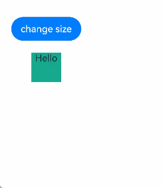

# \@Local装饰器：组件内部状态
<!--Kit: ArkUI-->
<!--Subsystem: ArkUI-->
<!--Owner: @jiyujia926-->
<!--Designer: @s10021109-->
<!--Tester: @TerryTsao-->
<!--Adviser: @zhang_yixin13-->

为了实现对\@ComponentV2装饰的自定义组件中变量变化的观测，开发者可以使用\@Local装饰器装饰变量。

在阅读本文档前，建议提前阅读：[\@ComponentV2](./arkts-new-componentV2.md)。

>**说明：**
>
> 从API version 12开始，在\@ComponentV2装饰的自定义组件中支持使用\@Local装饰器。
>
> 从API version 12开始，该装饰器支持在原子化服务中使用。

## 概述

\@Local表示组件内部的状态，使得自定义组件内部的变量具有观测变化的能力：

- 被\@Local装饰的变量无法从外部初始化，因此必须在组件内部进行初始化。

- 当被\@Local装饰的变量变化时，会刷新使用该变量的组件。

- \@Local支持观测number、boolean、string、Object、class等基本类型以及[Array](#装饰array类型变量)、[Set](#装饰set类型变量)、[Map](#装饰map类型变量)、[Date](#装饰date类型变量)等内嵌类型。

- \@Local的观测能力仅限于被装饰的变量本身。当装饰简单类型时，能够观测到对变量的赋值；当装饰对象类型时，仅能观测到对对象整体的赋值；当装饰数组类型时，能观测到数组整体以及数组元素项的变化；当装饰Array、Set、Map、Date等内嵌类型时，可以观测到通过API调用带来的变化。详见[观察变化](#观察变化)。

- \@Local支持null、undefined以及[联合类型](#联合类型)。

## 状态管理V1版本\@State装饰器的局限性

状态管理V1使用[\@State装饰器](arkts-state.md)定义组件中的基础状态变量，该状态变量常用来作为组件内部状态，在组件内使用。但由于\@State装饰器又能够从外部初始化，因此无法确保\@State装饰变量的初始值一定为组件内部定义的值。

  <!-- @[Local_V1_State_Decorator](https://gitcode.com/openharmony/applications_app_samples/blob/master/code/DocsSample/ArkUISample/ParadigmStateManagement/entry/src/main/ets/pages/local/LocalV1StateDecorator.ets) -->
  
  ``` TypeScript
  class ComponentInfo {
    public name: string;
    public count: number;
    public message: string;
  
    constructor(name: string, count: number, message: string) {
      this.name = name;
      this.count = count;
      this.message = message;
    }
  }
  
  @Component
  struct Child {
    @State componentInfo: ComponentInfo = new ComponentInfo('Child', 1, 'Hello World'); // 父组件传递的componentInfo会覆盖初始值
  
    build() {
      Column() {
        Text(`componentInfo.message is ${this.componentInfo.message}`)
      }
    }
  }
  
  @Entry
  @Component
  struct Index {
    build() {
      Column() {
        Child({ componentInfo: new ComponentInfo('Unknown', 0, 'Error') })
      }
    }
  }
  ```

上述代码中，可以通过在初始化Child自定义组件时传入新的值来覆盖作为内部状态变量使用的componentInfo。但Child自定义组件并不能感知到componentInfo从外部进行了初始化，这不利于自定义组件内部状态的管理。因此推出\@Local装饰器表示组件的内部状态。

## 装饰器说明

| \@Local变量装饰器 | 说明 |
| ------------------- | ------------------------------------------------------------ |
| 装饰器参数 | 无。 |
| 可装饰的变量类型 | Object、class、string、number、boolean、enum等基本类型以及Array、Date、Map、Set等内嵌类型。支持null、undefined以及联合类型。 |
| 装饰变量的初始值 | 必须本地初始化，不允许外部传入初始化。 |

## 变量传递

| 传递规则       | 说明                                                         |
| -------------- | ------------------------------------------------------------ |
| 从父组件初始化 | \@Local装饰的变量仅允许本地初始化，无法从外部传入初始化。    |
| 初始化子组件   | \@Local装饰的变量可以初始化子组件中[\@Param](arkts-new-param.md)装饰的变量。 |

## 观察变化

使用\@Local装饰的变量具有观测变化的能力。当装饰的变量发生变化时，会触发该变量绑定的UI组件刷新。

- 当装饰的变量类型为boolean、string、number时，可以观察到对变量赋值的变化。

  <!-- @[Local_Observe_Changes_Type](https://gitcode.com/openharmony/applications_app_samples/blob/master/code/DocsSample/ArkUISample/ParadigmStateManagement/entry/src/main/ets/pages/local/LocalObserveChangesType.ets) -->

- 当装饰的变量类型为类对象时，仅可以观察到对类对象整体赋值的变化，无法直接观察到对类成员属性赋值的变化，对类成员属性的观察依赖[\@ObservedV2](arkts-new-observedV2-and-trace.md)和[\@Trace](arkts-new-observedV2-and-trace.md)装饰器。注意，API version 19之前，\@Local无法和[\@Observed](./arkts-observed-and-objectlink.md)装饰的类实例对象混用。API version 19及以后，支持部分状态管理V1V2混用能力，允许\@Local和\@Observed同时使用，详情见[状态管理V1V2混用文档](../state-management/arkts-v1-v2-mixusage.md)。

  <!-- @[Local_Observe_Changes_Decorator](https://gitcode.com/openharmony/applications_app_samples/blob/master/code/DocsSample/ArkUISample/ParadigmStateManagement/entry/src/main/ets/pages/local/LocalObserveChangesDecorator.ets) -->

- 当装饰简单类型数组时，可以观察到数组整体或数组项的变化。

  <!-- @[Local_Observe_Changes_Array](https://gitcode.com/openharmony/applications_app_samples/blob/master/code/DocsSample/ArkUISample/ParadigmStateManagement/entry/src/main/ets/pages/local/LocalObserveChangesArray.ets) -->

- 当装饰的变量是嵌套类或对象数组时，\@Local无法观察深层对象属性的变化。对深层对象属性的观测依赖\@ObservedV2与\@Trace装饰器。

  <!-- @[Local_Observe_Changes_Decorator](https://gitcode.com/openharmony/applications_app_samples/blob/master/code/DocsSample/ArkUISample/ParadigmStateManagement/entry/src/main/ets/pages/local/LocalObserveChangesDecorator.ets) -->

- 当装饰内置类型时，可以观察到变量整体赋值及API调用带来的变化。

  | 类型  | 可观测变化的API                                              |
      | ----- | ------------------------------------------------------------ |
  | Array | push, pop, shift, unshift, splice, copyWithin, fill, reverse, sort |
  | Date  | setFullYear, setMonth, setDate, setHours, setMinutes, setSeconds, setMilliseconds, setTime, setUTCFullYear, setUTCMonth, setUTCDate, setUTCHours, setUTCMinutes, setUTCSeconds, setUTCMilliseconds |
  | Map   | set, clear, delete                                           |
  | Set   | add, clear, delete                                           |

## 限制条件

\@Local装饰器存在以下使用限制：

- \@Local装饰器只能在[\@ComponentV2](arkts-new-componentV2.md)装饰的自定义组件中使用。

  ```ts
  @ComponentV2
  struct MyComponent {
    @Local message: string = 'Hello World'; // 正确用法
    build() {
    }
  }
  @Component
  struct TestComponent {
    @Local message: string = 'Hello World'; // 错误用法，编译时报错
    build() {
    }
  }
  ```

- \@Local装饰的变量表示组件内部状态，不允许从外部传入初始化。

  ```ts
  @ComponentV2
  struct ChildComponent {
    @Local message: string = 'Hello World';
    build() {
    }
  }
  @ComponentV2
  struct MyComponent {
    build() {
      ChildComponent({ message: 'Hello' }) // 错误用法，编译时报错
    }
  }
  ```

## \@Local与\@State对比

\@Local与\@State的用法、功能对比如下：

|                    | \@State                      | \@Local                         |
| ------------------ | ---------------------------- | --------------------------------- |
| 参数               | 无。                          | 无。                       |
| 从父组件初始化         | 可选。                  | 不允许外部初始化。           |
| 观察能力 | 能观测变量本身以及一层的成员属性，无法深度观测。 | 能观测变量本身，深度观测依赖\@Trace装饰器。 |
| 数据传递 | 可以作为数据源和子组件中状态变量同步。 | 可以作为数据源和子组件中状态变量同步。 |

## 使用场景

### 观测对象整体变化

被\@ObservedV2与\@Trace装饰的类对象实例，具有深度观测对象属性的能力。但当对对象整体赋值时，UI却无法刷新。使用\@Local装饰对象，可以达到观测对象本身变化的效果。

<!-- @[Local_Use_Case_Object](https://gitcode.com/openharmony/applications_app_samples/blob/master/code/DocsSample/ArkUISample/ParadigmStateManagement/entry/src/main/ets/pages/local/LocalUseCaseObject.ets) -->

### 装饰Array类型变量

当装饰的对象是Array时，可以观察到Array整体的赋值，同时可以通过调用Array的接口`push`, `pop`, `shift`, `unshift`, `splice`, `copyWithin`, `fill`, `reverse`, `sort`更新Array中的数据。

<!-- @[Local_Use_Case_Array](https://gitcode.com/openharmony/applications_app_samples/blob/master/code/DocsSample/ArkUISample/ParadigmStateManagement/entry/src/main/ets/pages/local/LocalUseCaseArray.ets) -->


### 装饰Date类型变量

当装饰的对象是Date时，可以观察到Date整体的赋值，同时可通过调用Date的接口`setFullYear`, `setMonth`, `setDate`, `setHours`, `setMinutes`, `setSeconds`, `setMilliseconds`, `setTime`, `setUTCFullYear`, `setUTCMonth`, `setUTCDate`, `setUTCHours`, `setUTCMinutes`, `setUTCSeconds`, `setUTCMilliseconds`更新Date的属性。

<!-- @[Local_Use_Case_Data](https://gitcode.com/openharmony/applications_app_samples/blob/master/code/DocsSample/ArkUISample/ParadigmStateManagement/entry/src/main/ets/pages/local/LocalUseCaseDate.ets) -->

### 装饰Map类型变量

当装饰的对象是Map时，可以观察到对Map整体的赋值，同时可以通过调用Map的接口`set`, `clear`, `delete`更新Map中的数据。

<!-- @[Local_Use_Case_Map](https://gitcode.com/openharmony/applications_app_samples/blob/master/code/DocsSample/ArkUISample/ParadigmStateManagement/entry/src/main/ets/pages/local/LocalUseCaseMap.ets) -->

### 装饰Set类型变量

当装饰的对象是Set时，可以观察到对Set整体的赋值，同时可以通过调用Set的接口`add`, `clear`, `delete`更新Set中的数据。

<!-- @[Local_Use_Case_Set](https://gitcode.com/openharmony/applications_app_samples/blob/master/code/DocsSample/ArkUISample/ParadigmStateManagement/entry/src/main/ets/pages/local/LocalUseCaseSet.ets) -->

### 联合类型

\@Local支持null、undefined以及联合类型。在下面的示例中，count类型为number | undefined，点击改变count的类型，UI会随之刷新。

<!-- @[Local_Use_Case_Join](https://gitcode.com/openharmony/applications_app_samples/blob/master/code/DocsSample/ArkUISample/ParadigmStateManagement/entry/src/main/ets/pages/local/LocalUseCaseJoin.ets) -->

## 常见问题

### 复杂类型常量重复赋值给状态变量触发刷新

<!-- @[Local_Question_Spark_Update](https://gitcode.com/openharmony/applications_app_samples/blob/master/code/DocsSample/ArkUISample/ParadigmStateManagement/entry/src/main/ets/pages/local/LocalQuestionSparkUpdate.ets) -->

以上示例每次点击Button('change to self')，把相同的Array类型常量赋值给一个Array类型的状态变量，都会触发刷新。原因是在状态管理V2中，会给使用状态变量装饰器如@Trace、@Local装饰的Date、Map、Set、Array添加一层代理用于观测API调用产生的变化。  
当再次赋值`list[0]`时，`dataObjFromList`已经是Proxy类型，而`list[0]`是Array类型。由于类型不相等，会触发赋值和刷新。
为了避免这种不必要的赋值和刷新，可以使用[UIUtils.getTarget()](./arkts-new-getTarget.md)获取原始对象提前进行新旧值的判断，当两者相同时不执行赋值。

使用UIUtils.getTarget()方法示例。

<!-- @[Local_Question_UIUtils](https://gitcode.com/openharmony/applications_app_samples/blob/master/code/DocsSample/ArkUISample/ParadigmStateManagement/entry/src/main/ets/pages/local/LocalQuestionUIUtils.ets) -->

### 在状态管理V2中使用animateTo动画效果异常

在下面的场景中，[animateTo](../../reference/apis-arkui/arkts-apis-uicontext-uicontext.md#animateto)暂不支持直接在状态管理V2中使用。

<!-- @[Local_Question_V2_animateTo](https://gitcode.com/openharmony/applications_app_samples/blob/master/code/DocsSample/ArkUISample/ParadigmStateManagement/entry/src/main/ets/pages/local/LocalQuestionV2animateTo.ets) -->

上述代码中，开发者预期的动画效果是：绿色矩形从长宽100变为200，字符串从`Hello World`变为`Hello ArkUI`。但由于当前animateTo与V2的刷新机制不兼容，执行动画前的额外修改未生效，实际显示的动画效果是：绿色矩形从长宽50变为200，字符串从`Hello`变为`Hello ArkUI`。



可以通过下面的方法暂时获得预期的显示效果。

<!-- @[Local_Question_Expected_Effect](https://gitcode.com/openharmony/applications_app_samples/blob/master/code/DocsSample/ArkUISample/ParadigmStateManagement/entry/src/main/ets/pages/local/LocalQuestionExpectedEffect.ets) -->

原理为使用一个duration为0的[animateToImmediately](../../reference/apis-arkui/arkui-ts/ts-explicit-animatetoimmediately.md)将额外的修改先刷新，再执行原来的动画达成预期的效果。

